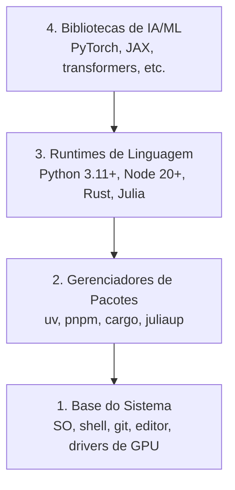

# Ambiente de Desenvolvimento

> Suas ferramentas moldam seu pensamento. Configure uma vez, configure certo.

**Tipo:** Build
**Linguagens:** Python, Node.js, Rust
**Pré-requisitos:** Nenhum
**Tempo:** ~45 minutos

## Objetivos de Aprendizado

- Configurar toolchains de Python 3.11+, Node.js 20+ e Rust do zero
- Configurar ambientes virtuais e gerenciadores de pacotes para builds reproduzíveis
- Verificar acesso a GPU com CUDA/MPS e rodar uma operação de teste com tensores
- Entender a pilha de quatro camadas: sistema, pacotes, runtimes, bibliotecas de IA

## O Problema

Você vai aprender engenharia de IA ao longo de mais de 200 aulas usando Python, TypeScript, Rust e Julia. Se seu ambiente estiver quebrado, cada aula vira uma briga contra as ferramentas em vez de aprendizado.

A maioria das pessoas pula a configuração do ambiente. Aí gastam horas debugando erros de import, conflitos de versão e drivers CUDA faltando. A gente vai fazer isso uma vez, direito.

## O Conceito

Um ambiente de engenharia de IA tem quatro camadas:



A gente instala de baixo pra cima. Cada camada depende da de baixo.

## Construa

### Passo 1: Base do Sistema

Cheque seu sistema e instale o básico.

```bash
# macOS
xcode-select --install
brew install git curl wget

# Ubuntu/Debian
sudo apt update && sudo apt install -y build-essential git curl wget

# Windows (use WSL2)
wsl --install -d Ubuntu-24.04
```

### Passo 2: Python com uv

A gente usa `uv` — é 10-100x mais rápido que pip e lida com ambientes virtuais automaticamente.

```bash
curl -LsSf https://astral.sh/uv/install.sh | sh

uv python install 3.12

uv venv
source .venv/bin/activate  # or .venv\Scripts\activate on Windows

uv pip install numpy matplotlib jupyter
```

Verifique:

```python
import sys
print(f"Python {sys.version}")

import numpy as np
print(f"NumPy {np.__version__}")
a = np.array([1, 2, 3])
print(f"Vector: {a}, dot product with itself: {np.dot(a, a)}")
```

### Passo 3: Node.js com pnpm

Para aulas com TypeScript (agents, servidores MCP, apps web).

```bash
curl -fsSL https://fnm.vercel.app/install | bash
fnm install 22
fnm use 22

npm install -g pnpm

node -e "console.log('Node', process.version)"
```

### Passo 4: Rust

Para aulas com foco em performance (inferência, sistemas).

```bash
curl --proto '=https' --tlsv1.2 -sSf https://sh.rustup.rs | sh

rustc --version
cargo --version
```

### Passo 5: Julia (Opcional)

Para aulas pesadas em matemática onde Julia brilha.

```bash
curl -fsSL https://install.julialang.org | sh

julia -e 'println("Julia ", VERSION)'
```

### Passo 6: Configuração de GPU (Se Você Tiver)

```bash
# NVIDIA
nvidia-smi

# Install PyTorch with CUDA
uv pip install torch torchvision torchaudio --index-url https://download.pytorch.org/whl/cu124
```

```python
import torch
print(f"CUDA available: {torch.cuda.is_available()}")
if torch.cuda.is_available():
    print(f"GPU: {torch.cuda.get_device_name(0)}")
```

Sem GPU? Sem problema. A maioria das aulas roda em CPU. Para aulas pesadas em treino, use Google Colab ou GPUs na nuvem.

### Passo 7: Verifique Tudo

Execute o script de verificação:

```bash
python phases/00-setup-and-tooling/01-dev-environment/code/verify.py
```

## Use

Seu ambiente agora está pronto para cada aula deste curso. Veja onde você vai usar o quê:

| Linguagem | Usado em | Gerenciador de Pacotes |
|-----------|----------|----------------------|
| Python | Fases 1-12 (ML, DL, NLP, Visão, Áudio, LLMs) | uv |
| TypeScript | Fases 13-17 (Ferramentas, Agents, Enxames, Infra) | pnpm |
| Rust | Fases 12, 15-17 (Sistemas com foco em performance) | cargo |
| Julia | Fase 1 (Base matemática) | Pkg |

## Entregue

Esta aula produz um script de verificação que qualquer pessoa pode rodar para checar a configuração.

Veja `outputs/prompt-env-check.md` para um prompt que ajuda assistentes de IA a diagnosticar problemas de ambiente.

## Exercícios

1. Execute o script de verificação e corrija qualquer falha
2. Crie um ambiente virtual Python para este curso e instale PyTorch
3. Escreva um "hello world" nas quatro linguagens e rode cada uma
