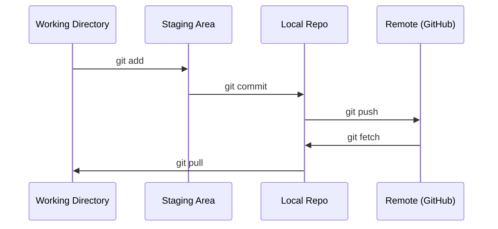

# Git e Colaboração

> Controle de versão não é opcional. Cada experimento, cada modelo, cada aula que você construir aqui fica rastreado.

**Tipo:** Learn
**Linguagens:** --
**Pré-requisitos:** Fase 0, Aula 01
**Tempo:** ~30 minutos

## Objetivos de Aprendizado

- Configurar identidade do git e usar o fluxo de trabalho diário de add, commit e push
- Criar e merge branches para experimentos isolados sem quebrar o main
- Escrever um `.gitignore` que exclua checkpoints de modelos e arquivos binários grandes
- Navegar no histórico de commits com `git log` para entender a evolução do projeto

## O Problema

Você vai escrever centenas de arquivos de código ao longo de 20 fases. Sem controle de versão, você vai perder trabalho, quebrar coisas que não dá pra desfazer, e não ter como colaborar com outros.

Git é a ferramenta. GitHub é onde o código vive. Esta aula cobre o que você precisa pra este curso e nada mais.

## O Conceito



Três coisas pra lembrar:
1. Salve com frequência (`git commit`)
2. Faça push pro remote (`git push`)
3. Faça branch pra experimentos (`git checkout -b experiment`)

## Construa

### Passo 1: Configure o git

```bash
git config --global user.name "Seu Nome"
git config --global user.email "voce@exemplo.com"
```

### Passo 2: O fluxo diário

```bash
git status
git add file.py
git commit -m "Add perceptron implementation"
git push origin main
```

### Passo 3: Branching para experimentos

```bash
git checkout -b experiment/new-optimizer

# ... faça mudanças, commit ...

git checkout main
git merge experiment/new-optimizer
```

### Passo 4: Trabalhando com o repositório deste curso

```bash
git clone https://github.com/rohitg00/ai-engineering-from-scratch.git
cd ai-engineering-from-scratch

git checkout -b my-progress
# percorra as aulas, faça commit do seu código
git push origin my-progress
```

## Use

Para este curso, você precisa exatamente desses comandos:

| Comando | Quando |
|---------|--------|
| `git clone` | Pegar o repositório do curso |
| `git add` + `git commit` | Salvar seu trabalho |
| `git push` | Fazer backup no GitHub |
| `git checkout -b` | Tentar algo sem quebrar o main |
| `git log --oneline` | Ver o que você já fez |

É isso. Você não precisa de rebase, cherry-pick ou submodules pra este curso.

## Exercícios

1. Clone este repositório, crie uma branch chamada `my-progress`, crie um arquivo, faça commit e push
2. Crie um `.gitignore` que exclua arquivos de checkpoint de modelos (`.pt`, `.pth`, `.safetensors`)
3. Veja o histórico de commits deste repositório com `git log --oneline` e leia como as aulas foram adicionadas

## Termos-Chave

| Termo | O que as pessoas dizem | O que realmente significa |
|-------|----------------------|--------------------------|
| Commit | "Salvar" | Um snapshot do seu projeto inteiro num ponto no tempo |
| Branch | "Uma cópia" | Um ponteiro para um commit que avança conforme você trabalha |
| Merge | "Combinar código" | Pegar mudanças de uma branch e aplicá-las em outra |
| Remote | "A nuvem" | Uma cópia do seu repositório hospedada em outro lugar (GitHub, GitLab) |
