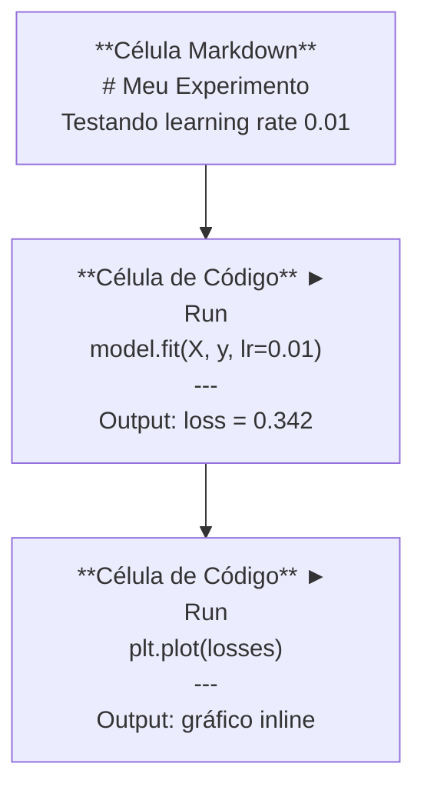
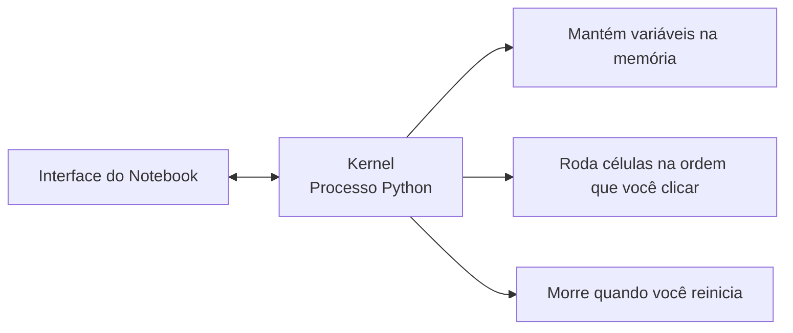

# Jupyter Notebooks

> Notebooks são o laboratório da engenharia de IA. Você prototipa aqui, depois move o que funciona pra produção.

**Tipo:** Build
**Linguagens:** Python
**Pré-requisitos:** Fase 0, Aula 01
**Tempo:** ~30 minutos

## Objetivos de Aprendizado

- Instalar e iniciar JupyterLab, Jupyter Notebook ou VS Code com extensão Jupyter
- Usar magic commands (`%timeit`, `%%time`, `%matplotlib inline`) para benchmark e visualização inline
- Distinguir quando usar notebooks vs scripts e aplicar o fluxo "explorar em notebooks, entregar em scripts"
- Identificar e evitar armadilhas comuns de notebooks: execução fora de ordem, estado escondido e vazamentos de memória

## O Problema

Todo paper de IA, tutorial e competição do Kaggle usa Jupyter notebooks. Eles deixam você rodar código em partes, ver outputs inline, misturar código com explicações e iterar rápido. Se você tentar aprender IA sem notebooks, está fazando lição de matemática sem rascunho.

Mas notebooks têm armadilhas reais. Pessoas usam pra tudo, inclusive coisas que são péssimas pra isso. Saber quando usar um notebook e quando usar um script vai te poupar pesadelos de debug lá na frente.

## O Conceito

Um notebook é uma lista de células. Cada célula é código ou texto.



O kernel é um processo Python rodando em background. Quando você executa uma célula, ela manda o código pro kernel, que executa e devolve o resultado. Todas as células compartilham o mesmo kernel, então variáveis persistem entre células.



Essa parte de "na ordem que você clicar" é tanto o superpoder quanto o tiro no pé.

## Construa

### Passo 1: Escolha sua interface

Três opções, um formato:

| Interface | Instalação | Melhor para |
|-----------|-----------|-------------|
| JupyterLab | `pip install jupyterlab` depois `jupyter lab` | Experiência IDE completa, múltiplas abas, file browser, terminal |
| Jupyter Notebook | `pip install notebook` depois `jupyter notebook` | Simples, leve, um notebook por vez |
| VS Code | Instalar extensão "Jupyter" | Já no seu editor, integração com git, debug |

Todos leem e escrevem o mesmo arquivo `.ipynb`. Escolha o que quiser. JupyterLab é o mais comum em trabalho de IA.

```bash
pip install jupyterlab
jupyter lab
```

### Passo 2: Atalhos de teclado importantes

Você opera em dois modos. Pressione `Escape` para modo comando (barra azul à esquerda), `Enter` para modo edição (barra verde).

**Modo comando (mais usado):**

| Tecla | Ação |
|-------|------|
| `Shift+Enter` | Rodar célula, ir pra próxima |
| `A` | Inserir célula acima |
| `B` | Inserir célula abaixo |
| `DD` | Deletar célula |
| `M` | Converter pra markdown |
| `Y` | Converter pra código |
| `Z` | Desfazer operação na célula |
| `Ctrl+Shift+H` | Mostrar todos os atalhos |

**Modo edição:**

| Tecla | Ação |
|-------|------|
| `Tab` | Autocomplete |
| `Shift+Tab` | Mostrar assinatura da função |
| `Ctrl+/` | Toggle comentário |

`Shift+Enter` é o que você vai usar mil vezes por dia. Aprenda primeiro.

### Passo 3: Tipos de célula

**Células de código** rodam Python e mostram a saída:

```python
import numpy as np
data = np.random.randn(1000)
data.mean(), data.std()
```

Output: `(0.0032, 0.9987)`

**Células de markdown** renderizam texto formatado. Use pra documentar o que está fazendo e por quê. Suporta cabeçalhos, negrito, itálico, matemática LaTeX (`$E = mc^2$`), tabelas e imagens.

### Passo 4: Magic commands

Esses não são Python. São comandos específicos do Jupyter que começam com `%` (magic de linha) ou `%%` (magic de célula).

**Meça o tempo do seu código:**

```python
%timeit np.random.randn(10000)
```

Output: `45.2 us +/- 1.3 us per loop`

```python
%%time
model.fit(X_train, y_train, epochs=10)
```

Output: `Wall time: 2.34 s`

`%timeit` roda o código várias vezes e tira a média. `%%time` roda uma vez. Use `%timeit` para microbenchmarks, `%%time` para runs de treino.

**Ative gráficos inline:**

```python
%matplotlib inline
```

Cada `plt.plot()` ou `plt.show()` agora renderiza direto no notebook.

**Instale pacotes sem sair do notebook:**

```python
!pip install scikit-learn
```

O prefixo `!` roda qualquer comando de shell.

### Passo 5: Exiba saída rica inline

Notebooks exibem automaticamente a última expressão de uma célula. Mas você pode controlar:

```python
import pandas as pd

df = pd.DataFrame({
    "model": ["Linear", "Random Forest", "Neural Net"],
    "accuracy": [0.72, 0.89, 0.94],
    "training_time": [0.1, 2.3, 45.6]
})
df
```

Isso renderiza uma tabela HTML formatada, não um dump de texto. O mesmo vale pra gráficos:

```python
import matplotlib.pyplot as plt

plt.figure(figsize=(8, 4))
plt.plot([1, 2, 3, 4], [1, 4, 2, 3])
plt.title("Inline Plot")
plt.show()
```

### Passo 6: Google Colab

Colab é um Jupyter notebook gratuito na nuvem. Ele te dá GPU, bibliotecas pré-instaladas e integração com Google Drive. Nenhum setup necessário.

1. Acesse [colab.research.google.com](https://colab.research.google.com)
2. Faça upload de qualquer arquivo `.ipynb` deste curso
3. Runtime > Change runtime type > T4 GPU (gratuito)

Diferenças do Colab pro Jupyter local:
- Arquivos não persistem entre sessões (salve no Drive ou baixe)
- Pré-instalado: numpy, pandas, matplotlib, torch, tensorflow, sklearn
- `from google.colab import files` para upload/download de arquivos
- `from google.colab import drive; drive.mount('/content/drive')` para armazenamento persistente
- Sessões expiram após 90 minutos de inatividade (plano gratuito)

## Use

### Notebooks vs Scripts: Quando usar qual

| Use notebooks para | Use scripts para |
|-------------------|-----------------|
| Explorar um dataset | Pipelines de treino |
| Prototipar um modelo | Utilitários reutilizáveis |
| Visualizar resultados | Qualquer coisa com `if __name__` |
| Explicar seu trabalho | Código que roda em agendamento |
| Experimentos rápidos | Código de produção |
| Exercícios do curso | Pacotes e bibliotecas |

A regra: **explorar em notebooks, entregar em scripts**.

Um fluxo de trabalho comum em IA:
1. Explore dados num notebook
2. Prototipe seu modelo no notebook
3. Quando funcionar, mova o código para arquivos `.py`
4. Importe esses arquivos `.py` de volta ao notebook para mais experimentos

### Armadilhas comuns

**Execução fora de ordem.** Você roda a célula 5, depois a 2, depois a 7. O notebook funciona na sua máquina mas quebra quando alguém roda de cima a baixo. Solução: Kernel > Restart & Run All antes de compartilhar.

**Estado escondido.** Você deleta uma célula mas a variável que ela criou ainda está na memória. O notebook parece limpo mas depende de uma célula fantasma. Solução: Reinicie o kernel regularmente.

**Vazamentos de memória.** Carregar um dataset de 4GB, treinar um modelo, carregar outro dataset. Nada é liberado. Solução: `del nome_variavel` e `gc.collect()`, ou reinicie o kernel.

## Entregue

Esta aula produz:
- `outputs/prompt-notebook-helper.md` para debug de problemas com notebooks

## Exercícios

1. Abra o JupyterLab, crie um notebook e use `%timeit` para comparar list comprehension vs numpy para criar um array de 100.000 números aleatórios
2. Crie um notebook com células de markdown e código que carrega um CSV, exibe um dataframe e plota um gráfico. Depois rode Kernel > Restart & Run All para verificar que funciona de cima a baixo
3. Pegue o código de `code/notebook_tips.py`, cole num notebook do Colab e rode com GPU gratuita

## Termos-Chave

| Termo | O que dizem | O que realmente significa |
|-------|-------------|--------------------------|
| Kernel | "A coisa que roda meu código" | Um processo Python separado que executa células e mantém variáveis na memória |
| Célula | "Um bloco de código" | Uma unidade executável independente num notebook, podendo ser código ou markdown |
| Magic command | "Truques do Jupyter" | Comandos especiais prefixados com `%` ou `%%` que controlam o ambiente do notebook |
| `.ipynb` | "Arquivo de notebook" | Um arquivo JSON contendo células, outputs e metadados. Significa IPython Notebook |

## Leitura Complementar

- [Documentação do JupyterLab](https://jupyterlab.readthedocs.io/) para o conjunto completo de funcionalidades
- [FAQ do Google Colab](https://research.google.com/colaboratory/faq.html) para limites e funcionalidades específicas do Colab
- [28 Dicas de Jupyter Notebook](https://www.dataquest.io/blog/jupyter-notebook-tips-tricks-shortcuts/) para atalhos de power user
