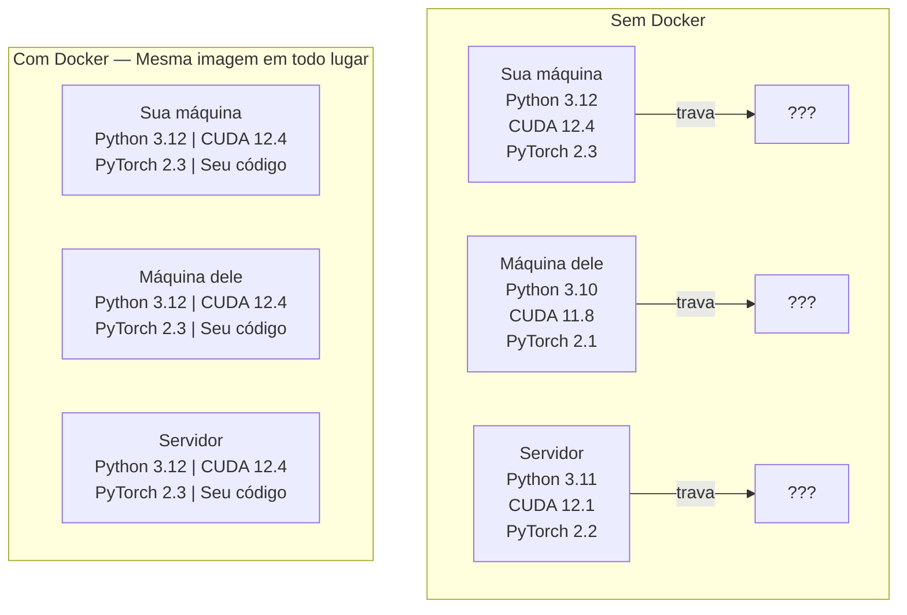

# Docker para IA

> Containers fazem "funciona na minha máquina" uma coisa do passado.

**Tipo:** Build
**Linguagens:** Docker
**Pré-requisitos:** Fase 0, Aulas 01 e 03
**Tempo:** ~60 minutos

## Objetivos de Aprendizado

- Construir uma imagem Docker habilitada para GPU com CUDA, PyTorch e bibliotecas de IA a partir de um Dockerfile
- Montar diretórios do host como volumes para persistir modelos, datasets e código entre rebuilds do container
- Configurar o NVIDIA Container Toolkit para expor GPUs dentro de containers
- Orquestrar aplicações de IA multi-serviço (servidor de inferência + banco de dados vetorial) usando Docker Compose

## O Problema

Você treinou um modelo no seu notebook com PyTorch 2.3, CUDA 12.4 e Python 3.12. Seu colega tem PyTorch 2.1, CUDA 11.8 e Python 3.10. Seu modelo trava na máquina dele. Seu Dockerfile funciona nos dois.

Projetos de IA são pesadelos de dependência. Uma stack típica inclui Python, PyTorch, drivers CUDA, cuDNN, bibliotecas C de nível de sistema e pacotes especializados como flash-attn que precisam de versões exatas de compiladores. Docker empacota tudo isso em uma imagem única que roda identicamente em qualquer lugar.

## O Conceito

Docker empacota seu código, runtime, bibliotecas e ferramentas de sistema em uma unidade isolada chamada container. Pense nele como uma máquina virtual leve, exceto que ele compartilha o kernel do SO hospedeiro em vez de rodar o seu próprio, então ele inicia em segundos em vez de minutos.



### Por que projetos de IA precisam de Docker mais do que outros

1. **Drivers GPU são frágeis.** Código CUDA 12.4 não roda em CUDA 11.8. Docker isola o toolkit CUDA dentro do container enquanto compartilha o driver da GPU do host através do NVIDIA Container Toolkit.

2. **Pesos de modelos são grandes.** Um modelo de 7B parâmetros tem 14 GB em fp16. Você não quer baixá-lo de novo toda vez que reconstruir. Volumes Docker permitem montar um diretório de modelos do host.

3. **Arquiteturas multi-serviço são comuns.** Uma aplicação de IA real não é só um script Python. É um servidor de inferência, um banco de dados vetorial para RAG, talvez um frontend web. Docker Compose orquestra tudo isso com um comando.

### Vocabulário-chave

| Termo | O que significa |
|-------|-----------------|
| Imagem | Um template somente-leitura. Sua receita. Construída a partir de um Dockerfile. |
| Container | Uma instância rodando de uma imagem. Sua cozinha. |
| Dockerfile | Instruções para construir uma imagem. Camada por camada. |
| Volume | Armazenamento persistente que sobrevive a reinicializações do container. |
| docker-compose | Uma ferramenta para definir aplicações multi-container em YAML. |

### Padrões comuns de containers em IA

```
Dev Container
  Toolkit completo. Suporte a editor. Jupyter. Ferramentas de debug.
  Usado durante desenvolvimento e experimentação.

Training Container
  Mínimo. Apenas o script de treino e dependências.
  Roda em clusters GPU. Sem editor, sem Jupyter.

Inference Container
  Otimizado para servir. Imagem pequena. Cold start rápido.
  Roda atrás de um load balancer em produção.
```

## Construa

### Passo 1: Instale Docker

```bash
# macOS
brew install --cask docker
open /Applications/Docker.app

# Ubuntu
curl -fsSL https://get.docker.com | sh
sudo usermod -aG docker $USER
# Faça logout e login novamente para o grupo ter efeito
```

Verifique:

```bash
docker --version
docker run hello-world
```

### Passo 2: Instale o NVIDIA Container Toolkit (Linux com GPU NVIDIA)

Isso permite que containers Docker acessem sua GPU. Usuários de macOS e Windows (WSL2) podem pular isso; o Docker Desktop lida com passagem de GPU de forma diferente nessas plataformas.

```bash
distribution=$(. /etc/os-release;echo $ID$VERSION_ID)
curl -fsSL https://nvidia.github.io/libnvidia-container/gpgkey | sudo gpg --dearmor -o /usr/share/keyrings/nvidia-container-toolkit-keyring.gpg
curl -s -L https://nvidia.github.io/libnvidia-container/$distribution/libnvidia-container.list | \
    sed 's#deb https://#deb [signed-by=/usr/share/keyrings/nvidia-container-toolkit-keyring.gpg] https://#g' | \
    sudo tee /etc/apt/sources.list.d/nvidia-container-toolkit.list

sudo apt-get update
sudo apt-get install -y nvidia-container-toolkit
sudo nvidia-ctk runtime configure --runtime=docker
sudo systemctl restart docker
```

Teste o acesso à GPU dentro de um container:

```bash
docker run --rm --gpus all nvidia/cuda:12.4.1-base-ubuntu22.04 nvidia-smi
```

Se você vir as informações da sua GPU, o toolkit está funcionando.

### Passo 3: Entenda as imagens base

Escolher a imagem base certa economiza horas de debugging.

```
nvidia/cuda:12.4.1-devel-ubuntu22.04
  Toolkit CUDA completo. Compiladores incluídos.
  Usar para: construir pacotes que precisam de nvcc (flash-attn, bitsandbytes)
  Tamanho: ~4 GB

nvidia/cuda:12.4.1-runtime-ubuntu22.04
  Apenas runtime CUDA. Sem compiladores.
  Usar para: rodar código pré-compilado
  Tamanho: ~1.5 GB

pytorch/pytorch:2.3.1-cuda12.4-cudnn9-runtime
  PyTorch pré-instalado sobre CUDA.
  Usar para: pular o passo de instalação do PyTorch
  Tamanho: ~6 GB

python:3.12-slim
  Sem CUDA. Só CPU.
  Usar para: inferência em CPU, ferramentas leves
  Tamanho: ~150 MB
```

### Passo 4: Escreva um Dockerfile para desenvolvimento de IA

Aqui está o Dockerfile em `code/Dockerfile`. Percorra ele:

```dockerfile
FROM nvidia/cuda:12.4.1-devel-ubuntu22.04

ENV DEBIAN_FRONTEND=noninteractive
ENV PYTHONUNBUFFERED=1

RUN apt-get update && apt-get install -y --no-install-recommends \
    python3.12 \
    python3.12-venv \
    python3.12-dev \
    python3-pip \
    git \
    curl \
    build-essential \
    && rm -rf /var/lib/apt/lists/*

RUN update-alternatives --install /usr/bin/python python /usr/bin/python3.12 1

RUN python -m pip install --no-cache-dir --upgrade pip setuptools wheel

RUN python -m pip install --no-cache-dir \
    torch==2.3.1 \
    torchvision==0.18.1 \
    torchaudio==2.3.1 \
    --index-url https://download.pytorch.org/whl/cu124

RUN python -m pip install --no-cache-dir \
    numpy \
    pandas \
    scikit-learn \
    matplotlib \
    jupyter \
    transformers \
    datasets \
    accelerate \
    safetensors

WORKDIR /workspace

VOLUME ["/workspace", "/models"]

EXPOSE 8888

CMD ["python"]
```

Construa:

```bash
docker build -t ai-dev -f phases/00-setup-and-tooling/07-docker-for-ai/code/Dockerfile .
```

Isso leva um tempo na primeira vez (baixando imagem base CUDA + PyTorch). Builds subsequentes usam camadas em cache.

Execute:

```bash
docker run --rm -it --gpus all \
    -v $(pwd):/workspace \
    -v ~/models:/models \
    ai-dev python -c "import torch; print(f'PyTorch {torch.__version__}, CUDA: {torch.cuda.is_available()}')"
```

Rode Jupyter dentro do container:

```bash
docker run --rm -it --gpus all \
    -v $(pwd):/workspace \
    -v ~/models:/models \
    -p 8888:8888 \
    ai-dev jupyter notebook --ip=0.0.0.0 --port=8888 --no-browser --allow-root
```

### Passo 5: Mounts de volume para dados e modelos

Mounts de volume são críticos para trabalho com IA. Sem eles, seus 14 GB de download de modelo desaparecem quando o container para.

```bash
# Monte seu código
-v $(pwd):/workspace

# Monte um diretório compartilhado de modelos
-v ~/models:/models

# Monte datasets
-v ~/datasets:/data
```

Dentro do seu script de treino, carregue do caminho montado:

```python
from transformers import AutoModel

model = AutoModel.from_pretrained("/models/llama-7b")
```

O modelo vive no seu sistema de arquivos host. Reconstrua o container quantas vezes quiser sem baixar novamente.

### Passo 6: Docker Compose para apps de IA multi-serviço

Uma aplicação RAG real precisa de um servidor de inferência e um banco de dados vetorial. Docker Compose roda os dois com um comando.

Veja `code/docker-compose.yml`:

```yaml
services:
  ai-dev:
    build:
      context: .
      dockerfile: Dockerfile
    deploy:
      resources:
        reservations:
          devices:
            - driver: nvidia
              count: all
              capabilities: [gpu]
    volumes:
      - ../../../:/workspace
      - ~/models:/models
      - ~/datasets:/data
    ports:
      - "8888:8888"
    stdin_open: true
    tty: true
    command: jupyter notebook --ip=0.0.0.0 --port=8888 --no-browser --allow-root

  qdrant:
    image: qdrant/qdrant:v1.12.5
    ports:
      - "6333:6333"
      - "6334:6334"
    volumes:
      - qdrant_data:/qdrant/storage

volumes:
  qdrant_data:
```

Inicie tudo:

```bash
cd phases/00-setup-and-tooling/07-docker-for-ai/code
docker compose up -d
```

Agora seu container de dev de IA consegue acessar o banco de dados vetorial em `http://qdrant:6333` pelo nome do serviço. Docker Compose cria uma rede compartilhada automaticamente.

Teste a conexão de dentro do container de IA:

```python
from qdrant_client import QdrantClient

client = QdrantClient(host="qdrant", port=6333)
print(client.get_collections())
```

Pare tudo:

```bash
docker compose down
```

Adicione `-v` para também deletar o volume do qdrant:

```bash
docker compose down -v
```

### Passo 7: Comandos Docker úteis para trabalho com IA

```bash
# Listar containers rodando
docker ps

# Listar todas as imagens e seus tamanhos
docker images

# Remover imagens não usadas (recuperar espaço em disco)
docker system prune -a

# Verificar uso de GPU dentro de um container rodando
docker exec -it <container_id> nvidia-smi

# Copiar um arquivo do container para o host
docker cp <container_id>:/workspace/results.csv ./results.csv

# Ver logs do container
docker logs -f <container_id>
```

## Use

Você agora tem um ambiente de desenvolvimento de IA reproduzível. Para o resto deste curso:

- Use `docker compose up` para iniciar seu ambiente de desenvolvimento e banco de dados vetorial juntos
- Monte seu código, modelos e dados como volumes para que nada seja perdido entre rebuilds
- Quando uma aula exigir um novo pacote Python, adicione ao Dockerfile e reconstrua
- Compartilhe seu Dockerfile com colegas. Eles terão o mesmo ambiente exato.

### Sem GPU?

Remova a flag `--gpus all` e o bloco de deploy NVIDIA. O container ainda funciona para aulas baseadas em CPU. PyTorch detecta a ausência de CUDA e cai para CPU automaticamente.

## Exercícios

1. Construa o Dockerfile e rode `python -c "import torch; print(torch.__version__)"` dentro do container
2. Inicie a stack do docker-compose e verifique que o Qdrant está acessível do container de IA em `http://qdrant:6333/collections`
3. Adicione `flask` ao Dockerfile, reconstrua e rode um servidor de API simples na porta 5000. Mapeie a porta com `-p 5000:5000`
4. Meça o tamanho da imagem com `docker images`. Tente trocar a imagem base de `devel` para `runtime` e compare os tamanhos

## Termos-chave

| Termo | O que as pessoas dizem | O que realmente significa |
|-------|------------------------|---------------------------|
| Container | "VM leve" | Um processo isolado usando o kernel do host, com seu próprio sistema de arquivos e rede |
| Camada de imagem | "Passo cacheado" | Cada instrução do Dockerfile cria uma camada. Camadas inalteradas são cacheadas, então rebuilds são rápidos. |
| NVIDIA Container Toolkit | "GPU no Docker" | Um hook de runtime que expõe GPUs do host para containers via flag `--gpus` |
| Mount de volume | "Pasta compartilhada" | Um diretório no host mapeado dentro do container. Mudanças persistem após o container parar. |
| Imagem base | "Ponto de partida" | A imagem `FROM` sobre a qual seu Dockerfile constrói. Determina o que está pré-instalado. |
