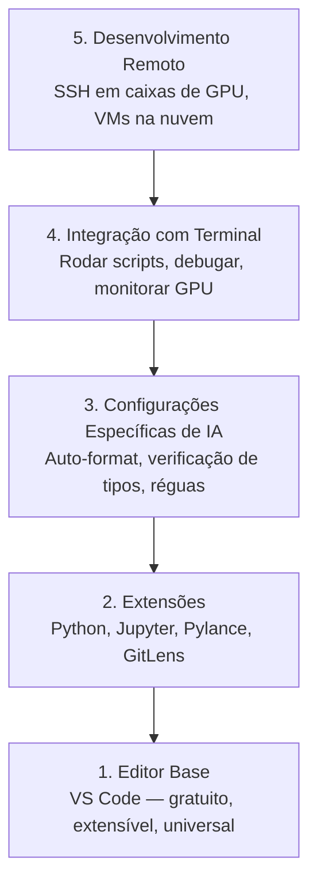

# Configuração do Editor

> Seu editor é seu copiloto. Configure uma vez pra que ele não atrapalhe e comece a carregar seu peso.

**Tipo:** Build
**Linguagens:** --
**Pré-requisitos:** Fase 0, Aula 01
**Tempo:** ~20 minutos

## Objetivos de Aprendizado

- Instalar VS Code com extensões essenciais para Python, Jupyter, linting e SSH remoto
- Configurar formatação ao salvar, verificação de tipos e scroll de output de notebook para fluxos de trabalho de IA
- Configurar Remote SSH para editar e debugar código em máquinas remotas de GPU como se fossem locais
- Avaliar alternativas de editor (Cursor, Windsurf, Neovim) e seus tradeoffs para trabalho de IA

## O Problema

Você vai gastar milhares de horas dentro do seu editor escrevendo Python, rodando notebooks, debugando loops de treino e fazendo SSH em caixas de GPU. Um editor mal configurado transforma cada sessão em atrito: sem autocomplete, sem type hints, sem erros inline, formatação manual e um fluxo de terminal desajeitado.

A configuração certa leva 20 minutos. Pular isso custa 20 minutos todo dia.

## O Conceito

Uma configuração de editor para engenharia de IA precisa de cinco coisas:



## Construa

### Passo 1: Instale o VS Code

O VS Code é o editor recomendado. É gratuito, roda em qualquer SO, tem suporte de primeira classe a Jupyter notebooks e o ecossistema de extensões cobre tudo que você precisa para trabalho de IA.

Baixe em [code.visualstudio.com](https://code.visualstudio.com/).

Verifique pelo terminal:

```bash
code --version
```

Se `code` não for encontrado no macOS, abra o VS Code, pressione `Cmd+Shift+P`, digite "Shell Command" e selecione "Install 'code' command in PATH".

### Passo 2: Instale as Extensões Essenciais

Abra o terminal integrado no VS Code (`Ctrl+`` ` ou `` Cmd+` ``) e instale as extensões que importam para trabalho de IA:

```bash
code --install-extension ms-python.python
code --install-extension ms-python.vscode-pylance
code --install-extension ms-toolsai.jupyter
code --install-extension eamodio.gitlens
code --install-extension ms-vscode-remote.remote-ssh
code --install-extension ms-python.debugpy
code --install-extension ms-python.black-formatter
code --install-extension charliermarsh.ruff
```

O que cada uma faz:

| Extensão | Por quê |
|-----------|---------|
| Python | Suporte de linguagem, detecção de venv, run/debug |
| Pylance | Verificação de tipos rápida, autocomplete, resolução de imports |
| Jupyter | Rodar notebooks dentro do VS Code, explorador de variáveis |
| GitLens | Ver quem mudou o quê, git blame inline |
| Remote SSH | Abrir uma pasta em uma caixa de GPU remota como se fosse local |
| Debugpy | Step-through debugging para Python |
| Black Formatter | Auto-formatação ao salvar, estilo consistente |
| Ruff | Linting rápido, captura erros comuns |

O arquivo `code/.vscode/extensions.json` desta aula contém a lista completa de recomendações. Quando você abrir a pasta do projeto, o VS Code vai te perguntar se quer instalá-las.

### Passo 3: Configure as Configurações

Copie as configurações de `code/.vscode/settings.json` desta aula, ou aplique-as manualmente em `Settings > Open Settings (JSON)`.

As principais configurações para trabalho de IA:

```jsonc
{
    "python.analysis.typeCheckingMode": "basic",
    "editor.formatOnSave": true,
    "editor.rulers": [88, 120],
    "notebook.output.scrolling": true,
    "files.autoSave": "afterDelay"
}
```

Por que isso importa:

- **Type checking no básico**: Captura tipos de argumento errados antes de rodar. Economiza tempo de debug em incompatibilidades de formato de tensor e parâmetros de API incorretos.
- **Formatar ao salvar**: Nunca mais pense em formatação. Black cuida disso.
- **Réguas em 88 e 120**: Black quebra linhas em 88. O marcador 120 mostra quando docstrings e comentários estão ficando longos demais.
- **Scroll de output do notebook**: Loops de treino imprimem milhares de linhas. Sem scroll, o painel de output explode.
- **Auto-salvar**: Você vai esquecer de salvar. Seu script de treino vai rodar código desatualizado. Auto-salvar previne isso.

### Passo 4: Integração com Terminal

O terminal integrado do VS Code é onde você roda scripts de treino, monitora GPUs e gerencia ambientes.

Configure corretamente:

```jsonc
{
    "terminal.integrated.defaultProfile.osx": "zsh",
    "terminal.integrated.defaultProfile.linux": "bash",
    "terminal.integrated.fontSize": 13,
    "terminal.integrated.scrollback": 10000
}
```

Atalhos úteis:

| Ação | macOS | Linux/Windows |
|------|-------|---------------|
| Abrir/fechar terminal | `` Ctrl+` `` | `` Ctrl+` `` |
| Novo terminal | `Ctrl+Shift+`` ` | `Ctrl+Shift+`` ` |
| Dividir terminal | `Cmd+\` | `Ctrl+\` |

Terminais divididos são úteis: um para rodar seu script, outro para monitorar GPU com `nvidia-smi -l 1` ou `watch -n 1 nvidia-smi`.

### Passo 5: Desenvolvimento Remoto (SSH em Caixas de GPU)

Esta é a extensão mais importante para trabalho de IA. Você vai rodar treino em máquinas remotas (VMs na nuvem, servidores de lab, Lambda, Vast.ai). Remote SSH permite abrir o sistema de arquivos remoto, editar arquivos, rodar terminais e debugar como se tudo fosse local.

Configuração:

1. Instale a extensão Remote SSH (feito no Passo 2).
2. Pressione `Ctrl+Shift+P` (ou `Cmd+Shift+P`), digite "Remote-SSH: Connect to Host".
3. Digite `user@your-gpu-box-ip`.
4. O VS Code instala seu componente servidor na máquina remota automaticamente.

Para acesso sem senha, configure chaves SSH:

```bash
ssh-keygen -t ed25519 -C "seu-email@exemplo.com"
ssh-copy-id user@your-gpu-box-ip
```

Adicione o host ao `~/.ssh/config` para conveniência:

```
Host gpu-box
    HostName 203.0.113.50
    User ubuntu
    IdentityFile ~/.ssh/id_ed25519
    ForwardAgent yes
```

Agora `Remote-SSH: Connect to Host > gpu-box` conecta instantaneamente.

## Alternativas

### Cursor

[cursor.com](https://cursor.com) é um fork do VS Code com geração de código por IA embutida. Usa o mesmo ecossistema de extensões e formato de configurações. Se você usa Cursor, tudo nesta aula ainda se aplica. Importe o mesmo `settings.json` e `extensions.json`.

### Windsurf

[windsurf.com](https://windsurf.com) é outro fork do VS Code focado em IA. Mesma história: mesmas extensões, mesmo formato de configurações, mesmo suporte a Remote SSH.

### Vim/Neovim

Se você já usa Vim ou Neovim e é produtivo nele, continue. A configuração mínima para trabalho de IA em Python:

- **pyright** ou **pylsp** para verificação de tipos (via Mason ou instalação manual)
- **nvim-lspconfig** para integração de servidor de linguagem
- **jupyter-vim** ou **molten-nvim** para execução estilo notebook
- **telescope.nvim** para busca de arquivos/símbolos
- **none-ls.nvim** com black e ruff para formatação/linting

Se você não usa Vim, não comece agora. A curva de aprendizado vai competir com aprender engenharia de IA. Use VS Code.

## Use

Com esta configuração, seu fluxo de trabalho diário fica assim:

1. Abra a pasta do projeto no VS Code (ou conecte via Remote SSH a uma caixa de GPU).
2. Escreva Python no editor com autocomplete, type hints e erros inline.
3. Rode Jupyter notebooks inline com a extensão Jupyter.
4. Use o terminal integrado para scripts de treino, `uv pip install` e monitoramento de GPU.
5. Revise mudanças com GitLens antes de commitar.

## Exercícios

1. Instale o VS Code e todas as extensões listadas no Passo 2
2. Copie o `settings.json` desta aula para sua configuração do VS Code
3. Abra um arquivo Python e verifique que o Pylance mostra type hints e o Black formata ao salvar
4. Se você tiver acesso a uma máquina remota, configure o Remote SSH e abra uma pasta nela

## Termos-chave

| Termo | O que as pessoas dizem | O que realmente significa |
|-------|------------------------|---------------------------|
| LSP | "Motor de autocomplete" | Language Server Protocol: um padrão para editores obterem informações de tipo, completions e diagnósticos de um servidor específico de linguagem |
| Pylance | "O plugin Python" | Servidor de linguagem Python da Microsoft usando Pyright para verificação de tipos e IntelliSense |
| Remote SSH | "Trabalhando no servidor" | Extensão do VS Code que roda um servidor leve numa máquina remota e transmite a UI para seu editor local |
| Formatar ao salvar | "Auto-prettier" | O editor roda um formatador (Black, Ruff) toda vez que você salva, então o estilo do código é sempre consistente |
