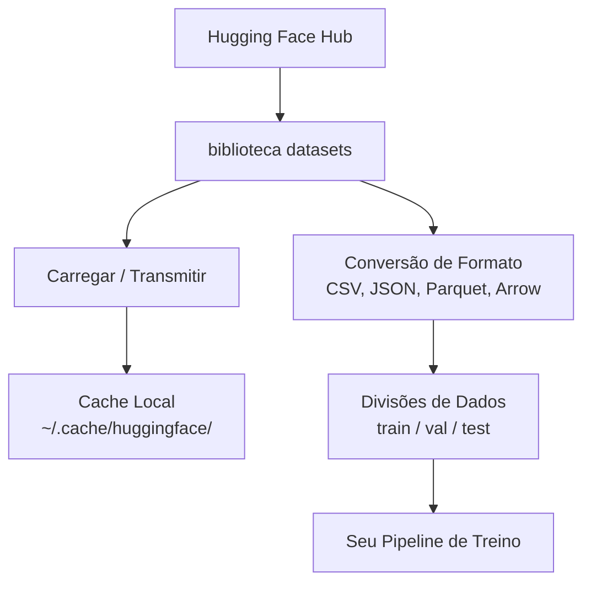

# Gerenciamento de Dados

> Dados são o combustível. Como você os gerencia determina a velocidade que você vai.

**Tipo:** Build
**Linguagens:** Python
**Pré-requisitos:** Fase 0, Aula 01
**Tempo:** ~45 minutos

## Objetivos de Aprendizado

- Carregar, transmitir e armazenar em cache datasets usando a biblioteca `datasets` do Hugging Face
- Converter entre formatos CSV, JSON, Parquet e Arrow e explicar seus tradeoffs
- Criar divisões train/validation/test reproduzíveis com seeds fixas
- Gerenciar arquivos grandes de modelos e datasets usando `.gitignore`, Git LFS ou DVC

## O Problema

Todo projeto de IA começa com dados. Você precisa encontrar datasets, baixá-los, converter entre formatos, dividi-los para treino e avaliação, e versioná-los para que experimentos sejam reproduzíveis. Fazer isso manualmente toda vez é lento e propenso a erros. Você precisa de um fluxo de trabalho repetível.

## O Conceito



A biblioteca `datasets` do Hugging Face é o padrão para carregar dados para trabalho de IA. Ela lida com download, cache, conversão de formato e streaming de forma integrada.

## Construa

### Passo 1: Instale a biblioteca datasets

```bash
pip install datasets huggingface_hub
```

### Passo 2: Carregue um dataset

```python
from datasets import load_dataset

dataset = load_dataset("imdb")
print(dataset)
print(dataset["train"][0])
```

Isso baixa o dataset de reviews de filmes IMDB. Após o primeiro download, ele carrega do cache em `~/.cache/huggingface/datasets/`.

### Passo 3: Transmita datasets grandes

Alguns datasets são grandes demais para caber em disco. Streaming carrega linha por linha sem baixar tudo.

```python
dataset = load_dataset("wikimedia/wikipedia", "20220301.en", split="train", streaming=True)

for i, example in enumerate(dataset):
    print(example["title"])
    if i >= 4:
        break
```

Streaming te dá um `IterableDataset`. Você processa as linhas conforme chegam. Uso de memória se mantém constante independente do tamanho do dataset.

### Passo 4: Formatos de dataset

A biblioteca `datasets` usa Apache Arrow internamente. Você pode converter para outros formatos dependendo do que seu pipeline precisa.

```python
dataset = load_dataset("imdb", split="train")

dataset.to_csv("imdb_train.csv")
dataset.to_json("imdb_train.json")
dataset.to_parquet("imdb_train.parquet")
```

Comparação de formatos:

| Formato | Tamanho | Velocidade de Leitura | Melhor para |
|---------|---------|----------------------|-------------|
| CSV | Grande | Lento | Legibilidade humana, planilhas |
| JSON | Grande | Lento | APIs, dados aninhados |
| Parquet | Pequeno | Rápido | Análises, consultas colunares |
| Arrow | Pequeno | O mais rápido | Processamento em memória (o que `datasets` usa internamente) |

Para trabalho de IA, Parquet é o melhor formato de armazenamento. Arrow é o que você usa em memória. CSV e JSON são para intercâmbio.

### Passo 5: Divisões de dados

Todo projeto de ML precisa de três divisões:

- **Train**: O modelo aprende com estes dados (tipicamente 80%)
- **Validation**: Você verifica o progresso durante o treino (tipicamente 10%)
- **Test**: Avaliação final depois que o treino termina (tipicamente 10%)

Alguns datasets já vêm pré-divididos. Quando não vêm, divida você mesmo:

```python
dataset = load_dataset("imdb", split="train")

split = dataset.train_test_split(test_size=0.2, seed=42)
train_val = split["train"].train_test_split(test_size=0.125, seed=42)

train_ds = train_val["train"]
val_ds = train_val["test"]
test_ds = split["test"]

print(f"Train: {len(train_ds)}, Val: {len(val_ds)}, Test: {len(test_ds)}")
```

Sempre defina uma seed para reproduzibilidade. A mesma seed produz a mesma divisão toda vez.

### Passo 6: Baixe e armazene modelos em cache

Modelos são arquivos grandes. A biblioteca `huggingface_hub` lida com download e cache.

```python
from huggingface_hub import hf_hub_download, snapshot_download

model_path = hf_hub_download(
    repo_id="sentence-transformers/all-MiniLM-L6-v2",
    filename="config.json"
)
print(f"Cacheado em: {model_path}")

model_dir = snapshot_download("sentence-transformers/all-MiniLM-L6-v2")
print(f"Modelo completo em: {model_dir}")
```

Modelos são cacheados em `~/.cache/huggingface/hub/`. Uma vez baixados, carregam instantaneamente em execuções subsequentes.

### Passo 7: Lide com arquivos grandes

Pesos de modelos e datasets grandes não devem ir pro git. Três opções:

**Opção A: .gitignore (mais simples)**

```
*.bin
*.safetensors
*.pt
*.onnx
data/*.parquet
data/*.csv
models/
```

**Opção B: Git LFS (rastrear arquivos grandes no git)**

```bash
git lfs install
git lfs track "*.bin"
git lfs track "*.safetensors"
git add .gitattributes
```

Git LFS armazena ponteiros no seu repositório e os arquivos reais em um servidor separado. GitHub oferece 1 GB grátis.

**Opção C: DVC (controle de versão de dados)**

```bash
pip install dvc
dvc init
dvc add data/training_set.parquet
git add data/training_set.parquet.dvc data/.gitignore
git commit -m "Track training data with DVC"
```

DVC cria pequenos arquivos `.dvc` que apontam para seus dados. Os dados em si ficam em S3, GCS ou outro backend de armazenamento remoto.

| Abordagem | Complexidade | Melhor para |
|-----------|-------------|-------------|
| .gitignore | Baixa | Projetos pessoais, dados baixados que você pode re-buscar |
| Git LFS | Média | Times compartilhando pesos de modelos via git |
| DVC | Alta | Experimentos reproduzíveis, datasets grandes, times |

Para este curso, `.gitignore` é suficiente. Use DVC quando precisar reproduzir experimentos exatos entre máquinas.

### Passo 8: Padrões de armazenamento

**Armazenamento local** funciona para datasets abaixo de ~10 GB. O cache do HF lida com isso automaticamente.

**Armazenamento em nuvem** é para qualquer coisa maior ou compartilhada entre máquinas:

```python
import os

local_path = os.path.expanduser("~/.cache/huggingface/datasets/")

# s3_path = "s3://my-bucket/datasets/"
# gcs_path = "gs://my-bucket/datasets/"
```

DVC se integra com S3 e GCS diretamente:

```bash
dvc remote add -d myremote s3://my-bucket/dvc-store
dvc push
```

Para este curso, armazenamento local é suficiente. Armazenamento em nuvem se torna relevante quando você faz fine-tuning em instâncias GPU remotas.

## Datasets Usados Neste Curso

| Dataset | Aulas | Tamanho | O que Ensina |
|---------|-------|---------|--------------|
| IMDB | Tokenização, classificação | 84 MB | Fundamentos de classificação de texto |
| WikiText | Modelagem de linguagem | 181 MB | Predição de próximo token |
| SQuAD | Sistemas de QA | 35 MB | Perguntas e respostas, spans |
| Common Crawl (subconjunto) | Embeddings | Variável | Processamento de texto em larga escala |
| MNIST | Fundamentos de visão | 21 MB | Fundamentos de classificação de imagem |
| COCO (subconjunto) | Multimodal | Variável | Pares imagem-texto |

Você não precisa baixar todos estes agora. Cada aula especifica o que precisa.

## Use

Execute o script utilitário para verificar se tudo funciona:

```bash
python code/data_utils.py
```

Isso baixa um dataset pequeno, converte, divide e imprime um resumo.

## Entregue

Esta aula produz:
- `code/data_utils.py` — utilitário reutilizável de carregamento e cache de dados
- `outputs/prompt-data-helper.md` — prompt para encontrar o dataset certo para uma tarefa

## Exercícios

1. Carregue o dataset `glue` com a config `mrpc` e inspecione os 5 primeiros exemplos
2. Transmita o dataset `c4` e conte quantos exemplos você consegue processar em 10 segundos
3. Converta um dataset para Parquet e compare o tamanho do arquivo com CSV
4. Crie uma divisão 70/15/15 train/val/test com seed fixa e verifique os tamanhos

## Termos-chave

| Termo | O que as pessoas dizem | O que realmente significa |
|-------|------------------------|---------------------------|
| Divisão de dataset | "Dados de treino" | Um subconjunto nomeado (train/val/test) usado em diferentes estágios do ciclo de vida de ML |
| Streaming | "Carregar preguiçosamente" | Processar dados linha por linha de uma fonte remota sem baixar o dataset completo |
| Parquet | "CSV comprimido" | Um formato de arquivo colunar otimizado para consultas analíticas e eficiência de armazenamento |
| Arrow | "Dataframe rápido" | Um formato colunar em memória usado internamente pela biblioteca datasets para leituras sem cópia |
| Git LFS | "Git para arquivos grandes" | Uma extensão que armazena arquivos grandes fora do repositório git mantendo ponteiros no controle de versão |
| DVC | "Git para dados" | Um sistema de controle de versão para datasets e modelos que se integra com armazenamento em nuvem |
| Cache | "Já baixado" | Uma cópia local de dados previamente buscados, armazenada em ~/.cache/huggingface/ por padrão |
