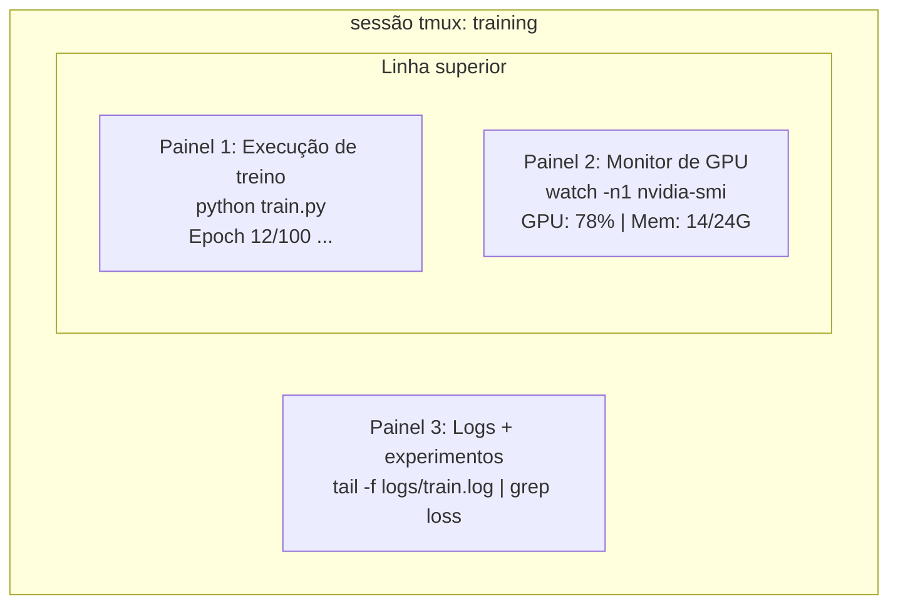

# Terminal e Shell

> O terminal é onde engenheiros de IA vivem. Conforto aqui.

**Tipo:** Aprender
**Linguagens:** --
**Pré-requisitos:** Fase 0, Aula 01
**Tempo:** ~35 minutos

## Objetivos de Aprendizado

- Usar piping, redirects e `grep` para filtrar e processar logs de treino da linha de comando
- Criar sessões persistentes de tmux com múltiplos painéis para treino e monitoramento de GPU concorrentes
- Monitorar recursos do sistema e GPU com `htop`, `nvtop` e `nvidia-smi`
- Transferir arquivos entre máquinas locais e remotas usando SSH, `scp` e `rsync`

## O Problema

Você vai gastar mais tempo no terminal do que em qualquer editor. Runs de treino, monitoramento de GPU, acompanhamento de logs, sessões SSH remotas, gerenciamento de ambiente. Todo fluxo de trabalho de IA toca o shell. Se você é lento aqui, é lento em tudo.

Esta aula cobre as habilidades de terminal que importam para trabalho de IA. Sem história do Unix. Sem aprofundamento em scripting Bash. Só o que você precisa.

## O Conceito



Três coisas rodando ao mesmo tempo. Um terminal. Você pode desanexar, ir pra casa, conectar de volta por SSH e reanexar. O treino continua rodando.

## Construa

### Passo 1: Conheça seu shell

Verifique qual shell você está usando:

```bash
echo $SHELL
```

A maioria dos sistemas usa `bash` ou `zsh`. Ambos funcionam bem. Os comandos deste curso funcionam em ambos.

Coisas importantes pra saber:

```bash
# Navegar
cd ~/projects/ai-engineering-from-scratch
pwd
ls -la

# Busca no histórico (atalho mais útil que você vai aprender)
# Ctrl+R depois digite parte do comando anterior
# Pressione Ctrl+R de novo para percorrer as correspondências

# Limpar terminal
clear   # ou Ctrl+L

# Cancelar um comando rodando
# Ctrl+C

# Suspender um comando rodando (resumir com fg)
# Ctrl+Z
```

### Passo 2: Piping e redirects

Piping conecta comandos uns aos outros. É assim que você processa logs, filtra saída e encadeia ferramentas. Você vai usar isso constantemente.

```bash
# Conte quantas vezes "loss" aparece num log
cat train.log | grep "loss" | wc -l

# Extraia só os valores de loss da saída de treino
grep "loss:" train.log | awk '{print $NF}' > losses.txt

# Acompanhe um arquivo de log em tempo real, filtrando por erros
tail -f train.log | grep --line-buffered "ERROR"

# Ordene experimentos por acurácia final
grep "final_accuracy" results/*.log | sort -t= -k2 -n -r

# Redirecione stdout e stderr para arquivos separados
python train.py > output.log 2> errors.log

# Redirecione ambos para o mesmo arquivo
python train.py > train_full.log 2>&1
```

Os três redirects que você precisa:

| Símbolo | O que faz |
|---------|----------|
| `>` | Escrever stdout no arquivo (sobrescrever) |
| `>>` | Acrescentar stdout ao arquivo |
| `2>` | Escrever stderr no arquivo |
| `2>&1` | Enviar stderr pro mesmo lugar que stdout |
| `\|` | Enviar stdout de um comando como stdin pro próximo |

### Passo 3: Processos em background

Treinos levam horas. Você não quer manter seu terminal aberto o tempo todo.

```bash
# Rodar em background (saída ainda vai pro terminal)
python train.py &

# Rodar em background, imune a hangup (fechar terminal não mata)
nohup python train.py > train.log 2>&1 &

# Ver o que está rodando em background
jobs
ps aux | grep train.py

# Trazer job de background pro foreground
fg %1

# Matar um processo de background
kill %1
# ou encontrar o PID e matar ele
kill $(pgrep -f "train.py")
```

A diferença entre `&`, `nohup` e `screen`/`tmux`:

| Método | Sobrevive ao fechar terminal? | Pode reconectar? |
|--------|------------------------------|------------------|
| `command &` | Não | Não |
| `nohup command &` | Sim | Não (checar arquivo de log) |
| `screen` / `tmux` | Sim | Sim |

Para qualquer coisa maior que alguns minutos, use tmux.

### Passo 4: tmux

tmux permite criar sessões de terminal persistentes com múltiplos painéis. Esta é a ferramenta mais útil para gerenciar runs de treino.

```bash
# Instalar
# macOS
brew install tmux
# Ubuntu
sudo apt install tmux

# Iniciar sessão nomeada
tmux new -s training

# Dividir horizontalmente
# Ctrl+B depois "

# Dividir verticalmente
# Ctrl+B depois %

# Navegar entre painéis
# Ctrl+B depois setas

# Desanexar (sessão continua rodando)
# Ctrl+B depois d

# Reconectar
tmux attach -t training

# Listar sessões
tmux ls

# Matar uma sessão
tmux kill-session -t training
```

Um fluxo de trabalho típico de IA:

```bash
tmux new -s train

# Painel 1: iniciar treino
python train.py --epochs 100 --lr 1e-4

# Ctrl+B, " para dividir, depois rodar monitor GPU
watch -n1 nvidia-smi

# Ctrl+B, % para dividir verticalmente, acompanhar logs
tail -f logs/experiment.log

# Agora desanexe com Ctrl+B, d
# Desconecte SSH, vá tomar um café, volte
# tmux attach -t train
```

### Passo 5: Monitoramento com htop e nvtop

```bash
# Processos do sistema (melhor que top)
htop

# Processos de GPU (se tiver NVIDIA GPU)
# Instalar: sudo apt install nvtop (Ubuntu) ou brew install nvtop (macOS)
nvtop

# Checagem rápida de GPU sem nvtop
nvidia-smi

# Acompanhe uso da GPU atualizando a cada segundo
watch -n1 nvidia-smi

# Veja quais processos estão usando a GPU
nvidia-smi --query-compute-apps=pid,name,used_memory --format=csv
```

Atalhos do `htop` que você vai usar:
- `F6` ou `>` para ordenar por coluna (ordenar por memória pra encontrar vazamentos)
- `F5` para alternar visualização em árvore (ver processos filhos)
- `F9` para matar um processo
- `/` para buscar um nome de processo

### Passo 6: SSH para caixas de GPU remotas

Quando você alugar uma GPU na nuvem (Lambda, RunPod, Vast.ai), você conecta via SSH.

```bash
# Conexão básica
ssh user@gpu-box-ip

# Com chave específica
ssh -i ~/.ssh/my_gpu_key user@gpu-box-ip

# Copiar arquivos pro remote
scp model.pt user@gpu-box-ip:~/models/

# Copiar arquivos do remote
scp user@gpu-box-ip:~/results/metrics.json ./

# Sincronizar diretório inteiro (mais rápido pra muitos arquivos)
rsync -avz ./data/ user@gpu-box-ip:~/data/

# Forward de porta (acessar Jupyter/TensorBoard remoto localmente)
ssh -L 8888:localhost:8888 user@gpu-box-ip
# Agora abra localhost:8888 no seu navegador

# SSH config para conveniência
# Adicione em ~/.ssh/config:
# Host gpu
#     HostName 192.168.1.100
#     User ubuntu
#     IdentityFile ~/.ssh/gpu_key
#
# Depois só:
# ssh gpu
```

### Passo 7: Aliases úteis para IA

Adicione estes ao seu `~/.bashrc` ou `~/.zshrc`:

```bash
source phases/00-setup-and-tooling/10-terminal-and-shell/code/shell_aliases.sh
```

Ou copie os que você quiser. Os aliases principais:

```bash
# Status da GPU num olhar
alias gpu='nvidia-smi --query-gpu=index,name,utilization.gpu,memory.used,memory.total,temperature.gpu --format=csv,noheader'

# Matar todos os processos Python de treino
alias killtraining='pkill -f "python.*train"'

# Ativação rápida de ambiente virtual
alias ae='source .venv/bin/activate'

# Acompanhar loss de treino
alias watchloss='tail -f logs/*.log | grep --line-buffered "loss"'
```

Veja `code/shell_aliases.sh` para o conjunto completo.

### Passo 8: Padrões comuns de terminal em IA

Estes aparecem repetidamente na prática:

```bash
# Rodar treino, logar tudo, notificar quando terminar
python train.py 2>&1 | tee train.log; echo "DONE" | mail -s "Training complete" you@email.com

# Comparar dois logs de experimento lado a lado
diff <(grep "accuracy" exp1.log) <(grep "accuracy" exp2.log)

# Encontrar os maiores arquivos de modelo (limpar espaço em disco)
find . -name "*.pt" -o -name "*.safetensors" | xargs du -h | sort -rh | head -20

# Baixar um modelo do Hugging Face
wget https://huggingface.co/model/resolve/main/model.safetensors

# Descompactar um dataset
tar xzf dataset.tar.gz -C ./data/

# Contar linhas em todos os arquivos Python (ver o tamanho do seu projeto)
find . -name "*.py" | xargs wc -l | tail -1

# Verificar espaço em disco (dados de treino enchem disco rápido)
df -h
du -sh ./data/*

# Verificar variáveis de ambiente antes do treino
env | grep -i cuda
env | grep -i torch
```

## Use

Aqui está quando cada ferramenta entra em ação durante este curso:

| Ferramenta | Quando você usa |
|-----------|----------------|
| tmux | Todo run de treino (Fases 3+) |
| `tail -f` + `grep` | Monitorando logs de treino |
| `nohup` / `&` | Tarefas de background rápidas |
| `htop` / `nvtop` | Debugando treino lento, erros OOM |
| SSH + `rsync` | Trabalhando em GPUs na nuvem |
| Piping + redirects | Processando resultados de experimentos |
| Aliases | Economizando tempo com comandos repetitivos |

## Exercícios

1. Instale o tmux, crie uma sessão com três painéis e rode `htop` em um, `watch -n1 date` em outro e um script Python no terceiro. Desanexe e reconecte.
2. Adicione os aliases de `code/shell_aliases.sh` à configuração do seu shell e recarregue com `source ~/.zshrc` (ou `~/.bashrc`).
3. Crie um log de treino falso com `for i in $(seq 1 100); do echo "epoch $i loss: $(echo "scale=4; 1/$i" | bc)"; sleep 0.1; done > fake_train.log` e depois use `grep`, `tail` e `awk` para extrair só os valores de loss.
4. Configure uma entrada de SSH config para um servidor que você tem acesso (ou use `localhost` pra praticar a sintaxe).

## Termos-chave

| Termo | O que as pessoas dizem | O que realmente significa |
|-------|------------------------|---------------------------|
| Shell | "O terminal" | O programa que interpreta seus comandos (bash, zsh, fish) |
| tmux | "Multiplexador de terminal" | Um programa que permite rodar múltiplas sessões de terminal dentro de uma janela, e desanexar/reanexar |
| Pipe | "A barra vertical" | O operador `\|` que envia a saída de um comando como entrada para outro |
| PID | "ID do processo" | Um número único atribuído a todo processo rodando, usado para monitorar ou matá-lo |
| nohup | "Sem hangup" | Executa um comando imune ao sinal de hangup, então fechar o terminal não o mata |
| SSH | "Conectando ao servidor" | Secure Shell, um protocolo criptografado para executar comandos em uma máquina remota |
