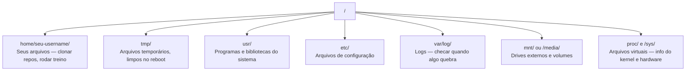

# Linux para IA

> A maioria da IA roda em Linux. Você precisa saber o suficiente pra não ficar travado.

**Tipo:** Learn
**Linguagens:** --
**Pré-requisitos:** Fase 0, Aula 01
**Tempo:** ~30 minutos

## Objetivos de Aprendizado

- Navegar no sistema de arquivos Linux e realizar operações essenciais de arquivos pela linha de comando
- Gerenciar permissões de arquivos com `chmod` e `chown` para resolver erros "Permission denied"
- Instalar pacotes do sistema com `apt` e configurar uma caixa de GPU nova para trabalho de IA
- Identificar diferenças macOS-to-Linux que comumente complicam desenvolvedores trabalhando em máquinas remotas

## O Problema

Você desenvolve em macOS ou Windows. Mas no momento em que faz SSH numa caixa de GPU na nuvem, aluga uma instância Lambda ou sobe uma máquina EC2, você pousa no Ubuntu. O terminal é sua única interface. Não tem Finder, não tem Explorer, não tem GUI. Se você não consegue navegar no sistema de arquivos, instalar pacotes e gerenciar processos pela linha de comando, está travado pagando por horas de GPU ociosa enquanto googla "como descompactar arquivo no Linux".

Esta é uma guia de sobrevivência. Cobre exatamente o que você precisa para operar em uma máquina Linux remota para trabalho de IA. Nada mais.

## Layout do Sistema de Arquivos

Linux organiza tudo sob uma raiz única `/`. Não existe `C:\` ou `/Volumes`.



Seu diretório home é `~` ou `/home/seu-username`. Quase tudo que você faz acontece aqui.

## Comandos Essenciais

Esses são os 15 comandos que cobrem 95% do que você vai fazer numa caixa de GPU remota.

### Navegando

```bash
pwd                         # Onde estou?
ls                          # O que tem aqui?
ls -la                      # O que tem aqui, incluindo arquivos ocultos com detalhes?
cd /caminho/para/dir        # Ir lá
cd ~                        # Ir pro home
cd ..                       # Ir um nível acima
```

### Arquivos e Diretórios

```bash
mkdir meu-projeto            # Criar diretório
mkdir -p a/b/c              # Criar diretórios aninhados de uma vez

cp arquivo.txt backup.txt    # Copiar arquivo
cp -r src/ src-backup/      # Copiar diretório (recursivo)

mv antigo.txt novo.txt      # Renomear arquivo
mv arquivo.txt /tmp/        # Mover arquivo

rm arquivo.txt              # Deletar arquivo (sem lixeira, sumiu)
rm -rf meu-diretorio/       # Deletar diretório e tudo dentro
```

`rm -rf` é permanente. Não tem desfazer. Confira o caminho duas vezes antes de apertar enter.

### Lendo Arquivos

```bash
cat arquivo.txt             # Mostrar arquivo inteiro
head -20 arquivo.txt        # Primeiras 20 linhas
tail -20 arquivo.txt        # Últimas 20 linhas
tail -f log.txt             # Acompanhar arquivo de log em tempo real (Ctrl+C pra parar)
less arquivo.txt            # Navegar pelo arquivo (q pra sair)
```

### Buscando

```bash
grep "erro" training.log            # Encontrar linhas com "erro"
grep -r "learning_rate" .           # Buscar em todos os arquivos do diretório atual
grep -i "cuda" config.yaml          # Busca case-insensitive

find . -name "*.py"                 # Encontrar todos os arquivos Python
find . -name "*.ckpt" -size +1G     # Encontrar checkpoints maiores que 1GB
```

## Permissões

Cada arquivo no Linux tem um dono e bits de permissão.

```bash
ls -l train.py
# -rwxr-xr-- 1 user group 2048 Mar 19 10:00 train.py
#  ^^^             permissões do dono: ler, escrever, executar
#     ^^^          permissões do grupo: ler, executar
#        ^^        outros: só leitura
```

Correções comuns:

```bash
chmod +x train.sh           # Tornar script executável
chmod 755 deploy.sh         # Dono: total, outros: ler+executar
chmod 644 config.yaml       # Dono: ler+escrever, outros: só leitura

chown user:group arquivo.txt   # Mudar quem é dono do arquivo (precisa sudo)
```

## Gerenciamento de Pacotes (apt)

Ubuntu usa `apt`. É assim que você instala software de nível de sistema.

```bash
sudo apt update             # Atualizar lista de pacotes (sempre fazer isso primeiro)
sudo apt install -y htop    # Instalar pacote (-y pula confirmação)
sudo apt install -y build-essential  # Compilador C, make, etc. Preciso por muitos pacotes Python
sudo apt install -y tmux    # Multiplexador de terminal

apt list --installed        # O que está instalado?
sudo apt remove htop        # Desinstalar
```

## Usuários e sudo

Você geralmente está logado como usuário normal. Algumas operações precisam de acesso root.

```bash
whoami                      # Que usuário sou eu?
sudo comando                # Rodar um comando como root
sudo su                     # Tornar root (exit pra voltar, usar com moderação)
```

Em instâncias de GPU na nuvem, você geralmente é o único usuário e já tem acesso sudo.

## Disco

```bash
df -h                       # Uso de disco em todos os drives montados
du -sh *                    # Tamanho de cada item no diretório atual
du -sh ~/.cache             # Tamanho do seu cache (pip, modelos huggingface ficam aqui)

# Encontrar os maiores consumidores de espaço
du -h --max-depth=1 / 2>/dev/null | sort -hr | head -20
```

## Networking

```bash
# Baixar arquivos
wget https://exemplo.com/model.bin
curl -O https://exemplo.com/data.tar.gz

# Transferir arquivos entre máquinas
scp model.bin user@remote:/data/
scp user@remote:/data/results.csv ./

# Sincronizar diretórios (mais rápido que scp pra transferências grandes)
rsync -avz --progress ./data/ user@remote:/data/
```

Use `rsync` ao invés de `scp` pra qualquer coisa grande. Ele transfere só bytes alterados e lida com conexões interrompidas.

## tmux: Mantenha Sessões Vivas

```bash
tmux new -s train           # Iniciar nova sessão chamada "train"
# ... inicie seu treino, depois:
# Ctrl+B, depois D           # Desanexar (treino continua rodando)

tmux ls                     # Listar sessões
tmux attach -t train        # Reconectar à sessão
```

Sempre rode trabalhos de treino longos dentro do tmux. Sempre.

## WSL2 para Usuários Windows

Se você está no Windows, WSL2 te dá um ambiente Linux real sem dual-boot.

```bash
# No PowerShell (admin)
wsl --install -d Ubuntu-24.04

# Depois do restart, abra o Ubuntu pelo menu Start
sudo apt update && sudo apt upgrade -y
```

## Gotchas: macOS para Linux

| macOS | Linux | Notas |
|-------|-------|-------|
| `brew install` | `sudo apt install` | Nomes de pacotes diferentes às vezes |
| `open arquivo.txt` | `xdg-open arquivo.txt` | Mas não terá GUI no remote. Use `cat` ou `less` |
| `pbcopy` / `pbpaste` | Indisponível | Copiar/colar não existe via SSH |
| `~/.zshrc` | `~/.bashrc` | macOS usa zsh. A maioria dos servidores Linux usa bash |
| `sed -i '' 's/a/b/' arquivo` | `sed -i 's/a/b/' arquivo` | macOS sed precisa de string vazia depois de `-i` |
| Filesystem case-insensitive | Filesystem case-sensitive | `Model.py` e `model.py` são dois arquivos diferentes no Linux |

## Referência Rápida

```
Navegação:     pwd, ls, cd, find
Arquivos:      cp, mv, rm, mkdir, cat, head, tail, less
Busca:         grep, find
Permissões:    chmod, chown, sudo
Pacotes:       apt update, apt install
Processos:     htop, ps, kill, nvidia-smi
Serviços:      systemctl start/stop/restart/status
Disco:         df -h, du -sh
Rede:          curl, wget, scp, rsync
Sessões:       tmux new/attach/detach
```

## Exercícios

1. Faça SSH em qualquer máquina Linux (ou abra WSL2) e navegue até seu diretório home. Crie uma pasta de projeto, crie três arquivos vazios com `touch` e liste-os com `ls -la`.
2. Instale `htop` com apt, rode-o e identifique qual processo está usando mais memória.
3. Inicie uma sessão tmux, rode `sleep 300` dentro dela, desanexe, liste sessões e reconecte.
4. Use `df -h` para verificar espaço em disco disponível, depois use `du -sh ~/.cache/*` para encontrar o que está ocupando espaço no seu cache.
5. Transfira um arquivo da sua máquina local pra uma remota usando `scp`, depois faça a mesma transferência com `rsync` e compare a experiência.
