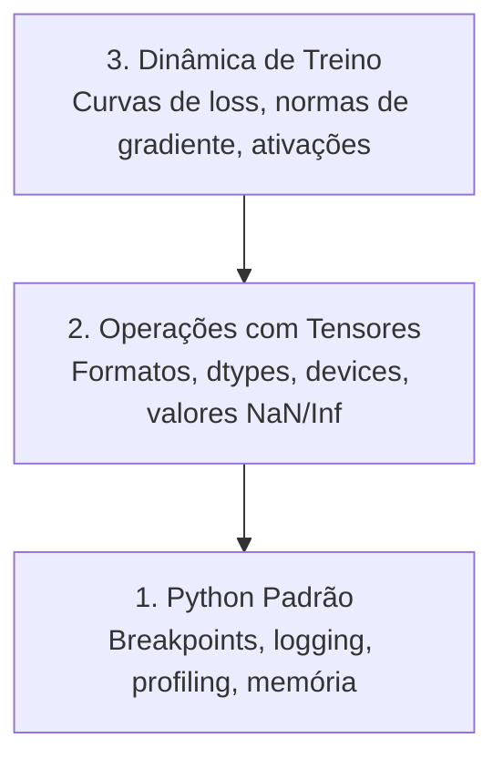

# Debug e Profiling

> Os piores bugs de IA não travam. Eles treinam silenciosamente em lixo e reportam uma curva de loss bonita.

**Tipo:** Build
**Linguagens:** Python
**Pré-requisitos:** Aula 1 (Ambiente de Desenvolvimento), familiaridade básica com PyTorch
**Tempo:** ~60 minutos

## Objetivos de Aprendizado

- Usar `breakpoint()` condicional e `debug_print` para inspecionar formatos de tensores, dtypes e valores NaN durante treino
- Fazer profiling de loops de treino com `cProfile`, `line_profiler` e `tracemalloc` para encontrar gargalos
- Detectar bugs comuns de IA: incompatibilidade de formatos, loss NaN, vazamento de dados e tensores em device errado
- Configurar TensorBoard para visualizar curvas de loss, histogramas de pesos e distribuições de gradientes

## O Problema

Código de IA falha diferente do código normal. Um app web trava com stack trace. Um loop de treino mal configurado roda por 8 horas, gasta $200 em GPU e produz um modelo que prevê a média de cada entrada. O código nunca deu erro. O bug era um tensor no device errado, um `.detach()` esquecido ou rótulos vazando pra features.

Você precisa de ferramentas de debug que capturam essas falhas silenciosas antes de desperdiçar seu tempo e compute.

## O Conceito

Debug de IA opera em três níveis:



A maioria das pessoas pula direto pro nível 3 (encarar TensorBoard). Mas 80% dos bugs de IA vivem nos níveis 1 e 2.

## Construa

### Parte 1: Debug com Print (Sim, Funciona)

Debug com print é subestimado. Não deveria ser. Para código com tensores, um print direcionado supera passar no debugger porque você precisa ver formatos, dtypes e faixas de valores de uma vez.

```python
def debug_print(name, tensor):
    print(f"{name}: shape={tensor.shape}, dtype={tensor.dtype}, "
          f"device={tensor.device}, "
          f"min={tensor.min().item():.4f}, max={tensor.max().item():.4f}, "
          f"mean={tensor.mean().item():.4f}, "
          f"has_nan={tensor.isnan().any().item()}")
```

Chame isso depois de cada operação suspeita. Quando o bug for encontrado, remova os prints. Simples.

### Parte 2: Debugger do Python (pdb e breakpoint)

O debugger embutido é subutilizado para trabalho de IA. Coloque `breakpoint()` no seu loop de treino e inspecione tensores interativamente.

```python
def training_step(model, batch, criterion, optimizer):
    inputs, labels = batch
    outputs = model(inputs)
    loss = criterion(outputs, labels)

    if loss.item() > 100 or torch.isnan(loss):
        breakpoint()

    loss.backward()
    optimizer.step()
```

Quando o debugger cair, comandos úteis:

- `p outputs.shape` para checar formatos
- `p loss.item()` para ver o valor da loss
- `p torch.isnan(outputs).sum()` pra contar NaNs
- `p model.fc1.weight.grad` pra checar gradientes
- `c` para continuar, `q` para sair

Isso é debug condicional. Você só para quando algo parece errado. Para um treino de 10.000 passos, isso importa.

### Parte 3: Logging em Python

Substitua prints por logging quando seu debug for além de uma checagem rápida.

```python
import logging

logging.basicConfig(
    level=logging.INFO,
    format="%(asctime)s [%(levelname)s] %(message)s",
    handlers=[
        logging.FileHandler("training.log"),
        logging.StreamHandler()
    ]
)
logger = logging.getLogger(__name__)

logger.info("Starting training: lr=%.4f, batch_size=%d", lr, batch_size)
logger.warning("Loss spike detected: %.4f at step %d", loss.item(), step)
logger.error("NaN loss at step %d, stopping", step)
```

Logging te dá timestamps, níveis de severidade e saída em arquivo. Quando um treino falha às 3 da manhã, você quer um arquivo de log, não uma saída de terminal que rolou pra fora da tela.

### Parte 4: Cronometrando Seções de Código

Saber onde o tempo vai é o primeiro passo pra otimização.

```python
import time

class Timer:
    def __init__(self, name=""):
        self.name = name

    def __enter__(self):
        self.start = time.perf_counter()
        return self

    def __exit__(self, *args):
        elapsed = time.perf_counter() - self.start
        print(f"[{self.name}] {elapsed:.4f}s")

with Timer("data loading"):
    batch = next(dataloader_iter)

with Timer("forward pass"):
    outputs = model(batch)

with Timer("backward pass"):
    loss.backward()
```

Achado comum: carregamento de dados leva 60% do tempo de treino. A solução é `num_workers > 0` no seu DataLoader, não uma GPU mais rápida.

### Parte 5: cProfile e line_profiler

Quando você precisa de mais que cronômetros manuais:

```bash
python -m cProfile -s cumtime train.py
```

Isso mostra toda chamada de função ordenada por tempo cumulativo. Para profiling linha por linha:

```bash
pip install line_profiler
```

```python
@profile
def train_step(model, data, target):
    output = model(data)
    loss = F.cross_entropy(output, target)
    loss.backward()
    return loss

# Execute com: kernprof -l -v train.py
```

### Parte 6: Profiling de Memória

#### Memória CPU com tracemalloc

```python
import tracemalloc

tracemalloc.start()

# seu código aqui
model = build_model()
data = load_dataset()

snapshot = tracemalloc.take_snapshot()
top_stats = snapshot.statistics("lineno")
for stat in top_stats[:10]:
    print(stat)
```

#### Memória CPU com memory_profiler

```bash
pip install memory_profiler
```

```python
from memory_profiler import profile

@profile
def load_data():
    raw = read_csv("data.csv")       # veja a memória pular aqui
    processed = preprocess(raw)       # e aqui
    return processed
```

Execute com `python -m memory_profiler your_script.py` para ver o uso de memória linha por linha.

#### Memória GPU com PyTorch

```python
import torch

if torch.cuda.is_available():
    print(torch.cuda.memory_summary())

    print(f"Allocated: {torch.cuda.memory_allocated() / 1e9:.2f} GB")
    print(f"Cached: {torch.cuda.memory_reserved() / 1e9:.2f} GB")
```

Quando você bater OOM (Out of Memory):

1. Reduza o batch size (primeira coisa a tentar, sempre)
2. Use `torch.cuda.empty_cache()` para liberar memória em cache
3. Use `del tensor` seguido de `torch.cuda.empty_cache()` para intermediários grandes
4. Use mixed precision (`torch.cuda.amp`) para reduzir o uso de memória pela metade
5. Use gradient checkpointing para modelos muito profundos

### Parte 7: Bugs Comuns de IA e Como Capturá-los

#### Incompatibilidade de Formato

O bug mais frequente. Um tensor tem formato `[batch, features]` quando o modelo espera `[batch, channels, height, width]`.

```python
def check_shapes(model, sample_input):
    print(f"Input: {sample_input.shape}")
    hooks = []

    def make_hook(name):
        def hook(module, inp, out):
            in_shape = inp[0].shape if isinstance(inp, tuple) else inp.shape
            out_shape = out.shape if hasattr(out, "shape") else type(out)
            print(f"  {name}: {in_shape} -> {out_shape}")
        return hook

    for name, module in model.named_modules():
        hooks.append(module.register_forward_hook(make_hook(name)))

    with torch.no_grad():
        model(sample_input)

    for h in hooks:
        h.remove()
```

Execute isso uma vez com um batch de exemplo. Ele mapeia toda transformação de formato no seu modelo.

#### Loss NaN

Loss NaN significa que algo explodiu. Causas comuns:

- Learning rate alto demais
- Divisão por zero em loss customizada
- Log de zero ou número negativo
- Gradientes explosivos em RNNs

```python
def detect_nan(model, loss, step):
    if torch.isnan(loss):
        print(f"NaN loss at step {step}")
        for name, param in model.named_parameters():
            if param.grad is not None:
                if torch.isnan(param.grad).any():
                    print(f"  NaN gradient in {name}")
                if torch.isinf(param.grad).any():
                    print(f"  Inf gradient in {name}")
        return True
    return False
```

#### Vazamento de Dados

Seu modelo pega 99% de accuracy no test set. Parece ótimo. É um bug.

```python
def check_data_leakage(train_set, test_set, id_column="id"):
    train_ids = set(train_set[id_column].tolist())
    test_ids = set(test_set[id_column].tolist())
    overlap = train_ids & test_ids
    if overlap:
        print(f"VAZAMENTO DE DADOS: {len(overlap)} amostras em train e test")
        return True
    return False
```

Verifique também vazamento temporal: usar dados futuros pra prever o passado. Ordene por timestamp antes de dividir.

#### Device Errado

Tensores em devices diferentes (CPU vs GPU) causam erros de runtime. Mas às vezes um tensor fica silenciosamente na CPU enquanto tudo mais está na GPU e o treino só roda devagar.

```python
def check_devices(model, *tensors):
    model_device = next(model.parameters()).device
    print(f"Model device: {model_device}")
    for i, t in enumerate(tensors):
        if t.device != model_device:
            print(f"  WARNING: tensor {i} on {t.device}, model on {model_device}")
```

### Parte 8: TensorBoard Básico

TensorBoard mostra o que está acontecendo dentro do treino ao longo do tempo.

```bash
pip install tensorboard
```

```python
from torch.utils.tensorboard import SummaryWriter

writer = SummaryWriter("runs/experiment_1")

for step in range(num_steps):
    loss = train_step(model, batch)

    writer.add_scalar("loss/train", loss.item(), step)
    writer.add_scalar("lr", optimizer.param_groups[0]["lr"], step)

    if step % 100 == 0:
        for name, param in model.named_parameters():
            writer.add_histogram(f"weights/{name}", param, step)
            if param.grad is not None:
                writer.add_histogram(f"grads/{name}", param.grad, step)

writer.close()
```

Inicie:

```bash
tensorboard --logdir=runs
```

O que procurar:

- **Loss não diminui**: Learning rate baixo demais ou problema na arquitetura do modelo
- **Loss oscila muito**: Learning rate alto demais
- **Loss vai pra NaN**: Instabilidade numérica (veja seção NaN acima)
- **Loss de train diminui, val aumenta**: Overfitting
- **Histogramas de pesos colapsando pra zero**: Gradientes vanishing
- **Histogramas de gradiente explodindo**: Precisa de gradient clipping

### Parte 9: Debugger do VS Code

Para debug interativo, configure o VS Code com um `launch.json`:

```json
{
    "version": "0.2.0",
    "configurations": [
        {
            "name": "Debug Training",
            "type": "debugpy",
            "request": "launch",
            "program": "${file}",
            "console": "integratedTerminal",
            "justMyCode": false
        }
    ]
}
```

Defina breakpoints clicando na margem. Use o painel de Variáveis para inspecionar propriedades de tensores. O Console de Debug permite executar expressões Python arbitrárias no meio da execução.

Útil para percorrer pipelines de pré-processamento de dados onde você quer ver cada transformação.

## Use

Aqui está o fluxo de debug que captura a maioria dos bugs de IA:

1. **Antes do treino**: Rode `check_shapes` com um batch de exemplo. Verifique que dimensões de entrada e saída batem com o esperado.
2. **Primeiros 10 passos**: Use `debug_print` na loss, outputs e gradientes. Confirme que nada é NaN e valores estão em faixas razoáveis.
3. **Durante o treino**: Faça log de loss, learning rate e normas de gradiente. Use TensorBoard para visualização.
4. **Quando algo quebrar**: Coloque `breakpoint()` no ponto de falha. Inspecione tensores interativamente.
5. **Para performance**: Cronometre seu carregamento de dados vs forward vs backward. Faça profiling de memória se estiver perto de OOM.

## Entregue

Execute o script de ferramentas de debug:

```bash
python phases/00-setup-and-tooling/12-debugging-and-profiling/code/debug_tools.py
```

Veja `outputs/prompt-debug-ai-code.md` para um prompt que ajuda a diagnosticar bugs específicos de IA.

## Exercícios

1. Rode `debug_tools.py` e leia a saída de cada seção. Modifique o modelo dummy para introduzir um NaN (dica: divisão por zero no forward pass) e veja o detector capturar.
2. Faça profiling de um loop de treino com `cProfile` e identifique a função mais lenta.
3. Use `tracemalloc` para encontrar qual linha do seu pipeline de carregamento de dados aloca mais memória.
4. Configure o TensorBoard para um run de treino simples e identifique se o modelo está fazendo overfitting.
5. Use `breakpoint()` dentro de um loop de treino. Pratique inspecionar formatos de tensores, devices e valores de gradiente do prompt do debugger.

## Termos-chave

| Termo | O que as pessoas dizem | O que realmente significa |
|-------|------------------------|---------------------------|
| Profiling | "Medir performance" | Analisar onde o tempo ou a memória estão sendo gastos num programa |
| NaN | "Deu ruim" | Not a Number — um valor que resulta de operações inválidas (0/0, log(-1)) |
| Gradient clipping | "Capar gradiente" | Limitar gradientes a um valor máximo pra evitar explosão durante o treino |
| Mixed precision | "Treino mais rápido" | Usar FP16 e FP32 juntos pra reduzir uso de memória e acelerar computação |
| TensorBoard | "Painel de treino" | Ferramenta de visualização que mostra loss, gradientes, pesos e outras métricas ao longo do tempo |
| Data leakage | "Trapaça nos dados" | Quando informação do future ou do test set vaza pro train set, dando métricas irreais |
