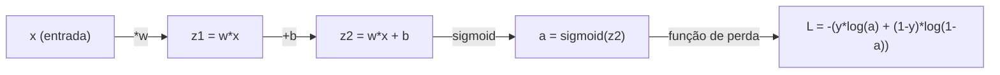
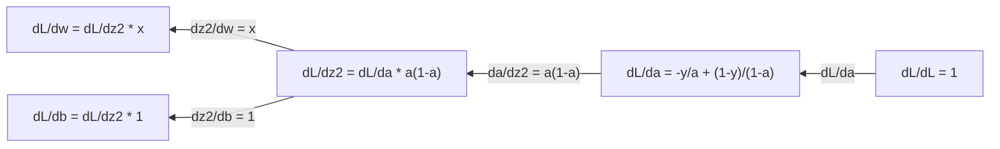
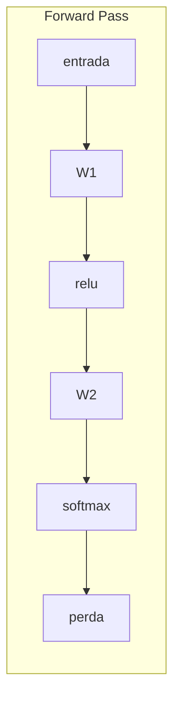
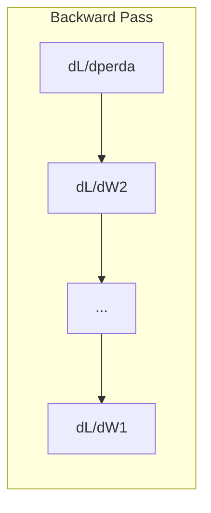

# Cálculo para Machine Learning

> Derivadas dizem qual é o caminho para baixo. Isso é tudo que uma rede neural precisa pra aprender.

**Tipo:** Aprender
**Linguagem:** Python
**Pré-requisitos:** Fase 1, Aulas 01-03
**Tempo:** ~60 minutos

## Objetivos de Aprendizado

- Computar derivadas numéricas e analíticas para funções comuns de ML (x^2, sigmoid, entropia cruzada)
- Implementar descida do gradiente do zero para minimizar uma função de perda em 1D e 2D
- Derivar o gradiente de um modelo de regressão linear e treiná-lo via atualizações manuais de pesos
- Explicar a matriz Hessiana, aproximações de série de Taylor e sua conexão com métodos de otimização

## O Problema

Você tem uma rede neural com milhões de pesos. Cada peso é um botão. Você precisa descobrir a direção de girar cada botão pra deixar o modelo um pouco menos errado. O cálculo dá essa direção.

Sem cálculo, treinar uma rede neural significaria tentar mudanças aleatórias e torcer pra dar certo. Com derivadas, você sabe exatamente como cada peso afeta o erro. Você gira cada botão do jeito certo, toda vez.

## O Conceito

### O que é uma derivada?

Uma derivada mede a taxa de mudança. Para uma função y = f(x), a derivada f'(x) diz: se você empurrar x por uma tiny quantidade, quanto y muda?

Geometricamente, a derivada é a inclinação da reta tangente em um ponto.

**f(x) = x^2:**

| x | f(x) | f'(x) (inclinação) |
|---|------|---------------|
| 0 | 0    | 0 (plano, no fundo) |
| 1 | 1    | 2 |
| 2 | 4    | 4 (inclinação da reta tangente neste ponto) |
| 3 | 9    | 6 |

Em x=2, a inclinação é 4. Se você mover x um pouquinho pra direita, y aumenta cerca de 4 vezes essa quantidade. Em x=0, a inclinação é 0. Você está no fundo do "copo".

A definição formal:

```
f'(x) = lim   f(x + h) - f(x)
        h->0  -----------------
                     h
```

Em código, você pula o limite e usa um h muito pequeno. Essa é a derivada numérica.

### Derivadas parciais: uma variável por vez

Funções reais têm muitas entradas. A perda de uma rede neural depende de milhares de pesos. Uma derivada parcial mantém todas as variáveis constantes exceto uma, e então toma a derivada em relação a essa uma.

```
f(x, y) = x^2 + 3xy + y^2

df/dx = 2x + 3y     (tratar y como constante)
df/dy = 3x + 2y     (tratar x como constante)
```

Cada derivada parcial responde: se eu empurrar só esse peso, como a perda muda?

### O gradiente: vetor de todas as derivadas parciais

O gradiente coleta todas as derivadas parciais em um vetor. Para uma função f(x, y, z), o gradiente é:

```
grad f = [ df/dx, df/dy, df/dz ]
```

O gradiente aponta na direção de maior ascensão. Para minimizar uma função, vá na direção oposta.

**Gráfico de contorno de f(x,y) = x^2 + y^2:**

A função forma um copo com círculos concêntricos como linhas de contorno. O mínimo está em (0, 0).

| Ponto | grad f | -grad f (direção de descida) |
|-------|--------|----------------------------|
| (1, 1) | [2, 2] (aponta pra cima, longe do mínimo) | [-2, -2] (aponta pra baixo, em direção ao mínimo) |
| (0, 0) | [0, 0] (plano, no mínimo) | [0, 0] |

Isso é descida do gradiente em uma imagem. Calcule o gradiente, negue, dê um passo.

### A conexão com otimização

Treinar uma rede neural é otimização. Você tem uma função de perda L(w1, w2, ..., wn) que mede quão errado o modelo está. Você quer minimizá-la.

```
Regra de atualização da descida do gradiente:

  w_novo = w_velho - taxa_aprendizado * dL/dw

Para cada peso:
  1. Calcule a derivada parcial da perda em relação a esse peso
  2. Subtraia um múltiplo pequeno dele do peso
  3. Repita
```

A taxa de aprendizado controla o tamanho do passo. Muito grande e você passa do ponto. Muito pequeno e você engatinha.

**Paisagem de perda (fatia 1D):**

A função de perda L(w) forma uma curva com picos e vales conforme o peso w varia.

| Característica | Descrição |
|---------|-------------|
| Mínimo global | O ponto mais baixo em toda a curva — a melhor solução |
| Mínimo local | Um vale que é mais baixo que seus vizinhos mas não é o mais baixo de todos |
| Inclinação | A descida do gradiente segue a inclinação pra baixo a partir de qualquer ponto inicial |

A descida do gradiente segue a inclinação pra baixo. Ela pode ficar presa em mínimos locais, mas em espaços de alta dimensão (milhões de pesos) isso raramente é um problema prático.

### Derivadas numéricas vs analíticas

Existem duas formas de computar uma derivada.

Analítica: aplique regras de cálculo à mão. Para f(x) = x^2, a derivada é f'(x) = 2x. Exata. Rápida.

Numérica: aproxime usando a definição. Compute f(x+h) e f(x-h) para um h pequeno, depois use a diferença.

```
Derivada numérica (diferença central):

f'(x) ~= f(x + h) - f(x - h)
          -----------------------
                  2h

h = 0.0001 funciona bem na prática
```

Derivadas numéricas são mais lentas mas funcionam para qualquer função. Derivadas analíticas são rápidas mas exigem que você derive a fórmula. Frameworks de rede neural usam uma terceira abordagem: diferenciação automática, que computa derivadas exatas mecanicamente. Você verá isso na Fase 3.

### Derivadas à mão para funções simples

Essas são as derivadas que você verá repetidamente no ML.

```
Função          Derivada         Usada em
--------        ----------       -------
f(x) = x^2     f'(x) = 2x      Funções de perda (MSE)
f(x) = wx + b  f'(w) = x        Camada linear (gradiente w.r.t. peso)
                f'(b) = 1        Camada linear (gradiente w.r.t. bias)
                f'(x) = w        Camada linear (gradiente w.r.t. entrada)
f(x) = e^x     f'(x) = e^x     Softmax, attention
f(x) = ln(x)   f'(x) = 1/x     Perda de entropia cruzada
f(x) = 1/(1+e^-x)  f'(x) = f(x)(1-f(x))   Ativação sigmoid
```

### A regra da cadeia

Quando funções são compostas, a regra da cadeia diz como diferenciar.

```
Se y = f(g(x)), então dy/dx = f'(g(x)) * g'(x)

Exemplo: y = (3x + 1)^2
  externa: f(u) = u^2       f'(u) = 2u
  interna: g(x) = 3x + 1    g'(x) = 3
  dy/dx = 2(3x + 1) * 3 = 6(3x + 1)
```

Redes neurais são cadeias de funções: entrada -> linear -> ativação -> linear -> ativação -> perda. A retropropagação é a regra da cadeia aplicada repetidamente da saída pra entrada. Esse é o algoritmo inteiro.

### A Matriz Hessiana

O gradiente diz a inclinação. A Hessiana diz a curvatura.

A Hessiana é a matriz de derivadas parciais de segunda ordem. Para uma função f(x1, x2, ..., xn), a entrada (i, j) da Hessiana é:

```
H[i][j] = d^2f / (dx_i * dx_j)
```

Para uma função de 2 variáveis f(x, y):

```
H = | d^2f/dx^2    d^2f/dxdy |
    | d^2f/dydx    d^2f/dy^2 |
```

**O que a Hessiana diz em um ponto crítico (onde gradiente = 0):**

| Propriedade da Hessiana | Significado | Superfície exemplo |
|-----------------|---------|-----------------|
| Positiva definida (todos autovalores > 0) | Mínimo local | Copo apontando pra cima |
| Negativa definida (todos autovalores < 0) | Máximo local | Copo apontando pra baixo |
| Indefinida (autovalores mistos) | Ponto de sela | Forma de sela de cavalo |

**Exemplo:** f(x, y) = x^2 - y^2 (uma função sela)

```
df/dx = 2x       df/dy = -2y
d^2f/dx^2 = 2    d^2f/dy^2 = -2    d^2f/dxdy = 0

H = | 2   0 |
    | 0  -2 |

Autovalores: 2 e -2 (um positivo, um negativo)
--> Ponto de sela em (0, 0)
```

Compare com f(x, y) = x^2 + y^2 (um copo):

```
H = | 2  0 |
    | 0  2 |

Autovalores: 2 e 2 (ambos positivos)
--> Mínimo local em (0, 0)
```

**Por que a Hessiana importa no ML:**

O método de Newton usa a Hessiana pra dar passos melhores de otimização que a descida do gradiente. Em vez de só seguir a inclinação, leva a curvatura em conta:

```
Atualização de Newton:    w_novo = w_velho - H^(-1) * gradiente
Descida do gradiente:    w_novo = w_velho - lr * gradiente
```

O método de Newton converge mais rápido porque a Hessiana "re-escala" o gradiente — direções íngremes recebem passos menores, direções planas recebem passos maiores.

O problema: para uma rede neural com N parâmetros, a Hessiana é N x N. Um modelo com 1 milhão de parâmetros precisaria de uma matriz com 1 trilhão de entradas. É por isso que usamos aproximações.

| Método | O que usa | Custo | Convergência |
|--------|-------------|------|-------------|
| Descida do gradiente | Só primeiras derivadas | O(N) por passo | Lenta (linear) |
| Método de Newton | Hessiana completa | O(N^3) por passo | Rápida (quadrática) |
| L-BFGS | Hessiana aproximada do histórico de gradientes | O(N) por passo | Média (superlinear) |
| Adam | Taxas adaptativas por parâmetro (aproximação diagonal da Hessiana) | O(N) por passo | Média |
| Gradiente natural | Matriz de informação de Fisher (Hessiana estatística) | O(N^2) por passo | Rápida |

Na prática, Adam é o otimizador padrão para deep learning. Ele aproxima informações de segunda ordem barato rastreando a média móvel e variância dos gradientes por parâmetro.

### Aproximação de Séries de Taylor

Toda função suave pode ser aproximada localmente por um polinômio:

```
f(x + h) = f(x) + f'(x)*h + (1/2)*f''(x)*h^2 + (1/6)*f'''(x)*h^3 + ...
```

Quanto mais termos você inclui, melhor a aproximação — mas só perto do ponto x.

**Por que séries de Taylor importam pro ML:**

- **Taylor de primeira ordem = descida do gradiente.** Quando você usa f(x + h) ~ f(x) + f'(x)*h, você está fazendo uma aproximação linear. A descida do gradiente minimiza esse modelo linear pra escolher h = -lr * f'(x).

- **Taylor de segunda ordem = método de Newton.** Usando f(x + h) ~ f(x) + f'(x)*h + (1/2)*f''(x)*h^2, você ganha um modelo quadrático. Minimizando, h = -f'(x)/f''(x) — o passo de Newton.

- **Design de função de perda.** MSE e entropia cruzada são suaves, o que significa que suas expansões de Taylor são bem comportadas. Isso não é acidente. Perdas suaves tornam a otimização previsível.

```
Ordem de aproximação    O que captura    Método de otimização
-------------------    -----------------   -------------------
0ª ordem (constante)   Só o valor      Busca aleatória
1ª ordem (linear)     Inclinação               Descida do gradiente
2ª ordem (quadrática)  Curvatura           Método de Newton
Ordens superiores          Estrutura mais fina     Raramente usado no ML
```

A ideia principal: toda otimização baseada em gradiente é realmente sobre aproximar a função de perda localmente e caminhar até o mínimo dessa aproximação.

### Integrais no ML

Derivadas dizem taxas de mudança. Integrais computam acumulações — área sob uma curva.

No ML, você raramente computa integrais à mão, mas o conceito está em todo lugar:

**Probabilidade.** Para uma variável aleatória contínua com densidade p(x):
```
P(a < X < b) = integral de a a b de p(x) dx
```

A área sob a curva de densidade de probabilidade entre a e b é a probabilidade de cair nesse intervalo.

**Valor esperado.** O resultado médio ponderado pela probabilidade:
```
E[f(X)] = integral de f(x) * p(x) dx
```

A perda esperada sobre uma distribuição de dados é uma integral. O treino minimiza uma aproximação empírica disso.

**Divergência KL.** Mede quão diferentes duas distribuições são:
```
KL(p || q) = integral de p(x) * log(p(x) / q(x)) dx
```

Usada em VAEs, destilação e inferência bayesiana.

### Regra da Cadeia Multivariada em um Grafo de Computação

A regra da cadeia não se aplica só a funções escalares em linha. Em uma rede neural, variáveis se ramificam e se unem. Assim como derivadas fluem por um forward pass simples:



O backward pass computa gradientes da direita pra esquerda:



Cada seta multiplica pela derivada local. O gradiente de qualquer parâmetro é o produto de todas as derivadas locais ao longo do caminho da perda até esse parâmetro. Quando caminhos ramificam e se unem, você soma as contribuições (regra da cadeia multivariada).

Isso é tudo que a retropropagação faz: a regra da cadeia aplicada sistematicamente por um grafo de computação, da saída às entradas.

### A matriz Jacobiana

Quando uma função mapeia um vetor para um vetor (como uma camada de rede neural), sua derivada é uma matriz. O Jacobiano contém todas as derivadas parciais de cada saída em relação a cada entrada.

Para f: R^n -> R^m, o Jacobiano J é uma matriz m x n:

| | x1 | x2 | ... | xn |
|---|---|---|---|---|
| f1 | df1/dx1 | df1/dx2 | ... | df1/dxn |
| f2 | df2/dx1 | df2/dx2 | ... | df2/dxn |
| ... | ... | ... | ... | ... |
| fm | dfm/dx1 | dfm/dx2 | ... | dfm/dxn |

Você não vai computar Jacobianos à mão para redes neurais. PyTorch lida com isso. Mas saber que existe ajuda a entender formatos na retropropagação: se uma camada mapeia R^n para R^m, seu Jacobiano é m x n. O gradiente flui de volta pela transposta dessa matriz.

### Por que isso importa pra rede neural

Cada peso em uma rede neural recebe um gradiente. O gradiente diz como ajustar esse peso pra reduzir a perda.





Cada atualização de peso:
- `W1 = W1 - lr * dL/dW1`
- `W2 = W2 - lr * dL/dW2`

O forward pass calcula a previsão e a perda. O backward pass calcula o gradiente da perda em relação a cada peso. Então cada peso dá um pequeno passo pra baixo. Repita por milhões de passos. Isso é deep learning.

## Construa

### Passo 1: Derivada numérica do zero

```python
def numerical_derivative(f, x, h=1e-7):
    return (f(x + h) - f(x - h)) / (2 * h)

def f(x):
    return x ** 2

for x in [-2, -1, 0, 1, 2]:
    numerical = numerical_derivative(f, x)
    analytical = 2 * x
    print(f"x={x:2d}  f'(x) numerical={numerical:.6f}  analytical={analytical:.1f}")
```

A derivada numérica coincide com a analítica em muitas casas decimais.

### Passo 2: Derivadas parciais e gradientes

```python
def numerical_gradient(f, point, h=1e-7):
    gradient = []
    for i in range(len(point)):
        point_plus = list(point)
        point_minus = list(point)
        point_plus[i] += h
        point_minus[i] -= h
        partial = (f(point_plus) - f(point_minus)) / (2 * h)
        gradient.append(partial)
    return gradient

def f_multi(point):
    x, y = point
    return x**2 + 3*x*y + y**2

grad = numerical_gradient(f_multi, [1.0, 2.0])
print(f"Gradiente numérico em (1,2): {[f'{g:.4f}' for g in grad]}")
print(f"Gradiente analítico em (1,2): [2*1+3*2, 3*1+2*2] = [{2*1+3*2}, {3*1+2*2}]")
```

### Passo 3: Descida do gradiente pra encontrar o mínimo de f(x) = x^2

```python
x = 5.0
lr = 0.1
for step in range(20):
    grad = 2 * x
    x = x - lr * grad
    print(f"passo {step:2d}  x={x:8.4f}  f(x)={x**2:10.6f}")
```

Começando em x=5, cada passo se aproxima de x=0 (o mínimo).

### Passo 4: Descida do gradiente em uma função 2D

```python
def f_2d(point):
    x, y = point
    return x**2 + y**2

point = [4.0, 3.0]
lr = 0.1
for step in range(30):
    grad = numerical_gradient(f_2d, point)
    point = [p - lr * g for p, g in zip(point, grad)]
    loss = f_2d(point)
    if step % 5 == 0 or step == 29:
        print(f"passo {step:2d}  ponto=({point[0]:7.4f}, {point[1]:7.4f})  f={loss:.6f}")
```

### Passo 5: Comparando derivadas numéricas e analíticas

```python
import math

test_functions = [
    ("x^2",      lambda x: x**2,          lambda x: 2*x),
    ("x^3",      lambda x: x**3,          lambda x: 3*x**2),
    ("sin(x)",   lambda x: math.sin(x),   lambda x: math.cos(x)),
    ("e^x",      lambda x: math.exp(x),   lambda x: math.exp(x)),
    ("1/x",      lambda x: 1/x,           lambda x: -1/x**2),
]

x = 2.0
print(f"{'Função':<12} {'Numérico':>12} {'Analítico':>12} {'Erro':>12}")
print("-" * 50)
for name, f, df in test_functions:
    num = numerical_derivative(f, x)
    ana = df(x)
    err = abs(num - ana)
    print(f"{name:<12} {num:12.6f} {ana:12.6f} {err:12.2e}")
```

### Passo 6: Computando a Hessiana numericamente

```python
def hessian_2d(f, x, y, h=1e-5):
    fxx = (f(x + h, y) - 2 * f(x, y) + f(x - h, y)) / (h ** 2)
    fyy = (f(x, y + h) - 2 * f(x, y) + f(x, y - h)) / (h ** 2)
    fxy = (f(x + h, y + h) - f(x + h, y - h) - f(x - h, y + h) + f(x - h, y - h)) / (4 * h ** 2)
    return [[fxx, fxy], [fxy, fyy]]

def saddle(x, y):
    return x ** 2 - y ** 2

def bowl(x, y):
    return x ** 2 + y ** 2

H_saddle = hessian_2d(saddle, 0.0, 0.0)
H_bowl = hessian_2d(bowl, 0.0, 0.0)
print(f"Hessiana do sela: {H_saddle}")  # [[2, 0], [0, -2]] -- sinais mistos
print(f"Hessiana do copo:   {H_bowl}")    # [[2, 0], [0, 2]]  -- ambos positivos
```

A Hessiana da função sela tem autovalores 2 e -2 (sinais mistos, confirmando um ponto de sela). O copo tem autovalores 2 e 2 (ambos positivos, confirmando um mínimo).

### Passo 7: Aproximação de Taylor em ação

```python
import math

def taylor_approx(f, f_prime, f_double_prime, x0, h, order=2):
    result = f(x0)
    if order >= 1:
        result += f_prime(x0) * h
    if order >= 2:
        result += 0.5 * f_double_prime(x0) * h ** 2
    return result

x0 = 0.0
for h in [0.1, 0.5, 1.0, 2.0]:
    true_val = math.sin(h)
    t1 = taylor_approx(math.sin, math.cos, lambda x: -math.sin(x), x0, h, order=1)
    t2 = taylor_approx(math.sin, math.cos, lambda x: -math.sin(x), x0, h, order=2)
    print(f"h={h:.1f}  sin(h)={true_val:.4f}  ordem1={t1:.4f}  ordem2={t2:.4f}")
```

Perto de x0=0, sin(x) ~ x (Taylor de primeira ordem). A aproximação é excelente para h pequeno mas quebra para h grande. É por isso que a descida do gradiente funciona melhor com taxas de aprendizado pequenas — cada passo assume que a aproximação linear é precisa.

### Passo 8: Por que isso importa pra uma rede neural

```python
import random

random.seed(42)

w = random.gauss(0, 1)
b = random.gauss(0, 1)
lr = 0.01

xs = [1.0, 2.0, 3.0, 4.0, 5.0]
ys = [3.0, 5.0, 7.0, 9.0, 11.0]

for epoch in range(200):
    total_loss = 0
    dw = 0
    db = 0
    for x, y in zip(xs, ys):
        pred = w * x + b
        error = pred - y
        total_loss += error ** 2
        dw += 2 * error * x
        db += 2 * error
    dw /= len(xs)
    db /= len(xs)
    total_loss /= len(xs)
    w -= lr * dw
    b -= lr * db
    if epoch % 40 == 0 or epoch == 199:
        print(f"época {epoch:3d}  w={w:.4f}  b={b:.4f}  perda={total_loss:.6f}")

print(f"\nAprendido: y = {w:.2f}x + {b:.2f}")
print(f"Real:  y = 2x + 1")
```

Toda laço de treino baseado em gradiente segue esse padrão: prever, calcular perda, calcular gradientes, atualizar pesos.

## Use

Com NumPy, as mesmas operações são mais rápidas e concisas:

```python
import numpy as np

x = np.array([1, 2, 3, 4, 5], dtype=float)
y = np.array([3, 5, 7, 9, 11], dtype=float)

w, b = np.random.randn(), np.random.randn()
lr = 0.01

for epoch in range(200):
    pred = w * x + b
    error = pred - y
    loss = np.mean(error ** 2)
    dw = np.mean(2 * error * x)
    db = np.mean(2 * error)
    w -= lr * dw
    b -= lr * db

print(f"Aprendido: y = {w:.2f}x + {b:.2f}")
```

Você acabou de construir a descida do gradiente do zero. PyTorch automatiza o cálculo do gradiente, mas o laço de atualização é idêntico.

## Exercícios

1. Implemente `numerical_second_derivative(f, x)` usando `numerical_derivative` chamado duas vezes. Verifique que a segunda derivada de x^3 em x=2 é 12.
2. Use a descida do gradiente para encontrar o mínimo de f(x, y) = (x - 3)^2 + (y + 1)^2. Comece de (0, 0). A resposta deve convergir para (3, -1).
3. Adicione momentum ao laço de descida do gradiente: mantenha um vetor de velocidade que acumula gradientes passados. Compare a velocidade de convergência com e sem momentum em f(x) = x^4 - 3x^2.

## Termos Chave

| Termo | O que dizem | O que realmente significa |
|------|----------------|----------------------|
| Derivada | "A inclinação" | A taxa de mudança de uma função em um ponto. Diz quanto a saída muda por unidade de mudança na entrada. |
| Derivada parcial | "Derivada de uma variável" | A derivada em relação a uma variável enquanto todas as outras são mantidas constantes. |
| Gradiente | "Direção de maior ascensão" | Um vetor de todas as derivadas parciais. Aponta na direção que aumenta a função mais rápido. |
| Descida do gradiente | "Ir pra baixo" | Subtrair o gradiente (vezes uma taxa de aprendizado) dos parâmetros para reduzir a perda. O cerne do treino de rede neural. |
| Taxa de aprendizado | "Tamanho do passo" | Um escalar que controla o tamanho de cada passo da descida do gradiente. Muito grande: diverge. Muito pequeno: converge devagar. |
| Regra da cadeia | "Multiplicar as derivadas" | A regra para diferenciar funções compostas: df/dx = df/dg * dg/dx. A base matemática da retropropagação. |
| Hessiana | "Matriz de segundas derivadas" | A matriz de todas as derivadas parciais de segunda ordem. Descreve a curvatura de uma função. Hessiana positiva definida em ponto crítico significa mínimo local. |
| Integral | "Área sob a curva" | A acumulação de uma quantidade sobre um intervalo. No ML, integrais definem probabilidades, valores esperados e divergência KL. |

## Leitura Complementar

- [3Blue1Brown: Essência do Cálculo](https://www.3blue1brown.com/topics/calculus) — intuição visual para derivadas, integrais e a regra da cadeia
- [Stanford CS231n: Retropropagacao](https://cs231n.github.io/optimization-2/) — como os gradientes fluem pelas camadas da rede neural
