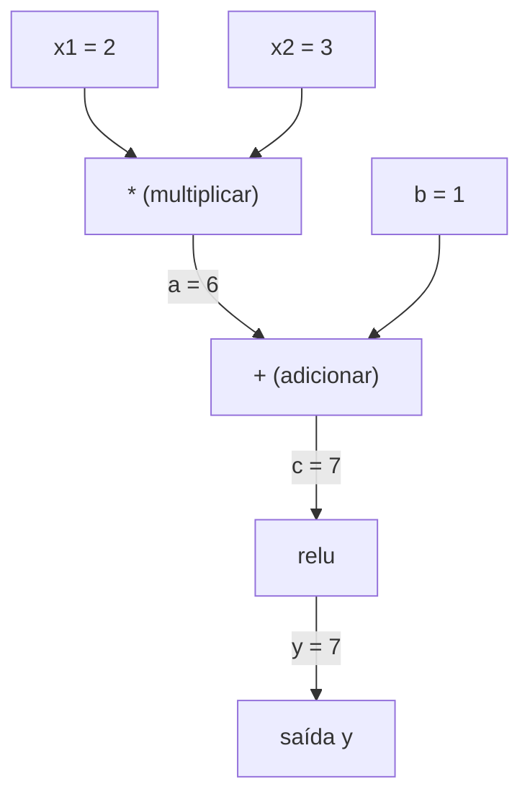
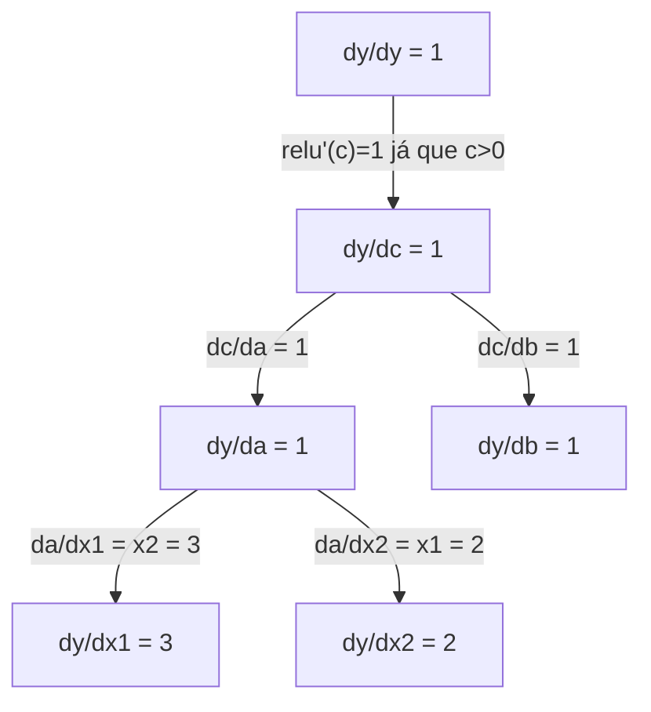

# Regra da Cadeia & Diferenciação Automática

> A regra da cadeia é o motor por trás de toda rede neural que aprende.

**Tipo:** Construir
**Linguagem:** Python
**Pré-requisitos:** Fase 1, Aula 04 (Derivadas & Gradientes)
**Tempo:** ~90 minutos

## Objetivos de Aprendizado

- Construir um motor de autograd mínimo (classe Value) que registra operações e computa gradientes via autodiff de modo reverso
- Implementar passes forward e backward através de um grafo de computação usando ordenação topológica
- Construir e treinar um MLP em XOR usando apenas o motor de autograd do zero
- Verificar a correção do autodiff usando verificação de gradiente contra diferenças finitas numéricas

## O Problemo

Você consegue computar derivadas de funções simples. Mas uma rede neural não é uma função simples. São centenas de funções compostas: multiplicação de matrizes, adicionar bias, aplicar ativação, multiplicar matrizes de novo, softmax, perda de entropia cruzada. A saída é uma função de uma função de uma função.

Pra treinar a rede, você precisa do gradiente da perda em relação a cada peso individualmente. Fazer isso à mão é impossível para milhões de parâmetros. Fazer numericamente (diferenças finitas) é lento demais.

A regra da cadeia dá a matemática. A diferenciação automática dá o algoritmo. Juntos, permitem computar gradientes exatos através de composições arbitrárias de funções em tempo proporcional a um único forward pass.

É assim que PyTorch, TensorFlow e JAX funcionam. Você vai construir uma versão em miniatura do zero.

## O Conceito

### A Regra da Cadeia

Se `y = f(g(x))`, a derivada de `y` em relação a `x` é:

```
dy/dx = dy/dg * dg/dx = f'(g(x)) * g'(x)
```

Multiplique as derivadas ao longo da cadeia. Cada elo contribui com sua derivada local.

Exemplo: `y = sin(x^2)`

```
g(x) = x^2       g'(x) = 2x
f(g) = sin(g)     f'(g) = cos(g)

dy/dx = cos(x^2) * 2x
```

Para composições mais profundas, a cadeia se estende:

```
y = f(g(h(x)))

dy/dx = f'(g(h(x))) * g'(h(x)) * h'(x)
```

Cada camada em uma rede neural é um elo nessa cadeia.

### Grafos de Computação

Um grafo de computação torna a regra da cadeia visual. Cada operação vira um nó. Dados fluem pra frente pelo grafo. Gradientes fluem pra trás.

**Forward pass (computar valores):**



**Backward pass (computar gradientes):**



O backward pass aplica a regra da cadeia em cada nó, propagando gradientes da saída pra entrada.

### Modo Direto vs Modo Reverso

Existem duas formas de aplicar a regra da cadeia através de um grafo.

**Modo direto** começa nas entradas e empurra derivadas pra frente. Calcula `dx/dx = 1` e propaga por cada operação. Bom quando você tem poucas entradas e muitas saídas.

```
Modo direto: semente dx/dx = 1, propagar pra frente

  x = 2       (dx/dx = 1)
  a = x^2     (da/dx = 2x = 4)
  y = sin(a)  (dy/dx = cos(a) * da/dx = cos(4) * 4 = -2.615)
```

**Modo reverso** começa na saída e puxa gradientes pra trás. Calcula `dy/dy = 1` e propaga por cada operação ao contrário. Bom quando você tem muitas entradas e poucas saídas.

```
Modo reverso: semente dy/dy = 1, propagar pra trás

  y = sin(a)  (dy/dy = 1)
  a = x^2     (dy/da = cos(a) = cos(4) = -0.654)
  x = 2       (dy/dx = dy/da * da/dx = -0.654 * 4 = -2.615)
```

Redes neurais têm milhões de entradas (pesos) e uma saída (perda). O modo reverso computa todos os gradientes em um único backward pass. É por isso que a retropropagacao usa o modo reverso.

| Modo | Semente | Direção | Melhor quando |
|------|------|-----------|-----------|
| Direto | `dx_i/dx_i = 1` | Entrada para saída | Poucas entradas, muitas saídas |
| Reverso | `dy/dy = 1` | Saída para entrada | Muitas entradas, poucas saídas (redes neurais) |

### Números Duais para o Modo Direto

O modo direto pode ser implementado elegantemente com números duais. Um número dual tem a forma `a + b*epsilon` onde `epsilon^2 = 0`.

```
Número dual: (valor, derivada)

(2, 1) significa: valor é 2, derivada em relação a x é 1

Regras aritméticas:
  (a, a') + (b, b') = (a+b, a'+b')
  (a, a') * (b, b') = (a*b, a'*b + a*b')
  sin(a, a')         = (sin(a), cos(a)*a')
```

Semente a variável de entrada com derivada 1. A derivada se propaga automaticamente por cada operação.

### Construindo um Motor de Autograd

Um motor de autograd precisa de três coisas:

1. **Empacotamento de Value.** Envolva cada número em um objeto que armazena seu valor e gradiente.
2. **Registro de grafo.** Cada operação registra suas entradas e a função de gradiente local.
3. **Backward pass.** Faça ordenação topológica do grafo, depois percorra ao contrário, aplicando a regra da cadeia em cada nó.

Isso é exatamente o que o `autograd` do PyTorch faz. A classe `torch.Tensor` envolve valores, registra operações quando `requires_grad=True`, e computa gradientes quando você chama `.backward()`.

### Como o Autograd do PyTorch Funciona Por Baixo dos Panos

Quando você escreve código PyTorch:

```python
x = torch.tensor(2.0, requires_grad=True)
y = x ** 2 + 3 * x + 1
y.backward()
print(x.grad)  # 7.0 = 2*x + 3 = 2*2 + 3
```

PyTorch internamente:

1. Cria um nó `Tensor` para `x` com `requires_grad=True`
2. Toda operação (`**`, `*`, `+`) cria um novo nó e registra a função backward
3. `y.backward()` dispara autodiff de modo reverso pelo grafo registrado
4. O `grad_fn` de cada nó computa gradientes locais e passa pros nós pais
5. Gradientes se acumulam nos atributos `.grad` via adição (não substituição)

O grafo é dinâmico (definido na execução). Um novo grafo é construído a cada forward pass. É por isso que PyTorch suporta controle (if/else, loops) dentro de modelos.

## Construa

### Passo 1: A classe Value

```python
class Value:
    def __init__(self, data, children=(), op=''):
        self.data = data
        self.grad = 0.0
        self._backward = lambda: None
        self._prev = set(children)
        self._op = op

    def __repr__(self):
        return f"Value(data={self.data:.4f}, grad={self.grad:.4f})"
```

Cada `Value` armazena seus dados numéricos, seu gradiente (inicialmente zero), uma função backward e ponteiros para nós filhos que o produziram.

### Passo 2: Operações aritméticas com rastreamento de gradiente

```python
    def __add__(self, other):
        other = other if isinstance(other, Value) else Value(other)
        out = Value(self.data + other.data, (self, other), '+')
        def _backward():
            self.grad += out.grad
            other.grad += out.grad
        out._backward = _backward
        return out

    def __mul__(self, other):
        other = other if isinstance(other, Value) else Value(other)
        out = Value(self.data * other.data, (self, other), '*')
        def _backward():
            self.grad += other.data * out.grad
            other.grad += self.data * out.grad
        out._backward = _backward
        return out

    def relu(self):
        out = Value(max(0, self.data), (self,), 'relu')
        def _backward():
            self.grad += (1.0 if out.data > 0 else 0.0) * out.grad
        out._backward = _backward
        return out
```

Cada operação cria um closure que sabe como computar gradientes locais e multiplicar pelo gradiente de montante (`out.grad`). O `+=` lida com o caso de um valor ser usado em múltiplas operações.

### Passo 3: O backward pass

```python
    def backward(self):
        topo = []
        visited = set()
        def build_topo(v):
            if v not in visited:
                visited.add(v)
                for child in v._prev:
                    build_topo(child)
                topo.append(v)
        build_topo(self)

        self.grad = 1.0
        for v in reversed(topo):
            v._backward()
```

Ordenação topológica garante que o gradiente de cada nó esteja totalmente computado antes de propagar pros filhos. O gradiente semente é 1.0 (dy/dy = 1).

### Passo 4: Mais operações para um motor completo

A classe Value básica lida com soma, multiplicação e relu. Um motor de autograd real precisa de mais. Aqui estão as operações que você precisa pra construir redes neurais:

```python
    def __neg__(self):
        return self * -1

    def __sub__(self, other):
        return self + (-other)

    def __radd__(self, other):
        return self + other

    def __rmul__(self, other):
        return self * other

    def __rsub__(self, other):
        return other + (-self)

    def __pow__(self, n):
        out = Value(self.data ** n, (self,), f'**{n}')
        def _backward():
            self.grad += n * (self.data ** (n - 1)) * out.grad
        out._backward = _backward
        return out

    def __truediv__(self, other):
        return self * (other ** -1) if isinstance(other, Value) else self * (Value(other) ** -1)

    def exp(self):
        import math
        e = math.exp(self.data)
        out = Value(e, (self,), 'exp')
        def _backward():
            self.grad += e * out.grad
        out._backward = _backward
        return out

    def log(self):
        import math
        out = Value(math.log(self.data), (self,), 'log')
        def _backward():
            self.grad += (1.0 / self.data) * out.grad
        out._backward = _backward
        return out

    def tanh(self):
        import math
        t = math.tanh(self.data)
        out = Value(t, (self,), 'tanh')
        def _backward():
            self.grad += (1 - t ** 2) * out.grad
        out._backward = _backward
        return out
```

**Por que cada operação importa:**

| Operação | Regra backward | Usada em |
|-----------|--------------|---------| 
| `__sub__` | Reusa add + neg | Cálculo de perda (pred - target) |
| `__pow__` | n * x^(n-1) | Ativações polinomiais, MSE (erro^2) |
| `__truediv__` | Reusa mul + pow(-1) | Normalização, escala de taxa de aprendizado |
| `exp` | exp(x) * upstream | Softmax, log-verossimilhança |
| `log` | (1/x) * upstream | Perda de entropia cruzada, log probabilidades |
| `tanh` | (1 - tanh^2) * upstream | Função de ativação clássica |

O detalhe esperto: `__sub__` e `__truediv__` são definidos em termos de operações existentes. Eles recebem gradientes corretos de graça porque a regra da cadeia compõe através das operações base de add/mul/pow.

### Passo 5: Mini MLP do zero

Com uma classe Value completa, você pode construir uma rede neural. Sem PyTorch. Sem NumPy. Só Values e a regra da cadeia.

```python
import random

class Neuron:
    def __init__(self, n_inputs):
        self.w = [Value(random.uniform(-1, 1)) for _ in range(n_inputs)]
        self.b = Value(0.0)

    def __call__(self, x):
        act = sum((wi * xi for wi, xi in zip(self.w, x)), self.b)
        return act.tanh()

    def parameters(self):
        return self.w + [self.b]

class Layer:
    def __init__(self, n_inputs, n_outputs):
        self.neurons = [Neuron(n_inputs) for _ in range(n_outputs)]

    def __call__(self, x):
        return [n(x) for n in self.neurons]

    def parameters(self):
        return [p for n in self.neurons for p in n.parameters()]

class MLP:
    def __init__(self, sizes):
        self.layers = [Layer(sizes[i], sizes[i+1]) for i in range(len(sizes)-1)]

    def __call__(self, x):
        for layer in self.layers:
            x = layer(x)
        return x[0] if len(x) == 1 else x

    def parameters(self):
        return [p for layer in self.layers for p in layer.parameters()]
```

Um `Neuron` computa `tanh(w1*x1 + w2*x2 + ... + b)`. Uma `Layer` é uma lista de neurônios. Um `MLP` empilha camadas. Cada peso é um `Value`, então chamar `loss.backward()` propaga gradientes pra cada parâmetro.

**Treinando em XOR:**

```python
random.seed(42)
model = MLP([2, 4, 1])  # 2 entradas, 4 neurônios ocultos, 1 saída

xs = [[0, 0], [0, 1], [1, 0], [1, 1]]
ys = [-1, 1, 1, -1]  # padrão XOR (usando -1/1 pra tanh)

for step in range(100):
    preds = [model(x) for x in xs]
    loss = sum((p - y) ** 2 for p, y in zip(preds, ys))

    for p in model.parameters():
        p.grad = 0.0
    loss.backward()

    lr = 0.05
    for p in model.parameters():
        p.data -= lr * p.grad

    if step % 20 == 0:
        print(f"passo {step:3d}  perda = {loss.data:.4f}")

print("\nPrevisões após treino:")
for x, y in zip(xs, ys):
    print(f"  entrada={x}  alvo={y:2d}  pred={model(x).data:6.3f}")
```

Isso é o micrograd. Um laço completo de treino de rede neural em puro Python com diferenciação automática. Toda framework comercial de deep learning faz a mesma coisa em escala massiva.

### Passo 6: Verificação de gradiente

Como você sabe que seu autodiff está correto? Compare contra derivadas numéricas. Isso é verificação de gradiente.

```python
def gradient_check(build_expr, x_val, h=1e-7):
    x = Value(x_val)
    y = build_expr(x)
    y.backward()
    autodiff_grad = x.grad

    y_plus = build_expr(Value(x_val + h)).data
    y_minus = build_expr(Value(x_val - h)).data
    numerical_grad = (y_plus - y_minus) / (2 * h)

    diff = abs(autodiff_grad - numerical_grad)
    return autodiff_grad, numerical_grad, diff
```

Teste em uma expressão complexa:

```python
def expr(x):
    return (x ** 3 + x * 2 + 1).tanh()

ad, num, diff = gradient_check(expr, 0.5)
print(f"Autodiff:  {ad:.8f}")
print(f"Numérico: {num:.8f}")
print(f"Diferença: {diff:.2e}")
# Diferença deve ser < 1e-5
```

Verificação de gradiente é essencial ao implementar novas operações. Se seu backward pass tem um bug, a verificação numérica pega. Toda implementação séria de deep learning roda verificações de gradiente durante o desenvolvimento.

**Quando usar verificação de gradiente:**

| Situação | Fazer verificação de gradiente? |
|-----------|-------------------|
| Adicionando uma nova operação ao seu autograd | Sim, sempre |
| Depurando um laço de treino que não converge | Sim, verifique gradientes primeiro |
| Treino em produção | Não, lento demais (2x forward passes por parâmetro) |
| Testes unitários para código autograd | Sim, automatize |

### Passo 7: Verificação contra cálculo manual

```python
x1 = Value(2.0)
x2 = Value(3.0)
a = x1 * x2          # a = 6.0
b = a + Value(1.0)    # b = 7.0
y = b.relu()          # y = 7.0

y.backward()

print(f"y = {y.data}")          # 7.0
print(f"dy/dx1 = {x1.grad}")   # 3.0 (= x2)
print(f"dy/dx2 = {x2.grad}")   # 2.0 (= x1)
```

Verificação manual: `y = relu(x1*x2 + 1)`. Já que `x1*x2 + 1 = 7 > 0`, relu é identidade.
`dy/dx1 = x2 = 3`. `dy/dx2 = x1 = 2`. O motor combina.

## Use

### Verificação contra PyTorch

```python
import torch

x1 = torch.tensor(2.0, requires_grad=True)
x2 = torch.tensor(3.0, requires_grad=True)
a = x1 * x2
b = a + 1.0
y = torch.relu(b)
y.backward()

print(f"PyTorch dy/dx1 = {x1.grad.item()}")  # 3.0
print(f"PyTorch dy/dx2 = {x2.grad.item()}")  # 2.0
```

Mesmos gradientes. Seu motor computa o mesmo resultado que o PyTorch porque a matemática é a mesma: autodiff de modo reverso via regra da cadeia.

### Uma expressão mais complexa

```python
a = Value(2.0)
b = Value(-3.0)
c = Value(10.0)
f = (a * b + c).relu()  # relu(2*(-3) + 10) = relu(4) = 4

f.backward()
print(f"df/da = {a.grad}")  # -3.0 (= b)
print(f"df/db = {b.grad}")  #  2.0 (= a)
print(f"df/dc = {c.grad}")  #  1.0
```

## Entregue

Esta aula produz:
- `outputs/skill-autodiff.md` — uma habilidade para construir e depurar sistemas autograd
- `code/autodiff.py` — um motor de autograd mínimo que você pode estender

A classe Value construída aqui é a base para o laço de treino de rede neural na Fase 3.

## Exercícios

1. Adicione `__pow__` à classe Value para que você possa computar `x ** n`. Verifique que `d/dx(x^3)` em `x=2` é igual a `12.0`.

2. Adicione `tanh` como função de ativação. Verifique que `tanh'(0) = 1` e `tanh'(2) = 0.0707` (aprox).

3. Construa um grafo de computação para um único neurônio: `y = relu(w1*x1 + w2*x2 + b)`. Compute todos os cinco gradientes e verifique contra PyTorch.

4. Implemente autodiff de modo direto usando números duais. Crie uma classe `Dual` e verifique que ela dá as mesmas derivadas que seu motor de modo reverso.

## Termos Chave

| Termo | O que dizem | O que realmente significa |
|------|----------------|----------------------|
| Regra da cadeia | "Multiplicar as derivadas" | A derivada de funções compostas é igual ao produto da derivada local de cada função, avaliado no ponto correto |
| Grafo de computação | "O diagrama de rede" | Um grafo acíclico direcionado onde nós são operações e arestas carregam valores (forward) ou gradientes (backward) |
| Modo reverso | "Retropropagacao" | Autodiff que propaga gradientes da saída pra entrada. Um passo por variável de saída. |
| Autograd | "Gradientes automáticos" | Um sistema que registra operações sobre valores, constrói um grafo e computa gradientes exatos via regra da cadeia |
| Números duais | "Valor mais derivada" | Números da forma a + b*epsilon (epsilon^2 = 0) que carregam informação de derivada pela aritmética |
| Ordenação topológica | "Ordem de dependência" | Ordenar nós do grafo de modo que cada nó venha depois de todas as suas dependências. Necessário para propagação correta de gradiente. |
| MLP | "Perceptron multicamada" | Uma rede neural com uma ou mais camadas ocultas de neurônios. Cada neurônio computa uma soma ponderada mais bias, depois aplica uma função de ativação. |
| Neuronio | "Soma ponderada + ativação" | A unidade básica: saída = ativação(w1*x1 + w2*x2 + ... + b). Os pesos e bias são parâmetros aprendíveis. |

## Leitura Complementar

- [3Blue1Brown: Cálculo da Retropropagacao](https://www.youtube.com/watch?v=tIeHLnjs5U8) — explicação visual da regra da cadeia em redes neurais
- [Mecânicas do Autograd do PyTorch](https://pytorch.org/docs/stable/notes/autograd.html) — como o sistema real funciona
- [Baydin et al., Diferenciação Automática em Machine Learning: um Survey](https://arxiv.org/abs/1502.05767) — referência abrangente
