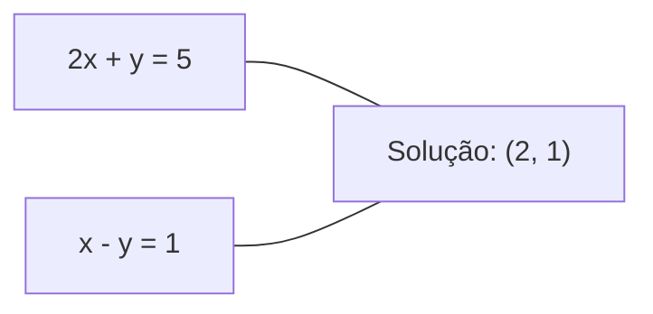
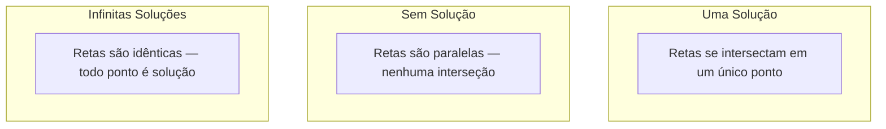

# Sistemas Lineares

> Resolver Ax = b é o problema mais antigo da matemática que ainda roda sua rede neural.

**Tipo:** Construção
**Idioma:** Python
**Pré-requisitos:** Fase 1, Lições 01 (Intuição de Álgebra Linear), 02 (Vetores & Matrizes), 03 (Transformações de Matriz)
**Tempo:** ~120 minutos

## Objetivos de Aprendizado

- Resolver Ax = b usando eliminação gaussiana com pivoteamento parcial e substituição regressiva
- Fatorar matrizes com decomposições LU, QR e Cholesky e explicar quando cada uma é apropriada
- Derivar as equações normais para mínimos quadrados e conectá-las à regressão linear e ridge
- Diagnosticar sistemas mal-condicionados usando o número de condição e aplicar regularização para estabilizá-los

## O Problema

Toda vez que você treina uma regressão linear, resolve um sistema linear. Toda vez que calcula um ajuste de mínimos quadrados, resolve um sistema linear. Toda vez que uma camada de rede neural computa `y = Wx + b`, está avaliando um lado de um sistema linear. Quando você adiciona regularização, modifica o sistema. Quando usa processos Gaussianos, fatora uma matriz. Quando inverte uma matriz de covariância para distância de Mahalanobis, resolve um sistema linear.

A equação Ax = b aparece em todo lugar. A é uma matriz de coeficientes conhecidos. b é um vetor de saídas conhecidas. x é o vetor de incógnitas que você quer encontrar. Em regressão linear, A é sua matriz de dados, b é seu vetor alvo, e x é o vetor de pesos. O modelo inteiro reduz-se a: encontre x tal que Ax seja o mais próximo possível de b.

Esta lição constrói cada método principal para resolver essa equação do zero. Você entenderá por que alguns métodos são rápidos e outros são estáveis, por que alguns funcionam apenas para sistemas quadrados e outros lidam com sistemas sobredeterminados, e por que o número de condição de sua matriz determina se sua resposta significa algo.

## O Conceito

### O que Ax = b significa geometricamente

Um sistema de equações lineares tem uma interpretação geométrica. Cada equação define um hiperplano. A solução é o ponto (ou conjunto de pontos) onde todos os hiperplanos se intersectam.

```
2x + y = 5          Duas retas em 2D.
x - y  = 1          Elas se intersectam em x=2, y=1.
```



Três coisas podem acontecer:



Na forma matricial, "uma solução" significa que A é invertível. "Sem solução" significa que o sistema é inconsistente. "Infinitas soluções" significa que A tem um espaço nulo. A maioria dos problemas de ML cai na categoria "sem solução exata" porque você tem mais equações (pontos de dados) que incógnitas (parâmetros). É aí que entram os mínimos quadrados.

### Visão de colunas vs visão de linhas

Há duas maneiras de ler Ax = b.

**Visão de linhas.** Cada linha de A define uma equação. Cada equação é um hiperplano. A solução é onde todos se intersectam.

**Visão de colunas.** Cada coluna de A é um vetor. A pergunta se torna: que combinação linear das colunas de A produz b?

```
A = | 2  1 |    b = | 5 |
    | 1 -1 |        | 1 |

Visão de linhas: resolva 2x + y = 5 e x - y = 1 simultaneamente.

Visão de colunas: encontre x1, x2 tais que:
  x1 * [2, 1] + x2 * [1, -1] = [5, 1]
  2 * [2, 1] + 1 * [1, -1] = [4+1, 2-1] = [5, 1]   confere.
```

A visão de colunas é mais fundamental. Se b está no espaço coluna de A, o sistema tem solução. Se b não está, você encontra o ponto mais próximo no espaço coluna. Esse ponto mais próximo é a solução de mínimos quadrados.

### Eliminação Gaussiana

A eliminação gaussiana transforma Ax = b em um sistema triangular superior Ux = c que você resolve por substituição regressiva. É o método mais direto.

O algoritmo:

```
1. Para cada coluna k (a coluna pivô):
   a. Encontre a maior entrada na coluna k na ou abaixo da linha k (pivoteamento parcial).
   b. Troque essa linha com a linha k.
   c. Para cada linha i abaixo de k:
      - Compute o multiplicador m = A[i][k] / A[k][k]
      - Subtraia m vezes a linha k da linha i.
2. Substituição regressiva: resolva da última equação para cima.
```

Exemplo:

```
Original:
| 2  1  1 | 8 |       R2 = R2 - (2)R1     | 2  1   1 |  8 |
| 4  3  3 |20 |  -->  R3 = R3 - (1)R1 --> | 0  1   1 |  4 |
| 2  3  1 |12 |                            | 0  2   0 |  4 |

                       R3 = R3 - (2)R2     | 2  1   1 |  8 |
                                       --> | 0  1   1 |  4 |
                                           | 0  0  -2 | -4 |

Substituição regressiva:
  -2 * x3 = -4    -->  x3 = 2
  x2 + 2  = 4     -->  x2 = 2
  2*x1 + 2 + 2 = 8 --> x1 = 2
```

A eliminação gaussiana custa O(n^3) operações. Para um sistema 1000x1000, isso é cerca de um bilhão de operações de ponto flutuante. Rápido, mas você pode fazer melhor se precisar resolver múltiplos sistemas com o mesmo A.

### Pivoteamento parcial: por que importa

Sem pivoteamento, a eliminação gaussiana pode falhar ou produzir lixo. Se um elemento pivô é zero, você divide por zero. Se é pequeno, você amplifica erros de arredondamento.

```
Pivô ruim:                       Com pivoteamento parcial:
| 0.001  1 | 1.001 |            Troque linhas primeiro:
| 1      1 | 2     |            | 1      1 | 2     |
                                 | 0.001  1 | 1.001 |
m = 1/0.001 = 1000              m = 0.001/1 = 0.001
R2 = R2 - 1000*R1               R2 = R2 - 0.001*R1
| 0.001  1     | 1.001   |      | 1      1     | 2     |
| 0     -999   | -999.0  |      | 0      0.999 | 0.999 |

x2 = 1.000 (correto)            x2 = 1.000 (correto)
x1 = (1.001 - 1)/0.001          x1 = (2 - 1)/1 = 1.000 (correto)
   = 0.001/0.001 = 1.000        Estável porque o multiplicador é pequeno.
```

Em aritmética de ponto flutuante com precisão limitada, a versão sem pivoteamento pode perder dígitos significativos. O pivoteamento parcial sempre seleciona o maior pivô disponível para minimizar a amplificação de erro.

### Decomposição LU

A decomposição LU fatora A em uma matriz triangular inferior L e uma matriz triangular superior U: A = LU. A matriz L armazena os multiplicadores da eliminação gaussiana. A matriz U é o resultado da eliminação.

```
A = L @ U

| 2  1  1 |   | 1  0  0 |   | 2  1   1 |
| 4  3  3 | = | 2  1  0 | @ | 0  1   1 |
| 2  3  1 |   | 1  2  1 |   | 0  0  -2 |
```

Por que fatorar em vez de apenas eliminar? Porque uma vez que você tem L e U, resolver Ax = b para qualquer novo b custa apenas O(n^2):

```
Ax = b
LUx = b
Seja y = Ux:
  Ly = b    (substituição progressiva, O(n^2))
  Ux = y    (substituição regressiva, O(n^2))
```

O custo O(n^3) é pago uma vez durante a fatoração. Cada resolução subsequente é O(n^2). Se você precisa resolver 1000 sistemas com o mesmo A mas diferentes vetores b, LU economiza um fator de 1000/3 no trabalho total.

Com pivoteamento parcial, você obtém PA = LU onde P é uma matriz de permutação registrando as trocas de linhas.

### Decomposição QR

A decomposição QR fatora A em uma matriz ortogonal Q e uma matriz triangular superior R: A = QR.

Uma matriz ortogonal tem a propriedade Q^T Q = I. Suas colunas são vetores ortonormais. Multiplicar por Q preserva comprimentos e ângulos.

```
A = Q @ R

Q tem colunas ortonormais: Q^T Q = I
R é triangular superior

Para resolver Ax = b:
  QRx = b
  Rx = Q^T b    (basta multiplicar por Q^T, sem necessidade de inversão)
  Substituição regressiva para obter x.
```

QR é numericamente mais estável que LU para resolver problemas de mínimos quadrados. O processo Gram-Schmidt constrói Q coluna por coluna:

```
Dadas colunas a1, a2, ... de A:

q1 = a1 / ||a1||

q2 = a2 - (a2 . q1) * q1        (subtrair projeção em q1)
q2 = q2 / ||q2||                (normalizar)

q3 = a3 - (a3 . q1) * q1 - (a3 . q2) * q2
q3 = q3 / ||q3||

R[i][j] = qi . aj    para i <= j
```

Cada passo remove a componente ao longo de todos os q anteriores, deixando apenas a nova direção ortogonal.

### Decomposição Cholesky

Quando A é simétrica (A = A^T) e definida positiva (todos autovalores positivos), você pode fatorá-la como A = L L^T onde L é triangular inferior. Esta é a decomposição Cholesky.

```
A = L @ L^T

| 4  2 |   | 2  0 |   | 2  1 |
| 2  5 | = | 1  2 | @ | 0  2 |

L[i][i] = sqrt(A[i][i] - sum(L[i][k]^2 for k < i))
L[i][j] = (A[i][j] - sum(L[i][k]*L[j][k] for k < j)) / L[j][j]    para i > j
```

Cholesky é duas vezes mais rápida que LU e requer metade do armazenamento. Só funciona para matrizes simétricas definidas positivas, mas essas aparecem constantemente:

- Matrizes de covariância são simétricas semidefinidas positivas (definidas positivas com regularização).
- A matriz kernel em processos Gaussianos é simétrica definida positiva.
- A Hessiana de uma função convexa em um mínimo é simétrica definida positiva.
- A^T A é sempre simétrica semidefinida positiva.

Em processos Gaussianos, você fatora a matriz kernel K com Cholesky, depois resolve K alpha = y para obter a média preditiva. O fator Cholesky também dá o log-determinante para a verossimilhança marginal: log det(K) = 2 * sum(log(diag(L))).

### Mínimos Quadrados: quando Ax = b não tem solução exata

Se A é m x n com m > n (mais equações que incógnitas), o sistema é sobredeterminado. Não há solução exata. Em vez disso, você minimiza o erro quadrático:

```
minimize ||Ax - b||^2

Esta é a soma dos resíduos ao quadrado:
  sum((A[i,:] @ x - b[i])^2 for i in range(m))
```

O minimizador satisfaz as equações normais:

```
A^T A x = A^T b
```

Derivação: expanda ||Ax - b||^2 = (Ax - b)^T (Ax - b) = x^T A^T A x - 2 x^T A^T b + b^T b. Tome o gradiente em relação a x, iguale a zero: 2 A^T A x - 2 A^T b = 0.

```
Sistema original (sobredeterminado, 4 equações, 2 incógnitas):
| 1  1 |         | 3 |
| 1  2 | x     = | 5 |       Nenhum x exato satisfaz todas as 4 equações.
| 1  3 |         | 6 |
| 1  4 |         | 8 |

Equações normais:
A^T A = | 4  10 |    A^T b = | 22 |
        | 10 30 |            | 63 |

Resolva: x = [1.5, 1.7]

Isto é regressão linear. x[0] é o intercepto, x[1] é a inclinação.
```

### Equações Normais = Regressão Linear

A conexão é exata. Em regressão linear, sua matriz de dados X tem uma linha por amostra e uma coluna por feature. Seu vetor alvo y tem uma entrada por amostra. O vetor de pesos w satisfaz:

```
X^T X w = X^T y
w = (X^T X)^(-1) X^T y
```

Esta é a solução fechada para regressão linear. Cada chamada a `sklearn.linear_model.LinearRegression.fit()` computa isto (ou um equivalente via QR ou SVD).

Adicione um termo de regularização lambda * I à matriz e você obtém regressão ridge:

```
(X^T X + lambda * I) w = X^T y
w = (X^T X + lambda * I)^(-1) X^T y
```

A regularização torna a matriz melhor condicionada (mais fácil de inverter precisamente) e previne overfitting encolhendo os pesos para zero. A matriz X^T X + lambda * I é sempre simétrica definida positiva quando lambda > 0, então você pode usar Cholesky para resolvê-la.

### Pseudoinversa (Moore-Penrose)

A pseudoinversa A+ generaliza a inversão de matrizes para matrizes não-quadradas e singulares. Para qualquer matriz A:

```
x = A+ b

onde A+ = V Sigma+ U^T    (computada via SVD)
```

Sigma+ é formada tomando o inverso de cada valor singular não-zero e transpondo o resultado. Se A = U Sigma V^T, então A+ = V Sigma+ U^T.

```
A = U Sigma V^T        (SVD)

Sigma = | 5  0 |       Sigma+ = | 1/5  0  0 |
        | 0  2 |                | 0  1/2  0 |
        | 0  0 |

A+ = V Sigma+ U^T
```

A pseudoinversa dá a solução de mínimos quadrados de norma mínima. Se o sistema tem:
- Uma solução: A+ b a encontra.
- Nenhuma solução: A+ b dá a solução de mínimos quadrados.
- Infinitas soluções: A+ b dá aquela com o menor ||x||.

Os `np.linalg.lstsq` e `np.linalg.pinv` do NumPy usam SVD internamente.

### Número de Condição

O número de condição mede quão sensível a solução é a pequenas mudanças na entrada. Para uma matriz A, o número de condição é:

```
kappa(A) = ||A|| * ||A^(-1)|| = sigma_max / sigma_min
```

onde sigma_max e sigma_min são os maiores e menores valores singulares.

```
Bem-condicionado (kappa ~ 1):        Mal-condicionado (kappa ~ 10^15):
Pequena mudança em b -->             Pequena mudança em b -->
pequena mudança em x                 mudança enorme em x

| 2  0 |   kappa = 2/1 = 2          | 1   1          |   kappa ~ 10^15
| 0  1 |   seguro de resolver       | 1   1+10^(-15) |   solução é lixo
```

Regras práticas:
- kappa < 100: seguro, solução é precisa.
- kappa ~ 10^k: você perde cerca de k dígitos de precisão da sua aritmética de ponto flutuante.
- kappa ~ 10^16 (para float64): a solução não significa nada. A matriz é efetivamente singular.

Em ML, mal-condicionamento acontece quando features são quase colineares. A regularização (adicionar lambda * I) melhora o número de condição de sigma_max / sigma_min para (sigma_max + lambda) / (sigma_min + lambda).

### Métodos Iterativos: Gradiente Conjugado

Para sistemas esparsos muito grandes (milhões de incógnitas), métodos diretos como LU ou Cholesky são muito caros. Métodos iterativos aproximam a solução melhorando um palpite ao longo de muitas iterações.

O gradiente conjugado (CG) resolve Ax = b quando A é simétrica definida positiva. Ele encontra a solução exata em no máximo n iterações (em aritmética exata), mas tipicamente converge muito mais rápido se os autovalores de A são agrupados.

```
Esboço do algoritmo:
  x0 = palpite inicial (frequentemente zero)
  r0 = b - A x0           (resíduo)
  p0 = r0                 (direção de busca)

  Para k = 0, 1, 2, ...:
    alpha = (rk . rk) / (pk . A pk)
    x_{k+1} = xk + alpha * pk
    r_{k+1} = rk - alpha * A pk
    beta = (r_{k+1} . r_{k+1}) / (rk . rk)
    p_{k+1} = r_{k+1} + beta * pk
    se ||r_{k+1}|| < tolerância: pare
```

CG é usado em:
- Otimização em grande escala (método Newton-CG)
- Resolução de discretizações de EDP
- Métodos kernel onde a matriz kernel é muito grande para fatorar
- Pré-condicionamento para outros solvers iterativos

A taxa de convergência depende do número de condição. Sistemas melhor condicionados convergem mais rápido, que é outra razão pela qual a regularização ajuda.

### O Quadro Completo: qual método quando

| Método | Requisitos | Custo | Caso de uso |
|--------|------------|-------|-------------|
| Eliminação gaussiana | A quadrada não-singular | O(n^3) | Solução única de sistema quadrado |
| Decomposição LU | A quadrada não-singular | O(n^3) fator + O(n^2) resolver | Múltiplas soluções com o mesmo A |
| Decomposição QR | Qualquer A (m >= n) | O(mn^2) | Mínimos quadrados, numericamente estável |
| Cholesky | A simétrica definida positiva | O(n^3/3) | Matrizes de covariância, processos Gaussianos, ridge |
| Equações normais | Sobredeterminado (m > n) | O(mn^2 + n^3) | Regressão linear (n pequeno) |
| SVD / pseudoinversa | Qualquer A | O(mn^2) | Sistemas com deficiência de posto, soluções de norma mínima |
| Gradiente conjugado | A simétrica definida positiva, esparsa | O(n * k * nnz) | Sistemas esparsos grandes, k = iterações |

### Conexão com ML

Cada método nesta lição aparece em ML de produção:

**Regressão linear.** A solução fechada resolve as equações normais X^T X w = X^T y. Isto é feito via Cholesky (se n é pequeno) ou QR (se estabilidade numérica importa) ou SVD (se a matriz pode ter deficiência de posto).

**Regressão ridge.** Adiciona lambda * I a X^T X. O sistema regularizado (X^T X + lambda * I) w = X^T y é sempre solúvel via Cholesky porque X^T X + lambda * I é simétrica definida positiva para lambda > 0.

**Processos Gaussianos.** A média preditiva requer resolver K alpha = y onde K é a matriz kernel. A fatoração Cholesky de K é a abordagem padrão. A log-verossimilhança marginal usa log det(K) = 2 sum(log(diag(L))).

**Inicialização de redes neurais.** A inicialização ortogonal usa decomposição QR para criar matrizes de pesos cujas colunas são ortonormais. Isso evita colapso de sinal em redes profundas.

**Pré-condicionamento.** Otimizadores em grande escala usam Cholesky incompleta ou LU incompleta como pré-condicionadores para solvers de gradiente conjugado.

**Engenharia de features.** O número de condição de X^T X te diz se suas features são colineares. Se kappa é grande, remova features ou adicione regularização.

## Construa

### Passo 1: Eliminação gaussiana com pivoteamento parcial

```python
import numpy as np

def gaussian_elimination(A, b):
    n = len(b)
    Ab = np.hstack([A.astype(float), b.reshape(-1, 1).astype(float)])

    for k in range(n):
        max_row = k + np.argmax(np.abs(Ab[k:, k]))
        Ab[[k, max_row]] = Ab[[max_row, k]]

        if abs(Ab[k, k]) < 1e-12:
            raise ValueError(f"Matriz é singular ou quase singular no pivô {k}")

        for i in range(k + 1, n):
            m = Ab[i, k] / Ab[k, k]
            Ab[i, k:] -= m * Ab[k, k:]

    x = np.zeros(n)
    for i in range(n - 1, -1, -1):
        x[i] = (Ab[i, -1] - Ab[i, i+1:n] @ x[i+1:n]) / Ab[i, i]

    return x
```

### Passo 2: Decomposição LU

```python
def lu_decompose(A):
    n = A.shape[0]
    L = np.eye(n)
    U = A.astype(float).copy()
    P = np.eye(n)

    for k in range(n):
        max_row = k + np.argmax(np.abs(U[k:, k]))
        if max_row != k:
            U[[k, max_row]] = U[[max_row, k]]
            P[[k, max_row]] = P[[max_row, k]]
            if k > 0:
                L[[k, max_row], :k] = L[[max_row, k], :k]

        for i in range(k + 1, n):
            L[i, k] = U[i, k] / U[k, k]
            U[i, k:] -= L[i, k] * U[k, k:]

    return P, L, U

def lu_solve(P, L, U, b):
    n = len(b)
    Pb = P @ b.astype(float)

    y = np.zeros(n)
    for i in range(n):
        y[i] = Pb[i] - L[i, :i] @ y[:i]

    x = np.zeros(n)
    for i in range(n - 1, -1, -1):
        x[i] = (y[i] - U[i, i+1:] @ x[i+1:]) / U[i, i]

    return x
```

### Passo 3: Decomposição Cholesky

```python
def cholesky(A):
    n = A.shape[0]
    L = np.zeros_like(A, dtype=float)

    for i in range(n):
        for j in range(i + 1):
            s = A[i, j] - L[i, :j] @ L[j, :j]
            if i == j:
                if s <= 0:
                    raise ValueError("Matriz não é definida positiva")
                L[i, j] = np.sqrt(s)
            else:
                L[i, j] = s / L[j, j]

    return L
```

### Passo 4: Mínimos quadrados via equações normais

```python
def least_squares_normal(A, b):
    AtA = A.T @ A
    Atb = A.T @ b
    return gaussian_elimination(AtA, Atb)

def ridge_regression(A, b, lam):
    n = A.shape[1]
    AtA = A.T @ A + lam * np.eye(n)
    Atb = A.T @ b
    L = cholesky(AtA)
    y = np.zeros(n)
    for i in range(n):
        y[i] = (Atb[i] - L[i, :i] @ y[:i]) / L[i, i]
    x = np.zeros(n)
    for i in range(n - 1, -1, -1):
        x[i] = (y[i] - L.T[i, i+1:] @ x[i+1:]) / L.T[i, i]
    return x
```

### Passo 5: Número de condição

```python
def condition_number(A):
    U, S, Vt = np.linalg.svd(A)
    return S[0] / S[-1]
```

## Use

Juntando as peças para regressão linear e ridge em dados reais:

```python
np.random.seed(42)
X_raw = np.random.randn(100, 3)
w_true = np.array([2.0, -1.0, 0.5])
y = X_raw @ w_true + np.random.randn(100) * 0.1

X = np.column_stack([np.ones(100), X_raw])

w_ols = least_squares_normal(X, y)
print(f"Pesos OLS (nosso):    {w_ols}")

w_np = np.linalg.lstsq(X, y, rcond=None)[0]
print(f"Pesos OLS (numpy):   {w_np}")
print(f"Diferença máxima: {np.max(np.abs(w_ols - w_np)):.2e}")

w_ridge = ridge_regression(X, y, lam=1.0)
print(f"Pesos Ridge (nosso):  {w_ridge}")

from sklearn.linear_model import Ridge
ridge_sk = Ridge(alpha=1.0, fit_intercept=False)
ridge_sk.fit(X, y)
print(f"Pesos Ridge (sklearn): {ridge_sk.coef_}")
```

## Entregue

Esta lição produz:
- `code/linear_systems.py` contendo implementações do zero de eliminação gaussiana, decomposição LU, decomposição Cholesky, mínimos quadrados e regressão ridge
- Uma demonstração funcional de que equações normais e sklearn LinearRegression produzem os mesmos pesos

## Exercícios

1. Resolva o sistema `[[1,2,3],[4,5,6],[7,8,10]] x = [6, 15, 27]` usando sua eliminação gaussiana, seu solver LU e `np.linalg.solve`. Verifique que todos os três dão a mesma resposta dentro da tolerância de ponto flutuante.

2. Gere uma matriz aleatória X 50x5 e alvo y = X @ w_true + ruído. Resolva para w usando equações normais, QR (via `np.linalg.qr`), SVD (via `np.linalg.svd`) e `np.linalg.lstsq`. Compare todas as quatro soluções. Meça o número de condição de X^T X e explique como ele afeta qual método você confia.

3. Crie uma matriz quase singular fazendo duas colunas quase idênticas (por exemplo, coluna 2 = coluna 1 + 1e-10 * ruído). Compute seu número de condição. Resolva Ax = b com e sem regularização (adicione 0.01 * I). Compare as soluções e resíduos. Explique por que a regularização ajuda.

4. Implemente o algoritmo de gradiente conjugado para uma matriz aleatória simétrica definida positiva 100x100. Conte quantas iterações leva para convergir para tolerância 1e-8. Compare com o máximo teórico de n iterações.

5. Meça o tempo de seu solver Cholesky vs seu solver LU vs `np.linalg.solve` em matrizes simétricas definidas positivas de tamanho 10, 50, 200, 500. Plote os resultados. Verifique que Cholesky é aproximadamente 2x mais rápido que LU.

## Termos-Chave

| Termo | O que as pessoas dizem | O que realmente significa |
|-------|----------------------|--------------------------|
| Sistema linear | "Resolver para x" | Um conjunto de equações lineares Ax = b. Encontrar x significa encontrar a entrada que produz saída b sob transformação A. |
| Eliminação gaussiana | "Redução de linha" | Zerar sistematicamente entradas abaixo da diagonal usando operações de linha, produzindo um sistema triangular superior solúvel por substituição regressiva. O(n^3). |
| Pivoteamento parcial | "Trocar linhas por estabilidade" | Antes de eliminar na coluna k, troque a linha com o maior valor absoluto naquela coluna para a posição de pivô. Previne divisão por números pequenos. |
| Decomposição LU | "Fatorar em triângulos" | Escrever A = LU onde L é triangular inferior (armazena multiplicadores) e U é triangular superior (a matriz eliminada). Amortiza o custo O(n^3) em múltiplas resoluções. |
| Decomposição QR | "Fatoração ortogonal" | Escrever A = QR onde Q tem colunas ortonormais e R é triangular superior. Mais estável que LU para mínimos quadrados. |
| Decomposição Cholesky | "Raiz quadrada de uma matriz" | Para A simétrica definida positiva, escrever A = LL^T. Metade do custo de LU. Usado para matrizes de covariância, matrizes kernel e regressão ridge. |
| Mínimos quadrados | "Melhor ajuste quando exato é impossível" | Minimizar a soma dos resíduos ao quadrado \|\|Ax - b\|\|^2 quando o sistema é sobredeterminado (mais equações que incógnitas). |
| Equações normais | "O atalho do cálculo" | A^T A x = A^T b. Igualar o gradiente de \|\|Ax - b\|\|^2 a zero. Isto É a solução fechada para regressão linear. |
| Pseudoinversa | "Inversão para matrizes não-quadradas" | A+ = V Sigma+ U^T via SVD. Dá a solução de mínimos quadrados de norma mínima para qualquer matriz, quadrada ou retangular, singular ou não. |
| Número de condição | "Quão confiável é esta resposta" | kappa = sigma_max / sigma_min. Mede sensibilidade a perturbações na entrada. Perde cerca de log10(kappa) dígitos de precisão. |
| Regressão ridge | "Mínimos quadrados regularizados" | Resolver (X^T X + lambda I) w = X^T y. Adicionar lambda I melhora o condicionamento e encolhe pesos para zero. Previne overfitting. |
| Gradiente conjugado | "Ax=b iterativo para matrizes grandes" | Um solver iterativo para sistemas simétricos definidos positivos. Converge em no máximo n passos. Prático para sistemas esparsos grandes onde fatoração é muito cara. |
| Sistema sobredeterminado | "Mais dados que parâmetros" | m > n em um sistema m-por-n. Nenhuma solução exata existe. Mínimos quadrados encontra a melhor aproximação. Este é todo problema de regressão. |
| Substituição regressiva | "Resolver de baixo para cima" | Dado um sistema triangular superior, resolva a última equação primeiro, depois substitua de volta. O(n^2). |
| Substituição progressiva | "Resolver de cima para baixo" | Dado um sistema triangular inferior, resolva a primeira equação primeiro, depois substitua adiante. O(n^2). Usado no passo L de soluções LU. |

## Leitura Adicional

- [MIT 18.06: Linear Algebra](https://ocw.mit.edu/courses/18-06-linear-algebra-spring-2010/) (Gilbert Strang) -- o curso definitivo sobre sistemas lineares e fatorações de matrizes
- [Numerical Linear Algebra](https://people.maths.ox.ac.uk/trefethen/text.html) (Trefethen & Bau) -- a referência padrão para entender estabilidade numérica, condicionamento e por que algoritmos falham
- [Matrix Computations](https://www.cs.cornell.edu/cv/GolubVanLoan4/golubandvanloan.htm) (Golub & Van Loan) -- a referência enciclopédica para todo algoritmo matricial
- [3Blue1Brown: Inverse Matrices](https://www.3blue1brown.com/lessons/inverse-matrices) -- intuição visual para o que resolver Ax = b significa geometricamente
