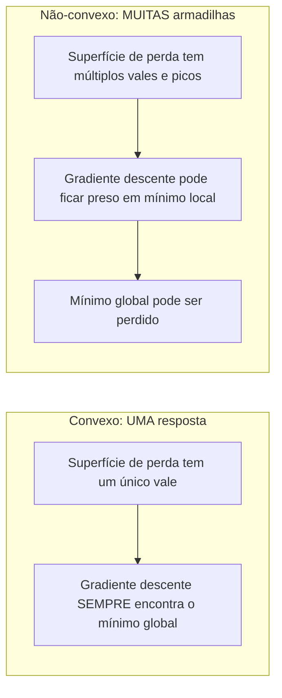
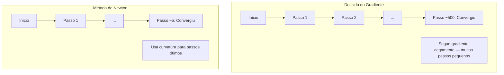
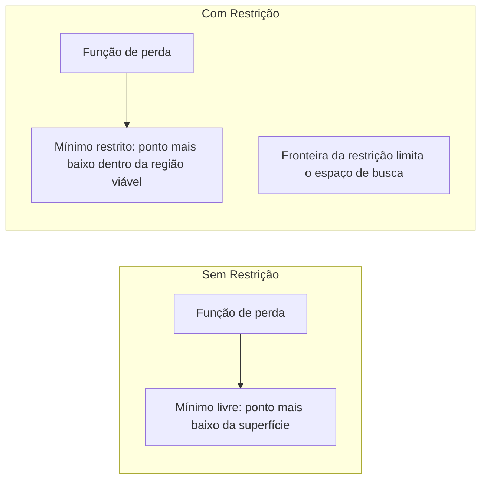
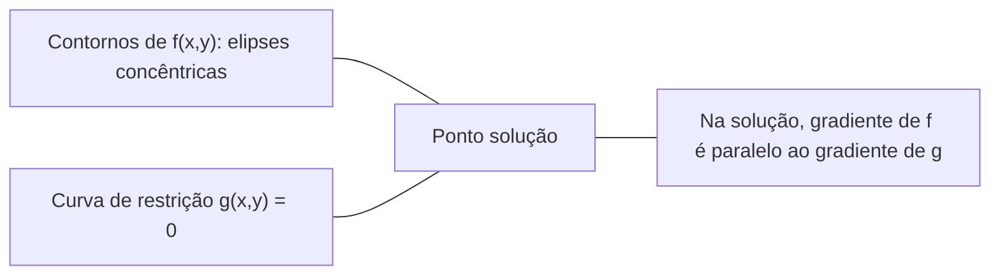

# Otimização Convexa

> Problemas convexos têm um vale. Redes neurais têm milhões. Saber a diferença importa.

**Tipo:** Construção
**Idioma:** Python
**Pré-requisitos:** Fase 1, Lições 04 (Cálculo para ML), 08 (Otimização)
**Tempo:** ~90 minutos

## Objetivos de Aprendizado

- Testar se uma função é convexa usando a definição, segunda derivada e critério Hessiano
- Implementar o método de Newton e comparar sua convergência quadrática contra descida do gradiente
- Resolver problemas de otimização com restrição usando multiplicadores de Lagrange e interpretar condições KKT
- Explicar por que paisagens de perda de redes neurais são não-convexas mas SGD ainda encontra boas soluções

## O Problema

A Lição 08 ensinou descida do gradiente, momentum e Adam. Esses otimizadores caminham colina abaixo em qualquer superfície. Mas não trazem garantias. Descida do gradiente em uma paisagem não-convexa pode cair em um mau mínimo local, ficar preso em um ponto de sela, ou oscilar para sempre. Você os usa de qualquer jeito porque redes neurais são não-convexas e não há alternativa.

Mas muitos problemas em machine learning são convexos. Regressão linear, regressão logística, SVMs, LASSO, regressão ridge. Para estes, existe algo mais forte: otimização com garantias matemáticas. Um problema convexo tem exatamente um vale. Qualquer algoritmo que ande colina abaixo alcançará o mínimo global. Sem necessidade de reinicializações. Sem cronogramas de taxa de aprendizado. Sem reza.

Entender convexidade faz três coisas. Primeiro, te diz quando seu problema é fácil (convexo) versus difícil (não-convexo). Segundo, te dá ferramentas mais rápidas como o método de Newton para problemas convexos. Terceiro, explica conceitos que aparecem em todo ML: regularização como restrição, dualidade em SVMs, e por que deep learning funciona apesar de violar toda propriedade agradável que a convexidade oferece.

## O Conceito

### Conjuntos Convexos

Um conjunto S é convexo se para quaisquer dois pontos em S, o segmento de reta entre eles também está inteiramente em S.

| Conjuntos convexos | Não convexos |
|---|---|
| **Retângulo**: quaisquer dois pontos internos podem ser conectados por um segmento que fica dentro | **Estrela/crescente**: uma linha entre dois pontos internos pode passar fora do conjunto |
| **Triângulo**: mesma propriedade vale para todos pontos internos | **Rosquinha/anel**: o buraco significa que alguns segmentos deixam o conjunto |
| O segmento entre quaisquer dois pontos fica dentro do conjunto | O segmento entre alguns pares de pontos sai do conjunto |

Teste formal: para quaisquer pontos x, y em S e qualquer t em [0, 1], o ponto tx + (1-t)y também está em S.

Exemplos de conjuntos convexos:
- Uma reta, um plano, todo R^n
- Uma bola (círculo, esfera, hiperesfera)
- Um semi-espaço: {x : a^T x <= b}
- A interseção de qualquer número de conjuntos convexos

Exemplos de conjuntos não-convexos:
- Uma rosquinha (anel)
- A união de dois círculos disjuntos
- Qualquer conjunto com uma "amolgadela" ou "buraco"

### Funções Convexas

Uma função f é convexa se seu domínio é um conjunto convexo e para quaisquer dois pontos x, y em seu domínio e qualquer t em [0, 1]:

```
f(tx + (1-t)y) <= t*f(x) + (1-t)*f(y)
```

Geometricamente: o segmento de reta entre quaisquer dois pontos no gráfico está acima ou no gráfico.

| Propriedade | Função convexa | Função não-convexa |
|---|---|---|
| **Teste do segmento** | A linha entre quaisquer dois pontos no gráfico está **acima ou na** curva | A linha entre alguns pontos no gráfico mergulha **abaixo da** curva |
| **Forma** | Tigela/vale único curvando para cima | Múltiplos picos e vales com curvatura mista |
| **Mínimos locais** | Todo mínimo local é o mínimo global | Múltiplos mínimos locais podem existir em diferentes alturas |

Funções convexas comuns:
- f(x) = x^2 (parábola)
- f(x) = |x| (valor absoluto)
- f(x) = e^x (exponencial)
- f(x) = max(0, x) (ReLU, embora linear por partes)
- f(x) = -log(x) para x > 0 (log negativo)
- Qualquer função linear f(x) = a^T x + b (tanto convexa quanto côncava)

### Testando Convexidade

Três testes práticos, do mais fácil ao mais rigoroso.

**Teste 1: Teste da segunda derivada (1D).** Se f''(x) >= 0 para todo x, então f é convexa.

- f(x) = x^2: f''(x) = 2 >= 0. Convexa.
- f(x) = x^3: f''(x) = 6x. Negativa para x < 0. Não convexa.
- f(x) = e^x: f''(x) = e^x > 0. Convexa.

**Teste 2: Teste da Hessiana (multivariado).** Se a matriz Hessiana H(x) é semidefinida positiva para todo x, então f é convexa. A Hessiana é a matriz de segundas derivadas parciais.

**Teste 3: Teste da definição.** Verifique a desigualdade f(tx + (1-t)y) <= t*f(x) + (1-t)*f(y) diretamente. Útil para funções onde derivadas são difíceis de computar.

### Por que Convexidade Importa

O teorema central da otimização convexa:

**Para uma função convexa, todo mínimo local é um mínimo global.**

Isso significa que a descida do gradiente não pode ficar presa. Qualquer caminho ladeira abaixo leva à mesma resposta. O algoritmo é garantido de convergir para a solução ótima.



Consequências:
- Sem necessidade de reinicializações aleatórias
- Sem necessidade de cronogramas sofisticados de taxa de aprendizado
- Provas de convergência são possíveis (a taxa depende das propriedades da função)
- A solução é única (até regiões planas)

### Convexo vs Não-Convexo em ML

| Problema | Convexo? | Por quê |
|----------|----------|---------|
| Regressão linear (MSE) | Sim | Perda é quadrática nos pesos |
| Regressão logística | Sim | Log-perda é convexa nos pesos |
| SVM (perda hinge) | Sim | Máximo de funções lineares |
| LASSO (regressão L1) | Sim | Soma de funções convexas é convexa |
| Regressão ridge (L2) | Sim | Quadrática + quadrática = convexa |
| Rede neural (qualquer perda) | Não | Ativações não-lineares criam paisagem não-convexa |
| k-means clustering | Não | Passo de atribuição discreto |
| Fatoração de matrizes | Não | Produto de incógnitas |

Modelos lineares com perdas convexas são convexos. No momento em que você adiciona camadas ocultas com ativações não-lineares, a convexidade se quebra.

### A Matriz Hessiana

A Hessiana H de uma função f: R^n -> R é a matriz n x n de segundas derivadas parciais.

```
H[i][j] = d^2 f / (dx_i dx_j)
```

Para f(x, y) = x^2 + 3xy + y^2:

```
df/dx = 2x + 3y       d^2f/dx^2 = 2      d^2f/dxdy = 3
df/dy = 3x + 2y       d^2f/dydx = 3      d^2f/dy^2 = 2

H = [ 2  3 ]
    [ 3  2 ]
```

A Hessiana te informa sobre curvatura:
- Autovalores todos positivos: a função curva para cima em toda direção (convexa naquele ponto)
- Autovalores todos negativos: curva para baixo em toda direção (côncava, um máximo local)
- Sinais mistos: ponto de sela (curva para cima em algumas direções, para baixo em outras)
- Autovalor zero: plano naquela direção (degenerado)

Para convexidade, a Hessiana deve ser semidefinida positiva (todos autovalores >= 0) em todo lugar, não apenas em um ponto.

### Método de Newton

A descida do gradiente usa informação de primeira ordem (o gradiente). O método de Newton usa informação de segunda ordem (a Hessiana). Ele ajusta uma aproximação quadrática no ponto atual e salta diretamente para o mínimo dessa quadrática.

```
Regra de atualização:
  x_novo = x - H^(-1) * gradiente

Compare com descida do gradiente:
  x_novo = x - lr * gradiente
```

O método de Newton substitui a taxa de aprendizado escalar pela Hessiana inversa. Isso ajusta automaticamente o tamanho do passo e a direção baseado na curvatura local.



Vantagens:
- Convergência quadrática perto do mínimo (erro quadrado a cada passo)
- Sem taxa de aprendizado para ajustar
- Invariante a escala (funciona independentemente de como você parametriza o problema)

Desvantagens:
- Calcular a Hessiana custa O(n^2) memória e O(n^3) para inverter
- Para uma rede neural com 1 milhão de pesos, isso é 10^12 entradas e 10^18 operações
- Não é prático para deep learning

### Otimização com Restrição

Otimização sem restrição: minimize f(x) sobre todo x.
Otimização com restrição: minimize f(x) sujeito a restrições.

Problemas reais têm restrições. Você quer minimizar custo mas seu orçamento é limitado. Você quer minimizar erro mas sua complexidade de modelo é limitada.



### Multiplicadores de Lagrange

O método dos multiplicadores de Lagrange converte um problema com restrição em um sem restrição.

Problema: minimize f(x) sujeito a g(x) = 0.

Solução: introduza uma nova variável (o multiplicador de Lagrange lambda) e resolva o problema sem restrição:

```
L(x, lambda) = f(x) + lambda * g(x)
```

Na solução, o gradiente de L é zero:

```
dL/dx = df/dx + lambda * dg/dx = 0
dL/dlambda = g(x) = 0
```

Intuição geométrica: no mínimo restrito, o gradiente de f deve ser paralelo ao gradiente da restrição g. Se não fossem paralelos, você poderia se mover ao longo da superfície de restrição e reduzir f ainda mais.



Exemplo: minimize f(x,y) = x^2 + y^2 sujeito a x + y = 1.

```
L = x^2 + y^2 + lambda(x + y - 1)

dL/dx = 2x + lambda = 0  =>  x = -lambda/2
dL/dy = 2y + lambda = 0  =>  y = -lambda/2
dL/dlambda = x + y - 1 = 0

Das duas primeiras: x = y
Substituindo: 2x = 1, então x = y = 0.5, lambda = -1
```

O ponto mais próximo na reta x + y = 1 da origem é (0.5, 0.5).

### Condições KKT

As condições Karush-Kuhn-Tucker estendem os multiplicadores de Lagrange para restrições de desigualdade.

Problema: minimize f(x) sujeito a g_i(x) <= 0 para i = 1, ..., m.

As condições KKT (necessárias para otimalidade):

```
1. Estacionaridade:    df/dx + sum(lambda_i * dg_i/dx) = 0
2. Viabilidade primal:  g_i(x) <= 0  para todo i
3. Viabilidade dual:    lambda_i >= 0  para todo i
4. Folga complementar:  lambda_i * g_i(x) = 0  para todo i
```

A folga complementar é a ideia chave: ou a restrição está ativa (g_i = 0, a solução está na fronteira) ou o multiplicador é zero (a restrição não importa). Uma restrição que não afeta a solução tem lambda = 0.

As condições KKT são centrais para SVMs. Os vetores de suporte são os pontos de dados onde a restrição está ativa (lambda > 0). Todos os outros pontos de dados têm lambda = 0 e não afetam a fronteira de decisão.

### Regularização como Otimização com Restrição

As regularizações L1 e L2 não são truques arbitrários. São problemas de otimização com restrição disfarçados.

**Regularização L2 (Ridge):**

```
minimize  Perda(w)  sujeito a  ||w||^2 <= t

Forma equivalente sem restrição:
minimize  Perda(w) + lambda * ||w||^2
```

A restrição ||w||^2 <= t define uma bola (círculo em 2D, esfera em 3D). A solução é onde os contornos da perda tocam esta bola primeiro.

**Regularização L1 (LASSO):**

```
minimize  Perda(w)  sujeito a  ||w||_1 <= t

Forma equivalente sem restrição:
minimize  Perda(w) + lambda * ||w||_1
```

A restrição ||w||_1 <= t define um diamante (quadrado rotacionado em 2D).

| Propriedade | Restrição L2 (círculo) | Restrição L1 (diamante) |
|---|---|---|
| **Forma da restrição** | Círculo (esfera em dimensões maiores) | Diamante (quadrado rotacionado em 2D) |
| **Onde o contorno da perda toca** | Fronteira suave — qualquer ponto no círculo | Canto — alinhado com um eixo |
| **Comportamento da solução** | Pesos são pequenos mas não-zero | Alguns pesos são exatamente zero (esparsos) |
| **Resultado** | Encolhimento de pesos | Seleção de features |

Isto explica por que L1 produz modelos esparsos (seleção de features) enquanto L2 apenas encolhe pesos. O diamante tem cantos alinhados com os eixos. Contornos de perda são mais propensos a tocar um canto, definindo um ou mais pesos exatamente como zero.

### Dualidade

Todo problema de otimização com restrição (o primal) tem um problema companheiro (o dual). Para problemas convexos, o primal e o dual têm o mesmo valor ótimo. Isto é dualidade forte.

A função dual Lagrangiana:

```
Primal: minimize f(x) sujeito a g(x) <= 0
Lagrangiana: L(x, lambda) = f(x) + lambda * g(x)
Função dual: d(lambda) = min_x L(x, lambda)
Problema dual: maximize d(lambda) sujeito a lambda >= 0
```

Por que dualidade importa:
- O problema dual é às vezes mais fácil de resolver que o primal
- SVMs são resolvidas em sua forma dual, onde o problema depende de produtos escalares entre pontos de dados (possibilitando o truque do kernel)
- O dual fornece um limite inferior no ótimo primal, útil para verificar a qualidade da solução

Para SVMs especificamente:

```
Primal: encontre w, b que maximizam a margem 2/||w|| sujeito a
        y_i(w^T x_i + b) >= 1 para todo i

Dual:   maximize sum(alpha_i) - 0.5 * sum_ij(alpha_i * alpha_j * y_i * y_j * x_i^T x_j)
        sujeito a alpha_i >= 0 e sum(alpha_i * y_i) = 0

O dual só envolve produtos escalares x_i^T x_j.
Substitua x_i^T x_j por K(x_i, x_j) para obter o truque do kernel.
```

### Por que Deep Learning Funciona Apesar da Não-Convexidade

As funções de perda de redes neurais são extremamente não-convexas. Por toda medida clássica, otimizá-las deveria falhar. No entanto, a descida do gradiente estocástico encontra boas soluções de forma confiável. Vários fatores explicam isso.

**A maioria dos mínimos locais é boa o suficiente.** Em espaços de alta dimensão, pontos críticos aleatórios (onde o gradiente é zero) são esmagadoramente pontos de sela, não mínimos locais. Os poucos mínimos locais que existem tendem a ter valores de perda próximos ao mínimo global. Ficar preso em um mínimo local terrível é extremamente improvável quando o espaço de parâmetros tem milhões de dimensões.

**Pontos de sela, não mínimos locais, são o obstáculo real.** Em uma função com n parâmetros, um ponto de sela tem uma mistura de direções de curvatura positiva e negativa. Para um ponto crítico aleatório em altas dimensões, a probabilidade de todos n autovalores serem positivos (mínimo local) é aproximadamente 2^(-n). Quase todos os pontos críticos são pontos de sela. O ruído do SGD ajuda a escapá-los.

**Superparametrização suaviza a paisagem.** Redes com mais parâmetros que exemplos de treino têm superfícies de perda mais suaves e mais conectadas. Redes mais largas têm menos mínimos locais ruins. Isto é contraintuitivo mas empiricamente consistente.

**Estrutura da paisagem de perda:**

| Propriedade | Espaço de baixa dimensão | Espaço de alta dimensão |
|---|---|---|
| **Paisagem** | Muitos picos e vales isolados | Vales suavemente conectados |
| **Mínimos** | Muitos mínimos locais isolados | Poucos mínimos locais ruins; a maioria é quase ótima |
| **Navegação** | Difícil encontrar mínimo global | Muitos caminhos levam a boas soluções |
| **Pontos críticos** | Mistura de mínimos locais e pontos de sela | Esmagadoramente pontos de sela, não mínimos locais |

**Ruído estocástico age como regularização implícita.** SGD com mini-batches adiciona ruído que impede a estabilização em mínimos agudos. Mínimos agudos overfitam; mínimos planos generalizam. O ruído enviesa a otimização para regiões planas da paisagem de perda.

### Métodos de Segunda Ordem na Prática

O método de Newton puro é impraticável para modelos grandes. Várias aproximações tornam a informação de segunda ordem utilizável.

**L-BFGS (Limited-memory BFGS):** Aproxima a Hessiana inversa usando as últimas m diferenças de gradiente. Requer O(mn) memória em vez de O(n^2). Funciona bem para problemas com até ~10.000 parâmetros. Usado em ML clássico (regressão logística, CRFs) mas não em deep learning.

**Gradiente natural:** Usa a matriz de informação de Fisher (Hessiana esperada da log-verossimilhança) em vez da Hessiana padrão. Isso leva em conta a geometria das distribuições de probabilidade. K-FAC (Kronecker-Factored Approximate Curvature) aproxima a matriz de Fisher como um produto de Kronecker, tornando-a prática para redes neurais.

**Otimização livre de Hessiana:** Usa gradiente conjugado para resolver Hx = g sem nunca formar H. Só requer produtos Hessiana-vetor, que podem ser computados em tempo O(n) via diferenciação automática.

**Aproximações diagonais:** O segundo momento de Adam é uma aproximação diagonal da diagonal da Hessiana. AdaHessian estende isso usando elementos diagonais reais da Hessiana via estimador de Hutchinson.

| Método | Memória | Custo por passo | Quando usar |
|--------|---------|-----------------|-------------|
| Descida do gradiente | O(n) | O(n) | Linha de base, modelos grandes |
| Método de Newton | O(n^2) | O(n^3) | Problemas convexos pequenos |
| L-BFGS | O(mn) | O(mn) | Problemas convexos médios |
| Adam | O(n) | O(n) | Padrão para deep learning |
| K-FAC | O(n) | O(n) por camada | Pesquisa, treino com lotes grandes |

## Construa

### Passo 1: Verificador de convexidade

Construa uma função que testa convexidade empiricamente amostrando pontos e verificando a definição.

```python
import random
import math

def check_convexity(f, dim, bounds=(-5, 5), samples=1000):
    violations = 0
    for _ in range(samples):
        x = [random.uniform(*bounds) for _ in range(dim)]
        y = [random.uniform(*bounds) for _ in range(dim)]
        t = random.uniform(0, 1)
        mid = [t * xi + (1 - t) * yi for xi, yi in zip(x, y)]
        lhs = f(mid)
        rhs = t * f(x) + (1 - t) * f(y)
        if lhs > rhs + 1e-10:
            violations += 1
    return violations == 0, violations
```

### Passo 2: Método de Newton para 2D

Implemente o método de Newton usando uma Hessiana explícita. Compare a velocidade de convergência contra a descida do gradiente.

```python
def newtons_method(f, grad_f, hessian_f, x0, steps=50, tol=1e-12):
    x = list(x0)
    history = [x[:]]
    for _ in range(steps):
        g = grad_f(x)
        H = hessian_f(x)
        det = H[0][0] * H[1][1] - H[0][1] * H[1][0]
        if abs(det) < 1e-15:
            break
        H_inv = [
            [H[1][1] / det, -H[0][1] / det],
            [-H[1][0] / det, H[0][0] / det],
        ]
        dx = [
            H_inv[0][0] * g[0] + H_inv[0][1] * g[1],
            H_inv[1][0] * g[0] + H_inv[1][1] * g[1],
        ]
        x = [x[0] - dx[0], x[1] - dx[1]]
        history.append(x[:])
        if sum(gi ** 2 for gi in g) < tol:
            break
    return history
```

### Passo 3: Solver de multiplicadores de Lagrange

Resolva otimização com restrição usando descida do gradiente na Lagrangiana.

```python
def lagrange_solve(f_grad, g_val, g_grad, x0, lr=0.01,
                   lr_lambda=0.01, steps=5000):
    x = list(x0)
    lam = 0.0
    history = []
    for _ in range(steps):
        fg = f_grad(x)
        gv = g_val(x)
        gg = g_grad(x)
        x = [
            xi - lr * (fgi + lam * ggi)
            for xi, fgi, ggi in zip(x, fg, gg)
        ]
        lam = lam + lr_lambda * gv
        history.append((x[:], lam, gv))
    return history
```

### Passo 4: Compare primeira ordem vs segunda ordem

Execute descida do gradiente e método de Newton na mesma função quadrática. Conte os passos para convergir.

```python
def quadratic(x):
    return 5 * x[0] ** 2 + x[1] ** 2

def quadratic_grad(x):
    return [10 * x[0], 2 * x[1]]

def quadratic_hessian(x):
    return [[10, 0], [0, 2]]
```

O método de Newton convergirá em 1 passo (é exato para quadráticas). A descida do gradiente levará centenas de passos porque os autovalores da Hessiana diferem por um fator de 5, criando um vale alongado.

## Use

A análise de convexidade se aplica diretamente ao escolher modelos ML e solvers.

Para problemas convexos (regressão logística, SVMs, LASSO):
- Use solvers dedicados (liblinear, CVXPY, scipy.optimize.minimize com method='L-BFGS-B')
- Espere uma solução global única
- Métodos de segunda ordem são práticos e rápidos

Para problemas não-convexos (redes neurais):
- Use métodos de primeira ordem (SGD, Adam)
- Aceite que a solução depende da inicialização e aleatoriedade
- Use superparametrização, ruído e cronogramas de taxa de aprendizado como regularização implícita
- Não perca tempo procurando o mínimo global. Um bom mínimo local é suficiente.

```python
from scipy.optimize import minimize

result = minimize(
    fun=lambda w: sum((y - X @ w) ** 2) + 0.1 * sum(w ** 2),
    x0=np.zeros(d),
    method='L-BFGS-B',
    jac=lambda w: -2 * X.T @ (y - X @ w) + 0.2 * w,
)
```

Para SVMs, a formulação dual permite usar o truque do kernel:

```python
from sklearn.svm import SVC

svm = SVC(kernel='rbf', C=1.0)
svm.fit(X_train, y_train)
print(f"Vetores de suporte: {svm.n_support_}")
```

## Exercícios

1. **Galeria de convexidade.** Teste estas funções quanto à convexidade usando o verificador: f(x) = x^4, f(x) = sin(x), f(x,y) = x^2 + y^2, f(x,y) = x*y, f(x) = max(x, 0). Explique por que cada resultado faz sentido.

2. **Corrida Newton vs descida do gradiente.** Execute ambos os métodos em f(x,y) = 50*x^2 + y^2 a partir do ponto inicial (10, 10). Quantos passos cada um precisa para alcançar perda < 1e-10? O que acontece com a descida do gradiente quando o número de condição (razão entre o maior e o menor autovalor da Hessiana) aumenta?

3. **Geometria do multiplicador de Lagrange.** Minimize f(x,y) = (x-3)^2 + (y-3)^2 sujeito a x + 2y = 4. Verifique a solução checando que o gradiente de f é paralelo ao gradiente de g na solução.

4. **Restrição de regularização.** Implemente otimização com restrição L1: minimize (x-3)^2 + (y-2)^2 sujeito a |x| + |y| <= 1. Mostre que a solução tem uma coordenada igual a zero (esparsidade da restrição diamante).

5. **Análise de autovalores da Hessiana.** Compute a Hessiana da função Rosenbrock em (1,1) e em (-1,1). Compute autovalores em ambos os pontos. O que os autovalores te dizem sobre a curvatura no mínimo versus longe dele?

## Termos-Chave

| Termo | Significado |
|-------|-------------|
| Conjunto convexo | Um conjunto onde o segmento de reta entre quaisquer dois pontos no conjunto fica dentro do conjunto |
| Função convexa | Uma função onde a linha entre quaisquer dois pontos em seu gráfico fica acima ou no gráfico. Equivalentemente, Hessiana é semidefinida positiva em todo lugar |
| Mínimo local | Um ponto mais baixo que todos os pontos próximos. Para funções convexas, todo mínimo local é o mínimo global |
| Mínimo global | O ponto mais baixo de uma função sobre todo seu domínio |
| Matriz Hessiana | A matriz de todas as segundas derivadas parciais. Codifica informação de curvatura |
| Semidefinida positiva | Uma matriz cujos autovalores são todos não-negativos. O análogo multidimensional de "segunda derivada >= 0" |
| Número de condição | Razão entre o maior e o menor autovalor da Hessiana. Número de condição alto significa vales alongados e descida do gradiente lenta |
| Método de Newton | Otimizador de segunda ordem que usa a Hessiana inversa para determinar direção e tamanho do passo. Convergência quadrática perto do mínimo |
| Multiplicador de Lagrange | Uma variável introduzida para converter um problema de otimização com restrição em um sem restrição |
| Condições KKT | Condições necessárias para otimalidade com restrições de desigualdade. Generalizam multiplicadores de Lagrange |
| Folga complementar | Na solução, ou uma restrição está ativa ou seu multiplicador é zero. Nunca ambos não-zero |
| Dualidade | Todo problema com restrição tem um problema dual companheiro. Para problemas convexos, ambos têm o mesmo valor ótimo |
| Dualidade forte | Valores ótimos primal e dual são iguais. Vale para problemas convexos satisfazendo a condição de Slater |
| L-BFGS | Método aproximado de segunda ordem que armazena as últimas m diferenças de gradiente em vez da Hessiana completa |
| Ponto de sela | Um ponto onde o gradiente é zero mas é mínimo em algumas direções e máximo em outras |
| Superparametrização | Usar mais parâmetros que exemplos de treino. Suaviza a paisagem de perda e reduz mínimos locais ruins |

## Leitura Adicional

- [Boyd & Vandenberghe: Convex Optimization](https://web.stanford.edu/~boyd/cvxbook/) - o livro texto padrão, disponível gratuitamente online
- [Bottou, Curtis, Nocedal: Optimization Methods for Large-Scale Machine Learning (2018)](https://arxiv.org/abs/1606.04838) - conecta teoria de otimização convexa e prática de deep learning
- [Choromanska et al.: The Loss Surfaces of Multilayer Networks (2015)](https://arxiv.org/abs/1412.0233) - por que paisagens de redes neurais não-convexas não são tão ruins quanto parecem
- [Nocedal & Wright: Numerical Optimization](https://link.springer.com/book/10.1007/978-0-387-40065-5) - referência abrangente para método de Newton, L-BFGS e otimização com restrição
