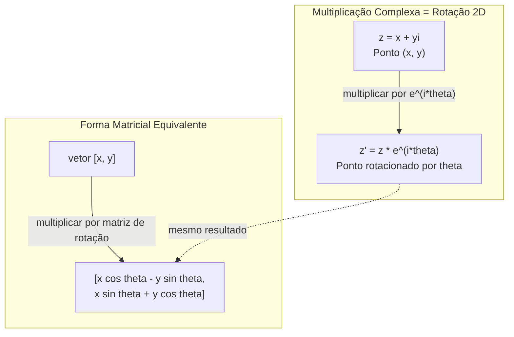
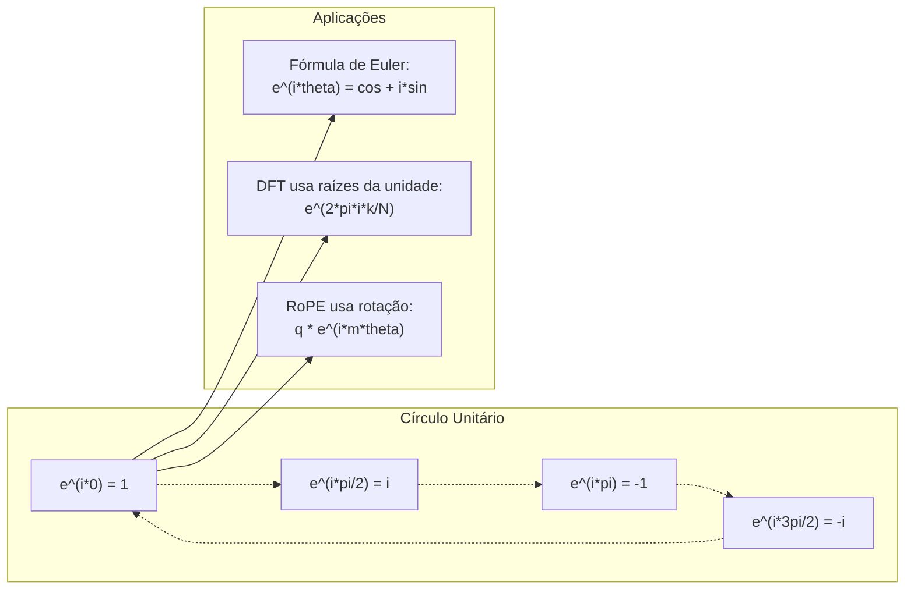

# Números Complexos para IA

> A raiz quadrada de -1 não é imaginária. É a chave para rotações, frequências e metade do processamento de sinais.

**Tipo:** Aprendizado
**Idioma:** Python
**Pré-requisitos:** Fase 1, Lições 01-04 (álgebra linear, cálculo)
**Tempo:** ~60 minutos

## Objetivos de Aprendizado

- Realizar aritmética complexa (adicionar, multiplicar, dividir, conjugar) em formas retangular e polar
- Aplicar fórmula de Euler para converter entre exponenciais complexas e funções trigonométricas
- Implementar a Transformada Fourier Discreta usando raízes complexas da unidade
- Explicar como rotações complexas sustentam RoPE e codificações posicionais sinusoidais em transformers

## O Problema

Você abre um paper sobre transformadas Fourier e tem `i` em todo lugar. Olha codificações posicionais de transformer e vê `sin` e `cos` em diferentes frequências -- as partes real e imaginária de exponenciais complexas. Você lê sobre computação quântica e encontra tudo expresso em espaços vetoriais complexos.

Números complexos parecem abstratos. Um sistema numérico construído sobre a raiz quadrada de -1 parece um truque matemático. Mas não é um truque. É a linguagem natural de rotações e oscilações. Toda vez que algo gira, vibra ou oscila, números complexos são a ferramenta certa.

Sem entender números complexos, você não pode entender a Transformada Fourier Discreta. Não pode entender FFT. Não pode entender como RoPE (Rotary Position Embedding) funciona em modelos de linguagem modernos. Não pode entender por que as codificações posicionais sinusoidais no paper original do Transformer usam as frequências que usam.

Esta lição constrói aritmética complexa do zero, conecta-a à geometria, e mostra exatamente onde números complexos aparecem em machine learning.

## O Conceito

### O que é um número complexo?

Um número complexo tem duas partes: uma parte real e uma parte imaginária.

```
z = a + bi

onde:
  a é a parte real
  b é a parte imaginária
  i é a unidade imaginária, definida por i^2 = -1
```

É isso. Você estende a reta numérica para um plano. Os números reais ficam em um eixo. Os números imaginários ficam no outro. Cada número complexo é um ponto neste plano.

### Aritmética Complexa

**Adição.** Some as partes reais, some as partes imaginárias.

```
(a + bi) + (c + di) = (a + c) + (b + d)i

Exemplo: (3 + 2i) + (1 + 4i) = 4 + 6i
```

**Multiplicação.** Use a lei distributiva e lembre que i^2 = -1.

```
(a + bi)(c + di) = ac + adi + bci + bdi^2
                 = ac + adi + bci - bd
                 = (ac - bd) + (ad + bc)i

Exemplo: (3 + 2i)(1 + 4i) = 3 + 12i + 2i + 8i^2
                            = 3 + 14i - 8
                            = -5 + 14i
```

**Conjugado.** Inverta o sinal da parte imaginária.

```
conjugado de (a + bi) = a - bi
```

O produto de um número complexo e seu conjugado é sempre real:

```
(a + bi)(a - bi) = a^2 + b^2
```

**Divisão.** Multiplique numerador e denominador pelo conjugado do denominador.

```
(a + bi) / (c + di) = (a + bi)(c - di) / (c^2 + d^2)
```

Isso elimina a parte imaginária do denominador, dando um número complexo limpo.

### O Plano Complexo

O plano complexo mapeia cada número complexo para um ponto 2D. O eixo horizontal é o eixo real, o eixo vertical é o eixo imaginário.

```
z = 3 + 2i  corresponde ao ponto (3, 2)
z = -1 + 0i corresponde ao ponto (-1, 0) no eixo real
z = 0 + 4i  corresponde ao ponto (0, 4) no eixo imaginário
```

Um número complexo é simultaneamente um ponto e um vetor da origem. Esta dupla interpretação é o que torna números complexos úteis para geometria.

### Forma Polar

Qualquer ponto no plano pode ser descrito por sua distância da origem e seu ângulo a partir do eixo real positivo.

```
z = r * (cos(theta) + i*sin(theta))

onde:
  r = |z| = sqrt(a^2 + b^2)     (magnitude, ou módulo)
  theta = atan2(b, a)             (fase, ou argumento)
```

A forma retangular (a + bi) é boa para adição. A forma polar (r, theta) é boa para multiplicação.

**Multiplicação em forma polar.** Multiplique as magnitudes, some os ângulos.

```
z1 = r1 * e^(i*theta1)
z2 = r2 * e^(i*theta2)

z1 * z2 = (r1 * r2) * e^(i*(theta1 + theta2))
```

É por isso que números complexos são perfeitos para rotações. Multiplicar por um número complexo com magnitude 1 é uma rotação pura.

### Fórmula de Euler

A ponte entre exponenciais complexas e trigonometria:

```
e^(i*theta) = cos(theta) + i*sin(theta)
```

Esta é a fórmula mais importante desta lição. Quando theta = pi:

```
e^(i*pi) = cos(pi) + i*sin(pi) = -1 + 0i = -1

Portanto: e^(i*pi) + 1 = 0
```

Cinco constantes fundamentais (e, i, pi, 1, 0) ligadas em uma equação.

### Por que a Fórmula de Euler Importa para ML

A fórmula de Euler diz que `e^(i*theta)` traça o círculo unitário conforme theta varia. Em theta = 0, você está em (1, 0). Em theta = pi/2, você está em (0, 1). Em theta = pi, você está em (-1, 0). Em theta = 3*pi/2, você está em (0, -1). Uma rotação completa é theta = 2*pi.

Isso significa que exponenciais complexas SÃO rotações. E rotações estão em todo lugar no processamento de sinais e ML.

### Conexão com Rotações 2D

Multiplicar o número complexo (x + yi) por e^(i*theta) rotaciona o ponto (x, y) pelo ângulo theta em torno da origem.

```
Rotação via multiplicação complexa:
  (x + yi) * (cos(theta) + i*sin(theta))
  = (x*cos(theta) - y*sin(theta)) + (x*sin(theta) + y*cos(theta))i

Rotação via multiplicação matricial:
  [cos(theta)  -sin(theta)] [x]   [x*cos(theta) - y*sin(theta)]
  [sin(theta)   cos(theta)] [y] = [x*sin(theta) + y*cos(theta)]
```

Produzem resultados idênticos. Multiplicação complexa É rotação 2D. A matriz de rotação é apenas multiplicação complexa escrita em notação matricial.



### Fasores e Sinais Rotacionantes

Uma exponencial complexa e^(i*omega*t) é um ponto girando em torno do círculo unitário na frequência angular omega. Conforme t aumenta, o ponto traça o círculo.

A parte real deste ponto rotacionante é cos(omega*t). A parte imaginária é sin(omega*t). Um sinal senoidal é a sombra de um número complexo rotacionante.

```
e^(i*omega*t) = cos(omega*t) + i*sin(omega*t)

Parte real:      cos(omega*t)    -- uma onda cosseno
Parte imaginária: sin(omega*t)    -- uma onda seno
```

Esta é a representação fasorial. Em vez de rastrear uma onda senoidal sinuosa, você rastreia uma seta girando suavemente. Mudanças de fase tornam-se deslocamentos angulares. Mudanças de amplitude tornam-se mudanças de magnitude. Adição de sinais torna-se adição vetorial.

### Raízes da Unidade

As N-ésimas raízes da unidade são N pontos igualmente espaçados no círculo unitário:

```
w_k = e^(2*pi*i*k/N)    para k = 0, 1, 2, ..., N-1
```

Para N = 4, as raízes são: 1, i, -1, -i (os quatro pontos cardeais).
Para N = 8, você obtém os quatro pontos cardeais mais as quatro diagonais.

As raízes da unidade são a fundação da Transformada Fourier Discreta. A DFT decompõe um sinal em componentes nestas N frequências igualmente espaçadas.

### Conexão com a DFT

A Transformada Fourier Discreta de um sinal x[0], x[1], ..., x[N-1] é:

```
X[k] = sum_{n=0}^{N-1} x[n] * e^(-2*pi*i*k*n/N)
```

Cada X[k] mede o quanto o sinal se correlaciona com a k-ésima raiz da unidade -- uma senoide complexa na frequência k. A DFT quebra um sinal em N fasores rotacionantes e te diz a amplitude e fase de cada um.

### Por que i não é Imaginário

A palavra "imaginário" é um acidente histórico. Descartes a usou de forma depreciativa. Mas i não é mais imaginário do que números negativos eram quando as pessoas os rejeitaram pela primeira vez. Números negativos respondem "do que você subtrai 5 de 3 para obter?" A unidade imaginária responde "o que você eleva ao quadrado para obter -1?"

Mais utilmente: i é um operador de rotação de 90 graus. Multiplique um número real por i uma vez, você rotaciona 90 graus para o eixo imaginário. Multiplique por i novamente (i^2), você rotaciona outros 90 graus -- agora você está apontando na direção real negativa. É por isso que i^2 = -1. Não é misterioso. É uma meia-volta construída a partir de dois quartos de volta.

É por isso que números complexos estão em toda parte na engenharia. Qualquer coisa que gira -- ondas eletromagnéticas, estados quânticos, oscilações de sinais, codificações posicionais -- é naturalmente descrita por números complexos.

### Exponenciais Complexas vs Funções Trigonométricas

Antes da fórmula de Euler, engenheiros escreviam sinais como A*cos(omega*t + phi) -- amplitude A, frequência omega, fase phi. Isso funciona mas torna a aritmética dolorosa. Somar dois cossenos com fases diferentes requer identidades trigonométricas.

Com exponenciais complexas, o mesmo sinal é A*e^(i*(omega*t + phi)). Somar dois sinais é apenas somar dois números complexos. Multiplicar (modular) é apenas multiplicar magnitudes e somar ângulos. Mudanças de fase tornam-se adições angulares. Mudanças de frequência tornam-se multiplicações por fasores.

O campo inteiro do processamento de sinais mudou para notação exponencial complexa porque a matemática é mais limpa. O "sinal real" é sempre apenas a parte real da representação complexa. A parte imaginária é carregada como contabilidade, fazendo toda a álgebra funcionar naturalmente.

### Conexão com Transformers

**Codificações posicionais sinusoidais** (paper original do Transformer):

```
PE(pos, 2i) = sin(pos / 10000^(2i/d))
PE(pos, 2i+1) = cos(pos / 10000^(2i/d))
```

Os pares sin e cos são as partes real e imaginária de exponenciais complexas em diferentes frequências. Cada frequência fornece uma "resolução" diferente para codificar posição. Frequências baixas mudam lentamente (posição grossa). Frequências altas mudam rapidamente (posição fina). Juntas, elas dão a cada posição uma impressão digital de frequência única.

**RoPE (Rotary Position Embedding)** leva isso adiante. Ele multiplica explicitamente vetores de consulta e chave por matrizes de rotação complexas. A posição relativa entre dois tokens torna-se um ângulo de rotação. A atenção é computada usando estes vetores rotacionados, tornando o modelo sensível à posição relativa através da multiplicação complexa.

| Operação | Forma Algébrica | Significado Geométrico |
|----------|----------------|------------------------|
| Adição | (a+c) + (b+d)i | Adição vetorial no plano |
| Multiplicação | (ac-bd) + (ad+bc)i | Rotacionar e escalar |
| Conjugado | a - bi | Reflexão sobre o eixo real |
| Magnitude | sqrt(a^2 + b^2) | Distância da origem |
| Fase | atan2(b, a) | Ângulo a partir do eixo real positivo |
| Divisão | multiplicar pelo conjugado | Rotação reversa e reescala |
| Potência | r^n * e^(i*n*theta) | Rotacionar n vezes, escalar por r^n |



## Construa

### Passo 1: Classe Complex

Construa uma classe Complex que suporte aritmética, magnitude, fase e conversão entre formas retangular e polar.

```python
import math

class Complex:
    def __init__(self, real, imag=0.0):
        self.real = real
        self.imag = imag

    def __add__(self, other):
        return Complex(self.real + other.real, self.imag + other.imag)

    def __mul__(self, other):
        r = self.real * other.real - self.imag * other.imag
        i = self.real * other.imag + self.imag * other.real
        return Complex(r, i)

    def __truediv__(self, other):
        denom = other.real ** 2 + other.imag ** 2
        r = (self.real * other.real + self.imag * other.imag) / denom
        i = (self.imag * other.real - self.real * other.imag) / denom
        return Complex(r, i)

    def magnitude(self):
        return math.sqrt(self.real ** 2 + self.imag ** 2)

    def phase(self):
        return math.atan2(self.imag, self.real)

    def conjugate(self):
        return Complex(self.real, -self.imag)
```

### Passo 2: Conversão polar e fórmula de Euler

```python
def to_polar(z):
    return z.magnitude(), z.phase()

def from_polar(r, theta):
    return Complex(r * math.cos(theta), r * math.sin(theta))

def euler(theta):
    return Complex(math.cos(theta), math.sin(theta))
```

Verifique: `euler(theta).magnitude()` deve sempre ser 1.0. `euler(0)` deve dar (1, 0). `euler(pi)` deve dar (-1, 0).

### Passo 3: Rotação

Rotacionar um ponto (x, y) por ângulo theta é uma multiplicação complexa:

```python
point = Complex(3, 4)
rotated = point * euler(math.pi / 4)
```

A magnitude permanece a mesma. Apenas o ângulo muda.

### Passo 4: DFT a partir de aritmética complexa

```python
def dft(signal):
    N = len(signal)
    result = []
    for k in range(N):
        total = Complex(0, 0)
        for n in range(N):
            angle = -2 * math.pi * k * n / N
            total = total + Complex(signal[n], 0) * euler(angle)
        result.append(total)
    return result
```

Esta é a DFT O(N^2). Cada saída X[k] é a soma das amostras do sinal multiplicadas pelas raízes da unidade.

### Passo 5: DFT Inversa

A DFT inversa reconstrói o sinal original a partir de seu espectro. As únicas mudanças da DFT direta: inverta o sinal no expoente e divida por N.

```python
def idft(spectrum):
    N = len(spectrum)
    result = []
    for n in range(N):
        total = Complex(0, 0)
        for k in range(N):
            angle = 2 * math.pi * k * n / N
            total = total + spectrum[k] * euler(angle)
        result.append(Complex(total.real / N, total.imag / N))
    return result
```

Isso dá reconstrução perfeita. Aplique DFT, depois IDFT, e você obtém o sinal original de volta com precisão de máquina. Nenhuma informação é perdida.

### Passo 6: Raízes da Unidade

```python
def roots_of_unity(N):
    return [euler(2 * math.pi * k / N) for k in range(N)]
```

Verifique duas propriedades:
- Toda raiz tem magnitude exatamente 1.
- A soma de todas as N raízes é zero (elas se cancelam por simetria).

Estas propriedades são o que torna a DFT invertível. As raízes da unidade formam uma base ortogonal para o domínio da frequência.

## Use

Python tem suporte nativo a números complexos. O literal `j` representa a unidade imaginária.

```python
z = 3 + 2j
w = 1 + 4j

print(z + w)
print(z * w)
print(abs(z))

import cmath
print(cmath.phase(z))
print(cmath.exp(1j * cmath.pi))
```

Para arrays, numpy lida com números complexos nativamente:

```python
import numpy as np

z = np.array([1+2j, 3+4j, 5+6j])
print(np.abs(z))
print(np.angle(z))
print(np.conj(z))
print(np.real(z))
print(np.imag(z))

signal = np.sin(2 * np.pi * 5 * np.linspace(0, 1, 128))
spectrum = np.fft.fft(signal)
freqs = np.fft.fftfreq(128, d=1/128)
```

## Entregue

Execute `code/complex_numbers.py` para gerar `outputs/skill-complex-arithmetic.md`.

## Exercícios

1. **Aritmética complexa manual.** Compute (2 + 3i) * (4 - i) e verifique com o código. Depois compute (5 + 2i) / (1 - 3i). Desenhe ambos resultados no plano complexo e verifique que a multiplicação rotacionou e escalou o primeiro número.

2. **Sequência de rotação.** Comece com o ponto (1, 0). Multiplique por e^(i*pi/6) doze vezes. Verifique que você retorna a (1, 0) após 12 multiplicações. Imprima as coordenadas em cada passo e confirme que elas traçam um 12-ágono regular.

3. **DFT de um sinal conhecido.** Crie um sinal que é a soma de sin(2*pi*3*t) e 0.5*sin(2*pi*7*t) amostrado em 32 pontos. Execute sua DFT. Verifique que o espectro de magnitude tem picos nas frequências 3 e 7, com o pico em 7 tendo metade da altura do pico em 3.

4. **Visualização das raízes da unidade.** Compute as 8ªs raízes da unidade. Verifique que elas somam zero. Verifique que multiplicar qualquer raiz pela raiz primitiva e^(2*pi*i/8) dá a próxima raiz.

5. **Equivalência da matriz de rotação.** Para 10 ângulos aleatórios e 10 pontos aleatórios, verifique que a multiplicação complexa dá o mesmo resultado que a multiplicação matriz-vetor com a matriz de rotação 2x2. Imprima a diferença numérica máxima.

## Termos-Chave

| Termo | Significado |
|-------|-------------|
| Número complexo | Um número a + bi onde a é a parte real, b é a parte imaginária, e i^2 = -1 |
| Unidade imaginária | O número i, definido por i^2 = -1. Não imaginário no sentido filosófico -- é um operador de rotação |
| Plano complexo | O plano 2D onde o eixo x é real e o eixo y é imaginário. Também chamado de plano de Argand |
| Magnitude (módulo) | A distância da origem: sqrt(a^2 + b^2). Escrito como \|z\| |
| Fase (argumento) | O ângulo a partir do eixo real positivo: atan2(b, a). Escrito como arg(z) |
| Conjugado | A imagem espelhada sobre o eixo real: conjugado de a + bi é a - bi |
| Forma polar | Expressar z como r * e^(i*theta) em vez de a + bi. Torna multiplicação fácil |
| Fórmula de Euler | e^(i*theta) = cos(theta) + i*sin(theta). Conecta exponenciais à trigonometria |
| Fasor | Um número complexo rotacionante e^(i*omega*t) representando um sinal senoidal |
| Raízes da unidade | Os N números complexos e^(2*pi*i*k/N) para k = 0 a N-1. N pontos igualmente espaçados no círculo unitário |
| DFT | Transformada Fourier Discreta. Decompõe um sinal em componentes senoidais complexos usando raízes da unidade |
| RoPE | Rotary Position Embedding. Usa multiplicação complexa para codificar posição relativa na atenção do transformer |

## Leitura Adicional

- [Visual Introduction to Euler's Formula](https://betterexplained.com/articles/intuitive-understanding-of-eulers-formula/) - constrói intuição geométrica sem notação pesada
- [Su et al.: RoFormer (2021)](https://arxiv.org/abs/2104.09864) - o artigo que introduziu Rotary Position Embedding usando rotações complexas
- [Vaswani et al.: Attention Is All You Need (2017)](https://arxiv.org/abs/1706.03762) - o paper original do Transformer com codificações posicionais sinusoidais
- [3Blue1Brown: Euler's formula with introductory group theory](https://www.youtube.com/watch?v=mvmuCPvRoWQ) - explicação visual de por que e^(i*pi) = -1
- [Needham: Visual Complex Analysis](https://global.oup.com/academic/product/visual-complex-analysis-9780198534464) - o melhor tratamento visual de números complexos, cheio de intuição geométrica
- [Strang: Introduction to Linear Algebra, Ch. 10](https://math.mit.edu/~gs/linearalgebra/) - números complexos no contexto de álgebra linear e autovalores
