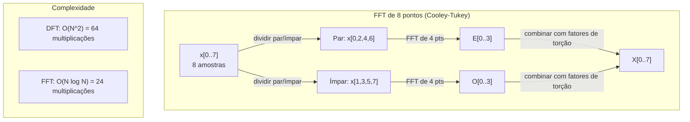
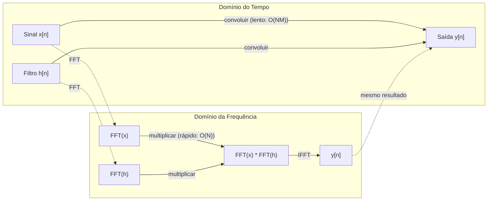

# A Transformada Fourier

> Todo sinal é uma soma de ondas senoidais. A transformada Fourier diz quais.

**Tipo:** Construção
**Idioma:** Python
**Pré-requisitos:** Fase 1, Lições 01-04, 19 (números complexos)
**Tempo:** ~90 minutos

## Objetivos de Aprendizado

- Implementar DFT do zero e verificar contra FFT Cooley-Tukey O(N log N)
- Interpretar coeficientes de frequência: extrair amplitude, fase e espectro de potência de um sinal
- Aplicar o teorema da convolução para realizar convolução via multiplicação FFT
- Conectar decomposição de frequência Fourier a codificações posicionais de transformers e camadas convolucionais CNN

## O Problema

Uma gravação de áudio é uma sequência de medições de pressão ao longo do tempo. Um preço de ação é uma sequência de valores ao longo dos dias. Uma imagem é uma grade de intensidades de pixel ao longo do espaço. Todos estes são dados no domínio do tempo (ou domínio do espaço). Você vê valores mudando ao longo de algum índice.

Mas muitos padrões são invisíveis no domínio do tempo. Este sinal de áudio é um tom puro ou um acorde? Este preço de ação tem um ciclo semanal? Esta imagem tem uma textura repetitiva? Estas perguntas são sobre conteúdo de frequência, e o domínio do tempo o esconde.

A transformada Fourier converte dados do domínio do tempo para o domínio da frequência. Ela pega um sinal e o decompõe em ondas senoidais de diferentes frequências. Cada onda senoidal tem uma amplitude (quão forte é) e uma fase (onde começa). A transformada Fourier te diz ambas.

Isso importa para ML porque pensamento em domínio de frequência aparece em todo lugar. Redes neurais convolucionais realizam convolução, que é multiplicação no domínio da frequência. Codificações posicionais de transformers usam decomposição de frequência para representar posição. Modelos de áudio (reconhecimento de fala, geração musical) operam em espectrogramas -- representações de frequência do som. Modelos de séries temporais procuram padrões periódicos. Entender a transformada Fourier te dá o vocabulário para trabalhar com todos estes.

## O Conceito

### Definição da DFT

Dadas N amostras x[0], x[1], ..., x[N-1], a Transformada Fourier Discreta produz N coeficientes de frequência X[0], X[1], ..., X[N-1]:

```
X[k] = sum_{n=0}^{N-1} x[n] * e^(-2*pi*i*k*n/N)

para k = 0, 1, ..., N-1
```

Cada X[k] é um número complexo. Sua magnitude |X[k]| te diz a amplitude da frequência k. Sua fase angle(X[k]) te diz o deslocamento de fase daquela frequência.

A ideia chave: `e^(-2*pi*i*k*n/N)` é um fasor rotacionante na frequência k. A DFT computa a correlação entre o sinal e cada uma das N frequências igualmente espaçadas. Se o sinal contém energia na frequência k, a correlação é grande. Se não, é próxima de zero.

### O que cada coeficiente significa

**X[0]: o componente DC.** Esta é a soma de todas as amostras -- proporcional à média. Representa o deslocamento constante (frequência zero) do sinal.

```
X[0] = sum_{n=0}^{N-1} x[n] * e^0 = soma de todas as amostras
```

**X[k] para 1 <= k <= N/2: frequências positivas.** X[k] representa a frequência k ciclos por N amostras. k maior significa frequência maior (oscilação mais rápida).

**X[N/2]: a frequência de Nyquist.** A frequência mais alta que você pode representar com N amostras. Acima disso, você obtém aliasing -- altas frequências se passando por baixas.

**X[k] para N/2 < k < N: frequências negativas.** Para sinais de valor real, X[N-k] = conj(X[k]). As frequências negativas são imagens espelhadas das positivas. É por isso que a informação útil está nos primeiros N/2 + 1 coeficientes.

### DFT Inversa

A DFT inversa reconstrói o sinal original a partir de seus coeficientes de frequência:

```
x[n] = (1/N) * sum_{k=0}^{N-1} X[k] * e^(2*pi*i*k*n/N)

para n = 0, 1, ..., N-1
```

As únicas diferenças da DFT direta: o sinal no expoente é positivo (não negativo), e há um fator de normalização 1/N.

A DFT inversa é reconstrução perfeita. Nenhuma informação é perdida. Você pode ir do domínio do tempo para o domínio da frequência e voltar sem qualquer erro. A DFT é uma mudança de base -- ela reexpressa a mesma informação em um sistema de coordenadas diferente.

### A FFT: tornando rápida

A DFT como definida acima é O(N^2): para cada um dos N coeficientes de saída, você soma sobre N amostras de entrada. Para N = 1 milhão, isso é 10^12 operações.

A Fast Fourier Transform (FFT) computa o mesmo resultado em O(N log N). Para N = 1 milhão, isso é cerca de 20 milhões de operações em vez de um trilhão. Isto é o que torna a análise de frequência prática.

O algoritmo Cooley-Tukey (a FFT mais comum) funciona por dividir e conquistar:

1. Divida o sinal em amostras de índice par e índice ímpar.
2. Compute a DFT de cada metade recursivamente.
3. Combine as duas DFTs de metade do tamanho usando "fatores de torção" e^(-2*pi*i*k/N).

```
X[k] = E[k] + e^(-2*pi*i*k/N) * O[k]          para k = 0, ..., N/2 - 1
X[k + N/2] = E[k] - e^(-2*pi*i*k/N) * O[k]    para k = 0, ..., N/2 - 1

onde E = DFT das amostras de índice par
      O = DFT das amostras de índice ímpar
```

A simetria significa que cada nível de recursão faz trabalho O(N), e há log2(N) níveis. Total: O(N log N).



A FFT requer que o comprimento do sinal seja uma potência de 2. Na prática, sinais são preenchidos com zeros até a próxima potência de 2.

### Análise Espectral

O **espectro de potência** é |X[k]|^2 -- a magnitude ao quadrado de cada coeficiente de frequência. Mostra quanta energia há em cada frequência.

O **espectro de fase** é angle(X[k]) -- o deslocamento de fase de cada frequência. Para a maioria das tarefas de análise, você se importa com o espectro de potência e ignora a fase.

```
Potência na frequência k:  P[k] = |X[k]|^2 = X[k].real^2 + X[k].imag^2
Fase na frequência k:  phi[k] = atan2(X[k].imag, X[k].real)
```

### Resolução de Frequência

A resolução de frequência da DFT depende do número de amostras N e da taxa de amostragem fs.

```
Frequência do bin k:      f_k = k * fs / N
Resolução de frequência:    delta_f = fs / N
Frequência máxima:       f_max = fs / 2  (Nyquist)
```

Para resolver duas frequências próximas, você precisa de mais amostras. Para capturar altas frequências, você precisa de uma taxa de amostragem maior.

### O Teorema da Convolução

Este é um dos resultados mais importantes do processamento de sinais e diretamente relevante para CNNs.

**Convolução no domínio do tempo é igual a multiplicação pontual no domínio da frequência.**

```
x * h = IFFT(FFT(x) . FFT(h))

onde * é convolução e . é multiplicação elemento a elemento
```

Por que isso importa:

- Convolução direta de dois sinais de comprimento N e M leva O(N*M) operações.
- Convolução baseada em FFT leva O(N log N): transforme ambos, multiplique, transforme de volta.
- Para kernels grandes, a convolução FFT é dramaticamente mais rápida.
- Isto é exatamente o que acontece em camadas convolucionais com grandes campos receptivos.

Nota: a DFT computa convolução circular (o sinal envolve). Para convolução linear (sem envolvimento), preencha ambos os sinais com zeros até o comprimento N + M - 1 antes de computar.



### Janelamento

A DFT assume que o sinal é periódico -- ela trata as N amostras como um período de um sinal que se repete infinitamente. Se o sinal não começa e termina no mesmo valor, isso cria uma descontinuidade na fronteira, que aparece como conteúdo espúrio de alta frequência. Isto é chamado de vazamento espectral.

O janelamento reduz o vazamento afinando o sinal para zero em ambas as extremidades antes de computar a DFT.

Janelas comuns:

| Janela | Forma | Largura do lóbulo principal | Nível do lóbulo lateral | Caso de uso |
|--------|-------|------------------------------|-------------------------|-------------|
| Retangular | Plana (sem janela) | Mais estreita | Mais alto (-13 dB) | Quando o sinal é exatamente periódico em N amostras |
| Hann | Cosseno elevado | Moderada | Baixo (-31 dB) | Análise espectral de uso geral |
| Hamming | Cosseno modificado | Moderada | Mais baixo (-42 dB) | Processamento de áudio, análise de fala |
| Blackman | Cosseno triplo | Larga | Muito baixo (-58 dB) | Quando supressão de lóbulo lateral é crítica |

```
Janela Hann:    w[n] = 0.5 * (1 - cos(2*pi*n / (N-1)))
Janela Hamming: w[n] = 0.54 - 0.46 * cos(2*pi*n / (N-1))
```

Aplique a janela multiplicando-a elemento a elemento com o sinal antes da DFT: `X = DFT(x * w)`.

### Propriedades da DFT

| Propriedade | Domínio do Tempo | Domínio da Frequência |
|-------------|-----------------|----------------------|
| Linearidade | a*x + b*y | a*X + b*Y |
| Deslocamento temporal | x[n - k] | X[f] * e^(-2*pi*i*f*k/N) |
| Deslocamento de frequência | x[n] * e^(2*pi*i*f0*n/N) | X[f - f0] |
| Convolução | x * h | X * H (pontual) |
| Multiplicação | x * h (pontual) | X * H (convolução circular, escalado por 1/N) |
| Teorema de Parseval | sum \|x[n]\|^2 | (1/N) * sum \|X[k]\|^2 |
| Simetria conjugada (entrada real) | x[n] real | X[k] = conj(X[N-k]) |

O teorema de Parseval diz que a energia total é a mesma em ambos os domínios. A energia é conservada através da transformada.

### Conexão com Codificações Posicionais

O Transformer original usa codificações posicionais sinusoidais:

```
PE(pos, 2i)   = sin(pos / 10000^(2i/d_model))
PE(pos, 2i+1) = cos(pos / 10000^(2i/d_model))
```

Cada par de dimensão (2i, 2i+1) oscila em uma frequência diferente. As frequências são geometricamente espaçadas de alta (dimensão 0,1) a baixa (últimas dimensões). Isto dá a cada posição um padrão único através de todas as bandas de frequência -- similar a como coeficientes Fourier identificam unicamente um sinal.

As propriedades chave que isto fornece:

- **Unicidade:** Não há duas posições com a mesma codificação.
- **Valores limitados:** sin e cos estão sempre em [-1, 1].
- **Posição relativa:** A codificação da posição p+k pode ser expressa como uma função linear da codificação na posição p. O modelo pode aprender a atender a posições relativas.

### Conexão com CNNs

Uma camada de convolução aplica um filtro aprendido (kernel) à entrada deslizando-o através do sinal ou imagem. Matematicamente, esta é a operação de convolução.

Pelo teorema da convolução, isto é equivalente a:
1. FFT da entrada
2. FFT do kernel
3. Multiplicar no domínio da frequência
4. IFFT do resultado

Implementações CNN padrão usam convolução direta (mais rápida para kernels 3x3 pequenos). Mas para kernels grandes ou convolução global, abordagens baseadas em FFT são significativamente mais rápidas. Algumas arquiteturas (como FNet) substituem a atenção inteiramente por FFT, alcançando precisão competitiva com complexidade O(N log N) em vez de O(N^2).

### Espectrogramas e a Transformada Fourier de Curta Duração (STFT)

Uma única FFT te dá o conteúdo de frequência do sinal inteiro, mas não te diz nada sobre quando essas frequências ocorrem. Um chirp (um sinal cuja frequência aumenta ao longo do tempo) e um acorde (todas as frequências presentes simultaneamente) podem ter o mesmo espectro de magnitude.

A Transformada Fourier de Curta Duração (STFT) resolve isso computando FFTs em janelas sobrepostas do sinal. O resultado é um espectrograma: uma representação 2D com tempo em um eixo e frequência no outro. A intensidade em cada ponto mostra a energia naquela frequência naquele tempo.

```
Procedimento STFT:
1. Escolha um tamanho de janela (por exemplo, 1024 amostras)
2. Escolha um tamanho de salto (por exemplo, 256 amostras -- 75% sobreposição)
3. Para cada posição de janela:
   a. Extraia o segmento janelado
   b. Aplique uma janela Hann/Hamming
   c. Compute FFT
   d. Armazene o espectro de magnitude como uma coluna do espectrograma
```

Espectrogramas são a representação de entrada padrão para modelos de áudio ML. Modelos de reconhecimento de fala (Whisper, DeepSpeech) operam em mel-espectrogramas -- espectrogramas com frequências mapeadas para a escala mel, que melhor corresponde à percepção humana de tom.

### Aliasing

Se um sinal contém frequências acima de fs/2 (a frequência de Nyquist), a amostragem na taxa fs criará cópias aliasing. Um sinal de 90 Hz amostrado a 100 Hz parece idêntico a um sinal de 10 Hz. Não há como distingui-los apenas das amostras.

```
Exemplo:
  Sinal verdadeiro: onda senoidal de 90 Hz
  Taxa de amostragem: 100 Hz
  Frequência aparente: 100 - 90 = 10 Hz

  As amostras do sinal de 90 Hz a 100 Hz de amostragem
  são idênticas às amostras de um sinal de 10 Hz.
  Nenhuma quantidade de matemática pode recuperar os 90 Hz originais.
```

É por isso que conversores analógico-digitais incluem filtros anti-aliasing que removem frequências acima de Nyquist antes da amostragem. Em ML, aliasing aparece ao reduzir a resolução de mapas de features sem filtragem passa-baixa adequada -- algumas arquiteturas lidam com isso com camadas de pooling anti-aliasing.

### Preenchimento com Zeros não Aumenta Resolução

Um equívoco comum: preencher um sinal com zeros antes da FFT melhora a resolução de frequência. Não melhora. Preenchimento com zeros interpola entre bins de frequência existentes, dando um espectro de aparência mais suave. Mas não pode revelar detalhes de frequência que não estavam presentes nas amostras originais.

A verdadeira resolução de frequência depende apenas do tempo de observação T = N / fs. Para resolver duas frequências separadas por delta_f, você precisa de pelo menos T = 1 / delta_f segundos de dados. Nenhuma quantidade de preenchimento com zeros muda este limite fundamental.

## Construa

### Passo 1: DFT do zero

A DFT O(N^2) segue diretamente da definição.

```python
import math

class Complex:
    ...

def dft(x):
    N = len(x)
    result = []
    for k in range(N):
        total = Complex(0, 0)
        for n in range(N):
            angle = -2 * math.pi * k * n / N
            w = Complex(math.cos(angle), math.sin(angle))
            xn = x[n] if isinstance(x[n], Complex) else Complex(x[n])
            total = total + xn * w
        result.append(total)
    return result
```

### Passo 2: DFT Inversa

Mesma estrutura, expoente positivo, dividir por N.

```python
def idft(X):
    N = len(X)
    result = []
    for n in range(N):
        total = Complex(0, 0)
        for k in range(N):
            angle = 2 * math.pi * k * n / N
            w = Complex(math.cos(angle), math.sin(angle))
            total = total + X[k] * w
        result.append(Complex(total.real / N, total.imag / N))
    return result
```

### Passo 3: FFT (Cooley-Tukey)

A FFT recursiva requer comprimento potência de 2. Divida em pares e ímpares, recorra, combine com fatores de torção.

```python
def fft(x):
    N = len(x)
    if N <= 1:
        return [x[0] if isinstance(x[0], Complex) else Complex(x[0])]
    if N % 2 != 0:
        return dft(x)

    even = fft([x[i] for i in range(0, N, 2)])
    odd = fft([x[i] for i in range(1, N, 2)])

    result = [Complex(0)] * N
    for k in range(N // 2):
        angle = -2 * math.pi * k / N
        twiddle = Complex(math.cos(angle), math.sin(angle))
        t = twiddle * odd[k]
        result[k] = even[k] + t
        result[k + N // 2] = even[k] - t
    return result
```

### Passo 4: Auxiliares de análise espectral

```python
def power_spectrum(X):
    return [xk.real ** 2 + xk.imag ** 2 for xk in X]

def convolve_fft(x, h):
    N = len(x) + len(h) - 1
    padded_N = 1
    while padded_N < N:
        padded_N *= 2

    x_padded = x + [0.0] * (padded_N - len(x))
    h_padded = h + [0.0] * (padded_N - len(h))

    X = fft(x_padded)
    H = fft(h_padded)

    Y = [xk * hk for xk, hk in zip(X, H)]

    y = idft(Y)
    return [y[n].real for n in range(N)]
```

## Use

Para trabalho real, use a FFT do numpy que é suportada por bibliotecas C altamente otimizadas.

```python
import numpy as np

signal = np.sin(2 * np.pi * 5 * np.arange(256) / 256)
spectrum = np.fft.fft(signal)
freqs = np.fft.fftfreq(256, d=1/256)

power = np.abs(spectrum) ** 2

positive_freqs = freqs[:len(freqs)//2]
positive_power = power[:len(power)//2]
```

Para janelamento e análise espectral mais avançada:

```python
from scipy.signal import windows, stft

window = windows.hann(256)
windowed = signal * window
spectrum = np.fft.fft(windowed)
```

Para convolução:

```python
from scipy.signal import fftconvolve

result = fftconvolve(signal, kernel, mode='full')
```

Para espectrogramas:

```python
from scipy.signal import stft

frequencies, times, Zxx = stft(signal, fs=sample_rate, nperseg=256)
spectrogram = np.abs(Zxx) ** 2
```

A matriz do espectrograma tem forma (n_frequencias, n_frames_tempo). Cada coluna é o espectro de potência em uma janela de tempo. Isto é o que modelos de áudio ML consomem como entrada.

## Entregue

Execute `code/fourier.py` para gerar `outputs/prompt-spectral-analyzer.md`.

## Exercícios

1. **Identificação de tom puro.** Crie um sinal com uma única onda senoidal em uma frequência desconhecida (entre 1 e 50 Hz), amostrada a 128 Hz por 1 segundo. Use sua DFT para identificar a frequência. Verifique que a resposta corresponde. Agora adicione ruído Gaussiano com desvio padrão 0.5 e repita. Como o ruído afeta o espectro?

2. **Verificação FFT vs DFT.** Gere um sinal aleatório de comprimento 64. Compute tanto DFT (O(N^2)) quanto FFT. Verifique que todos os coeficientes correspondem dentro de 1e-10. Cronometre ambas funções em sinais de comprimento 256, 512, 1024 e 2048. Plote a razão do tempo DFT sobre tempo FFT.

3. **Prova do teorema da convolução por exemplo.** Crie sinal x = [1, 2, 3, 4, 0, 0, 0, 0] e filtro h = [1, 1, 1, 0, 0, 0, 0, 0]. Compute sua convolução circular diretamente (loop aninhado). Depois compute via FFT (transformar, multiplicar, transformada inversa). Verifique que os resultados correspondem. Agora faça convolução linear preenchendo com zeros apropriadamente.

4. **Efeitos do janelamento.** Crie um sinal que é a soma de duas ondas senoidais em 10 Hz e 12 Hz (muito próximas). Amostre a 128 Hz por 1 segundo. Compute o espectro de potência com sem janela, janela Hann e janela Hamming. Qual janela torna mais fácil distinguir os dois picos? Por quê?

5. **Análise de codificação posicional.** Gere as codificações posicionais sinusoidais para d_model = 128 e max_pos = 512. Para cada par de posições (p1, p2), compute o produto escalar de suas codificações. Mostre que o produto escalar depende apenas de |p1 - p2|, não das posições absolutas. O que acontece com o produto escalar conforme a distância aumenta?

## Termos-Chave

| Termo | Significado |
|-------|-------------|
| DFT (Transformada Fourier Discreta) | Converte N amostras de domínio temporal em N coeficientes de domínio de frequência. Cada coeficiente é a correlação com uma senoide complexa naquela frequência |
| FFT (Fast Fourier Transform) | Um algoritmo O(N log N) para computar a DFT. O algoritmo Cooley-Tukey divide índices pares/ímpares recursivamente |
| DFT Inversa | Reconstrói o sinal de domínio temporal a partir dos coeficientes de frequência. Mesma fórmula da DFT com sinal do expoente invertido e escala 1/N |
| Bin de frequência | Cada índice k na saída DFT representa frequência k*fs/N Hz. O "bin" é o slot de frequência discreto |
| Componente DC | X[0], o coeficiente de frequência zero. Proporcional à média do sinal |
| Frequência de Nyquist | fs/2, a frequência máxima representável na taxa de amostragem fs. Frequências acima disso sofrem aliasing |
| Espectro de potência | \|X[k]\|^2, a magnitude ao quadrado de cada coeficiente de frequência. Mostra distribuição de energia entre as frequências |
| Espectro de fase | angle(X[k]), o deslocamento de fase de cada componente de frequência. Frequentemente ignorado em análise |
| Vazamento espectral | Conteúdo de frequência espúrio causado por tratar um sinal não-periódico como periódico. Reduzido por janelamento |
| Função de janela | Uma função de afunilamento (Hann, Hamming, Blackman) aplicada antes da DFT para reduzir vazamento espectral |
| Fator de torção | A exponencial complexa e^(-2*pi*i*k/N) usada para combinar sub-DFTs na computação borboleta da FFT |
| Teorema da convolução | Convolução no domínio do tempo é igual à multiplicação pontual no domínio da frequência. Fundamental para processamento de sinais e CNNs |
| Convolução circular | Convolução onde o sinal envolve. Isto é o que a DFT computa naturalmente |
| Convolução linear | Convolução padrão sem envolvimento. Alcançada preenchendo com zeros antes da DFT |
| Teorema de Parseval | A energia total é preservada através da transformada Fourier. sum \|x[n]\|^2 = (1/N) sum \|X[k]\|^2 |
| Aliasing | Quando frequências acima de Nyquist aparecem como frequências mais baixas devido à taxa de amostragem insuficiente |

## Leitura Adicional

- [Cooley & Tukey: An Algorithm for the Machine Calculation of Complex Fourier Series (1965)](https://www.ams.org/journals/mcom/1965-19-090/S0025-5718-1965-0178586-1/) - o paper original da FFT que mudou a computação
- [3Blue1Brown: But what is the Fourier Transform?](https://www.youtube.com/watch?v=spUNpyF58BY) - a melhor introdução visual às transformadas Fourier
- [Lee-Thorp et al.: FNet: Mixing Tokens with Fourier Transforms (2021)](https://arxiv.org/abs/2105.03824) - substitui autoatenção por FFT em transformers
- [Smith: The Scientist and Engineer's Guide to Digital Signal Processing](http://www.dspguide.com/) - livro texto gratuito online cobrindo FFT, janelamento e análise espectral em profundidade
- [Vaswani et al.: Attention Is All You Need (2017)](https://arxiv.org/abs/1706.03762) - codificações posicionais sinusoidais derivadas da decomposição de frequência Fourier
- [Radford et al.: Whisper (2022)](https://arxiv.org/abs/2212.04356) - reconhecimento de fala usando mel-espectrogramas como representação de entrada
