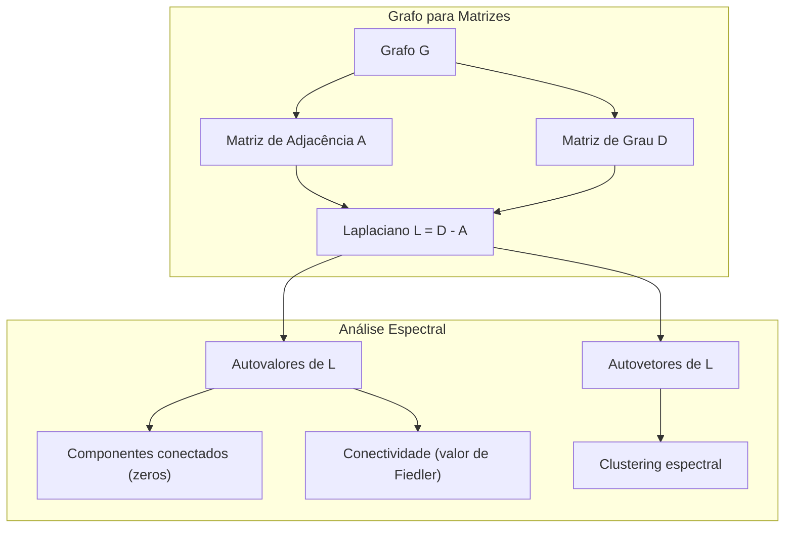
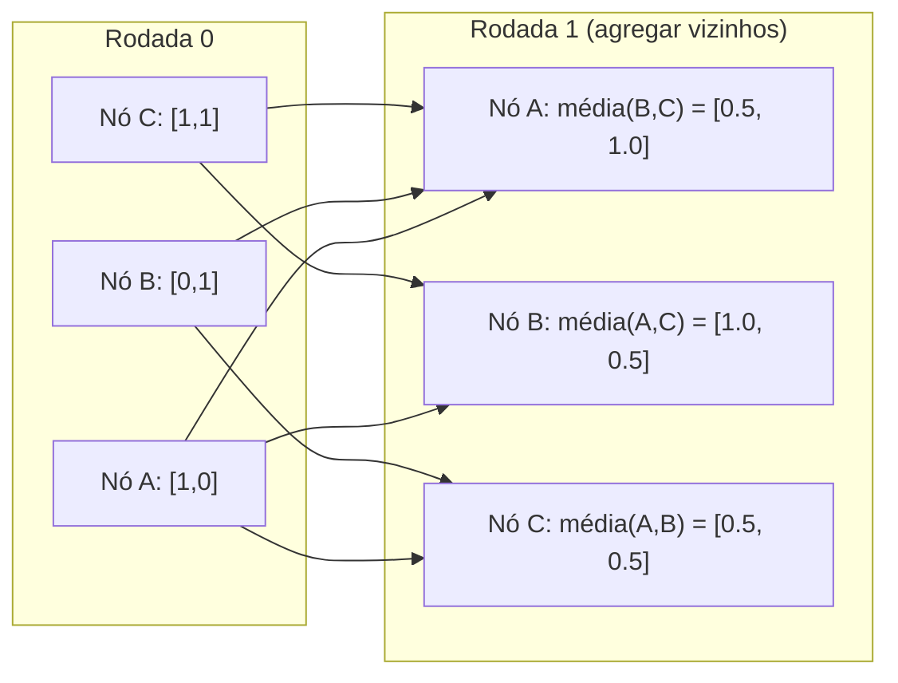

# Teoria dos Grafos para Machine Learning

> Grafos são a estrutura de dados de relacionamentos. Se seus dados têm conexões, você precisa de teoria dos grafos.

**Tipo:** Construção
**Idioma:** Python
**Pré-requisitos:** Fase 1, Lições 01-03 (álgebra linear, matrizes)
**Tempo:** ~90 minutos

## Objetivos de Aprendizado

- Construir uma classe de grafo com representações de matriz/lista de adjacência e implementar travessias BFS e DFS
- Computar o Laplaciano de grafo e usar seus autovalores para detectar componentes conectados e agrupar nós
- Implementar uma rodada de message passing estilo GNN como multiplicação de matriz de adjacência normalizada
- Aplicar clustering espectral para particionar um grafo usando o vetor de Fiedler

## O Problema

Redes sociais, moléculas, bases de conhecimento, redes de citação, mapas de ruas -- todos são grafos. ML tradicional trata dados como tabelas planas. Cada linha é independente. Cada feature é uma coluna. Mas quando a estrutura das conexões importa, tabelas falham.

Considere uma rede social. Você quer prever qual produto um usuário comprará. O histórico de compras deles importa. Mas o histórico de compras dos amigos deles importa mais. As conexões carregam sinal.

Ou considere uma molécula. Você quer prever se ela se liga a uma proteína. Os átomos importam, mas o que realmente importa é como os átomos estão ligados uns aos outros. A estrutura são os dados.

Graph Neural Networks (GNNs) são a área de crescimento mais rápido em deep learning. Elas impulsionam descoberta de medicamentos, recomendação social, detecção de fraude e raciocínio em grafos de conhecimento. Toda GNN se baseia na mesma fundação: teoria básica dos grafos.

Você precisa de quatro coisas:
1. Uma maneira de representar grafos como matrizes (para poder multiplicá-las)
2. Algoritmos de travessia para explorar estrutura de grafos
3. O Laplaciano -- a matriz mais importante da teoria espectral de grafos
4. Message passing -- a operação que faz GNNs funcionarem

## O Conceito

### Grafos: Nós e Arestas

Um grafo G = (V, E) consiste de vértices (nós) V e arestas E. Cada aresta conecta dois nós.

**Dirigido vs não-dirigido.** Em um grafo não-dirigido, aresta (u, v) significa que u conecta a v E v conecta a u. Em um grafo dirigido (digrafo), aresta (u, v) significa que u aponta para v, mas não necessariamente o inverso.

**Ponderado vs não-ponderado.** Em um grafo não-ponderado, arestas ou existem ou não. Em um grafo ponderado, cada aresta tem um peso numérico -- uma distância, um custo, uma força.

| Tipo de grafo | Exemplo |
|---------------|---------|
| Não-dirigido, não-ponderado | Rede de amizades no Facebook |
| Dirigido, não-ponderado | Rede de seguidores no Twitter |
| Não-dirigido, ponderado | Mapa rodoviário (distâncias) |
| Dirigido, ponderado | Links de páginas web (PageRank) |

### Matriz de Adjacência

A matriz de adjacência A é a representação central. Para um grafo com n nós:

```
A[i][j] = 1    se há uma aresta do nó i para o nó j
A[i][j] = 0    caso contrário
```

Para grafos não-dirigidos, A é simétrica: A[i][j] = A[j][i]. Para grafos ponderados, A[i][j] = peso da aresta (i, j).

**Exemplo -- um triângulo:**

```
Nós: 0, 1, 2
Arestas: (0,1), (1,2), (0,2)

A = [[0, 1, 1],
     [1, 0, 1],
     [1, 1, 0]]
```

A matriz de adjacência é a entrada para toda GNN. Operações matriciais em A correspondem a operações no grafo.

### Grau

O grau de um nó é o número de arestas conectadas a ele. Para grafos dirigidos, você tem grau de entrada (arestas chegando) e grau de saída (arestas saindo).

A matriz de grau D é diagonal:

```
D[i][i] = grau do nó i
D[i][j] = 0    para i != j
```

Para o exemplo do triângulo: D = diag(2, 2, 2) porque todo nó se conecta a dois outros.

O grau te diz sobre importância do nó. Alto grau = nó hub. A distribuição de graus de uma rede revela sua estrutura. Redes sociais seguem leis de potência (poucos hubs, muitos nós folha). Grafos aleatórios têm graus distribuídos por Poisson.

### BFS e DFS

Os dois algoritmos fundamentais de travessia de grafos. Você precisa de ambos.

**Busca em Largura (BFS):** Explore todos os vizinhos primeiro, depois vizinhos dos vizinhos. Usa uma fila (FIFO).

```
BFS a partir do nó 0:
  Visite 0
  Fila: [1, 2]        (vizinhos de 0)
  Visite 1
  Fila: [2, 3]        (adicione vizinhos de 1)
  Visite 2
  Fila: [3]           (vizinhos de 2 já visitados)
  Visite 3
  Fila: []            (pronto)
```

BFS encontra caminhos mais curtos em grafos não-ponderados. A distância do início a qualquer nó é igual ao nível BFS em que aquele nó é descoberto pela primeira vez. É por isso que BFS é usada para distâncias de hop-count em redes sociais.

**Busca em Profundidade (DFS):** Vá o mais fundo possível antes de voltar. Usa uma pilha (LIFO) ou recursão.

```
DFS a partir do nó 0:
  Visite 0
  Pilha: [1, 2]        (vizinhos de 0)
  Visite 2             (pop da pilha)
  Pilha: [1, 3]        (adicione vizinhos de 2)
  Visite 3             (pop da pilha)
  Pilha: [1]
  Visite 1             (pop da pilha)
  Pilha: []            (pronto)
```

DFS é útil para:
- Encontrar componentes conectados (execute DFS a partir de nós não visitados)
- Detecção de ciclo (arestas de retorno na árvore DFS)
- Ordenação topológica (ordem reversa de finalização DFS)

| Algoritmo | Estrutura de dados | Encontra | Caso de uso |
|-----------|-------------------|----------|-------------|
| BFS | Fila | Caminhos mais curtos | Distância em rede social, travessia de grafo de conhecimento |
| DFS | Pilha | Componentes, ciclos | Conectividade, ordenação topológica |

### O Laplaciano de Grafo

L = D - A. A matriz mais importante da teoria espectral de grafos.

Para o triângulo:

```
D = [[2, 0, 0],    A = [[0, 1, 1],    L = [[2, -1, -1],
     [0, 2, 0],         [1, 0, 1],         [-1, 2, -1],
     [0, 0, 2]]         [1, 1, 0]]         [-1, -1,  2]]
```

O Laplaciano tem propriedades notáveis:

1. **L é semidefinido positivo.** Todos os autovalores são >= 0.

2. **O número de autovalores zero é igual ao número de componentes conectados.** Um grafo conectado tem exatamente um autovalor zero. Um grafo com 3 componentes desconectados tem três autovalores zero.

3. **O menor autovalor não-zero (valor de Fiedler) mede conectividade.** Um valor de Fiedler grande significa que o grafo é bem conectado. Um valor de Fiedler pequeno significa que o grafo tem um ponto fraco -- um gargalo.

4. **O autovetor do valor de Fiedler (vetor de Fiedler) revela a melhor divisão.** Nós com valores positivos vão para um grupo, nós com valores negativos vão para o outro. Isto é clustering espectral.



### Propriedades Espectrais

Os autovalores da matriz de adjacência e do Laplaciano revelam propriedades estruturais sem qualquer travessia.

**Clustering espectral** funciona assim:
1. Compute o Laplaciano L
2. Encontre os k menores autovetores de L (pule o primeiro, que é todo-uns para grafos conectados)
3. Use esses autovetores como novas coordenadas para cada nó
4. Execute k-means nessas coordenadas

Por que funciona? Os autovetores de L codificam as funções "mais suaves" no grafo. Nós que são bem conectados recebem valores de autovetor similares. Nós separados por um gargalo recebem valores diferentes. Os autovetores separam naturalmente os clusters.

**Conexão com caminhada aleatória.** O Laplaciano normalizado se relaciona com caminhadas aleatórias no grafo. A distribuição estacionária de uma caminhada aleatória é proporcional ao grau do nó. O tempo de mistura (quão rápido a caminhada converge) depende do gap espectral.

### Message Passing

A operação central das Graph Neural Networks. Cada nó coleta mensagens de seus vizinhos, as agrega e atualiza seu próprio estado.

```
h_v^(k+1) = ATUALIZA(h_v^(k), AGREGA({h_u^(k) : u em vizinhos(v)}))
```

Na forma mais simples, AGREGA = média, e ATUALIZA = transformação linear + ativação:

```
h_v^(k+1) = sigma(W * media({h_u^(k) : u em vizinhos(v)}))
```

Isto é multiplicação matricial disfarçada. Se H é a matriz de todos os atributos dos nós e A é a matriz de adjacência:

```
H^(k+1) = sigma(A_norm * H^(k) * W)
```

onde A_norm é a matriz de adjacência normalizada (cada linha soma 1).

Uma rodada de message passing permite que cada nó "veja" seus vizinhos imediatos. Duas rodadas permitem que veja vizinhos de vizinhos. K rodadas dão a cada nó informação de sua vizinhança K-hop.



### Conceitos e Aplicações ML

| Conceito | Aplicação ML |
|----------|--------------|
| Matriz de adjacência | Representação de entrada de GNN |
| Laplaciano de grafo | Clustering espectral, detecção de comunidades |
| BFS/DFS | Travessia de grafo de conhecimento, busca de caminhos |
| Distribuição de grau | Importância de nó, engenharia de features |
| Message passing | Camadas GNN (GCN, GAT, GraphSAGE) |
| Autovalores de L | Detecção de comunidades, particionamento de grafo |
| Clustering espectral | Agrupamento não-supervisionado de nós |
| PageRank | Importância de nó, busca web |

## Construa

### Passo 1: Classe Grafo do zero

```python
class Graph:
    def __init__(self, n_nodes, directed=False):
        self.n = n_nodes
        self.directed = directed
        self.adj = {i: {} for i in range(n_nodes)}

    def add_edge(self, u, v, weight=1.0):
        self.adj[u][v] = weight
        if not self.directed:
            self.adj[v][u] = weight

    def neighbors(self, node):
        return list(self.adj[node].keys())

    def degree(self, node):
        return len(self.adj[node])

    def adjacency_matrix(self):
        import numpy as np
        A = np.zeros((self.n, self.n))
        for u in range(self.n):
            for v, w in self.adj[u].items():
                A[u][v] = w
        return A

    def degree_matrix(self):
        import numpy as np
        D = np.zeros((self.n, self.n))
        for i in range(self.n):
            D[i][i] = self.degree(i)
        return D

    def laplacian(self):
        return self.degree_matrix() - self.adjacency_matrix()
```

A lista de adjacência (`self.adj`) armazena vizinhos eficientemente. A conversão para matriz de adjacência usa numpy porque todas as operações espectrais precisam dela.

### Passo 2: BFS e DFS

```python
from collections import deque

def bfs(graph, start):
    visited = set()
    order = []
    distances = {}
    queue = deque([(start, 0)])
    visited.add(start)
    while queue:
        node, dist = queue.popleft()
        order.append(node)
        distances[node] = dist
        for neighbor in graph.neighbors(node):
            if neighbor not in visited:
                visited.add(neighbor)
                queue.append((neighbor, dist + 1))
    return order, distances


def dfs(graph, start):
    visited = set()
    order = []
    stack = [start]
    while stack:
        node = stack.pop()
        if node in visited:
            continue
        visited.add(node)
        order.append(node)
        for neighbor in reversed(graph.neighbors(node)):
            if neighbor not in visited:
                stack.append(neighbor)
    return order
```

BFS usa um deque (fila dupla) para popleft O(1). DFS usa uma lista como pilha. Ambos visitam cada nó exatamente uma vez -- tempo O(V + E).

### Passo 3: Componentes conectados e autovalores do Laplaciano

```python
def connected_components(graph):
    visited = set()
    components = []
    for node in range(graph.n):
        if node not in visited:
            order, _ = bfs(graph, node)
            visited.update(order)
            components.append(order)
    return components


def laplacian_eigenvalues(graph):
    import numpy as np
    L = graph.laplacian()
    eigenvalues = np.linalg.eigvalsh(L)
    return eigenvalues
```

`eigvalsh` é para matrizes simétricas -- o Laplaciano é sempre simétrico para grafos não-dirigidos. Retorna autovalores em ordem ascendente. Conte os zeros para encontrar o número de componentes conectados.

### Passo 4: Clustering espectral

```python
def spectral_clustering(graph, k=2):
    import numpy as np
    L = graph.laplacian()
    eigenvalues, eigenvectors = np.linalg.eigh(L)
    features = eigenvectors[:, 1:k+1]

    labels = np.zeros(graph.n, dtype=int)
    for i in range(graph.n):
        if features[i, 0] >= 0:
            labels[i] = 0
        else:
            labels[i] = 1
    return labels
```

Para k=2, o sinal do vetor de Fiedler divide o grafo em dois clusters. Para k>2, você executaria k-means nos primeiros k autovetores (excluindo o autovetor trivial todo-uns).

### Passo 5: Message passing

```python
def message_passing(graph, features, weight_matrix):
    import numpy as np
    A = graph.adjacency_matrix()
    row_sums = A.sum(axis=1, keepdims=True)
    row_sums[row_sums == 0] = 1
    A_norm = A / row_sums
    aggregated = A_norm @ features
    output = aggregated @ weight_matrix
    return output
```

Esta é uma rodada de message passing de GNN. As novas features de cada nó são a média ponderada das features de seus vizinhos, transformadas pela matriz de pesos. Empilhe múltiplas rodadas para propagar informação adiante.

## Use

Com networkx e numpy, as mesmas operações são one-liners:

```python
import networkx as nx
import numpy as np

G = nx.karate_club_graph()

A = nx.adjacency_matrix(G).toarray()
L = nx.laplacian_matrix(G).toarray()

eigenvalues = np.linalg.eigvalsh(L.astype(float))
print(f"Menores autovalores: {eigenvalues[:5]}")
print(f"Componentes conectados: {nx.number_connected_components(G)}")

communities = nx.community.greedy_modularity_communities(G)
print(f"Comunidades encontradas: {len(communities)}")

pr = nx.pagerank(G)
top_nodes = sorted(pr.items(), key=lambda x: x[1], reverse=True)[:5]
print(f"Top 5 nós PageRank: {top_nodes}")
```

networkx lida com grafos de qualquer tamanho com backends C otimizados. Use-o em produção. Use sua implementação do zero para entender o que ele faz.

### Análise espectral com numpy

```python
import numpy as np

A = np.array([
    [0, 1, 1, 0, 0],
    [1, 0, 1, 0, 0],
    [1, 1, 0, 1, 0],
    [0, 0, 1, 0, 1],
    [0, 0, 0, 1, 0]
])

D = np.diag(A.sum(axis=1))
L = D - A

eigenvalues, eigenvectors = np.linalg.eigh(L)
print(f"Autovalores: {np.round(eigenvalues, 4)}")
print(f"Valor de Fiedler: {eigenvalues[1]:.4f}")
print(f"Vetor de Fiedler: {np.round(eigenvectors[:, 1], 4)}")

fiedler = eigenvectors[:, 1]
group_a = np.where(fiedler >= 0)[0]
group_b = np.where(fiedler < 0)[0]
print(f"Cluster A: {group_a}")
print(f"Cluster B: {group_b}")
```

O vetor de Fiedler faz o trabalho pesado. Entradas positivas em um cluster, negativas no outro. Nenhuma otimização iterativa necessária -- apenas uma autodecomposição.

## Entregue

Esta lição produz:
- `outputs/skill-graph-analysis.md` -- uma skill de referência para analisar dados com estrutura de grafo

## Conexões

| Conceito | Onde aparece |
|----------|--------------|
| Matriz de adjacência | Entrada GCN, GAT, GraphSAGE |
| Laplaciano | Clustering espectral, filtros ChebNet |
| BFS | Travessia de grafo de conhecimento, consultas de caminho mais curto |
| Message passing | Toda camada GNN, message passing neural |
| Gap espectral | Conectividade de grafo, tempo de mistura de caminhadas aleatórias |
| Distribuição de grau | Redes lei de potência, engenharia de features de nó |
| Componentes conectados | Pré-processamento, lidando com grafos desconectados |
| PageRank | Ranking de importância de nó, inicialização de atenção |

GNNs merecem menção especial. A operação de convolução em grafo no GCN (Kipf & Welling, 2017) usa a matriz de adjacência com auto-laços adicionados, A_hat = A + I:

```text
H^(l+1) = sigma(D_hat^(-1/2) * A_hat * D_hat^(-1/2) * H^(l) * W^(l))
```

onde A_hat = A + I (adjacência mais auto-laços) e D_hat é a matriz de grau de A_hat. Os auto-laços garantem que cada nó inclua suas próprias features durante a agregação. Isto é exatamente message passing com normalização simétrica. D_hat^(-1/2) * A_hat * D_hat^(-1/2) é a matriz de adjacência normalizada. O Laplaciano aparece porque esta normalização está relacionada a L_sym = I - D^(-1/2) * A * D^(-1/2). Entender o Laplaciano significa entender por que GCNs funcionam.

## Exercícios

1. **Implemente PageRank do zero.** Comece com pontuações uniformes. A cada passo: score(v) = (1-d)/n + d * sum(score(u)/grau_saida(u)) para todo u apontando para v. Use d=0.85. Execute até convergência (mudança < 1e-6). Teste em um pequeno grafo web.

2. **Encontre comunidades usando clustering espectral.** Crie um grafo com dois clusters claramente separados (por exemplo, duas cliques conectadas por uma única aresta). Execute clustering espectral e verifique que encontra a divisão correta. O que acontece conforme você adiciona mais arestas entre clusters?

3. **Implemente o algoritmo de Dijkstra** para caminhos mais curtos em grafos ponderados. Compare resultados com BFS no mesmo grafo com pesos uniformes.

4. **Construa uma rede de message passing de 2 camadas.** Aplique message passing duas vezes com diferentes matrizes de pesos. Mostre que após 2 rodadas, cada nó tem informação de sua vizinhança de 2-hop.

5. **Analise um grafo do mundo real.** Use o grafo do Karate Club (34 nós, 78 arestas). Compute distribuição de grau, autovalores do Laplaciano e clustering espectral. Compare o resultado do clustering espectral com a divisão real conhecida.

## Termos-Chave

| Termo | O que as pessoas dizem | O que realmente significa |
|-------|----------------------|--------------------------|
| Grafo | "Nós e arestas" | Uma estrutura matemática G=(V,E) codificando relações pareadas |
| Matriz de adjacência | "A tabela de conexões" | Uma matriz n x n onde A[i][j] = 1 se os nós i e j estão conectados |
| Grau | "Quão conectado um nó está" | O número de arestas que tocam um nó |
| Laplaciano | "D menos A" | L = D - A, a matriz cujos autovalores revelam estrutura do grafo |
| Valor de Fiedler | "A conectividade algébrica" | O menor autovalor não-zero de L, medindo quão bem conectado o grafo está |
| BFS | "Busca nível por nível" | Travessia que visita todos vizinhos antes de ir mais fundo, encontra caminhos mais curtos |
| DFS | "Ir fundo primeiro" | Travessia que segue um caminho até o fim antes de voltar |
| Message passing | "Nós falam com vizinhos" | Cada nó agrega informação de seus vizinhos, o núcleo das GNNs |
| Clustering espectral | "Agrupar por autovetores" | Particionar um grafo usando autovetores de seu Laplaciano |
| Componente conectado | "Uma peça separada" | Um subgrafo maximal onde todo nó pode alcançar todo outro nó |

## Leitura Adicional

- **Kipf & Welling (2017)** -- "Semi-Supervised Classification with Graph Convolutional Networks." O paper que lançou GNNs modernas. Mostra que convoluções espectrais em grafos simplificam para message passing.
- **Spielman (2012)** -- "Spectral Graph Theory" notas de aula. A introdução definitiva a Laplacianos, gaps espectrais e particionamento de grafos.
- **Hamilton (2020)** -- "Graph Representation Learning." Livro cobrindo GNNs de fundamentos a aplicações.
- **Bronstein et al. (2021)** -- "Geometric Deep Learning: Grids, Groups, Graphs, Geodesics, and Gauges." O paper de framework unificador.
- **Veličković et al. (2018)** -- "Graph Attention Networks." Estende message passing com mecanismos de atenção.
