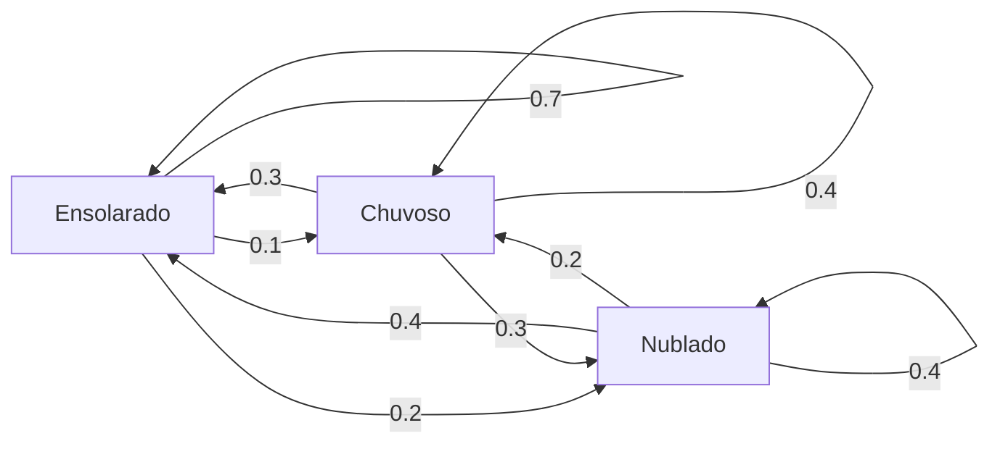
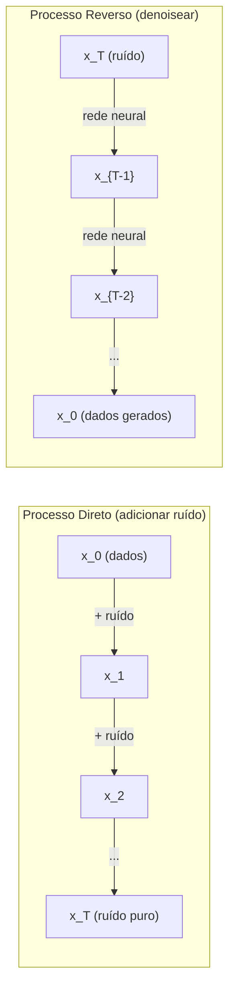

# Processos Estocásticos

> Aleatoriedade com estrutura. A matemática por trás de caminhadas aleatórias, cadeias de Markov e modelos de difusão.

**Tipo:** Aprendizado
**Idioma:** Python
**Pré-requisitos:** Fase 1, Lições 06-07 (probabilidade, Bayes)
**Tempo:** ~75 minutos

## Objetivos de Aprendizado

- Simular caminhadas aleatórias 1D e 2D e verificar o escalonamento sqrt(n) do deslocamento
- Construir um simulador de cadeia de Markov e computar sua distribuição estacionária via autodecomposição
- Implementar Metropolis-Hastings MCMC e dinâmica de Langevin para amostrar de distribuições alvo
- Conectar o processo de difusão direto ao movimento Browniano e explicar como o processo reverso gera dados

## O Problema

Muitos sistemas de IA envolvem aleatoriedade que evolui ao longo do tempo. Não aleatoriedade estática -- aleatoriedade estruturada e sequencial onde cada passo depende do que veio antes.

Modelos de linguagem geram tokens um por vez. Cada token depende do contexto anterior. O modelo produz uma distribuição de probabilidade, amostra dela e segue em frente. Isso é um processo estocástico.

Modelos de difusão adicionam ruído a uma imagem passo a passo até que se torne estática pura. Depois revertem o processo, denoising passo a passo até que uma nova imagem surja. O processo direto é uma cadeia de Markov. O processo reverso é uma cadeia de Markov aprendida rodando para trás.

Agentes de aprendizado por reforço tomam ações em um ambiente. Cada ação leva a um novo estado com alguma probabilidade. O agente segue uma política aleatória em um mundo aleatório. A coisa toda é um processo de decisão Markoviano.

Amostragem MCMC -- a espinha dorsal da inferência Bayesiana -- constrói uma cadeia de Markov cuja distribuição estacionária é a posteriori que você quer amostrar.

Todos estes constroem sobre quatro ideias fundamentais:
1. Caminhadas aleatórias -- o processo estocástico mais simples
2. Cadeias de Markov -- aleatoriedade estruturada com uma matriz de transição
3. Dinâmica de Langevin -- descida do gradiente com ruído
4. Metropolis-Hastings -- amostragem de qualquer distribuição

## O Conceito

### Caminhadas Aleatórias

Comece na posição 0. A cada passo, jogue uma moeda justa. Cara: mova direita (+1). Coroa: mova esquerda (-1).

Após n passos, sua posição é a soma de n valores aleatórios +/-1. A posição esperada é 0 (a caminhada é não-viesada). Mas a distância esperada da origem cresce como sqrt(n).

Isto é contraintuitivo. A caminhada é justa -- sem deriva em qualquer direção. Mas ao longo do tempo, ela vagueia cada vez mais longe de onde começou. O desvio padrão após n passos é sqrt(n).

```
Passo 0:  Posição = 0
Passo 1:  Posição = +1 ou -1
Passo 2:  Posição = +2, 0, ou -2
...
Passo 100: Distância esperada da origem ~ 10 (sqrt(100))
Passo 10000: Distância esperada da origem ~ 100 (sqrt(10000))
```

**Em 2D**, a caminhada move para cima, baixo, esquerda ou direita com igual probabilidade. O mesmo escalonamento sqrt(n) se aplica à distância da origem. O caminho traça um padrão fractal.

**Por que sqrt(n)?** Cada passo é +1 ou -1 com igual probabilidade. Após n passos, a posição S_n = X_1 + X_2 + ... + X_n onde cada X_i é +/-1. A variância de cada passo é 1, e os passos são independentes, então Var(S_n) = n. Desvio padrão = sqrt(n). Pelo teorema central do limite, S_n / sqrt(n) converge para uma distribuição normal padrão.

Este escalonamento sqrt(n) aparece em todo lugar em ML. Ruído SGD escala como 1/sqrt(tamanho_do_lote). Dimensões de embedding escalam como sqrt(d). A raiz quadrada é a assinatura de adições aleatórias independentes.

**Conexão com movimento Browniano.** Tome uma caminhada aleatória com tamanho de passo 1/sqrt(n) e n passos por unidade de tempo. Conforme n vai para infinito, a caminhada converge para o movimento Browniano B(t) -- um processo de tempo contínuo onde B(t) é normalmente distribuído com média 0 e variância t.

O movimento Browniano é a fundação matemática da difusão. Ele modela o agitação aleatória de partículas em um fluido, as flutuações de preços de ações e, crucialmente, o processo de ruído em modelos de difusão.

**Ruína do jogador.** Um caminhante aleatório começando na posição k, com barreiras absorventes em 0 e N. Qual a probabilidade de alcançar N antes de 0? Para uma caminhada justa: P(alcançar N) = k/N. Isto é surpreendentemente simples e elegante. Conecta-se à teoria dos martingales -- a caminhada aleatória justa é um martingale (valor futuro esperado = valor atual).

### Cadeias de Markov

Uma cadeia de Markov é um sistema que transita entre estados de acordo com probabilidades fixas. A propriedade chave: o próximo estado depende apenas do estado atual, não da história.

```
P(X_{t+1} = j | X_t = i, X_{t-1} = ...) = P(X_{t+1} = j | X_t = i)
```

Esta é a propriedade de Markov. Significa que você pode descrever toda a dinâmica com uma matriz de transição P:

```
P[i][j] = probabilidade de ir do estado i para o estado j
```

Cada linha de P soma 1 (você deve ir para algum lugar).

**Exemplo -- Clima:**

```
Estados: Ensolarado (0), Chuvoso (1), Nublado (2)

P = [[0.7, 0.1, 0.2],    (se ensolarado: 70% sol, 10% chuva, 20% nublado)
     [0.3, 0.4, 0.3],    (se chuvoso: 30% sol, 40% chuva, 30% nublado)
     [0.4, 0.2, 0.4]]    (se nublado: 40% sol, 20% chuva, 40% nublado)
```

Comece em qualquer estado. Após muitas transições, a distribuição dos estados converge para a distribuição estacionária pi, onde pi * P = pi. Este é o autovetor esquerdo de P com autovalor 1.

Para a cadeia do clima, a distribuição estacionária pode ser [0.53, 0.18, 0.29] -- a longo prazo, está ensolarado 53% do tempo independentemente do estado inicial.



**Computando a distribuição estacionária.** Há duas abordagens:

1. **Método da potência**: multiplique qualquer distribuição inicial por P repetidamente. Após iterações suficientes, converge.
2. **Método do autovalor**: encontre o autovetor esquerdo de P com autovalor 1. Este é o autovetor de P^T com autovalor 1.

Ambas abordagens requerem que a cadeia satisfaça condições de convergência.

**Condições de convergência.** Uma cadeia de Markov converge para uma distribuição estacionária única se for:
- **Irredutível**: todo estado é alcançável de todo outro estado
- **Aperiódica**: a cadeia não cicla com um período fixo

A maioria das cadeias que você encontra em ML satisfaz ambas condições.

**Estados absorventes.** Um estado é absorvente se uma vez que você entra, nunca sai (P[i][i] = 1). Cadeias de Markov absorventes modelam processos com estados terminais -- um jogo que acaba, um cliente que churna, uma sequência de tokens que atinge o token de fim de texto.

**Tempo de mistura.** Quantos passos até que a cadeia esteja "próxima" da distribuição estacionária? Formalmente, o número de passos até que a distância de variação total da estacionariedade caia abaixo de algum limiar. Mistura rápida = poucos passos necessários. O gap espectral de P (1 menos o segundo maior autovalor) controla o tempo de mistura. Gap maior = mistura mais rápida.

### Conexão com Modelos de Linguagem

A geração de tokens em um modelo de linguagem é aproximadamente um processo Markoviano. Dado o contexto atual, o modelo produz uma distribuição sobre o próximo token. A temperatura controla a nitidez:

```
P(token_i) = exp(logit_i / temperature) / sum(exp(logit_j / temperature))
```

- Temperatura = 1.0: distribuição padrão
- Temperatura < 1.0: mais nítida (mais determinística)
- Temperatura > 1.0: mais plana (mais aleatória)
- Temperatura -> 0: argmax (guloso)

Amostragem top-k trunca para os k tokens de maior probabilidade. Amostragem top-p (núcleo) trunca para o menor conjunto de tokens cuja probabilidade acumulada excede p. Ambos modificam as probabilidades de transição Markovianas.

### Movimento Browniano

O limite de tempo contínuo da caminhada aleatória. A posição B(t) tem três propriedades:
1. B(0) = 0
2. B(t) - B(s) é normalmente distribuído com média 0 e variância t - s (para t > s)
3. Incrementos em intervalos não sobrepostos são independentes

O movimento Browniano é contínuo mas em nenhum lugar diferenciável -- ele se agita em toda escala. O caminho tem dimensão fractal 2 no plano.

Em simulação discreta, você aproxima o movimento Browniano por:

```
B(t + dt) = B(t) + sqrt(dt) * z,    onde z ~ N(0, 1)
```

O escalonamento sqrt(dt) é importante. Vem do teorema central do limite aplicado a caminhadas aleatórias.

### Dinâmica de Langevin

A descida do gradiente encontra o mínimo de uma função. A dinâmica de Langevin encontra a distribuição de probabilidade proporcional a exp(-U(x)/T), onde U é uma função de energia e T é temperatura.

```
x_{t+1} = x_t - dt * gradiente(U(x_t)) + sqrt(2 * T * dt) * z_t
```

Duas forças agem na partícula:
1. **Força gradiente** (-dt * gradiente(U)): empurra para baixa energia (como descida do gradiente)
2. **Força aleatória** (sqrt(2*T*dt) * z): empurra em direções aleatórias (exploração)

Na temperatura T = 0, isto é descida do gradiente pura. Em alta temperatura, é quase uma caminhada aleatória. Na temperatura certa, a partícula explora a paisagem de energia e passa mais tempo em regiões de baixa energia.

**Conexão com modelos de difusão.** O processo direto de um modelo de difusão é:

```
x_t = sqrt(alpha_t) * x_{t-1} + sqrt(1 - alpha_t) * ruído
```

Esta é uma cadeia de Markov que gradualmente mistura os dados com ruído. Após passos suficientes, x_T é ruído Gaussiano puro.

O processo reverso -- indo de ruído de volta a dados -- também é uma cadeia de Markov, mas suas probabilidades de transição são aprendidas por uma rede neural. A rede aprende a prever o ruído que foi adicionado em cada passo, depois o subtrai.



### MCMC: Markov Chain Monte Carlo

Às vezes você precisa amostrar de uma distribuição p(x) que você pode avaliar (até uma constante) mas não pode amostrar diretamente. Posteriores Bayesianos são o exemplo clássico -- você conhece a verossimilhança vezes a prior, mas a constante de normalização é intratável.

**Metropolis-Hastings** constrói uma cadeia de Markov cuja distribuição estacionária é p(x):

1. Comece em alguma posição x
2. Proponha uma nova posição x' de uma distribuição proposta Q(x'|x)
3. Compute a razão de aceitação: a = p(x') * Q(x|x') / (p(x) * Q(x'|x))
4. Aceite x' com probabilidade min(1, a). Caso contrário, fique em x.
5. Repita.

Se Q é simétrica (por exemplo, Q(x'|x) = Q(x|x') = N(x, sigma^2)), a razão simplifica para a = p(x') / p(x). Você só precisa da razão das probabilidades -- a constante de normalização se cancela.

A cadeia é garantida de convergir para p(x) sob condições brandas. Mas a convergência pode ser lenta se a proposta for muito pequena (caminhada aleatória) ou muito grande (alta rejeição). Ajustar a proposta é a arte do MCMC.

**Por que funciona.** A razão de aceitação garante balanço detalhado: a probabilidade de estar em x e mover para x' é igual à probabilidade de estar em x' e mover para x. Balanço detalhado implica que p(x) é a distribuição estacionária da cadeia. Então, após passos suficientes, as amostras vêm de p(x).

**Considerações práticas:**
- **Burn-in**: descarte as primeiras N amostras. A cadeia precisa de tempo para alcançar a distribuição estacionária a partir de seu ponto inicial.
- **Thinning**: mantenha cada k-ésima amostra para reduzir autocorrelação.
- **Múltiplas cadeias**: execute várias cadeias de diferentes pontos iniciais. Se convergem para a mesma distribuição, você tem evidência de convergência.
- **Taxa de aceitação**: para propostas Gaussianas em d dimensões, a taxa de aceitação ótima é cerca de 23% (Roberts & Rosenthal, 2001). Muito alta significa que a cadeia mal se move. Muito baixa significa que rejeita tudo.

### Processos Estocásticos em IA

| Processo | Aplicação IA |
|----------|--------------|
| Caminhada aleatória | Exploração em RL, embeddings Node2Vec |
| Cadeia de Markov | Geração de texto, amostragem MCMC |
| Movimento Browniano | Modelos de difusão (processo direto) |
| Dinâmica de Langevin | Modelos generativos baseados em score, SGLD |
| Processo de decisão Markoviano | Aprendizado por reforço |
| Metropolis-Hastings | Inferência Bayesiana, amostragem posteriori |

## Construa

### Passo 1: Simulador de caminhada aleatória

```python
import numpy as np

def random_walk_1d(n_steps, seed=None):
    rng = np.random.RandomState(seed)
    steps = rng.choice([-1, 1], size=n_steps)
    positions = np.concatenate([[0], np.cumsum(steps)])
    return positions


def random_walk_2d(n_steps, seed=None):
    rng = np.random.RandomState(seed)
    directions = rng.choice(4, size=n_steps)
    dx = np.zeros(n_steps)
    dy = np.zeros(n_steps)
    dx[directions == 0] = 1   # direita
    dx[directions == 1] = -1  # esquerda
    dy[directions == 2] = 1   # cima
    dy[directions == 3] = -1  # baixo
    x = np.concatenate([[0], np.cumsum(dx)])
    y = np.concatenate([[0], np.cumsum(dy)])
    return x, y
```

A caminhada 1D armazena somas cumulativas. Cada passo é +1 ou -1. Após n passos, a posição é a soma. A variância cresce linearmente com n, então o desvio padrão cresce como sqrt(n).

### Passo 2: Cadeia de Markov

```python
class MarkovChain:
    def __init__(self, transition_matrix, state_names=None):
        self.P = np.array(transition_matrix, dtype=float)
        self.n_states = len(self.P)
        self.state_names = state_names or [str(i) for i in range(self.n_states)]

    def step(self, current_state, rng=None):
        if rng is None:
            rng = np.random.RandomState()
        probs = self.P[current_state]
        return rng.choice(self.n_states, p=probs)

    def simulate(self, start_state, n_steps, seed=None):
        rng = np.random.RandomState(seed)
        states = [start_state]
        current = start_state
        for _ in range(n_steps):
            current = self.step(current, rng)
            states.append(current)
        return states

    def stationary_distribution(self):
        eigenvalues, eigenvectors = np.linalg.eig(self.P.T)
        idx = np.argmin(np.abs(eigenvalues - 1.0))
        stationary = np.real(eigenvectors[:, idx])
        stationary = stationary / stationary.sum()
        return np.abs(stationary)
```

A distribuição estacionária é o autovetor esquerdo de P com autovalor 1. Encontramo-la computando autovetores de P^T (transpor transforma autovetores esquerdos em autovetores direitos).

### Passo 3: Dinâmica de Langevin

```python
def langevin_dynamics(grad_U, x0, dt, temperature, n_steps, seed=None):
    rng = np.random.RandomState(seed)
    x = np.array(x0, dtype=float)
    trajectory = [x.copy()]
    for _ in range(n_steps):
        noise = rng.randn(*x.shape)
        x = x - dt * grad_U(x) + np.sqrt(2 * temperature * dt) * noise
        trajectory.append(x.copy())
    return np.array(trajectory)
```

O gradiente empurra x para baixa energia. O ruído impede que fique preso. Em equilíbrio, a distribuição das amostras é proporcional a exp(-U(x)/temperatura).

### Passo 4: Metropolis-Hastings

```python
def metropolis_hastings(target_log_prob, proposal_std, x0, n_samples, seed=None):
    rng = np.random.RandomState(seed)
    x = np.array(x0, dtype=float)
    samples = [x.copy()]
    accepted = 0
    for _ in range(n_samples - 1):
        x_proposed = x + rng.randn(*x.shape) * proposal_std
        log_ratio = target_log_prob(x_proposed) - target_log_prob(x)
        if np.log(rng.rand()) < log_ratio:
            x = x_proposed
            accepted += 1
        samples.append(x.copy())
    acceptance_rate = accepted / (n_samples - 1)
    return np.array(samples), acceptance_rate
```

O algoritmo propõe um novo ponto, verifica se tem probabilidade maior (ou aceita com probabilidade proporcional à razão), e repete. A taxa de aceitação deve ficar em torno de 23-50% para boa mistura.

## Use

Na prática, você usa bibliotecas estabelecidas para estes algoritmos. Mas entender a mecânica importa para depuração e ajuste.

```python
import numpy as np

rng = np.random.RandomState(42)
walk = np.cumsum(rng.choice([-1, 1], size=10000))
print(f"Posição final: {walk[-1]}")
print(f"Distância esperada: {np.sqrt(10000):.1f}")
print(f"Distância real: {abs(walk[-1])}")
```

### numpy para matrizes de transição

```python
import numpy as np

P = np.array([[0.7, 0.1, 0.2],
              [0.3, 0.4, 0.3],
              [0.4, 0.2, 0.4]])

distribution = np.array([1.0, 0.0, 0.0])
for _ in range(100):
    distribution = distribution @ P

print(f"Distribuição estacionária: {np.round(distribution, 4)}")
```

Multiplique a distribuição inicial por P repetidamente. Após iterações suficientes, converge para a distribuição estacionária independentemente de onde você começou. Este é o método da potência para encontrar o autovetor esquerdo dominante.

### Conexões com frameworks reais

- **PyTorch diffusion:** O `DDPMScheduler` no Hugging Face `diffusers` implementa as cadeias de Markov direta e reversa
- **NumPyro / PyMC:** Usa MCMC (amostrador NUTS, que melhora o Metropolis-Hastings) para inferência Bayesiana
- **Gymnasium (RL):** A função step do ambiente define um processo de decisão Markoviano

### Verificando convergência de cadeia de Markov

```python
import numpy as np

P = np.array([[0.9, 0.1], [0.3, 0.7]])

eigenvalues = np.linalg.eigvals(P)
spectral_gap = 1 - sorted(np.abs(eigenvalues))[-2]
print(f"Autovalores: {eigenvalues}")
print(f"Gap espectral: {spectral_gap:.4f}")
print(f"Tempo de mistura aproximado: {1/spectral_gap:.1f} passos")
```

O gap espectral te diz quão rápido a cadeia esquece seu estado inicial. Um gap de 0.2 significa aproximadamente 5 passos para misturar. Um gap de 0.01 significa aproximadamente 100 passos. Sempre verifique isto antes de executar simulações longas -- uma cadeia de mistura lenta desperdiça computação.

## Entregue

Esta lição produz:
- `outputs/prompt-stochastic-process-advisor.md` -- um prompt que ajuda a identificar qual framework de processo estocástico se aplica a um dado problema

## Conexões

| Conceito | Onde aparece |
|----------|--------------|
| Caminhada aleatória | Embeddings Node2Vec, exploração em RL |
| Cadeia de Markov | Geração de tokens em LLMs, amostragem MCMC |
| Movimento Browniano | Processo de difusão direto em DDPM, modelos baseados em EDE |
| Dinâmica de Langevin | Modelos generativos baseados em score, Stochastic Gradient Langevin Dynamics (SGLD) |
| Distribuição estacionária | Alvo de convergência MCMC, PageRank |
| Metropolis-Hastings | Amostragem posteriori Bayesiana, simulated annealing |
| Temperatura | Amostragem LLM, exploração Boltzmann em RL, simulated annealing |
| Tempo de mistura | Velocidade de convergência MCMC, análise de gap espectral |
| Estado absorvente | Token de fim de sequência, estados terminais em RL |
| Balanço detalhado | Garantia de correção para amostradores MCMC |

Modelos de difusão merecem atenção especial. DDPM (Ho et al., 2020) define uma cadeia de Markov direta:

```
q(x_t | x_{t-1}) = N(x_t; sqrt(1-beta_t) * x_{t-1}, beta_t * I)
```

onde beta_t é um cronograma de ruído. Após T passos, x_T é aproximadamente N(0, I). O processo reverso é parametrizado por uma rede neural que prevê o ruído:

```
p_theta(x_{t-1} | x_t) = N(x_{t-1}; mu_theta(x_t, t), sigma_t^2 * I)
```

Cada passo de geração é um passo em uma cadeia de Markov aprendida. Entender cadeias de Markov significa entender como e por que modelos de difusão geram dados.

SGLD (Stochastic Gradient Langevin Dynamics) combina descida do gradiente em mini-batches com ruído de Langevin. Em vez de computar o gradiente completo, você usa uma estimativa estocástica e adiciona ruído calibrado. Conforme a taxa de aprendizado decai, SGLD transita de otimização para amostragem -- você obtém amostras posteriores Bayesianas aproximadas de graça. Esta é uma das maneiras mais simples de obter estimativas de incerteza de uma rede neural.

A ideia chave em todas estas conexões: processos estocásticos não são apenas ferramentas teóricas. Eles são os mecanismos computacionais dentro de sistemas de IA modernos. Quando você ajusta a temperatura de um LLM, está ajustando uma cadeia de Markov. Quando treina um modelo de difusão, está aprendendo a reverter um processo semelhante ao movimento Browniano. Quando executa inferência Bayesiana, está construindo uma cadeia que converge para a posteriori.

## Exercícios

1. **Simule 1000 caminhadas aleatórias de 10000 passos.** Plote a distribuição das posições finais. Verifique que é aproximadamente Gaussiana com média 0 e desvio padrão sqrt(10000) = 100.

2. **Construa um gerador de texto usando uma cadeia de Markov.** Treine em um pequeno corpus: para cada palavra, conte transições para a próxima palavra. Construa a matriz de transição. Gere novas sentenças amostrando da cadeia.

3. **Implemente simulated annealing** usando Metropolis-Hastings. Comece em alta temperatura (aceite quase tudo) e gradualmente esfrie (aceite apenas melhorias). Use para encontrar o mínimo de uma função com muitos mínimos locais.

4. **Compare dinâmica de Langevin em diferentes temperaturas.** Amostre de um potencial de poço duplo U(x) = (x^2 - 1)^2. Em baixa temperatura, as amostras se aglomeram em um poço. Em alta temperatura, espalham-se por ambos. Encontre a temperatura crítica onde a cadeia mistura entre os poços.

5. **Implemente o processo de difusão direto.** Comece com um sinal 1D (por exemplo, uma onda senoidal). Adicione ruído progressivamente ao longo de 100 passos com um cronograma de ruído linear. Mostre como o sinal degrada para ruído puro. Depois implemente um denoiser simples que reverte o processo (mesmo que ingênuo, apenas subtraindo o ruído estimado).

## Termos-Chave

| Termo | O que as pessoas dizem | O que realmente significa |
|-------|----------------------|--------------------------|
| Caminhada aleatória | "Movimento de moeda" | Um processo onde a posição muda por incrementos aleatórios a cada passo |
| Propriedade de Markov | "Sem memória" | O futuro depende apenas do estado presente, não da história |
| Matriz de transição | "A tabela de probabilidades" | P[i][j] = probabilidade de mover do estado i para o estado j |
| Distribuição estacionária | "A média de longo prazo" | A distribuição pi onde pi*P = pi -- o equilíbrio da cadeia |
| Movimento Browniano | "Agitação aleatória" | O limite de tempo contínuo de uma caminhada aleatória, B(t) ~ N(0, t) |
| Dinâmica de Langevin | "Descida do gradiente com ruído" | Regra de atualização que combina gradiente determinístico e perturbação aleatória |
| MCMC | "Caminhando em direção ao alvo" | Construir uma cadeia de Markov cuja distribuição estacionária é a que você quer |
| Metropolis-Hastings | "Propor e aceitar/rejeitar" | Algoritmo MCMC que usa razões de aceitação para garantir convergência |
| Temperatura | "O botão de aleatoriedade" | Parâmetro controlando o tradeoff entre exploração e explotação |
| Processo de difusão | "Ruído entra, ruído sai" | Direto: adicionar ruído gradualmente. Reverso: removê-lo gradualmente. Gera dados. |

## Leitura Adicional

- **Ho, Jain, Abbeel (2020)** -- "Denoising Diffusion Probabilistic Models." O paper DDPM que lançou a revolução dos modelos de difusão. Derivação clara das cadeias de Markov direta e reversa.
- **Song & Ermon (2019)** -- "Generative Modeling by Estimating Gradients of the Data Distribution." Abordagem baseada em score usando dinâmica de Langevin para amostragem.
- **Roberts & Rosenthal (2004)** -- "General state space Markov chains and MCMC algorithms." A teoria por trás de quando e por que MCMC funciona.
- **Norris (1997)** -- "Markov Chains." O livro texto padrão. Cobre convergência, distribuições estacionárias e tempos de atingimento.
- **Welling & Teh (2011)** -- "Bayesian Learning via Stochastic Gradient Langevin Dynamics." Combina SGD com dinâmica de Langevin para inferência Bayesiana escalável.
