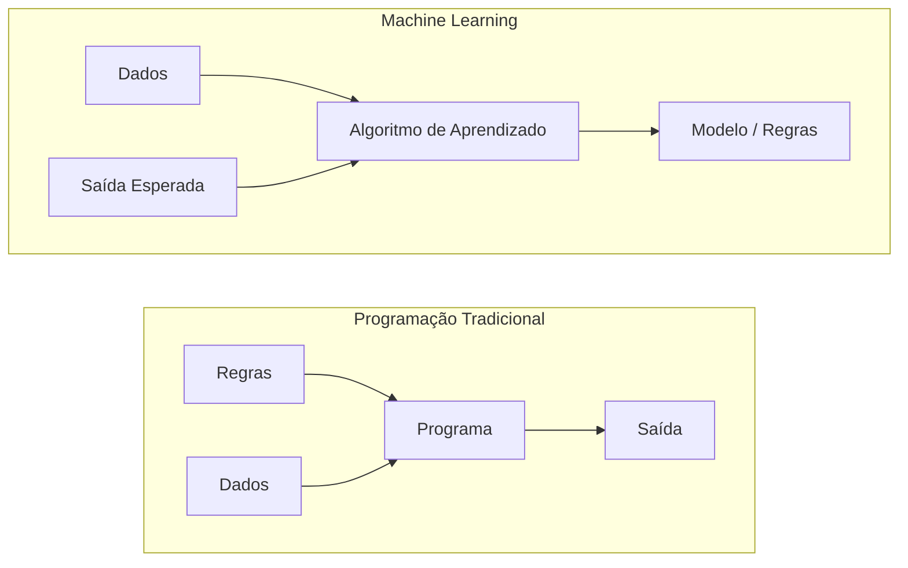
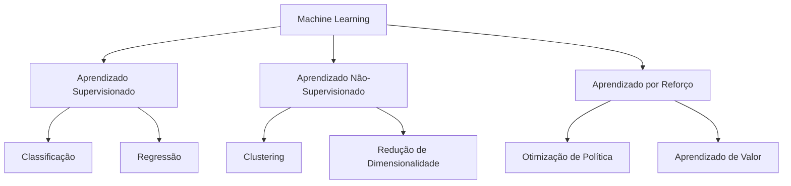
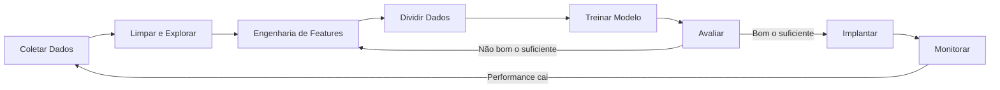
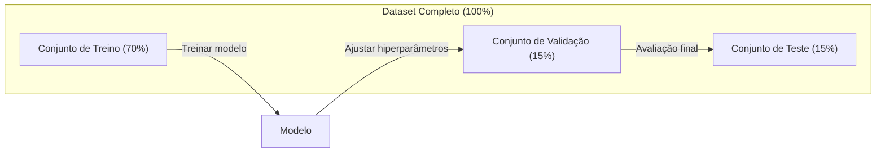
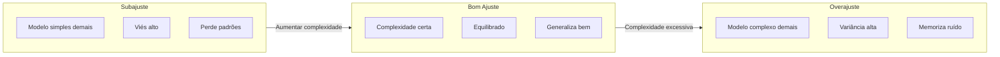
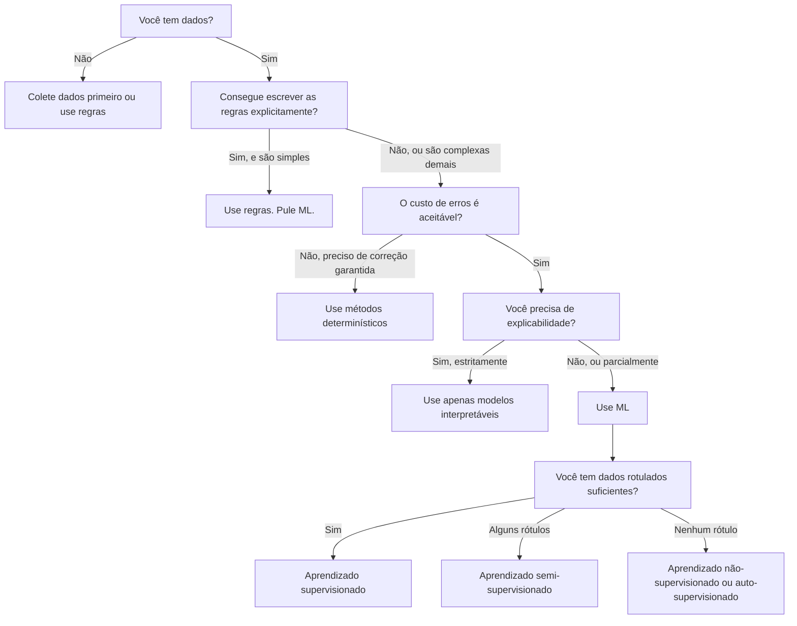

# O Que É Machine Learning

> Machine learning é ensinar computadores a encontrar padrões em dados em vez de escrever regras na mão.

**Tipo:** Aprender
**Linguagens:** Python
**Pré-requisitos:** Fase 1 (Base Matemática)
**Tempo:** ~45 minutos

## Objetivos de Aprendizado

- Explicar a diferença entre aprendizado supervisionado, não-supervisionado e por reforço e identificar qual tipo se aplica a um problema dado
- Implementar um classificador por centroide mais próximo do zero e avaliá-lo contra um baseline aleatório
- Distinguir entre tarefas de classificação e regressão e selecionar a função de perda adequada para cada uma
- Avaliar se um problema de negócio é adequado para ML ou melhor resolvido com regras determinísticas

## O Problema

Você quer construir um filtro de spam. A abordagem tradicional: sentar e escrever centenas de regras. "Se o email contém 'DINHEIRO GRÁTIS', marque como spam. Se tiver mais de 3 pontos de exclamação, marque como spam." Você gasta semanas escrevendo regras. Aí os spammers mudam o texto. Suas regras quebram. Você escreve mais regras. O ciclo nunca termina.

Machine learning inverte isso. Em vez de escrever regras, você dá ao computador milhares de emails rotulados ("spam" ou "não spam") e deixa ele descobrir as regras sozinho. O computador encontra padrões que você nunca pensaria. Quando os spammers mudam de tática, você retreina com novos dados em vez de reescrever código.

Essa transição de "programar regras" para "aprender com dados" é o coração do machine learning. Todo motor de recomendação, assistente de voz, carro autônomo e modelo de linguagem funciona assim.

## O Conceito

### Aprendendo dos Dados, Não das Regras

Programação tradicional e machine learning resolvem problemas em direções opostas.



Programação tradicional: você escreve as regras. O programa aplica nos dados pra produzir saída.

Machine learning: você fornece dados e saídas esperadas. O algoritmo descobre as regras.

O "modelo" que sai do treino SÃO as regras, codificadas como números (pesos, parâmetros). Ele generaliza a partir de exemplos que viu para fazer previsões em dados que nunca viu.

### Os Três Tipos de Machine Learning



**Aprendizado Supervisionado**: Você tem pares entrada-saída. O modelo aprende a mapear entradas pra saídas.
- "Aqui estão 10.000 fotos rotuladas como gato ou cachorro. Aprenda a diferenciá-los."
- "Aqui estão características de casas e preços. Aprenda a prever o preço."

**Aprendizado Não-Supervisionado**: Você tem só entradas. Sem rótulos. O modelo encontra estrutura sozinho.
- "Aqui estão 10.000 históricos de compras de clientes. Encontre agrupamentos naturais."
- "Aqui estão pontos de dados em 1.000 dimensões. Reduza para 2 dimensões mantendo a estrutura."

**Aprendizado por Reforço**: Um agente toma ações em um ambiente e recebe recompensas ou punições. Aprende uma estratégia (política) pra maximizar recompensa total.
- "Jogue este jogo. +1 por vencer, -1 por perder. Descubra uma estratégia."
- "Controle este braço robótico. +1 por pegar o objeto, -0.01 por cada segundo desperdiçado."

A maior parte do que você vai construir na prática usa aprendizado supervisionado. Aprendizado não-supervisionado é comum para pré-processamento e exploração. Aprendizado por reforço alimenta IA de jogos, robótica e RLHF para modelos de linguagem.

### Além dos Três Grandes

As três categorias acima são organizadas, mas o ML do mundo real frequentemente borra as linhas.

**Aprendizado semi-supervisionado** usa um conjunto pequeno de dados rotulados e um conjunto grande de dados não rotulados. Você pode ter 100 imagens médicas rotuladas e 100.000 não rotuladas. Técnicas incluem:

- **Propagação de rótulos:** Construa um grafo conectando pontos de dados similares. Rótulos se espalham de nós rotulados para vizinhos não rotulados através do grafo.
- **Pseudo-rótulos:** Treine um modelo nos dados rotulados, use-o para prever rótulos para dados não rotulados, depois retreine em tudo. O modelo inicializa seu próprio conjunto de treino.
- **Regularização de consistência:** O modelo deve dar a mesma previsão para uma entrada e uma versão ligeiramente perturbada dessa entrada. Isso funciona mesmo sem rótulos.

**Aprendizado auto-supervisionado** cria supervisão a partir dos próprios dados. Nenhum rótulo humano é necessário. O modelo cria sua própria tarefa de previsão a partir da estrutura dos dados.

- **Modelagem de linguagem mascarada (BERT):** Esconda 15% das palavras em uma frase, treine o modelo para prever as palavras faltantes. Os "rótulos" vêm do texto original.
- **Aprendizado contrastivo (SimCLR):** Pegue uma imagem, crie duas versões aumentadas. Treine o modelo para reconhecer que vieram da mesma imagem enquanto as distingue de versões aumentadas de outras imagens.
- **Predição do próximo token (GPT):** Preveja a próxima palavra dadas todas as palavras anteriores. Todo documento de texto vira um exemplo de treino.

Estas não são categorias separadas dos três grandes. São estratégias que combinam ideias supervisionadas e não-supervisionadas. Aprendizado auto-supervisionado é tecnicamente supervisionado (o modelo prevê algo), mas os rótulos são gerados automaticamente, não por humanos.

### Classificação vs Regressão

Estas são as duas principais tarefas de aprendizado supervisionado.

| Aspecto | Classificação | Regressão |
|---------|---------------|-----------|
| Saída | Categorias discretas | Números contínuos |
| Exemplo | "Esse email é spam?" | "Qual será o preço da casa?" |
| Espaço de saída | {gato, cachorro, pássaro} | Qualquer número real |
| Função de perda | Entropia cruzada, accuracy | Erro quadrático médio, MAE |
| Decisão | Fronteiras entre classes | Uma curva que ajusta os dados |

Classificação responde "qual categoria?" Regressão responde "quanto?"

Alguns problemas podem ser formulados de qualquer maneira. Prever se uma ação sobe ou desce é classificação. Prever o preço exato é regressão.

### O Fluxo de Trabalho de ML

Todo projeto de machine learning segue o mesmo pipeline, independente do algoritmo.



**Coletar Dados**: Reúna dados brutos. Mais dados é quase sempre melhor, mas qualidade importa mais que quantidade.

**Limpar e Explorar**: Trate valores faltantes, remova duplicatas, visualize distribuições, encontre anomalias. Esta etapa geralmente leva 60-80% do tempo total do projeto.

**Engenharia de Features**: Transforme dados brutos em features que o modelo pode usar. Transforme datas em dia-da-semana. Normalize colunas numéricas. Codifique variáveis categóricas. Boas features importam mais que algoritmos sofisticados.

**Dividir Dados**: Divida em conjuntos de treino, validação e teste. O modelo treina nos dados de treino, você ajusta hiperparâmetros nos dados de validação e reporta performance final nos dados de teste.

**Treinar Modelo**: Alimente dados de treino em um algoritmo. O algoritmo ajusta parâmetros internos para minimizar uma função de perda.

**Avaliar**: Meça performance nos dados de validação/teste. Se a performance não for aceitável, volte e tente features, algoritmos ou hiperparâmetros diferentes.

**Implantar**: Coloque o modelo em produção onde ele faz previsões em dados novos.

**Monitorar**: Acompanhe performance ao longo do tempo. Distribuições de dados mudam (data drift) e modelos degradam. Quando a performance cai, retreine.

### Divisões de Treino, Validação e Teste

Esta é a aula mais importante que iniciantes erram. Você **deve** avaliar seu modelo em dados que ele nunca viu durante o treino. Caso contrário, está medindo memorização, não aprendizado.



| Divisão | Propósito | Quando usado | Tamanho típico |
|---------|-----------|-------------|----------------|
| Treino | Modelo aprende destes dados | Durante treino | 60-80% |
| Validação | Ajustar hiperparâmetros, comparar modelos | Após cada run de treino | 10-20% |
| Teste | Estimativa final imparcial de performance | Uma vez, no final | 10-20% |

O conjunto de teste é sagrado. Você olha exatamente uma vez. Se ficar ajustando seu modelo baseado na performance de teste, está efetivamente treinando no teste e os números que reporta são inúteis.

Para datasets pequenos, use validação cruzada k-fold: divida dados em k partes, treine em k-1 partes, valide na parte restante, rotacione e tire a média dos resultados.

### Overajuste vs Subajuste



**Subajuste**: O modelo é simples demais pra capturar os padrões nos dados. Uma reta tentando ajustar uma relação curva. Erro de treino alto. Erro de teste alto.

**Overajuste**: O modelo é complexo demais e memoriza os dados de treino, incluindo o ruído. Uma curva sinuosa que passa por cada ponto de treino mas falha em dados novos. Erro de treino baixo. Erro de teste alto.

**Bom ajuste**: O modelo captura padrões reais sem memorizar ruído. Erro de treino e teste estão ambos razoavelmente baixos.

Sinais de overajuste:
- Acurácia de treino muito maior que acurácia de validação
- O modelo vai bem nos dados de treino mas mal em dados novos
- Adicionar mais dados de treino melhora a performance (o modelo estava memorizando, não aprendendo)

Correções para overajuste:
- Obtenha mais dados de treino
- Reduza a complexidade do modelo (menos parâmetros, arquitetura mais simples)
- Regularização (adicione penalidade para pesos grandes)
- Dropout (zere neurônios aleatoriamente durante o treino)
- Parada antecipada (pare o treino quando o erro de validação começar a aumentar)

Correções para subajuste:
- Use um modelo mais complexo
- Adicione mais features
- Reduza a regularização
- Treine por mais tempo

### O Tradeoff Viés-Variância

Esta é a framework matemática por trás de overajuste e subajuste.

**Viés**: Erro de premissas erradas no modelo. Um modelo linear tem viés alto quando a relação verdadeira é não-linear. Viés alto leva a subajuste.

**Variância**: Erro de sensibilidade a flutuações pequenas nos dados de treino. Um modelo com variância alta dá previsões muito diferentes quando treinado em subconjuntos diferentes dos dados. Variância alta leva a overajuste.

| Complexidade do Modelo | Viés | Variância | Resultado |
|-----------------------|------|-----------|-----------|
| Muito baixo (modelo linear pra dados curvos) | Alto | Baixo | Subajuste |
| Ideal | Médio | Médio | Boa generalização |
| Muito alto (polinômio grau 20 pra 10 pontos) | Baixo | Alto | Overajuste |

Erro total = Viés² + Variância + Ruído irredutível

Você não pode reduzir o ruído irredutível (é aleatoriedade nos próprios dados). Você quer encontrar o ponto ideal onde viés² + variância é minimizado.

### Teorema do Almoço Grátis (No Free Lunch)

Não existe um único algoritmo que funciona melhor para todo problema. Um algoritmo que vai bem em uma classe de problemas vai mal em outra. É por isso que cientistas de dados tentam múltiplos algoritmos e comparam resultados.

Na prática, a escolha depende de:
- Quantos dados você tem
- Quantas features existem
- Se a relação é linear ou não-linear
- Se você precisa de interpretabilidade
- Quanto poder computacional você pode gastar

### Quando NÃO Usar Machine Learning

ML é poderoso mas nem sempre é a ferramenta certa. Antes de recorrer a um modelo, pergunte se você realmente precisa de um.

**Não use ML quando:**

- **Regras são simples e bem definidas.** Cálculo de imposto, algoritmos de ordenação, conversões de unidade. Se você consegue escrever a lógica em alguns if-statements, um modelo adiciona complexidade sem benefício.
- **Você não tem dados ou tem muito poucos.** ML precisa de exemplos para aprender. Com 10 pontos de dados, você não consegue treinar nada significativo. Colete dados primeiro.
- **O custo de errar é catastrófico e você precisa de correção garantida.** Dosagem médica, controle de reator nuclear, verificação criptográfica. Modelos de ML são probabilísticos. Eles vão errar às vezes. Se "errar às vezes" é inaceitável, use métodos determinísticos.
- **Uma tabela de consulta ou heurística resolve o problema.** Se um limiar simples ou tabela cobre 99% dos casos, adicionar ML aumenta custo de manutenção sem melhoria significativa.
- **Você não consegue explicar a decisão e explicabilidade é necessária.** Indústrias reguladas (empréstimos, seguros, justiça criminal) às vezes exigem que toda decisão seja totalmente explicável. Alguns modelos de ML são interpretáveis (regressão linear, árvores de decisão pequenas). A maioria não é.
- **O problema muda mais rápido que você consegue retreinar.** Se as regras mudam diariamente e o retreino leva uma semana, o modelo está sempre desatualizado.

Use este fluxograma de decisão:



## Construa

O código em `code/ml_intro.py` implementa um classificador por centroide mais próximo do zero, o algoritmo de ML mais simples possível. Demonstra a ideia central: aprender dos dados, depois prever em dados novos.

### Passo 1: Classificador por Centroide Mais Próximo Do Zero

O classificador por centroide mais próximo calcula o centro (média) de cada classe nos dados de treino. Para prever, atribui cada novo ponto à classe cujo centro está mais próximo.

```python
class NearestCentroid:
    def fit(self, X, y):
        self.classes = np.unique(y)
        self.centroids = np.array([
            X[y == c].mean(axis=0) for c in self.classes
        ])

    def predict(self, X):
        distances = np.array([
            np.sqrt(((X - c) ** 2).sum(axis=1))
            for c in self.centroids
        ])
        return self.classes[distances.argmin(axis=0)]
```

Esse é o algoritmo inteiro. Fit calcula duas médias. Predict calcula distâncias. Sem descida de gradiente, sem iteração, sem hiperparâmetros.

### Passo 2: Treine em Dados Sintéticos

Geramos um dataset de classificação 2D com duas classes que se sobrepõem ligeiramente. O classificador por centroide desenha uma fronteira de decisão linear entre os centros das classes.

```python
rng = np.random.RandomState(42)
X_class0 = rng.randn(100, 2) + np.array([1.0, 1.0])
X_class1 = rng.randn(100, 2) + np.array([-1.0, -1.0])
X = np.vstack([X_class0, X_class1])
y = np.array([0] * 100 + [1] * 100)
```

### Passo 3: Compare com um Baseline

Todo modelo de ML deve ser comparado com um baseline trivial. Aqui, o baseline prevê uma classe aleatória. Se seu modelo de ML não supera chute aleatório, algo está errado.

```python
baseline_preds = rng.choice([0, 1], size=len(y_test))
baseline_acc = np.mean(baseline_preds == y_test)
```

O classificador por centroide deve obter cerca de 90%+ de acurácia neste dataset limpo. O baseline aleatório fica em torno de 50%.

### Por Que Isso Importa

O classificador por centroide mais próximo é trivialmente simples. Não tem hiperparâmetros, não tem iteração, não tem descida de gradiente. Mas captura o padrão fundamental de ML:

1. **Aprenda** uma representação dos dados de treino (os centroides)
2. **Preveja** em dados novos usando essa representação (distância mais próxima)
3. **Avalie** contra um baseline (chute aleatório)

Todo algoritmo de ML, da regressão logística a transformers, segue esse mesmo padrão de três passos. A representação fica mais complexa, mas o fluxo de trabalho permanece o mesmo.

### Passo 4: O Que o Classificador por Centroide Não Consegue Fazer

O classificador por centroide mais próximo assume que cada classe forma um único bloco. Ele desenha fronteiras de decisão lineares. Ele falha quando:

- Classes têm múltiplos agrupamentos (ex.: o dígito "1" pode ser escrito de várias maneiras diferentes)
- A fronteira de decisão é não-linear (ex.: uma classe envolve outra)
- Features têm escalas muito diferentes (a distância é dominada pela feature de maior escala)

Essas limitações motivam todos os outros algoritmos que você vai aprender. K-vizinhos mais próximos lida com múltiplos agrupamentos. Árvores de decisão lidam com fronteiras não-lineares. Escalonamento de features resolve o problema de escala. Cada aula constrói sobre as limitações da anterior.

## Use

sklearn fornece `NearestCentroid` e geradores de dados sintéticos:

```python
from sklearn.neighbors import NearestCentroid
from sklearn.datasets import make_classification
from sklearn.model_selection import train_test_split

X, y = make_classification(
    n_samples=500, n_features=2, n_redundant=0,
    n_clusters_per_class=1, random_state=42
)
X_train, X_test, y_train, y_test = train_test_split(X, y, test_size=0.3)

clf = NearestCentroid()
clf.fit(X_train, y_train)
print(f"Accuracy: {clf.score(X_test, y_test):.3f}")
```

## Entregue

Esta aula produz `outputs/prompt-ml-problem-framer.md` — um prompt que transforma problemas de negócio vagos em tarefas concretas de ML. Dê a ele uma descrição do problema ("queremos reduzir churn" ou "prever demanda para o próximo trimestre") e ele identifica o tipo de aprendizado, define o alvo de previsão, lista features candidatas, escolhe uma métrica de sucesso, estabelece um baseline e sinaliza armadilhas como vazamento de dados ou desbalanceamento de classes. Use no início de qualquer projeto de ML para evitar construir a coisa errada.

## Termos-chave

| Termo | O que as pessoas dizem | O que realmente significa |
|-------|------------------------|---------------------------|
| Modelo | "A IA" | Uma função matemática com parâmetros aprendíveis que mapeia entradas pra saídas |
| Treino | "Ensinando a IA" | Executar um algoritmo de otimização para ajustar parâmetros do modelo para que previsões correspondam a saídas conhecidas |
| Feature | "Uma coluna de entrada" | Uma propriedade mensurável dos dados que o modelo usa para fazer previsões |
| Rótulo | "A resposta" | A saída conhecida para um exemplo de treino, usada para computar o sinal de erro |
| Hiperparâmetro | "Uma configuração que você ajusta" | Um parâmetro definido antes do treino que controla o processo de aprendizado (learning rate, número de camadas) |
| Função de perda | "Quão errado o modelo está" | Uma função que mede a lacuna entre saídas previstas e reais, que o treino tenta minimizar |
| Overajuste | "Ele memorizou o teste" | O modelo aprendeu ruído específico do treino em vez de padrões gerais, então falha em dados novos |
| Subajuste | "Não aprendeu nada" | O modelo é simples demais para capturar os padrões reais nos dados |
| Generalização | "Funciona em dados novos" | A habilidade do modelo de fazer previsões precisas em dados nos quais não foi treinado |
| Validação cruzada | "Testando em diferentes partes" | Dividir dados repetidamente em partes de treino/teste e tirar a média dos resultados, dando uma estimativa de performance mais robusta |
| Regularização | "Manter pesos pequenos" | Adicionar um termo de penalidade à função de perda que desencoraja modelos excessivamente complexos |
| Data drift | "O mundo mudou" | A distribuição estatística dos dados recebidos muda ao longo do tempo, degradando a performance do modelo |

## Exercícios

1. Pegue qualquer dataset (ex: Iris, Titanic). Divida 70/15/15 em treino/validação/teste. Explique por que não deve ajustar hiperparâmetros no conjunto de teste.
2. Liste três problemas reais. Para cada um, identifique se é classificação, regressão ou clustering, e se é supervisionado ou não-supervisionado.
3. Um modelo pega 99% de accuracy nos dados de treino mas 60% nos dados de teste. Diagnostique o problema e liste três coisas que você tentaria para corrigir.

## Leitura Adicional

- [An Introduction to Statistical Learning](https://www.statlearning.com/) — livro-texto gratuito cobrindo todos os métodos clássicos de ML com exemplos práticos
- [Google's Machine Learning Crash Course](https://developers.google.com/machine-learning/crash-course) — introdução visual concisa aos conceitos de ML
- [Scikit-learn User Guide](https://scikit-learn.org/stable/user_guide.html) — a referência prática para implementar ML em Python
