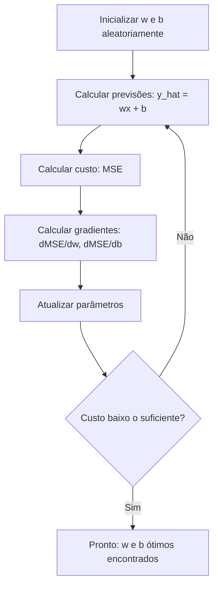

# Regressão Linear

> Regressão linear desenha a melhor reta através dos seus dados. É o "hello world" do machine learning.

**Tipo:** Build
**Linguagens:** Python
**Pré-requisitos:** Fase 1 (Álgebra Linear, Cálculo, Otimização), Fase 2 Aula 1
**Tempo:** ~90 minutos

## Objetivos de Aprendizado

- Derivar as regras de atualização da descida do gradiente para erro quadrático médio e implementar regressão linear do zero
- Comparar descida do gradiente e equação normal em termos de complexidade computacional e quando usar cada uma
- Construir um modelo de regressão linear múltipla com padronização de features e interpretar os pesos aprendidos
- Explicar como a regressão Ridge (regularização L2) previne overajuste penalizando pesos grandes

## O Problema

Você tem dados: tamanhos de casas e seus preços de venda. Quer prever o preço de uma nova casa dado o tamanho. Poderia estimar visualmente num gráfico de dispersão, mas precisa de uma fórmula. Precisa de uma reta que melhor se ajusta aos dados pra poder colocar qualquer tamanho e ter uma previsão de preço.

Regressão linear te dá essa reta. Mais importante, introduz o ciclo completo de treino de ML: definir um modelo, definir uma função de custo, otimizar os parâmetros. Todo algoritmo de ML segue esse mesmo padrão. Domine aqui com o caso mais simples e você o reconhecerá em todo lugar.

Não é só para problemas simples. Regressão linear é usada em sistemas de produção para previsão de demanda, análise de testes A/B, modelagem financeira e como baseline para toda tarefa de regressão.

## O Conceito

### O Modelo

Regressão linear assume uma relação linear entre entrada (x) e saída (y):

```
y = wx + b
```

- `w` (peso/inclinação): quanto y muda quando x aumenta em 1
- `b` (viés/intercepto): o valor de y quando x = 0

Para múltiplas entradas (features), isso se estende para:

```
y = w1*x1 + w2*x2 + ... + wn*xn + b
```

Ou em forma vetorial: `y = w^T * x + b`

O objetivo: encontrar os valores de w e b que tornam o y previsto o mais próximo possível do y real em todos os exemplos de treino.

### A Função de Custo (Erro Quadrático Médio)

Como medir "o mais próximo possível"? Você precisa de um único número que captura o quão erradas suas previsões estão. A escolha mais comum é o Mean Squared Error (MSE):

```
MSE = (1/n) * sum((y_previsto - y_real)^2)
```

Por que ao quadrado? Duas razões. Primeiro, penaliza erros grandes mais que erros pequenos (um erro de 10 é 100x pior que um erro de 1, não 10x). Segundo, a função ao quadrado é suave e diferenciável em todo lugar, o que torna a otimização direta.

A função de custo cria uma superfície. Para um único peso w e viés b, a superfície MSE parece uma tigela (um paraboloide convexo). O fundo da tigela é onde o MSE é minimizado. Treinar significa encontrar esse fundo.

### Descida do Gradiente

A descida do gradiente encontra o fundo da tigela dando passos ladeira abaixo.



Os gradientes te dizem duas coisas: que direção mover cada parâmetro e quanto mover.

Para MSE com y_hat = wx + b:

```
dMSE/dw = (2/n) * sum((y_hat - y) * x)
dMSE/db = (2/n) * sum(y_hat - y)
```

A regra de atualização:

```
w = w - learning_rate * dMSE/dw
b = b - learning_rate * dMSE/db
```

O learning rate controla o tamanho do passo. Muito grande: você ultrapassa o mínimo e diverge. Muito pequeno: treino demora pra sempre. Valores típicos iniciais: 0.01, 0.001 ou 0.0001.

### Equação Normal (Solução Fechada)

Para regressão linear especificamente, existe uma fórmula direta que dá os pesos ótimos sem nenhuma iteração:

```
w = (X^T * X)^(-1) * X^T * y
```

Isso inverte uma matriz pra resolver w em um passo. Funciona perfeitamente para datasets pequenos. Para grandes datasets (milhões de linhas ou milhares de features), descida do gradiente é preferida porque inversão de matriz é O(n^3) no número de features.

### Regressão Linear Múltipla

Com múltiplas features, o modelo se torna:

```
y = w1*x1 + w2*x2 + ... + wn*xn + b
```

Tudo funciona igual: MSE é a função de custo, descida do gradiente atualiza todos os pesos simultaneamente. A única diferença é que você está ajustando um hiperplano em vez de uma reta.

Escalonamento de features importa aqui. Se uma feature varia de 0 a 1 e outra varia de 0 a 1.000.000, a descida do gradiente vai sofrer porque a superfície de custo se torna alongada. Padronize features (subtraia a média, divida pelo desvio padrão) antes do treino.

### Regressão Polinomial

E se a relação não for linear? Você ainda pode usar regressão linear criando features polinomiais:

```
y = w1*x + w2*x^2 + w3*x^3 + b
```

Isso ainda é regressão "linear" porque o modelo é linear nos pesos (w1, w2, w3). Você está apenas usando features não lineares de x.

Polinômios de grau mais alto podem ajustar curvas mais complexas mas arriscam overfitting. Um polinômio de grau 10 passará por cada ponto em um dataset de 10 pontos mas preverá mal em novos dados.

### R-Quadrado (R²)

MSE te diz o quão errado você está, mas o número depende da escala de y. R-quadrado (R²) dá uma medida independente de escala:

```
R² = 1 - (soma dos resíduos ao quadrado) / (soma dos desvios quadrados da média)
   = 1 - SS_res / SS_tot
```

- R² = 1.0: previsões perfeitas
- R² = 0.0: o modelo não é melhor que prever a média toda vez
- R² < 0.0: o modelo é pior que prever a média

### Prévia de Regularização (Regressão Ridge)

Quando você tem muitas features, o modelo pode overfittar atribuindo pesos grandes. Regressão Ridge (regularização L2) adiciona uma penalidade:

```
Custo = MSE + lambda * sum(w_i^2)
```

O termo de penalidade desencoraja pesos grandes. O hiperparâmetro lambda controla o trade-off: lambda maior significa pesos menores e mais regularização. Isto é coberto em profundidade em uma lição posterior. Por enquanto, saiba que existe e por que ajuda.

## Construa

### Passo 1: Gere dados de exemplo

```python
import random
import math

random.seed(42)

TRUE_W = 3.0
TRUE_B = 7.0
N_SAMPLES = 100

X = [random.uniform(0, 10) for _ in range(N_SAMPLES)]
y = [TRUE_W * x + TRUE_B + random.gauss(0, 2.0) for x in X]

print(f"Gerados {N_SAMPLES} amostras")
print(f"Relação verdadeira: y = {TRUE_W}x + {TRUE_B} (+ ruído)")
print(f"Primeiros 5 pontos: {[(round(X[i], 2), round(y[i], 2)) for i in range(5)]}")
```

### Passo 2: Regressão linear do zero com descida do gradiente

```python
class LinearRegression:
    def __init__(self, learning_rate=0.01):
        self.w = 0.0
        self.b = 0.0
        self.lr = learning_rate
        self.cost_history = []

    def predict(self, X):
        return [self.w * x + self.b for x in X]

    def compute_cost(self, X, y):
        predictions = self.predict(X)
        n = len(y)
        cost = sum((pred - actual) ** 2 for pred, actual in zip(predictions, y)) / n
        return cost

    def compute_gradients(self, X, y):
        predictions = self.predict(X)
        n = len(y)
        dw = (2 / n) * sum((pred - actual) * x for pred, actual, x in zip(predictions, y, X))
        db = (2 / n) * sum(pred - actual for pred, actual in zip(predictions, y))
        return dw, db

    def fit(self, X, y, epochs=1000, print_every=200):
        for epoch in range(epochs):
            dw, db = self.compute_gradients(X, y)
            self.w -= self.lr * dw
            self.b -= self.lr * db
            cost = self.compute_cost(X, y)
            self.cost_history.append(cost)
            if epoch % print_every == 0:
                print(f"  Epoch {epoch:4d} | Custo: {cost:.4f} | w: {self.w:.4f} | b: {self.b:.4f}")
        return self

    def r_squared(self, X, y):
        predictions = self.predict(X)
        y_mean = sum(y) / len(y)
        ss_res = sum((actual - pred) ** 2 for actual, pred in zip(y, predictions))
        ss_tot = sum((actual - y_mean) ** 2 for actual in y)
        return 1 - (ss_res / ss_tot)


print("=== Treinando Regressão Linear (Descida do Gradiente) ===")
model = LinearRegression(learning_rate=0.005)
model.fit(X, y, epochs=1000, print_every=200)
print(f"\nAprendido: y = {model.w:.4f}x + {model.b:.4f}")
print(f"Verdadeiro: y = {TRUE_W}x + {TRUE_B}")
print(f"R-quadrado: {model.r_squared(X, y):.4f}")
```

### Passo 3: Equação normal (solução fechada)

```python
class LinearRegressionNormal:
    def __init__(self):
        self.w = 0.0
        self.b = 0.0

    def fit(self, X, y):
        n = len(X)
        x_mean = sum(X) / n
        y_mean = sum(y) / n
        numerator = sum((X[i] - x_mean) * (y[i] - y_mean) for i in range(n))
        denominator = sum((X[i] - x_mean) ** 2 for i in range(n))
        self.w = numerator / denominator
        self.b = y_mean - self.w * x_mean
        return self

    def predict(self, X):
        return [self.w * x + self.b for x in X]

    def r_squared(self, X, y):
        predictions = self.predict(X)
        y_mean = sum(y) / len(y)
        ss_res = sum((actual - pred) ** 2 for actual, pred in zip(y, predictions))
        ss_tot = sum((actual - y_mean) ** 2 for actual in y)
        return 1 - (ss_res / ss_tot)


print("\n=== Equação Normal (Solução Fechada) ===")
model_normal = LinearRegressionNormal()
model_normal.fit(X, y)
print(f"Aprendido: y = {model_normal.w:.4f}x + {model_normal.b:.4f}")
print(f"R-quadrado: {model_normal.r_squared(X, y):.4f}")
```

### Passo 4: Regressão linear múltipla

```python
class MultipleLinearRegression:
    def __init__(self, n_features, learning_rate=0.01):
        self.weights = [0.0] * n_features
        self.bias = 0.0
        self.lr = learning_rate
        self.cost_history = []

    def predict_single(self, x):
        return sum(w * xi for w, xi in zip(self.weights, x)) + self.bias

    def predict(self, X):
        return [self.predict_single(x) for x in X]

    def compute_cost(self, X, y):
        predictions = self.predict(X)
        n = len(y)
        return sum((pred - actual) ** 2 for pred, actual in zip(predictions, y)) / n

    def fit(self, X, y, epochs=1000, print_every=200):
        n = len(y)
        for epoch in range(epochs):
            predictions = self.predict(X)
            errors = [pred - actual for pred, actual in zip(predictions, y)]
            for j in range(len(self.weights)):
                grad = (2 / n) * sum(errors[i] * X[i][j] for i in range(n))
                self.weights[j] -= self.lr * grad
            grad_b = (2 / n) * sum(errors)
            self.bias -= self.lr * grad_b
            cost = self.compute_cost(X, y)
            self.cost_history.append(cost)
            if epoch % print_every == 0:
                print(f"  Epoch {epoch:4d} | Custo: {cost:.4f}")
        return self

    def r_squared(self, X, y):
        predictions = self.predict(X)
        y_mean = sum(y) / len(y)
        ss_res = sum((actual - pred) ** 2 for actual, pred in zip(y, predictions))
        ss_tot = sum((actual - y_mean) ** 2 for actual in y)
        return 1 - (ss_res / ss_tot)
```

### Passo 5: Regressão polinomial

```python
class PolynomialRegression:
    def __init__(self, degree, learning_rate=0.01):
        self.degree = degree
        self.weights = [0.0] * degree
        self.bias = 0.0
        self.lr = learning_rate

    def make_features(self, X):
        return [[x ** (d + 1) for d in range(self.degree)] for x in X]

    def predict(self, X):
        features = self.make_features(X)
        return [sum(w * f for w, f in zip(self.weights, row)) + self.bias for row in features]

    def fit(self, X, y, epochs=1000, print_every=200):
        features = self.make_features(X)
        n = len(y)
        for epoch in range(epochs):
            predictions = [sum(w * f for w, f in zip(self.weights, row)) + self.bias for row in features]
            errors = [pred - actual for pred, actual in zip(predictions, y)]
            for j in range(self.degree):
                grad = (2 / n) * sum(errors[i] * features[i][j] for i in range(n))
                self.weights[j] -= self.lr * grad
            grad_b = (2 / n) * sum(errors)
            self.bias -= self.lr * grad_b
            if epoch % print_every == 0:
                cost = sum(e ** 2 for e in errors) / n
                print(f"  Epoch {epoch:4d} | Custo: {cost:.6f}")
        return self

    def r_squared(self, X, y):
        predictions = self.predict(X)
        y_mean = sum(y) / len(y)
        ss_res = sum((actual - pred) ** 2 for actual, pred in zip(y, predictions))
        ss_tot = sum((actual - y_mean) ** 2 for actual in y)
        return 1 - (ss_res / ss_tot)
```

### Passo 6: Regressão Ridge (Regularização L2)

```python
class RidgeRegression:
    def __init__(self, n_features, learning_rate=0.01, alpha=1.0):
        self.weights = [0.0] * n_features
        self.bias = 0.0
        self.lr = learning_rate
        self.alpha = alpha

    def predict_single(self, x):
        return sum(w * xi for w, xi in zip(self.weights, x)) + self.bias

    def predict(self, X):
        return [self.predict_single(x) for x in X]

    def fit(self, X, y, epochs=1000, print_every=200):
        n = len(y)
        for epoch in range(epochs):
            predictions = self.predict(X)
            errors = [pred - actual for pred, actual in zip(predictions, y)]
            mse = sum(e ** 2 for e in errors) / n
            reg_term = self.alpha * sum(w ** 2 for w in self.weights)
            cost = mse + reg_term
            for j in range(len(self.weights)):
                grad = (2 / n) * sum(errors[i] * X[i][j] for i in range(n))
                grad += 2 * self.alpha * self.weights[j]
                self.weights[j] -= self.lr * grad
            grad_b = (2 / n) * sum(errors)
            self.bias -= self.lr * grad_b
            if epoch % print_every == 0:
                print(f"  Epoch {epoch:4d} | Custo: {cost:.4f} | L2 penalty: {reg_term:.4f}")
        return self
```

Código completo com dados de exemplo está em `code/linear_regression.py`.

## Use

Agora a mesma coisa com scikit-learn, que é o que você realmente usará em produção.

```python
from sklearn.linear_model import LinearRegression as SklearnLR
from sklearn.linear_model import Ridge
from sklearn.preprocessing import PolynomialFeatures, StandardScaler
from sklearn.model_selection import train_test_split
from sklearn.metrics import mean_squared_error, r2_score
import numpy as np

np.random.seed(42)
X_sk = np.random.uniform(0, 10, (100, 1))
y_sk = 3.0 * X_sk.squeeze() + 7.0 + np.random.normal(0, 2.0, 100)

X_train, X_test, y_train, y_test = train_test_split(X_sk, y_sk, test_size=0.2, random_state=42)

lr = SklearnLR()
lr.fit(X_train, y_train)
y_pred = lr.predict(X_test)

print("=== Regressão Linear Scikit-learn ===")
print(f"Coeficiente (w): {lr.coef_[0]:.4f}")
print(f"Intercepto (b): {lr.intercept_:.4f}")
print(f"R-quadrado (teste): {r2_score(y_test, y_pred):.4f}")
print(f"MSE (teste): {mean_squared_error(y_test, y_pred):.4f}")

poly = PolynomialFeatures(degree=2, include_bias=False)
X_poly_sk = poly.fit_transform(X_train)
X_poly_test = poly.transform(X_test)

lr_poly = SklearnLR()
lr_poly.fit(X_poly_sk, y_train)
print(f"\nPolinômio grau 2 R-quadrado: {r2_score(y_test, lr_poly.predict(X_poly_test)):.4f}")

scaler = StandardScaler()
X_train_scaled = scaler.fit_transform(X_train)
X_test_scaled = scaler.transform(X_test)

ridge = Ridge(alpha=1.0)
ridge.fit(X_train_scaled, y_train)
print(f"Ridge R-quadrado: {r2_score(y_test, ridge.predict(X_test_scaled)):.4f}")
print(f"Coeficiente Ridge: {ridge.coef_[0]:.4f}")
```

Sua implementação do zero e scikit-learn produzem os mesmos resultados. A diferença: scikit-learn lida com casos extremos, estabilidade numérica e otimizações de performance. Use a biblioteca para produção. Use a versão do zero para entender o que está acontecendo.

## Entregue

Esta lição produz:
- `outputs/skill-regression.md` -- uma skill para escolher a abordagem de regressão certa baseada no problema

## Exercícios

1. Implemente descida do gradiente por lote (batch), estocástica (SGD) e mini-batch. Compare velocidade de convergência no mesmo dataset. Qual converge mais rápido? Qual tem a curva de custo mais suave?

2. Gere dados de uma função cúbica (y = ax^3 + bx^2 + cx + d + ruído). Ajuste polinômios de grau 1, 3 e 10. Compare R² de treino e teste. Em que grau o overfitting se torna óbvio?

3. Implemente regressão Lasso (regularização L1: penalidade = alpha * sum(|w_i|)). Treine nos dados multi-feature de habitação. Compare quais pesos vão a zero vs Ridge. Por que L1 produz soluções esparsas enquanto L2 não?

## Termos-Chave

| Termo | O que as pessoas dizem | O que realmente significa |
|-------|----------------------|--------------------------|
| Regressão linear | "Desenhar uma reta através dos dados" | Encontrar peso w e viés b que minimizam a soma das diferenças ao quadrado entre wx+b e os valores y reais |
| Função de custo | "Quão ruim o modelo é" | Uma função que mapeia parâmetros do modelo para um único número medindo erro de previsão, que a otimização minimiza |
| Erro quadrático médio | "Média dos erros ao quadrado" | (1/n) * sum((previsto - real)^2), penalizando erros grandes desproporcionalmente |
| Descida do gradiente | "Andar ladeira abaixo" | Ajustar iterativamente parâmetros na direção que reduz a função de custo, usando derivadas parciais |
| Taxa de aprendizado | "Tamanho do passo" | Um escalar que controla quanto os parâmetros mudam por passo da descida do gradiente |
| Equação normal | "Resolver diretamente" | A solução fechada w = (X^T X)^-1 X^T y que dá pesos ótimos sem iteração |
| R-quadrado | "Quão bom é o ajuste" | A fração da variância em y explicada pelo modelo, variando de infinito negativo a 1.0 |
| Escalonamento de features | "Tornar features comparáveis" | Transformar features para intervalos similares (ex: média zero, variância unitária) para que a descida do gradiente convirja mais rápido |
| Regularização | "Penalizar complexidade" | Adicionar um termo à função de custo que encolhe pesos, prevenindo overfitting |
| Regressão Ridge | "Regularização L2" | Regressão linear com penalidade de lambda * sum(w_i^2) adicionada ao MSE |
| Regressão polinomial | "Ajustar curvas com matemática linear" | Regressão linear em features polinomiais (x, x^2, x^3, ...), ainda linear nos pesos |
| Overfitting | "Memorizar dados de treino" | Usar um modelo tão complexo que ajusta ruído nos dados de treino e falha em novos dados |

## Leitura Adicional

- [An Introduction to Statistical Learning (ISLR)](https://www.statlearning.com/) -- PDF gratuito, capítulos 3 e 6 cobrem regressão linear e regularização com exemplos práticos em R
- [The Elements of Statistical Learning (ESL)](https://hastie.su.domains/ElemStatLearn/) -- PDF gratuito, o companheiro mais matemático do ISLR com tratamento mais profundo de ridge e lasso
- [Stanford CS229 Lecture Notes on Linear Regression](https://cs229.stanford.edu/main_notes.pdf) -- notas do curso de Andrew Ng derivando equação normal e descida do gradiente dos primeiros princípios
- [Documentação scikit-learn LinearRegression](https://scikit-learn.org/stable/modules/linear_model.html) -- referência prática para LinearRegression, Ridge, Lasso e ElasticNet com exemplos de código
