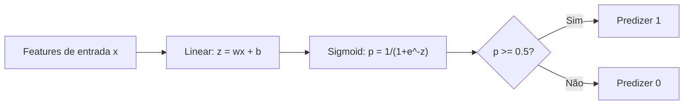
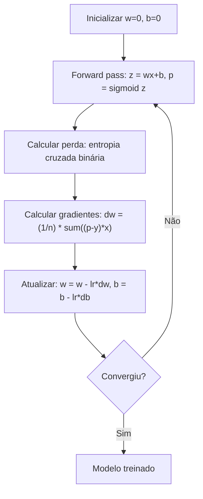

# Regressão Logística

> Regressão logística dobra uma reta numa curva em S pra responder perguntas de sim ou não com probabilidades.

**Tipo:** Build
**Linguagens:** Python
**Pré-requisitos:** Fase 2 Aulas 1-2 (O Que É ML, Regressão Linear)
**Tempo:** ~90 minutos

## Objetivos de Aprendizado

- Implementar regressão logística do zero usando a função sigmoid e entropia cruzada binária
- Calcular e interpretar precisão, recall, F1 score e matriz de confusão para classificação binária
- Explicar por que MSE falha para classificação e por que entropia cruzada binária produz uma superfície de custo convexa
- Construir um modelo de regressão softmax para classificação multi-classe e avaliar tradeoffs de ajuste de limiar

## O Problema

Você quer prever se um tumor é maligno ou benigno dado seu tamanho. Tenta regressão linear. Ela produz números como 0.3 ou 1.7 ou -0.5. O que esses valores significam? 1.7 é "muito maligno"? -0.5 é "muito benigno"? Regressão linear produz números ilimitados. Classificação precisa de probabilidades delimitadas entre 0 e 1, e uma decisão clara: sim ou não.

Regressão logística resolve isso. Pega a mesma combinação linear (wx + b) e passa pela função sigmoid, que comprime qualquer número pro intervalo (0, 1). A saída é uma probabilidade. Você define um limiar (geralmente 0.5) e toma uma decisão.

Este é um dos algoritmos mais usados na prática. Apesar do nome, regressão logística é um algoritmo de classificação, não de regressão. O nome vem da função logística (sigmoid) que usa.

## O Conceito

### Por que Regressão Linear Falha para Classificação

Imagine prever passar/reprovar (1/0) baseado em horas de estudo. Regressão linear ajusta uma reta através dos dados:

```
horas:  1   2   3   4   5   6   7   8   9   10
real:   0   0   0   0   1   1   1   1   1   1
```

Um ajuste linear pode produzir previsões como -0.2 na hora 1 e 1.3 na hora 10. Esses valores não são probabilidades. Eles vão abaixo de 0 e acima de 1. Pior, um único outlier (alguém que estudou 50 horas) arrastaria a reta inteira, mudando previsões para todos.

Classificação precisa de uma função que:
- Produza valores entre 0 e 1 (probabilidades)
- Crie uma transição nítida (uma fronteira de decisão)
- Não seja distorcida por outliers longe da fronteira

### A Função Sigmoid

A função sigmoid faz exatamente isso:

```
sigmoid(z) = 1 / (1 + e^(-z))
```

Propriedades:
- Quando z é grande e positivo, sigmoid(z) se aproxima de 1
- Quando z é grande e negativo, sigmoid(z) se aproxima de 0
- Quando z = 0, sigmoid(z) = 0.5
- A saída é sempre entre 0 e 1
- A função é suave e diferenciável em todo lugar

A derivada tem uma forma conveniente: sigmoid'(z) = sigmoid(z) * (1 - sigmoid(z)). Isso torna o cálculo do gradiente eficiente.

### Regressão Logística = Modelo Linear + Sigmoid

O modelo computa z = wx + b (igual à regressão linear), depois aplica sigmoid:



A saída p é interpretada como P(y=1 | x), a probabilidade de que a entrada pertence à classe 1. A fronteira de decisão é onde wx + b = 0, que faz a saída sigmoid ser exatamente 0.5.

### Perda de Entropia Cruzada Binária

Você não pode usar MSE para regressão logística. MSE com sigmoid cria uma superfície de custo não-convexa com muitos mínimos locais. Em vez disso, use entropia cruzada binária (log loss):

```
Perda = -(1/n) * sum(y * log(p) + (1-y) * log(1-p))
```

Por que funciona:
- Quando y=1 e p está perto de 1: log(1) = 0, então a perda é próxima de 0 (correto, custo baixo)
- Quando y=1 e p está perto de 0: log(0) tende a menos infinito, então a perda é enorme (errado, custo alto)
- Quando y=0 e p está perto de 0: log(1) = 0, então a perda é próxima de 0 (correto, custo baixo)
- Quando y=0 e p está perto de 1: log(0) tende a menos infinito, então a perda é enorme (errado, custo alto)

Esta função de perda é convexa para regressão logística, garantindo um único mínimo global.

### Descida do Gradiente para Regressão Logística

Os gradientes para entropia cruzada binária com sigmoid têm uma forma limpa:

```
dL/dw = (1/n) * sum((p - y) * x)
dL/db = (1/n) * sum(p - y)
```

Eles parecem idênticos aos gradientes da regressão linear. A diferença é que p = sigmoid(wx + b) em vez de p = wx + b. O sigmoid introduz a não-linearidade, mas a regra de atualização do gradiente permanece a mesma.



### A Fronteira de Decisão

Para uma entrada 2D (duas features), a fronteira de decisão é a reta onde:

```
w1*x1 + w2*x2 + b = 0
```

Pontos de um lado são classificados como 1, pontos do outro lado como 0. Regressão logística sempre produz uma fronteira de decisão linear. Se você precisa de uma fronteira curva, adicione features polinomiais ou use um modelo não-linear.

### Classificação Multi-Classe com Softmax

Regressão logística binária lida com duas classes. Para k classes, use a função softmax:

```
softmax(z_i) = e^(z_i) / sum(e^(z_j) para todo j)
```

Cada classe tem seu próprio vetor de pesos. O modelo computa um score z_i para cada classe, depois softmax converte scores em probabilidades que somam 1. A classe prevista é aquela com a maior probabilidade.

A função de perda torna-se entropia cruzada categórica:

```
Perda = -(1/n) * sum(sum(y_k * log(p_k)))
```

onde y_k é 1 para a classe verdadeira e 0 para todas as outras (one-hot encoding).

### Métricas de Avaliação

Acurácia sozinha não é suficiente. Para um dataset com 95% negativo e 5% positivo, um modelo que sempre prevê negativo obtém 95% de acurácia mas é inútil.

**Matriz de Confusão:**

| | Previsto Positivo | Previsto Negativo |
|---|---|---|
| Real Positivo | Verdadeiro Positivo (VP) | Falso Negativo (FN) |
| Real Negativo | Falso Positivo (FP) | Verdadeiro Negativo (VN) |

**Precisão**: De todas as coisas previstas como positivas, quantas realmente são positivas?
```
Precisão = VP / (VP + FP)
```

**Recall (Sensibilidade)**: De todas as coisas realmente positivas, quantas pegamos?
```
Recall = VP / (VP + FN)
```

**F1 Score**: Média harmônica de precisão e recall. Equilibra ambas métricas.
```
F1 = 2 * (Precisão * Recall) / (Precisão + Recall)
```

Quando priorizar:
- **Precisão**: quando falsos positivos são custosos (filtro de spam, você não quer bloquear email legítimo)
- **Recall**: quando falsos negativos são custosos (triagem de câncer, você não quer perder um tumor)
- **F1**: quando você precisa de uma única métrica equilibrada

## Construa

### Passo 1: Função sigmoid e geração de dados

```python
import random
import math

def sigmoid(z):
    z = max(-500, min(500, z))
    return 1.0 / (1.0 + math.exp(-z))


random.seed(42)
N = 200
X = []
y = []

for _ in range(N // 2):
    X.append([random.gauss(2, 1), random.gauss(2, 1)])
    y.append(0)

for _ in range(N // 2):
    X.append([random.gauss(5, 1), random.gauss(5, 1)])
    y.append(1)

combined = list(zip(X, y))
random.shuffle(combined)
X, y = zip(*combined)
X = list(X)
y = list(y)

print(f"Gerados {N} amostras (2 classes, 2 features)")
print(f"Classe 0 centro: (2, 2), Classe 1 centro: (5, 5)")
print(f"Primeiras 5 amostras:")
for i in range(5):
    print(f"  Features: [{X[i][0]:.2f}, {X[i][1]:.2f}], Rótulo: {y[i]}")
```

### Passo 2: Regressão logística do zero

```python
class LogisticRegression:
    def __init__(self, n_features, learning_rate=0.01):
        self.weights = [0.0] * n_features
        self.bias = 0.0
        self.lr = learning_rate
        self.loss_history = []

    def predict_proba(self, x):
        z = sum(w * xi for w, xi in zip(self.weights, x)) + self.bias
        return sigmoid(z)

    def predict(self, x, threshold=0.5):
        return 1 if self.predict_proba(x) >= threshold else 0

    def compute_loss(self, X, y):
        n = len(y)
        total = 0.0
        for i in range(n):
            p = self.predict_proba(X[i])
            p = max(1e-15, min(1 - 1e-15, p))
            total += y[i] * math.log(p) + (1 - y[i]) * math.log(1 - p)
        return -total / n

    def fit(self, X, y, epochs=1000, print_every=200):
        n = len(y)
        n_features = len(X[0])
        for epoch in range(epochs):
            dw = [0.0] * n_features
            db = 0.0
            for i in range(n):
                p = self.predict_proba(X[i])
                error = p - y[i]
                for j in range(n_features):
                    dw[j] += error * X[i][j]
                db += error
            for j in range(n_features):
                self.weights[j] -= self.lr * (dw[j] / n)
            self.bias -= self.lr * (db / n)
            loss = self.compute_loss(X, y)
            self.loss_history.append(loss)
            if epoch % print_every == 0:
                print(f"  Epoch {epoch:4d} | Perda: {loss:.4f} | w: [{self.weights[0]:.3f}, {self.weights[1]:.3f}] | b: {self.bias:.3f}")
        return self

    def accuracy(self, X, y):
        correct = sum(1 for i in range(len(y)) if self.predict(X[i]) == y[i])
        return correct / len(y)


split = int(0.8 * N)
X_train, X_test = X[:split], X[split:]
y_train, y_test = y[:split], y[split:]

print("\n=== Treinando Regressão Logística ===")
model = LogisticRegression(n_features=2, learning_rate=0.1)
model.fit(X_train, y_train, epochs=1000, print_every=200)

print(f"\nAcurácia treino: {model.accuracy(X_train, y_train):.4f}")
print(f"Acurácia teste:  {model.accuracy(X_test, y_test):.4f}")
print(f"Pesos: [{model.weights[0]:.4f}, {model.weights[1]:.4f}]")
print(f"Viés: {model.bias:.4f}")
```

### Passo 3: Matriz de confusão e métricas do zero

```python
class ClassificationMetrics:
    def __init__(self, y_true, y_pred):
        self.tp = sum(1 for t, p in zip(y_true, y_pred) if t == 1 and p == 1)
        self.tn = sum(1 for t, p in zip(y_true, y_pred) if t == 0 and p == 0)
        self.fp = sum(1 for t, p in zip(y_true, y_pred) if t == 0 and p == 1)
        self.fn = sum(1 for t, p in zip(y_true, y_pred) if t == 1 and p == 0)

    def accuracy(self):
        total = self.tp + self.tn + self.fp + self.fn
        return (self.tp + self.tn) / total if total > 0 else 0

    def precision(self):
        denom = self.tp + self.fp
        return self.tp / denom if denom > 0 else 0

    def recall(self):
        denom = self.tp + self.fn
        return self.tp / denom if denom > 0 else 0

    def f1(self):
        p = self.precision()
        r = self.recall()
        return 2 * p * r / (p + r) if (p + r) > 0 else 0

    def print_confusion_matrix(self):
        print(f"\n  Matriz de Confusão:")
        print(f"                  Previsto")
        print(f"                  Pos   Neg")
        print(f"  Real Pos        {self.tp:4d}  {self.fn:4d}")
        print(f"  Real Neg        {self.fp:4d}  {self.tn:4d}")

    def print_report(self):
        self.print_confusion_matrix()
        print(f"\n  Acurácia:  {self.accuracy():.4f}")
        print(f"  Precisão: {self.precision():.4f}")
        print(f"  Recall:    {self.recall():.4f}")
        print(f"  F1 Score:  {self.f1():.4f}")


y_pred_test = [model.predict(x) for x in X_test]
print("\n=== Relatório de Classificação (Teste) ===")
metrics = ClassificationMetrics(y_test, y_pred_test)
metrics.print_report()
```

### Passo 4: Análise da fronteira de decisão

```python
print("\n=== Fronteira de Decisão ===")
w1, w2 = model.weights
b = model.bias
print(f"Fronteira de decisão: {w1:.4f}*x1 + {w2:.4f}*x2 + {b:.4f} = 0")
if abs(w2) > 1e-10:
    print(f"Resolvido para x2:     x2 = {-w1/w2:.4f}*x1 + {-b/w2:.4f}")

print("\nPrevisões de exemplo perto da fronteira:")
test_points = [
    [3.0, 3.0],
    [3.5, 3.5],
    [4.0, 4.0],
    [2.5, 2.5],
    [5.0, 5.0],
]
for point in test_points:
    prob = model.predict_proba(point)
    pred = model.predict(point)
    print(f"  [{point[0]}, {point[1]}] -> prob={prob:.4f}, classe={pred}")
```

### Passo 5: Multi-classe com softmax

```python
class SoftmaxRegression:
    def __init__(self, n_features, n_classes, learning_rate=0.01):
        self.n_features = n_features
        self.n_classes = n_classes
        self.lr = learning_rate
        self.weights = [[0.0] * n_features for _ in range(n_classes)]
        self.biases = [0.0] * n_classes

    def softmax(self, scores):
        max_score = max(scores)
        exp_scores = [math.exp(s - max_score) for s in scores]
        total = sum(exp_scores)
        return [e / total for e in exp_scores]

    def predict_proba(self, x):
        scores = [
            sum(self.weights[k][j] * x[j] for j in range(self.n_features)) + self.biases[k]
            for k in range(self.n_classes)
        ]
        return self.softmax(scores)

    def predict(self, x):
        probs = self.predict_proba(x)
        return probs.index(max(probs))

    def fit(self, X, y, epochs=1000, print_every=200):
        n = len(y)
        for epoch in range(epochs):
            grad_w = [[0.0] * self.n_features for _ in range(self.n_classes)]
            grad_b = [0.0] * self.n_classes
            total_loss = 0.0
            for i in range(n):
                probs = self.predict_proba(X[i])
                for k in range(self.n_classes):
                    target = 1.0 if y[i] == k else 0.0
                    error = probs[k] - target
                    for j in range(self.n_features):
                        grad_w[k][j] += error * X[i][j]
                    grad_b[k] += error
                true_prob = max(probs[y[i]], 1e-15)
                total_loss -= math.log(true_prob)
            for k in range(self.n_classes):
                for j in range(self.n_features):
                    self.weights[k][j] -= self.lr * (grad_w[k][j] / n)
                self.biases[k] -= self.lr * (grad_b[k] / n)
            if epoch % print_every == 0:
                print(f"  Epoch {epoch:4d} | Perda: {total_loss / n:.4f}")
        return self

    def accuracy(self, X, y):
        correct = sum(1 for i in range(len(y)) if self.predict(X[i]) == y[i])
        return correct / len(y)


random.seed(42)
X_3class = []
y_3class = []

centers = [(1, 1), (5, 1), (3, 5)]
for label, (cx, cy) in enumerate(centers):
    for _ in range(50):
        X_3class.append([random.gauss(cx, 0.8), random.gauss(cy, 0.8)])
        y_3class.append(label)

combined = list(zip(X_3class, y_3class))
random.shuffle(combined)
X_3class, y_3class = zip(*combined)
X_3class = list(X_3class)
y_3class = list(y_3class)

split_3 = int(0.8 * len(X_3class))
X_train_3 = X_3class[:split_3]
y_train_3 = y_3class[:split_3]
X_test_3 = X_3class[split_3:]
y_test_3 = y_3class[split_3:]

print("\n=== Regressão Softmax Multi-classe (3 classes) ===")
softmax_model = SoftmaxRegression(n_features=2, n_classes=3, learning_rate=0.1)
softmax_model.fit(X_train_3, y_train_3, epochs=1000, print_every=200)
print(f"\nAcurácia treino: {softmax_model.accuracy(X_train_3, y_train_3):.4f}")
print(f"Acurácia teste:  {softmax_model.accuracy(X_test_3, y_test_3):.4f}")

print("\nPrevisões de exemplo:")
for i in range(5):
    probs = softmax_model.predict_proba(X_test_3[i])
    pred = softmax_model.predict(X_test_3[i])
    print(f"  Real: {y_test_3[i]}, Previsto: {pred}, Probs: [{', '.join(f'{p:.3f}' for p in probs)}]")
```

### Passo 6: Ajuste de limiar

```python
print("\n=== Ajuste de Limiar ===")
print("Limiar padrão: 0.5. Ajustar o limiar troca precisão por recall.\n")

thresholds = [0.3, 0.4, 0.5, 0.6, 0.7]
print(f"{'Limiar':>10} {'Acurácia':>10} {'Precisão':>10} {'Recall':>10} {'F1':>10}")
print("-" * 52)

for t in thresholds:
    y_pred_t = [1 if model.predict_proba(x) >= t else 0 for x in X_test]
    m = ClassificationMetrics(y_test, y_pred_t)
    print(f"{t:>10.1f} {m.accuracy():>10.4f} {m.precision():>10.4f} {m.recall():>10.4f} {m.f1():>10.4f}")
```

## Use

Agora a mesma coisa com scikit-learn.

```python
from sklearn.linear_model import LogisticRegression as SklearnLR
from sklearn.metrics import accuracy_score, precision_score, recall_score, f1_score
from sklearn.metrics import confusion_matrix, classification_report
from sklearn.model_selection import train_test_split
from sklearn.preprocessing import StandardScaler
import numpy as np

np.random.seed(42)
X_0 = np.random.randn(100, 2) + [2, 2]
X_1 = np.random.randn(100, 2) + [5, 5]
X_sk = np.vstack([X_0, X_1])
y_sk = np.array([0] * 100 + [1] * 100)

X_tr, X_te, y_tr, y_te = train_test_split(X_sk, y_sk, test_size=0.2, random_state=42)

scaler = StandardScaler()
X_tr_sc = scaler.fit_transform(X_tr)
X_te_sc = scaler.transform(X_te)

lr = SklearnLR()
lr.fit(X_tr_sc, y_tr)
y_pred = lr.predict(X_te_sc)

print("=== Regressão Logística Scikit-learn ===")
print(f"Acurácia:  {accuracy_score(y_te, y_pred):.4f}")
print(f"Precisão: {precision_score(y_te, y_pred):.4f}")
print(f"Recall:    {recall_score(y_te, y_pred):.4f}")
print(f"F1:        {f1_score(y_te, y_pred):.4f}")
print(f"\nMatriz de Confusão:\n{confusion_matrix(y_te, y_pred)}")
print(f"\nRelatório de Classificação:\n{classification_report(y_te, y_pred)}")
```

Sua implementação do zero produz a mesma fronteira de decisão e métricas. Scikit-learn adiciona opções de solver (liblinear, lbfgs, saga), regularização automática, estratégias multi-classe (one-vs-rest, multinomial) e otimizações de estabilidade numérica.

## Entregue

Esta lição produz:
- `code/logistic_regression.py` - regressão logística do zero com métricas

## Exercícios

1. Gere um dataset que NÃO é linearmente separável (por exemplo, dois círculos concêntricos). Treine regressão logística e observe sua falha. Depois adicione features polinomiais (x1^2, x2^2, x1*x2) e treine novamente. Mostre que a acurácia melhora.

2. Implemente uma matriz de confusão multi-classe para o modelo softmax de 3 classes. Compute precisão e recall por classe. Qual classe é mais difícil de classificar?

3. Construa uma curva ROC do zero. Para 100 valores de limiar de 0 a 1, compute a taxa de verdadeiro positivo e taxa de falso positivo. Calcule a AUC (área sob a curva) usando a regra trapezoidal.

## Termos-Chave

| Termo | O que as pessoas dizem | O que realmente significa |
|-------|----------------------|--------------------------|
| Regressão logística | "Regressão para classificação" | Um modelo linear seguido por uma função sigmoid que produz probabilidades de classe |
| Função sigmoid | "A curva em S" | A função 1/(1+e^(-z)) que mapeia qualquer número real ao intervalo (0, 1) |
| Entropia cruzada binária | "Log loss" | A função de perda -[y*log(p) + (1-y)*log(1-p)] que penaliza previsões erradas confiantes severamente |
| Fronteira de decisão | "A linha divisória" | A superfície onde a probabilidade de saída do modelo é 0.5, separando as classes previstas |
| Softmax | "Sigmoid multi-classe" | Uma função que converte um vetor de scores em probabilidades que somam 1 |
| Precisão | "Quantos selecionados são relevantes" | VP / (VP + FP), a fração de previsões positivas que são realmente positivas |
| Recall | "Quantos relevantes são selecionados" | VP / (VP + FN), a fração de positivos reais que o modelo identifica corretamente |
| F1 score | "Acurácia equilibrada" | A média harmônica de precisão e recall: 2*P*R / (P+R) |
| Matriz de confusão | "A divisão de erros" | Uma tabela mostrando contagens de VP, VN, FP, FN para cada par de classe |
| Limiar | "O ponto de corte" | O valor de probabilidade acima do qual o modelo prevê classe 1 (padrão 0.5, ajustável) |
| One-hot encoding | "Colunas binárias para categorias" | Representar classe k como um vetor de zeros com um 1 na posição k |
| Entropia cruzada categórica | "Log loss multi-classe" | A extensão da entropia cruzada binária para k classes usando rótulos one-hot |

## Leitura Adicional

- [Scikit-learn LogisticRegression documentation](https://scikit-learn.org/stable/modules/linear_model.html#logistic-regression) - guia prático com opções de solver e regularização
- [Stanford CS229: Logistic Regression](https://cs229.stanford.edu/notes2021/main_notes.pdf) - notas do curso de Andrew Ng derivando regressão logística do zero
- [An Introduction to Statistical Learning (ISLR)](https://www.statlearning.com/) - capítulo 4 cobre classificação com regressão logística
