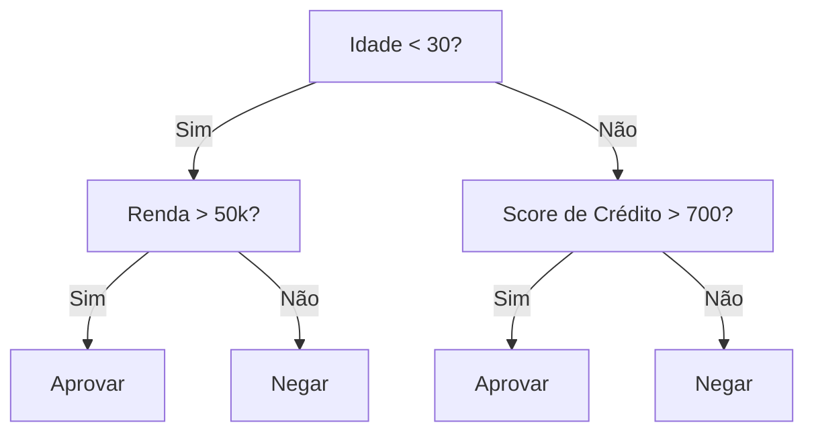
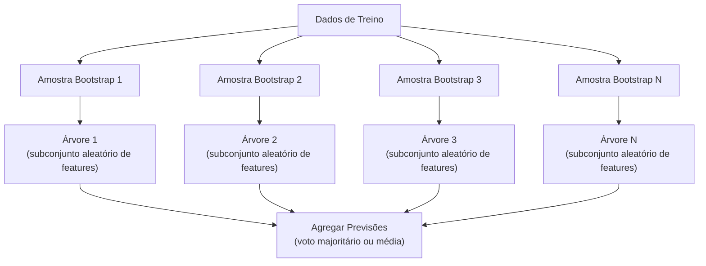

# Árvores de Decisão e Random Forests

> Uma árvore de decisão é só um fluxograma. Mas uma floresta delas é uma das ferramentas mais poderosas do ML.

**Tipo:** Build
**Linguagens:** Python
**Pré-requisitos:** Fase 1 (Aulas 09 Teoria da Informação, 06 Probabilidade)
**Tempo:** ~90 minutos

## Objetivos de Aprendizado

- Implementar cálculos de impureza de Gini, entropia e ganho de informação para encontrar divisões ótimas de árvore de decisão
- Construir um classificador de árvore de decisão do zero com controles de poda prévia (profundidade máxima, mínimo de amostras)
- Construir uma random forest usando amostragem bootstrap e randomização de features, e explicar por que isso reduz variância
- Comparar importância de features MDI com importância por permutação e identificar quando MDI é enviesado

## O Problema

Você tem dados tabulares. Linhas são amostras, colunas são features, e existe uma coluna alvo que você quer prever. Poderia jogar uma rede neural nisso. Mas para dados tabulares, modelos baseados em árvore (árvores de decisão, random forests, gradient boosted trees) consistentemente superam deep learning. Competições Kaggle em dados estruturados são dominadas por XGBoost e LightGBM, não transformers.

Por quê? Árvores lidam com tipos mistos de features (numéricos e categóricos) sem pré-processamento. Lidam com relações não-lineares sem engenharia de features. São interpretáveis: você olha a árvore e vê exatamente por que uma previsão foi feita. E random forests, que calculam a média de muitas árvores, são altamente resistentes a overfitting em datasets de tamanho moderado.

Esta lição constrói árvores de decisão do zero usando divisão recursiva, depois constrói uma random forest por cima. Você implementará a matemática por trás dos critérios de divisão (impureza de Gini, entropia, ganho de informação) e entenderá por que um ensemble de aprendizes fracos se torna um forte.

## O Conceito

### O Que Uma Árvore de Decisão Faz

Uma árvore de decisão particiona o espaço de features em regiões retangulares fazendo uma sequência de perguntas sim/não.



Cada nó interno testa uma feature contra um limiar. Cada nó folha faz uma previsão. Para classificar um novo ponto de dados, você começa na raiz e segue os ramos até alcançar uma folha.

A árvore é construída de cima para baixo escolhendo, em cada nó, a feature e o limiar que melhor separam os dados. "Melhor" é definido por um critério de divisão.

### Critérios de Divisão: Medindo Impureza

Em cada nó, temos um conjunto de amostras. Queremos dividi-las para que os nós filhos resultantes sejam tão "puros" quanto possível, significando que cada filho contém principalmente uma classe.

**Impureza de Gini** mede a probabilidade de que uma amostra escolhida aleatoriamente seria classificada incorretamente se fosse rotulada de acordo com a distribuição de classe naquele nó.

```
Gini(S) = 1 - sum(p_k^2)

onde p_k é a proporção da classe k no conjunto S.
```

Para um nó puro (toda uma classe), Gini = 0. Para uma divisão binária com classes 50/50, Gini = 0.5. Menor é melhor.

```
Exemplo: 6 gatos, 4 cachorros

Gini = 1 - (0.6^2 + 0.4^2) = 1 - (0.36 + 0.16) = 0.48
```

**Entropia** mede o conteúdo de informação (desordem) em um nó. Visto na Lição 09 da Fase 1.

```
Entropia(S) = -sum(p_k * log2(p_k))
```

Para um nó puro, entropia = 0. Para uma divisão binária 50/50, entropia = 1.0. Menor é melhor.

```
Exemplo: 6 gatos, 4 cachorros

Entropia = -(0.6 * log2(0.6) + 0.4 * log2(0.4))
        = -(0.6 * -0.737 + 0.4 * -1.322)
        = 0.442 + 0.529
        = 0.971 bits
```

**Ganho de informação** é a redução na impureza (entropia ou Gini) após uma divisão.

```
IG(S, feature, limiar) = Impureza(S) - media_ponderada(Impureza(S_esquerda), Impureza(S_direita))

onde os pesos são as proporções de amostras em cada filho.
```

O algoritmo guloso em cada nó: tente toda feature e todo limiar possível. Escolha o par (feature, limiar) que maximiza o ganho de informação.

### Como a Divisão Funciona

Para um dataset com n features e m amostras no nó atual:

1. Para cada feature j (j = 1 a n):
   - Ordene as amostras pela feature j
   - Tente cada ponto médio entre valores distintos consecutivos como limiar
   - Compute o ganho de informação para cada limiar
2. Selecione a feature e o limiar com o maior ganho de informação
3. Divida os dados em esquerda (feature <= limiar) e direita (feature > limiar)
4. Recorra em cada filho

Esta abordagem gulosa não garante a árvore globalmente ótima. Encontrar a árvore ótima é NP-difícil. Mas a divisão gulosa funciona bem na prática.

### Condições de Parada

Sem condições de parada, a árvore cresce até que toda folha seja pura (uma amostra por folha). Isso memoriza perfeitamente os dados de treino e generaliza terrivelmente.

**Poda prévia** para a árvore antes que ela cresça completamente:
- Profundidade máxima: pare de dividir quando a árvore atinge uma profundidade definida
- Mínimo de amostras por folha: pare se um nó tem menos de k amostras
- Ganho de informação mínimo: pare se a melhor divisão melhora a impureza em menos que um limiar
- Máximo de nós folha: limite o número total de folhas

**Poda posterior** cresce a árvore completa, depois a poda:
- Poda por complexidade-custo (usada pelo scikit-learn): adiciona uma penalidade proporcional ao número de folhas. Aumente a penalidade para obter árvores menores
- Poda por erro reduzido: remova uma subárvore se o erro de validação não aumentar

Poda prévia é mais simples e rápida. Poda posterior geralmente produz árvores melhores porque não para prematuramente divisões que poderiam levar a divisões úteis adicionais.

### Árvores de Decisão para Regressão

Para regressão, a previsão da folha é a média dos valores alvo naquela folha. O critério de divisão também muda:

**Redução de variância** substitui o ganho de informação:

```
VR(S, feature, limiar) = Var(S) - media_ponderada(Var(S_esquerda), Var(S_direita))
```

Escolha a divisão que reduz a variância mais. A árvore particiona o espaço de entrada em regiões, e prevê uma constante (a média) em cada região.

### Random Forests: O Poder dos Ensembles

Uma única árvore de decisão tem alta variância. Pequenas mudanças nos dados podem produzir árvores completamente diferentes. Random forests corrigem isso calculando a média de muitas árvores.



Duas fontes de aleatoriedade tornam as árvores diversas:

**Bagging (agregação bootstrap):** Cada árvore é treinada em uma amostra bootstrap, uma amostra aleatória com reposição dos dados de treino. Cerca de 63% das amostras originais aparecem em cada bootstrap (o restante são amostras out-of-bag que podem ser usadas para validação).

**Randomização de features:** A cada divisão, apenas um subconjunto aleatório de features é considerado. Para classificação, o padrão é sqrt(n_features). Para regressão, n_features/3. Isso evita que todas as árvores dividam na mesma feature dominante.

A ideia chave: calcular a média de muitas árvores descorrelacionadas reduz a variância sem aumentar o viés. Cada árvore individual pode ser medíocre. O ensemble é forte.

### Importância de Features

Random forests naturalmente fornecem pontuações de importância de features. O método mais comum:

**Mean Decrease in Impurity (MDI):** Para cada feature, some a redução total na impureza em todas as árvores e todos os nós onde aquela feature é usada. Features que produzem maiores reduções de impureza em divisões mais iniciais são mais importantes.

```
importancia(feature_j) = soma sobre todos os nós onde feature_j é usada:
    (n_amostras_no_no / n_total_amostras) * reducao_impureza
```

Isto é rápido (computado durante o treino) mas enviesado para features de alta cardinalidade e features com muitos pontos de divisão possíveis.

**Importância por permutação** é a alternativa: embaralhe os valores de uma feature e meça o quanto a acurácia do modelo cai. Mais confiável mas mais lenta.

### Quando Árvores Superam Redes Neurais

Árvores e florestas dominam redes neurais em dados tabulares. Várias razões:

| Fator | Árvores | Redes Neurais |
|-------|---------|---------------|
| Tipos mistos (numérico + categórico) | Suporte nativo | Precisa de encoding |
| Datasets pequenos (< 10k linhas) | Funcionam bem | Overfitam |
| Interações de features | Encontradas por divisão | Precisam de design de arquitetura |
| Interpretabilidade | Transparência total | Caixa preta |
| Tempo de treino | Minutos | Horas |
| Sensibilidade a hiperparâmetros | Baixa | Alta |

Redes neurais vencem quando os dados têm estrutura espacial ou sequencial (imagens, texto, áudio). Para tabelas planas de features, árvores são o padrão.

## Construa

### Passo 1: Impureza de Gini e entropia

Construa ambos os critérios de divisão do zero e verifique que eles concordam sobre quais divisões são boas.

```python
import math

def gini_impurity(labels):
    n = len(labels)
    if n == 0:
        return 0.0
    counts = {}
    for label in labels:
        counts[label] = counts.get(label, 0) + 1
    return 1.0 - sum((c / n) ** 2 for c in counts.values())

def entropy(labels):
    n = len(labels)
    if n == 0:
        return 0.0
    counts = {}
    for label in labels:
        counts[label] = counts.get(label, 0) + 1
    return -sum(
        (c / n) * math.log2(c / n) for c in counts.values() if c > 0
    )
```

### Passo 2: Encontre a melhor divisão

Tente toda feature e todo limiar. Retorne aquele com o maior ganho de informação.

```python
def information_gain(parent_labels, left_labels, right_labels, criterion="gini"):
    measure = gini_impurity if criterion == "gini" else entropy
    n = len(parent_labels)
    n_left = len(left_labels)
    n_right = len(right_labels)
    if n_left == 0 or n_right == 0:
        return 0.0
    parent_impurity = measure(parent_labels)
    child_impurity = (
        (n_left / n) * measure(left_labels) +
        (n_right / n) * measure(right_labels)
    )
    return parent_impurity - child_impurity
```

### Passo 3: Construa a classe DecisionTree

Divisão recursiva, previsão e rastreamento de importância de features.

```python
class DecisionTree:
    def __init__(self, max_depth=None, min_samples_split=2,
                 min_samples_leaf=1, criterion="gini",
                 max_features=None):
        self.max_depth = max_depth
        self.min_samples_split = min_samples_split
        self.min_samples_leaf = min_samples_leaf
        self.criterion = criterion
        self.max_features = max_features
        self.tree = None
        self.feature_importances_ = None

    def fit(self, X, y):
        self.n_features = len(X[0])
        self.feature_importances_ = [0.0] * self.n_features
        self.n_samples = len(X)
        self.tree = self._build(X, y, depth=0)
        total = sum(self.feature_importances_)
        if total > 0:
            self.feature_importances_ = [
                fi / total for fi in self.feature_importances_
            ]

    def predict(self, X):
        return [self._predict_one(x, self.tree) for x in X]
```

### Passo 4: Construa a classe RandomForest

Amostragem bootstrap, randomização de features e votação majoritária.

```python
class RandomForest:
    def __init__(self, n_trees=100, max_depth=None,
                 min_samples_split=2, max_features="sqrt",
                 criterion="gini"):
        self.n_trees = n_trees
        self.max_depth = max_depth
        self.min_samples_split = min_samples_split
        self.max_features = max_features
        self.criterion = criterion
        self.trees = []

    def fit(self, X, y):
        n = len(X)
        for _ in range(self.n_trees):
            indices = [random.randint(0, n - 1) for _ in range(n)]
            X_boot = [X[i] for i in indices]
            y_boot = [y[i] for i in indices]
            tree = DecisionTree(
                max_depth=self.max_depth,
                min_samples_split=self.min_samples_split,
                max_features=self.max_features,
                criterion=self.criterion,
            )
            tree.fit(X_boot, y_boot)
            self.trees.append(tree)

    def predict(self, X):
        all_preds = [tree.predict(X) for tree in self.trees]
        predictions = []
        for i in range(len(X)):
            votes = {}
            for preds in all_preds:
                v = preds[i]
                votes[v] = votes.get(v, 0) + 1
            predictions.append(max(votes, key=votes.get))
        return predictions
```

Veja `code/trees.py` para a implementação completa com todos os métodos auxiliares.

## Use

Com scikit-learn, treinar uma random forest são três linhas:

```python
from sklearn.ensemble import RandomForestClassifier
from sklearn.datasets import load_iris
from sklearn.model_selection import train_test_split

X, y = load_iris(return_X_y=True)
X_train, X_test, y_train, y_test = train_test_split(X, y, random_state=42)

rf = RandomForestClassifier(n_estimators=100, random_state=42)
rf.fit(X_train, y_train)
print(f"Acurácia: {rf.score(X_test, y_test):.4f}")
print(f"Importâncias de features: {rf.feature_importances_}")
```

Na prática, gradient boosted trees (XGBoost, LightGBM, CatBoost) são frequentemente mais fortes que random forests porque constroem árvores sequencialmente, com cada árvore corrigindo os erros das anteriores. Mas random forests são mais difíceis de configurar errado e requerem quase nenhum ajuste de hiperparâmetros.

## Entregue

Esta lição produz `outputs/prompt-tree-interpreter.md` -- um prompt que interpreta divisões de árvore de decisão para stakeholders de negócios. Alimente-o com a estrutura de uma árvore treinada (profundidade, features, limiares de divisão, acurácia) e ele traduz o modelo em regras em linguagem simples, classifica importância de features, sinaliza overfitting ou vazamento e recomenda próximos passos. Use-o sempre que precisar explicar um modelo baseado em árvore para alguém que não lê código.

## Exercícios

1. Treine uma única árvore de decisão em um dataset 2D com 3 classes. Trace manualmente as divisões e desenhe as fronteiras de decisão retangulares. Compare as fronteiras em max_depth=2 vs max_depth=10.

2. Implemente divisão por redução de variância para árvores de regressão. Gere y = sin(x) + ruído para 200 pontos e ajuste sua árvore de regressão. Plote as previsões constantes por partes da árvore contra a curva verdadeira.

3. Construa uma random forest com 1, 5, 10, 50 e 200 árvores. Plote acurácia de treino e teste vs número de árvores. Observe que a acurácia de teste estabiliza mas não diminui (florestas resistem a overfitting).

4. Compare impureza de Gini vs entropia como critérios de divisão em 5 datasets diferentes. Meça acurácia e profundidade da árvore. Na maioria dos casos, produzem resultados quase idênticos. Explique por quê.

5. Implemente importância por permutação. Compare com importância MDI em um dataset onde uma feature é ruído aleatório mas tem alta cardinalidade. MDI classificará a feature de ruído altamente. Importância por permutação não.

## Termos-Chave

| Termo | O que as pessoas dizem | O que realmente significa |
|-------|----------------------|--------------------------|
| Árvore de decisão | "Um fluxograma para previsões" | Um modelo que particiona o espaço de features em regiões retangulares aprendendo uma sequência de divisões if/else |
| Impureza de Gini | "Quão misturado está o nó" | Probabilidade de classificar incorretamente uma amostra aleatória em um nó. 0 = puro, 0.5 = impureza máxima para binário |
| Entropia | "A desordem em um nó" | Conteúdo de informação em um nó. 0 = puro, 1.0 = incerteza máxima para binário. Da teoria da informação |
| Ganho de informação | "Quão boa é uma divisão" | Redução na impureza após uma divisão. O critério guloso para escolher divisões |
| Poda prévia | "Parar a árvore cedo" | Parar o crescimento da árvore cedo definindo profundidade máxima, mínimos de amostras ou limiares de ganho mínimo |
| Poda posterior | "Podar a árvore depois" | Crescer a árvore completa, depois remover subárvores que não melhoram o desempenho de validação |
| Bagging | "Treinar em subconjuntos aleatórios" | Bootstrap aggregating. Treinar cada modelo em uma amostra aleatória diferente com reposição |
| Random forest | "Um monte de árvores" | Ensemble de árvores de decisão, cada uma treinada em uma amostra bootstrap com subconjuntos aleatórios de features a cada divisão |
| Importância de features (MDI) | "Quais features importam" | Diminuição total de impureza contribuída por cada feature, somada através de todas as árvores e nós |
| Importância por permutação | "Embaralhar e verificar" | Queda de acurácia quando os valores de uma feature são embaralhados aleatoriamente. Mais confiável que MDI para features ruidosas |
| Redução de variância | "A versão de regressão do ganho de informação" | O análogo de árvore de regressão do ganho de informação. Escolhe a divisão que reduz mais a variância alvo |
| Amostra bootstrap | "Amostra aleatória com repetições" | Uma amostra aleatória retirada com reposição do dataset original. Mesmo tamanho, mas com duplicatas |

## Leitura Adicional

- [Breiman: Random Forests (2001)](https://link.springer.com/article/10.1023/A:1010933404324) - o paper original de random forest
- [Grinsztajn et al.: Why do tree-based models still outperform deep learning on tabular data? (2022)](https://arxiv.org/abs/2207.08815) - comparação rigorosa de árvores vs redes neurais em tarefas tabulares
- [Documentação scikit-learn Decision Trees](https://scikit-learn.org/stable/modules/tree.html) - guia prático com ferramentas de visualização
- [XGBoost: A Scalable Tree Boosting System (Chen & Guestrin, 2016)](https://arxiv.org/abs/1603.02754) - o paper de gradient boosting que domina Kaggle
