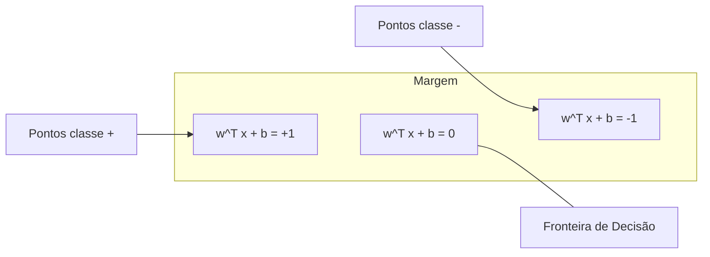
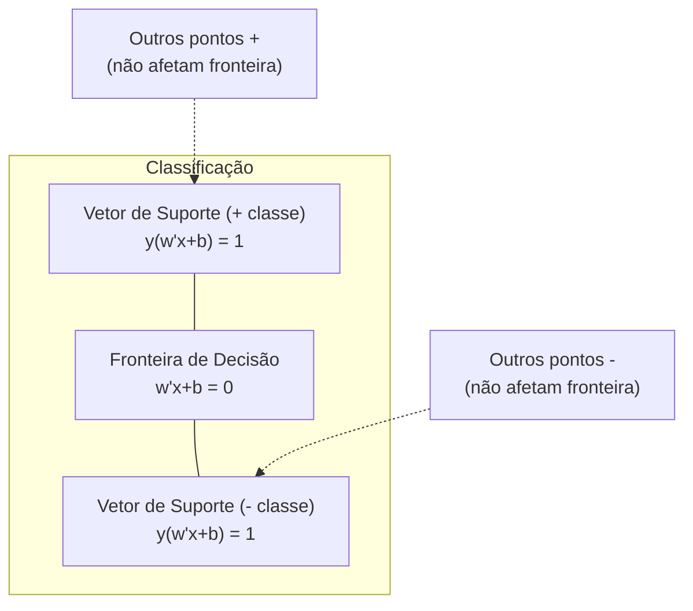
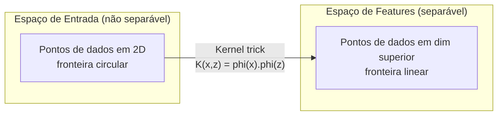

# Support Vector Machines

> Encontre a rua mais larga entre duas classes. Essa é a ideia inteira.

**Tipo:** Build
**Linguagens:** Python
**Pré-requisitos:** Fase 1 (Aulas 08 Otimização, 14 Normas e Distâncias, 18 Otimização Convexa)
**Tempo:** ~90 minutos

## Objetivos de Aprendizado

- Implementar um SVM linear do zero usando hinge loss e descida do gradiente na formulação primal
- Explicar o princípio de margem máxima e identificar vetores de suporte de um modelo treinado
- Comparar kernels lineares, polinomiais e RBF e explicar como o kernel trick evita mapeamento explícito de alta dimensionalidade
- Avaliar o tradeoff controlado pelo parâmetro C entre largura de margem e erros de classificação

## O Problema

Você tem duas classes de pontos de dados e precisa desenhar uma reta (ou hiperplano) separando-as. Infinitas retas funcionam. Qual você escolhe?

A que tem a maior margem. A margem é a distância entre a fronteira de decisão e os pontos de dados mais próximos em cada lado. Uma margem mais larga significa que o classificador é mais confiante e generaliza melhor para dados não vistos.

Esta intuição leva às Support Vector Machines, um dos algoritmos mais matematicamente elegantes em ML. SVMs foram o método de classificação dominante antes do deep learning e continuam sendo a melhor escolha para datasets pequenos, dados de alta dimensão e problemas onde você precisa de um modelo fundamentado, bem compreendido e com garantias teóricas.

SVMs conectam-se diretamente à Fase 1: a otimização é convexa (Lição 18), a margem é medida com normas (Lição 14), e o kernel trick explora produtos escalares para lidar com fronteiras não-lineares sem nunca computar no espaço de alta dimensão.

## O Conceito

### O Classificador de Margem Máxima

Dados linearmente separáveis com rótulos y_i em {-1, +1} e vetores de features x_i, queremos um hiperplano w^T x + b = 0 que separa as classes.

A distância de um ponto x_i ao hiperplano é:

```
distância = |w^T x_i + b| / ||w||
```

Para um ponto classificado corretamente: y_i * (w^T x_i + b) > 0. A margem é o dobro da distância do hiperplano ao ponto mais próximo em cada lado.



O problema de otimização:

```
maximizar    2 / ||w||     (a largura da margem)
sujeito a    y_i * (w^T x_i + b) >= 1  para todo i
```

Equivalentemente (minimizar ||w||^2 é mais fácil de otimizar):

```
minimizar    (1/2) ||w||^2
sujeito a    y_i * (w^T x_i + b) >= 1  para todo i
```

Este é um programa quadrático convexo. Tem uma solução global única. Os pontos de dados que ficam exatamente nos limites da margem (onde y_i * (w^T x_i + b) = 1) são os vetores de suporte. Eles são os únicos pontos que determinam a fronteira de decisão. Mova ou remova qualquer ponto não-vetor de suporte, e a fronteira não muda.

### Vetores de Suporte: os Poucos Críticos



A maioria dos pontos de treino é irrelevante. Apenas os vetores de suporte importam. É por isso que SVMs são eficientes em memória no momento da previsão: você só precisa armazenar os vetores de suporte, não o conjunto de treino inteiro.

O número de vetores de suporte também dá um limite no erro de generalização. Menos vetores de suporte relativos ao tamanho do dataset significa melhor generalização.

### Margem Suave: Lidando com Ruído com o Parâmetro C

Dados reais raramente são perfeitamente separáveis. Alguns pontos podem estar no lado errado da fronteira, ou dentro da margem. A formulação de margem suave permite violações introduzindo variáveis de folga.

```
minimizar    (1/2) ||w||^2 + C * sum(xi_i)
sujeito a    y_i * (w^T x_i + b) >= 1 - xi_i
            xi_i >= 0  para todo i
```

A variável de folga xi_i mede o quanto o ponto i viola a margem. C controla o trade-off:

| Valor de C | Comportamento |
|-----------|---------------|
| C grande | Penaliza violações pesadamente. Margem estreita, menos erros de classificação. Overfitting |
| C pequeno | Permite mais violações. Margem larga, mais erros de classificação. Subajuste |

C é a força de regularização, invertida. C grande = menos regularização. C pequeno = mais regularização.

### Hinge Loss: a Função de Perda do SVM

O SVM de margem suave pode ser reescrito como uma otimização sem restrição:

```
minimizar    (1/2) ||w||^2 + C * sum(max(0, 1 - y_i * (w^T x_i + b)))
```

O termo max(0, 1 - y_i * f(x_i)) é a hinge loss. É zero quando o ponto é classificado corretamente e está além da margem. É linear quando o ponto está dentro da margem ou classificado incorretamente.

```
Hinge loss para um único ponto:

perda
  |
  | \
  |  \
  |   \
  |    \
  |     \_______________
  |
  +-----|-----|-------->  y * f(x)
       0     1

Perda zero quando y*f(x) >= 1 (classificado corretamente, fora da margem).
Penalidade linear quando y*f(x) < 1.
```

Compare com a perda logística (regressão logística):

```
Hinge:     max(0, 1 - y*f(x))          Corte rígido na margem
Logística: log(1 + exp(-y*f(x)))        Suave, nunca exatamente zero
```

Hinge loss produz soluções esparsas (apenas vetores de suporte têm contribuição não-zero). Perda logística usa todos os pontos de dados. Isso torna SVMs mais eficientes em memória no momento da previsão.

### Treinando um SVM Linear com Descida do Gradiente

Você pode treinar um SVM linear usando descida do gradiente na hinge loss mais regularização L2, sem resolver o QP com restrição:

```
L(w, b) = (lambda/2) * ||w||^2 + (1/n) * sum(max(0, 1 - y_i * (w^T x_i + b)))

Gradiente em relação a w:
  Se y_i * (w^T x_i + b) >= 1:  dL/dw = lambda * w
  Se y_i * (w^T x_i + b) < 1:   dL/dw = lambda * w - y_i * x_i

Gradiente em relação a b:
  Se y_i * (w^T x_i + b) >= 1:  dL/db = 0
  Se y_i * (w^T x_i + b) < 1:   dL/db = -y_i
```

Isto é chamado de formulação primal. Executa em O(n * d) por época, onde n é o número de amostras e d é o número de features. Para dados grandes, esparsos e de alta dimensão (classificação de texto), isto é rápido.

### A Formulação Dual e o Kernel Trick

O dual Lagrangiano do problema SVM (da Lição 18 da Fase 1, condições KKT) é:

```
maximizar    sum(alpha_i) - (1/2) * sum_ij(alpha_i * alpha_j * y_i * y_j * (x_i . x_j))
sujeito a   0 <= alpha_i <= C
            sum(alpha_i * y_i) = 0
```

O dual só envolve produtos escalares x_i . x_j entre pontos de dados. Esta é a ideia chave. Substitua todo produto escalar por uma função kernel K(x_i, x_j) e o SVM pode aprender fronteiras não-lineares sem nunca computar a transformação explicitamente.

```
Kernel Linear:      K(x, z) = x . z
Kernel Polinomial:  K(x, z) = (x . z + c)^d
RBF (Gaussiano):    K(x, z) = exp(-gamma * ||x - z||^2)
```

O kernel RBF mapeia dados para um espaço de dimensão infinita. Pontos que estão próximos no espaço de entrada têm valor de kernel próximo de 1. Pontos que estão distantes têm valor de kernel próximo de 0. Pode aprender qualquer fronteira de decisão suave.



O kernel trick calcula o produto escalar no espaço de alta dimensão sem nunca ir lá. Para o kernel polinomial de grau d em D dimensões, o espaço de features explícito tem O(D^d) dimensões. Mas K(x, z) é computado em tempo O(D).

### SVM para Regressão (SVR)

Support Vector Regression ajusta um tubo de largura epsilon em torno dos dados. Pontos dentro do tubo têm perda zero. Pontos fora do tubo são penalizados linearmente.

```
minimizar    (1/2) ||w||^2 + C * sum(xi_i + xi_i*)
sujeito a    y_i - (w^T x_i + b) <= epsilon + xi_i
            (w^T x_i + b) - y_i <= epsilon + xi_i*
            xi_i, xi_i* >= 0
```

O parâmetro epsilon controla a largura do tubo. Tubo mais largo = menos vetores de suporte = ajuste mais suave. Tubo mais estreito = mais vetores de suporte = ajuste mais apertado.

### Por que SVMs Perderam para Deep Learning (e quando ainda vencem)

SVMs dominaram ML do final dos anos 1990 até o início dos anos 2010. Deep learning os superou por várias razões:

| Fator | SVMs | Deep learning |
|-------|------|---------------|
| Engenharia de features | Requer | Aprende features |
| Escalabilidade | O(n^2) a O(n^3) para kernel | O(n) por época com SGD |
| Imagem/texto/áudio | Precisa de features artesanais | Aprende de dados brutos |
| Grandes datasets (>100k) | Lento | Escala bem |
| Aceleração GPU | Benefício limitado | Aceleração massiva |

SVMs ainda vencem nestas situações:
- Datasets pequenos (centenas a baixos milhares de amostras)
- Dados esparsos de alta dimensão (texto com features TF-IDF)
- Quando você precisa de garantias matemáticas (limites de margem)
- Quando o tempo de treino deve ser mínimo (SVM linear é muito rápido)
- Classificação binária com estrutura de margem clara
- Detecção de anomalias (one-class SVM)

## Construa

### Passo 1: Hinge loss e gradiente

A fundação. Compute hinge loss para um lote e seu gradiente.

```python
def hinge_loss(X, y, w, b):
    n = len(X)
    total_loss = 0.0
    for i in range(n):
        margin = y[i] * (dot(w, X[i]) + b)
        total_loss += max(0.0, 1.0 - margin)
    return total_loss / n
```

### Passo 2: SVM Linear via descida do gradiente

Treine minimizando hinge loss regularizada. Sem solver QP necessário.

```python
class LinearSVM:
    def __init__(self, lr=0.001, lambda_param=0.01, n_epochs=1000):
        self.lr = lr
        self.lambda_param = lambda_param
        self.n_epochs = n_epochs
        self.w = None
        self.b = 0.0

    def fit(self, X, y):
        n_features = len(X[0])
        self.w = [0.0] * n_features
        self.b = 0.0

        for epoch in range(self.n_epochs):
            for i in range(len(X)):
                margin = y[i] * (dot(self.w, X[i]) + self.b)
                if margin >= 1:
                    self.w = [wj - self.lr * self.lambda_param * wj
                              for wj in self.w]
                else:
                    self.w = [wj - self.lr * (self.lambda_param * wj - y[i] * X[i][j])
                              for j, wj in enumerate(self.w)]
                    self.b -= self.lr * (-y[i])

    def predict(self, X):
        return [1 if dot(self.w, x) + self.b >= 0 else -1 for x in X]
```

### Passo 3: Funções de kernel

Implemente kernels linear, polinomial e RBF.

```python
def linear_kernel(x, z):
    return dot(x, z)

def polynomial_kernel(x, z, degree=3, c=1.0):
    return (dot(x, z) + c) ** degree

def rbf_kernel(x, z, gamma=0.5):
    diff = [xi - zi for xi, zi in zip(x, z)]
    return math.exp(-gamma * dot(diff, diff))
```

### Passo 4: Identificação de margem e vetores de suporte

Após o treino, identifique quais pontos são vetores de suporte e compute a largura da margem.

```python
def find_support_vectors(X, y, w, b, tol=1e-3):
    support_vectors = []
    for i in range(len(X)):
        margin = y[i] * (dot(w, X[i]) + b)
        if abs(margin - 1.0) < tol:
            support_vectors.append(i)
    return support_vectors
```

Veja `code/svm.py` para a implementação completa com todas as demonstrações.

## Use

Com scikit-learn:

```python
from sklearn.svm import SVC, LinearSVC, SVR
from sklearn.preprocessing import StandardScaler
from sklearn.pipeline import Pipeline

clf = Pipeline([
    ("scaler", StandardScaler()),
    ("svm", SVC(kernel="rbf", C=1.0, gamma="scale")),
])
clf.fit(X_train, y_train)
print(f"Acurácia: {clf.score(X_test, y_test):.4f}")
print(f"Vetores de suporte: {clf['svm'].n_support_}")
```

Importante: sempre escale suas features antes de treinar um SVM. SVMs são sensíveis às magnitudes das features porque a margem depende de ||w||, e features sem escala distorcem a geometria.

Para grandes datasets, use `LinearSVC` (formulação primal, O(n) por época) em vez de `SVC` (formulação dual, O(n^2) a O(n^3)):

```python
from sklearn.svm import LinearSVC

clf = Pipeline([
    ("scaler", StandardScaler()),
    ("svm", LinearSVC(C=1.0, max_iter=10000)),
])
```

## Exercícios

1. Gere um dataset 2D linearmente separável. Treine seu LinearSVM e identifique os vetores de suporte. Verifique que os vetores de suporte são os pontos mais próximos da fronteira de decisão.

2. Varie C de 0.001 a 1000 em um dataset ruidoso. Plote a fronteira de decisão para cada valor de C. Observe a transição de margem larga (subajuste) para margem estreita (overfitting).

3. Crie um dataset onde as fronteiras de classe são circulares (não lineares). Mostre que um SVM linear falha. Compute a matriz kernel RBF e mostre que as classes se tornam separáveis no espaço de features induzido pelo kernel.

4. Compare hinge loss vs logistic loss no mesmo dataset. Treine um SVM linear e uma regressão logística. Conte quantos pontos de treino contribuem para a fronteira de decisão de cada modelo (vetores de suporte vs todos os pontos).

5. Implemente SVR (loss insensível a epsilon). Ajuste a y = sin(x) + ruído. Plote o tubo epsilon em torno das previsões e destaque os vetores de suporte (pontos fora do tubo).

## Termos-Chave

| Termo | O que realmente significa |
|-------|--------------------------|
| Vetores de suporte | Os pontos de treino mais próximos da fronteira de decisão. Os únicos pontos que determinam o hiperplano |
| Margem | A distância entre a fronteira de decisão e os vetores de suporte mais próximos. SVMs maximizam isto |
| Hinge loss | max(0, 1 - y*f(x)). Zero quando classificado corretamente e fora da margem. Penalidade linear caso contrário |
| Parâmetro C | Trade-off entre largura de margem e erros de classificação. C grande = margem estreita, C pequeno = margem larga |
| Margem suave | Formulação SVM que permite violações de margem via variáveis de folga. Lida com dados não separáveis |
| Kernel trick | Calcular produtos escalares em um espaço de features de alta dimensão sem mapear explicitamente para aquele espaço |
| Kernel linear | K(x, z) = x . z. Equivalente ao produto escalar padrão. Para dados linearmente separáveis |
| Kernel RBF | K(x, z) = exp(-gamma * \|\|x-z\|\|^2). Mapeia para dimensões infinitas. Aprende qualquer fronteira suave |
| Kernel polinomial | K(x, z) = (x . z + c)^d. Mapeia para um espaço de features de combinações polinomiais |
| Formulação dual | Reformulação do problema SVM que depende apenas de produtos escalares entre pontos de dados. Possibilita kernels |
| SVR | Support Vector Regression. Ajusta um tubo epsilon em torno dos dados. Pontos dentro do tubo têm perda zero |
| Variáveis de folga | xi_i: mede quanto um ponto viola a margem. Zero para pontos corretamente classificados fora da margem |
| Margem máxima | O princípio de escolher o hiperplano que maximiza a distância aos pontos mais próximos de cada classe |

## Leitura Adicional

- [Vapnik: The Nature of Statistical Learning Theory (1995)](https://link.springer.com/book/10.1007/978-1-4757-3264-1) - o texto fundamental sobre SVMs e aprendizado estatístico
- [Cortes & Vapnik: Support-vector networks (1995)](https://link.springer.com/article/10.1007/BF00994018) - o paper original do SVM
- [Platt: Sequential Minimal Optimization (1998)](https://www.microsoft.com/en-us/research/publication/sequential-minimal-optimization-a-fast-algorithm-for-training-support-vector-machines/) - o algoritmo SMO que tornou o treino de SVM prático
- [Documentação scikit-learn SVM](https://scikit-learn.org/stable/modules/svm.html) - guia prático com detalhes de implementação
- [LIBSVM: A Library for Support Vector Machines](https://www.csie.ntu.edu.tw/~cjlin/libsvm/) - a biblioteca C++ por trás da maioria das implementações de SVM
