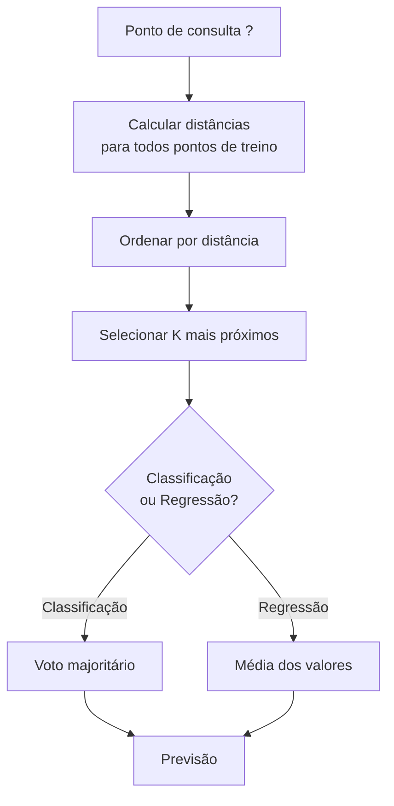
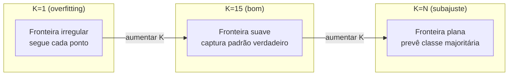
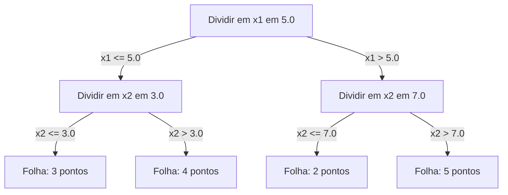

# K-Nearest Neighbors e Distâncias

> Armazene tudo. Prevê olhando seus vizinhos. O algoritmo mais simples que realmente funciona.

**Tipo:** Build
**Linguagens:** Python
**Pré-requisitos:** Fase 1 (Aula 14 Normas e Distâncias)
**Tempo:** ~90 minutos

## Objetivos de Aprendizado

- Implementar classificação e regressão KNN do zero com K configurável e voto ponderado por distância
- Comparar métricas de distância L1, L2, cosseno e Minkowski e selecionar a adequada para um tipo de dado
- Explicar a maldição da dimensionalidade e demonstrar por que KNN degrada em espaços de alta dimensionalidade
- Construir uma KD-tree para busca eficiente de vizinho mais próximo e analisar quando supera força bruta

## O Problema

Você tem um dataset. Um novo ponto de dados chega. Precisa classificá-lo ou prever seu valor. Em vez de aprender parâmetros dos dados (como regressão linear ou SVMs), você apenas encontra os K pontos de treino mais próximos do novo ponto e deixa eles votarem.

Esse é o K-nearest neighbors. Não há fase de treino. Sem parâmetros pra aprender. Sem função de perda pra minimizar. Você armazena o conjunto de treino inteiro e calcula distâncias na hora da previsão.

Parece simples demais pra funcionar. Mas KNN é surpreendentemente competitivo para muitos problemas, especialmente com datasets pequenos a médios, e entendê-lo profundamente revela conceitos fundamentais: a escolha da métrica de distância (conectando à Lição 14 da Fase 1), a maldição da dimensionalidade e a diferença entre aprendizado preguiçoso e ansioso.

KNN também aparece em todo lugar na IA moderna, só que com nomes diferentes. Bancos de dados vetoriais fazem busca KNN sobre embeddings. Geração aumentada por recuperação (RAG) encontra os K chunks de documento mais próximos. Sistemas de recomendação encontram usuários ou itens similares. O algoritmo é o mesmo. A escala e as estruturas de dados são diferentes.

## O Conceito

### Como o KNN Funciona

Dado um dataset de pontos rotulados e um novo ponto de consulta:

1. Compute a distância da consulta a cada ponto no dataset
2. Ordene por distância
3. Pegue os K pontos mais próximos
4. Para classificação: voto majoritário entre os K vizinhos
5. Para regressão: média (ou média ponderada) dos valores dos K vizinhos



Esse é o algoritmo inteiro. Sem ajuste. Sem descida do gradiente. Sem épocas.

### Escolhendo K

K é o único hiperparâmetro. Controla o trade-off viés-variância:

| K | Comportamento |
|---|---------------|
| K = 1 | Fronteira segue cada ponto. Zero erro de treino. Variância alta. Overfitting |
| K pequeno (3-5) | Sensível à estrutura local. Pode capturar fronteiras complexas |
| K grande | Fronteiras mais suaves. Mais robusto a ruído. Pode subajustar |
| K = N | Prevê a classe majoritária para todo ponto. Viés máximo |

Um ponto de partida comum é K = sqrt(N) para um dataset de N pontos. Use K ímpar para classificação binária para evitar empates.



### Métricas de Distância

A função de distância define o que "perto" significa. Métricas diferentes produzem vizinhos diferentes, previsões diferentes.

**L2 (Euclidiana)** é o padrão. Distância em linha reta.

```
d(a, b) = sqrt(sum((a_i - b_i)^2))
```

Sensível à escala das features. Sempre padronize features antes de usar L2 com KNN.

**L1 (Manhattan)** soma diferenças absolutas. Mais robusta a outliers que L2 porque não eleva as diferenças ao quadrado.

```
d(a, b) = sum(|a_i - b_i|)
```

**Distância Cosseno** mede o ângulo entre vetores, ignorando magnitude. Essencial para texto e dados de embedding.

```
d(a, b) = 1 - (a . b) / (||a|| * ||b||)
```

**Minkowski** generaliza L1 e L2 com parâmetro p.

```
d(a, b) = (sum(|a_i - b_i|^p))^(1/p)

p=1: Manhattan
p=2: Euclidiana
p->inf: Chebyshev (diferença absoluta máxima)
```

Qual métrica usar depende dos dados:

| Tipo de dado | Melhor métrica | Por quê |
|-------------|----------------|---------|
| Features numéricas, escala similar | L2 (Euclidiana) | Padrão, funciona pra dados espaciais |
| Features numéricas, outliers | L1 (Manhattan) | Robusta, não amplifica diferenças grandes |
| Embeddings de texto | Cosseno | Magnitude é ruído, direção é significado |
| Alta dimensionais esparsos | Cosseno ou L1 | L2 sofre com maldição da dimensionalidade |
| Tipos mistos | Distância customizada | Combinar métricas por tipo de feature |

### KNN Ponderado

KNN padrão dá peso igual a todos os K vizinhos. Mas um vizinho a distância 0.1 deve importar mais que um a distância 5.0.

**KNN ponderado por distância** pondera cada vizinho inversamente pela distância:

```
peso_i = 1 / (distancia_i + epsilon)

Para classificação: voto ponderado
Para regressão:     média ponderada = sum(w_i * y_i) / sum(w_i)
```

O epsilon previne divisão por zero quando um ponto de consulta corresponde exatamente a um ponto de treino.

KNN ponderado é menos sensível à escolha de K porque vizinhos distantes contribuem muito pouco independentemente.

### A Maldição da Dimensionalidade

O desempenho do KNN degrada em altas dimensões. Isso não é uma preocupação vaga. É um fato matemático.

**Problema 1: distâncias convergem.** Conforme a dimensionalidade aumenta, a razão entre a distância máxima e a distância mínima se aproxima de 1. Todos os pontos se tornam igualmente "distantes" da consulta.

```
Em d dimensões, para pontos uniformes aleatórios:

d=2:    max_dist / min_dist = varia amplamente
d=100:  max_dist / min_dist ~ 1.01
d=1000: max_dist / min_dist ~ 1.001

Quando todas as distâncias são quase iguais, "mais próximo" não significa nada.
```

**Problema 2: volume explode.** Para capturar K vizinhos dentro de uma fração fixa dos dados, você precisa estender seu raio de busca para cobrir uma fração muito maior do espaço de features. A "vizinhança" em altas dimensões abrange a maior parte do espaço.

**Problema 3: cantos dominam.** Em um hipercubo unitário em d dimensões, a maior parte do volume está concentrada perto dos cantos, não do centro. Uma esfera inscrita no cubo contém uma fração desprezível do volume conforme d cresce.

Consequência prática: KNN funciona bem até cerca de 20-50 features. Além disso, você precisa de redução de dimensionalidade (PCA, UMAP, t-SNE) antes de aplicar KNN, ou precisa usar estruturas de busca baseadas em árvore que exploram a dimensionalidade intrínseca mais baixa dos dados.

### KD-trees: Busca Rápida por Vizinhos Mais Próximos

KNN por força bruta computa a distância da consulta a cada ponto de treino. Isso é O(n * d) por consulta. Para datasets grandes, isso é muito lento.

Uma KD-tree particiona recursivamente o espaço ao longo dos eixos das features. Em cada nível, divide ao longo de uma dimensão no valor mediano.



Para encontrar o vizinho mais próximo, atravesse a árvore até a folha contendo a consulta, depois retroceda e verifique partições vizinhas apenas se elas puderem conter pontos mais próximos.

Tempo médio de consulta: O(log n) para baixas dimensões. Mas KD-trees degradam para O(n) em altas dimensões (d > 20) porque o retrocesso elimina cada vez menos ramos.

### Ball Trees: Melhor para Dimensões Moderadas

Ball trees particionam dados em hiperesferas aninhadas em vez de caixas alinhadas aos eixos. Cada nó define uma bola (centro + raio) que contém todos os pontos naquela subárvore.

Vantagens sobre KD-trees:
- Funcionam melhor em dimensões moderadas (até ~50)
- Lidam com estrutura não alinhada aos eixos
- Volumes delimitadores mais apertados significam que mais ramos são podados durante a busca

Tanto KD-trees quanto ball trees são algoritmos exatos. Para busca verdadeiramente em grande escala (milhões de pontos, centenas de dimensões), métodos de vizinhos mais próximos aproximados (HNSW, IVF, quantização de produto) são usados. Estes são cobertos na Lição 14 da Fase 1.

### Aprendizado Preguiçoso vs Aprendizado Ansioso

KNN é um aprendiz preguiçoso: não faz trabalho no tempo de treino e todo trabalho no tempo de previsão. A maioria dos outros algoritmos (regressão linear, SVMs, redes neurais) são aprendizes ansiosos: fazem computação pesada no tempo de treino para construir um modelo compacto, depois as previsões são rápidas.

| Aspecto | Preguiçoso (KNN) | Ansioso (SVM, rede neural) |
|---------|------------------|---------------------------|
| Tempo de treino | O(1) apenas armazenar dados | O(n * épocas) |
| Tempo de previsão | O(n * d) por consulta | O(d) ou O(parâmetros) |
| Memória na previsão | Armazena conjunto de treino inteiro | Armazena apenas parâmetros do modelo |
| Adapta a novos dados | Adiciona pontos instantaneamente | Retreinar o modelo |
| Fronteira de decisão | Implícita, computada na hora | Explícita, fixa após treino |

Aprendizado preguiçoso é ideal quando:
- O dataset muda frequentemente (adicionar/remover pontos sem retreinar)
- Você precisa de previsões para muito poucas consultas
- Você quer tempo de treino zero
- O dataset é pequeno o suficiente para que busca por força bruta seja rápida

### KNN para Regressão

Em vez de voto majoritário, KNN para regressão calcula a média dos valores alvo dos K vizinhos.

```
previsão = (1/K) * sum(y_i para i em K vizinhos mais próximos)

Ou com ponderação por distância:
previsão = sum(w_i * y_i) / sum(w_i)
onde w_i = 1 / distancia_i
```

KNN de regressão produz previsões constantes por partes (ou suaves por partes com ponderação). Não pode extrapolar além do intervalo dos dados de treino. Se os alvos de treino estão todos entre 0 e 100, KNN nunca preverá 200.

## Construa

### Passo 1: Funções de distância

Implemente distâncias L1, L2, cosseno e Minkowski. Conectam-se diretamente à Lição 14 da Fase 1.

```python
import math

def l2_distance(a, b):
    return math.sqrt(sum((ai - bi) ** 2 for ai, bi in zip(a, b)))

def l1_distance(a, b):
    return sum(abs(ai - bi) for ai, bi in zip(a, b))

def cosine_distance(a, b):
    dot_val = sum(ai * bi for ai, bi in zip(a, b))
    norm_a = math.sqrt(sum(ai ** 2 for ai in a))
    norm_b = math.sqrt(sum(bi ** 2 for bi in b))
    if norm_a == 0 or norm_b == 0:
        return 1.0
    return 1.0 - dot_val / (norm_a * norm_b)

def minkowski_distance(a, b, p=2):
    if p == float('inf'):
        return max(abs(ai - bi) for ai, bi in zip(a, b))
    return sum(abs(ai - bi) ** p for ai, bi in zip(a, b)) ** (1 / p)
```

### Passo 2: Classificador e regressor KNN

Construa o KNN completo com K configurável, métrica de distância e ponderação opcional por distância.

```python
class KNN:
    def __init__(self, k=5, distance_fn=l2_distance, weighted=False,
                 task="classification"):
        self.k = k
        self.distance_fn = distance_fn
        self.weighted = weighted
        self.task = task
        self.X_train = None
        self.y_train = None

    def fit(self, X, y):
        self.X_train = X
        self.y_train = y

    def predict(self, X):
        return [self._predict_one(x) for x in X]
```

### Passo 3: KD-tree para busca eficiente

Construa uma KD-tree do zero que divide recursivamente na mediana de cada dimensão.

```python
class KDTree:
    def __init__(self, X, indices=None, depth=0):
        # Particionar recursivamente os dados
        self.axis = depth % len(X[0])
        # Dividir na mediana do eixo atual
        ...

    def query(self, point, k=1):
        # Navegar até a folha, depois retroceder
        ...
```

Veja `code/knn.py` para a implementação completa com todos os métodos auxiliares e demonstrações.

### Passo 4: Escalonamento de features

KNN requer escalonamento de features porque distâncias são sensíveis às magnitudes das features. Uma feature variando de 0 a 1000 dominará uma feature variando de 0 a 1.

```python
def standardize(X):
    n = len(X)
    d = len(X[0])
    means = [sum(X[i][j] for i in range(n)) / n for j in range(d)]
    stds = [
        max(1e-10, (sum((X[i][j] - means[j]) ** 2 for i in range(n)) / n) ** 0.5)
        for j in range(d)
    ]
    return [[((X[i][j] - means[j]) / stds[j]) for j in range(d)] for i in range(n)], means, stds
```

## Use

Com scikit-learn:

```python
from sklearn.neighbors import KNeighborsClassifier
from sklearn.preprocessing import StandardScaler
from sklearn.pipeline import Pipeline

clf = Pipeline([
    ("scaler", StandardScaler()),
    ("knn", KNeighborsClassifier(n_neighbors=5, metric="euclidean")),
])
clf.fit(X_train, y_train)
print(f"Acurácia: {clf.score(X_test, y_test):.4f}")
```

Scikit-learn usa automaticamente KD-trees ou ball trees quando o dataset é grande o suficiente e a dimensionalidade é baixa o suficiente. Para dados de alta dimensão, ele recai para força bruta. Você pode controlar isso com o parâmetro `algorithm`.

Para busca de vizinho mais próximo em grande escala (milhões de vetores), use FAISS, Annoy ou um banco de dados vetorial:

```python
import faiss

index = faiss.IndexFlatL2(dimensao)
index.add(embeddings)
distances, indices = index.search(query_vectors, k=5)
```

## Exercícios

1. Implemente classificação KNN em um dataset 2D com 3 classes. Plote a fronteira de decisão para K=1, K=5, K=15 e K=N. Observe a transição de overfitting para underfitting.

2. Gere 1000 pontos aleatórios em 2, 5, 10, 50, 100 e 500 dimensões. Para cada dimensionalidade, compute a razão entre a distância máxima par a par e a distância mínima par a par. Plote a razão vs dimensionalidade para visualizar a maldição da dimensionalidade.

3. Compare L1, L2 e cosseno para KNN em um problema de classificação de texto (use vetores TF-IDF). Qual métrica dá a melhor acurácia? Por que cosseno tende a vencer para texto?

4. Implemente uma KD-tree e meça o tempo de consulta vs força bruta para datasets de 1k, 10k e 100k pontos em 2D, 10D e 50D. Em qual dimensionalidade a KD-tree para de ser mais rápida que força bruta?

5. Construa um regressor KNN ponderado para y = sin(x) + ruído. Compare com KNN não ponderado para K=3, 10, 30. Mostre que a ponderação produz previsões mais suaves, especialmente para K grande.

## Termos-Chave

| Termo | O que realmente significa |
|-------|--------------------------|
| K-nearest neighbors | Algoritmo não paramétrico que prevê encontrando os K pontos de treino mais próximos a uma consulta |
| Aprendizado preguiçoso | Sem computação no tempo de treino. Todo trabalho acontece no tempo de previsão. KNN é o exemplo canônico |
| Aprendizado ansioso | Computação pesada no tempo de treino para construir um modelo compacto. A maioria dos algoritmos ML é ansiosa |
| Maldição da dimensionalidade | Em altas dimensões, distâncias convergem e vizinhanças se expandem para cobrir a maior parte do espaço, tornando KNN ineficaz |
| KD-tree | Árvore binária que particiona recursivamente o espaço ao longo dos eixos das features. Consultas O(log n) em baixas dimensões |
| Ball tree | Árvore de hiperesferas aninhadas. Funciona melhor que KD-trees em dimensões moderadas (até ~50) |
| KNN ponderado | Vizinhos ponderados inversamente pela distância. Vizinhos mais próximos têm mais influência na previsão |
| Escalonamento de features | Normalizar features para intervalos comparáveis. Necessário para métodos baseados em distância como KNN |
| Voto majoritário | Classificação contando qual classe é mais comum entre K vizinhos |
| Busca por força bruta | Calcular distância a cada ponto de treino. O(n*d) por consulta. Exato mas lento para n grande |
| Vizinho mais próximo aproximado | Algoritmos (HNSW, LSH, IVF) que encontram pontos aproximadamente mais próximos muito mais rápido que busca exata |
| Diagrama de Voronoi | A partição do espaço onde cada região contém todos os pontos mais próximos de um ponto de treino do que de qualquer outro. K=1 KNN produz fronteiras Voronoi |

## Leitura Adicional

- [Cover & Hart: Nearest Neighbor Pattern Classification (1967)](https://ieeexplore.ieee.org/document/1053964) - o paper fundamental do KNN provando que tem taxa de erro no máximo duas vezes o ótimo de Bayes
- [Friedman, Bentley, Finkel: An Algorithm for Finding Best Matches in Logarithmic Expected Time (1977)](https://dl.acm.org/doi/10.1145/355744.355745) - o paper original do KD-tree
- [Beyer et al.: When Is "Nearest Neighbor" Meaningful? (1999)](https://link.springer.com/chapter/10.1007/3-540-49257-7_15) - análise formal da maldição da dimensionalidade para vizinho mais próximo
- [Documentação scikit-learn Nearest Neighbors](https://scikit-learn.org/stable/modules/neighbors.html) - guia prático com seleção de algoritmo
- [FAISS: A Library for Efficient Similarity Search](https://github.com/facebookresearch/faiss) - biblioteca da Meta para busca de vizinho mais próximo aproximado em escala de bilhões
