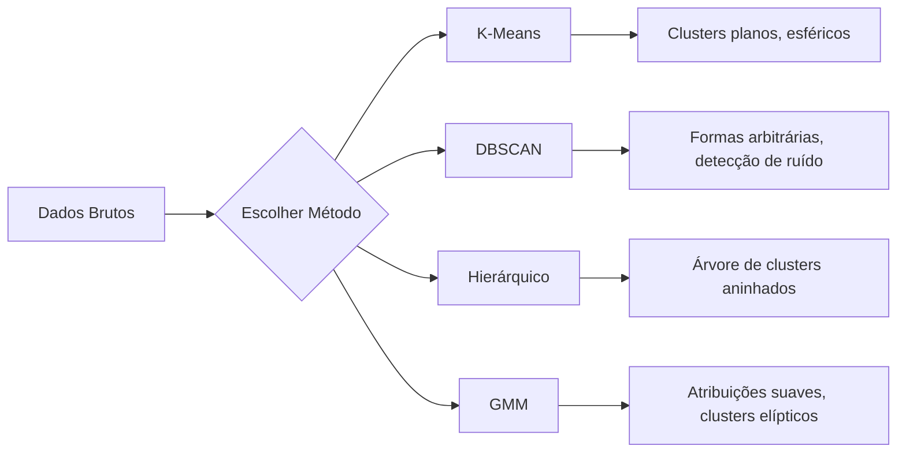

# Aprendizado Não-Supervisionado

> Sem rótulos, sem professor. O algoritmo encontra estrutura sozinho.

**Tipo:** Build
**Linguagens:** Python
**Pré-requisitos:** Fase 1 (Normas e Distâncias, Probabilidade e Distribuições), Fase 2 Aulas 1-6
**Tempo:** ~90 minutos

## Objetivos de Aprendizado

- Implementar K-Means, DBSCAN e Modelos de Mistura Gaussiana do zero e comparar seus comportamentos de clustering
- Avaliar qualidade de clusters usando o silhouette score e o método do cotovelo para selecionar o K ótimo
- Explicar quando DBSCAN supera K-Means e identificar qual algoritmo lida com clusters não-esféricos e outliers
- Construir um pipeline de detecção de anomalias usando métodos de clustering para sinalizar pontos que desviam de padrões normais

## O Problema

Até agora, toda aula de ML assume dados rotulados: "aqui está uma entrada, aqui está a saída correta." No mundo real, rótulos são caros. Um hospital tem milhões de registros de pacientes mas ninguém rotulou cada um manualmente com uma categoria de doença. Um site de e-commerce tem milhões de sessões de usuários mas ninguém rotulou manualmente segmentos de clientes. Uma equipe de segurança tem logs de rede mas ninguém sinalizou toda anomalia.

Aprendizado não-supervisionado encontra padrões sem ser dito o que procurar. Agrupa pontos de dados semelhantes, descobre estruturas ocultas e destaca anomalias. Se aprendizado supervisionado é aprender de um livro com gabarito, aprendizado não-supervisionado é encarar dados brutos até os padrões se revelarem.

O problema: sem rótulos, você não pode medir "certo" ou "errado" diretamente. Você precisa de ferramentas diferentes para avaliar se a estrutura que seu algoritmo encontrou é significativa.

## O Conceito

### Clustering: Agrupando Coisas Semelhantes

Clustering atribui cada ponto de dado a um grupo (cluster) de modo que pontos dentro do mesmo grupo sejam mais semelhantes entre si do que a pontos em outros grupos. A pergunta é sempre: o que "semelhante" significa?



### K-Means: O Trabalhador

K-Means particiona dados em exatamente K clusters. Cada cluster tem um centroide (seu centro de massa), e cada ponto pertence ao centroide mais próximo.

Algoritmo de Lloyd:

1. Escolha K pontos aleatórios como centroides iniciais
2. Atribua cada ponto de dado ao centroide mais próximo
3. Recompute cada centroide como a média dos pontos atribuídos a ele
4. Repita passos 2-3 até as atribuições pararem de mudar

A função objetivo (inércia) mede a distância quadrática total de cada ponto ao seu centroide atribuído. K-Means minimiza isso, mas só encontra um mínimo local. Inicializações diferentes podem dar resultados diferentes.

### Escolhendo K

Dois métodos padrão:

**Método do cotovelo:** Rode K-Means para K = 1, 2, 3, ..., n. Plote inércia vs K. Procure o "cotovelo" onde adicionar mais clusters para de reduzir a inércia significativamente.

**Silhouette score:** Para cada ponto, meça o quão semelhante ele é ao seu próprio cluster (a) versus o cluster mais próximo (b). O coeficiente silhouette é (b - a) / max(a, b), variando de -1 (cluster errado) a +1 (bem agrupado). Tire a média de todos os pontos para uma pontuação global.

### DBSCAN: Clustering Baseado em Densidade

K-Means assume clusters esféricos e precisa que você escolha K. DBSCAN não faz nenhuma das duas. Encontra clusters como regiões densas separadas por regiões esparsas.

Dois parâmetros:
- **eps**: o raio de uma vizinhança
- **min_samples**: o número mínimo de pontos pra formar uma região densa

Três tipos de pontos:
- **Ponto central**: tem pelo menos min_samples pontos dentro da distância eps
- **Ponto de borda**: está dentro de eps de um ponto central mas não é um ponto central
- **Ponto de ruído**: nem central nem de borda. Estes são outliers.

DBSCAN conecta pontos centrais que estão dentro de eps uns dos outros no mesmo cluster. Pontos de borda entram no cluster de um ponto central próximo. Pontos de ruído não pertencem a cluster nenhum.

Pontos fortes: encontra clusters de qualquer forma, determina automaticamente o número de clusters, identifica outliers. Fraqueza: luta com clusters de densidades variadas.

### Clustering Hierárquico

Constrói uma árvore (dendrograma) de clusters aninhados.

Aglomerativo (de baixo pra cima):
1. Cada ponto começa como seu próprio cluster
2. Mescle os dois clusters mais próximos
3. Repita até que só um cluster reste
4. Corte o dendrograma no nível desejado para obter K clusters

A "proximidade" entre clusters pode ser medida como:
- **Ligação simples**: distância mínima entre quaisquer dois pontos nos dois clusters
- **Ligação completa**: distância máxima entre quaisquer dois pontos
- **Ligação média**: distância média entre todos os pares
- **Método de Ward**: a mesclagem que causa o menor aumento na variância total dentro do cluster

### GMM (Modelos de Mistura Gaussiana)

K-Means dá atribuições duras: cada ponto pertence a exatamente um cluster. GMM dá atribuições suaves: cada ponto tem uma probabilidade de pertencer a cada cluster.

GMM assume que os dados são gerados de uma mistura de K distribuições Gaussianas, cada uma com sua própria média e covariância. O algoritmo Expectation-Maximization (EM) alterna entre:

- **E-step**: compute a probabilidade de cada ponto pertencer a cada Gaussiana
- **M-step**: atualize a média, covariância e peso de mistura de cada Gaussiana para maximizar a verossimilhança dos dados

GMM pode modelar clusters elípticos (não apenas esféricos como K-Means) e lida naturalmente com clusters sobrepostos.

### Quando Usar Qual

| Método | Melhor para | Evitar quando |
|--------|-------------|---------------|
| K-Means | Datasets grandes, clusters esféricos, K conhecido | Formas irregulares, outliers presentes |
| DBSCAN | K desconhecido, formas arbitrárias, detecção de outlier | Densidades variadas, muitas dimensões |
| Hierárquico | Datasets pequenos, precisa de dendrograma, K desconhecido | Datasets grandes (memória O(n^2)) |
| GMM | Clusters sobrepostos, atribuições suaves necessárias | Datasets muito grandes, muitas dimensões |

### Detecção de Anomalias com Clustering

Clustering naturalmente suporta detecção de anomalias:
- **K-Means**: pontos distantes de qualquer centroide são anomalias
- **DBSCAN**: pontos de ruído são anomalias por definição
- **GMM**: pontos com baixa probabilidade sob todas as Gaussianas são anomalias

## Construa

### Passo 1: K-Means do zero

```python
import math
import random


def euclidean_distance(a, b):
    return math.sqrt(sum((ai - bi) ** 2 for ai, bi in zip(a, b)))


def kmeans(data, k, max_iterations=100, seed=42):
    random.seed(seed)
    n_features = len(data[0])

    centroids = random.sample(data, k)

    for iteration in range(max_iterations):
        clusters = [[] for _ in range(k)]
        assignments = []

        for point in data:
            distances = [euclidean_distance(point, c) for c in centroids]
            nearest = distances.index(min(distances))
            clusters[nearest].append(point)
            assignments.append(nearest)

        new_centroids = []
        for cluster in clusters:
            if len(cluster) == 0:
                new_centroids.append(random.choice(data))
                continue
            centroid = [
                sum(point[j] for point in cluster) / len(cluster)
                for j in range(n_features)
            ]
            new_centroids.append(centroid)

        if all(
            euclidean_distance(old, new) < 1e-6
            for old, new in zip(centroids, new_centroids)
        ):
            print(f"  Convergiu na iteração {iteration + 1}")
            break

        centroids = new_centroids

    return assignments, centroids
```

### Passo 2: Método do cotovelo e silhouette score

```python
def compute_inertia(data, assignments, centroids):
    total = 0.0
    for point, cluster_id in zip(data, assignments):
        total += euclidean_distance(point, centroids[cluster_id]) ** 2
    return total


def silhouette_score(data, assignments):
    n = len(data)
    if n < 2:
        return 0.0

    clusters = {}
    for i, c in enumerate(assignments):
        clusters.setdefault(c, []).append(i)

    if len(clusters) < 2:
        return 0.0

    scores = []
    for i in range(n):
        own_cluster = assignments[i]
        own_members = [j for j in clusters[own_cluster] if j != i]

        if len(own_members) == 0:
            scores.append(0.0)
            continue

        a = sum(euclidean_distance(data[i], data[j]) for j in own_members) / len(own_members)

        b = float("inf")
        for cluster_id, members in clusters.items():
            if cluster_id == own_cluster:
                continue
            avg_dist = sum(euclidean_distance(data[i], data[j]) for j in members) / len(members)
            b = min(b, avg_dist)

        if max(a, b) == 0:
            scores.append(0.0)
        else:
            scores.append((b - a) / max(a, b))

    return sum(scores) / len(scores)


def find_best_k(data, max_k=10):
    print("Método do cotovelo:")
    inertias = []
    for k in range(1, max_k + 1):
        assignments, centroids = kmeans(data, k)
        inertia = compute_inertia(data, assignments, centroids)
        inertias.append(inertia)
        print(f"  K={k}: inertia={inertia:.2f}")

    print("\nSilhouette scores:")
    for k in range(2, max_k + 1):
        assignments, centroids = kmeans(data, k)
        score = silhouette_score(data, assignments)
        print(f"  K={k}: silhouette={score:.4f}")

    return inertias
```

### Passo 3: DBSCAN do zero

```python
def dbscan(data, eps, min_samples):
    n = len(data)
    labels = [-1] * n
    cluster_id = 0

    def region_query(point_idx):
        neighbors = []
        for i in range(n):
            if euclidean_distance(data[point_idx], data[i]) <= eps:
                neighbors.append(i)
        return neighbors

    visited = [False] * n

    for i in range(n):
        if visited[i]:
            continue
        visited[i] = True

        neighbors = region_query(i)

        if len(neighbors) < min_samples:
            labels[i] = -1
            continue

        labels[i] = cluster_id
        seed_set = list(neighbors)
        seed_set.remove(i)

        j = 0
        while j < len(seed_set):
            q = seed_set[j]

            if not visited[q]:
                visited[q] = True
                q_neighbors = region_query(q)
                if len(q_neighbors) >= min_samples:
                    for nb in q_neighbors:
                        if nb not in seed_set:
                            seed_set.append(nb)

            if labels[q] == -1:
                labels[q] = cluster_id

            j += 1

        cluster_id += 1

    return labels
```

### Passo 4: GMM (algoritmo EM) do zero

```python
def gmm(data, k, max_iterations=100, seed=42):
    random.seed(seed)
    n = len(data)
    d = len(data[0])

    indices = random.sample(range(n), k)
    means = [list(data[i]) for i in indices]
    variances = [1.0] * k
    weights = [1.0 / k] * k

    def gaussian_pdf(x, mean, variance):
        d = len(x)
        coeff = 1.0 / ((2 * math.pi * variance) ** (d / 2))
        exponent = -sum((xi - mi) ** 2 for xi, mi in zip(x, mean)) / (2 * variance)
        return coeff * math.exp(max(exponent, -500))

    for iteration in range(max_iterations):
        responsibilities = []
        for i in range(n):
            probs = []
            for j in range(k):
                probs.append(weights[j] * gaussian_pdf(data[i], means[j], variances[j]))
            total = sum(probs)
            if total == 0:
                total = 1e-300
            responsibilities.append([p / total for p in probs])

        old_means = [list(m) for m in means]

        for j in range(k):
            r_sum = sum(responsibilities[i][j] for i in range(n))
            if r_sum < 1e-10:
                continue

            weights[j] = r_sum / n

            for dim in range(d):
                means[j][dim] = sum(
                    responsibilities[i][j] * data[i][dim] for i in range(n)
                ) / r_sum

            variances[j] = sum(
                responsibilities[i][j]
                * sum((data[i][dim] - means[j][dim]) ** 2 for dim in range(d))
                for i in range(n)
            ) / (r_sum * d)
            variances[j] = max(variances[j], 1e-6)

        shift = sum(
            euclidean_distance(old_means[j], means[j]) for j in range(k)
        )
        if shift < 1e-6:
            print(f"  GMM convergiu na iteração {iteration + 1}")
            break

    assignments = []
    for i in range(n):
        assignments.append(responsibilities[i].index(max(responsibilities[i])))

    return assignments, means, weights, responsibilities
```

### Passo 5: Gere dados de teste e execute tudo

```python
def make_blobs(centers, n_per_cluster=50, spread=0.5, seed=42):
    random.seed(seed)
    data = []
    true_labels = []
    for label, (cx, cy) in enumerate(centers):
        for _ in range(n_per_cluster):
            x = cx + random.gauss(0, spread)
            y = cy + random.gauss(0, spread)
            data.append([x, y])
            true_labels.append(label)
    return data, true_labels


def make_moons(n_samples=200, noise=0.1, seed=42):
    random.seed(seed)
    data = []
    labels = []
    n_half = n_samples // 2
    for i in range(n_half):
        angle = math.pi * i / n_half
        x = math.cos(angle) + random.gauss(0, noise)
        y = math.sin(angle) + random.gauss(0, noise)
        data.append([x, y])
        labels.append(0)
    for i in range(n_half):
        angle = math.pi * i / n_half
        x = 1 - math.cos(angle) + random.gauss(0, noise)
        y = 1 - math.sin(angle) - 0.5 + random.gauss(0, noise)
        data.append([x, y])
        labels.append(1)
    return data, labels


if __name__ == "__main__":
    centers = [[2, 2], [8, 3], [5, 8]]
    data, true_labels = make_blobs(centers, n_per_cluster=50, spread=0.8)

    print("=== K-Means em 3 blobs ===")
    assignments, centroids = kmeans(data, k=3)
    print(f"  Centroids: {[[round(c, 2) for c in cent] for cent in centroids]}")
    sil = silhouette_score(data, assignments)
    print(f"  Silhouette score: {sil:.4f}")

    print("\n=== Método do Cotovelo ===")
    find_best_k(data, max_k=6)

    print("\n=== DBSCAN em 3 blobs ===")
    db_labels = dbscan(data, eps=1.5, min_samples=5)
    n_clusters = len(set(db_labels) - {-1})
    n_noise = db_labels.count(-1)
    print(f"  Encontrou {n_clusters} clusters, {n_noise} pontos de ruído")

    print("\n=== GMM em 3 blobs ===")
    gmm_assignments, gmm_means, gmm_weights, _ = gmm(data, k=3)
    print(f"  Means: {[[round(m, 2) for m in mean] for mean in gmm_means]}")
    print(f"  Weights: {[round(w, 3) for w in gmm_weights]}")
    gmm_sil = silhouette_score(data, gmm_assignments)
    print(f"  Silhouette score: {gmm_sil:.4f}")

    print("\n=== DBSCAN em moons (clusters não-esféricos) ===")
    moon_data, moon_labels = make_moons(n_samples=200, noise=0.1)
    moon_db = dbscan(moon_data, eps=0.3, min_samples=5)
    n_moon_clusters = len(set(moon_db) - {-1})
    n_moon_noise = moon_db.count(-1)
    print(f"  Encontrou {n_moon_clusters} clusters, {n_moon_noise} pontos de ruído")

    print("\n=== K-Means em moons (vai falhar em separar) ===")
    moon_km, moon_centroids = kmeans(moon_data, k=2)
    moon_sil = silhouette_score(moon_data, moon_km)
    print(f"  Silhouette score: {moon_sil:.4f}")
    print("  K-Means separa moons mal porque não são esféricos")

    print("\n=== Detecção de anomalias com DBSCAN ===")
    anomaly_data = list(data)
    anomaly_data.append([20.0, 20.0])
    anomaly_data.append([-5.0, -5.0])
    anomaly_data.append([15.0, 0.0])
    anomaly_labels = dbscan(anomaly_data, eps=1.5, min_samples=5)
    anomalies = [
        anomaly_data[i]
        for i in range(len(anomaly_labels))
        if anomaly_labels[i] == -1
    ]
    print(f"  Detectou {len(anomalies)} anomalias")
    for a in anomalies[-3:]:
        print(f"    Ponto {[round(v, 2) for v in a]}")
```

## Use

Com scikit-learn, os mesmos algoritmos são one-liners:

```python
from sklearn.cluster import KMeans, DBSCAN, AgglomerativeClustering
from sklearn.mixture import GaussianMixture
from sklearn.metrics import silhouette_score as sklearn_silhouette

km = KMeans(n_clusters=3, random_state=42).fit(data)
db = DBSCAN(eps=1.5, min_samples=5).fit(data)
agg = AgglomerativeClustering(n_clusters=3).fit(data)
gmm_model = GaussianMixture(n_components=3, random_state=42).fit(data)
```

As versões do zero mostram exatamente o que essas bibliotecas computam. K-Means itera entre atribuir e recomputar. DBSCAN cresce clusters a partir de sementes densas. GMM alterna entre expectation e maximization. As versões de biblioteca adicionam estabilidade numérica, inicialização mais inteligente (K-Means++) e aceleração de GPU, mas a lógica central é a mesma.

## Entregue

Esta aula produz implementações funcionais de K-Means, DBSCAN e GMM do zero. O código de clustering pode ser reutilizado como base para métodos não-supervisionados mais avançados.

## Exercícios

1. Implemente inicialização K-Means++: em vez de pegar centroides aleatórios, pegue o primeiro aleatoriamente e cada centroid subsequente com probabilidade proporcional à distância ao quadrado do centroide existente mais próximo. Compare a velocidade de convergência com a inicialização aleatória.
2. Adicione clustering hierárquico aglomerativo ao código. Implemente a ligação de Ward e produza um dendrograma (como uma lista aninhada de mesclagens). Corte em diferentes níveis e compare com os resultados do K-Means.
3. Construa um pipeline simples de detecção de anomalias: rode DBSCAN e GMM nos mesmos dados, sinalize pontos que ambos os métodos concordam ser outliers (ruído no DBSCAN, baixa probabilidade no GMM). Meça a sobreposição e discuta quando os métodos discordam.

## Termos-chave

| Termo | O que as pessoas dizem | O que realmente significa |
|-------|------------------------|---------------------------|
| Clustering | "Agrupar coisas semelhantes" | Particionar dados em subconjuntos onde a similaridade dentro do grupo excede a similaridade entre grupos, medida por uma métrica de distância específica |
| Centroide | "O centro de um cluster" | A média de todos os pontos atribuídos a um cluster; usado pelo K-Means como representante do cluster |
| Inércia | "Quão apertados os clusters estão" | Soma das distâncias quadráticas de cada ponto ao seu centroide atribuído; menor é mais apertado |
| Silhouette score | "Quão bem separados estão os clusters" | Para cada ponto, (b - a) / max(a, b) onde a é a distância média intra-cluster e b é a distância média ao cluster mais próximo |
| Ponto central | "Um ponto numa região densa" | Um ponto com pelo menos min_samples vizinhos dentro da distância eps, no DBSCAN |
| Algoritmo EM | "K-Means suave" | Expectation-Maximization: iterativamente computa probabilidades de pertinência (E-step) e atualiza parâmetros da distribuição (M-step) |
| Dendrograma | "Uma árvore de clusters" | Um diagrama de árvore mostrando a ordem e distância em que clusters foram mesclados no clustering hierárquico |
| Anomalia | "Um outlier" | Um ponto de dado que não se conforma com o padrão esperado, identificado como ruído pelo DBSCAN ou baixa probabilidade pelo GMM |

## Leitura Adicional

- [Stanford CS229 - Unsupervised Learning](https://cs229.stanford.edu/notes2022fall/main_notes.pdf) — notas de aula de Andrew Ng sobre clustering e EM
- [scikit-learn Clustering Guide](https://scikit-learn.org/stable/modules/clustering.html) — comparação prática de todos os algoritmos de clustering com exemplos visuais
- [DBSCAN original paper (Ester et al., 1996)](https://www.aaai.org/Papers/KDD/1996/KDD96-037.pdf) — o paper que introduziu clustering baseado em densidade
