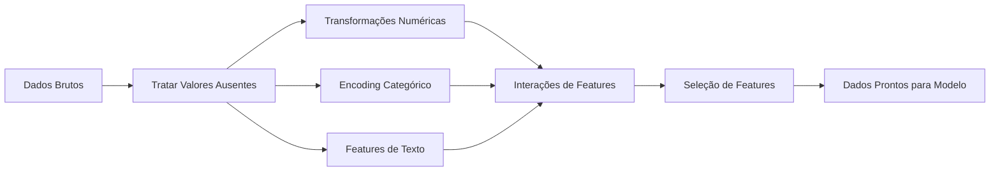

# Engenharia de Features e Seleção

> Uma boa feature vale mais que mil pontos de dados.

**Tipo:** Build
**Linguagens:** Python
**Pré-requisitos:** Fase 1 (Estatística para ML, Álgebra Linear), Fase 2 Aulas 1-7
**Tempo:** ~90 minutos

## Objetivos de Aprendizado

- Implementar transformações numéricas (padronização, escalonamento min-max, transformação log, binning) e explicar quando cada uma é apropriada
- Construir encoding one-hot, de label e target para features categóricas e identificar o risco de vazamento de dados no target encoding
- Construir um vetorizador TF-IDF do zero e explicar por que ele supera contagens brutas de palavras para classificação de texto
- Aplicar seleção de features baseada em filtro (limiar de variância, correlação, informação mútua) para reduzir dimensionalidade

## O Problema

Você tem um dataset. Escolhe um algoritmo. Treina. Os resultados são medianos. Tenta um algoritmo mais sofisticado. Ainda mediano. Gasta uma semana ajustando hiperparâmetros. Melhoria marginal.

Aí alguém transforma os dados brutos em melhores features e uma regressão logística simples supera seu ensemble de gradient boosting ajustado.

Isso acontece o tempo todo. Na ML clássica, a representação dos dados importa mais que a escolha do algoritmo. Um modelo de preço de imóveis com "metragem quadrada" e "número de quartos" vai superar um modelo com "endereço como string bruta" não importa quão sofisticado o aprendiz seja. O algoritmo só consegue trabalhar com o que você dá a ele.

Engenharia de features é o processo de transformar dados brutos em representações que facilitam para modelos encontrar padrões. Seleção de features é o processo de descartar features que adicionam ruído sem adicionar sinal. Juntas, são a atividade de maior alavancagem na ML clássica.

## O Conceito

### O Pipeline de Features



### Features Numéricas

Números brutos raramente estão prontos para modelos. Transformações comuns:

**Escalonamento:** Coloque features na mesma faixa para que algoritmos baseados em distância (K-Means, KNN, SVM) tratem todas igualmente. Min-max mapeia para [0, 1]. Padronização (z-score) mapeia para média=0, desvio=1.

**Transformação log:** Comprime distribuições enviesadas à direita (renda, população, contagens de palavras). Transforma relações multiplicativas em aditivas.

**Binning:** Converte valores contínuos em categorias. Útil quando a relação entre feature e alvo é não-linear mas por degraus (ex.: faixas etárias).

**Features polinomiais:** Cria termos x², x³, x1*x2. Permite que modelos lineares capturem relações não-lineares ao custo de mais features.

### Features Categóricas

Modelos precisam de números. Categorias precisam de encoding.

**One-hot encoding:** Cria uma coluna binária para cada categoria. "cor = vermelho/azul/verde" vira três colunas: is_red, is_blue, is_green. Funciona bem para features de baixa cardinalidade, mas explode com muitas categorias.

**Label encoding:** Mapeia cada categoria para um inteiro: vermelho=0, azul=1, verde=2. Introduz ordenação falsa (o modelo pode pensar que verde > azul > vermelho). Só apropriado para modelos baseados em árvore que dividem em valores individuais.

**Target encoding:** Substitui cada categoria pela média da variável alvo para aquela categoria. Poderoso mas perigoso: alto risco de vazamento de dados. Deve ser computado apenas nos dados de treino e aplicado aos dados de teste.

### Features de Texto

**Count vectorizer:** Conta quantas vezes cada palavra aparece em um documento. "the cat sat on the mat" vira {the: 2, cat: 1, sat: 1, on: 1, mat: 1}.

**TF-IDF:** Term Frequency-Inverse Document Frequency. Pesa palavras pelo quão únicas são entre documentos. Palavras comuns como "the" recebem peso baixo. Palavras raras e distintivas recebem peso alto.

```
TF(palavra, doc) = contagem(palavra no doc) / total de palavras no doc
IDF(palavra) = log(total docs / docs contendo a palavra)
TF-IDF = TF * IDF
```

### Valores Ausentes

Dados reais têm buracos. Estratégias:

- **Deletar linhas:** Só quando dados faltantes são raros e aleatórios
- **Imputação por média/mediana:** Simples, preserva forma da distribuição (mediana é mais robusta a outliers)
- **Imputação por moda:** Para features categóricas
- **Coluna indicadora:** Adicione uma coluna binária "estava_faltando" antes de imputar. O fato de que o dado está faltando pode ser informativo por si só
- **Preenchimento forward/backward:** Para dados de série temporal

### Interação de Features

Às vezes a relação está na combinação. "Altura" e "peso" sozinhos são menos preditivos que "IMC = peso / altura²". Interações de features multiplicam o espaço de features, então use conhecimento de domínio para escolher as certas.

### Seleção de Features

Mais features nem sempre é melhor. Features irrelevantes adicionam ruído, aumentam tempo de treino e podem causar overajuste.

**Métodos filtro (pré-modelo):**
- Correlação: remover features altamente correlacionadas entre si (redundantes)
- Informação mútua: mede o quanto saber uma feature reduz incerteza sobre o alvo
- Limiar de variância: remover features que quase não variam

**Métodos wrapper (baseados em modelo):**
- Regularização L1 (Lasso): leva pesos de features irrelevantes exatamente a zero
- Eliminação recursiva de features: treine, remova a feature menos importante, repita

**Por que a seleção importa:** Um modelo com 10 boas features geralmente supera um modelo com 10 boas features e 90 ruidosas. As features ruidosas dão ao modelo oportunidades de overfitting em padrões dos dados de treino que não generalizam.

## Construa

### Passo 1: Transformações numéricas do zero

```python
import math


def min_max_scale(values):
    min_val = min(values)
    max_val = max(values)
    if max_val == min_val:
        return [0.0] * len(values)
    return [(v - min_val) / (max_val - min_val) for v in values]


def standardize(values):
    n = len(values)
    mean = sum(values) / n
    variance = sum((v - mean) ** 2 for v in values) / n
    std = math.sqrt(variance) if variance > 0 else 1.0
    return [(v - mean) / std for v in values]


def log_transform(values):
    return [math.log(v + 1) for v in values]


def bin_values(values, n_bins=5):
    min_val = min(values)
    max_val = max(values)
    bin_width = (max_val - min_val) / n_bins
    if bin_width == 0:
        return [0] * len(values)
    result = []
    for v in values:
        bin_idx = int((v - min_val) / bin_width)
        bin_idx = min(bin_idx, n_bins - 1)
        result.append(bin_idx)
    return result


def polynomial_features(row, degree=2):
    n = len(row)
    result = list(row)
    if degree >= 2:
        for i in range(n):
            result.append(row[i] ** 2)
        for i in range(n):
            for j in range(i + 1, n):
                result.append(row[i] * row[j])
    return result
```

### Passo 2: Encoding categórico do zero

```python
def one_hot_encode(values):
    categories = sorted(set(values))
    cat_to_idx = {cat: i for i, cat in enumerate(categories)}
    n_cats = len(categories)

    encoded = []
    for v in values:
        row = [0] * n_cats
        row[cat_to_idx[v]] = 1
        encoded.append(row)

    return encoded, categories


def label_encode(values):
    categories = sorted(set(values))
    cat_to_int = {cat: i for i, cat in enumerate(categories)}
    return [cat_to_int[v] for v in values], cat_to_int


def target_encode(feature_values, target_values, smoothing=10):
    global_mean = sum(target_values) / len(target_values)

    category_stats = {}
    for feat, target in zip(feature_values, target_values):
        if feat not in category_stats:
            category_stats[feat] = {"sum": 0.0, "count": 0}
        category_stats[feat]["sum"] += target
        category_stats[feat]["count"] += 1

    encoding = {}
    for cat, stats in category_stats.items():
        cat_mean = stats["sum"] / stats["count"]
        weight = stats["count"] / (stats["count"] + smoothing)
        encoding[cat] = weight * cat_mean + (1 - weight) * global_mean

    return [encoding[v] for v in feature_values], encoding
```

### Passo 3: Features de texto do zero

```python
def count_vectorize(documents):
    vocab = {}
    idx = 0
    for doc in documents:
        for word in doc.lower().split():
            if word not in vocab:
                vocab[word] = idx
                idx += 1

    vectors = []
    for doc in documents:
        vec = [0] * len(vocab)
        for word in doc.lower().split():
            vec[vocab[word]] += 1
        vectors.append(vec)

    return vectors, vocab


def tfidf(documents):
    n_docs = len(documents)

    vocab = {}
    idx = 0
    for doc in documents:
        for word in doc.lower().split():
            if word not in vocab:
                vocab[word] = idx
                idx += 1

    doc_freq = {}
    for doc in documents:
        seen = set()
        for word in doc.lower().split():
            if word not in seen:
                doc_freq[word] = doc_freq.get(word, 0) + 1
                seen.add(word)

    vectors = []
    for doc in documents:
        words = doc.lower().split()
        word_count = len(words)
        tf_map = {}
        for word in words:
            tf_map[word] = tf_map.get(word, 0) + 1

        vec = [0.0] * len(vocab)
        for word, count in tf_map.items():
            tf = count / word_count
            idf = math.log(n_docs / doc_freq[word])
            vec[vocab[word]] = tf * idf
        vectors.append(vec)

    return vectors, vocab
```

### Passo 4: Imputação de valores ausentes do zero

```python
def impute_mean(values):
    present = [v for v in values if v is not None]
    if not present:
        return [0.0] * len(values), 0.0
    mean = sum(present) / len(present)
    return [v if v is not None else mean for v in values], mean


def impute_median(values):
    present = sorted(v for v in values if v is not None)
    if not present:
        return [0.0] * len(values), 0.0
    n = len(present)
    if n % 2 == 0:
        median = (present[n // 2 - 1] + present[n // 2]) / 2
    else:
        median = present[n // 2]
    return [v if v is not None else median for v in values], median


def impute_mode(values):
    present = [v for v in values if v is not None]
    if not present:
        return values, None
    counts = {}
    for v in present:
        counts[v] = counts.get(v, 0) + 1
    mode = max(counts, key=counts.get)
    return [v if v is not None else mode for v in values], mode


def add_missing_indicator(values):
    return [0 if v is not None else 1 for v in values]
```

### Passo 5: Seleção de features do zero

```python
def correlation(x, y):
    n = len(x)
    mean_x = sum(x) / n
    mean_y = sum(y) / n
    cov = sum((xi - mean_x) * (yi - mean_y) for xi, yi in zip(x, y)) / n
    std_x = math.sqrt(sum((xi - mean_x) ** 2 for xi in x) / n)
    std_y = math.sqrt(sum((yi - mean_y) ** 2 for yi in y) / n)
    if std_x == 0 or std_y == 0:
        return 0.0
    return cov / (std_x * std_y)


def mutual_information(feature, target, n_bins=10):
    feat_min = min(feature)
    feat_max = max(feature)
    bin_width = (feat_max - feat_min) / n_bins if feat_max != feat_min else 1.0
    feat_binned = [
        min(int((f - feat_min) / bin_width), n_bins - 1) for f in feature
    ]

    n = len(feature)
    target_classes = sorted(set(target))

    feat_bins = sorted(set(feat_binned))
    p_feat = {}
    for b in feat_bins:
        p_feat[b] = feat_binned.count(b) / n

    p_target = {}
    for t in target_classes:
        p_target[t] = target.count(t) / n

    mi = 0.0
    for b in feat_bins:
        for t in target_classes:
            joint_count = sum(
                1 for fb, tv in zip(feat_binned, target) if fb == b and tv == t
            )
            p_joint = joint_count / n
            if p_joint > 0:
                mi += p_joint * math.log(p_joint / (p_feat[b] * p_target[t]))

    return mi


def variance_threshold(features, threshold=0.01):
    n_features = len(features[0])
    n_samples = len(features)
    selected = []

    for j in range(n_features):
        col = [features[i][j] for i in range(n_samples)]
        mean = sum(col) / n_samples
        var = sum((v - mean) ** 2 for v in col) / n_samples
        if var >= threshold:
            selected.append(j)

    return selected


def remove_correlated(features, threshold=0.9):
    n_features = len(features[0])
    n_samples = len(features)

    to_remove = set()
    for i in range(n_features):
        if i in to_remove:
            continue
        col_i = [features[r][i] for r in range(n_samples)]
        for j in range(i + 1, n_features):
            if j in to_remove:
                continue
            col_j = [features[r][j] for r in range(n_samples)]
            corr = abs(correlation(col_i, col_j))
            if corr >= threshold:
                to_remove.add(j)

    return [i for i in range(n_features) if i not in to_remove]
```

### Passo 6: Pipeline completo e demonstração

```python
import random


def make_housing_data(n=200, seed=42):
    random.seed(seed)
    data = []
    for _ in range(n):
        sqft = random.uniform(500, 5000)
        bedrooms = random.choice([1, 2, 3, 4, 5])
        age = random.uniform(0, 50)
        neighborhood = random.choice(["downtown", "suburbs", "rural"])
        has_pool = random.choice([True, False])

        sqft_with_missing = sqft if random.random() > 0.05 else None
        age_with_missing = age if random.random() > 0.08 else None

        price = (
            50 * sqft
            + 20000 * bedrooms
            - 1000 * age
            + (50000 if neighborhood == "downtown" else 10000 if neighborhood == "suburbs" else 0)
            + (15000 if has_pool else 0)
            + random.gauss(0, 20000)
        )

        data.append({
            "sqft": sqft_with_missing,
            "bedrooms": bedrooms,
            "age": age_with_missing,
            "neighborhood": neighborhood,
            "has_pool": has_pool,
            "price": price,
        })
    return data


if __name__ == "__main__":
    data = make_housing_data(200)

    print("=== Amostra de Dados Brutos ===")
    for row in data[:3]:
        print(f"  {row}")

    sqft_raw = [d["sqft"] for d in data]
    age_raw = [d["age"] for d in data]
    prices = [d["price"] for d in data]

    print("\n=== Tratamento de Valores Ausentes ===")
    sqft_missing = sum(1 for v in sqft_raw if v is None)
    age_missing = sum(1 for v in age_raw if v is None)
    print(f"  sqft ausentes: {sqft_missing}/{len(sqft_raw)}")
    print(f"  age ausentes: {age_missing}/{len(age_raw)}")

    sqft_indicator = add_missing_indicator(sqft_raw)
    age_indicator = add_missing_indicator(age_raw)
    sqft_imputed, sqft_fill = impute_median(sqft_raw)
    age_imputed, age_fill = impute_mean(age_raw)
    print(f"  sqft preenchido com mediana: {sqft_fill:.0f}")
    print(f"  age preenchido com média: {age_fill:.1f}")

    print("\n=== Transformações Numéricas ===")
    sqft_scaled = standardize(sqft_imputed)
    age_scaled = min_max_scale(age_imputed)
    sqft_log = log_transform(sqft_imputed)
    age_binned = bin_values(age_imputed, n_bins=5)
    print(f"  sqft padronizado: média={sum(sqft_scaled)/len(sqft_scaled):.4f}, desvio={math.sqrt(sum(v**2 for v in sqft_scaled)/len(sqft_scaled)):.4f}")
    print(f"  age min-max: [{min(age_scaled):.2f}, {max(age_scaled):.2f}]")
    print(f"  age bins: {sorted(set(age_binned))}")

    print("\n=== Encoding Categórico ===")
    neighborhoods = [d["neighborhood"] for d in data]

    ohe, ohe_cats = one_hot_encode(neighborhoods)
    print(f"  Categorias one-hot: {ohe_cats}")
    print(f"  Sample encoding: {neighborhoods[0]} -> {ohe[0]}")

    le, le_map = label_encode(neighborhoods)
    print(f"  Mapa de label encoding: {le_map}")

    te, te_map = target_encode(neighborhoods, prices, smoothing=10)
    print(f"  Target encoding: {({k: round(v) for k, v in te_map.items()})}")

    print("\n=== Features de Texto ===")
    descriptions = [
        "large modern house with pool",
        "small cozy cottage near downtown",
        "spacious family home with large yard",
        "modern apartment downtown with view",
        "rustic cabin in rural area",
    ]
    cv, cv_vocab = count_vectorize(descriptions)
    print(f"  Tamanho do vocabulário: {len(cv_vocab)}")
    print(f"  Doc 0 features não-zero: {sum(1 for v in cv[0] if v > 0)}")

    tf, tf_vocab = tfidf(descriptions)
    print(f"  Tamanho do vocabulário TF-IDF: {len(tf_vocab)}")
    top_words = sorted(tf_vocab.keys(), key=lambda w: tf[0][tf_vocab[w]], reverse=True)[:3]
    print(f"  Doc 0 top palavras TF-IDF: {top_words}")

    print("\n=== Features Polinomiais ===")
    sample_row = [sqft_scaled[0], age_scaled[0]]
    poly = polynomial_features(sample_row, degree=2)
    print(f"  Entrada: {[round(v, 4) for v in sample_row]}")
    print(f"  Polinomial: {[round(v, 4) for v in poly]}")
    print(f"  Features: [x1, x2, x1^2, x2^2, x1*x2]")

    print("\n=== Seleção de Features ===")
    feature_matrix = [
        [sqft_scaled[i], age_scaled[i], float(sqft_indicator[i]), float(age_indicator[i])]
        + ohe[i]
        for i in range(len(data))
    ]

    print(f"  Total features: {len(feature_matrix[0])}")

    surviving_var = variance_threshold(feature_matrix, threshold=0.01)
    print(f"  Após limiar de variância (0.01): {len(surviving_var)} features mantidas")

    surviving_corr = remove_correlated(feature_matrix, threshold=0.9)
    print(f"  Após filtro de correlação (0.9): {len(surviving_corr)} features mantidas")

    binary_prices = [1 if p > sum(prices) / len(prices) else 0 for p in prices]
    print("\n  Informação mútua com o alvo:")
    feature_names = ["sqft", "age", "sqft_missing", "age_missing"] + [f"neigh_{c}" for c in ohe_cats]
    for j in range(len(feature_matrix[0])):
        col = [feature_matrix[i][j] for i in range(len(feature_matrix))]
        mi = mutual_information(col, binary_prices, n_bins=10)
        print(f"    {feature_names[j]}: MI={mi:.4f}")

    print("\n  Correlação com preço:")
    for j in range(len(feature_matrix[0])):
        col = [feature_matrix[i][j] for i in range(len(feature_matrix))]
        corr = correlation(col, prices)
        print(f"    {feature_names[j]}: r={corr:.4f}")
```

## Use

Com scikit-learn, essas transformações são pipelines combináveis:

```python
from sklearn.preprocessing import StandardScaler, OneHotEncoder, PolynomialFeatures
from sklearn.impute import SimpleImputer
from sklearn.feature_extraction.text import TfidfVectorizer
from sklearn.feature_selection import mutual_info_classif, VarianceThreshold
from sklearn.compose import ColumnTransformer
from sklearn.pipeline import Pipeline

numeric_pipe = Pipeline([
    ("imputer", SimpleImputer(strategy="median")),
    ("scaler", StandardScaler()),
])

categorical_pipe = Pipeline([
    ("encoder", OneHotEncoder(sparse_output=False)),
])

preprocessor = ColumnTransformer([
    ("num", numeric_pipe, ["sqft", "age"]),
    ("cat", categorical_pipe, ["neighborhood"]),
])
```

As versões do zero mostram exatamente o que acontece dentro de cada transformação. As versões de biblioteca adicionam tratamento de casos extremos, suporte a matrizes esparsas e composição de pipeline, mas a matemática é a mesma.

## Entregue

Esta aula produz:
- `outputs/prompt-feature-engineer.md` — um prompt para engenheirar features sistematicamente a partir de dados brutos

## Exercícios

1. Adicione escalonamento robusto (usando mediana e intervalo interquartil em vez de média e desvio padrão) às transformações numéricas. Compare-o ao escalonamento padrão em dados com outliers extremos.
2. Implemente target encoding leave-one-out: para cada linha, compute a média do alvo excluindo o valor alvo da própria linha. Mostre como isso reduz overfitting comparado ao target encoding ingênuo.
3. Construa um pipeline automatizado de seleção de features que combine limiar de variância, filtro de correlação e ranqueamento por informação mútua. Aplique ao dataset de imóveis e compare a performance do modelo (use uma regressão linear simples) com todas as features vs features selecionadas.

## Termos-chave

| Termo | O que as pessoas dizem | O que realmente significa |
|-------|------------------------|---------------------------|
| Engenharia de features | "Criar novas colunas" | Transformar dados brutos em representações que expõem padrões ao modelo |
| Padronização | "Normalizar" | Subtrair a média e dividir pelo desvio padrão para que a feature tenha média=0 e desvio=1 |
| One-hot encoding | "Criar variáveis dummy" | Criar uma coluna binária por categoria, onde exatamente uma coluna é 1 para cada linha |
| Target encoding | "Usar a resposta pra codificar" | Substituir cada categoria pela média do valor alvo para aquela categoria, com suavização para evitar overfitting |
| TF-IDF | "Contagens de palavras sofisticadas" | Term Frequency vezes Inverse Document Frequency: palavras pesadas pelo quão distintivas são no corpus |
| Imputação | "Preencher lacunas" | Substituir valores ausentes por valores estimados (média, mediana, moda ou preditos por modelo) |
| Seleção de features | "Jogar fora colunas ruins" | Remover features que adicionam ruído ou redundância, mantendo só aquelas com sinal sobre o alvo |
| Informação mútua | "O quanto uma coisa te diz sobre outra" | Uma medida da redução na incerteza sobre a variável Y obtida ao observar a variável X |
| Vazamento de dados | "Trapaça acidental" | Usar informação durante o treino que não estaria disponível no momento da predição, dando resultados falsamente otimistas |

## Leitura Adicional

- [Feature Engineering and Selection (Max Kuhn & Kjell Johnson)](http://www.feat.engineering/) — livro online gratuito cobrindo todo o panorama de engenharia de features
- [scikit-learn Preprocessing Guide](https://scikit-learn.org/stable/modules/preprocessing.html) — referência prática para todas as transformações padrão
- [Target Encoding Done Right (Micci-Barreca, 2001)](https://dl.acm.org/doi/10.1145/507533.507538) — o paper original sobre target encoding com suavização
