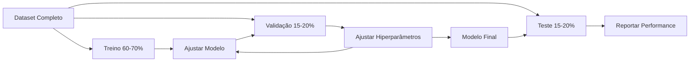

# Avaliação de Modelos

> Um modelo é tão bom quanto a forma como você o mede.

**Tipo:** Build
**Linguagens:** Python
**Pré-requisitos:** Fase 1 (Probabilidade & Distribuições, Estatística para ML), Fase 2 Aulas 1-8
**Tempo:** ~90 minutos

## Objetivos de Aprendizado

- Implementar validação cruzada K-fold e estratificada do zero e explicar por que a estratificação importa para dados desbalanceados
- Calcular precisão, recall, F1, AUC-ROC e métricas de regressão (MSE, RMSE, MAE, R-squared) do zero
- Interpretar curvas de aprendizado para diagnosticar se um modelo sofre de viés alto ou variância alta
- Identificar erros comuns de avaliação incluindo vazamento de dados, seleção errada de métrica e contaminação do conjunto de teste

## O Problema

Você treinou um modelo. Ele tem 95% de acurácia nos seus dados. É bom?

Talvez. Talvez não. Se 95% dos seus dados pertencem a uma classe, um modelo que sempre prevê essa classe tem 95% de acurácia sendo completamente inútil. Se você avaliou nos mesmos dados que usou para treinar, o número 95% não significa nada porque o modelo apenas memorizou as respostas. Se seu dataset tem um componente temporal e você embaralhou aleatoriamente antes de dividir, seu modelo pode estar usando dados futuros para prever o passado.

Avaliação de modelo é onde a maioria dos projetos de ML dá errado. A métrica errada faz um modelo ruim parecer bom. A divisão errada deixa o modelo trapacear. A comparação errada faz você escolher o pior modelo. Fazer a avaliação correta não é opcional. É a diferença entre um modelo que funciona em produção e um que falha no momento em que vê dados reais.

## O Conceito

### Treino, Validação, Teste



Três divisões, três propósitos:

- **Conjunto de treino**: o modelo aprende com esses dados. Ele vê esses exemplos durante o treinamento.
- **Conjunto de validação**: usado para ajustar hiperparâmetros e selecionar entre modelos. O modelo nunca treina nesses dados, mas suas decisões são influenciadas por eles.
- **Conjunto de teste**: tocado exatamente uma vez, bem no final, para reportar a performance final. Se você olhar a performance no teste e depois voltar para mudar seu modelo, ele não é mais um conjunto de teste. Virou um segundo conjunto de validação.

O conjunto de teste é sua garantia de que a performance reportada reflete como o modelo se sairá em dados verdadeiramente não vistos.

### Validação Cruzada K-Fold

Com datasets pequenos, uma única divisão treino/validação desperdiça dados e dá estimativas ruidosas. A validação cruzada K-fold usa todos os dados tanto para treino quanto para validação:

```mermaid
flowchart TB
    subgraph Fold1["Dobra 1"]
        direction LR
        V1["Val"] --- T1a["Treino"] --- T1b["Treino"] --- T1c["Treino"] --- T1d["Treino"]
    end
    subgraph Fold2["Dobra 2"]
        direction LR
        T2a["Treino"] --- V2["Val"] --- T2b["Treino"] --- T2c["Treino"] --- T2d["Treino"]
    end
    subgraph Fold3["Dobra 3"]
        direction LR
        T3a["Treino"] --- T3b["Treino"] --- V3["Val"] --- T3c["Treino"] --- T3d["Treino"]
    end
    subgraph Fold4["Dobra 4"]
        direction LR
        T4a["Treino"] --- T4b["Treino"] --- T4c["Treino"] --- V4["Val"] --- T4d["Treino"]
    end
    subgraph Fold5["Dobra 5"]
        direction LR
        T5a["Treino"] --- T5b["Treino"] --- T5c["Treino"] --- T5d["Treino"] --- V5["Val"]
    end
    Fold1 --> R[Média dos scores]
    Fold2 --> R
    Fold3 --> R
    Fold4 --> R
    Fold5 --> R
```



1. Divida os dados em K dobras de tamanho igual
2. Para cada dobra, treine em K-1 dobras e valide na dobra restante
3. Calcule a média dos K scores de validação

K=5 ou K=10 são escolhas padrão. Cada ponto de dados é usado para validação exatamente uma vez. A média dos scores é uma estimativa mais estável do que qualquer divisão única.

**K-fold estratificada**: preserva a distribuição das classes em cada dobra. Se seu dataset tem 70% classe A e 30% classe B, cada dobra terá aproximadamente a mesma proporção. Isso é importante para datasets desbalanceados onde uma divisão aleatória poderia colocar todas as amostras minoritárias em uma única dobra.

### Métricas de Classificação

**Matriz de confusão**: a fundação. Para classificação binária:

|  | Previsto Positivo | Previsto Negativo |
|--|---|---|
| Real Positivo | Verdadeiro Positivo (VP) | Falso Negativo (FN) |
| Real Negativo | Falso Positivo (FP) | Verdadeiro Negativo (VN) |

A partir desta matriz, todas as outras métricas derivam:

- **Acurácia** = (VP + VN) / (VP + VN + FP + FN). Fração de previsões corretas. Enganosa quando as classes são desbalanceadas.
- **Precisão** = VP / (VP + FP). De todas as coisas previstas como positivas, quantas realmente eram? Use quando falsos positivos são custosos (ex: filtro de spam marcando email real como spam).
- **Recall** (sensibilidade) = VP / (VP + FN). De todos os positivos reais, quantos pegamos? Use quando falsos negativos são custosos (ex: triagem de câncer perdendo um tumor).
- **F1 score** = 2 * precisão * recall / (precisão + recall). Média harmônica de precisão e recall. Equilibra ambos quando nenhum domina claramente.
- **AUC-ROC**: Área sob a curva Receiver Operating Characteristic. Plota a taxa de verdadeiros positivos vs taxa de falsos positivos em vários limiares de classificação. AUC = 0.5 significa chute aleatório, AUC = 1.0 significa separação perfeita. Independente de limiar: mede quão bem o modelo classifica positivos acima de negativos, independentemente do ponto de corte que você escolher.

### Métricas de Regressão

- **MSE** (Mean Squared Error) = média((y_real - y_pred)^2). Penaliza erros grandes quadraticamente. Sensível a outliers.
- **RMSE** (Root Mean Squared Error) = sqrt(MSE). Mesmas unidades da variável alvo. Mais fácil de interpretar que MSE.
- **MAE** (Mean Absolute Error) = média(|y_real - y_pred|). Trata todos os erros linearmente. Mais robusto a outliers que MSE.
- **R-squared** = 1 - SQ_res / SQ_tot, onde SQ_res = soma((y_real - y_pred)^2) e SQ_tot = soma((y_real - y_média)^2). Fração da variância explicada pelo modelo. R² = 1.0 é perfeito. R² = 0.0 significa que o modelo não é melhor que sempre prever a média. R² pode ser negativo se o modelo for pior que a média.

### Curvas de Aprendizado

Plote os scores de treino e validação em função do tamanho do conjunto de treino:

- **Viés alto (underfitting)**: ambas as curvas convergem para um score baixo. Adicionar mais dados não vai ajudar. Você precisa de um modelo mais complexo.
- **Variância alta (overfitting)**: o score de treino é alto mas o score de validação é muito menor. A lacuna entre eles é grande. Adicionar mais dados deve ajudar.

### Curvas de Validação

Plote os scores de treino e validação em função de um hiperparâmetro:

- Em baixa complexidade: ambos os scores são baixos (underfitting)
- Na complexidade certa: ambos os scores são altos e próximos
- Em alta complexidade: o score de treino continua alto mas o score de validação cai (overfitting)

O valor ótimo do hiperparâmetro é onde o score de validação atinge o pico.

### Erros Comuns de Avaliação

**Vazamento de dados**: informação do conjunto de teste vaza para o treino. Exemplos: ajustar um escalador no dataset completo antes de dividir, incluir dados futuros em previsão de séries temporais, usar uma feature derivada do alvo. Sempre divida primeiro, depois pré-processe.

**Desbalanceamento de classes**: 99% das transações são legítimas, 1% são fraude. Um modelo que sempre prevê "legítima" tem 99% de acurácia. Use precisão, recall, F1 ou AUC-ROC.

**Métrica errada**: otimizar acurácia quando você deveria otimizar recall (diagnóstico médico), ou otimizar RMSE quando seus dados têm outliers pesados (use MAE).

**Não usar divisões estratificadas**: com dados desbalanceados, uma divisão aleatória pode colocar muito poucas amostras minoritárias na dobra de validação, dando estimativas instáveis.

**Testar com muita frequência**: toda vez que você olha a performance no teste e ajusta, você overfitta o conjunto de teste. O conjunto de teste é de uso único.

## Construa

### Passo 1: Divisão treino/validação/teste

```python
import random
import math


def train_val_test_split(X, y, train_ratio=0.6, val_ratio=0.2, seed=42):
    random.seed(seed)
    n = len(X)
    indices = list(range(n))
    random.shuffle(indices)

    train_end = int(n * train_ratio)
    val_end = int(n * (train_ratio + val_ratio))

    train_idx = indices[:train_end]
    val_idx = indices[train_end:val_end]
    test_idx = indices[val_end:]

    X_train = [X[i] for i in train_idx]
    y_train = [y[i] for i in train_idx]
    X_val = [X[i] for i in val_idx]
    y_val = [y[i] for i in val_idx]
    X_test = [X[i] for i in test_idx]
    y_test = [y[i] for i in test_idx]

    return X_train, y_train, X_val, y_val, X_test, y_test
```

### Passo 2: Validação cruzada K-fold e estratificada

```python
def kfold_split(n, k=5, seed=42):
    random.seed(seed)
    indices = list(range(n))
    random.shuffle(indices)

    fold_size = n // k
    folds = []

    for i in range(k):
        start = i * fold_size
        end = start + fold_size if i < k - 1 else n
        val_idx = indices[start:end]
        train_idx = indices[:start] + indices[end:]
        folds.append((train_idx, val_idx))

    return folds


def stratified_kfold_split(y, k=5, seed=42):
    random.seed(seed)

    class_indices = {}
    for i, label in enumerate(y):
        class_indices.setdefault(label, []).append(i)

    for label in class_indices:
        random.shuffle(class_indices[label])

    folds = [{"train": [], "val": []} for _ in range(k)]

    for label, indices in class_indices.items():
        fold_size = len(indices) // k
        for i in range(k):
            start = i * fold_size
            end = start + fold_size if i < k - 1 else len(indices)
            val_part = indices[start:end]
            train_part = indices[:start] + indices[end:]
            folds[i]["val"].extend(val_part)
            folds[i]["train"].extend(train_part)

    return [(f["train"], f["val"]) for f in folds]


def cross_validate(X, y, model_fn, k=5, metric_fn=None, stratified=False):
    n = len(X)

    if stratified:
        folds = stratified_kfold_split(y, k)
    else:
        folds = kfold_split(n, k)

    scores = []
    for train_idx, val_idx in folds:
        X_train = [X[i] for i in train_idx]
        y_train = [y[i] for i in train_idx]
        X_val = [X[i] for i in val_idx]
        y_val = [y[i] for i in val_idx]

        model = model_fn()
        model.fit(X_train, y_train)
        predictions = [model.predict(x) for x in X_val]

        if metric_fn:
            score = metric_fn(y_val, predictions)
        else:
            score = sum(1 for yt, yp in zip(y_val, predictions) if yt == yp) / len(y_val)
        scores.append(score)

    return scores
```

### Passo 3: Matriz de confusão e métricas de classificação

```python
def confusion_matrix(y_true, y_pred):
    tp = sum(1 for yt, yp in zip(y_true, y_pred) if yt == 1 and yp == 1)
    tn = sum(1 for yt, yp in zip(y_true, y_pred) if yt == 0 and yp == 0)
    fp = sum(1 for yt, yp in zip(y_true, y_pred) if yt == 0 and yp == 1)
    fn = sum(1 for yt, yp in zip(y_true, y_pred) if yt == 1 and yp == 0)
    return tp, tn, fp, fn


def accuracy(y_true, y_pred):
    tp, tn, fp, fn = confusion_matrix(y_true, y_pred)
    total = tp + tn + fp + fn
    return (tp + tn) / total if total > 0 else 0.0


def precision(y_true, y_pred):
    tp, tn, fp, fn = confusion_matrix(y_true, y_pred)
    return tp / (tp + fp) if (tp + fp) > 0 else 0.0


def recall(y_true, y_pred):
    tp, tn, fp, fn = confusion_matrix(y_true, y_pred)
    return tp / (tp + fn) if (tp + fn) > 0 else 0.0


def f1_score(y_true, y_pred):
    p = precision(y_true, y_pred)
    r = recall(y_true, y_pred)
    return 2 * p * r / (p + r) if (p + r) > 0 else 0.0


def roc_curve(y_true, y_scores):
    thresholds = sorted(set(y_scores), reverse=True)
    tpr_list = []
    fpr_list = []

    total_positives = sum(y_true)
    total_negatives = len(y_true) - total_positives

    for threshold in thresholds:
        y_pred = [1 if s >= threshold else 0 for s in y_scores]
        tp = sum(1 for yt, yp in zip(y_true, y_pred) if yt == 1 and yp == 1)
        fp = sum(1 for yt, yp in zip(y_true, y_pred) if yt == 0 and yp == 1)

        tpr = tp / total_positives if total_positives > 0 else 0.0
        fpr = fp / total_negatives if total_negatives > 0 else 0.0

        tpr_list.append(tpr)
        fpr_list.append(fpr)

    return fpr_list, tpr_list, thresholds


def auc_roc(y_true, y_scores):
    fpr_list, tpr_list, _ = roc_curve(y_true, y_scores)

    pairs = sorted(zip(fpr_list, tpr_list))
    fpr_sorted = [p[0] for p in pairs]
    tpr_sorted = [p[1] for p in pairs]

    area = 0.0
    for i in range(1, len(fpr_sorted)):
        width = fpr_sorted[i] - fpr_sorted[i - 1]
        height = (tpr_sorted[i] + tpr_sorted[i - 1]) / 2
        area += width * height

    return area
```

### Passo 4: Métricas de regressão

```python
def mse(y_true, y_pred):
    n = len(y_true)
    return sum((yt - yp) ** 2 for yt, yp in zip(y_true, y_pred)) / n


def rmse(y_true, y_pred):
    return math.sqrt(mse(y_true, y_pred))


def mae(y_true, y_pred):
    n = len(y_true)
    return sum(abs(yt - yp) for yt, yp in zip(y_true, y_pred)) / n


def r_squared(y_true, y_pred):
    mean_y = sum(y_true) / len(y_true)
    ss_res = sum((yt - yp) ** 2 for yt, yp in zip(y_true, y_pred))
    ss_tot = sum((yt - mean_y) ** 2 for yt in y_true)
    if ss_tot == 0:
        return 0.0
    return 1.0 - ss_res / ss_tot
```

### Passo 5: Curvas de aprendizado

```python
def learning_curve(X, y, model_fn, metric_fn, train_sizes=None, val_ratio=0.2, seed=42):
    random.seed(seed)
    n = len(X)
    indices = list(range(n))
    random.shuffle(indices)

    val_size = int(n * val_ratio)
    val_idx = indices[:val_size]
    pool_idx = indices[val_size:]

    X_val = [X[i] for i in val_idx]
    y_val = [y[i] for i in val_idx]

    if train_sizes is None:
        train_sizes = [int(len(pool_idx) * r) for r in [0.1, 0.2, 0.4, 0.6, 0.8, 1.0]]

    train_scores = []
    val_scores = []

    for size in train_sizes:
        subset = pool_idx[:size]
        X_train = [X[i] for i in subset]
        y_train = [y[i] for i in subset]

        model = model_fn()
        model.fit(X_train, y_train)

        train_pred = [model.predict(x) for x in X_train]
        val_pred = [model.predict(x) for x in X_val]

        train_scores.append(metric_fn(y_train, train_pred))
        val_scores.append(metric_fn(y_val, val_pred))

    return train_sizes, train_scores, val_scores
```

### Passo 6: Um classificador simples para teste, mais a demo completa

```python
class SimpleLogistic:
    def __init__(self, lr=0.1, epochs=100):
        self.lr = lr
        self.epochs = epochs
        self.weights = None
        self.bias = 0.0

    def sigmoid(self, z):
        z = max(-500, min(500, z))
        return 1.0 / (1.0 + math.exp(-z))

    def fit(self, X, y):
        n_features = len(X[0])
        self.weights = [0.0] * n_features
        self.bias = 0.0

        for _ in range(self.epochs):
            for xi, yi in zip(X, y):
                z = sum(w * x for w, x in zip(self.weights, xi)) + self.bias
                pred = self.sigmoid(z)
                error = yi - pred
                for j in range(n_features):
                    self.weights[j] += self.lr * error * xi[j]
                self.bias += self.lr * error

    def predict_proba(self, x):
        z = sum(w * xi for w, xi in zip(self.weights, x)) + self.bias
        return self.sigmoid(z)

    def predict(self, x):
        return 1 if self.predict_proba(x) >= 0.5 else 0


class SimpleLinearRegression:
    def __init__(self, lr=0.001, epochs=200):
        self.lr = lr
        self.epochs = epochs
        self.weights = None
        self.bias = 0.0

    def fit(self, X, y):
        n_features = len(X[0])
        self.weights = [0.0] * n_features
        self.bias = 0.0
        n = len(X)

        for _ in range(self.epochs):
            for xi, yi in zip(X, y):
                pred = sum(w * x for w, x in zip(self.weights, xi)) + self.bias
                error = yi - pred
                for j in range(n_features):
                    self.weights[j] += self.lr * error * xi[j] / n
                self.bias += self.lr * error / n

    def predict(self, x):
        return sum(w * xi for w, xi in zip(self.weights, x)) + self.bias


def standardize(values):
    n = len(values)
    mean = sum(values) / n
    var = sum((v - mean) ** 2 for v in values) / n
    std = math.sqrt(var) if var > 0 else 1.0
    return [(v - mean) / std for v in values], mean, std


def make_classification_data(n=300, seed=42):
    random.seed(seed)
    X = []
    y = []
    for _ in range(n):
        x1 = random.gauss(0, 1)
        x2 = random.gauss(0, 1)
        label = 1 if (x1 + x2 + random.gauss(0, 0.5)) > 0 else 0
        X.append([x1, x2])
        y.append(label)
    return X, y


def make_regression_data(n=200, seed=42):
    random.seed(seed)
    X = []
    y = []
    for _ in range(n):
        x1 = random.uniform(0, 10)
        x2 = random.uniform(0, 5)
        target = 3 * x1 + 2 * x2 + random.gauss(0, 2)
        X.append([x1, x2])
        y.append(target)
    return X, y


def make_imbalanced_data(n=300, minority_ratio=0.05, seed=42):
    random.seed(seed)
    X = []
    y = []
    for _ in range(n):
        if random.random() < minority_ratio:
            x1 = random.gauss(3, 0.5)
            x2 = random.gauss(3, 0.5)
            label = 1
        else:
            x1 = random.gauss(0, 1)
            x2 = random.gauss(0, 1)
            label = 0
        X.append([x1, x2])
        y.append(label)
    return X, y


if __name__ == "__main__":
    X_clf, y_clf = make_classification_data(300)

    print("=== Divisão Treino/Validação/Teste ===")
    X_train, y_train, X_val, y_val, X_test, y_test = train_val_test_split(X_clf, y_clf)
    print(f"  Treino: {len(X_train)}, Val: {len(X_val)}, Teste: {len(X_test)}")
    print(f"  Distribuição Treino: {sum(y_train)}/{len(y_train)} positivos")
    print(f"  Distribuição Val: {sum(y_val)}/{len(y_val)} positivos")

    model = SimpleLogistic(lr=0.1, epochs=200)
    model.fit(X_train, y_train)

    print("\n=== Métricas de Classificação ===")
    y_pred = [model.predict(x) for x in X_test]
    tp, tn, fp, fn = confusion_matrix(y_test, y_pred)
    print(f"  Matriz de confusão: VP={tp}, VN={tn}, FP={fp}, FN={fn}")
    print(f"  Acurácia:  {accuracy(y_test, y_pred):.4f}")
    print(f"  Precisão: {precision(y_test, y_pred):.4f}")
    print(f"  Recall:    {recall(y_test, y_pred):.4f}")
    print(f"  F1 Score:  {f1_score(y_test, y_pred):.4f}")

    y_scores = [model.predict_proba(x) for x in X_test]
    auc = auc_roc(y_test, y_scores)
    print(f"  AUC-ROC:   {auc:.4f}")

    print("\n=== Validação Cruzada K-Fold (K=5) ===")
    cv_scores = cross_validate(
        X_clf, y_clf,
        model_fn=lambda: SimpleLogistic(lr=0.1, epochs=200),
        k=5,
        metric_fn=accuracy,
    )
    mean_cv = sum(cv_scores) / len(cv_scores)
    std_cv = math.sqrt(sum((s - mean_cv) ** 2 for s in cv_scores) / len(cv_scores))
    print(f"  Scores das dobras: {[round(s, 4) for s in cv_scores]}")
    print(f"  Média: {mean_cv:.4f} (+/- {std_cv:.4f})")

    print("\n=== Validação Cruzada Estratificada (K=5) ===")
    strat_scores = cross_validate(
        X_clf, y_clf,
        model_fn=lambda: SimpleLogistic(lr=0.1, epochs=200),
        k=5,
        metric_fn=accuracy,
        stratified=True,
    )
    strat_mean = sum(strat_scores) / len(strat_scores)
    strat_std = math.sqrt(sum((s - strat_mean) ** 2 for s in strat_scores) / len(strat_scores))
    print(f"  Scores das dobras: {[round(s, 4) for s in strat_scores]}")
    print(f"  Média: {strat_mean:.4f} (+/- {strat_std:.4f})")

    print("\n=== Dados Desbalanceados: Por que Acurácia Mente ===")
    X_imb, y_imb = make_imbalanced_data(300, minority_ratio=0.05)
    positives = sum(y_imb)
    print(f"  Distribuição: {positives} positivos, {len(y_imb) - positives} negativos ({positives/len(y_imb)*100:.1f}% positivos)")

    always_negative = [0] * len(y_imb)
    print(f"  Baseline sempre-negativo:")
    print(f"    Acurácia:  {accuracy(y_imb, always_negative):.4f}")
    print(f"    Precisão: {precision(y_imb, always_negative):.4f}")
    print(f"    Recall:    {recall(y_imb, always_negative):.4f}")
    print(f"    F1 Score:  {f1_score(y_imb, always_negative):.4f}")

    X_tr_i, y_tr_i, X_v_i, y_v_i, X_te_i, y_te_i = train_val_test_split(X_imb, y_imb)
    model_imb = SimpleLogistic(lr=0.5, epochs=500)
    model_imb.fit(X_tr_i, y_tr_i)
    y_pred_imb = [model_imb.predict(x) for x in X_te_i]
    print(f"\n  Modelo treinado em dados desbalanceados:")
    print(f"    Acurácia:  {accuracy(y_te_i, y_pred_imb):.4f}")
    print(f"    Precisão: {precision(y_te_i, y_pred_imb):.4f}")
    print(f"    Recall:    {recall(y_te_i, y_pred_imb):.4f}")
    print(f"    F1 Score:  {f1_score(y_te_i, y_pred_imb):.4f}")

    print("\n=== Métricas de Regressão ===")
    X_reg, y_reg = make_regression_data(200)

    col0 = [x[0] for x in X_reg]
    col1 = [x[1] for x in X_reg]
    col0_s, m0, s0 = standardize(col0)
    col1_s, m1, s1 = standardize(col1)
    X_reg_scaled = [[col0_s[i], col1_s[i]] for i in range(len(X_reg))]

    X_tr_r, y_tr_r, X_v_r, y_v_r, X_te_r, y_te_r = train_val_test_split(X_reg_scaled, y_reg)
    reg_model = SimpleLinearRegression(lr=0.01, epochs=500)
    reg_model.fit(X_tr_r, y_tr_r)
    y_pred_r = [reg_model.predict(x) for x in X_te_r]

    print(f"  MSE:       {mse(y_te_r, y_pred_r):.4f}")
    print(f"  RMSE:      {rmse(y_te_r, y_pred_r):.4f}")
    print(f"  MAE:       {mae(y_te_r, y_pred_r):.4f}")
    print(f"  R-squared: {r_squared(y_te_r, y_pred_r):.4f}")

    mean_baseline = [sum(y_tr_r) / len(y_tr_r)] * len(y_te_r)
    print(f"\n  Baseline da média:")
    print(f"    MSE:       {mse(y_te_r, mean_baseline):.4f}")
    print(f"    R-squared: {r_squared(y_te_r, mean_baseline):.4f}")

    print("\n=== Curva de Aprendizado ===")
    sizes, train_sc, val_sc = learning_curve(
        X_clf, y_clf,
        model_fn=lambda: SimpleLogistic(lr=0.1, epochs=200),
        metric_fn=accuracy,
    )
    print(f"  {'Tamanho':>6} {'Treino':>8} {'Val':>8}")
    for s, tr, va in zip(sizes, train_sc, val_sc):
        print(f"  {s:>6} {tr:>8.4f} {va:>8.4f}")

    print("\n=== Comparação Estatística de Modelos ===")
    model_a_scores = cross_validate(
        X_clf, y_clf,
        model_fn=lambda: SimpleLogistic(lr=0.1, epochs=100),
        k=5, metric_fn=accuracy,
    )
    model_b_scores = cross_validate(
        X_clf, y_clf,
        model_fn=lambda: SimpleLogistic(lr=0.1, epochs=500),
        k=5, metric_fn=accuracy,
    )
    diffs = [a - b for a, b in zip(model_a_scores, model_b_scores)]
    mean_diff = sum(diffs) / len(diffs)
    std_diff = math.sqrt(sum((d - mean_diff) ** 2 for d in diffs) / len(diffs))
    t_stat = mean_diff / (std_diff / math.sqrt(len(diffs))) if std_diff > 0 else 0.0
    print(f"  Modelo A (100 épocas) média: {sum(model_a_scores)/len(model_a_scores):.4f}")
    print(f"  Modelo B (500 épocas) média: {sum(model_b_scores)/len(model_b_scores):.4f}")
    print(f"  Diferença média: {mean_diff:.4f}")
    print(f"  Estatística t pareada: {t_stat:.4f}")
    print(f"  (|t| > 2.78 para significância em p<0.05 com df=4)")
```

## Use

Com scikit-learn, a avaliação já está integrada ao workflow:

```python
from sklearn.model_selection import cross_val_score, StratifiedKFold, learning_curve
from sklearn.metrics import (
    accuracy_score, precision_score, recall_score, f1_score,
    roc_auc_score, confusion_matrix, mean_squared_error, r2_score,
)
from sklearn.linear_model import LogisticRegression

model = LogisticRegression()
scores = cross_val_score(model, X, y, cv=StratifiedKFold(5), scoring="f1")
```

As versões feitas do zero mostram exatamente o que a validação cruzada faz (sem mágica, apenas loops e indexação), como cada métrica é computada (apenas contando VP/FP/VN/FN), e por que a estratificação importa (preservando proporções de classes em cada dobra). As versões de biblioteca adicionam paralelismo, mais opções de scoring e integração com pipelines.

## Entregue

Esta lição produz:
- `outputs/skill-evaluation.md` — uma skill cobrindo estratégia de avaliação para modelos de classificação e regressão

## Exercícios

1. Implemente curvas de precision-recall: plote precisão vs recall em diferentes limiares. Compute a precisão média (área sob a curva PR). Compare a curva PR com a curva ROC em um dataset desbalanceado e explique quando cada uma é mais informativa.
2. Construa um loop de validação cruzada aninhada: o loop externo avalia a performance do modelo, o loop interno ajusta hiperparâmetros. Use para comparar dois modelos de forma justa sem vazar dados de validação para a avaliação.
3. Implemente um teste de permutação para comparação de modelos: embaralhe os rótulos, re-treine e meça a performance. Repita 100 vezes para construir uma distribuição nula. Compute o p-valor para a performance observada do modelo contra esta distribuição.

## Termos-Chave

| Termo | O que o pessoal diz | O que realmente significa |
|-------|--------------------|-----------------------|
| Overfitting | "Memorizar os dados de treino" | O modelo captura ruído nos dados de treino, com bom desempenho no treino mas ruim em dados não vistos |
| Validação cruzada | "Testar em subconjuntos diferentes" | Rotacionar sistematicamente qual porção dos dados é usada para validação, calculando a média dos resultados |
| Precisão | "Quantos previstos como positivos estão corretos" | VP / (VP + FP): a fração de previsões positivas que são realmente positivas |
| Recall | "Quantos positivos reais encontramos" | VP / (VP + FN): a fração de positivos reais que foram corretamente identificados |
| AUC-ROC | "Quão bem o modelo separa as classes" | A área sob a curva da taxa de verdadeiros positivos vs taxa de falsos positivos em todos os limiares, de 0.5 (aleatório) a 1.0 (perfeito) |
| R-squared | "Quanta variância é explicada" | 1 - (soma dos resíduos ao quadrado / soma total dos quadrados): a fração da variância alvo capturada pelo modelo |
| Vazamento de dados | "O modelo trapaceou" | Usar informação durante o treino que não estaria disponível no momento da previsão, levando a uma avaliação otimista |
| Curva de aprendizado | "Como a performance muda com mais dados" | Um gráfico dos scores de treino e validação vs tamanho do conjunto de treino, revelando underfitting ou overfitting |
| Divisão estratificada | "Manter proporções de classes balanceadas" | Dividir os dados para que cada subconjunto tenha a mesma proporção de cada classe que o dataset completo |

## Leitura Adicional

- [scikit-learn Model Selection Guide](https://scikit-learn.org/stable/model_selection.html) — referência abrangente sobre validação cruzada, métricas e ajuste de hiperparâmetros
- [Beyond Accuracy: Precision and Recall (Google ML Crash Course)](https://developers.google.com/machine-learning/crash-course/classification/precision-and-recall) — explicação clara com exemplos interativos
- [A Survey of Cross-Validation Procedures (Arlot & Celisse, 2010)](https://projecteuclid.org/journals/statistics-surveys/volume-4/issue-none/A-survey-of-cross-validation-procedures-for-model-selection/10.1214/09-SS054.full) — tratamento rigoroso de quando e por que diferentes estratégias de CV funcionam
