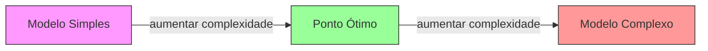
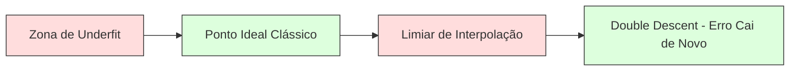
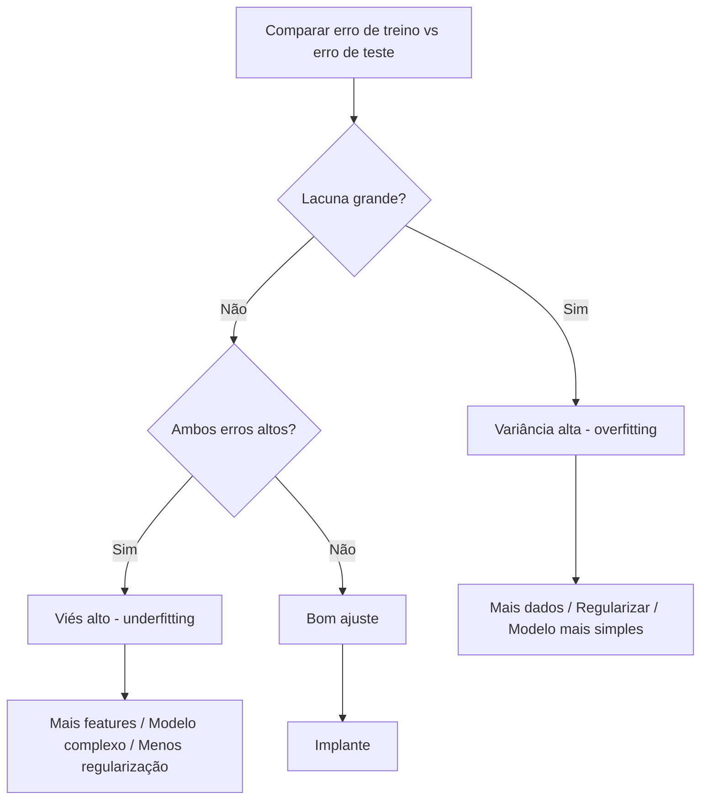
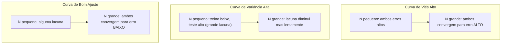
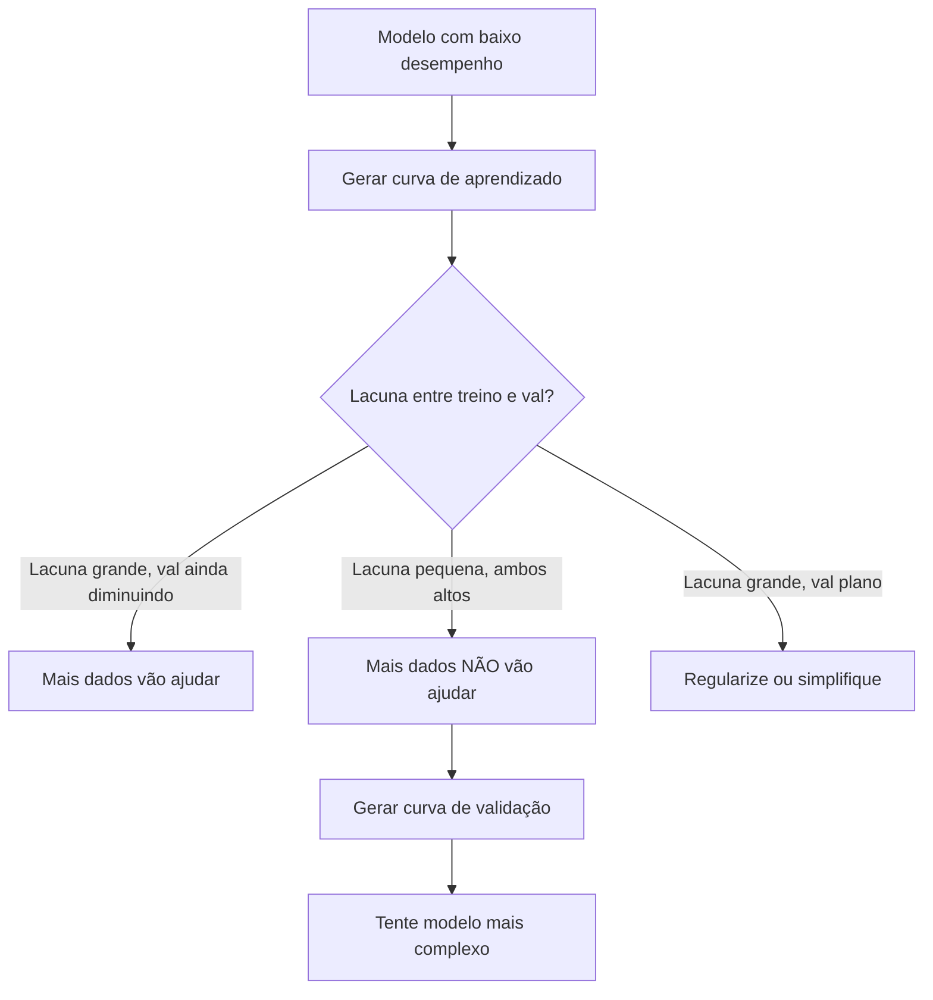

# Viés e Variância

> Todo erro de modelo vem de três fontes: viés, variância ou ruído. Você só pode controlar os dois primeiros.

**Tipo:** Learn
**Linguagens:** Python
**Pré-requisitos:** Fase 2, Aulas 01-09 (fundamentos de ML, regressão, classificação, avaliação)
**Tempo:** ~75 minutos

## Objetivos de Aprendizado

- Derivar a decomposição viés-variância do erro de predição esperado e explicar o papel do ruído irredutível
- Diagnosticar se um modelo sofre de viés alto ou variância alta usando padrões de erro de treino e teste
- Explicar como técnicas de regularização (L1, L2, dropout, early stopping) trocam viés por variância
- Implementar experimentos que visualizam o trade-off viés-variância em modelos de complexidade crescente

## O Problema

Você treinou um modelo. Ele tem algum erro nos dados de teste. De onde vem esse erro?

Se seu modelo é muito simples (regressão linear em um dataset curvo), ele vai consistentemente errar o padrão verdadeiro. Isso é viés. Se seu modelo é muito complexo (polinômio de grau 20 em 15 pontos de dados), ele vai ajustar perfeitamente os dados de treino mas dar previsões radicalmente diferentes em novos dados. Isso é variância.

Você não pode minimizar ambos ao mesmo tempo para uma capacidade fixa de modelo. Empurre o viés para baixo e a variância sobe. Empurre a variância para baixo e o viés sobe. Entender esse trade-off é a habilidade de diagnóstico mais útil em machine learning. Ele te diz se você deve tornar seu modelo mais complexo ou menos complexo, se deve obter mais dados ou criar melhores features, se deve regularizar mais ou menos.

## O Conceito

### Viés: Erro Sistemático

Viés mede quão longe a previsão média do seu modelo está do valor verdadeiro. Se você treinasse o mesmo modelo em muitos conjuntos de treino diferentes amostrados da mesma distribuição e calculasse a média das previsões, o viés é a lacuna entre essa média e a verdade.

Viés alto significa que o modelo é rígido demais para capturar o padrão real. Uma linha reta ajustada a uma parábola sempre vai errar a curva, não importa quantos dados você forneça. Isso é underfitting.

```
Viés alto (underfitting):
  Modelo sempre prevê aproximadamente a mesma coisa errada.
  Erro de treino: ALTO
  Erro de teste: ALTO
  Lacuna entre eles: PEQUENA
```

### Variância: Sensibilidade aos Dados de Treino

Variância mede o quanto suas previsões mudam quando você treina em diferentes subconjuntos de dados. Se pequenas mudanças no conjunto de treino causam grandes mudanças no modelo, a variância é alta.

Variância alta significa que o modelo está ajustando ruído nos dados de treino, não o sinal subjacente. Um polinômio de grau 20 vai passar por cada ponto de treino mas oscilar violentamente entre eles. Isso é overfitting.

```
Variância alta (overfitting):
  Modelo ajusta perfeitamente os dados de treino mas falha em novos dados.
  Erro de treino: BAIXO
  Erro de teste: ALTO
  Lacuna entre eles: GRANDE
```

### A Decomposição

Para qualquer ponto x, o erro de predição esperado sob perda quadrática se decompõe exatamente:

```
Erro Esperado = Viés^2 + Variância + Ruído Irredutível

onde:
  Viés^2   = (E[ŷ(x)] - f(x))^2
  Variância = E[(ŷ(x) - E[ŷ(x)])^2]
  Ruído    = E[(y - f(x))^2]             (sigma^2)
```

- `f(x)` é a função verdadeira
- `ŷ(x)` é a previsão do seu modelo
- `E[...]` é a esperança sobre diferentes conjuntos de treino
- `y` é o rótulo observado (função verdadeira mais ruído)

O termo de ruído é irredutível. Nenhum modelo pode fazer melhor que sigma^2 em dados ruidosos. Seu trabalho é encontrar o equilíbrio certo entre viés^2 e variância.

### Complexidade do Modelo vs Erro



A curva clássica em forma de U:

| Complexidade | Viés | Variância | Erro Total |
|-------------|------|-----------|------------|
| Muito baixa | ALTO | BAIXA | ALTO (underfitting) |
| Ideal | MODERADO | MODERADA | MENOR |
| Muito alta | BAIXO | ALTA | ALTO (overfitting) |

### Regularização como Controle Viés-Variância

A regularização aumenta deliberadamente o viés para reduzir a variância. Ela restringe o modelo para que ele não possa perseguir ruído.

- **L2 (Ridge):** Encolhe todos os pesos em direção a zero. Mantém todas as features mas reduz sua influência.
- **L1 (Lasso):** Empurra alguns pesos exatamente para zero. Realiza seleção de features.
- **Dropout:** Desativa neurônios aleatoriamente durante o treino. Força representações redundantes.
- **Early stopping:** Para o treino antes que o modelo se ajuste completamente aos dados de treino.

A força da regularização (lambda, taxa de dropout, número de épocas) controla diretamente onde você se situa na curva viés-variância. Mais regularização significa mais viés, menos variância.

### Double Descent: A Perspectiva Moderna

A teoria clássica diz: após o ponto ideal, mais complexidade sempre prejudica. Mas pesquisas desde 2019 mostraram algo inesperado. Se você continuar aumentando a capacidade do modelo muito além do limiar de interpolação (onde o modelo tem parâmetros suficientes para ajustar perfeitamente os dados de treino), o erro de teste pode diminuir novamente.



Esse fenômeno de "double descent" explica por que redes neurais massivamente superparametrizadas (com muito mais parâmetros que exemplos de treino) ainda generalizam bem. O trade-off viés-variância clássico não está errado, mas está incompleto para o regime moderno.

Observações chave sobre double descent:
- Acontece em modelos lineares, árvores de decisão e redes neurais
- Mais dados podem realmente prejudicar na região de interpolação (double descent por amostra)
- Mais épocas de treino também podem causá-lo (double descent por época)
- A regularização suaviza o pico mas não o elimina

Por que isso acontece? No limiar de interpolação, o modelo tem capacidade suficiente para ajustar todos os pontos de treino. Ele é forçado a uma solução muito específica que passa por cada ponto, e pequenas perturbações nos dados causam grandes mudanças no ajuste. É onde a variância atinge o pico. Além do limiar, o modelo tem muitas soluções possíveis que ajustam os dados perfeitamente. O algoritmo de aprendizado (por exemplo, gradiente descendente com regularização implícita) tende a escolher a mais simples entre elas. Esse viés implícito em direção a soluções simples é o motivo pelo qual modelos superparametrizados generalizam.

| Regime | Parâmetros vs Amostras | Comportamento |
|--------|----------------------|-------------|
| Subparametrizado | p << n | Trade-off clássico se aplica |
| Limiar de interpolação | p ~ n | Variância atinge pico, erro de teste dispara |
| Superparametrizado | p >> n | Regularização implícita entra em ação, erro de teste cai |

Para fins práticos: se você está usando redes neurais ou grandes ensembles de árvores, não pare no limiar de interpolação. Ou fique bem abaixo dele (com regularização explícita) ou vá bem além. O pior lugar é exatamente no limiar.

### Diagnosticando Seu Modelo



| Sintoma | Diagnóstico | Correção |
|---------|------------|----------|
| Erro treino alto, erro teste alto | Viés | Mais features, modelo complexo, menos regularização |
| Erro treino baixo, erro teste alto | Variância | Mais dados, regularização, modelo mais simples, dropout |
| Erro treino baixo, erro teste baixo | Bom ajuste | Implante |
| Erro treino diminuindo, erro teste aumentando | Overfitting em progresso | Early stopping |

### Estratégias Práticas

**Quando o problema é viés:**
- Adicione features polinomiais ou de interação
- Use um modelo mais flexível (ensemble de árvores ao invés de linear)
- Reduza a força da regularização
- Treine por mais tempo (se ainda não convergiu)

**Quando o problema é variância:**
- Obtenha mais dados de treino
- Use bagging (random forests)
- Aumente a regularização (lambda maior, mais dropout)
- Selecione features (remova features ruidosas)
- Use validação cruzada para detectar cedo

### Métodos Ensemble e Redução de Variância

Métodos ensemble são a ferramenta mais prática para combater a variância.

**Bagging (Bootstrap Aggregating)** treina múltiplos modelos em diferentes amostras bootstrap dos dados de treino, depois calcula a média de suas previsões. Cada modelo individual tem alta variância, mas a média tem variância muito menor. Random forests são bagging aplicado a árvores de decisão.

Por que funciona matematicamente: se você calcula a média de N previsões independentes, cada uma com variância sigma^2, a variância da média é sigma^2 / N. Os modelos não são verdadeiramente independentes (todos veem dados similares), então a redução é menor que 1/N, mas ainda é substancial.

**Boosting** reduz o viés construindo modelos sequencialmente, onde cada novo modelo foca nos erros do ensemble até então. Gradient boosting e AdaBoost são os principais exemplos. Boosting pode overfittar se você adicionar muitos modelos, então você precisa de early stopping ou regularização.

| Método | Efeito Primário | Mudança no Viés | Mudança na Variância |
|--------|----------------|----------------|---------------------|
| Bagging | Reduz variância | Nenhuma | Diminui |
| Boosting | Reduz viés | Diminui | Pode aumentar |
| Stacking | Reduz ambos | Depende do meta-learner | Depende dos modelos base |
| Dropout | Bagging implícito | Leve aumento | Diminui |

**Regra prática:** se seu modelo base tem alta variância (árvores profundas, polinômios de alto grau), use bagging. Se seu modelo base tem alto viés (stumps rasos, modelos lineares simples), use boosting.

### Curvas de Aprendizado

Curvas de aprendizado plotam o erro de treino e validação em função do tamanho do conjunto de treino. Elas são a ferramenta de diagnóstico mais prática que você tem. Diferente de uma comparação única treino/teste, as curvas de aprendizado mostram a trajetória do seu modelo e te dizem se mais dados vão ajudar.



Como interpretá-las:

| Cenário | Erro de Treino | Erro de Validação | Lacuna | O que significa | O que fazer |
|---------|---------------|-------------------|--------|-----------------|------------|
| Viés alto | Alto | Alto | Pequena | Modelo não captura o padrão | Mais features, modelo complexo, menos regularização |
| Variância alta | Baixo | Alto | Grande | Modelo memoriza dados de treino | Mais dados, regularização, modelo mais simples |
| Bom ajuste | Moderado | Moderado | Pequena | Modelo generaliza bem | Implante |
| Variância alta, melhorando | Baixo | Diminuindo com mais dados | Diminuindo | Problema de variância que dados podem corrigir | Colete mais dados |
| Viés alto, plano | Alto | Alto e plano | Pequena e plana | Mais dados NÃO vão ajudar | Mude a arquitetura do modelo |

A percepção crítica: se ambas as curvas estagnaram e a lacuna é pequena mas ambos os erros são altos, mais dados são inúteis. Você precisa de um modelo melhor. Se a lacuna é grande e ainda está diminuindo, mais dados vão ajudar.

### Como Gerar Curvas de Aprendizado

Existem duas abordagens:

**Abordagem 1: Variar tamanho do treino, modelo fixo.** Mantenha o modelo e os hiperparâmetros constantes. Treine em subconjuntos cada vez maiores dos dados de treino. Meça o erro de treino e validação em cada tamanho. Esta é a curva de aprendizado padrão.

**Abordagem 2: Variar complexidade do modelo, dados fixos.** Mantenha os dados constantes. Varie um parâmetro de complexidade (grau polinomial, profundidade da árvore, número de camadas). Meça o erro de treino e validação em cada complexidade. Esta é uma curva de validação e mostra o trade-off viés-variância diretamente.

Ambas as abordagens se complementam. A primeira te diz se mais dados vão ajudar. A segunda te diz se um modelo diferente vai ajudar. Execute ambas antes de tomar decisões sobre seu próximo passo.



## Construa

O código em `code/bias_variance.py` executa o experimento completo de decomposição viés-variância. Aqui está a abordagem, passo a passo.

### Passo 1: Gerar Dados Sintéticos de uma Função Conhecida

Usamos `f(x) = sin(1.5x) + 0.5x` com ruído Gaussiano. Conhecer a função verdadeira nos permite computar viés e variância exatos.

```python
def true_function(x):
    return np.sin(1.5 * x) + 0.5 * x

def generate_data(n_samples=30, noise_std=0.5, x_range=(-3, 3), seed=None):
    rng = np.random.RandomState(seed)
    x = rng.uniform(x_range[0], x_range[1], n_samples)
    y = true_function(x) + rng.normal(0, noise_std, n_samples)
    return x, y
```

### Passo 2: Amostragem Bootstrap e Ajuste Polinomial

Para cada grau polinomial, amostramos muitos conjuntos de treino bootstrap, ajustamos o polinômio e registramos previsões em uma grade de teste fixa. Isso nos dá uma distribuição de previsões em cada ponto de teste.

```python
def fit_polynomial(x_train, y_train, degree, lam=0.0):
    X = np.column_stack([x_train ** d for d in range(degree + 1)])
    if lam > 0:
        penalty = lam * np.eye(X.shape[1])
        penalty[0, 0] = 0
        w = np.linalg.solve(X.T @ X + penalty, X.T @ y_train)
    else:
        w = np.linalg.lstsq(X, y_train, rcond=None)[0]
    return w
```

Ajustamos em 200 amostras bootstrap diferentes. Cada amostra bootstrap é amostrada da mesma distribuição subjacente mas contém pontos diferentes.

### Passo 3: Computando a Decomposição Viés^2, Variância

Com 200 conjuntos de previsões em cada ponto de teste, podemos computar a decomposição diretamente da definição:

```python
mean_pred = predictions.mean(axis=0)
bias_sq = np.mean((mean_pred - y_true) ** 2)
variance = np.mean(predictions.var(axis=0))
total_error = np.mean(np.mean((predictions - y_true) ** 2, axis=1))
```

- `mean_pred` é E[ŷ(x)] estimado das amostras bootstrap
- `bias_sq` é a lacuna quadrática entre a previsão média e a verdade
- `variance` é a dispersão média das previsões entre as amostras bootstrap
- `total_error` deve ser aproximadamente igual a bias^2 + variance + noise

### Passo 4: Curvas de Aprendizado

Curvas de aprendizado variam o tamanho do conjunto de treino enquanto mantêm a complexidade do modelo fixa. Elas mostram se seu modelo é limitado por dados ou por capacidade.

```python
def demo_learning_curves():
    sizes = [10, 15, 20, 30, 50, 75, 100, 150, 200, 300]
    degree = 5

    for n in sizes:
        train_errors = []
        test_errors = []
        for seed in range(50):
            x_train, y_train = generate_data(n_samples=n, seed=seed * 100)
            w = fit_polynomial(x_train, y_train, degree)
            train_pred = predict_polynomial(x_train, w)
            train_mse = np.mean((train_pred - y_train) ** 2)
            test_pred = predict_polynomial(x_test, w)
            test_mse = np.mean((test_pred - y_test) ** 2)
            train_errors.append(train_mse)
            test_errors.append(test_mse)
        # A média sobre as execuções dá o ponto da curva de aprendizado
```

Para um modelo de alta variância (grau 5 com poucos dados), você vê:
- O erro de treino começa baixo e aumenta conforme mais dados tornam a memorização mais difícil
- O erro de teste começa alto e diminui conforme o modelo obtém mais sinal
- A lacuna diminui com mais dados

Para um modelo de alto viés (grau 1), ambos os erros convergem rapidamente para o mesmo valor alto e mais dados não ajudam.

### Passo 5: Varredura de Regularização

O código também inclui `demo_regularization_sweep()`, que fixa um polinômio de alto grau (grau 15) e varre a força da regularização Ridge de 0.001 a 100. Isso mostra o trade-off viés-variância de um ângulo diferente: em vez de variar a complexidade do modelo, variamos a força da restrição.

```python
def demo_regularization_sweep():
    alphas = [0.001, 0.005, 0.01, 0.05, 0.1, 0.5, 1.0, 5.0, 10.0, 50.0, 100.0]
    for alpha in alphas:
        results = bias_variance_decomposition([15], lam=alpha)
        r = results[15]
        print(f"alpha={alpha:.3f}  bias={r['bias_sq']:.4f}  var={r['variance']:.4f}")
```

Em alpha baixo, o polinômio de grau 15 está quase sem restrições. A variância domina porque o modelo persegue ruído em cada amostra bootstrap. Em alpha alto, a penalidade é tão forte que o modelo efetivamente se torna uma função quase constante. O viés domina. O alpha ótimo fica entre esses extremos.

Esta é a mesma curva U de variar o grau polinomial, mas controlada por um knob contínuo em vez de um discreto. Na prática, a regularização é a forma preferida de controlar o trade-off porque permite ajuste fino sem mudar o conjunto de features.

## Use

O sklearn fornece `learning_curve` e `validation_curve` para automatizar esses diagnósticos sem escrever loops bootstrap.

### Curva de Validação: Varra Complexidade do Modelo

```python
from sklearn.model_selection import validation_curve
from sklearn.pipeline import make_pipeline
from sklearn.preprocessing import PolynomialFeatures
from sklearn.linear_model import Ridge

degrees = list(range(1, 16))
train_scores_all = []
val_scores_all = []

for d in degrees:
    pipe = make_pipeline(PolynomialFeatures(d), Ridge(alpha=0.01))
    train_scores, val_scores = validation_curve(
        pipe, X, y, param_name="polynomialfeatures__degree",
        param_range=[d], cv=5, scoring="neg_mean_squared_error"
    )
    train_scores_all.append(-train_scores.mean())
    val_scores_all.append(-val_scores.mean())
```

Isso te dá a curva do trade-off viés-variância diretamente. Onde o score de validação é pior em relação ao score de treino, a variância domina. Onde ambos são ruins, o viés domina.

### Curva de Aprendizado: Varra Tamanho do Treino

```python
from sklearn.model_selection import learning_curve

pipe = make_pipeline(PolynomialFeatures(5), Ridge(alpha=0.01))
train_sizes, train_scores, val_scores = learning_curve(
    pipe, X, y, train_sizes=np.linspace(0.1, 1.0, 10),
    cv=5, scoring="neg_mean_squared_error"
)
train_mse = -train_scores.mean(axis=1)
val_mse = -val_scores.mean(axis=1)
```

Plote `train_mse` e `val_mse` contra `train_sizes`. A forma te conta tudo sobre seu modelo.

### Validação Cruzada com Varredura de Regularização

```python
from sklearn.model_selection import cross_val_score

alphas = [0.001, 0.01, 0.1, 1.0, 10.0, 100.0]
for alpha in alphas:
    pipe = make_pipeline(PolynomialFeatures(10), Ridge(alpha=alpha))
    scores = cross_val_score(pipe, X, y, cv=5, scoring="neg_mean_squared_error")
    print(f"alpha={alpha:>7.3f}  MSE={-scores.mean():.4f} +/- {scores.std():.4f}")
```

Isso varre a força da regularização para uma complexidade fixa de modelo. Você verá o mesmo trade-off viés-variância: alpha baixo significa variância alta, alpha alto significa viés alto.

### Juntando Tudo: Um Workflow de Diagnóstico Completo

Na prática, você executa esses diagnósticos em sequência:

1. Treine seu modelo. Compute erro de treino e teste.
2. Se ambos são altos: você tem um problema de viés. Pule para o passo 4.
3. Se treino é baixo mas teste é alto: você tem um problema de variância. Gere uma curva de aprendizado para ver se mais dados vão ajudar. Se não, regularize.
4. Gere uma curva de validação variando seu principal parâmetro de complexidade. Encontre o ponto ideal.
5. No ponto ideal, gere uma curva de aprendizado. Se a lacuna ainda é grande, você precisa de mais dados ou regularização.
6. Tente Ridge/Lasso com diferentes valores de alpha usando `cross_val_score`. Escolha o alpha onde o erro de validação cruzada é menor.

Isso leva 10-15 minutos de computação para a maioria dos datasets tabulares e economiza horas de adivinhação.

## Entregue

Esta lição produz: `outputs/prompt-model-diagnostics.md`

## Exercícios

1. Execute a decomposição com `noise_std=0` (sem ruído). O que acontece com o termo de erro irredutível? A complexidade ótima muda?
2. Aumente o tamanho do conjunto de treino de 30 para 300. Como isso afeta o componente de variância? O grau polinomial ótimo se desloca?
3. Adicione regularização L2 (regressão Ridge) ao experimento. Para um polinômio de alto grau fixo (grau 15), varra lambda de 0 a 100. Plote viés^2 e variância em função de lambda.
4. Modifique a função verdadeira de polinomial para `sin(x)`. Como a decomposição viés-variância muda? Ainda há um grau ótimo claro?
5. Implemente um wrapper simples de bootstrap aggregating (bagging): treine 10 modelos em amostras bootstrap e calcule a média das previsões. Mostre que isso reduz a variância sem aumentar muito o viés.

## Termos-Chave

| Termo | O que o pessoal diz | O que realmente significa |
|-------|--------------------|-----------------------|
| Viés | "O modelo é muito simples" | Erro sistemático de suposições erradas. A lacuna entre a previsão média do modelo e a verdade |
| Variância | "O modelo está overfitting" | Erro devido à sensibilidade aos dados de treino. O quanto as previsões mudam entre diferentes conjuntos de treino |
| Erro irredutível | "Ruído nos dados" | Erro da aleatoriedade inerente ao processo gerador dos dados. Nenhum modelo pode eliminá-lo |
| Underfitting | "Não aprender o suficiente" | Modelo tem viés alto. Erra o padrão real mesmo nos dados de treino |
| Overfitting | "Memorizar os dados" | Modelo tem variância alta. Ajusta ruído nos dados de treino que não generaliza |
| Regularização | "Restringir o modelo" | Adicionar uma penalidade para reduzir a complexidade do modelo, trocando viés por menor variância |
| Double descent | "Mais parâmetros podem ajudar" | O erro de teste diminui novamente quando a capacidade do modelo excede em muito o limiar de interpolação |
| Complexidade do modelo | "Quão flexível o modelo é" | A capacidade de um modelo de ajustar padrões arbitrários. Controlada por arquitetura, features ou regularização |

## Leitura Adicional

- [Hastie, Tibshirani, Friedman: Elements of Statistical Learning, Ch. 7](https://hastie.su.domains/ElemStatLearn/) — o tratamento definitivo da decomposição viés-variância
- [Belkin et al., Reconciling modern machine learning practice and the bias-variance trade-off (2019)](https://arxiv.org/abs/1812.11118) — o paper do double descent
- [Nakkiran et al., Deep Double Descent (2019)](https://arxiv.org/abs/1912.02292) — double descent por época e por amostra
- [Scott Fortmann-Roe: Understanding the Bias-Variance Tradeoff](http://scott.fortmann-roe.com/docs/BiasVariance.html) — explicação visual clara
