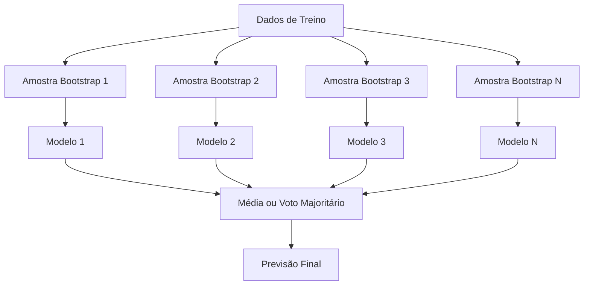
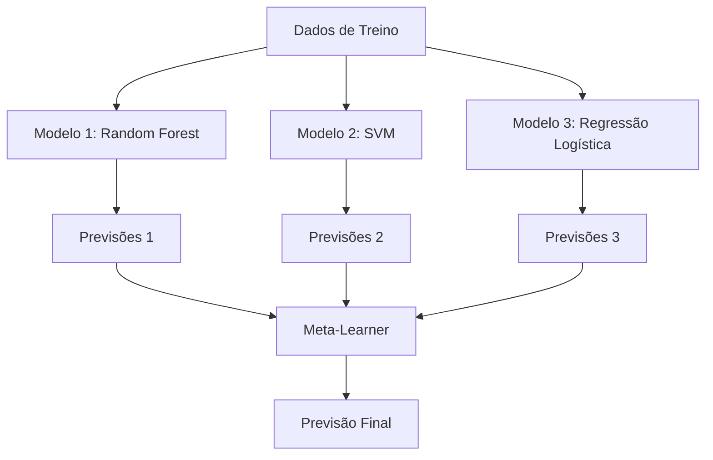

# Métodos Ensemble

> Um grupo de aprendizes fracos, combinados corretamente, se torna um aprendiz forte. Isso não é metáfora. É um teorema.

**Tipo:** Build
**Linguagens:** Python
**Pré-requisitos:** Fase 2, Aula 10 (Tradeoff Viés-Variância)
**Tempo:** ~120 minutos

## Objetivos de Aprendizado

- Implementar AdaBoost e gradient boosting do zero e explicar como boosting reduz viés sequencialmente
- Construir um ensemble bagging e demonstrar como média de modelos descorrelacionados reduz variância sem aumentar viés
- Comparar bagging, boosting e stacking em termos de qual componente de erro cada método ataca
- Avaliar diversidade de ensemble e explicar por que acurácia de voto majoritário melhora com mais aprendizes fracos independentes

## O Problema

Uma única árvore de decisão é rápida pra treinar e fácil de interpretar, mas faz overfitting. Um único modelo linear subajusta em fronteiras complexas. Você poderia gastar dias projetando a arquitetura perfeita do modelo. Ou poderia combinar um monte de modelos imperfeitos e conseguir algo melhor que qualquer um individualmente.

Métodos ensemble fazem exatamente isso. São a técnica mais confiável para vencer competições Kaggle em dados tabulares, alimentam a maioria dos sistemas de ML em produção e ilustram o tradeoff viés-variância em ação. Bagging reduz variância. Boosting reduz viés. Stacking aprende quais modelos confiar em quais entradas.

## O Conceito

### Por Que Ensembles Funcionam

Suponha que você tem N classificadores independentes, cada um com acurácia p > 0.5. A acurácia do voto majoritário é:

```
P(maioria correta) = soma sobre k > N/2 de C(N,k) * p^k * (1-p)^(N-k)
```

Para 21 classificadores cada com 60% de acurácia, a acurácia do voto majoritário é cerca de 74%. Com 101 classificadores, sobe pra 84%. Os erros se cancelam quando os modelos cometem erros diferentes.

O requisito-chave é **diversidade**. Se todos os modelos fazem os mesmos erros, combiná-los não ajuda nada. Ensembles funcionam porque produzem modelos diversos através de:

- Subconjuntos diferentes de treino (bagging)
- Subconjuntos diferentes de features (random forests)
- Correção sequencial de erros (boosting)
- Famílias diferentes de modelos (stacking)

### Bagging (Agregação Bootstrap)

Bagging cria diversidade treinando cada modelo em uma amostra bootstrap diferente dos dados de treino.



Uma amostra bootstrap é feita com reposição a partir dos dados originais, mesmo tamanho que o original. Cerca de 63,2% das amostras únicas aparecem em cada bootstrap. Os 36,8% restantes (amostras out-of-bag) fornecem um conjunto de validação gratuito.

Bagging reduz variância sem aumentar viés muito. Cada árvore individual faz overfitting na sua amostra bootstrap, mas o overfitting é diferente para cada árvore, então a média cancela o ruído.

**Random Forests** são bagging com um toque extra: a cada divisão, apenas um subconjunto aleatório de features é considerado. Isso força ainda mais diversidade entre as árvores. O número típico de features candidatas é `sqrt(n_features)` para classificação e `n_features / 3` para regressão.

### Boosting (Correção Sequencial de Erros)

Boosting treina modelos sequencialmente. Cada novo modelo foca nos exemplos que os modelos anteriores erraram.


Boosting reduz viés. Cada novo modelo corrige os erros sistemáticos do ensemble até agora. A previsão final é uma soma ponderada de todos os modelos, onde modelos melhores recebem pesos maiores.

O tradeoff: boosting pode overfitting se você rodar muitas rodadas, porque continua ajustando exemplos difíceis, alguns dos quais podem ser ruído.

### AdaBoost

AdaBoost (Adaptive Boosting) foi o primeiro algoritmo de boosting prático. Funciona com qualquer aprendiz base, tipicamente stumps de decisão (árvores de profundidade 1).

O algoritmo:

```
1. Inicializar pesos das amostras: w_i = 1/N para todo i

2. Para t = 1 até T:
   a. Treinar aprendiz fraco h_t nos dados com pesos
   b. Calcular erro ponderado:
      err_t = soma(w_i * I(h_t(x_i) != y_i)) / soma(w_i)
   c. Calcular peso do modelo:
      alpha_t = 0.5 * ln((1 - err_t) / err_t)
   d. Atualizar pesos das amostras:
      w_i = w_i * exp(-alpha_t * y_i * h_t(x_i))
   e. Normalizar pesos para somar 1

3. Previsão final: H(x) = sign(soma(alpha_t * h_t(x)))
```

Modelos com erro menor recebem alpha maior. Amostras classificadas errado recebem pesos maiores para que o próximo modelo foque nelas.

### Gradient Boosting

Gradient boosting generaliza boosting para funções de perda arbitrárias. Em vez de reponderar amostras, ajusta cada novo modelo aos resíduos (gradiente negativo da perda) do ensemble atual.

```
1. Inicializar: F_0(x) = argmin_c soma(L(y_i, c))

2. Para t = 1 até T:
   a. Computar pseudo-resíduos:
      r_i = -dL(y_i, F_{t-1}(x_i)) / dF_{t-1}(x_i)
   b. Ajustar uma árvore h_t aos resíduos r_i
   c. Encontrar tamanho do passo ótimo:
      gamma_t = argmin_gamma soma(L(y_i, F_{t-1}(x_i) + gamma * h_t(x_i)))
   d. Atualizar:
      F_t(x) = F_{t-1}(x) + learning_rate * gamma_t * h_t(x)

3. Previsão final: F_T(x)
```

Para perda de erro quadrático, os pseudo-resíduos são apenas os resíduos reais: `r_i = y_i - F_{t-1}(x_i)`. Cada árvore literalmente ajusta os erros do ensemble anterior.

A taxa de aprendizado (shrinkage) controla quanto cada árvore contribui. Taxas menores exigem mais árvores mas generalizam melhor. Valores típicos: 0.01 a 0.3.

### XGBoost: Por Que Domina Dados Tabulares

XGBoost (eXtreme Gradient Boosting) é gradient boosting com otimizações de engenharia que o tornam rápido, preciso e resistente a overfitting:

- **Objetivo regularizado:** Penalidades L1 e L2 nos pesos das folhas impedem que árvores individuais sejam muito confiantes
- **Aproximação de segunda ordem:** Usa primeira e segunda derivadas da perda, dando melhores decisões de divisão
- **Divisões conscientes de esparsidade:** Lida com valores faltantes nativamente aprendendo a melhor direção para dados faltantes em cada divisão
- **Subamostragem de colunas:** Como random forests, amostra features a cada divisão para diversidade
- **Weighted quantile sketch:** Encontra pontos de divisão eficientemente para features contínuas em dados distribuídos
- **Estrutura de bloco cache-aware:** Layout de memória otimizado para linhas de cache da CPU

Para dados tabulares, XGBoost (e seu sucessor LightGBM) consistentemente supera redes neurais. Isso não vai mudar tão cedo. Se seus dados cabem numa tabela com linhas e colunas, comece com gradient boosting.

### Stacking (Meta-Learning)

Stacking usa as previsões de múltiplos modelos base como features para um meta-learner.



O meta-learner aprende em qual modelo base confiar para quais entradas. Se a random forest é melhor em certas regiões e a SVM em outras, o meta-learner aprenderá a rotear adequadamente.

Para evitar vazamento de dados, as previsões dos modelos base devem ser geradas via validação cruzada no conjunto de treino. Você nunca treina modelos base e gera meta-features nos mesmos dados.

### Voting

O ensemble mais simples. Apenas combine previsões diretamente.

- **Hard voting:** Voto majoritário nos rótulos das classes.
- **Soft voting:** Média das probabilidades previstas, escolha a classe com maior probabilidade média. Geralmente melhor porque usa informação de confiança.

## Construa

### Passo 1: Decision Stump (Aprendiz Base)

O código em `code/ensembles.py` implementa tudo do zero. Começamos com um decision stump: uma árvore com uma única divisão.

```python
class DecisionStump:
    def __init__(self):
        self.feature_idx = None
        self.threshold = None
        self.polarity = 1
        self.alpha = None

    def fit(self, X, y, weights):
        n_samples, n_features = X.shape
        best_error = float("inf")

        for f in range(n_features):
            thresholds = np.unique(X[:, f])
            for thresh in thresholds:
                for polarity in [1, -1]:
                    pred = np.ones(n_samples)
                    pred[polarity * X[:, f] < polarity * thresh] = -1
                    error = np.sum(weights[pred != y])
                    if error < best_error:
                        best_error = error
                        self.feature_idx = f
                        self.threshold = thresh
                        self.polarity = polarity

    def predict(self, X):
        n = X.shape[0]
        pred = np.ones(n)
        idx = self.polarity * X[:, self.feature_idx] < self.polarity * self.threshold
        pred[idx] = -1
        return pred
```

### Passo 2: AdaBoost Do Zero

```python
class AdaBoostScratch:
    def __init__(self, n_estimators=50):
        self.n_estimators = n_estimators
        self.stumps = []
        self.alphas = []

    def fit(self, X, y):
        n = X.shape[0]
        weights = np.full(n, 1 / n)

        for _ in range(self.n_estimators):
            stump = DecisionStump()
            stump.fit(X, y, weights)
            pred = stump.predict(X)

            err = np.sum(weights[pred != y])
            err = np.clip(err, 1e-10, 1 - 1e-10)

            alpha = 0.5 * np.log((1 - err) / err)
            weights *= np.exp(-alpha * y * pred)
            weights /= weights.sum()

            stump.alpha = alpha
            self.stumps.append(stump)
            self.alphas.append(alpha)

    def predict(self, X):
        total = sum(a * s.predict(X) for a, s in zip(self.alphas, self.stumps))
        return np.sign(total)
```

### Passo 3: Gradient Boosting Do Zero

```python
class GradientBoostingScratch:
    def __init__(self, n_estimators=100, learning_rate=0.1, max_depth=3):
        self.n_estimators = n_estimators
        self.lr = learning_rate
        self.max_depth = max_depth
        self.trees = []
        self.initial_pred = None

    def fit(self, X, y):
        self.initial_pred = np.mean(y)
        current_pred = np.full(len(y), self.initial_pred)

        for _ in range(self.n_estimators):
            residuals = y - current_pred
            tree = SimpleRegressionTree(max_depth=self.max_depth)
            tree.fit(X, residuals)
            update = tree.predict(X)
            current_pred += self.lr * update
            self.trees.append(tree)

    def predict(self, X):
        pred = np.full(X.shape[0], self.initial_pred)
        for tree in self.trees:
            pred += self.lr * tree.predict(X)
        return pred
```

### Passo 4: Compare com sklearn

O código verifica que nossas implementações do zero produzem acurácia similar à do `AdaBoostClassifier` e `GradientBoostingClassifier` do sklearn, e compara todos os métodos lado a lado.

## Use

### Quando Usar Qual Método

| Método | Reduz | Melhor para | Cuidado |
|--------|-------|-------------|---------|
| Bagging / Random Forest | Variância | Dados ruidosos, muitas features | Não ajuda com viés |
| AdaBoost | Viés | Dados limpos, aprendizes base simples | Sensível a outliers e ruído |
| Gradient Boosting | Viés | Dados tabulares, competições | Lento pra treinar, fácil de overfit sem ajuste |
| XGBoost / LightGBM | Ambos | ML tabular em produção | Muitos hiperparâmetros |
| Stacking | Ambos | Conseguir últimos 1-2% de accuracy | Complexo, risco de overfit no meta-learner |
| Voting | Variância | Combinação rápida de modelos diversos | Só ajuda se modelos forem diversos |

### A Stack de Produção para Dados Tabulares

Para a maioria dos problemas de predição tabular, esta é a ordem a tentar:

1. **LightGBM ou XGBoost** com parâmetros padrão
2. Ajuste n_estimators, learning_rate, max_depth, min_child_weight
3. Se você precisa dos últimos 0,5%, construa um ensemble stacking com 3-5 modelos diversos
4. Use validação cruzada durante todo o processo

Redes neurais em dados tabulares são quase sempre piores que gradient boosting, apesar de tentativas contínuas de pesquisa. TabNet, NODE e arquiteturas similares ocasionalmente igualam mas raramente superam um XGBoost bem ajustado.

## Entregue

Esta aula produz `outputs/prompt-ensemble-selector.md` — um prompt que ajuda a escolher o método ensemble certo para um dado dataset. Descreva seus dados (tamanho, tipos de feature, nível de ruído, balanceamento de classes) e o problema que você está resolvendo. O prompt percorre uma lista de verificação de decisão, recomenda um método, sugere hiperparâmetros iniciais e alerta sobre erros comuns para aquele método. Também produz `outputs/skill-ensemble-builder.md` com o guia de seleção completo.

## Exercícios

1. Modifique a implementação do AdaBoost pra rastrear accuracy de treino a cada rodada. Plote accuracy vs número de estimadores. Quando converge?
2. Implemente uma random forest do zero adicionando subamostragem aleatória de features à árvore de regressão. Treine 100 árvores com `max_features=sqrt(n_features)` e média das previsões. Compare a redução de variância com uma única árvore.
3. No gradient boosting, adicione early stopping: rastreie a loss de validação a cada rodada e pare quando não melhorar por 10 rodadas consecutivas. Quantas árvores ele realmente precisa?
4. Construa um ensemble stacking com três modelos base (regressão logística, árvore de decisão, k-vizinhos mais próximos) e um meta-learner de regressão logística. Use validação cruzada 5-fold para gerar meta-features. Compare com cada modelo base individualmente.
5. Rode XGBoost no mesmo dataset com parâmetros padrão. Compare sua accuracy com seu gradient boosting do zero. Cronometre ambos. Qual a diferença de velocidade?

## Termos-chave

| Termo | O que as pessoas dizem | O que realmente significa |
|-------|------------------------|---------------------------|
| Bagging | "Treinar em subconjuntos aleatórios" | Bootstrap aggregating: treinar modelos em amostras bootstrap, tirar média das previsões para reduzir variância |
| Boosting | "Focar em exemplos difíceis" | Treinar modelos sequencialmente, cada um corrigindo erros do ensemble até agora, para reduzir viés |
| AdaBoost | "Reponderar os dados" | Boosting via atualização de pesos das amostras; pontos classificados errado recebem peso maior para o próximo aprendiz |
| Gradient boosting | "Ajustar os resíduos" | Boosting via ajuste de cada novo modelo ao gradiente negativo da função de perda |
| XGBoost | "A arma do Kaggle" | Gradient boosting com regularização, otimização de segunda ordem e truques de velocidade a nível de sistema |
| Stacking | "Modelos sobre modelos" | Usar previsões de modelos base como features de entrada para um meta-learner |
| Random forest | "Muitas árvores aleatórias" | Bagging com árvores de decisão, adicionando subamostragem aleatória de features a cada divisão para diversidade |
| Diversidade de ensemble | "Cometer erros diferentes" | Modelos devem ser não-correlacionados em seus erros para o ensemble melhorar sobre os indivíduos |
| Erro out-of-bag | "Validação gratuita" | Amostras não sorteadas num bootstrap (~36,8%) servem como conjunto de validação sem precisar de holdout |

## Leitura Adicional

- [Schapire & Freund: Boosting: Foundations and Algorithms](https://mitpress.mit.edu/9780262526036/) — o livro dos criadores do AdaBoost
- [Friedman: Greedy Function Approximation: A Gradient Boosting Machine (2001)](https://statweb.stanford.edu/~jhf/ftp/trebst.pdf) — o paper original de gradient boosting
- [Chen & Guestrin: XGBoost (2016)](https://arxiv.org/abs/1603.02754) — o paper do XGBoost
- [Wolpert: Stacked Generalization (1992)](https://www.sciencedirect.com/science/article/abs/pii/S0893608005800231) — o paper original de stacking
- [scikit-learn Ensemble Methods](https://scikit-learn.org/stable/modules/ensemble.html) — referência prática
