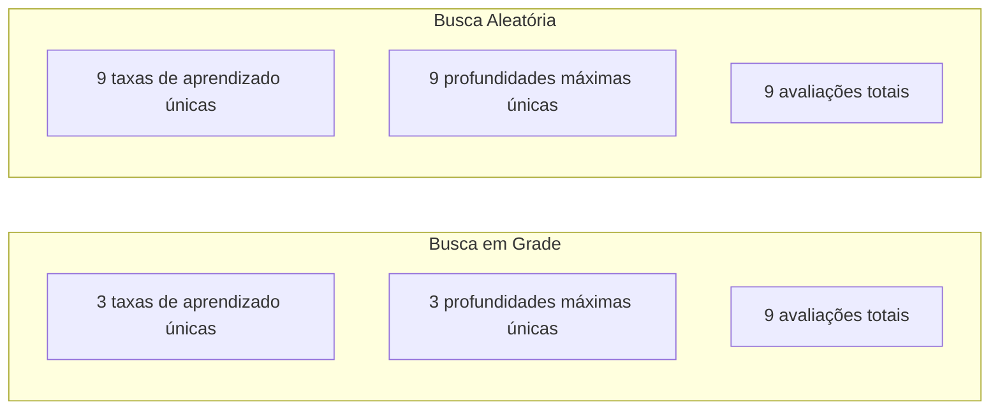
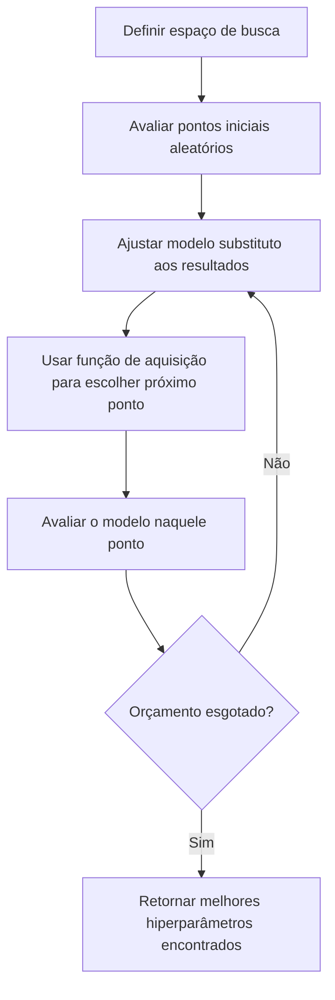
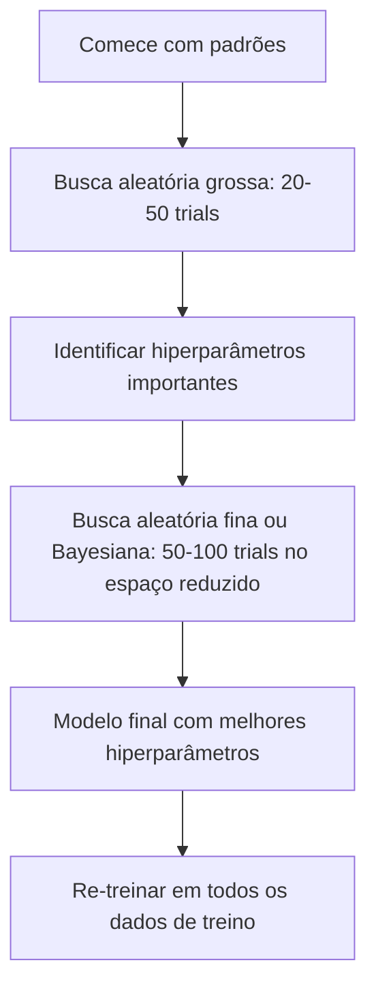
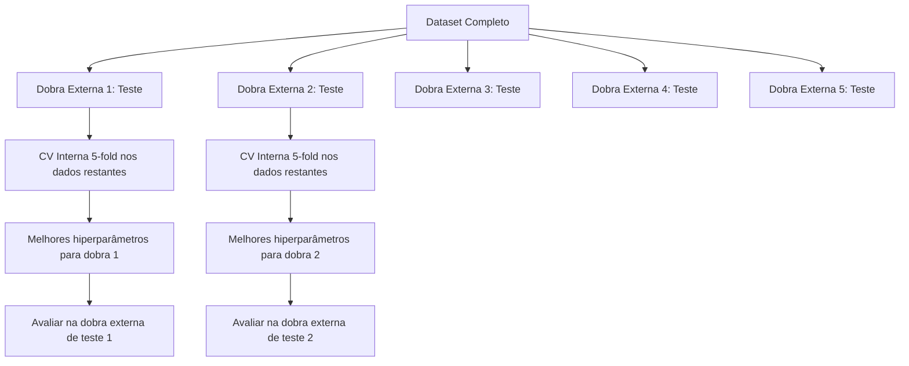

# Ajuste de Hiperparâmetros

> Hiperparâmetros são os botões que você gira antes do treino começar. Girá-los bem é a diferença entre um modelo mediano e um modelo excelente.

**Tipo:** Build
**Linguagens:** Python
**Pré-requisitos:** Fase 2, Aula 11 (Métodos Ensemble)
**Tempo:** ~90 minutos

## Objetivos de Aprendizado

- Implementar busca em grade, busca aleatória e otimização bayesiana do zero e comparar sua eficiência amostral
- Explicar por que a busca aleatória supera a busca em grade quando a maioria dos hiperparâmetros tem baixa dimensionalidade efetiva
- Construir um loop de otimização bayesiana usando um modelo substituto e função de aquisição para guiar a busca
- Projetar uma estratégia de ajuste de hiperparâmetros que evite overfitting no conjunto de validação através de validação cruzada adequada

## O Problema

Seu modelo de gradient boosting tem uma taxa de aprendizado, número de árvores, profundidade máxima, mínimo de amostras por folha, proporção de subamostragem e proporção de amostragem de colunas. São seis hiperparâmetros. Se cada um tem 5 valores razoáveis, a grade tem 5^6 = 15.625 combinações. Treinar cada uma leva 10 segundos. São 43 horas de computação para testar todas.

Busca em grade é a abordagem óbvia e a pior em escala. Busca aleatória faz melhor com menos computação. Otimização bayesiana faz ainda melhor ao aprender de avaliações passadas. Saber qual estratégia usar, e quais hiperparâmetros realmente importam, economiza dias de tempo de GPU desperdiçado.

## O Conceito

### Parâmetros vs Hiperparâmetros

Parâmetros são aprendidos durante o treino (pesos, vieses, pontos de divisão). Hiperparâmetros são definidos antes do treino começar e controlam como o aprendizado acontece.

| Hiperparâmetro | O que controla | Faixa típica |
|---------------|---------------|--------------|
| Taxa de aprendizado | Tamanho do passo por atualização | 0.001 a 1.0 |
| Número de árvores/épocas | Quanto tempo treinar | 10 a 10.000 |
| Profundidade máxima | Complexidade do modelo | 1 a 30 |
| Regularização (lambda) | Prevenção de overfitting | 0.0001 a 100 |
| Tamanho do lote | Ruído da estimativa do gradiente | 16 a 512 |
| Taxa de dropout | Fração de neurônios descartados | 0.0 a 0.5 |

### Busca em Grade (Grid Search)

A busca em grade avalia cada combinação de valores especificados. É exaustiva e fácil de entender, mas escala exponencialmente com o número de hiperparâmetros.

```
Grade para 2 hiperparâmetros:

  learning_rate: [0.01, 0.1, 1.0]
  max_depth:     [3, 5, 7]

  Avaliações: 3 x 3 = 9 combinações

  (0.01, 3)  (0.01, 5)  (0.01, 7)
  (0.1,  3)  (0.1,  5)  (0.1,  7)
  (1.0,  3)  (1.0,  5)  (1.0,  7)
```

A busca em grade tem uma falha fundamental: se um hiperparâmetro importa e o outro não, a maioria das avaliações é desperdiçada. Você obtém apenas 3 valores únicos do parâmetro importante em 9 avaliações.

### Busca Aleatória (Random Search)

A busca aleatória amostra hiperparâmetros de distribuições em vez de uma grade. Com o mesmo orçamento de 9 avaliações, você obtém 9 valores únicos de cada hiperparâmetro.



Por que o aleatório vence a grade (Bergstra & Bengio, 2012):

- A maioria dos hiperparâmetros tem baixa dimensionalidade efetiva. Apenas 1-2 de 6 hiperparâmetros geralmente importam para um dado problema.
- A busca em grade desperdiça avaliações em dimensões sem importância.
- A busca aleatória cobre as dimensões importantes mais densamente para o mesmo orçamento.
- Com 60 tentativas aleatórias, você tem 95% de chance de encontrar um ponto dentro de 5% do ótimo (se existir um no espaço de busca).

### Otimização Bayesiana

A busca aleatória ignora resultados. Ela não aprende que taxas de aprendizado altas causam divergência ou que profundidade 3 consistentemente supera profundidade 10. A otimização bayesiana usa avaliações passadas para decidir onde buscar em seguida.



Os dois componentes chave:

**Modelo substituto:** Um modelo barato de avaliar (geralmente um processo Gaussiano) que aproxima a função objetivo cara. Dá tanto uma previsão quanto uma estimativa de incerteza em qualquer ponto do espaço de busca.

**Função de aquisição:** Decide onde avaliar em seguida equilibrando explotação (buscar perto de pontos bons conhecidos) e exploração (buscar onde a incerteza é alta). Escolhas comuns:

- **Expected Improvement (EI):** Quanto de melhoria sobre o melhor atual esperamos neste ponto?
- **Upper Confidence Bound (UCB):** Previsão mais um múltiplo da incerteza. UCB alto significa promissor ou inexplorado.
- **Probability of Improvement (PI):** Qual a probabilidade deste ponto vencer o melhor atual?

A otimização bayesiana tipicamente encontra melhores hiperparâmetros que a busca aleatória com 2-5x menos avaliações. O custo de ajustar o modelo substituto é desprezível comparado ao treino do modelo real.

### Early Stopping

Nem toda execução de treino precisa terminar. Se uma configuração é claramente ruim após 10 épocas, pare-a e siga em frente. Isso é early stopping no contexto da busca de hiperparâmetros.

Estratégias:
- **Baseado em paciência:** Pare se a perda de validação não melhorou por N épocas consecutivas
- **Poda mediana:** Pare se o resultado intermediário do trial é pior que a mediana dos trials completados no mesmo passo
- **Hyperband:** Aloque orçamentos pequenos para muitas configurações, depois aumente progressivamente o orçamento para as melhores

Hyperband é particularmente eficaz. Começa 81 configurações com 1 época cada, mantém o terço superior, dá a eles 3 épocas, mantém o terço superior, e assim por diante. Isso encontra boas configurações 10-50x mais rápido que avaliar todas as configs pelo orçamento total.

### Agendadores de Taxa de Aprendizado

A taxa de aprendizado é quase sempre o hiperparâmetro mais importante. Em vez de mantê-la fixa, agendadores a ajustam durante o treino.

| Agendador | Fórmula | Quando usar |
|-----------|---------|-------------|
| Step decay | Multiplicar por 0.1 a cada N épocas | Treino CNN clássico |
| Cosine annealing | lr * 0.5 * (1 + cos(pi * t / T)) | Padrão moderno |
| Warmup + decay | Aumento linear depois decaimento cosseno | Transformers |
| One-cycle | Aumentar depois diminuir em um ciclo | Convergência rápida |
| Reduce on plateau | Reduzir por fator quando métrica estagna | Padrão seguro |

### Importância de Hiperparâmetros

Nem todos os hiperparâmetros importam igualmente. Pesquisas em random forests (Probst et al., 2019) e gradient boosting mostram padrões consistentes:

**Alta importância:**
- Taxa de aprendizado (sempre ajuste primeiro)
- Número de estimadores / épocas (use early stopping em vez de ajustar)
- Força da regularização

**Importância média:**
- Profundidade máxima / número de camadas
- Mínimo de amostras por folha / weight decay
- Proporção de subamostragem

**Baixa importância:**
- Max features (para random forests)
- Escolha específica da função de ativação
- Tamanho do lote (dentro de uma faixa razoável)

Ajuste os importantes primeiro, deixe o resto nos padrões.

### Estratégia Prática



O workflow concreto:

1. **Comece com padrões da biblioteca.** Eles são escolhidos por profissionais experientes e geralmente estão 80% do caminho.
2. **Busca aleatória grossa.** Faixas amplas, 20-50 trials. Use early stopping para matar execuções ruins rápido.
3. **Analise resultados.** Quais hiperparâmetros correlacionam com performance? Reduza o espaço de busca.
4. **Busca fina.** Otimização bayesiana ou busca aleatória focada no espaço reduzido. 50-100 trials.
5. **Re-treine em todos os dados de treino** com os melhores hiperparâmetros encontrados.

### Integração com Validação Cruzada

Ajustar hiperparâmetros em uma única divisão de validação é arriscado. Os melhores hiperparâmetros podem overfittar na dobra de validação específica. A validação cruzada aninhada resolve isso usando dois loops:

- **Loop externo** (avaliação): divide dados em treino+val e teste. Reporta performance imparcial.
- **Loop interno** (ajuste): divide treino+val em treino e val. Encontra melhores hiperparâmetros.



Cada dobra externa encontra seus próprios melhores hiperparâmetros independentemente. Os scores externos são uma estimativa imparcial da performance de generalização.

Com sklearn:

```python
from sklearn.model_selection import cross_val_score, GridSearchCV
from sklearn.ensemble import GradientBoostingRegressor

inner_cv = GridSearchCV(
    GradientBoostingRegressor(),
    param_grid={
        "learning_rate": [0.01, 0.05, 0.1],
        "max_depth": [2, 3, 5],
        "n_estimators": [50, 100, 200],
    },
    cv=5,
    scoring="neg_mean_squared_error",
)

outer_scores = cross_val_score(
    inner_cv, X, y, cv=5, scoring="neg_mean_squared_error"
)

print(f"MSE CV Aninhado: {-outer_scores.mean():.4f} +/- {outer_scores.std():.4f}")
```

Isso é caro (5 dobras externas x 5 dobras internas x 27 pontos de grade = 675 ajustes de modelo), mas te dá uma estimativa confiável de performance. Use ao reportar resultados finais em papers ou quando o risco da decisão é alto.

### Dicas Práticas

**Comece com a taxa de aprendizado.** Ela é sempre o hiperparâmetro mais importante para métodos baseados em gradiente. Uma taxa de aprendizado ruim torna todo o resto irrelevante. Fixe outros hiperparâmetros nos padrões e varra a taxa de aprendizado primeiro.

**Use distribuições log-uniforme para taxa de aprendizado e regularização.** A diferença entre 0.001 e 0.01 importa tanto quanto a diferença entre 0.1 e 1.0. Buscar linearmente desperdiça orçamento no lado grande.

**Use early stopping em vez de ajustar n_estimators.** Para boosting e redes neurais, defina n_estimators ou épocas alto e deixe o early stopping decidir quando parar. Isso remove um hiperparâmetro da busca.

**Alocação de orçamento.** Gaste 60% do seu orçamento de ajuste nos 2 hiperparâmetros mais importantes. Gaste os 40% restantes em todo o resto. Os 2 principais respondem pela maior parte da variação de performance.

**Escala importa.** Nunca busque tamanho de lote em escala log (16, 32, 64 são boas opções). Sempre busque taxa de aprendizado em escala log. Combine a distribuição de busca com como o hiperparâmetro afeta o modelo.

| Tipo de Modelo | Principais Hiperparâmetros | Busca Recomendada | Orçamento |
|---------------|--------------------------|------------------|-----------|
| Random Forest | n_estimators, max_depth, min_samples_leaf | Busca aleatória, 50 trials | Baixo (treino rápido) |
| Gradient Boosting | learning_rate, n_estimators, max_depth | Bayesiana, 100 trials + early stopping | Médio |
| Rede Neural | learning_rate, weight_decay, batch_size | Bayesiana ou aleatória, 100+ trials | Alto (treino lento) |
| SVM | C, gamma (kernel RBF) | Grade em escala log, 25-50 trials | Baixo (2 params) |
| Lasso/Ridge | alpha | 1D em escala log, 20 trials | Muito baixo |
| XGBoost | learning_rate, max_depth, subsample, colsample | Bayesiana, 100-200 trials + early stopping | Médio |

**Em caso de dúvida:** busca aleatória com 2x o número de hiperparâmetros como trials (ex: 6 hiperparâmetros = 12+ trials mínimo). Você vai se surpreender com quantas vezes a busca aleatória com 50 trials supera uma busca em grade cuidadosamente projetada.

## Construa

### Passo 1: Busca em Grade do Zero

O código em `code/tuning.py` implementa busca em grade, busca aleatória e um otimizador bayesiano simples do zero.

```python
def grid_search(model_fn, param_grid, X_train, y_train, X_val, y_val):
    keys = list(param_grid.keys())
    values = list(param_grid.values())
    best_score = -float("inf")
    best_params = None
    n_evals = 0

    for combo in itertools.product(*values):
        params = dict(zip(keys, combo))
        model = model_fn(**params)
        model.fit(X_train, y_train)
        score = evaluate(model, X_val, y_val)
        n_evals += 1

        if score > best_score:
            best_score = score
            best_params = params

    return best_params, best_score, n_evals
```

### Passo 2: Busca Aleatória do Zero

```python
def random_search(model_fn, param_distributions, X_train, y_train,
                  X_val, y_val, n_iter=50, seed=42):
    rng = np.random.RandomState(seed)
    best_score = -float("inf")
    best_params = None

    for _ in range(n_iter):
        params = {k: sample(v, rng) for k, v in param_distributions.items()}
        model = model_fn(**params)
        model.fit(X_train, y_train)
        score = evaluate(model, X_val, y_val)

        if score > best_score:
            best_score = score
            best_params = params

    return best_params, best_score, n_iter
```

### Passo 3: Otimização Bayesiana (Simplificada)

A ideia central: ajustar um processo Gaussiano aos pares (hiperparâmetro, score) observados, depois usar uma função de aquisição para decidir onde olhar em seguida.

```python
class SimpleBayesianOptimizer:
    def __init__(self, search_space, n_initial=5):
        self.search_space = search_space
        self.n_initial = n_initial
        self.X_observed = []
        self.y_observed = []

    def _kernel(self, x1, x2, length_scale=1.0):
        dists = np.sum((x1[:, None, :] - x2[None, :, :]) ** 2, axis=2)
        return np.exp(-0.5 * dists / length_scale ** 2)

    def _fit_gp(self, X_new):
        X_obs = np.array(self.X_observed)
        y_obs = np.array(self.y_observed)
        y_mean = y_obs.mean()
        y_centered = y_obs - y_mean

        K = self._kernel(X_obs, X_obs) + 1e-4 * np.eye(len(X_obs))
        K_star = self._kernel(X_new, X_obs)

        L = np.linalg.cholesky(K)
        alpha = np.linalg.solve(L.T, np.linalg.solve(L, y_centered))
        mu = K_star @ alpha + y_mean

        v = np.linalg.solve(L, K_star.T)
        var = 1.0 - np.sum(v ** 2, axis=0)
        var = np.maximum(var, 1e-6)

        return mu, var

    def _expected_improvement(self, mu, var, best_y):
        sigma = np.sqrt(var)
        z = (mu - best_y) / (sigma + 1e-10)
        ei = sigma * (z * norm_cdf(z) + norm_pdf(z))
        return ei

    def suggest(self):
        if len(self.X_observed) < self.n_initial:
            return sample_random(self.search_space)

        candidates = [sample_random(self.search_space) for _ in range(500)]
        X_cand = np.array([to_vector(c) for c in candidates])
        mu, var = self._fit_gp(X_cand)
        ei = self._expected_improvement(mu, var, max(self.y_observed))
        return candidates[np.argmax(ei)]

    def observe(self, params, score):
        self.X_observed.append(to_vector(params))
        self.y_observed.append(score)
```

O GP substituto dá duas coisas em cada ponto candidato: um score previsto (mu) e uma incerteza (var). O Expected Improvement equilibra estes: favorece pontos onde o modelo prevê scores altos OU onde a incerteza é alta. No início, a maioria dos pontos tem alta incerteza, então o otimizador explora. Mais tarde, foca na região mais promissora.

### Passo 4: Compare Todos os Métodos

Execute todos os três métodos no mesmo objetivo sintético e compare.

```python
def synthetic_objective(params):
    lr = params["learning_rate"]
    depth = params["max_depth"]
    return -(np.log10(lr) + 2) ** 2 - (depth - 4) ** 2 + 10

param_grid = {
    "learning_rate": [0.001, 0.01, 0.1, 1.0],
    "max_depth": [2, 3, 4, 5, 6, 7, 8],
}

grid_best = None
grid_score = -float("inf")
grid_history = []
for combo in itertools.product(*param_grid.values()):
    params = dict(zip(param_grid.keys(), combo))
    score = synthetic_objective(params)
    grid_history.append((params, score))
    if score > grid_score:
        grid_score = score
        grid_best = params

param_dist = {
    "learning_rate": ("log_float", 0.001, 1.0),
    "max_depth": ("int", 2, 8),
}

rand_best = None
rand_score = -float("inf")
rand_history = []
rng = np.random.RandomState(42)
for _ in range(28):
    params = {k: sample(v, rng) for k, v in param_dist.items()}
    score = synthetic_objective(params)
    rand_history.append((params, score))
    if score > rand_score:
        rand_score = score
        rand_best = params

optimizer = SimpleBayesianOptimizer(param_dist, n_initial=5)
bayes_history = []
for _ in range(28):
    params = optimizer.suggest()
    score = synthetic_objective(params)
    optimizer.observe(params, score)
    bayes_history.append((params, score))
bayes_score = max(s for _, s in bayes_history)

print(f"{'Método':<20} {'Melhor Score':>12} {'Avaliações':>12}")
print("-" * 50)
print(f"{'Grid Search':<20} {grid_score:>12.4f} {len(grid_history):>12}")
print(f"{'Random Search':<20} {rand_score:>12.4f} {len(rand_history):>12}")
print(f"{'Bayesian Opt':<20} {bayes_score:>12.4f} {len(bayes_history):>12}")
```

Com o mesmo orçamento, a otimização bayesiana geralmente encontra o melhor score mais rápido porque não desperdiça avaliações em regiões claramente ruins. A busca aleatória cobre mais terreno que a busca em grade. A busca em grade só vence quando você tem muito poucos hiperparâmetros e pode pagar para ser exaustivo.

## Use

### Optuna na Prática

Optuna é a biblioteca recomendada para ajuste de hiperparâmetros sério. Suporta poda, busca distribuída e visualização prontas para uso.

```python
import optuna

def objective(trial):
    lr = trial.suggest_float("learning_rate", 1e-4, 1e-1, log=True)
    n_est = trial.suggest_int("n_estimators", 50, 500)
    max_depth = trial.suggest_int("max_depth", 2, 10)

    model = GradientBoostingRegressor(
        learning_rate=lr,
        n_estimators=n_est,
        max_depth=max_depth,
    )
    model.fit(X_train, y_train)
    return mean_squared_error(y_val, model.predict(X_val))

study = optuna.create_study(direction="minimize")
study.optimize(objective, n_trials=100)

print(f"Melhores parâmetros: {study.best_params}")
print(f"Melhor MSE: {study.best_value:.4f}")
```

Funcionalidades chave do Optuna:
- `suggest_float(..., log=True)` para parâmetros melhor buscados em escala log (taxa de aprendizado, regularização)
- `suggest_int` para parâmetros inteiros
- `suggest_categorical` para escolhas discretas
- MedianPruner integrado para early stopping de trials ruins
- `study.trials_dataframe()` para análise

### Optuna com Poda

A poda interrompe trials não promissores cedo, economizando computação massiva. Aqui está o padrão:

```python
import optuna
from sklearn.model_selection import cross_val_score

def objective(trial):
    params = {
        "learning_rate": trial.suggest_float("lr", 1e-4, 0.5, log=True),
        "max_depth": trial.suggest_int("max_depth", 2, 10),
        "n_estimators": trial.suggest_int("n_estimators", 50, 500),
        "subsample": trial.suggest_float("subsample", 0.5, 1.0),
    }

    model = GradientBoostingRegressor(**params)
    scores = cross_val_score(model, X_train, y_train, cv=3,
                             scoring="neg_mean_squared_error")
    mean_score = -scores.mean()

    trial.report(mean_score, step=0)
    if trial.should_prune():
        raise optuna.TrialPruned()

    return mean_score

pruner = optuna.pruners.MedianPruner(n_startup_trials=10, n_warmup_steps=5)
study = optuna.create_study(direction="minimize", pruner=pruner)
study.optimize(objective, n_trials=200)
```

O `MedianPruner` para um trial se seu valor intermediário é pior que a mediana de todos os trials completados no mesmo passo. A poda requer chamar `trial.report()` para reportar métricas intermediárias e `trial.should_prune()` para verificar se o trial deve ser parado. O `n_startup_trials=10` garante que pelo menos 10 trials completem totalmente antes da poda entrar em ação. Isso tipicamente economiza 40-60% da computação total.

### Tuners Integrados do sklearn

Para experimentos rápidos, o sklearn fornece `GridSearchCV`, `RandomizedSearchCV` e `HalvingRandomSearchCV`:

```python
from sklearn.model_selection import RandomizedSearchCV
from scipy.stats import loguniform, randint

param_dist = {
    "learning_rate": loguniform(1e-4, 0.5),
    "max_depth": randint(2, 10),
    "n_estimators": randint(50, 500),
}

search = RandomizedSearchCV(
    GradientBoostingRegressor(),
    param_dist,
    n_iter=100,
    cv=5,
    scoring="neg_mean_squared_error",
    random_state=42,
    n_jobs=-1,
)
search.fit(X_train, y_train)
print(f"Melhores parâmetros: {search.best_params_}")
print(f"Melhor MSE CV: {-search.best_score_:.4f}")
```

Use `loguniform` do scipy para taxa de aprendizado e regularização. Use `randint` para hiperparâmetros inteiros. A flag `n_jobs=-1` paraleliza em todos os núcleos da CPU.

### Erros Comuns no Ajuste de Hiperparâmetros

**Vazamento de dados através do pré-processamento.** Se você ajustar um escalador no dataset completo antes da validação cruzada, a informação da dobra de validação vaza para o treino. Sempre coloque o pré-processamento dentro de um `Pipeline` para que ele seja ajustado apenas na dobra de treino.

**Overfitting no conjunto de validação.** Executar milhares de trials efetivamente treina no conjunto de validação. Use validação cruzada aninhada para estimativas finais de performance, ou segure um conjunto de teste separado que você nunca toca durante o ajuste.

**Buscar em uma faixa muito estreita.** Se seu melhor valor está na borda do seu espaço de busca, você não buscou amplamente o suficiente. O valor ótimo pode estar fora da sua faixa. Sempre verifique se os melhores parâmetros estão nas bordas.

**Ignorar efeitos de interação.** Taxa de aprendizado e número de estimadores interagem fortemente em boosting. Uma taxa de aprendizado baixa precisa de mais estimadores. Ajustá-los independentemente dá resultados piores que ajustá-los juntos.

**Não usar early stopping para modelos iterativos.** Para gradient boosting e redes neurais, defina n_estimators ou épocas como um valor alto e use early stopping. Isso é estritamente melhor que ajustar o número de iterações como um hiperparâmetro.

## Exercícios

1. Execute busca em grade e busca aleatória com o mesmo orçamento total (ex: 50 avaliações). Compare os melhores scores encontrados. Repita o experimento 10 vezes com sementes diferentes. Quantas vezes a busca aleatória vence?
2. Implemente Hyperband do zero. Comece com 81 configurações, cada uma treinada por 1 época. Mantenha o topo 1/3 em cada rodada e triplique o orçamento. Compare a computação total (soma de todas as épocas em todas as configs) com executar 81 configs pelo orçamento total.
3. Adicione um agendador de taxa de aprendizado (cosine annealing) à implementação de gradient boosting da Aula 11. Isso ajuda comparado a uma taxa de aprendizado fixa?
4. Use Optuna para ajustar um RandomForestClassifier em um dataset real (ex: dataset breast cancer do sklearn). Use `optuna.visualization.plot_param_importances(study)` para ver quais hiperparâmetros mais importam. Corresponde à classificação de importância desta lição?
5. Implemente uma função de aquisição simples (Expected Improvement) e demonstre exploração vs explotação. Plote a média e incerteza do modelo substituto, e mostre onde EI escolhe avaliar em seguida.

## Termos-Chave

| Termo | O que o pessoal diz | O que realmente significa |
|-------|--------------------|-----------------------|
| Hiperparâmetro | "Uma configuração que você escolhe" | Um valor definido antes do treino que controla o processo de aprendizado, não aprendido dos dados |
| Busca em grade | "Tentar toda combinação" | Busca exaustiva sobre uma grade de parâmetros especificada. Custo exponencial |
| Busca aleatória | "Apenas amostrar aleatoriamente" | Amostrar hiperparâmetros de distribuições. Cobre dimensões importantes melhor que busca em grade |
| Otimização bayesiana | "Busca inteligente" | Usa um modelo substituto da objetivo para decidir onde avaliar em seguida, equilibrando exploração e explotação |
| Modelo substituto | "Uma aproximação barata" | Um modelo (geralmente processo Gaussiano) que aproxima a função objetivo cara a partir de avaliações observadas |
| Função de aquisição | "Onde olhar em seguida" | Pontua pontos candidatos equilibrando melhoria esperada com incerteza. EI e UCB são escolhas comuns |
| Early stopping | "Parar de perder tempo" | Encerrar o treino cedo quando a performance de validação para de melhorar |
| Hyperband | "Torneio de configs" | Alocação adaptativa de recursos: comece muitas configs com orçamentos pequenos, mantenha as melhores e aumente seus orçamentos |
| Agendador de taxa de aprendizado | "Mudar lr durante o treino" | Uma função que ajusta a taxa de aprendizado ao longo do treino para melhor convergência |

## Leitura Adicional

- [Bergstra & Bengio: Random Search for Hyper-Parameter Optimization (2012)](https://jmlr.org/papers/v13/bergstra12a.html) — o paper que mostrou que aleatório vence grade
- [Snoek et al., Practical Bayesian Optimization of Machine Learning Algorithms (2012)](https://arxiv.org/abs/1206.2944) — otimização bayesiana para ML
- [Li et al., Hyperband: A Novel Bandit-Based Approach (2018)](https://jmlr.org/papers/v18/16-558.html) — o paper do Hyperband
- [Optuna: A Next-generation Hyperparameter Optimization Framework](https://arxiv.org/abs/1907.10902) — o paper do Optuna
- [Probst et al., Tunability: Importance of Hyperparameters (2019)](https://jmlr.org/papers/v20/18-444.html) — quais hiperparâmetros importam
