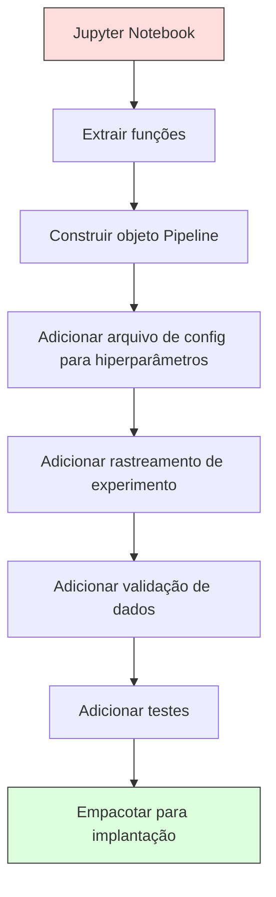

# Pipelines de ML

> Um modelo não é um produto. Um pipeline é. O pipeline é tudo de dados brutos a previsão implantada, e cada passo deve ser reproduzível.

**Tipo:** Build
**Linguagens:** Python
**Pré-requisitos:** Fase 2, Aula 12 (Ajuste de Hiperparâmetros)
**Tempo:** ~120 minutos

## Objetivos de Aprendizado

- Construir um pipeline de ML do zero que encadeia imputação, escalonamento, encoding e treino de modelo em um objeto reproduzível
- Identificar cenários de vazamento de dados e explicar como pipelines os previnem ajustando transformadores apenas nos dados de treino
- Construir um ColumnTransformer que aplica pré-processamento diferente para features numéricas e categóricas
- Implementar serialização de pipeline e demonstrar que o mesmo pipeline ajustado produz resultados idênticos em treino e produção

## O Problema

Você tem um notebook que carrega dados, preenche valores ausentes com a mediana, escala features, treina um modelo e imprime accuracy. Funciona. Você implanta.

Um mês depois, alguém retreina o modelo e obtém resultados diferentes. A mediana foi calculada no dataset inteiro incluindo dados de teste (vazamento de dados). Os parâmetros de escalonamento não foram salvos, então a inferência usa estatísticas diferentes. O código de engenharia de features foi copiado e colado entre treino e produção, e as cópias divergiram. Uma coluna categórica ganhou um novo valor em produção que o encoder nunca viu.

Estes não são hipotéticos. São as razões mais comuns pelas quais sistemas de ML falham em produção. Pipelines resolvem todos eles empacotando cada etapa de transformação em um objeto único, ordenado e reproduzível.

## O Conceito

### O Que É Um Pipeline

Um pipeline é uma sequência ordenada de transformações de dados seguidas por um modelo. Cada passo recebe a saída do passo anterior como entrada. O pipeline inteiro é ajustado uma vez nos dados de treino. Na inferência, o mesmo pipeline ajustado transforma dados novos e produz previsões.


O pipeline garante:
- Transformações são ajustadas apenas nos dados de treino (sem vazamento)
- As mesmas transformações são aplicadas na inferência
- O objeto inteiro pode ser serializado e implantado como um único artefato
- Validação cruzada aplica o pipeline por fold, prevenindo vazamento sutil

### Vazamento de Dados: O Assassino Silencioso

Vazamento de dados acontece quando informação do conjunto de teste ou de dados futuros contamina o treino. Pipelines previnem as formas mais comuns.

**Vazado (errado):**
```python
X = df.drop("target", axis=1)
y = df["target"]

scaler = StandardScaler()
X_scaled = scaler.fit_transform(X)  # scaler viu dados de teste!

X_train, X_test = X_scaled[:800], X_scaled[800:]
y_train, y_test = y[:800], y[800:]
```

O scaler viu dados de teste. A média e desvio padrão incluem amostras de teste. Isso infla as estimativas de acurácia.

**Correto:**
```python
X_train, X_test = X[:800], X[800:]

scaler = StandardScaler()
X_train_scaled = scaler.fit_transform(X_train)
X_test_scaled = scaler.transform(X_test)
```

Com um pipeline, você não precisa pensar nisso. O pipeline lida automaticamente.

### sklearn Pipeline

O `Pipeline` do sklearn encadeia transformadores e um estimador. Expõe `.fit()`, `.predict()` e `.score()` que aplicam todos os passos em ordem.

```python
from sklearn.pipeline import Pipeline
from sklearn.preprocessing import StandardScaler
from sklearn.linear_model import LogisticRegression

pipe = Pipeline([
    ("scaler", StandardScaler()),
    ("model", LogisticRegression()),
])

pipe.fit(X_train, y_train)
predictions = pipe.predict(X_test)
```

Quando você chama `pipe.fit(X_train, y_train)`:
1. Scaler chama `fit_transform` no X_train
2. Model chama `fit` no X_train escalado

Quando você chama `pipe.predict(X_test)`:
1. Scaler chama `transform` (não fit_transform) no X_test
2. Model chama `predict` no X_test escalado

O scaler nunca vê dados de teste durante o ajuste. Esse é o ponto principal.

### ColumnTransformer: Diferentes Pipelines para Diferentes Colunas

Datasets reais têm colunas numéricas e categóricas que precisam de pré-processamento diferente. `ColumnTransformer` lida com isso.

```python
from sklearn.compose import ColumnTransformer
from sklearn.preprocessing import StandardScaler, OneHotEncoder
from sklearn.impute import SimpleImputer

numeric_pipe = Pipeline([
    ("impute", SimpleImputer(strategy="median")),
    ("scale", StandardScaler()),
])

categorical_pipe = Pipeline([
    ("impute", SimpleImputer(strategy="most_frequent")),
    ("encode", OneHotEncoder(handle_unknown="ignore")),
])

preprocessor = ColumnTransformer([
    ("num", numeric_pipe, ["age", "income", "score"]),
    ("cat", categorical_pipe, ["city", "gender", "plan"]),
])

full_pipeline = Pipeline([
    ("preprocess", preprocessor),
    ("model", GradientBoostingClassifier()),
])
```

O `handle_unknown="ignore"` no OneHotEncoder é crítico para produção. Quando uma nova categoria aparece (uma cidade que o modelo nunca viu), produz um vetor zero em vez de quebrar.

### Rastreamento de Experimentos

Um pipeline torna o treino reproduzível, mas você também precisa rastrear o que aconteceu entre experimentos: quais hiperparâmetros foram usados, qual versão do dataset, quais as métricas, qual código estava rodando.

**MLflow** é a solução open-source mais comum:

```python
import mlflow

with mlflow.start_run():
    mlflow.log_param("max_depth", 5)
    mlflow.log_param("n_estimators", 100)
    mlflow.log_param("learning_rate", 0.1)

    pipe.fit(X_train, y_train)
    accuracy = pipe.score(X_test, y_test)

    mlflow.log_metric("accuracy", accuracy)
    mlflow.sklearn.log_model(pipe, "model")
```

Cada execução é registrada com parâmetros, métricas, artefatos e o modelo completo. Você pode comparar execuções, reproduzir qualquer experimento e implantar qualquer versão do modelo.

**Weights & Biases (wandb)** fornece a mesma funcionalidade com um dashboard hospedado:

```python
import wandb

wandb.init(project="my-pipeline")
wandb.config.update({"max_depth": 5, "n_estimators": 100})

pipe.fit(X_train, y_train)
accuracy = pipe.score(X_test, y_test)

wandb.log({"accuracy": accuracy})
```

### Versionamento de Modelos

Após o rastreamento de experimentos, você precisa gerenciar versões de modelos. Qual modelo está em produção? Qual está em staging? Qual era o da semana passada?

O Model Registry do MLflow fornece:
- **Rastreamento de versão:** Todo modelo salvo recebe um número de versão
- **Transições de estágio:** "Staging", "Production", "Archived"
- **Fluxo de aprovação:** Modelos devem ser explicitamente promovidos para produção
- **Rollback:** Volte para uma versão anterior instantaneamente

### Versionamento de Dados com DVC

Código é versionado com git. Dados também deveriam ser versionados, mas git não lida bem com arquivos grandes. DVC (Data Version Control) resolve isso.

```
dvc init
dvc add data/training.csv
git add data/training.csv.dvc data/.gitignore
git commit -m "Track training data"
dvc push
```

DVC armazena os dados reais em armazenamento remoto (S3, GCS, Azure) e mantém um pequeno arquivo `.dvc` no git que registra o hash. Quando você faz checkout de um commit git, `dvc checkout` restaura os dados exatos que foram usados.

Isso significa que todo commit git prende tanto o código quanto os dados. Reprodutibilidade total.

### Experimentos Reproduzíveis

Um experimento reproduzível requer quatro coisas:

1. **Seeds aleatórias fixas:** Defina seeds para numpy, random e o framework (torch, sklearn)
2. **Dependências fixadas:** requirements.txt ou poetry.lock com versões exatas
3. **Dados versionados:** DVC ou similar
4. **Arquivos de config:** Todos hiperparâmetros em um config, não hardcoded

```python
import numpy as np
import random

def set_seed(seed=42):
    random.seed(seed)
    np.random.seed(seed)
    try:
        import torch
        torch.manual_seed(seed)
        torch.cuda.manual_seed_all(seed)
        torch.backends.cudnn.deterministic = True
    except ImportError:
        pass
```

### Do Notebook pra Pipeline de Produção



A progressão típica:

1. **Exploração em notebook:** Experimentos rápidos, visualizações, ideias de features
2. **Extrair funções:** Mova pré-processamento, engenharia de features, avaliação para módulos
3. **Construir Pipeline:** Encadeie transformações num Pipeline sklearn ou classe customizada
4. **Gerenciamento de config:** Mova todos hiperparâmetros para um config YAML/JSON
5. **Rastreamento de experimentos:** Adicione logging MLflow ou wandb
6. **Validação de dados:** Verifique schema, distribuições e padrões de valores ausentes antes do treino
7. **Testes:** Testes unitários para transformadores, testes de integração para o pipeline completo
8. **Implantação:** Serialize o pipeline, envolva numa API (FastAPI, Flask), containerize

### Erros Comuns de Pipeline

| Erro | Por que é ruim | Correção |
|------|---------------|----------|
| Ajustar dados completos antes de dividir | Vazamento de dados | Use Pipeline com cross_val_score |
| Engenharia de features fora do pipeline | Transformações diferentes em treino vs produção | Coloque todas transformações no Pipeline |
| Não tratar categorias desconhecidas | Crash em produção com novos valores | OneHotEncoder(handle_unknown="ignore") |
| Nomes de colunas hardcoded | Quebra quando schema muda | Use listas de nomes de colunas do config |
| Sem validação de dados | Previsões erradas silenciosamente em dados ruins | Adicione verificações de schema antes da predição |
| Skew treino/produção | Modelo vê features diferentes em produção | Um único objeto Pipeline para ambos |

## Construa

O código em `code/pipeline.py` constrói um pipeline de ML completo do zero:

### Passo 1: Transformer Customizado

```python
class CustomTransformer:
    def __init__(self):
        self.means = None
        self.stds = None

    def fit(self, X):
        self.means = np.mean(X, axis=0)
        self.stds = np.std(X, axis=0)
        self.stds[self.stds == 0] = 1.0
        return self

    def transform(self, X):
        return (X - self.means) / self.stds

    def fit_transform(self, X):
        return self.fit(X).transform(X)
```

### Passo 2: Pipeline Do Zero

```python
class PipelineFromScratch:
    def __init__(self, steps):
        self.steps = steps

    def fit(self, X, y=None):
        X_current = X.copy()
        for name, step in self.steps[:-1]:
            X_current = step.fit_transform(X_current)
        name, model = self.steps[-1]
        model.fit(X_current, y)
        return self

    def predict(self, X):
        X_current = X.copy()
        for name, step in self.steps[:-1]:
            X_current = step.transform(X_current)
        name, model = self.steps[-1]
        return model.predict(X_current)
```

### Passo 3: Validação Cruzada com Pipeline

O código demonstra como validação cruzada com um pipeline previne vazamento de dados: o scaler é ajustado separadamente em cada fold dos dados de treino.

### Passo 4: Pipeline Completo de Produção com sklearn

Um pipeline completo com `ColumnTransformer`, múltiplos caminhos de pré-processamento e um modelo, treinado com validação cruzada adequada e logging de experimentos.

## Entregue

Esta aula produz:
- `outputs/prompt-ml-pipeline.md` — uma skill para construir e debugar pipelines de ML
- `code/pipeline.py` — um pipeline completo do zero até sklearn

## Exercícios

1. Construa um pipeline que lida com um dataset com 3 colunas numéricas e 2 categóricas. Use `ColumnTransformer` para aplicar imputação por mediana + escalonamento para numéricas e imputação por moda + one-hot encoding para categóricas. Treine com validação cruzada 5-fold.
2. Provoque vazamento de dados propositadamente: ajuste o scaler no dataset inteiro antes de dividir. Compare o score de validação cruzada (vazado) com o score do pipeline (limpo). Qual a diferença?
3. Serialize seu pipeline com `joblib.dump`. Carregue num script separado e rode previsões. Verifique que as previsões são idênticas.
4. Adicione um transformer customizado ao pipeline que cria features polinomiais (grau 2) para as duas colunas numéricas mais importantes. Onde ele deve ficar no pipeline?
5. Configure rastreamento MLflow para o pipeline. Rode 5 experimentos com hiperparâmetros diferentes. Use a UI do MLflow (`mlflow ui`) para comparar execuções e escolher o melhor modelo.

## Termos-chave

| Termo | O que as pessoas dizem | O que realmente significa |
|-------|------------------------|---------------------------|
| Pipeline | "Cadeia de transformações + modelo" | Uma sequência ordenada de transformadores ajustados e um modelo, aplicados como uma unidade para prevenir vazamento |
| Vazamento de dados | "Info de teste vazou pro treino" | Usar informação de fora do conjunto de treino para construir o modelo, inflando estimativas de performance |
| ColumnTransformer | "Pré-processamento diferente por coluna" | Aplica pipelines diferentes a diferentes subconjuntos de colunas, combinando resultados |
| Rastreamento de experimentos | "Logando suas execuções" | Registrar parâmetros, métricas, artefatos e versões de código para cada execução de treino |
| MLflow | "Rastrear e implantar modelos" | Plataforma open-source para rastreamento de experimentos, registro de modelos e implantação |
| DVC | "Git para dados" | Sistema de controle de versão para arquivos de dados grandes, armazenando hashes no git e dados em armazenamento remoto |
| Registro de modelos | "Catálogo de versões de modelo" | Um sistema que rastreia versões de modelos com rótulos de estágio (staging, production, archived) |
| Skew treino/produção | "Funcionou no notebook" | Diferenças entre como os dados são processados durante treino versus inferência, causando erros silenciosos |
| Reprodutibilidade | "Mesmo código, mesmo resultado" | A capacidade de obter resultados idênticos a partir do mesmo código, dados e configuração |

## Leitura Adicional

- [scikit-learn Pipeline docs](https://scikit-learn.org/stable/modules/compose.html) — a referência oficial de pipeline
- [MLflow documentation](https://mlflow.org/docs/latest/index.html) — rastreamento de experimentos e registro de modelos
- [DVC documentation](https://dvc.org/doc) — versionamento de dados
- [Sculley et al., Hidden Technical Debt in Machine Learning Systems (2015)](https://papers.nips.cc/paper/2015/hash/86df7dcfd896fcaf2674f757a2463eba-Abstract.html) — o paper seminal sobre complexidade de sistemas de ML
- [Google ML Best Practices: Rules of ML](https://developers.google.com/machine-learning/guides/rules-of-ml) — conselhos práticos de ML em produção
