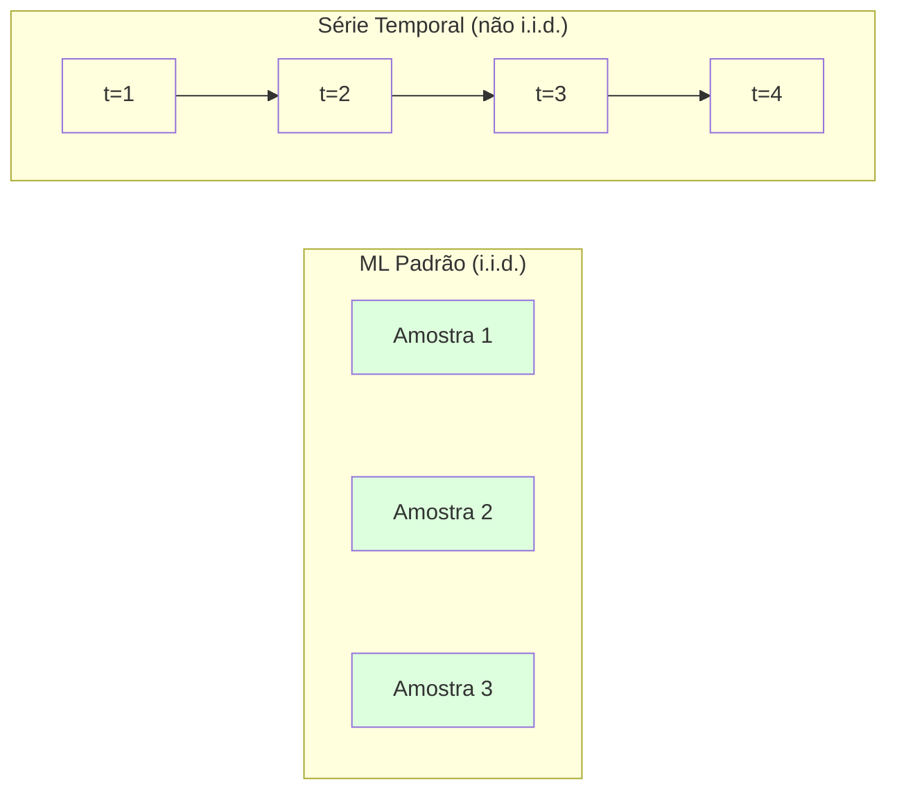
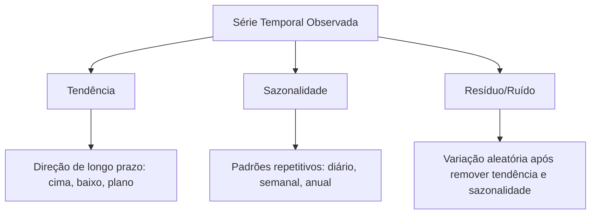
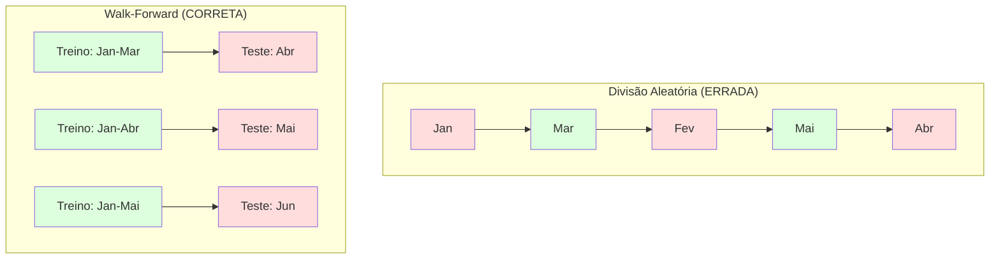

# Fundamentos de Séries Temporais

> Performance passada prevê resultados futuros — se você verificar a estacionariedade primeiro.

**Tipo:** Build
**Linguagens:** Python
**Pré-requisitos:** Fase 2, Aulas 01-09
**Tempo:** ~90 minutos

## Objetivos de Aprendizado

- Decompor uma série temporal em tendência, sazonalidade e componentes residuais e testar estacionariedade
- Implementar features de lag e estatísticas móveis para converter uma série temporal em um problema de aprendizado supervisionado
- Construir um framework de validação walk-forward que impede que dados futuros vazem para o treino
- Explicar por que divisões aleatórias treino/teste são inválidas para séries temporais e demonstrar a lacuna de performance versus divisões temporais corretas

## O Problema

Você tem dados ordenados pelo tempo. Vendas diárias, temperatura horária, uso de CPU por minuto, preços de ações semanais. Você quer prever o próximo valor, a próxima semana, o próximo trimestre.

Você recorre ao seu kit de ferramentas ML padrão: divisão treino/teste aleatória, validação cruzada, matriz de features, predição. Cada passo está errado.

Séries temporais quebram as suposições em que o ML padrão se baseia. As amostras não são independentes — a temperatura de hoje depende da de ontem. Divisões aleatórias vazam informação futura para o passado. Features que parecem ótimas em backtest falham em produção porque dependem de padrões que mudam com o tempo.

Um modelo que obtém 95% de acurácia com validação cruzada aleatória pode obter 55% com avaliação temporal correta. A diferença não é um detalhe técnico. É a diferença entre um modelo que funciona no papel e um que funciona em produção.

Esta lição cobre os fundamentos: o que torna dados temporais diferentes, como avaliar modelos honestamente e como transformar uma série temporal em features que modelos ML padrão podem consumir.

## O Conceito

### O Que Torna Séries Temporais Diferentes

ML padrão assume i.i.d. — independentes e identicamente distribuídos. Cada amostra é amostrada da mesma distribuição, independentemente de outras amostras. Séries temporais violam ambos:

- **Não independentes.** O preço da ação de hoje depende do de ontem. As vendas desta semana se correlacionam com as da semana passada.
- **Não identicamente distribuídos.** A distribuição muda com o tempo. Vendas em dezembro parecem diferentes de vendas em março.

Estas violações não são menores. Elas mudam como você constrói features, como avalia modelos e quais algoritmos funcionam.



Em ML padrão, as amostras são intercambiáveis. Embaralhá-las não muda nada. Em séries temporais, a ordem é tudo. Embaralhar destrói o sinal.

### Componentes de uma Série Temporal

Toda série temporal é uma combinação de:



- **Tendência**: A direção de longo prazo. Receita crescendo 10% ao ano. Temperatura global subindo.
- **Sazonalidade**: Padrões repetitivos em intervalos fixos. Vendas no varejo sobem em dezembro. Uso de ar condicionado atinge pico em julho.
- **Resíduo**: O que sobra após remover tendência e sazonalidade. Se o resíduo parece ruído branco, a decomposição capturou o sinal.

### Estacionariedade

Uma série temporal é estacionária se suas propriedades estatísticas (média, variância, autocorrelação) não mudam ao longo do tempo. A maioria dos métodos de previsão assume estacionariedade.

**Por que importa:** Uma série não estacionária tem uma média que deriva. Um modelo treinado em dados de janeiro aprendeu uma média diferente do que fevereiro mostrará. Ele estará sistematicamente errado.

**Como verificar:** Compute a média móvel e o desvio padrão móvel em janelas. Se eles derivam, a série é não estacionária.

**Como corrigir:** Diferenciação. Em vez de modelar os valores brutos, modele a mudança entre valores consecutivos:

```
diff[t] = valor[t] - valor[t-1]
```

Se uma rodada de diferenciação não tornar a série estacionária, aplique novamente (diferenciação de segunda ordem). A maioria das séries do mundo real precisa de no máximo duas rodadas.

**Exemplo:**

Série original: [100, 102, 106, 112, 120]
Primeira diferença:  [2, 4, 6, 8] (ainda tendendo para cima)
Segunda diferença:  [2, 2, 2] (constante — estacionária)

A série original tinha uma tendência quadrática. A primeira diferenciação a transformou em uma tendência linear. A segunda diferenciação a tornou plana. Na prática, raramente você precisa de mais de duas rodadas.

**Teste formal:** O teste Augmented Dickey-Fuller (ADF) é o teste estatístico padrão para estacionariedade. A hipótese nula é "a série é não estacionária." Um p-valor abaixo de 0.05 significa que você pode rejeitar a nula e concluir estacionariedade. Não implementamos ADF do zero (requer tabelas de distribuição assintótica), mas a abordagem de estatísticas móveis em nosso código fornece uma verificação visual prática.

### Autocorrelação

Autocorrelação mede o quanto um valor no tempo t se correlaciona com o valor no tempo t-k (k passos atrás). A função de autocorrelação (ACF) plota esta correlação para cada lag k.

**O ACF te diz:**
- Quão longe no passado a série se lembra. Se ACF cai para zero após lag 5, valores com mais de 5 passos atrás são irrelevantes.
- Se existe sazonalidade. Se ACF tem picos no lag 12 (dados mensais), há sazonalidade anual.
- Quantas features de lag criar. Use lags até onde ACF se torna desprezível.

**PACF (Função de Autocorrelação Parcial)** remove correlações indiretas. Se hoje se correlaciona com 3 dias atrás apenas porque ambos se correlacionam com ontem, PACF no lag 3 será zero enquanto ACF no lag 3 não será.

### Features de Lag: Transformando Séries Temporais em Aprendizado Supervisionado

Modelos ML padrão precisam de uma matriz de features X e um alvo y. Séries temporais te dão uma única coluna de valores. A ponte são as features de lag.

Pegue a série [10, 12, 14, 13, 15] e crie features de lag-1 e lag-2:

| lag_2 | lag_1 | target |
|-------|-------|--------|
| 10    | 12    | 14     |
| 12    | 14    | 13     |
| 14    | 13    | 15     |

Agora você tem um problema de regressão padrão. Qualquer modelo ML (regressão linear, random forest, gradient boosting) pode prever o target a partir dos lags.

Features adicionais que você pode criar:
- **Estatísticas móveis:** média, std, min, max dos últimos k valores
- **Features de calendário:** dia da semana, mês, é_feriado, é_fim_de_semana
- **Valores diferenciados:** mudança do passo anterior
- **Estatísticas expansivas:** média cumulativa, soma cumulativa
- **Features de razão:** valor atual / média móvel (quão longe da média recente)
- **Features de interação:** lag_1 * dia_da_semana (efeitos de dia da semana no momentum)

**Quantos lags?** Use a função de autocorrelação. Se ACF é significativa até lag 10, use pelo menos 10 lags. Se há sazonalidade semanal, inclua lag 7 (e possivelmente 14). Mais lags dão ao modelo mais histórico mas também mais features para ajustar, aumentando o risco de overfitting.

**A armadilha do alinhamento do alvo.** Ao criar features de lag, o target deve ser o valor no tempo t, e todas as features devem usar valores no tempo t-1 ou anteriores. Se você acidentalmente incluir o valor no tempo t como uma feature, você tem um preditor perfeito — e um modelo completamente inútil. Este é o bug mais comum na engenharia de features de séries temporais.

### Validação Walk-Forward

Este é o conceito mais importante desta lição. A validação cruzada K-fold padrão atribui aleatoriamente amostras para treino e teste. Para séries temporais, isso vaza informação futura.



Validação walk-forward:
1. Treine em dados até o tempo t
2. Prediga no tempo t+1 (ou t+1 a t+k para múltiplos passos)
3. Deslize a janela para frente
4. Repita

Cada dobra de teste contém apenas dados que vêm depois de todos os dados de treino. Sem vazamento futuro. Isso te dá uma estimativa honesta de como o modelo se sairá quando implantado.

**Janela expansiva** usa todos os dados históricos para treino (a janela cresce). **Janela deslizante** usa uma janela de treino de tamanho fixo (a janela desliza). Use expansiva quando você acredita que dados mais antigos ainda são relevantes. Use deslizante quando o mundo muda e dados antigos prejudicam.

### Intuição ARIMA

ARIMA é o modelo clássico de séries temporais. Tem três componentes:

- **AR (Autoregressivo):** Prediz a partir de valores passados. AR(p) usa os últimos p valores.
- **I (Integrado):** Diferenciação para alcançar estacionariedade. I(d) aplica d rodadas de diferenciação.
- **MA (Médias Móveis):** Prediz a partir de erros de previsão passados. MA(q) usa os últimos q erros.

ARIMA(p, d, q) combina todos os três. Você escolhe p, d, q baseado na análise ACF/PACF ou busca automatizada (auto-ARIMA).

Não implementaremos ARIMA do zero — requer otimização numérica que está além do escopo desta lição. A percepção chave é entender o que cada componente faz para que você possa interpretar resultados ARIMA e saber quando usá-lo.

### Quando Usar o Quê

| Abordagem | Melhor Para | Lida com Sazonalidade | Lida com Features Externas |
|----------|------------|----------------------|-------------------------|
| Features de lag + ML | Tabular com muitas features externas | Com features de calendário | Sim |
| ARIMA | Série univariada única, curto prazo | Variante SARIMA | Não (ARIMAX para limitado) |
| Suavização exponencial | Tendência + sazonalidade simples | Sim (Holt-Winters) | Não |
| Prophet | Previsão de negócios, feriados | Sim (termos de Fourier) | Limitado |
| Redes neurais (LSTM, Transformer) | Sequências longas, muitas séries | Aprendido | Sim |

Para a maioria dos problemas práticos, features de lag + gradient boosting é o ponto de partida mais forte. Ele lida com features externas naturalmente, não requer estacionariedade e é fácil de depurar.

### Horizontes e Estratégias de Previsão

Previsão de passo único prevê um passo temporal à frente. Previsão de múltiplos passos prevê vários passos. Existem três estratégias:

**Recursiva (iterada):** Prevê um passo à frente, usa a predição como entrada para o próximo passo. Simples mas erros se acumulam — cada predição usa a predição anterior, então os erros se compõem.

**Direta:** Treina um modelo separado para cada horizonte. Modelo-1 prevê t+1, Modelo-5 prevê t+5. Sem acumulação de erro, mas cada modelo tem menos amostras de treino e eles não compartilham informação.

**Multi-saída:** Treina um modelo que produz todos os horizontes simultaneamente. Compartilha informação entre horizontes mas requer um modelo que suporte múltiplas saídas (ou uma função de perda personalizada).

Para a maioria dos problemas práticos, comece com recursiva para horizontes curtos (1-5 passos) e direta para horizontes mais longos.

### Erros Comuns em Séries Temporais

| Erro | Por que acontece | Como corrigir |
|-------|----------------|--------------|
| Divisão treino/teste aleatória | Hábito do ML padrão | Use walk-forward ou divisão temporal |
| Usar features futuras | Feature no tempo t incluída por engano | Audite toda feature para alinhamento temporal |
| Overfitting na sazonalidade | Modelo memoriza padrões de calendário | Segure um ciclo sazonal completo no conjunto de teste |
| Ignorar mudanças de escala | Receita dobra mas padrões permanecem | Modele mudança percentual em vez de absoluta |
| Muitas features de lag | "Mais histórico é melhor" | Use ACF para determinar lags relevantes |
| Não diferenciar | "O modelo vai descobrir" | Modelos de árvore lidam com tendências; modelos lineares precisam de estacionariedade |

## Construa

O código em `code/time_series.py` implementa os blocos de construção principais do zero.

### Criador de Features de Lag

```python
def make_lag_features(series, n_lags):
    n = len(series)
    X = np.full((n, n_lags), np.nan)
    for lag in range(1, n_lags + 1):
        X[lag:, lag - 1] = series[:-lag]
    valid = ~np.isnan(X).any(axis=1)
    return X[valid], series[valid]
```

Isso converte uma série 1D em uma matriz de features onde cada linha tem os últimos `n_lags` valores como features, e o valor atual como alvo.

### Validação Cruzada Walk-Forward

```python
def walk_forward_split(n_samples, n_splits=5, min_train=50):
    assert min_train < n_samples, "min_train must be less than n_samples"
    step = max(1, (n_samples - min_train) // n_splits)
    for i in range(n_splits):
        train_end = min_train + i * step
        test_end = min(train_end + step, n_samples)
        if train_end >= n_samples:
            break
        yield slice(0, train_end), slice(train_end, test_end)
```

Cada divisão garante que os dados de treino vêm estritamente antes dos dados de teste. A janela de treino expande a cada dobra.

### Modelo Autoregressivo Simples

Um modelo AR puro é apenas regressão linear em features de lag:

```python
class SimpleAR:
    def __init__(self, n_lags=5):
        self.n_lags = n_lags
        self.weights = None
        self.bias = None

    def fit(self, series):
        X, y = make_lag_features(series, self.n_lags)
        # Resolver via equações normais
        X_b = np.column_stack([np.ones(len(X)), X])
        theta = np.linalg.lstsq(X_b, y, rcond=None)[0]
        self.bias = theta[0]
        self.weights = theta[1:]
        return self
```

Isso é conceitualmente idêntico à regressão linear da Aula 02, mas aplicado a versões defasadas da mesma variável.

### Verificação de Estacionariedade

O código computa estatísticas móveis para avaliar visual e numericamente a estacionariedade:

```python
def check_stationarity(series, window=50):
    rolling_mean = np.array([
        series[max(0, i - window):i].mean()
        for i in range(1, len(series) + 1)
    ])
    rolling_std = np.array([
        series[max(0, i - window):i].std()
        for i in range(1, len(series) + 1)
    ])
    return rolling_mean, rolling_std
```

Se a média móvel deriva ou o std móvel muda, a série é não estacionária. Aplique diferenciação e verifique novamente.

O código também verifica estacionariedade comparando a primeira metade e a segunda metade da série. Se as médias diferem por mais de meio desvio padrão ou a razão de variância excede 2x, a série é marcada como não estacionária.

### Autocorrelação

```python
def autocorrelation(series, max_lag=20):
    n = len(series)
    mean = series.mean()
    var = series.var()
    acf = np.zeros(max_lag + 1)
    for k in range(max_lag + 1):
        cov = np.mean((series[:n-k] - mean) * (series[k:] - mean))
        acf[k] = cov / var if var > 0 else 0
    return acf
```

## Use

Com sklearn, você usa features de lag diretamente com qualquer regressor:

```python
from sklearn.linear_model import Ridge
from sklearn.ensemble import GradientBoostingRegressor

X, y = make_lag_features(series, n_lags=10)

for train_idx, test_idx in walk_forward_split(len(X)):
    model = Ridge(alpha=1.0)
    model.fit(X[train_idx], y[train_idx])
    predictions = model.predict(X[test_idx])
```

Para ARIMA, use statsmodels:

```python
from statsmodels.tsa.arima.model import ARIMA

model = ARIMA(train_series, order=(5, 1, 2))
fitted = model.fit()
forecast = fitted.forecast(steps=30)
```

O código em `time_series.py` demonstra ambas as abordagens e as compara usando validação walk-forward.

### TimeSeriesSplit do sklearn

O sklearn fornece `TimeSeriesSplit` que implementa validação walk-forward:

```python
from sklearn.model_selection import TimeSeriesSplit

tscv = TimeSeriesSplit(n_splits=5)
for train_index, test_index in tscv.split(X):
    X_train, X_test = X[train_index], X[test_index]
    y_train, y_test = y[train_index], y[test_index]
    model.fit(X_train, y_train)
    score = model.score(X_test, y_test)
```

Isso é equivalente ao nosso `walk_forward_split` feito do zero, mas integrado ao framework de validação cruzada do sklearn. Você pode usá-lo com `cross_val_score`:

```python
from sklearn.model_selection import cross_val_score

scores = cross_val_score(model, X, y, cv=TimeSeriesSplit(n_splits=5))
print(f"Score médio: {scores.mean():.4f} +/- {scores.std():.4f}")
```

### Métricas de Avaliação

Previsão de séries temporais usa métricas de regressão, mas com contexto temporal:

- **MAE (Mean Absolute Error):** Média de |y_real - y_pred|. Fácil de interpretar nas unidades originais. "Em média, as previsões erram por 3.2 graus."
- **RMSE (Root Mean Squared Error):** Raiz quadrada do erro quadrático médio. Penaliza erros grandes mais que MAE. Use quando erros grandes são piores que muitos erros pequenos.
- **MAPE (Mean Absolute Percentage Error):** Média de |erro / valor_real| * 100. Independente de escala, útil para comparar entre diferentes séries. Mas é indefinido quando valores reais são zero.
- **Comparação com baseline ingênuo:** Sempre compare com baselines simples. O baseline sazonal ingênuo prevê o valor de um período atrás (ontem, semana passada). Se seu modelo não consegue vencer o ingênuo, algo está errado.

### Features Móveis

O código demonstra adicionar estatísticas móveis (média, std, min, max em janelas de 7 e 14 dias) às features de lag. Estas dão ao modelo informação sobre tendências recentes e volatilidade que features de lag sozinhas não capturam.

Por exemplo, se a média móvel está subindo, sugere uma tendência de alta. Se o std móvel está aumentando, sugere volatilidade crescente. Estes são os tipos de padrões que modelos baseados em árvore podem aprender mas modelos lineares não.

## Entregue

Esta lição produz:
- `outputs/prompt-time-series-advisor.md` — um prompt para enquadrar problemas de séries temporais
- `code/time_series.py` — features de lag, validação walk-forward, modelo AR, verificações de estacionariedade

### Baselines que Você Deve Vencer

Antes de construir qualquer modelo, estabeleça baselines:

1. **Último valor (persistência).** Prediga que amanhã será igual a hoje. Para muitas séries, isso é surpreendentemente difícil de vencer.
2. **Ingênuo sazonal.** Prediga que hoje será igual ao mesmo dia da semana passada (ou ano passado). Se seu modelo não consegue vencer isso, ele não aprendeu nenhum padrão útil além da sazonalidade.
3. **Média móvel.** Prediga a média dos últimos k valores. Suaviza ruído mas não consegue capturar mudanças súbitas.

Se seu modelo ML chique perde para o baseline ingênuo sazonal, você tem um bug. Mais comumente: vazamento futuro nas features, método de avaliação errado, ou a série é verdadeiramente aleatória e imprevisível.

### Dicas Práticas

1. **Comece com plotagem.** Antes de qualquer modelagem, plote a série bruta. Procure por tendências, sazonalidade, outliers, quebras estruturais (mudanças súbitas no comportamento). Uma inspeção visual de 30 segundos frequentemente te diz mais que uma hora de análise automatizada.

2. **Diferencie primeiro, modele depois.** Se a série tem uma tendência clara, diferencie-a antes de criar features de lag. Modelos baseados em árvore podem lidar com tendências, mas modelos lineares não, e a diferenciação nunca prejudica.

3. **Segure pelo menos um ciclo sazonal completo.** Se você tem sazonalidade semanal, seu conjunto de teste precisa de pelo menos uma semana completa. Se mensal, pelo menos um mês completo. Caso contrário, você não pode avaliar se o modelo capturou o padrão sazonal.

4. **Monitore em produção.** Modelos de séries temporais degradam com o tempo conforme o mundo muda. Acompanhe os erros de predição de forma contínua. Quando os erros começarem a aumentar, re-treine o modelo em dados recentes.

5. **Cuidado com mudanças de regime.** Um modelo treinado em dados pré-pandemia não vai prever o comportamento pós-pandemia. Inclua indicadores de mudanças de regime conhecidas como features, ou use uma janela deslizante que esquece dados antigos.

6. **Aplique log em séries assimétricas.** Receita, preços e contagens são frequentemente assimétricos à direita. Tomar o log estabiliza a variância e torna padrões multiplicativos aditivos, que modelos lineares podem lidar. Faça a previsão em espaço log, depois exponencie para voltar às unidades originais.

## Exercícios

1. **Experimento de estacionariedade.** Gere uma série com uma tendência linear. Verifique estacionariedade com estatísticas móveis. Aplique primeira diferenciação. Verifique novamente. Quantas rodadas de diferenciação são necessárias para uma tendência quadrática?

2. **Seleção de lag.** Compute ACF em uma série sazonal (período=7). Quais lags têm a maior autocorrelação? Crie features de lag usando apenas esses lags (não lags consecutivos). A acurácia melhora comparado a usar lags 1 a 7?

3. **Walk-forward vs divisão aleatória.** Treine uma Ridge regression em features de lag. Avalie com divisão aleatória 80/20 e com validação walk-forward. Quanto a divisão aleatória superestima a performance?

4. **Engenharia de features.** Adicione média móvel (janela=7), std móvel (janela=7) e features de dia-da-semana às features de lag. Compare a acurácia com e sem estes extras usando validação walk-forward.

5. **Previsão multi-passo.** Modifique o modelo AR para prever 5 passos à frente em vez de 1. Compare duas estratégias: (a) prever um passo, usar a predição como entrada para o próximo passo (recursiva), e (b) treinar modelos separados para cada horizonte (direta). Qual é mais precisa?

## Termos-Chave

| Termo | O que o pessoal diz | O que realmente significa |
|-------|--------------------|-----------------------|
| Estacionariedade | "As estatísticas não mudam com o tempo" | Uma série cuja média, variância e estrutura de autocorrelação são constantes ao longo do tempo |
| Diferenciação | "Subtrair valores consecutivos" | Computar y[t] - y[t-1] para remover tendências e alcançar estacionariedade |
| Autocorrelação (ACF) | "Como uma série se correlaciona consigo mesma" | A correlação entre uma série temporal e uma cópia defasada de si mesma, como função do lag |
| Autocorrelação parcial (PACF) | "Apenas correlação direta" | Autocorrelação no lag k após remover o efeito de todos os lags mais curtos |
| Features de lag | "Valores passados como entradas" | Usar y[t-1], y[t-2], ..., y[t-k] como features para prever y[t] |
| Validação walk-forward | "Validação cruzada que respeita o tempo" | Avaliação onde dados de treino sempre precedem dados de teste cronologicamente |
| ARIMA | "O modelo clássico de séries temporais" | AutoRegressive Integrated Moving Average: combina valores passados (AR), diferenciação (I) e erros passados (MA) |
| Sazonalidade | "Padrões de calendário repetitivos" | Ciclos regulares e previsíveis em uma série temporal ligados a períodos do calendário (diário, semanal, anual) |
| Tendência | "A direção de longo prazo" | Um aumento ou diminuição persistente no nível da série ao longo do tempo |
| Janela expansiva | "Usar todo o histórico" | Validação walk-forward onde o conjunto de treino cresce a cada dobra |
| Janela deslizante | "Histórico de tamanho fixo" | Validação walk-forward onde o conjunto de treino é uma janela de tamanho fixo que desliza para frente |

## Leitura Adicional

- [Hyndman and Athanasopoulos, Forecasting: Principles and Practice (3rd ed.)](https://otexts.com/fpp3/) — o melhor livro gratuito sobre previsão de séries temporais
- [scikit-learn Time Series Split](https://scikit-learn.org/stable/modules/generated/sklearn.model_selection.TimeSeriesSplit.html) — o divisor walk-forward do sklearn
- [statsmodels ARIMA docs](https://www.statsmodels.org/stable/generated/statsmodels.tsa.arima.model.ARIMA.html) — implementação ARIMA com diagnósticos
- [Makridakis et al., The M5 Competition (2022)](https://www.sciencedirect.com/science/article/pii/S0169207021001874) — competição de previsão em larga escala mostrando métodos ML vs métodos estatísticos
