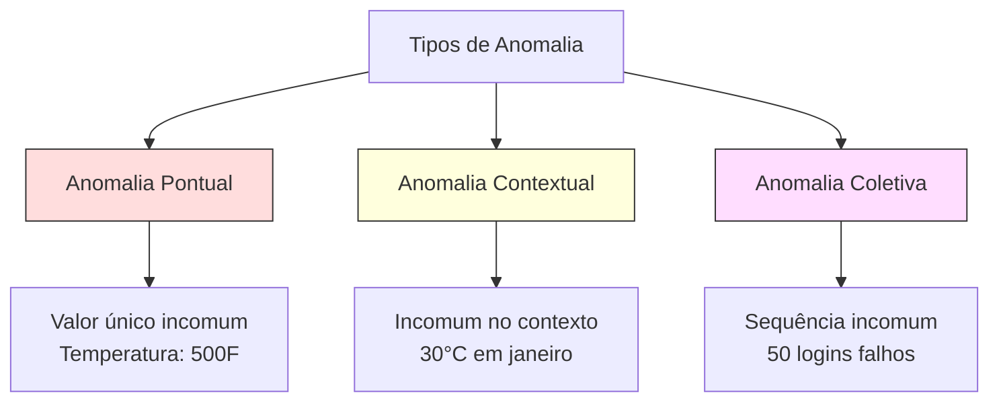
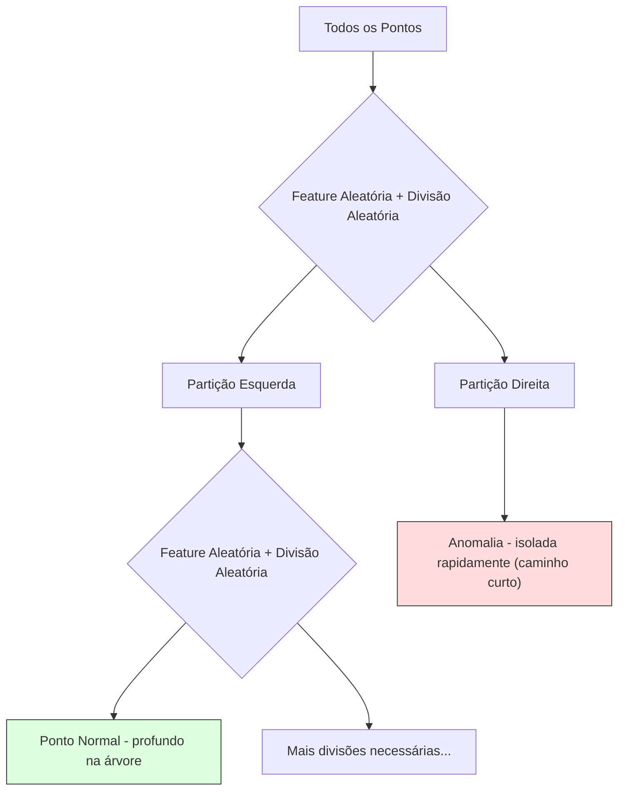
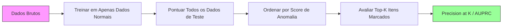

# Detecção de Anomalias

> Normal é fácil de definir. Anormal é tudo que não se encaixa.

**Tipo:** Build
**Linguagens:** Python
**Pré-requisitos:** Fase 2, Aulas 01-09
**Tempo:** ~75 minutos

## Objetivos de Aprendizado

- Implementar métodos de detecção de anomalias Z-score, IQR e Isolation Forest do zero
- Distinguir entre anomalias pontuais, contextuais e coletivas e selecionar o método de detecção apropriado para cada uma
- Explicar por que a detecção de anomalias é enquadrada como modelagem de dados normais em vez de classificação de anomalias
- Comparar detecção de anomalias não supervisionada com classificação supervisionada e avaliar o trade-off entre cobertura de anomalias novas e precisão

## O Problema

Um cartão de crédito é usado em Nova York às 14h, depois em Tóquio às 14h05. Um sensor de fábrica lê 150 graus quando a faixa normal é 80-120. Um servidor envia 50.000 requisições por segundo quando a média diária é 200.

Estas são anomalias. Encontrá-las importa. Fraude custa bilhões. Falhas de equipamento custam tempo de inatividade. Intrusões de rede custam dados.

O desafio: você raramente tem exemplos rotulados de anomalias. Fraude compõe 0.1% das transações. Falhas de equipamento acontecem algumas vezes por ano. Você não pode treinar um classificador padrão porque não há quase nada na classe "anomalia" para aprender. Mesmo se você tiver alguns rótulos, as anomalias que você viu não são os únicos tipos que encontrará. O esquema de fraude de amanhã parece diferente do de hoje.

A detecção de anomalias inverte o problema. Em vez de aprender o que é anormal, aprenda o que é normal. Qualquer coisa que se desvie do normal é suspeita. Isso funciona sem rótulos, se adapta a novos tipos de anomalias e escala para datasets massivos.

## O Conceito

### Tipos de Anomalias

Nem todas as anomalias são iguais:

- **Anomalias pontuais.** Um único ponto de dados que é incomum independentemente de contexto. Uma leitura de temperatura de 500 graus. Uma transação de $50.000 em uma conta que normalmente gasta $50.
- **Anomalias contextuais.** Um ponto de dados que é incomum dado seu contexto. Uma temperatura de 30°C é normal no verão, anômala no inverno. Mesmo valor, contexto diferente.
- **Anomalias coletivas.** Uma sequência de pontos de dados que é incomum como grupo, mesmo que cada ponto individual seja normal. Cinco falhas de login é normal. Cinquenta seguidas é um ataque de força bruta.

A maioria dos métodos detecta anomalias pontuais. Anomalias contextuais precisam de features de tempo ou localização. Anomalias coletivas precisam de métodos conscientes de sequência.



### O Enquadramento Não Supervisionado

Na classificação padrão, você tem rótulos para ambas as classes. Na detecção de anomalias, você tipicamente tem uma de três situações:

1. **Totalmente não supervisionado.** Nenhum rótulo. Você ajusta o detector em todos os dados e espera que anomalias sejam raras o suficiente para não corromper o modelo "normal".
2. **Semissupervisionado.** Você tem um dataset limpo de dados normais apenas. Você ajusta neste conjunto limpo e pontua todo o resto. Esta é a configuração mais forte quando possível.
3. **Fracamente supervisionado.** Você tem algumas anomalias rotuladas. Use-as para avaliação, não para treino. Treine não supervisionado, depois meça precisão/recall no subconjunto rotulado.

A percepção chave: a detecção de anomalias é fundamentalmente diferente da classificação. Você está modelando a distribuição dos dados normais, não a fronteira de decisão entre duas classes.

### Supervisionado vs Não Supervisionado: O Trade-off

Se você tem anomalias rotuladas, deve usá-las para treino (classificação supervisionada) ou apenas para avaliação (detecção não supervisionada)?

**Supervisionado (tratar como classificação):**
- Pega os tipos exatos de anomalias que você viu antes
- Maior precisão em tipos de anomalias conhecidos
- Perde completamente novos tipos de anomalias
- Requer re-treino quando novos tipos de anomalias surgem
- Precisa de exemplos de anomalias suficientes (muitas vezes muito poucos)

**Não supervisionado (modelar normal, marcar desvios):**
- Pega qualquer desvio do normal, incluindo novos tipos
- Não requer anomalias rotuladas
- Maior taxa de falsos positivos (nem tudo que é incomum é ruim)
- Mais robusto a mudanças na distribuição

Na prática, os melhores sistemas combinam ambos: detecção não supervisionada para ampla cobertura, modelos supervisionados para tipos de anomalia conhecidos de alta prioridade e revisão humana para casos ambíguos.

### Método Z-Score

A abordagem mais simples. Compute a média e o desvio padrão de cada feature. Marque qualquer ponto a mais de k desvios padrão da média.

```text
z_score = (x - media) / std
anomalia se |z_score| > limiar
```

O limiar padrão é 3.0 (99.7% dos dados normais estão dentro de 3 desvios padrão para uma distribuição Gaussiana).

**Pontos fortes:** Simples. Rápido. Interpretável ("este valor está 4.5 desvios padrão do normal").

**Fraquezas:** Assume que os dados são normalmente distribuídos. Sensível a outliers nos dados de treino (os outliers deslocam a média e inflam o std, tornando-os mais difíceis de detectar). Falha em distribuições multimodais.

**Quando funciona bem:** Monitoramento de feature única onde os dados são aproximadamente em forma de sino. Tempos de resposta de servidor, tolerâncias de fabricação, leituras de sensores com baselines estáveis.

**Quando falha:** Dados com múltiplos clusters (dois locais de escritório com temperaturas baseline diferentes), dados assimétricos (valores de transação onde $1000 é raro mas não anômalo), dados com outliers no conjunto de treino.

### Método IQR

Mais robusto que Z-score. Usa o intervalo interquartil em vez da média e desvio padrão.

```
Q1 = 25º percentil
Q3 = 75º percentil
IQR = Q3 - Q1
limite_inferior = Q1 - fator * IQR
limite_superior = Q3 + fator * IQR
anomalia se x < limite_inferior ou x > limite_superior
```

O fator padrão é 1.5.

**Pontos fortes:** Robusto a outliers (percentis não são afetados por valores extremos). Funciona em distribuições assimétricas. Sem suposição de normalidade.

**Fraquezas:** Apenas univariado (aplica por feature independentemente). Não pode detectar anomalias que são incomuns apenas quando features são consideradas juntas (um ponto pode ser normal em cada feature individualmente mas anômalo no espaço conjunto).

**Nota prática:** O fator 1.5 no IQR corresponde aos whiskers em um box plot. Pontos fora dos whiskers são potenciais outliers. Usar 3.0 em vez de 1.5 torna o detector mais conservador (menos marcações, menos falsos positivos). O fator certo depende de sua tolerância para falsos alarmes.

### Isolation Forest

A percepção chave: anomalias são poucas e diferentes. Em uma partição aleatória dos dados, anomalias são mais fáceis de isolar — elas precisam de menos divisões aleatórias para serem separadas do resto.



**Como funciona:**
1. Construa muitas árvores aleatórias (uma isolation forest)
2. Em cada nó, escolha uma feature aleatória e um valor de divisão aleatório entre o min e max da feature
3. Continue dividindo até que todo ponto esteja isolado (em sua própria folha)
4. Anomalias têm comprimentos médios de caminho mais curtos em todas as árvores

**Por que funciona:** Pontos normais vivem em regiões densas. Muitas divisões aleatórias são necessárias para isolar um de seus vizinhos. Anomalias vivem em regiões esparsas. Uma ou duas divisões aleatórias são suficientes para isolá-las.

O score de anomalia é baseado no comprimento médio do caminho em todas as árvores, normalizado pelo comprimento de caminho esperado de uma árvore de busca binária aleatória:

```
score(x) = 2^(-comprimento_médio_caminho(x) / c(n))
```

Onde `c(n)` é o comprimento de caminho esperado para n amostras. Score próximo de 1 significa anomalia. Score próximo de 0.5 significa normal. Score próximo de 0 significa muito normal (profundo em clusters densos).

**Pontos fortes:** Sem suposições de distribuição. Funciona em altas dimensões. Escala bem (sublinear no tamanho da amostra porque cada árvore usa uma subamostra). Lida com tipos mistos de features.

**Fraquezas:** Dificuldade com anomalias em regiões densas (efeito de mascaramento). A divisão aleatória é menos eficaz quando muitas features são irrelevantes.

**Hiperparâmetros chave:**
- `n_estimators`: Número de árvores. 100 geralmente é suficiente. Mais árvores dão scores mais estáveis mas computação mais lenta.
- `max_samples`: Número de amostras por árvore. 256 é o padrão no paper original. Valores menores tornam árvores individuais menos precisas mas aumentam a diversidade. A subamostragem é o que torna o Isolation Forest rápido — cada árvore vê uma pequena fração dos dados.
- `contamination`: Fração esperada de anomalias. Usado apenas para definir o limiar. Não afeta os scores em si.

### Local Outlier Factor (LOF)

LOF compara a densidade local ao redor de um ponto com a densidade ao redor de seus vizinhos. Um ponto em uma região esparsa rodeado por regiões densas é anômalo.

**Como funciona:**
1. Para cada ponto, encontre seus k vizinhos mais próximos
2. Compute a densidade de alcançabilidade local (quão densa é a vizinhança)
3. Compare a densidade de cada ponto com as densidades de seus vizinhos
4. Se um ponto tem densidade muito menor que seus vizinhos, é um outlier

**Score LOF:**
- LOF próximo de 1.0 significa densidade similar aos vizinhos (normal)
- LOF maior que 1.0 significa densidade menor que os vizinhos (potencialmente anômalo)
- LOF muito maior que 1.0 (ex: 2.0+) significa densidade significativamente menor (provavelmente anomalia)

A parte "local" é crítica. Considere um dataset com dois clusters: um cluster denso de 1000 pontos e um cluster esparso de 50 pontos. Um ponto na borda do cluster esparso não é globalmente incomum — ele tem 50 vizinhos. Mas é localmente incomum se seus vizinhos imediatos são mais densos que ele. LOF captura essa nuance que métodos globais perdem.

**Pontos fortes:** Detecta anomalias locais (pontos que são incomuns em sua vizinhança, mesmo que não sejam globalmente incomuns). Funciona em clusters de diferentes densidades.

**Fraquezas:** Lento em datasets grandes (O(n²) para implementação ingênua). Sensível à escolha de k. Não funciona bem em dimensões muito altas (maldição da dimensionalidade afeta cálculos de distância).

### Comparação

| Método | Suposições | Velocidade | Lida com Altas Dims | Detecta Anomalias Locais |
|--------|-----------|-----------|-------------------|------------------------|
| Z-score | Distribuição normal | Muito rápido | Sim (por feature) | Não |
| IQR | Nenhuma (por feature) | Muito rápido | Sim (por feature) | Não |
| Isolation Forest | Nenhuma | Rápido | Sim | Parcialmente |
| LOF | Distância é significativa | Lento | Mal | Sim |

### Desafios de Avaliação

Avaliar detectores de anomalias é mais difícil que avaliar classificadores:

- **Desbalanceamento extremo de classes.** Com 0.1% de anomalias, prever "normal" para tudo dá 99.9% de acurácia. Acurácia é inútil.
- **AUROC é enganoso.** Com desbalanceamento pesado, AUROC pode parecer bom mesmo quando o modelo perde a maioria das anomalias em limiares práticos.
- **Métricas melhores:** Precision@k (dos k itens marcados, quantos são anomalias reais), AUPRC (área sob a curva precision-recall) e recall a uma taxa de falsos positivos fixa.



### Pipeline de Detecção de Anomalias

Na prática, a detecção de anomalias segue este workflow:

1. **Colete dados de baseline.** Idealmente, um período onde você sabe que não há (ou muito poucas) anomalias.
2. **Engenharia de features.** Features brutas mais features derivadas (estatísticas móveis, features de tempo, razões).
3. **Treine o detector.** Ajuste nos dados de baseline. O modelo aprende como "normal" se parece.
4. **Pontue novos dados.** Cada nova observação recebe um score de anomalia.
5. **Seleção de limiar.** Escolha o ponto de corte do score. Isto é uma decisão de negócio: limiar mais alto significa menos falsos alarmes mas mais anomalias perdidas.
6. **Alerta e investigação.** Pontos marcados vão para revisão humana ou resposta automatizada.
7. **Coleta de feedback.** Registre se itens marcados foram anomalias verdadeiras ou falsos alarmes. Use esses dados para avaliar o detector e ajustar o limiar ao longo do tempo.

O pipeline nunca está "pronto." Distribuições de dados mudam, novos tipos de anomalia surgem e limiares precisam de ajuste. Trate a detecção de anomalias como um sistema vivo, não um modelo único.

## Construa

O código em `code/anomaly_detection.py` implementa Z-score, IQR e Isolation Forest do zero.

### Detector Z-Score

```python
def zscore_detect(X, threshold=3.0):
    mean = X.mean(axis=0)
    std = X.std(axis=0)
    std[std == 0] = 1.0
    z = np.abs((X - mean) / std)
    return z.max(axis=1) > threshold
```

Simples e vetorizado. Marca um ponto se qualquer feature excede o limiar.

### Detector IQR

```python
def iqr_detect(X, factor=1.5):
    q1 = np.percentile(X, 25, axis=0)
    q3 = np.percentile(X, 75, axis=0)
    iqr = q3 - q1
    iqr[iqr == 0] = 1.0
    lower = q1 - factor * iqr
    upper = q3 + factor * iqr
    outside = (X < lower) | (X > upper)
    return outside.any(axis=1)
```

### Isolation Forest do Zero

A implementação feita do zero constrói árvores de isolamento que particionam aleatoriamente o espaço de features:

```python
class IsolationTree:
    def __init__(self, max_depth):
        self.max_depth = max_depth

    def fit(self, X, depth=0):
        n, p = X.shape
        if depth >= self.max_depth or n <= 1:
            self.is_leaf = True
            self.size = n
            return self
        self.is_leaf = False
        self.feature = np.random.randint(p)
        x_min = X[:, self.feature].min()
        x_max = X[:, self.feature].max()
        if x_min == x_max:
            self.is_leaf = True
            self.size = n
            return self
        self.threshold = np.random.uniform(x_min, x_max)
        left_mask = X[:, self.feature] < self.threshold
        self.left = IsolationTree(self.max_depth).fit(X[left_mask], depth + 1)
        self.right = IsolationTree(self.max_depth).fit(X[~left_mask], depth + 1)
        return self
```

O comprimento do caminho para isolar um ponto determina seu score de anomalia. Caminhos mais curtos significam mais anômalo.

A classe `IsolationForest` envolve múltiplas árvores:

```python
class IsolationForest:
    def __init__(self, n_estimators=100, max_samples=256, seed=42):
        self.n_estimators = n_estimators
        self.max_samples = max_samples

    def fit(self, X):
        sample_size = min(self.max_samples, X.shape[0])
        max_depth = int(np.ceil(np.log2(sample_size)))
        for _ in range(self.n_estimators):
            idx = rng.choice(X.shape[0], size=sample_size, replace=False)
            tree = IsolationTree(max_depth=max_depth)
            tree.fit(X[idx])
            self.trees.append(tree)

    def anomaly_score(self, X):
        avg_path = average path length across all trees
        scores = 2.0 ** (-avg_path / c(max_samples))
        return scores
```

O fator de normalização `c(n)` é o comprimento de caminho esperado de uma busca mal-sucedida em uma árvore de busca binária com n elementos. É igual a `2 * H(n-1) - 2*(n-1)/n` onde `H` é o número harmônico. Esta normalização garante que scores são comparáveis entre datasets de diferentes tamanhos.

### Cenários de Demonstração

O código gera múltiplos cenários de teste:

1. **Cluster único com outliers.** Um cluster Gaussiano 2D com anomalias injetadas longe do centro. Todos os métodos devem funcionar aqui.
2. **Dados multimodais.** Três clusters de diferentes tamanhos e densidades. Pontos entre clusters são anômalos. Z-score luta porque as faixas por feature são amplas.
3. **Dados de alta dimensão.** 50 features, mas anomalias diferem em apenas 5 delas. Testa se métodos conseguem encontrar anomalias em um subconjunto de features.

Cada demonstração compara todos os métodos usando precisão, recall, F1 e Precision@k.

## Use

Com sklearn (usando implementações de biblioteca, não feitas do zero):

```python
from sklearn.ensemble import IsolationForest
from sklearn.neighbors import LocalOutlierFactor

iso = IsolationForest(n_estimators=100, contamination=0.05, random_state=42)
iso.fit(X_train)
predictions = iso.predict(X_test)

lof = LocalOutlierFactor(n_neighbors=20, contamination=0.05, novelty=True)
lof.fit(X_train)
predictions = lof.predict(X_test)
```

Note que `contamination` define a fração esperada de anomalias. Definí-lo corretamente importa — muito baixo perde anomalias, muito alto cria falsos alarmes.

O código em `anomaly_detection.py` compara implementações feitas do zero contra sklearn nos mesmos dados.

### Parâmetro Contamination no sklearn

O parâmetro `contamination` no sklearn determina o limiar para converter scores de anomalia contínuos em predições binárias. Ele não muda os scores subjacentes.

```python
iso_5 = IsolationForest(contamination=0.05)
iso_10 = IsolationForest(contamination=0.10)
```

Ambos produzem os mesmos scores de anomalia. Mas `iso_5` marca os top 5% enquanto `iso_10` marca os top 10%. Se você não sabe a taxa de anomalia verdadeira (geralmente não sabe), defina contamination como "auto" e trabalhe com os scores brutos diretamente. Defina seu próprio limiar baseado no trade-off de custo entre falsos positivos e falsos negativos.

### One-Class SVM

Outro detector de anomalias não supervisionado que vale conhecer. One-Class SVM ajusta uma fronteira ao redor dos dados normais em um espaço de features de alta dimensão (usando o truque do kernel).

```python
from sklearn.svm import OneClassSVM

oc_svm = OneClassSVM(kernel="rbf", gamma="auto", nu=0.05)
oc_svm.fit(X_train)
predictions = oc_svm.predict(X_test)
```

O parâmetro `nu` aproxima a fração de anomalias. One-Class SVM funciona bem em datasets pequenos a médios mas não escala para dados muito grandes (a matriz do kernel cresce quadraticamente).

### Abordagem de Autoencoder (Preview)

Autoencoders são redes neurais que aprendem a comprimir e reconstruir dados. Treine em dados normais. No teste, anomalias têm alto erro de reconstrução porque a rede aprendeu a reconstruir apenas padrões normais.

Isso é coberto na Fase 3 (Deep Learning), mas o princípio é o mesmo: modele o que é normal, marque o que se desvia.

### Ensemble de Detecção de Anomalias

Assim como métodos ensemble melhoram a classificação (Aula 11), combinar múltiplos detectores de anomalias melhora a detecção. A abordagem mais simples:

1. Execute múltiplos detectores (Z-score, IQR, Isolation Forest, LOF)
2. Normalize os scores de cada detector para [0, 1]
3. Calcule a média dos scores normalizados
4. Marque pontos acima do limiar no score médio

Isso reduz falsos positivos porque diferentes métodos têm diferentes modos de falha. Um ponto marcado por todos os quatro métodos é quase certamente anômalo. Um ponto marcado por apenas um pode ser uma peculiaridade daquele método.

Ensembles mais sofisticados ponderam cada detector por sua confiabilidade estimada (medida em um conjunto de validação com anomalias conhecidas, se disponível).

### Considerações de Produção

1. **Deriva de limiar.** Conforme a distribuição dos dados muda, um limiar fixo se torna desatualizado. Monitore a distribuição dos scores de anomalia e ajuste periodicamente.
2. **Fadiga de alerta.** Muitos falsos alarmes e os operadores param de prestar atenção. Comece com um limiar alto (menos alertas, mais confiáveis) e diminua conforme a confiança aumenta.
3. **Abordagem ensemble.** Em produção, combine múltiplos detectores. Marque um ponto apenas se múltiplos métodos concordam que é anômalo. Isso reduz falsos positivos significativamente.
4. **Engenharia de features.** Features brutas raramente são suficientes. Adicione estatísticas móveis, razões, tempo-desde-último-evento e features específicas do domínio. Um bom conjunto de features importa mais que a escolha do detector.
5. **Loop de feedback.** Quando operadores investigam itens marcados e os confirmam ou descartam, alimente isso de volta ao sistema. Acumule dados rotulados ao longo do tempo para avaliar e melhorar o detector.

## Entregue

Esta lição produz:
- `outputs/skill-anomaly-detector.md` — uma skill de decisão para escolher o detector certo
- `code/anomaly_detection.py` — Z-score, IQR e Isolation Forest do zero, com comparação sklearn

### Escolhendo um Limiar

O score de anomalia é contínuo. Você precisa de um limiar para tomar decisões binárias. Isto é uma decisão de negócio, não técnica.

Considere dois cenários:
- **Detecção de fraude.** Perder fraude é caro (chargebacks, confiança do cliente). Falsos alarmes custam 5 minutos de um analista humano para investigar. Defina o limiar baixo para pegar mais fraudes, aceite mais falsos alarmes.
- **Manutenção de equipamento.** Um falso alarme significa uma parada desnecessária custando $50.000. Uma falha perdida significa um reparo de $500.000. Defina o limiar para equilibrar estes custos.

Em ambos os casos, o limiar ótimo depende da razão de custo entre falsos positivos e falsos negativos. Plote precisão e recall em diferentes limiares, sobreponha a função de custo e escolha o ponto de custo mínimo.

### Escalando para Produção

Para detecção de anomalias em tempo real em produção:

1. **Treino em lote, scoring online.** Treine o modelo periodicamente (diariamente, semanalmente) em dados normais recentes. Pontue cada nova observação conforme ela chega.
2. **A computação de features deve corresponder.** Se você treinou com estatísticas móveis em 30 dias, você precisa de 30 dias de histórico para computar features para uma nova observação. Armazene o histórico necessário.
3. **Monitoramento da distribuição de scores.** Acompanhe a distribuição dos scores de anomalia ao longo do tempo. Se o score mediano deriva para cima, ou os dados estão mudando ou o modelo está desatualizado.
4. **Explicabilidade.** Quando você marca uma anomalia, diga por quê. Z-score: "Feature X está 4.2 desvios padrão acima do normal." Isolation Forest: "Este ponto foi isolado em 3.1 divisões em média (pontos normais levam 8.5)."

## Exercícios

1. **Ajuste de limiar.** Execute o detector Z-score com limiares de 1.0 a 5.0 em passos de 0.5. Plote precisão e recall em cada limiar. Onde está o ponto ideal para seus dados?

2. **Anomalias multivariadas.** Crie dados 2D onde cada feature individualmente parece normal, mas a combinação é anômala (ex: pontos longe da diagonal do cluster principal). Mostre que Z-score por feature não pega estas, mas Isolation Forest as pega.

3. **LOF do zero.** Implemente Local Outlier Factor usando k-vizinhos mais próximos. Compare com LocalOutlierFactor do sklearn nos mesmos dados. Use k=10 e k=50 — como a escolha de k afeta os resultados?

4. **Detecção de anomalias em streaming.** Modifique o detector Z-score para funcionar em streaming: atualize a média e variância contínuas conforme novos pontos chegam (algoritmo online de Welford). Compare com Z-score em lote nos mesmos dados.

5. **Avaliação no mundo real.** Pegue um dataset com anomalias conhecidas (fraude de cartão de crédito do Kaggle, por exemplo). Avalie todos os quatro métodos usando precision@100, precision@500 e AUPRC. Qual método funciona melhor? Por quê?

## Termos-Chave

| Termo | O que o pessoal diz | O que realmente significa |
|-------|--------------------|-----------------------|
| Anomalia | "Outlier, ponto incomum" | Um ponto de dados que se desvia significativamente do padrão esperado de dados normais |
| Anomalia pontual | "Um único valor estranho" | Uma observação individual que é incomum independentemente de contexto |
| Anomalia contextual | "Valor normal, contexto errado" | Uma observação que é incomum dado seu contexto (tempo, localização, etc.) mas pode ser normal em outro contexto |
| Isolation Forest | "Divisões aleatórias para encontrar outliers" | Um ensemble de árvores aleatórias que isola anomalias com menos divisões que pontos normais |
| Local Outlier Factor | "Comparar densidade com vizinhos" | Um método que marca pontos cuja densidade local é muito menor que a densidade de seus vizinhos |
| Z-score | "Desvios padrão da média" | (x - media) / std, medindo quão longe um ponto está do centro em unidades de desvio padrão |
| IQR | "Intervalo interquartil" | Q3 - Q1, medindo a dispersão dos 50% centrais dos dados, usado para detecção robusta de outliers |
| Contaminação | "Fração esperada de anomalias" | Um hiperparâmetro que diz ao detector qual proporção dos dados ele deve marcar como anômalo |
| Precision@k | "Dos top k marcados, quantos são reais" | Precisão computada apenas nos k pontos mais suspeitos, útil para detecção de anomalias desbalanceada |
| AUPRC | "Área sob a curva precision-recall" | Uma métrica que resume a performance precision-recall em todos os limiares, melhor que AUROC para dados desbalanceados |

## Leitura Adicional

- [Liu et al., Isolation Forest (2008)](https://cs.nju.edu.cn/zhouzh/zhouzh.files/publication/icdm08b.pdf) — o paper original do Isolation Forest
- [Breunig et al., LOF: Identifying Density-Based Local Outliers (2000)](https://dl.acm.org/doi/10.1145/342009.335388) — o paper original do LOF
- [scikit-learn Outlier Detection docs](https://scikit-learn.org/stable/modules/outlier_detection.html) — visão geral de todos os detectores de anomalias do sklearn
- [Chandola et al., Anomaly Detection: A Survey (2009)](https://dl.acm.org/doi/10.1145/1541880.1541882) — survey abrangente de métodos de detecção de anomalias
- [Goldstein and Uchida, A Comparative Evaluation of Unsupervised Anomaly Detection Algorithms (2016)](https://journals.plos.org/plosone/article?id=10.1371/journal.pone.0152173) — comparação empírica de 10 métodos em datasets reais
