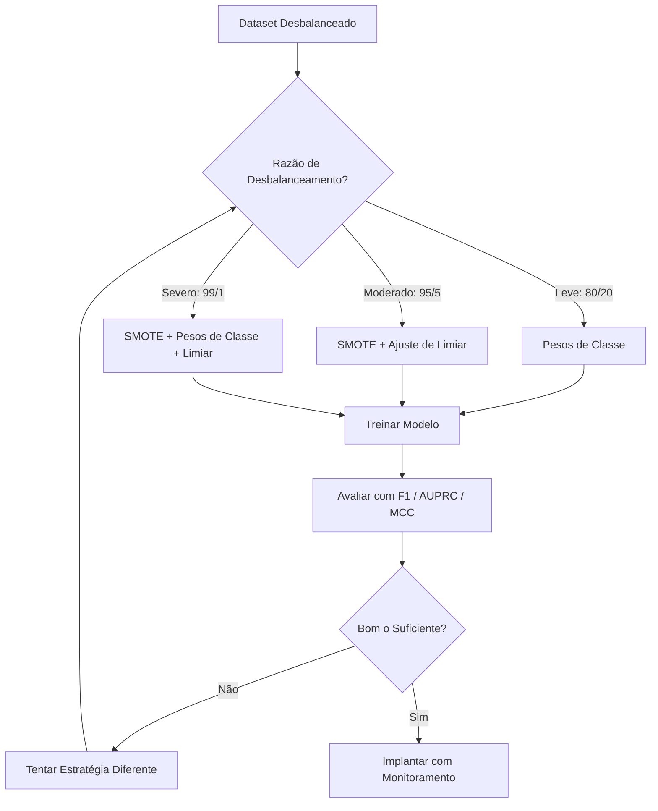
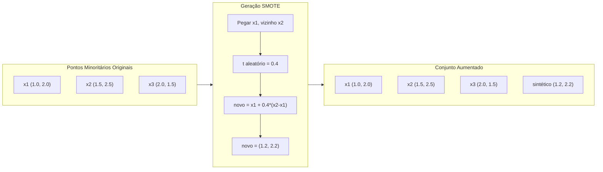
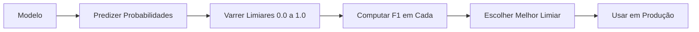
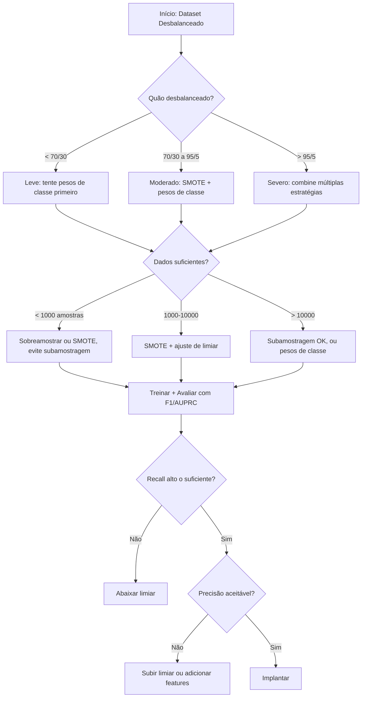

# Trabalhando com Dados Desbalanceados

> Quando 99% dos seus dados são "normais", acurácia é uma mentira.

**Tipo:** Build
**Linguagens:** Python
**Pré-requisitos:** Fase 2, Aulas 01-09 (especialmente métricas de avaliação)
**Tempo:** ~90 minutos

## Objetivos de Aprendizado

- Implementar SMOTE do zero e explicar como a sobreamostragem sintética difere da duplicação aleatória
- Avaliar classificadores desbalanceados usando F1, AUPRC e Matthews Correlation Coefficient em vez de acurácia
- Comparar ponderação de classes, ajuste de limiar e estratégias de reamostragem e selecionar a abordagem certa para uma dada razão de desbalanceamento
- Construir uma pipeline completa para dados desbalanceados que combina SMOTE, pesos de classe e otimização de limiar

## O Problema

Você constrói um modelo de detecção de fraude. Ele tem 99.9% de acurácia. Você comemora. Então percebe que ele prevê "não fraude" para toda transação.

Isso não é um bug. É a coisa racional a fazer quando apenas 0.1% das transações são fraudulentas. O modelo aprende que sempre chutar a classe majoritária minimiza o erro total. Está tecnicamente correto e completamente inútil.

Isso acontece em todos os lugares onde a classificação real importa. Diagnóstico de doenças: 1% de taxa positiva. Intrusão de rede: 0.01% de ataques. Defeitos de fabricação: 0.5% defeituosos. Filtro de spam: 20% spam. Previsão de churn: 5% de churners. Quanto mais consequente a classe minoritária, mais rara ela tende a ser.

A acurácia falha porque trata todas as previsões corretas igualmente. Rotular corretamente uma transação legítima e pegar corretamente uma fraude contam como um ponto de acurácia cada. Mas pegar fraude é a razão inteira do modelo existir. Precisamos de métricas, técnicas e estratégias de treino que forcem o modelo a prestar atenção na classe rara mas importante.

## O Conceito

### Por que a Acurácia Falha

Considere um dataset com 1000 amostras: 990 negativas, 10 positivas. Um modelo que sempre prevê negativo:

|  | Previsto Positivo | Previsto Negativo |
|--|---|---|
| Real Positivo | 0 (VP) | 10 (FN) |
| Real Negativo | 0 (FP) | 990 (VN) |

Acurácia = (0 + 990) / 1000 = 99.0%

O modelo pega zero fraudes. Zero doenças. Zero defeitos. Mas a acurácia diz 99%. Isto é por que a acurácia é perigosa para problemas desbalanceados.

### Métricas Melhores

**Precisão** = VP / (VP + FP). De tudo marcado como positivo, quanto realmente é? Alta precisão significa poucos falsos alarmes.

**Recall** = VP / (VP + FN). De tudo realmente positivo, quanto pegamos? Alto recall significa poucos positivos perdidos.

**F1 Score** = 2 * precisão * recall / (precisão + recall). A média harmônica. Penaliza desequilíbrio extremo entre precisão e recall mais que a média aritmética.

**F-beta Score** = (1 + beta^2) * precisão * recall / (beta^2 * precisão + recall). Quando beta > 1, recall importa mais. Quando beta < 1, precisão importa mais. F2 é comum em detecção de fraude (perder fraude é pior que um falso alarme).

**AUPRC** (Área Sob a Curva Precision-Recall). Como AUC-ROC mas mais informativa para dados desbalanceados. Um classificador aleatório tem AUPRC igual à taxa da classe positiva (não 0.5 como ROC). Isso torna as melhorias mais fáceis de ver.

**Matthews Correlation Coefficient** = (VP * VN - FP * FN) / sqrt((VP+FP)(VP+FN)(VN+FP)(VN+FN)). Varia de -1 a +1. Só dá um score alto quando o modelo vai bem em ambas as classes. Balanceado mesmo quando as classes são de tamanhos muito diferentes.

Para o modelo "sempre prevê negativo" acima: precisão = 0/0 (indefinido, frequentemente definido como 0), recall = 0/10 = 0, F1 = 0, MCC = 0. Essas métricas identificam corretamente o modelo como inútil.

### A Pipeline para Dados Desbalanceados



### SMOTE: Técnica de Sobreamostragem Sintética de Minoritários

A sobreamostragem aleatória duplica amostras minoritárias existentes. Isso funciona mas arrisca overfitting porque o modelo vê pontos idênticos repetidamente.

SMOTE cria novas amostras minoritárias sintéticas que são plausíveis mas não cópias. O algoritmo:

1. Para cada amostra minoritária x, encontre seus k vizinhos mais próximos entre outras amostras minoritárias
2. Escolha um vizinho aleatoriamente
3. Crie uma nova amostra no segmento de linha entre x e aquele vizinho

A fórmula: `nova_amostra = x + aleatório(0, 1) * (vizinho - x)`

Isso interpola entre pontos minoritários reais, criando amostras na mesma região do espaço de features sem apenas copiar dados existentes.



### Estratégias de Reamostragem Comparadas

**Sobreamostragem Aleatória**: duplicar amostras minoritárias para igualar a contagem majoritária.
- Prós: simples, sem perda de informação
- Contras: duplicatas exatas causam overfitting, aumenta tempo de treino

**Subamostragem Aleatória**: remover amostras majoritárias para igualar a contagem minoritária.
- Prós: treino rápido, simples
- Contras: descarta dados majoritários potencialmente úteis, maior variância

**SMOTE**: criar amostras minoritárias sintéticas via interpolação.
- Prós: gera novos pontos de dados, reduz overfitting comparado à sobreamostragem aleatória
- Contras: pode criar amostras ruidosas perto da fronteira de decisão, não considera a distribuição da classe majoritária

| Estratégia | Dados Alterados | Risco | Quando Usar |
|-----------|----------------|-------|-------------|
| Sobreamostrar | Minoritária duplicada | Overfitting | Datasets pequenos, desbalanceamento moderado |
| Subamostrar | Majoritária removida | Perda de informação | Datasets grandes, treino rápido desejado |
| SMOTE | Minoritária sintética adicionada | Ruído na fronteira | Desbalanceamento moderado, amostras minoritárias suficientes para k-NN |

### Pesos de Classe

Em vez de mudar os dados, mude como o modelo trata erros. Atribua maior peso a erros de classificação da classe minoritária.

Para um problema binário com 950 negativas e 50 positivas:
- Peso para classe negativa = n_amostras / (2 * n_negativas) = 1000 / (2 * 950) = 0.526
- Peso para classe positiva = n_amostras / (2 * n_positivas) = 1000 / (2 * 50) = 10.0

A classe positiva recebe 19x o peso. Errar uma amostra positiva custa tanto quanto errar 19 amostras negativas. O modelo é forçado a prestar atenção na classe minoritária.

Na regressão logística, isso modifica a função de perda:

```
perda_ponderada = -sum(w_i * [y_i * log(p_i) + (1-y_i) * log(1-p_i)])
```

onde w_i depende da classe da amostra i.

Pesos de classe são matematicamente equivalentes à sobreamostragem em expectativa, mas sem criar novos pontos de dados. Isso os torna mais rápidos e evita o risco de overfitting de amostras duplicadas.

### Ajuste de Limiar

A maioria dos classificadores produz uma probabilidade. O limiar padrão é 0.5: se P(positivo) >= 0.5, prediz positivo. Mas 0.5 é arbitrário. Quando as classes são desbalanceadas, o limiar ótimo geralmente é muito menor.

O processo:
1. Treine um modelo
2. Obtenha as probabilidades previstas no conjunto de validação
3. Varra limiares de 0.0 a 1.0
4. Compute F1 (ou sua métrica escolhida) em cada limiar
5. Escolha o limiar que maximiza sua métrica



Um modelo pode produzir P(fraude) = 0.15 para uma transação fraudulenta. No limiar 0.5, isso é classificado como não fraude. No limiar 0.10, é corretamente pego. A calibração da probabilidade importa menos que o ranking — contanto que fraudes recebam probabilidades mais altas que não-fraudes, existe um limiar que as separa.

### Aprendizado Sensível ao Custo

Generalização dos pesos de classe. Em vez de custos uniformes, atribua custos específicos de erro:

|  | Predizer Positivo | Predizer Negativo |
|--|---|---|
| Real Positivo | 0 (correto) | C_FN = 100 |
| Real Negativo | C_FP = 1 | 0 (correto) |

Perder uma transação fraudulenta (FN) custa 100x mais que um falso alarme (FP). O modelo otimiza o custo total, não o número total de erros.

Esta é a abordagem mais fundamentada quando você pode estimar custos do mundo real. Um diagnóstico de câncer perdido tem um custo muito diferente de um falso alarme que leva a uma biópsia extra. Tornar esses custos explícitos força os trade-offs certos.

### Fluxograma de Decisão



## Construa

### Passo 1: Gerar um dataset desbalanceado

```python
import numpy as np


def make_imbalanced_data(n_majority=950, n_minority=50, seed=42):
    rng = np.random.RandomState(seed)

    X_maj = rng.randn(n_majority, 2) * 1.0 + np.array([0.0, 0.0])
    X_min = rng.randn(n_minority, 2) * 0.8 + np.array([2.5, 2.5])

    X = np.vstack([X_maj, X_min])
    y = np.concatenate([np.zeros(n_majority), np.ones(n_minority)])

    shuffle_idx = rng.permutation(len(y))
    return X[shuffle_idx], y[shuffle_idx]
```

### Passo 2: SMOTE do zero

```python
def euclidean_distance(a, b):
    return np.sqrt(np.sum((a - b) ** 2))


def find_k_neighbors(X, idx, k):
    distances = []
    for i in range(len(X)):
        if i == idx:
            continue
        d = euclidean_distance(X[idx], X[i])
        distances.append((i, d))
    distances.sort(key=lambda x: x[1])
    return [d[0] for d in distances[:k]]


def smote(X_minority, k=5, n_synthetic=100, seed=42):
    rng = np.random.RandomState(seed)
    n_samples = len(X_minority)
    k = min(k, n_samples - 1)
    synthetic = []

    for _ in range(n_synthetic):
        idx = rng.randint(0, n_samples)
        neighbors = find_k_neighbors(X_minority, idx, k)
        neighbor_idx = neighbors[rng.randint(0, len(neighbors))]
        t = rng.random()
        new_point = X_minority[idx] + t * (X_minority[neighbor_idx] - X_minority[idx])
        synthetic.append(new_point)

    return np.array(synthetic)
```

### Passo 3: Sobreamostragem e subamostragem aleatórias

```python
def random_oversample(X, y, seed=42):
    rng = np.random.RandomState(seed)
    classes, counts = np.unique(y, return_counts=True)
    max_count = counts.max()

    X_resampled = list(X)
    y_resampled = list(y)

    for cls, count in zip(classes, counts):
        if count < max_count:
            cls_indices = np.where(y == cls)[0]
            n_needed = max_count - count
            chosen = rng.choice(cls_indices, size=n_needed, replace=True)
            X_resampled.extend(X[chosen])
            y_resampled.extend(y[chosen])

    X_out = np.array(X_resampled)
    y_out = np.array(y_resampled)
    shuffle = rng.permutation(len(y_out))
    return X_out[shuffle], y_out[shuffle]


def random_undersample(X, y, seed=42):
    rng = np.random.RandomState(seed)
    classes, counts = np.unique(y, return_counts=True)
    min_count = counts.min()

    X_resampled = []
    y_resampled = []

    for cls in classes:
        cls_indices = np.where(y == cls)[0]
        chosen = rng.choice(cls_indices, size=min_count, replace=False)
        X_resampled.extend(X[chosen])
        y_resampled.extend(y[chosen])

    X_out = np.array(X_resampled)
    y_out = np.array(y_resampled)
    shuffle = rng.permutation(len(y_out))
    return X_out[shuffle], y_out[shuffle]
```

### Passo 4: Regressão logística com pesos de classe

```python
def sigmoid(z):
    return 1.0 / (1.0 + np.exp(-np.clip(z, -500, 500)))


def logistic_regression_weighted(X, y, weights, lr=0.01, epochs=200):
    n_samples, n_features = X.shape
    w = np.zeros(n_features)
    b = 0.0

    for _ in range(epochs):
        z = X @ w + b
        pred = sigmoid(z)
        error = pred - y
        weighted_error = error * weights

        gradient_w = (X.T @ weighted_error) / n_samples
        gradient_b = np.mean(weighted_error)

        w -= lr * gradient_w
        b -= lr * gradient_b

    return w, b


def compute_class_weights(y):
    classes, counts = np.unique(y, return_counts=True)
    n_samples = len(y)
    n_classes = len(classes)
    weight_map = {}
    for cls, count in zip(classes, counts):
        weight_map[cls] = n_samples / (n_classes * count)
    return np.array([weight_map[yi] for yi in y])
```

### Passo 5: Ajuste de limiar

```python
def find_optimal_threshold(y_true, y_probs, metric="f1"):
    best_threshold = 0.5
    best_score = -1.0

    for threshold in np.arange(0.05, 0.96, 0.01):
        y_pred = (y_probs >= threshold).astype(int)
        tp = np.sum((y_pred == 1) & (y_true == 1))
        fp = np.sum((y_pred == 1) & (y_true == 0))
        fn = np.sum((y_pred == 0) & (y_true == 1))

        if metric == "f1":
            precision = tp / (tp + fp) if (tp + fp) > 0 else 0.0
            recall = tp / (tp + fn) if (tp + fn) > 0 else 0.0
            score = 2 * precision * recall / (precision + recall) if (precision + recall) > 0 else 0.0
        elif metric == "recall":
            score = tp / (tp + fn) if (tp + fn) > 0 else 0.0
        elif metric == "precision":
            score = tp / (tp + fp) if (tp + fp) > 0 else 0.0

        if score > best_score:
            best_score = score
            best_threshold = threshold

    return best_threshold, best_score
```

### Passo 6: Funções de avaliação

```python
def confusion_matrix_values(y_true, y_pred):
    tp = np.sum((y_pred == 1) & (y_true == 1))
    tn = np.sum((y_pred == 0) & (y_true == 0))
    fp = np.sum((y_pred == 1) & (y_true == 0))
    fn = np.sum((y_pred == 0) & (y_true == 1))
    return tp, tn, fp, fn


def compute_metrics(y_true, y_pred):
    tp, tn, fp, fn = confusion_matrix_values(y_true, y_pred)
    accuracy = (tp + tn) / (tp + tn + fp + fn)
    precision = tp / (tp + fp) if (tp + fp) > 0 else 0.0
    recall = tp / (tp + fn) if (tp + fn) > 0 else 0.0
    f1 = 2 * precision * recall / (precision + recall) if (precision + recall) > 0 else 0.0

    denom = np.sqrt(float((tp + fp) * (tp + fn) * (tn + fp) * (tn + fn)))
    mcc = (tp * tn - fp * fn) / denom if denom > 0 else 0.0

    return {
        "accuracy": accuracy,
        "precision": precision,
        "recall": recall,
        "f1": f1,
        "mcc": mcc,
    }
```

### Passo 7: Comparar todas as abordagens

```python
X, y = make_imbalanced_data(950, 50, seed=42)
split = int(0.8 * len(y))
X_train, X_test = X[:split], X[split:]
y_train, y_test = y[:split], y[split:]

# Baseline: sem tratamento
w_base, b_base = logistic_regression_weighted(
    X_train, y_train, np.ones(len(y_train)), lr=0.1, epochs=300
)
probs_base = sigmoid(X_test @ w_base + b_base)
preds_base = (probs_base >= 0.5).astype(int)

# Sobreamostrado
X_over, y_over = random_oversample(X_train, y_train)
w_over, b_over = logistic_regression_weighted(
    X_over, y_over, np.ones(len(y_over)), lr=0.1, epochs=300
)
preds_over = (sigmoid(X_test @ w_over + b_over) >= 0.5).astype(int)

# SMOTE
minority_mask = y_train == 1
X_minority = X_train[minority_mask]
synthetic = smote(X_minority, k=5, n_synthetic=len(y_train) - 2 * int(minority_mask.sum()))
X_smote = np.vstack([X_train, synthetic])
y_smote = np.concatenate([y_train, np.ones(len(synthetic))])
w_sm, b_sm = logistic_regression_weighted(
    X_smote, y_smote, np.ones(len(y_smote)), lr=0.1, epochs=300
)
preds_smote = (sigmoid(X_test @ w_sm + b_sm) >= 0.5).astype(int)

# Pesos de classe
sample_weights = compute_class_weights(y_train)
w_cw, b_cw = logistic_regression_weighted(
    X_train, y_train, sample_weights, lr=0.1, epochs=300
)
probs_cw = sigmoid(X_test @ w_cw + b_cw)
preds_cw = (probs_cw >= 0.5).astype(int)

# Ajuste de limiar (afine no conjunto de validação, não no teste)
probs_val = sigmoid(X_val @ w_cw + b_cw)
best_thresh, best_f1 = find_optimal_threshold(y_val, probs_val, metric="f1")
preds_thresh = (probs_cw >= best_thresh).astype(int)
```

O arquivo de código executa tudo isso em um único script e imprime os resultados.

## Use

Com scikit-learn e imbalanced-learn, estas técnicas são one-liners:

```python
from sklearn.linear_model import LogisticRegression
from sklearn.metrics import classification_report, f1_score
from sklearn.model_selection import train_test_split
from imblearn.over_sampling import SMOTE
from imblearn.under_sampling import RandomUnderSampler
from imblearn.pipeline import Pipeline

X_train, X_test, y_train, y_test = train_test_split(X, y, stratify=y)

model_weighted = LogisticRegression(class_weight="balanced")
model_weighted.fit(X_train, y_train)
print(classification_report(y_test, model_weighted.predict(X_test)))

smote = SMOTE(random_state=42)
X_resampled, y_resampled = smote.fit_resample(X_train, y_train)
model_smote = LogisticRegression()
model_smote.fit(X_resampled, y_resampled)
print(classification_report(y_test, model_smote.predict(X_test)))

pipeline = Pipeline([
    ("smote", SMOTE()),
    ("model", LogisticRegression(class_weight="balanced")),
])
pipeline.fit(X_train, y_train)
print(classification_report(y_test, pipeline.predict(X_test)))
```

As implementações feitas do zero mostram exatamente o que cada técnica faz. SMOTE é apenas interpolação k-NN na classe minoritária. Pesos de classe multiplicam a perda. Ajuste de limiar é um for-loop sobre pontos de corte. Sem mágica.

## Entregue

Esta lição produz:
- `outputs/skill-imbalanced-data.md` — uma checklist de decisão para lidar com problemas de classificação desbalanceados

## Exercícios

1. **Borderline-SMOTE**: modifique a implementação SMOTE para gerar apenas amostras sintéticas para pontos minoritários que estão perto da fronteira de decisão (aqueles cujos k-vizinhos mais próximos incluem amostras da classe majoritária). Compare resultados com SMOTE padrão em um dataset onde as classes se sobrepõem.

2. **Otimização de matriz de custo**: implemente aprendizado sensível ao custo onde a matriz de custo é um parâmetro. Crie uma função que recebe uma matriz de custo e retorna predições ótimas que minimizam o custo esperado. Teste com diferentes razões de custo (1:10, 1:100, 1:1000) e plote como o trade-off precision-recall muda.

3. **Calibração de limiar**: implemente Platt scaling (ajuste uma regressão logística nas saídas brutas do modelo para produzir probabilidades calibradas). Compare a curva precision-recall antes e depois da calibração. Mostre que a calibração não muda o ranking (AUC permanece o mesmo) mas torna as probabilidades mais significativas.

4. **Ensemble com bagging balanceado**: treine múltiplos modelos, cada um em uma amostra bootstrap balanceada (toda a minoritária + subconjunto aleatório da majoritária). Calcule a média de suas predições. Compare esta abordagem contra um único modelo com SMOTE. Meça tanto performance quanto variância entre execuções.

5. **Experimento de razão de desbalanceamento**: pegue um dataset balanceado e aumente progressivamente a razão de desbalanceamento (50/50, 70/30, 90/10, 95/5, 99/1). Para cada razão, treine com e sem SMOTE. Plote F1 vs razão de desbalanceamento para ambas as abordagens. Em que razão o SMOTE começa a fazer diferença significativa?

## Termos-Chave

| Termo | O que o pessoal diz | O que realmente significa |
|-------|--------------------|-----------------------|
| Desbalanceamento de classes | "Uma classe tem muito mais amostras" | A distribuição das classes no dataset é significativamente distorcida, fazendo com que modelos favoreçam a classe majoritária |
| SMOTE | "Sobreamostragem sintética" | Cria novas amostras minoritárias interpolando entre amostras minoritárias existentes e seus k-vizinhos minoritários mais próximos |
| Pesos de classe | "Tornar erros em classes raras mais caros" | Multiplicar a função de perda por pesos específicos de classe para que o modelo penalize mais erros na minoria |
| Ajuste de limiar | "Mover a fronteira de decisão" | Mudar o ponto de corte da probabilidade para classificação do padrão 0.5 para um valor que otimiza a métrica desejada |
| Trade-off precision-recall | "Você não pode ter ambos" | Abaixar o limiar pega mais positivos (maior recall) mas também marca mais falsos positivos (menor precisão), e vice-versa |
| AUPRC | "Área sob a curva PR" | Resume a curva precision-recall em um único número; mais informativo que AUC-ROC quando as classes são fortemente desbalanceadas |
| Matthews Correlation Coefficient | "A métrica balanceada" | Uma correlação entre rótulos previstos e reais que produz um score alto apenas quando o modelo vai bem em ambas as classes |
| Aprendizado sensível ao custo | "Erros diferentes custam valores diferentes" | Incorporar custos reais de erro na objetivo de treino para que o modelo otimize o custo total, não a contagem de erros |
| Sobreamostragem aleatória | "Duplicar a minoria" | Repetir amostras da classe minoritária para balancear as contagens de classe; simples mas arrisca overfitting em pontos duplicados |

## Leitura Adicional

- [SMOTE: Synthetic Minority Over-sampling Technique (Chawla et al., 2002)](https://arxiv.org/abs/1106.1813) — o paper original do SMOTE, ainda o trabalho mais citado em aprendizado desbalanceado
- [Learning from Imbalanced Data (He & Garcia, 2009)](https://ieeexplore.ieee.org/document/5128907) — survey abrangente cobrindo abordagens de amostragem, sensíveis a custo e algorítmicas
- [imbalanced-learn documentation](https://imbalanced-learn.org/stable/) — biblioteca Python com variantes SMOTE, estratégias de subamostragem e integração com pipeline
- [The Precision-Recall Plot Is More Informative than the ROC Plot (Saito & Rehmsmeier, 2015)](https://journals.plos.org/plosone/article?id=10.1371/journal.pone.0118432) — quando e por que preferir curvas PR a curvas ROC para problemas desbalanceados
