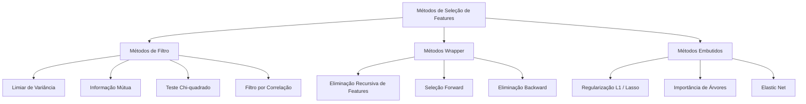
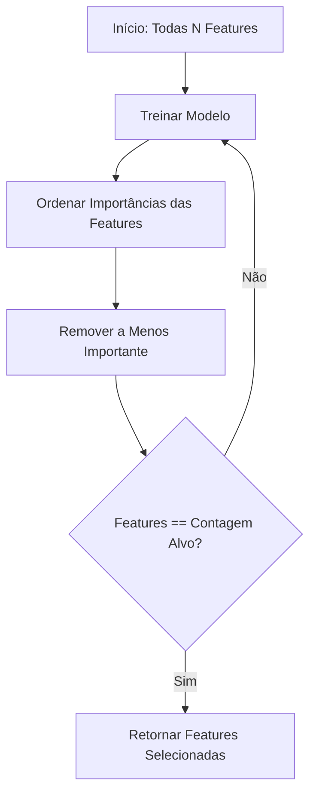
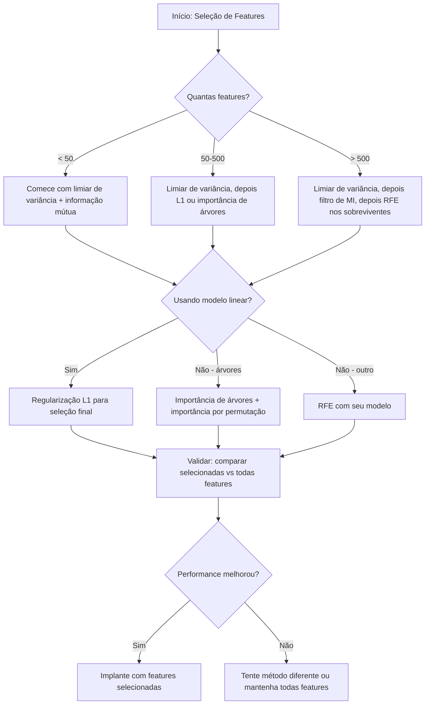

# Seleção de Features

> Mais features não é melhor. As features certas é melhor.

**Tipo:** Build
**Linguagens:** Python
**Pré-requisitos:** Fase 2, Aulas 01-09, 08 (engenharia de features)
**Tempo:** ~75 minutos

## Objetivos de Aprendizado

- Implementar métodos de filtro (limiar de variância, informação mútua, chi-quadrado) e métodos wrapper (RFE, seleção forward) do zero
- Explicar por que a informação mútua captura relações não-lineares feature-alvo que a correlação não captura
- Comparar regularização L1 (seleção embutida) com RFE (seleção wrapper) e avaliar seus trade-offs computacionais
- Construir uma pipeline de seleção de features que combina múltiplos métodos e demonstrar generalização melhorada em dados retidos

## O Problema

Você tem 500 features. Seu modelo treina devagar, overfitta constantemente e ninguém consegue explicar o que ele aprendeu. Você adiciona mais features esperando melhorar a performance. Fica pior.

Esta é a maldição da dimensionalidade em ação. Conforme o número de features cresce, o volume do espaço de features explode. Pontos de dados se tornam esparsos. Distâncias entre pontos convergem. O modelo precisa exponencialmente de mais dados para encontrar padrões reais. Features de ruído afogam features de sinal. Overfitting se torna o padrão.

Seleção de features é o antídoto. Elimine o ruído. Remova a redundância. Mantenha as features que carregam informação real sobre o alvo. O resultado: treino mais rápido, melhor generalização e modelos que você pode realmente explicar.

O objetivo não é usar toda informação disponível. É usar a informação certa.

## O Conceito

### Três Categorias de Seleção de Features

Todo método de seleção de features cai em uma de três categorias:



**Métodos de filtro** pontuam cada feature independentemente usando uma medida estatística. Eles não usam um modelo. Rápidos, mas perdem interações entre features.

**Métodos wrapper** treinam um modelo para avaliar subconjuntos de features. Eles usam a performance do modelo como pontuação. Melhores resultados, mas caros porque re-treinam o modelo muitas vezes.

**Métodos embutidos** selecionam features como parte do treino do modelo. Regularização L1 leva pesos a zero. Árvores de decisão dividem nas features mais úteis. A seleção acontece durante o ajuste, não como uma etapa separada.

### Limiar de Variância

O filtro mais simples. Se uma feature mal varia entre as amostras, ela carrega quase nenhuma informação.

Considere uma feature que é 0.0 para 999 de 1000 amostras. Sua variância é próxima de zero. Nenhum modelo pode usá-la para distinguir entre classes. Remova-a.

```
variancia(x) = media((x - media(x))^2)
```

Defina um limiar (ex: 0.01). Descarte toda feature com variância abaixo dele. Isso remove features constantes ou quase constantes sem olhar para a variável alvo.

Quando usar: como uma etapa de pré-processamento antes de outros métodos. Pega features obviamente inúteis com custo quase zero.

Limitação: uma feature pode ter alta variância e ainda ser puro ruído. O limiar de variância é necessário mas não suficiente.

### Informação Mútua

Informação mútua mede o quanto saber o valor da feature X reduz a incerteza sobre o alvo Y.

```
I(X; Y) = soma_x soma_y p(x, y) * log(p(x, y) / (p(x) * p(y)))
```

Se X e Y são independentes, p(x, y) = p(x) * p(y), então o termo log é zero e I(X; Y) = 0. Quanto mais X te diz sobre Y, maior a informação mútua.

Vantagem chave sobre correlação: informação mútua captura relações não-lineares. Uma feature pode ter correlação zero com o alvo mas alta informação mútua porque a relação é quadrática ou periódica.

Para features contínuas, discretize em bins primeiro (estimativa baseada em histograma). O número de bins afeta a estimativa — poucos bins perdem informação, muitos bins adicionam ruído. Uma escolha comum: sqrt(n) bins ou a regra de Sturges (1 + log2(n)).


### Eliminação Recursiva de Features (RFE)

RFE é um método wrapper. Ele usa a própria importância de features do modelo para podar iterativamente:

1. Treine o modelo com todas as features
2. Ordene features por importância (coeficientes para modelos lineares, redução de impureza para árvores)
3. Remova a(s) feature(s) menos importante(s)
4. Repita até que o número desejado de features permaneça



RFE considera interações entre features porque o modelo vê todas as features restantes juntas. Remover uma feature muda a importância das outras. Isso o torna mais completo que métodos de filtro.

O custo: você treina o modelo N - alvo vezes. Com 500 features e um alvo de 10, são 490 execuções de treino. Para modelos caros, isso é lento. Você pode acelerar removendo múltiplas features por passo (ex: remover os 10% inferiores a cada rodada).

### Regularização L1 (Lasso)

A regularização L1 adiciona o valor absoluto dos pesos à função de perda:

```
perda = erro_de_preditcao + alpha * sum(|w_i|)
```

O parâmetro alpha controla quão agressivamente as features são podadas. Alpha mais alto significa que mais pesos vão para exatamente zero.

Por que exatamente zero? A penalidade L1 cria uma região de restrição em forma de diamante no espaço de pesos. A solução ótima tende a pousar em um canto deste diamante, onde um ou mais pesos são zero. A regularização L2 (ridge) cria uma restrição circular onde os pesos encolhem mas raramente chegam a zero.

Isto é seleção de features embutida: o modelo aprende durante o treino quais features ignorar. Features com peso zero são efetivamente removidas.

Vantagens: única execução de treino, lida com features correlacionadas (escolhe uma e zera as outras), embutido na maioria das implementações de modelos lineares.

Limitação: só funciona para modelos lineares. Não pode capturar importância não-linear de features.

### Importância de Features Baseada em Árvores

Árvores de decisão e seus ensembles (random forests, gradient boosting) naturalmente ordenam features. Cada divisão reduz a impureza (Gini ou entropia para classificação, variância para regressão). Features que produzem maiores reduções de impureza são mais importantes.

Para uma random forest com T árvores:

```
importancia(feature_j) = (1/T) * soma sobre todas as árvores de
    soma sobre todos os nós que dividem em feature_j de
        (n_amostras * reducao_impureza)
```

Isto dá um score de importância normalizado para cada feature. Ele lida automaticamente com relações não-lineares e interações entre features.

Cuidado: a importância baseada em árvore é tendenciosa em direção a features com muitos valores únicos (alta cardinalidade). Uma coluna de ID aleatória parecerá importante porque ela divide perfeitamente cada amostra. Use importância por permutação como verificação de sanidade.

### Importância por Permutação

Um método agnóstico a modelo:

1. Treine o modelo e registre a performance baseline em dados de validação
2. Para cada feature: embaralhe seus valores aleatoriamente, meça a queda na performance
3. Quanto maior a queda, mais importante a feature

Se embaralhar uma feature não prejudica a performance, o modelo não depende dela. Se a performance colapsa, aquela feature é crítica.

A importância por permutação evita o viés de cardinalidade da importância baseada em árvore. Mas é lenta: uma avaliação completa por feature, repetida múltiplas vezes para estabilidade.

### Tabela de Comparação

| Método | Tipo | Velocidade | Não-linear | Interações de Features |
|--------|------|-----------|-----------|----------------------|
| Limiar de variância | Filtro | Muito rápido | Não | Não |
| Informação mútua | Filtro | Rápido | Sim | Não |
| Filtro por correlação | Filtro | Rápido | Não | Não |
| RFE | Wrapper | Lento | Depende do modelo | Sim |
| L1 / Lasso | Embutido | Rápido | Não (linear) | Não |
| Importância de árvores | Embutido | Médio | Sim | Sim |
| Importância por permutação | Agnóstico | Lento | Sim | Sim |

### Fluxograma de Decisão



## Construa

### Passo 1: Gerar dados sintéticos com estrutura de features conhecida

```python
import numpy as np


def make_feature_selection_data(n_samples=500, seed=42):
    rng = np.random.RandomState(seed)

    x1 = rng.randn(n_samples)
    x2 = rng.randn(n_samples)
    x3 = rng.randn(n_samples)
    x4 = x1 + 0.1 * rng.randn(n_samples)
    x5 = x2 + 0.1 * rng.randn(n_samples)

    informative = np.column_stack([x1, x2, x3, x4, x5])

    correlated = np.column_stack([
        x1 * 0.9 + 0.1 * rng.randn(n_samples),
        x2 * 0.8 + 0.2 * rng.randn(n_samples),
        x3 * 0.7 + 0.3 * rng.randn(n_samples),
        x1 * 0.5 + x2 * 0.5 + 0.1 * rng.randn(n_samples),
        x2 * 0.6 + x3 * 0.4 + 0.1 * rng.randn(n_samples),
    ])

    noise = rng.randn(n_samples, 10) * 0.5

    X = np.hstack([informative, correlated, noise])
    y = (2 * x1 - 1.5 * x2 + x3 + 0.5 * rng.randn(n_samples) > 0).astype(int)

    feature_names = (
        [f"info_{i}" for i in range(5)]
        + [f"corr_{i}" for i in range(5)]
        + [f"noise_{i}" for i in range(10)]
    )

    return X, y, feature_names
```

Sabemos a verdade básica: features 0-4 são informativas (mas 3 e 4 são cópias correlacionadas de 0 e 1), features 5-9 são correlacionadas com features informativas, features 10-19 são puro ruído. Um bom método de seleção deve classificar 0-4 como as mais altas e 10-19 como as mais baixas.

### Passo 2: Limiar de variância

```python
def variance_threshold(X, threshold=0.01):
    variances = np.var(X, axis=0)
    mask = variances > threshold
    return mask, variances
```

### Passo 3: Informação mútua (discreta)

```python
def discretize(x, n_bins=10):
    min_val, max_val = x.min(), x.max()
    if max_val == min_val:
        return np.zeros_like(x, dtype=int)
    bin_edges = np.linspace(min_val, max_val, n_bins + 1)
    binned = np.digitize(x, bin_edges[1:-1])
    return binned


def mutual_information(X, y, n_bins=10):
    n_samples, n_features = X.shape
    mi_scores = np.zeros(n_features)

    y_vals, y_counts = np.unique(y, return_counts=True)
    p_y = y_counts / n_samples

    for f in range(n_features):
        x_binned = discretize(X[:, f], n_bins)
        x_vals, x_counts = np.unique(x_binned, return_counts=True)
        p_x = dict(zip(x_vals, x_counts / n_samples))

        mi = 0.0
        for xv in x_vals:
            for yi, yv in enumerate(y_vals):
                joint_mask = (x_binned == xv) & (y == yv)
                p_xy = np.sum(joint_mask) / n_samples
                if p_xy > 0:
                    mi += p_xy * np.log(p_xy / (p_x[xv] * p_y[yi]))
        mi_scores[f] = mi

    return mi_scores
```

### Passo 4: Eliminação Recursiva de Features

```python
def simple_logistic_importance(X, y, lr=0.1, epochs=100):
    n_samples, n_features = X.shape
    w = np.zeros(n_features)
    b = 0.0

    for _ in range(epochs):
        z = X @ w + b
        pred = 1.0 / (1.0 + np.exp(-np.clip(z, -500, 500)))
        error = pred - y
        w -= lr * (X.T @ error) / n_samples
        b -= lr * np.mean(error)

    return w, b


def rfe(X, y, n_features_to_select=5, lr=0.1, epochs=100):
    n_total = X.shape[1]
    remaining = list(range(n_total))
    rankings = np.ones(n_total, dtype=int)
    rank = n_total

    while len(remaining) > n_features_to_select:
        X_subset = X[:, remaining]
        w, _ = simple_logistic_importance(X_subset, y, lr, epochs)
        importances = np.abs(w)

        least_idx = np.argmin(importances)
        original_idx = remaining[least_idx]
        rankings[original_idx] = rank
        rank -= 1
        remaining.pop(least_idx)

    for idx in remaining:
        rankings[idx] = 1

    selected_mask = rankings == 1
    return selected_mask, rankings
```

### Passo 5: Seleção de features L1

```python
def soft_threshold(w, alpha):
    return np.sign(w) * np.maximum(np.abs(w) - alpha, 0)


def l1_feature_selection(X, y, alpha=0.1, lr=0.01, epochs=500):
    n_samples, n_features = X.shape
    w = np.zeros(n_features)
    b = 0.0

    for _ in range(epochs):
        z = X @ w + b
        pred = 1.0 / (1.0 + np.exp(-np.clip(z, -500, 500)))
        error = pred - y

        gradient_w = (X.T @ error) / n_samples
        gradient_b = np.mean(error)

        w -= lr * gradient_w
        w = soft_threshold(w, lr * alpha)
        b -= lr * gradient_b

    selected_mask = np.abs(w) > 1e-6
    return selected_mask, w
```

### Passo 6: Importância baseada em árvore (árvore de decisão simples)

```python
def gini_impurity(y):
    if len(y) == 0:
        return 0.0
    classes, counts = np.unique(y, return_counts=True)
    probs = counts / len(y)
    return 1.0 - np.sum(probs ** 2)


def best_split(X, y, feature_idx):
    values = np.unique(X[:, feature_idx])
    if len(values) <= 1:
        return None, -1.0

    best_threshold = None
    best_gain = -1.0
    parent_gini = gini_impurity(y)
    n = len(y)

    for i in range(len(values) - 1):
        threshold = (values[i] + values[i + 1]) / 2.0
        left_mask = X[:, feature_idx] <= threshold
        right_mask = ~left_mask

        n_left = np.sum(left_mask)
        n_right = np.sum(right_mask)

        if n_left == 0 or n_right == 0:
            continue

        gain = parent_gini - (n_left / n) * gini_impurity(y[left_mask]) - (n_right / n) * gini_impurity(y[right_mask])

        if gain > best_gain:
            best_gain = gain
            best_threshold = threshold

    return best_threshold, best_gain


def tree_importance(X, y, n_trees=50, max_depth=5, seed=42):
    rng = np.random.RandomState(seed)
    n_samples, n_features = X.shape
    importances = np.zeros(n_features)

    for _ in range(n_trees):
        sample_idx = rng.choice(n_samples, size=n_samples, replace=True)
        feature_subset = rng.choice(n_features, size=max(1, int(np.sqrt(n_features))), replace=False)

        X_boot = X[sample_idx]
        y_boot = y[sample_idx]

        tree_imp = _build_tree_importance(X_boot, y_boot, feature_subset, max_depth)
        importances += tree_imp

    total = importances.sum()
    if total > 0:
        importances /= total

    return importances


def _build_tree_importance(X, y, feature_subset, max_depth, depth=0):
    n_features = X.shape[1]
    importances = np.zeros(n_features)

    if depth >= max_depth or len(np.unique(y)) <= 1 or len(y) < 4:
        return importances

    best_feature = None
    best_threshold = None
    best_gain = -1.0

    for f in feature_subset:
        threshold, gain = best_split(X, y, f)
        if gain > best_gain:
            best_gain = gain
            best_feature = f
            best_threshold = threshold

    if best_feature is None or best_gain <= 0:
        return importances

    importances[best_feature] += best_gain * len(y)

    left_mask = X[:, best_feature] <= best_threshold
    right_mask = ~left_mask

    importances += _build_tree_importance(X[left_mask], y[left_mask], feature_subset, max_depth, depth + 1)
    importances += _build_tree_importance(X[right_mask], y[right_mask], feature_subset, max_depth, depth + 1)

    return importances
```

### Passo 7: Executar todos os métodos e comparar

O arquivo de código executa todos os cinco métodos no mesmo dataset sintético e imprime uma tabela de comparação mostrando quais features cada método seleciona.

## Use

Com scikit-learn, a seleção de features já está integrada ao pipeline:

```python
from sklearn.feature_selection import (
    VarianceThreshold,
    mutual_info_classif,
    RFE,
    SelectFromModel,
)
from sklearn.linear_model import Lasso, LogisticRegression
from sklearn.ensemble import RandomForestClassifier

vt = VarianceThreshold(threshold=0.01)
X_filtered = vt.fit_transform(X)

mi_scores = mutual_info_classif(X, y)
top_k = np.argsort(mi_scores)[-10:]

rfe_selector = RFE(LogisticRegression(), n_features_to_select=10)
rfe_selector.fit(X, y)
X_rfe = rfe_selector.transform(X)

lasso_selector = SelectFromModel(Lasso(alpha=0.01))
lasso_selector.fit(X, y)
X_lasso = lasso_selector.transform(X)

rf = RandomForestClassifier(n_estimators=100)
rf.fit(X, y)
importances = rf.feature_importances_
```

As implementações feitas do zero mostram exatamente o que acontece dentro de cada método. Limiar de variância é apenas computar `var(X, axis=0)` e aplicar uma máscara. Informação mútua é contar frequências conjuntas e marginais em uma tabela de contingência. RFE é um loop que treina, ordena e poda. L1 é gradiente descendente com um passo de soft-thresholding. Importância de árvores acumula reduções de impureza através das divisões. Sem mágica — apenas estatísticas e loops.

As versões do sklearn adicionam robustez (ex: mutual_info_classif usa estimativa de densidade k-NN em vez de binning), velocidade (implementações C) e integração com pipeline.

## Entregue

Esta lição produz:
- `outputs/skill-feature-selector.md` — uma árvore de decisão de referência rápida para escolher o método de seleção de features correto

## Exercícios

1. **Seleção forward**: implemente o oposto de RFE. Comece com zero features. A cada passo, adicione a feature que mais melhora a performance do modelo. Pare quando adicionar features não ajuda mais. Compare as features selecionadas contra os resultados do RFE. Qual é mais rápido? Qual dá melhores resultados?

2. **Seleção estável**: execute a seleção de features L1 50 vezes, cada vez em uma subamostra aleatória de 80% dos dados, com valores de alpha ligeiramente diferentes. Conte quantas vezes cada feature é selecionada. Features selecionadas em > 80% das execuções são "estáveis." Compare features estáveis contra seleção L1 de execução única. Qual é mais confiável?

3. **Detecção de multicolinearidade**: compute a matriz de correlação para todas as features. Implemente uma função que, dado um limiar de correlação (ex: 0.9), remove uma feature de cada par altamente correlacionado (mantendo a com maior informação mútua com o alvo). Teste no dataset sintético e verifique que remove as features correlacionadas redundantes.

4. **Pipeline de seleção de features**: encadeie limiar de variância, filtro de informação mútua e RFE em uma única pipeline. Primeiro remova features de variância próxima de zero, depois mantenha os top 50% por informação mútua, depois execute RFE nos sobreviventes. Compare esta pipeline contra executar RFE sozinho em todas as features. A pipeline é mais rápida? É igualmente precisa?

5. **Importância por permutação do zero**: implemente importância por permutação. Para cada feature, embaralhe seus valores 10 vezes, meça a queda média no score F1. Compare a classificação contra a importância baseada em árvore. Encontre casos onde elas discordam e explique por quê (dica: features correlacionadas).

## Termos-Chave

| Termo | O que o pessoal diz | O que realmente significa |
|-------|--------------------|-----------------------|
| Método de filtro | "Pontuar features independentemente" | Uma abordagem de seleção de features que classifica features usando uma medida estatística sem treinar um modelo, avaliando cada feature isoladamente |
| Método wrapper | "Usar o modelo para escolher features" | Uma abordagem de seleção de features que avalia subconjuntos treinando um modelo e usando sua performance como critério de seleção |
| Método embutido | "O modelo seleciona features durante o treino" | Seleção de features que acontece como parte do ajuste do modelo, como regularização L1 levando pesos a zero |
| Informação mútua | "O quanto uma variável te diz sobre outra" | Uma medida da redução na incerteza sobre Y dado conhecimento de X, capturando dependências lineares e não-lineares |
| Eliminação Recursiva de Features | "Treinar, ordenar, podar, repetir" | Um método wrapper iterativo que treina um modelo, remove a(s) feature(s) menos importante(s) e repete até que uma contagem alvo seja alcançada |
| Regularização L1 / Lasso | "Penalidade que mata features" | Adicionar a soma dos valores absolutos dos pesos à função de perda, o que leva pesos de features sem importância a exatamente zero |
| Limiar de variância | "Remover features constantes" | Descartar features cuja variância entre amostras fica abaixo de um limiar especificado, filtrando features que não carregam informação |
| Importância de features | "Quais features mais importam" | Um score indicando o quanto cada feature contribui para as predições do modelo, computado a partir de ganhos de divisão (árvores) ou magnitudes de coeficientes (linear) |
| Importância por permutação | "Embaralhar e medir o dano" | Avaliar importância de features embaralhando aleatoriamente os valores de cada feature e medindo a queda resultante na performance do modelo |
| Maldição da dimensionalidade | "Muitas features, poucos dados" | O fenômeno onde adicionar features aumenta o volume do espaço de features exponencialmente, tornando os dados esparsos e distâncias sem sentido |

## Leitura Adicional

- [An Introduction to Variable and Feature Selection (Guyon & Elisseeff, 2003)](https://jmlr.org/papers/v3/guyon03a.html) — o survey fundamental sobre métodos de seleção de features, ainda amplamente referenciado
- [scikit-learn Feature Selection Guide](https://scikit-learn.org/stable/modules/feature_selection.html) — referência prática para métodos de filtro, wrapper e embutidos com exemplos de código
- [Stability Selection (Meinshausen & Buhlmann, 2010)](https://arxiv.org/abs/0809.2932) — combina subamostragem com seleção de features para resultados robustos e reproduzíveis
- [Beware Default Random Forest Importances (Strobl et al., 2007)](https://bmcbioinformatics.biomedcentral.com/articles/10.1186/1471-2105-8-25) — demonstra o viés de cardinalidade na importância baseada em árvore e propõe importância condicional como alternativa
