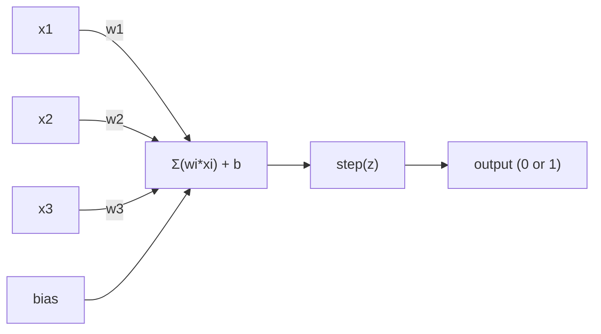
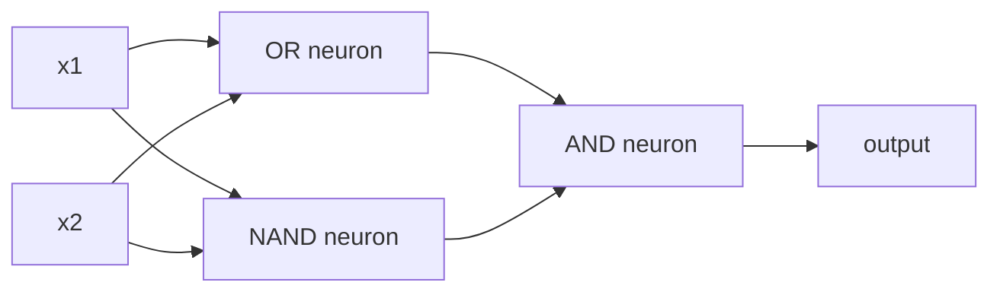

# O Perceptron

> O perceptron é o átomo das redes neurais. Abre ele e encontra pesos, um viés e uma decisão.

**Tipo:** Construção
**Linguagens:** Python
**Pré-requisitos:** Fase 1 (Intuição de Álgebra Linear)
**Tempo:** ~60 minutos

## Objetivos de Aprendizado

- Implementar um perceptron do zero em Python, incluindo a regra de atualização de pesos e a função de ativação por degrau
- Explicar por que um único perceptron só resolve problemas linearmente separáveis e demonstrar o caso de falha do XOR
- Construir um perceptron multicamada combinando portas OR, NAND e AND para resolver XOR
- Treinar uma rede de duas camadas com ativação sigmoid e retropropagação para aprender XOR automaticamente

## O Problema

Você conhece vetores e produto escalar. Sabe que uma matriz transforma entradas em saídas. Mas como uma máquina *aprende* qual transformação usar?

O perceptron responde isso. É a máquina de aprendizado mais simples que existe: pega algumas entradas, multiplica por pesos, soma um viés e toma uma decisão binária. Depois ajusta. É isso. Toda rede neural já construída são camadas dessa ideia empilhadas.

Entender o perceptron significa entender o que "aprendizado" realmente significa no código: ajustar números até que a saída corresponda à realidade.

## O Conceito

### Um Neurônio, Uma Decisão

Um perceptron pega n entradas, multiplica cada uma por um peso, soma tudo, adiciona um viés e passa o resultado por uma função de ativação.



A função degrau é brutal: se a soma ponderada mais o viés for >= 0, saída 1. Caso contrário, saída 0.

```
step(z) = 1  if z >= 0
           0  if z < 0
```

Isso é um classificador linear. Os pesos e o viés definem uma reta (ou hiperplano em dimensões superiores) que divide o espaço de entrada em duas regiões.

### O Limite de Decisão

Para duas entradas, o perceptron desenha uma reta no espaço 2D:

```
  x2
  ┤
  │  Classe 1        /
  │    (0)          /
  │                /
  │               / w1·x1 + w2·x2 + b = 0
  │              /
  │             /     Classe 2
  │            /        (1)
  ┼───────────/──────────── x1
```

Tudo de um lado da reta gera saída 0. Tudo do outro gera saída 1. O treino move essa reta até que ela separe corretamente as classes.

### A Regra de Aprendizado

A regra de aprendizado do perceptron é simples:

```
Para cada exemplo de treino (x, y_true):
    y_pred = predict(x)
    error = y_true - y_pred

    Para cada peso:
        w_i = w_i + learning_rate * error * x_i
    bias = bias + learning_rate * error
```

Se a previsão estiver correta, error = 0, nada muda. Se prever 0 mas deveria ser 1, os pesos aumentam. Se prever 1 mas deveria ser 0, os pesos diminuem. A taxa de aprendizado controla o tamanho de cada ajuste.

### O Problema do XOR

Aqui é onde quebra. Olha essas portas lógicas:

```
AND gate:           OR gate:            XOR gate:
x1  x2  out         x1  x2  out         x1  x2  out
0   0   0           0   0   0           0   0   0
0   1   0           0   1   1           0   1   1
1   0   0           1   0   1           1   0   1
1   1   1           1   1   1           1   1   0
```

AND e OR são linearmente separáveis: dá pra desenhar uma reta só pra separar os 0 dos 1. XOR não é. Nenhuma reta separa [0,1] e [1,0] de [0,0] e [1,1].

```
AND (separável):        XOR (não separável):

  x2                      x2
  1 ┤  0     1            1 ┤  1     0
    │     /                 │
  0 ┤  0 / 0              0 ┤  0     1
    ┼──/──────── x1         ┼──────────── x1
       funciona!           nenhuma reta funciona!
```

Essa é uma limitação fundamental. Um único perceptron só resolve problemas linearmente separáveis. Minsky e Papert provaram isso em 1969 e quase mataram a pesquisa em redes neurais por uma década.

A solução: empilhar perceptrons em camadas. Um perceptron multicamada resolve o XOR combinando duas decisões lineares em uma não linear.

## Construa

### Passo 1: A classe Perceptron

```python
class Perceptron:
    def __init__(self, n_inputs, learning_rate=0.1):
        self.weights = [0.0] * n_inputs
        self.bias = 0.0
        self.lr = learning_rate

    def predict(self, inputs):
        total = sum(w * x for w, x in zip(self.weights, inputs))
        total += self.bias
        return 1 if total >= 0 else 0

    def train(self, training_data, epochs=100):
        for epoch in range(epochs):
            errors = 0
            for inputs, target in training_data:
                prediction = self.predict(inputs)
                error = target - prediction
                if error != 0:
                    errors += 1
                    for i in range(len(self.weights)):
                        self.weights[i] += self.lr * error * inputs[i]
                    self.bias += self.lr * error
            if errors == 0:
                print(f"Converged at epoch {epoch + 1}")
                return
        print(f"Did not converge after {epochs} epochs")
```

### Passo 2: Treinar nas portas lógicas

```python
and_data = [
    ([0, 0], 0),
    ([0, 1], 0),
    ([1, 0], 0),
    ([1, 1], 1),
]

or_data = [
    ([0, 0], 0),
    ([0, 1], 1),
    ([1, 0], 1),
    ([1, 1], 1),
]

not_data = [
    ([0], 1),
    ([1], 0),
]

print("=== AND Gate ===")
p_and = Perceptron(2)
p_and.train(and_data)
for inputs, _ in and_data:
    print(f"  {inputs} -> {p_and.predict(inputs)}")

print("\n=== OR Gate ===")
p_or = Perceptron(2)
p_or.train(or_data)
for inputs, _ in or_data:
    print(f"  {inputs} -> {p_or.predict(inputs)}")

print("\n=== NOT Gate ===")
p_not = Perceptron(1)
p_not.train(not_data)
for inputs, _ in not_data:
    print(f"  {inputs} -> {p_not.predict(inputs)}")
```

### Passo 3: Ver o XOR falhar

```python
xor_data = [
    ([0, 0], 0),
    ([0, 1], 1),
    ([1, 0], 1),
    ([1, 1], 0),
]

print("\n=== XOR Gate (single perceptron) ===")
p_xor = Perceptron(2)
p_xor.train(xor_data, epochs=1000)
for inputs, expected in xor_data:
    result = p_xor.predict(inputs)
    status = "OK" if result == expected else "WRONG"
    print(f"  {inputs} -> {result} (expected {expected}) {status}")
```

Nunca vai convergir. Essa é a prova concreta de que um único perceptron não consegue aprender XOR.

### Passo 4: Resolver XOR com duas camadas

O truque: XOR = (x1 OR x2) AND NOT (x1 AND x2). Combine três perceptrons:



```python
def xor_network(x1, x2):
    or_neuron = Perceptron(2)
    or_neuron.weights = [1.0, 1.0]
    or_neuron.bias = -0.5

    nand_neuron = Perceptron(2)
    nand_neuron.weights = [-1.0, -1.0]
    nand_neuron.bias = 1.5

    and_neuron = Perceptron(2)
    and_neuron.weights = [1.0, 1.0]
    and_neuron.bias = -1.5

    hidden1 = or_neuron.predict([x1, x2])
    hidden2 = nand_neuron.predict([x1, x2])
    output = and_neuron.predict([hidden1, hidden2])
    return output


print("\n=== XOR Gate (multi-layer network) ===")
for inputs, expected in xor_data:
    result = xor_network(inputs[0], inputs[1])
    print(f"  {inputs} -> {result} (expected {expected})")
```

Os quatro casos estão corretos. Empilhar perceptrons em camadas cria limites de decisão que nenhum único perceptron consegue produzir.

### Passo 5: Treinar uma Rede de Duas Camadas

No passo 4 os pesos foram definidos na mão. Funciona pro XOR, mas não pra problemas reais onde você não sabe os pesos certos de antemão. A solução: trocar a função degrau pela sigmoid e aprender os pesos automaticamente pela retropropagação.

```python
class TwoLayerNetwork:
    def __init__(self, learning_rate=0.5):
        import random
        random.seed(0)
        self.w_hidden = [[random.uniform(-1, 1), random.uniform(-1, 1)] for _ in range(2)]
        self.b_hidden = [random.uniform(-1, 1), random.uniform(-1, 1)]
        self.w_output = [random.uniform(-1, 1), random.uniform(-1, 1)]
        self.b_output = random.uniform(-1, 1)
        self.lr = learning_rate

    def sigmoid(self, x):
        import math
        x = max(-500, min(500, x))
        return 1.0 / (1.0 + math.exp(-x))

    def forward(self, inputs):
        self.inputs = inputs
        self.hidden_outputs = []
        for i in range(2):
            z = sum(w * x for w, x in zip(self.w_hidden[i], inputs)) + self.b_hidden[i]
            self.hidden_outputs.append(self.sigmoid(z))
        z_out = sum(w * h for w, h in zip(self.w_output, self.hidden_outputs)) + self.b_output
        self.output = self.sigmoid(z_out)
        return self.output

    def train(self, training_data, epochs=10000):
        for epoch in range(epochs):
            total_error = 0
            for inputs, target in training_data:
                output = self.forward(inputs)
                error = target - output
                total_error += error ** 2

                d_output = error * output * (1 - output)

                saved_w_output = self.w_output[:]
                hidden_deltas = []
                for i in range(2):
                    h = self.hidden_outputs[i]
                    hd = d_output * saved_w_output[i] * h * (1 - h)
                    hidden_deltas.append(hd)

                for i in range(2):
                    self.w_output[i] += self.lr * d_output * self.hidden_outputs[i]
                self.b_output += self.lr * d_output

                for i in range(2):
                    for j in range(len(inputs)):
                        self.w_hidden[i][j] += self.lr * hidden_deltas[i] * inputs[j]
                    self.b_hidden[i] += self.lr * hidden_deltas[i]
```

```python
net = TwoLayerNetwork(learning_rate=2.0)
net.train(xor_data, epochs=10000)
for inputs, expected in xor_data:
    result = net.forward(inputs)
    predicted = 1 if result >= 0.5 else 0
    print(f"  {inputs} -> {result:.4f} (rounded: {predicted}, expected {expected})")
```

Duas diferenças-chave em relação ao passo 4. Primeiro, a sigmoid substitui a função degrau — é suave, então gradientes existem. Segundo, o método `train` propaga o erro de trás pra frente da saída até a camada oculta, ajustando cada peso proporcionalmente à sua contribuição pro erro. Isso é retropropagação em 20 linhas.

Essa é a ponte pra Aula 03. A matemática por trás de `d_output` e `hidden_deltas` é a regra da cadeia aplicada ao grafo da rede. A gente vai derivar direito lá.

## Use

Tudo que você construiu do zero existe em um import:

```python
from sklearn.linear_model import Perceptron as SkPerceptron
import numpy as np

X = np.array([[0,0],[0,1],[1,0],[1,1]])
y = np.array([0, 0, 0, 1])

clf = SkPerceptron(max_iter=100, tol=1e-3)
clf.fit(X, y)
print([clf.predict([x])[0] for x in X])
```

Cinco linhas. Sua classe `Perceptron` de 30 linhas faz a mesma coisa. A versão do sklearn adiciona verificações de convergência, múltiplas funções de perda e suporte a entradas esparsas — mas o loop central é o mesmo: soma ponderada, função degrau, atualização de pesos no erro.

A diferença real aparece na escala. O que muda em redes de produção:

- A função degrau vira sigmoid, ReLU ou outras ativações suaves
- Os pesos são aprendidos automaticamente via retropropagação (Aula 03)
- As camadas ficam mais profundas: 3, 10, 100+ camadas
- O mesmo princípio vale: cada camada cria novas features a partir das saídas da anterior

Um único perceptron só desenha retas. Empilhe eles e você desenha qualquer forma.

## Entregue

Esta aula produz:
- `outputs/skill-perceptron.md` — uma habilidade sobre quando são necessárias arquiteturas de uma camada vs multicamada

## Exercícios

1. Treine um perceptron numa porta NAND (a porta universal — qualquer circuito lógico pode ser construído a partir de NAND). Verifique que seus pesos e viés formam um limite de decisão válido.
2. Modifique a classe Perceptron para rastrear o limite de decisão (w1*x1 + w2*x2 + b = 0) em cada época. Imprima como a reta se move durante o treino na porta AND.
3. Construa um perceptron de 3 entradas que só gera 1 quando pelo menos 2 das 3 entradas são 1 (função de voto majoritário). Isso é linearmente separável? Por quê?

## Termos-Chave

| Termo | O que o pessoal diz | O que realmente significa |
|-------|---------------------|--------------------------|
| Perceptron | "Um neurônio falso" | Um classificador linear: produto escalar de entradas e pesos, mais viés, passado por uma função degrau |
| Peso | "Quão importante uma entrada é" | Um multiplicador que escala a contribuição de cada entrada pra decisão |
| Viés | "O limiar" | Uma constante que desloca o limite de decisão, permitindo que o perceptron dispare mesmo com entradas zero |
| Função de ativação | "A coisa que comprime valores" | Uma função aplicada após a soma ponderada — função degrau pra perceptrons, sigmoid/ReLU pra redes modernas |
| Linearmente separável | "Dá pra desenhar uma reta entre eles" | Um dataset onde um único hiperplano consegue separar perfeitamente as classes |
| Problema do XOR | "O que perceptrons não conseguem fazer" | Prova de que redes de uma camada não conseguem aprender funções não linearmente separáveis |
| Limite de decisão | "Onde o classificador troca" | O hiperplano w*x + b = 0 que divide o espaço de entrada em duas classes |
| Perceptron multicamada | "Uma rede neural de verdade" | Perceptrons empilhados em camadas, onde a saída de cada camada alimenta a entrada da próxima |

## Leituras Complementares

- Frank Rosenblatt, "The Perceptron: A Probabilistic Model for Information Storage and Organization in the Brain" (1958) — o artigo original que começou tudo
- Minsky & Papert, "Perceptrons" (1969) — o livro que provou que XOR era insolúvel por redes de uma camada e matou a pesquisa em perceptrons por uma década
- Michael Nielsen, "Neural Networks and Deep Learning", Capítulo 1 (http://neuralnetworksanddeeplearning.com/) — gratuito online, melhor explicação visual de como perceptrons se combinam em redes
