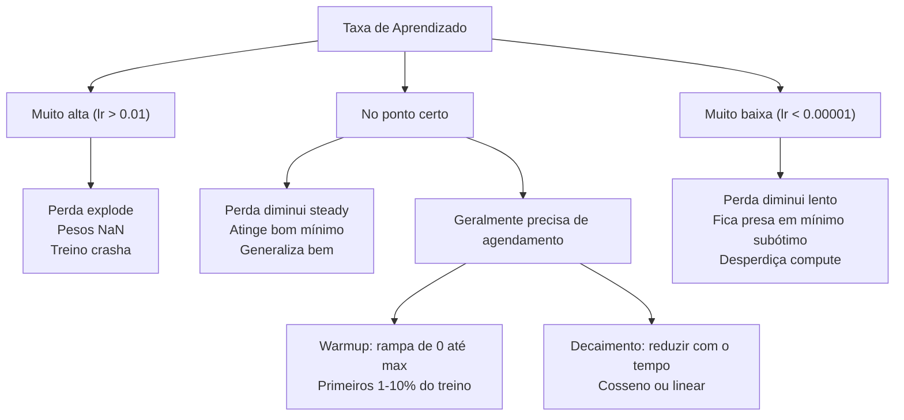
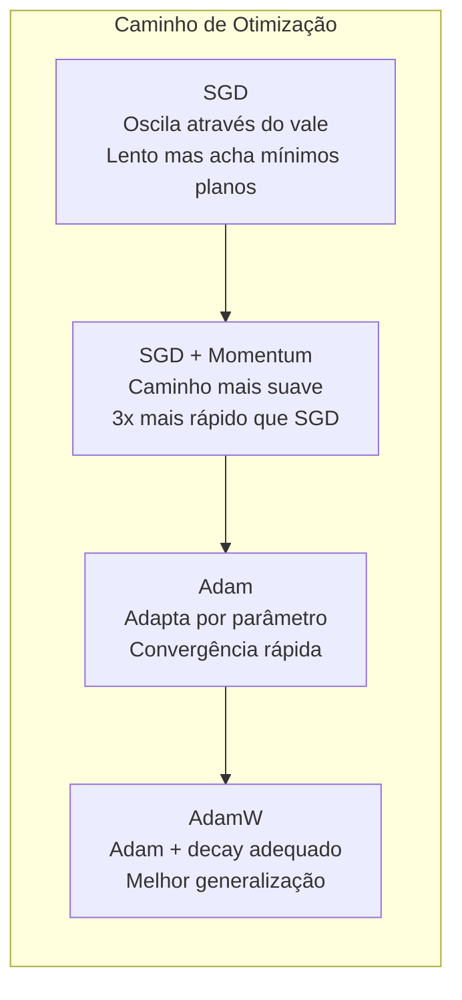
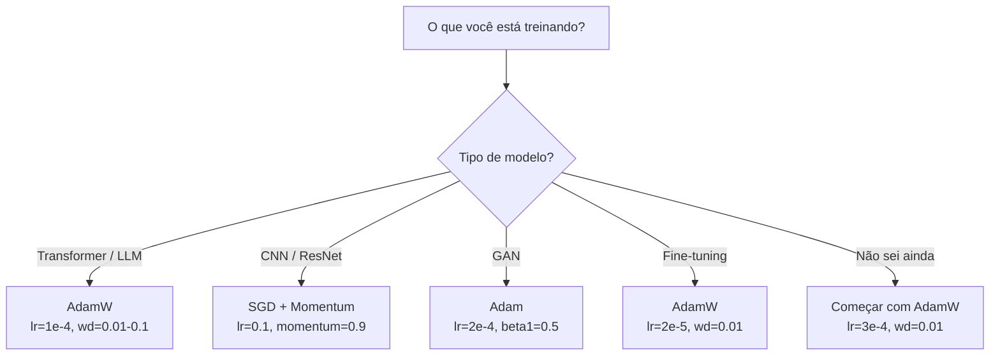

# Otimizadores

> Descida do gradiente diz qual direção mover. Não diz nada sobre quão longe ou quão rápido. SGD é uma bússola. Adam é GPS com dados de trânsito.

**Tipo:** Construção
**Linguagens:** Python
**Pré-requisitos:** Aula 03.05 (Funções de Perda)
**Tempo:** ~75 minutos

## Objetivos de Aprendizado

- Implementar SGD, SGD com momentum, Adam e otimizadores AdamW do zero em Python
- Explicar como a correção de viés do Adam compensa estimativas de momento inicializadas com zero nos primeiros passos de treino
- Demonstrar por que AdamW produz melhor generalização que Adam com regularização L2 na mesma tarefa
- Selecionar o otimizador apropriado e hiperparâmetros padrão pra transformers, CNNs, GANs e fine-tuning

## O Problema

Você computou os gradientes. Sabe que o peso #4.721 deveria diminuir em 0.003 pra reduzir a perda. Mas 0.003 em que unidades? Escalonado por quê? E deveria mover a mesma quantidade no passo 1 que no passo 1.000?

Descida do gradiente vanilla aplica a mesma taxa de aprendizado pra cada parâmetro em cada passo: w = w - lr * gradiente. Isso cria três problemas que tornam treino de redes neurais doloroso na prática.

Primeiro, oscilação. A paisagem de perda raramente tem formato de tigela suave. É mais como um vale longo e estreito. O gradiente aponta atravessando o vale (direção íngreme), não ao longo (direção rasa). Descida do gradiente quica de lado a lado na dimensão estreita enquanto faz progresso minúsculo na útil. Você já viu isso: a perda cai rápido depois estabiliza, não porque o modelo convergiu mas porque está oscilando.

Segundo, uma taxa de aprendizado pra todos os parâmetros está errada. Alguns pesos precisam de atualizações grandes (estão na fase inicial, de underfitting). Outros precisam de atualizações pequenas (estão perto do valor ótimo). Uma taxa que funciona pro primeiro destrói o segundo, e vice-versa.

Terceiro, pontos de sela. Em dimensões altas, a paisagem de perda tem vastas regiões planas onde o gradiente é próximo de zero. SGD vanilla arrasta por essas a velocidade do gradiente, que é efetivamente zero. O modelo parece travado. Não está travado — está numa região plana com descida útil do outro lado. Mas SGD não tem mecanismo pra atravessar.

Adam resolve os três. Mantém duas médias móveis por parâmetro — a média do gradiente (momentum, lida com oscilação) e a média quadrática do gradiente (taxa adaptativa, lida com escalas diferentes). Combinado com correção de viés pra os primeiros passos, dá um otimizador único que funciona em 80% dos problemas com hiperparâmetros padrão. Esta aula constrói ele do zero pra que você entenda exatamente quando e por que ele falha nos outros 20%.

## O Conceito

### SGD Estocástico

O otimizador mais simples. Compute o gradiente num mini-lote e dê um passo na direção oposta.

```
w = w - lr * gradiente
```

O "estocástico" significa que você usa um subconjunto aleatório (mini-lote) de dados pra estimar o gradiente, em vez do dataset completo. Esse ruído é na verdade útil — ajuda a escapar de mínimos locais íngremes. Mas o ruído também causa oscilação.

A taxa de aprendizado é o único controle. Muito alta: a perda diverge. Muito baixa: treino demora pra sempre. O valor ideal depende da arquitetura, dos dados, do tamanho do lote e do estágio atual do treino. Pra SGD vanilla em redes modernas, valores típicos ficam entre 0.01 e 0.1. Mas mesmo dentro de um único treino, a taxa de aprendizado ideal muda.

### Momentum

A analogia da bola rolando morro abaixo é superusada mas precisa. Em vez de dar passos só pelo gradiente, você mantém uma velocidade que acumula gradientes passados.

```
m_t = beta * m_{t-1} + gradiente
w = w - lr * m_t
```

Beta (tipicamente 0.9) controla quanto histórico manter. Com beta = 0.9, o momentum é mais ou menos a média dos últimos 10 gradientes (1 / (1 - 0.9) = 10).

Por que isso resolve a oscilação: gradientes na mesma direção acumulam. Gradientes que viram de direção se cancelam. No vale estreito, o componente "através" inverte o sinal a cada passo e é amortecido. O componente "ao longo" se mantém consistente e é amplificado. O resultado é aceleração suave na direção útil.

Números reais: SGD sozinho numa paisagem mal condicionada pode levar 10.000 passos. SGD com momentum (beta=0.9) tipicamente leva 3.000-5.000 passos no mesmo problema. A aceleração não é marginal.

### RMSProp

O primeiro método de taxa de aprendizado adaptativa por parâmetro que realmente funcionou. Proposto por Hinton numa aula do Coursera (nunca publicado formalmente).

```
s_t = beta * s_{t-1} + (1 - beta) * gradiente^2
w = w - lr * gradiente / (sqrt(s_t) + epsilon)
```

s_t rastreia a média móvel dos gradientes ao quadrado. Parâmetros com gradientes consistentemente grandes recebem divisão por um número grande (menor taxa de aprendizado efetiva). Parâmetros com gradientes pequenos recebem divisão por um número pequeno (maior taxa efetiva).

Isso resolve o problema "uma taxa de aprendizado pra todos os parâmetros". Um peso que já vem recebendo atualizações grandes provavelmente está perto do alvo — desacelere. Um peso que vem recebendo atualizações pequenas pode estar sub-treinado — acelere.

Epsilon (tipicamente 1e-8) previne divisão por zero quando um parâmetro não foi atualizado.

### Adam: Momentum + RMSProp

Adam combina as duas ideias. Mantém duas médias móveis exponenciais por parâmetro:

```
m_t = beta1 * m_{t-1} + (1 - beta1) * gradiente        (primeiro momento: média)
v_t = beta2 * v_{t-1} + (1 - beta2) * gradiente^2       (segundo momento: variância)
```

**Correção de viés** é o detalhe chave que a maioria das explicações ignora. No passo 1, m_1 = (1 - beta1) * gradiente. Com beta1 = 0.9, isso é 0.1 * gradiente — dez vezes menor. A média móvel ainda não aqueceu. A correção de viés compensa:

```
m_hat = m_t / (1 - beta1^t)
v_hat = v_t / (1 - beta2^t)
```

No passo 1 com beta1 = 0.9: m_hat = m_1 / (1 - 0.9) = m_1 / 0.1 = o gradiente real. No passo 100: (1 - 0.9^100) é aproximadamente 1.0, então a correção desaparece. A correção de viés importa nos primeiros ~10 passos e é irrelevante após ~50.

A atualização:

```
w = w - lr * m_hat / (sqrt(v_hat) + epsilon)
```

Padrões do Adam: lr = 0.001, beta1 = 0.9, beta2 = 0.999, epsilon = 1e-8. Esses padrões funcionam pra 80% dos problemas. Quando não funcionam, mude lr primeiro. Depois beta2. Quase nunca mude beta1 ou epsilon.

### AdamW: Weight Decay Feito Certo

Regularização L2 adiciona lambda * w^2 à perda. No SGD vanilla, isso é equivalente a weight decay (subtrair lambda * w do peso a cada passo). No Adam, essa equivalência quebra.

O insight de Loshchilov & Hutter: quando você adiciona L2 à perda e então o Adam processa o gradiente, a taxa de aprendizado adaptativa também escala o termo de regularização. Parâmetros com grande variância de gradiente recebem menos regularização. Parâmetros com pouca variância recebem mais. Isso não é o que você quer — você quer regularização uniforme independentemente das estatísticas do gradiente.

AdamW corrige isso aplicando weight decay diretamente nos pesos, após a atualização do Adam:

```
w = w - lr * m_hat / (sqrt(v_hat) + epsilon) - lr * lambda * w
```

O termo de weight decay (lr * lambda * w) não é escalado pelo fator adaptativo do Adam. Cada parâmetro recebe o mesmo encolhimento proporcional.

Parece um detalhe menor. Não é. AdamW converge pra melhores soluções que Adam + regularização L2 em virtualmente toda tarefa. É o otimizador padrão no PyTorch pra treinar transformers, modelos de difusão e a maioria das arquiteturas modernas. BERT, GPT, LLaMA, Stable Diffusion — todos treinados com AdamW.

### Taxa de Aprendizado: O Hiperparâmetro Mais Importante



Se você ajustar um hiperparâmetro, ajuste a taxa de aprendizado. Uma mudança de 10x na taxa importa mais que qualquer decisão arquitetural que você vai tomar. Padrões comuns:

- SGD: lr = 0.01 a 0.1
- Adam/AdamW: lr = 1e-4 a 3e-4
- Fine-tuning de modelos pré-treinados: lr = 1e-5 a 5e-5
- Warmup de taxa de aprendizado: rampa linear nos primeiros 1-10% dos passos

### Comparação de Otimizadores



### Quando Cada Otimizador Vence



## Construa

### Passo 1: SGD Vanilla

```python
class SGD:
    def __init__(self, lr=0.01):
        self.lr = lr

    def step(self, params, grads):
        for i in range(len(params)):
            params[i] -= self.lr * grads[i]
```

### Passo 2: SGD com Momentum

```python
class SGDMomentum:
    def __init__(self, lr=0.01, beta=0.9):
        self.lr = lr
        self.beta = beta
        self.velocities = None

    def step(self, params, grads):
        if self.velocities is None:
            self.velocities = [0.0] * len(params)
        for i in range(len(params)):
            self.velocities[i] = self.beta * self.velocities[i] + grads[i]
            params[i] -= self.lr * self.velocities[i]
```

### Passo 3: Adam

```python
import math

class Adam:
    def __init__(self, lr=0.001, beta1=0.9, beta2=0.999, epsilon=1e-8):
        self.lr = lr
        self.beta1 = beta1
        self.beta2 = beta2
        self.epsilon = epsilon
        self.m = None
        self.v = None
        self.t = 0

    def step(self, params, grads):
        if self.m is None:
            self.m = [0.0] * len(params)
            self.v = [0.0] * len(params)

        self.t += 1

        for i in range(len(params)):
            self.m[i] = self.beta1 * self.m[i] + (1 - self.beta1) * grads[i]
            self.v[i] = self.beta2 * self.v[i] + (1 - self.beta2) * grads[i] ** 2

            m_hat = self.m[i] / (1 - self.beta1 ** self.t)
            v_hat = self.v[i] / (1 - self.beta2 ** self.t)

            params[i] -= self.lr * m_hat / (math.sqrt(v_hat) + self.epsilon)
```

### Passo 4: AdamW

```python
class AdamW:
    def __init__(self, lr=0.001, beta1=0.9, beta2=0.999, epsilon=1e-8, weight_decay=0.01):
        self.lr = lr
        self.beta1 = beta1
        self.beta2 = beta2
        self.epsilon = epsilon
        self.weight_decay = weight_decay
        self.m = None
        self.v = None
        self.t = 0

    def step(self, params, grads):
        if self.m is None:
            self.m = [0.0] * len(params)
            self.v = [0.0] * len(params)

        self.t += 1

        for i in range(len(params)):
            self.m[i] = self.beta1 * self.m[i] + (1 - self.beta1) * grads[i]
            self.v[i] = self.beta2 * self.v[i] + (1 - self.beta2) * grads[i] ** 2

            m_hat = self.m[i] / (1 - self.beta1 ** self.t)
            v_hat = self.v[i] / (1 - self.beta2 ** self.t)

            params[i] -= self.lr * m_hat / (math.sqrt(v_hat) + self.epsilon)
            params[i] -= self.lr * self.weight_decay * params[i]
```

### Passo 5: Comparação de Treino

Treine a mesma rede de duas camadas no dataset círculo da aula 05 com todos os quatro otimizadores. Compare convergência.

```python
import random

def sigmoid(x):
    x = max(-500, min(500, x))
    return 1.0 / (1.0 + math.exp(-x))

def make_circle_data(n=200, seed=42):
    random.seed(seed)
    data = []
    for _ in range(n):
        x = random.uniform(-2, 2)
        y = random.uniform(-2, 2)
        label = 1.0 if x * x + y * y < 1.5 else 0.0
        data.append(([x, y], label))
    return data


class OptimizerTestNetwork:
    def __init__(self, optimizer, hidden_size=8):
        random.seed(0)
        self.hidden_size = hidden_size
        self.optimizer = optimizer

        self.w1 = [[random.gauss(0, 0.5) for _ in range(2)] for _ in range(hidden_size)]
        self.b1 = [0.0] * hidden_size
        self.w2 = [random.gauss(0, 0.5) for _ in range(hidden_size)]
        self.b2 = 0.0

    def get_params(self):
        params = []
        for row in self.w1:
            params.extend(row)
        params.extend(self.b1)
        params.extend(self.w2)
        params.append(self.b2)
        return params

    def set_params(self, params):
        idx = 0
        for i in range(self.hidden_size):
            for j in range(2):
                self.w1[i][j] = params[idx]
                idx += 1
        for i in range(self.hidden_size):
            self.b1[i] = params[idx]
            idx += 1
        for i in range(self.hidden_size):
            self.w2[i] = params[idx]
            idx += 1
        self.b2 = params[idx]

    def forward(self, x):
        self.x = x
        self.z1 = []
        self.h = []
        for i in range(self.hidden_size):
            z = self.w1[i][0] * x[0] + self.w1[i][1] * x[1] + self.b1[i]
            self.z1.append(z)
            self.h.append(max(0.0, z))

        self.z2 = sum(self.w2[i] * self.h[i] for i in range(self.hidden_size)) + self.b2
        self.out = sigmoid(self.z2)
        return self.out

    def compute_grads(self, target):
        eps = 1e-15
        p = max(eps, min(1 - eps, self.out))
        d_loss = -(target / p) + (1 - target) / (1 - p)
        d_sigmoid = self.out * (1 - self.out)
        d_out = d_loss * d_sigmoid

        grads = [0.0] * (self.hidden_size * 2 + self.hidden_size + self.hidden_size + 1)
        idx = 0
        for i in range(self.hidden_size):
            d_relu = 1.0 if self.z1[i] > 0 else 0.0
            d_h = d_out * self.w2[i] * d_relu
            grads[idx] = d_h * self.x[0]
            grads[idx + 1] = d_h * self.x[1]
            idx += 2

        for i in range(self.hidden_size):
            d_relu = 1.0 if self.z1[i] > 0 else 0.0
            grads[idx] = d_out * self.w2[i] * d_relu
            idx += 1

        for i in range(self.hidden_size):
            grads[idx] = d_out * self.h[i]
            idx += 1

        grads[idx] = d_out
        return grads

    def train(self, data, epochs=300):
        losses = []
        for epoch in range(epochs):
            total_loss = 0.0
            correct = 0
            for x, y in data:
                pred = self.forward(x)
                grads = self.compute_grads(y)
                params = self.get_params()
                self.optimizer.step(params, grads)
                self.set_params(params)

                eps = 1e-15
                p = max(eps, min(1 - eps, pred))
                total_loss += -(y * math.log(p) + (1 - y) * math.log(1 - p))
                if (pred >= 0.5) == (y >= 0.5):
                    correct += 1
            avg_loss = total_loss / len(data)
            accuracy = correct / len(data) * 100
            losses.append((avg_loss, accuracy))
            if epoch % 75 == 0 or epoch == epochs - 1:
                print(f"    Epoch {epoch:3d}: loss={avg_loss:.4f}, accuracy={accuracy:.1f}%")
        return losses
```

## Use

PyTorch lida com grupos de parâmetros, clipping de gradiente e agendamento de taxa de aprendizado:

```python
import torch
import torch.optim as optim

model = torch.nn.Sequential(
    torch.nn.Linear(784, 256),
    torch.nn.ReLU(),
    torch.nn.Linear(256, 10),
)

optimizer = optim.AdamW(model.parameters(), lr=3e-4, weight_decay=0.01)

scheduler = optim.lr_scheduler.CosineAnnealingLR(optimizer, T_max=100)

for epoch in range(100):
    optimizer.zero_grad()
    output = model(torch.randn(32, 784))
    loss = torch.nn.functional.cross_entropy(output, torch.randint(0, 10, (32,)))
    loss.backward()
    torch.nn.utils.clip_grad_norm_(model.parameters(), max_norm=1.0)
    optimizer.step()
    scheduler.step()
```

O padrão é sempre: zero_grad, forward, loss, backward, (clip), step, (schedule). Memorize essa ordem. Errar (ex.: chamar scheduler.step() antes de optimizer.step()) é uma fonte comum de bugs sutis.

Para CNNs, muitos profissionais ainda preferem SGD + momentum (lr=0.1, momentum=0.9, weight_decay=1e-4) com agendamento step ou cosine. SGD encontra mínimos mais planos, que geralmente generalizam melhor. Para transformers e LLMs, AdamW com warmup + decaimento cosine é o padrão universal. Não lute contra o consenso sem uma razão medida.

## Entregue

Esta aula produz:
- `outputs/prompt-optimizer-selector.md` — um prompt de decisão pra escolher o otimizador e taxa de aprendizado certos pra qualquer arquitetura

## Exercícios

1. Implemente momentum de Nesterov, onde você computa o gradiente na posição "olho pra frente" (w - lr * beta * v) em vez da posição atual. Compare convergência com momentum padrão no dataset do círculo.
2. Implemente um agendamento de warmup de taxa de aprendizado: rampa linear de 0 a max_lr nos primeiros 10% dos passos de treino, depois decaimento cosine até 0. Treine com Adam + warmup vs Adam sem warmup. Meça quantas épocas leva pra atingir 90% de acurácia no dataset do círculo.
3. Rastreie a taxa de aprendizado efetiva pra cada parâmetro durante treino com Adam. A taxa efetiva é lr * m_hat / (sqrt(v_hat) + eps). Plote a distribuição de taxas efetivas após 10, 50 e 200 passos. Todos os parâmetros estão sendo atualizados na mesma velocidade?
4. Implemente clipping de gradiente (corte por norma global). Defina a norma máxima em 1.0. Treine com e sem clipping usando uma taxa alta (lr=0.01 pra Adam). Conte quantas execuções divergem (perda vai pra NaN) com e sem clipping em 10 seeds aleatórias.
5. Compare Adam vs AdamW numa rede com pesos grandes. Inicialize todos os pesos em valores aleatórios em [-5, 5] (muito maiores que o normal). Treine por 200 épocas com weight_decay=0.1. Plote a norma L2 dos pesos ao longo do treino para ambos os otimizadores. AdamW deve mostrar encolhimento de peso mais rápido.

## Termos-chave

| Termo | O que o pessoal diz | O que realmente significa |
|-------|---------------------|--------------------------|
| Taxa de aprendizado | "Tamanho do passo" | O escalar que multiplica a atualização do gradiente; o hiperparâmetro de maior impacto no treino |
| SGD | "Descida do gradiente básica" | Descida do gradiente estocástica: atualizar pesos subtraindo lr * gradiente, computado num mini-lote |
| Momentum | "Analogia da bola rolante" | Média móvel exponencial de gradientes passados; amortece oscilação e acelera direções consistentes |
| RMSProp | "Taxa de aprendizado adaptativa" | Divide o gradiente de cada parâmetro pela RMS da média dos gradientes recentes; equaliza taxas de aprendizado |
| Adam | "O otimizador padrão" | Combina momentum (primeiro momento) e RMSProp (segundo momento) com correção de viés para os passos iniciais |
| AdamW | "Adam feito certo" | Adam com weight decay desacoplado; aplica regularização diretamente nos pesos em vez de através do gradiente |
| Correção de viés | "Warmup pra médias móveis" | Dividir por (1 - beta^t) pra compensar a inicialização zero das estimativas de momento do Adam |
| Weight decay | "Encolher os pesos" | Subtrair uma fração do valor do peso a cada passo; um regularizador que penaliza pesos grandes |
| Agendamento de taxa de aprendizado | "Mudar lr com o tempo" | Uma função que ajusta a taxa de aprendizado durante o treino; warmup + decaimento cosine é o padrão moderno |
| Clipping de gradiente | "Limitar a norma do gradiente" | Escalar pra baixo o vetor gradiente quando sua norma excede um limiar; previne atualizações explosivas de gradiente |

## Leituras Complementares

- Kingma & Ba, "Adam: A Method for Stochastic Optimization" (2014) — o artigo original do Adam com análise de convergência e derivação da correção de viés
- Loshchilov & Hutter, "Decoupled Weight Decay Regularization" (2017) — provou que regularização L2 e weight decay não são equivalentes no Adam e propôs AdamW
- Smith, "Cyclical Learning Rates for Training Neural Networks" (2017) — introduziu o teste de faixa de LR e agendamentos cíclicos que eliminam a necessidade de ajustar uma taxa fixa
- Ruder, "An Overview of Gradient Descent Optimization Algorithms" (2016) — a melhor pesquisa única sobre todas variantes de otimizadores, com comparações claras e intuições
