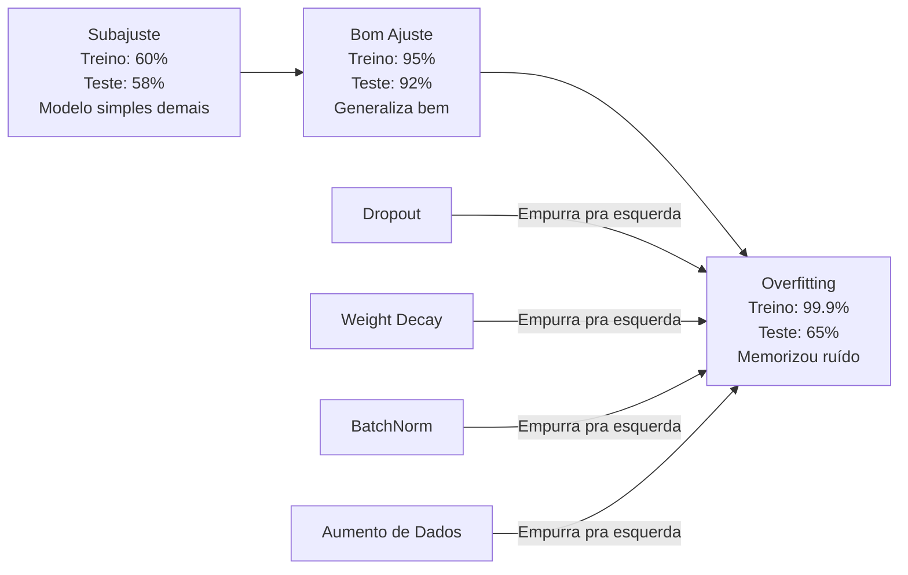
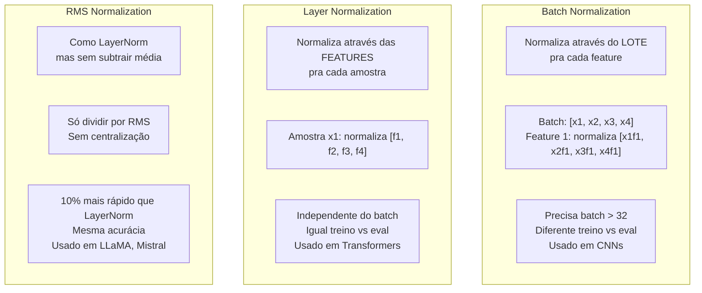
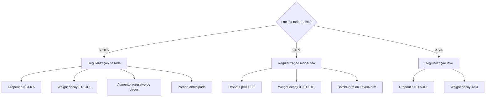

# Regularização

> Seu modelo tira 99% nos dados de treino e 60% nos de teste. Memorizou em vez de aprender. Regularização é o imposto que você impõe na complexidade pra forçar generalização.

**Tipo:** Construção
**Linguagens:** Python
**Pré-requisitos:** Aula 03.06 (Otimizadores)
**Tempo:** ~75 minutos

## Objetivos de Aprendizado

- Implementar dropout com escalonamento invertido, weight decay L2, batch normalization, layer normalization e RMSNorm do zero
- Medir a lacuna treino-teste e diagnosticar overfitting usando experimentos de regularização
- Explicar por que transformers usam LayerNorm em vez de BatchNorm e por que LLMs modernos preferem RMSNorm
- Aplicar a combinação correta de técnicas de regularização baseado na severidade do overfitting

## O Problema

Uma rede neural com parâmetros suficientes pode memorizar qualquer dataset. Isso não é hipotético — Zhang et al. (2017) provaram treinando redes padrão em ImageNet com rótulos aleatórios. As redes atingiram perda de treino próxima de zero em alocações completamente aleatórias de rótulos. Memorizaram um milhão de pares entrada-saída sem padrão pra aprender. Perda de treino foi perfeita. Acurácia de teste foi zero.

Esse é o problema de overfitting, e piora conforme os modelos ficam maiores. GPT-3 tem 175 bilhões de parâmetros. O conjunto de treino tem cerca de 500 bilhões de tokens. Com tantos parâmetros, o modelo tem capacidade suficiente pra memorizar pedaços significativos dos dados de treino na íntegra. Sem regularização, ele simplesmente regurgitaria exemplos de treino em vez de aprender padrões generalizáveis.

A lacuna entre performance de treino e teste é a lacuna de overfitting. Toda técnica nesta aula ataca essa lacuna de um ângulo diferente. Dropout força a rede a não depender de nenhum neurônio específico. Weight decay impede que qualquer peso cresça demais. Batch normalization suaviza a paisagem de perda pra que o otimizador encontre mínimos mais planos e generalizáveis. Layer normalization faz o mesmo mas funciona onde batch normalization falha (lotes pequenos, sequências de comprimento variável). RMSNorm faz isso 10% mais rápido eliminando o cálculo da média. Cada técnica é simples. Juntas, são a diferença entre um modelo que memoriza e um que generaliza.

## O Conceito

### O Espectro de Overfitting

Todo modelo está em algum lugar num espectro de subajuste (simples demais pra capturar o padrão) a overfitting (tão complexo que captura ruído). O ponto ideal está no meio, e a regularização empurra os modelos em direção a ele a partir do lado do overfit.



### Dropout

A técnica de regularização mais simples com a interpretação mais elegante. Durante o treino, defina aleatoriamente a saída de cada neurônio pra zero com probabilidade p.

```
output = activation(z) * mask    onde mask[i] ~ Bernoulli(1 - p)
```

Com p = 0.5, metade dos neurônios são zerados a cada passo direto. A rede deve aprender representações redundantes porque não pode prever quais neurônios estarão disponíveis. Isso previne co-adaptação — neurônios aprendendo a depender da presença de outros neurônios específicos.

A interpretação de ensemble: uma rede com N neurônios e dropout cria 2^N sub-redes possíveis (toda combinação de quais neurônios estão ligados ou desligados). Treinar com dropout aproximadamente treina todas as 2^N sub-redes simultaneamente, cada uma em mini-lotes diferentes. Na hora do teste, você usa todos os neurônios (sem dropout) e escala as saídas por (1 - p) pra corresponder ao valor esperado durante o treino. Isso é equivalente a tirar a média das previsões de 2^N sub-redes — um ensemble massivo a partir de um único modelo.

Na prática, o escalonamento é aplicado durante o treino em vez do teste (dropout invertido):

```
Durante treino:  output = activation(z) * mask / (1 - p)
Durante teste:   output = activation(z)   (sem mudança necessária)
```

Isso é mais limpo porque o código de teste não precisa saber sobre dropout.

Taxas padrão: p = 0.1 pra transformers, p = 0.5 pra MLPs, p = 0.2-0.3 pra CNNs. Dropout maior = regularização mais forte = mais risco de subajuste.

### Weight Decay (Regularização L2)

Adicione o quadrado da magnitude de todos os pesos à perda:

```
total_loss = perda_tarefa + (lambda / 2) * sum(w_i^2)
```

O gradiente do termo de regularização é lambda * w. Isso significa que a cada passo, cada peso é diminuído em direção a zero por uma fração proporcional à sua magnitude. Pesos grandes são penalizados mais. O modelo é empurrado em direção a soluções onde nenhum peso domina.

Por que isso ajuda na generalização: modelos com overfitting tendem a ter pesos grandes que amplificam ruído nos dados de treino. Weight decay mantém pesos pequenos, o que limita a capacidade efetiva do modelo e o força a depender de features robustas e generalizáveis em vez de peculiaridades memorizadas.

O hiperparâmetro lambda controla a força. Valores típicos:

- 0.01 para AdamW em transformers
- 1e-4 para SGD em CNNs
- 0.1 para modelos com muito overfitting

Como discutido na aula 06: weight decay e regularização L2 são equivalentes no SGD mas não no Adam. Sempre use AdamW (weight decay desacoplado) ao treinar com Adam.

### Batch Normalization

Normaliza a saída de cada camada através do mini-lote antes de passar pra próxima.

Para um mini-lote de ativações em alguma camada:

```
mu = (1/B) * sum(x_i)           (média do lote)
sigma^2 = (1/B) * sum((x_i - mu)^2)   (variância do lote)
x_hat = (x_i - mu) / sqrt(sigma^2 + eps)   (normalizar)
y = gamma * x_hat + beta        (escalar e deslocar)
```

Gamma e beta são parâmetros aprendíveis que permitem à rede desfazer a normalização se isso for ótimo. Sem eles, você estaria forçando a saída de cada camada a ter média zero e variância unitária, o que pode não ser o que a rede quer.

**Divisão treino vs inferência:** Durante o treino, mu e sigma vêm do mini-lote atual. Durante a inferência, você usa médias móveis acumuladas durante o treino (média móvel exponencial com momentum = 0.1, significando 90% antigo + 10% novo).

Por que BatchNorm funciona ainda é debatido. O artigo original afirmava que reduz "internal covariate shift" (a distribuição das entradas da camada mudando conforme camadas anteriores atualizam). Santurkar et al. (2018) mostraram que essa explicação está errada. A razão real: BatchNorm torna a paisagem de perda mais suave. Os gradientes são mais preditivos, as constantes de Lipschitz são menores, e o otimizador pode dar passos maiores com segurança. É por isso que BatchNorm permite usar taxas de aprendizado maiores e convergir mais rápido.

BatchNorm tem uma limitação fundamental: depende de estatísticas do lote. Com tamanho de lote 1, a média e variância não têm sentido. Com lotes pequenos (< 32), as estatísticas são ruidosas e prejudicam a performance. Isso importa para tarefas como detecção de objetos (onde a memória limita o tamanho do lote) e modelagem de linguagem (onde comprimentos de sequência variam).

### Layer Normalization

Normaliza através das features em vez do lote. Pra uma única amostra:

```
mu = (1/D) * sum(x_j)           (média da feature)
sigma^2 = (1/D) * sum((x_j - mu)^2)   (variância da feature)
x_hat = (x_j - mu) / sqrt(sigma^2 + eps)
y = gamma * x_hat + beta
```

D é a dimensão da feature. Cada amostra é normalizada independentemente — sem dependência do tamanho do lote. É por isso que transformers usam LayerNorm em vez de BatchNorm. Sequências têm comprimentos variados, tamanhos de lote são frequentemente pequenos (ou 1 durante geração), e a computação é idêntica entre treino e inferência.

LayerNorm em transformers é aplicada após cada bloco de autoatenção e cada bloco feed-forward (Post-LN), ou antes deles (Pre-LN, que é mais estável para treino).

### RMSNorm

LayerNorm sem subtração da média. Proposta por Zhang & Sennrich (2019).

```
rms = sqrt((1/D) * sum(x_j^2))
y = gamma * x / rms
```

É isso. Sem cálculo de média, sem parâmetro beta. A observação: o re-centralização (subtração da média) no LayerNorm contribui muito pouco para a performance do modelo, mas custa computação. Removê-lo dá a mesma acurácia com cerca de 10% menos overhead.

LLaMA, LLaMA 2, LLaMA 3, Mistral e a maioria dos LLMs modernos usam RMSNorm em vez de LayerNorm. Na escala de bilhões de parâmetros e trilhões de tokens, essa economia de 10% é significativa.

### Comparação de Normalização



### Aumento de Dados como Regularização

Não é uma modificação do modelo mas uma modificação dos dados. Transforme entradas de treino preservando rótulos:

- Imagens: corte aleatório, flip, rotação, variação de cor, recorte
- Texto: substituição por sinônimos, retro-tradução, exclusão aleatória
- Áudio: esticamento de tempo, mudança de tom, adição de ruído

O efeito é idêntico à regularização: aumenta o tamanho efetivo do conjunto de treino, tornando mais difícil para o modelo memorizar exemplos específicos. Um modelo que só vê cada imagem uma vez em sua forma original pode memorizá-la. Um modelo que vê 50 versões aumentadas de cada imagem é forçado a aprender a estrutura invariante.

### Parada Antecipada (Early Stopping)

O regularizador mais simples: pare de treinar quando a perda de validação começar a aumentar. O modelo ainda não overfittou nesse ponto. Na prática, você rastreia a perda de validação a cada época, salva o melhor modelo e continua treinando por uma janela de "paciência" (tipicamente 5-20 épocas). Se a perda de validação não melhorar dentro da janela de paciência, você para e carrega o melhor modelo salvo.

### Quando Aplicar O quê



## Construa

### Passo 1: Dropout (Modo Treino e Eval)

```python
import random
import math


class Dropout:
    def __init__(self, p=0.5):
        self.p = p
        self.training = True
        self.mask = None

    def forward(self, x):
        if not self.training:
            return list(x)
        self.mask = []
        output = []
        for val in x:
            if random.random() < self.p:
                self.mask.append(0)
                output.append(0.0)
            else:
                self.mask.append(1)
                output.append(val / (1 - self.p))
        return output

    def backward(self, grad_output):
        grads = []
        for g, m in zip(grad_output, self.mask):
            if m == 0:
                grads.append(0.0)
            else:
                grads.append(g / (1 - self.p))
        return grads
```

### Passo 2: Weight Decay L2

```python
def l2_regularization(weights, lambda_reg):
    penalty = 0.0
    for w in weights:
        penalty += w * w
    return lambda_reg * 0.5 * penalty

def l2_gradient(weights, lambda_reg):
    return [lambda_reg * w for w in weights]
```

### Passo 3: Batch Normalization

```python
class BatchNorm:
    def __init__(self, num_features, momentum=0.1, eps=1e-5):
        self.gamma = [1.0] * num_features
        self.beta = [0.0] * num_features
        self.eps = eps
        self.momentum = momentum
        self.running_mean = [0.0] * num_features
        self.running_var = [1.0] * num_features
        self.training = True
        self.num_features = num_features

    def forward(self, batch):
        batch_size = len(batch)
        if self.training:
            mean = [0.0] * self.num_features
            for sample in batch:
                for j in range(self.num_features):
                    mean[j] += sample[j]
            mean = [m / batch_size for m in mean]

            var = [0.0] * self.num_features
            for sample in batch:
                for j in range(self.num_features):
                    var[j] += (sample[j] - mean[j]) ** 2
            var = [v / batch_size for v in var]

            for j in range(self.num_features):
                self.running_mean[j] = (1 - self.momentum) * self.running_mean[j] + self.momentum * mean[j]
                self.running_var[j] = (1 - self.momentum) * self.running_var[j] + self.momentum * var[j]
        else:
            mean = list(self.running_mean)
            var = list(self.running_var)

        self.x_hat = []
        output = []
        for sample in batch:
            normalized = []
            out_sample = []
            for j in range(self.num_features):
                x_h = (sample[j] - mean[j]) / math.sqrt(var[j] + self.eps)
                normalized.append(x_h)
                out_sample.append(self.gamma[j] * x_h + self.beta[j])
            self.x_hat.append(normalized)
            output.append(out_sample)
        return output
```

### Passo 4: Layer Normalization

```python
class LayerNorm:
    def __init__(self, num_features, eps=1e-5):
        self.gamma = [1.0] * num_features
        self.beta = [0.0] * num_features
        self.eps = eps
        self.num_features = num_features

    def forward(self, x):
        mean = sum(x) / len(x)
        var = sum((xi - mean) ** 2 for xi in x) / len(x)

        self.x_hat = []
        output = []
        for j in range(self.num_features):
            x_h = (x[j] - mean) / math.sqrt(var + self.eps)
            self.x_hat.append(x_h)
            output.append(self.gamma[j] * x_h + self.beta[j])
        return output
```

### Passo 5: RMSNorm

```python
class RMSNorm:
    def __init__(self, num_features, eps=1e-6):
        self.gamma = [1.0] * num_features
        self.eps = eps
        self.num_features = num_features

    def forward(self, x):
        rms = math.sqrt(sum(xi * xi for xi in x) / len(x) + self.eps)
        output = []
        for j in range(self.num_features):
            output.append(self.gamma[j] * x[j] / rms)
        return output
```

### Passo 6: Treino Com e Sem Regularização

```python
def sigmoid(x):
    x = max(-500, min(500, x))
    return 1.0 / (1.0 + math.exp(-x))


def make_circle_data(n=200, seed=42):
    random.seed(seed)
    data = []
    for _ in range(n):
        x = random.uniform(-2, 2)
        y = random.uniform(-2, 2)
        label = 1.0 if x * x + y * y < 1.5 else 0.0
        data.append(([x, y], label))
    return data


class RegularizedNetwork:
    def __init__(self, hidden_size=16, lr=0.05, dropout_p=0.0, weight_decay=0.0):
        random.seed(0)
        self.hidden_size = hidden_size
        self.lr = lr
        self.dropout_p = dropout_p
        self.weight_decay = weight_decay
        self.dropout = Dropout(p=dropout_p) if dropout_p > 0 else None

        self.w1 = [[random.gauss(0, 0.5) for _ in range(2)] for _ in range(hidden_size)]
        self.b1 = [0.0] * hidden_size
        self.w2 = [random.gauss(0, 0.5) for _ in range(hidden_size)]
        self.b2 = 0.0

    def forward(self, x, training=True):
        self.x = x
        self.z1 = []
        self.h = []
        for i in range(self.hidden_size):
            z = self.w1[i][0] * x[0] + self.w1[i][1] * x[1] + self.b1[i]
            self.z1.append(z)
            self.h.append(max(0.0, z))

        if self.dropout and training:
            self.dropout.training = True
            self.h = self.dropout.forward(self.h)
        elif self.dropout:
            self.dropout.training = False
            self.h = self.dropout.forward(self.h)

        self.z2 = sum(self.w2[i] * self.h[i] for i in range(self.hidden_size)) + self.b2
        self.out = sigmoid(self.z2)
        return self.out

    def backward(self, target):
        eps = 1e-15
        p = max(eps, min(1 - eps, self.out))
        d_loss = -(target / p) + (1 - target) / (1 - p)
        d_sigmoid = self.out * (1 - self.out)
        d_out = d_loss * d_sigmoid

        for i in range(self.hidden_size):
            d_relu = 1.0 if self.z1[i] > 0 else 0.0
            d_h = d_out * self.w2[i] * d_relu
            self.w2[i] -= self.lr * (d_out * self.h[i] + self.weight_decay * self.w2[i])
            for j in range(2):
                self.w1[i][j] -= self.lr * (d_h * self.x[j] + self.weight_decay * self.w1[i][j])
            self.b1[i] -= self.lr * d_h
        self.b2 -= self.lr * d_out

    def evaluate(self, data):
        correct = 0
        total_loss = 0.0
        for x, y in data:
            pred = self.forward(x, training=False)
            eps = 1e-15
            p = max(eps, min(1 - eps, pred))
            total_loss += -(y * math.log(p) + (1 - y) * math.log(1 - p))
            if (pred >= 0.5) == (y >= 0.5):
                correct += 1
        return total_loss / len(data), correct / len(data) * 100

    def train_model(self, train_data, test_data, epochs=300):
        history = []
        for epoch in range(epochs):
            total_loss = 0.0
            correct = 0
            for x, y in train_data:
                pred = self.forward(x, training=True)
                self.backward(y)
                eps = 1e-15
                p = max(eps, min(1 - eps, pred))
                total_loss += -(y * math.log(p) + (1 - y) * math.log(1 - p))
                if (pred >= 0.5) == (y >= 0.5):
                    correct += 1
            train_loss = total_loss / len(train_data)
            train_acc = correct / len(train_data) * 100
            test_loss, test_acc = self.evaluate(test_data)
            history.append((train_loss, train_acc, test_loss, test_acc))
            if epoch % 75 == 0 or epoch == epochs - 1:
                gap = train_acc - test_acc
                print(f"    Epoch {epoch:3d}: train_acc={train_acc:.1f}%, test_acc={test_acc:.1f}%, gap={gap:.1f}%")
        return history
```

## Use

PyTorch fornece todas as normalizações e regularizações como módulos:

```python
import torch
import torch.nn as nn

model = nn.Sequential(
    nn.Linear(784, 256),
    nn.BatchNorm1d(256),
    nn.ReLU(),
    nn.Dropout(0.3),
    nn.Linear(256, 128),
    nn.BatchNorm1d(128),
    nn.ReLU(),
    nn.Dropout(0.3),
    nn.Linear(128, 10),
)

model.train()
out_train = model(torch.randn(32, 784))

model.eval()
out_test = model(torch.randn(1, 784))
```

O toggle `model.train()` / `model.eval()` é crucial. Ele ativa/desativa dropout e diz ao BatchNorm pra usar estatísticas do lote vs médias móveis. Esquecer `model.eval()` antes da inferência é um dos bugs mais comuns do deep learning. Sua acurácia de teste vai flutuar aleatoriamente porque dropout ainda está ativo e BatchNorm está usando estatísticas do mini-lote.

Para transformers, o padrão é diferente:

```python
class TransformerBlock(nn.Module):
    def __init__(self, d_model=512, nhead=8, dropout=0.1):
        super().__init__()
        self.attention = nn.MultiheadAttention(d_model, nhead, dropout=dropout)
        self.norm1 = nn.LayerNorm(d_model)
        self.ff = nn.Sequential(
            nn.Linear(d_model, d_model * 4),
            nn.GELU(),
            nn.Linear(d_model * 4, d_model),
            nn.Dropout(dropout),
        )
        self.norm2 = nn.LayerNorm(d_model)
        self.dropout = nn.Dropout(dropout)

    def forward(self, x):
        attended, _ = self.attention(x, x, x)
        x = self.norm1(x + self.dropout(attended))
        x = self.norm2(x + self.ff(x))
        return x
```

LayerNorm, não BatchNorm. Dropout p=0.1, não p=0.5. Esses são os padrões de transformers.

## Entregue

Esta aula produz:
- `outputs/prompt-regularization-advisor.md` — um prompt que diagnostica overfitting e recomenda a estratégia de regularização certa

## Exercícios

1. Implemente dropout espacial pra dados 2D: em vez de derrubar neurônios individuais, derrube canais de features inteiros. Simule isso tratando grupos de features consecutivas como canais e derrubando grupos inteiros. Compare a lacuna treino-teste com dropout padrão no dataset do círculo com hidden_size=32.

2. Implemente suavização de rótulos da aula 05 combinada com dropout desta aula. Treine com quatro configurações: nenhuma, só dropout, só suavização, as duas. Meça a lacuna final treino-teste pra cada. Qual combinação dá a menor lacuna?

3. Adicione uma camada BatchNorm entre a camada oculta e a ativação na sua rede do dataset círculo. Treine com e sem BatchNorm em taxas de aprendizado 0.01, 0.05 e 0.1. BatchNorm deve permitir treino estável em taxas mais altas onde a rede vanilla diverge.

4. Implemente parada antecipada: rastreie a perda de teste a cada época, salve os melhores pesos e pare se a perda de teste não melhorar por 20 épocas. Rode a rede regularizada por 1000 épocas. Reporte qual época teve a melhor acurácia de teste e quantas épocas de computação você economizou.

5. Compare LayerNorm vs RMSNorm numa rede de 4 camadas (não apenas 2). Inicialize ambas com os mesmos pesos. Treine por 200 épocas e compare acurácia final, velocidade de treino (tempo por época) e magnitudes de gradiente na primeira camada. Verifique que RMSNorm é mais rápida com a mesma acurácia.

## Termos-chave

| Termo | O que o pessoal diz | O que realmente significa |
|-------|---------------------|--------------------------|
| Overfitting | "Modelo memorizou os dados" | Quando a performance de treino do modelo excede significativamente sua performance de teste, indicando que aprendeu ruído em vez de sinal |
| Regularização | "Prevenir overfitting" | Qualquer técnica que restringe a complexidade do modelo para melhorar a generalização: dropout, weight decay, normalização, aumento de dados |
| Dropout | "Desligar neurônios aleatoriamente" | Zerar saídas de neurônios com probabilidade p durante treino pra evitar co-adaptação; equivalente a treinar um ensemble |
| Weight decay | "Penalidade L2" | Encolher todos os pesos em direção a zero subtraindo lambda * w a cada passo; penaliza complexidade através da magnitude dos pesos |
| Batch Normalization | "Normalizar lotes" | Normalizar ativações através da dimensão do lote usando estatísticas do lote durante treino e médias móveis durante inferência |
| Layer Normalization | "Normalizar por amostra" | Normalizar através das features dentro de cada amostra; independente do lote, usado em transformers onde o tamanho do lote varia |
| RMSNorm | "LayerNorm sem a média" | Normalização root mean square; elimina a subtração da média do LayerNorm para 10% de aceleração com igual acurácia |
| Parada antecipada | "Parar antes de overfit" | Interromper o treino quando a perda de validação para de melhorar; o regularizador mais simples, frequentemente usado junto com outros |
| Aumento de dados | "Mais dados a partir de menos" | Transformar entradas de treino (flip, corte, ruído) para aumentar o tamanho efetivo do dataset e forçar aprendizado de invariância |
| Lacuna de generalização | "Diferença treino-teste" | A diferença entre performance de treino e teste; a regularização visa minimizar esta lacuna |

## Leituras Complementares

- Srivastava et al., "Dropout: A Simple Way to Prevent Neural Networks from Overfitting" (2014) — o artigo original do dropout com a interpretação de ensemble e experimentos extensivos
- Ioffe & Szegedy, "Batch Normalization: Accelerating Deep Network Training by Reducing Internal Covariate Shift" (2015) — introduziu BatchNorm e seu procedimento de treino, um dos artigos de deep learning mais citados
- Zhang & Sennrich, "Root Mean Square Layer Normalization" (2019) — mostrou que RMSNorm iguala a acurácia do LayerNorm com computação reduzida; adotado por LLaMA e Mistral
- Zhang et al., "Understanding Deep Learning Requires Rethinking Generalization" (2017) — o artigo marcante mostrando que redes neurais podem memorizar rótulos aleatórios, desafiando visões tradicionais de generalização
