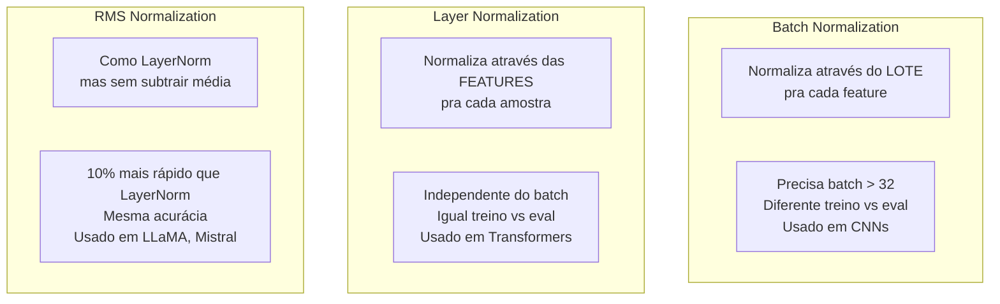
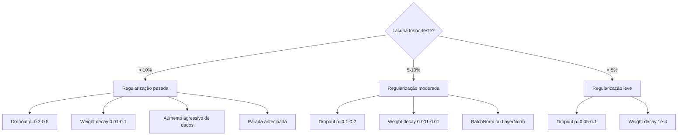

# Regularização

> Seu modelo tira 99% nos dados de treino e 60% nos de teste. Memorizou em vez de aprender. Regularização é o imposto que você impõe na complexidade pra forçar generalização.

**Tipo:** Construção
**Linguagens:** Python
**Pré-requisitos:** Aula 03.06 (Otimizadores)
**Tempo:** ~75 minutos

## Objetivos de Aprendizado

- Implementar dropout com escalonamento invertido, weight decay L2, batch normalization, layer normalization e RMSNorm do zero
- Medir a lacuna treino-teste e diagnosticar overfitting usando experimentos de regularização
- Explicar por que transformers usam LayerNorm em vez de BatchNorm e por que LLMs modernos preferem RMSNorm
- Aplicar a combinação correta de técnicas de regularização baseado na severidade do overfitting

## O Problema

Uma rede neural com parâmetros suficientes pode memorizar qualquer dataset. Isso não é hipotético — Zhang et al. (2017) provaram treinando redes padrão em ImageNet com rótulos aleatórios. As redes atingiram perda de treino próxima de zero em alocações completamente aleatórias de rótulos. Memorizaram um milhão de pares entrada-saída sem padrão pra aprender.

Esse é o problema de overfitting, e piora conforme os modelos ficam maiores. GPT-3 tem 175 bilhões de parâmetros. O conjunto de treino tem cerca de 500 bilhões de tokens. Com tantos parâmetros, o modelo tem capacidade suficiente pra memorizar pedaços significativos dos dados de treino na íntegra. Sem regularização, ele simplesmente regurgitaria exemplos de treino em vez de aprender padrões generalizáveis.

A lacuna entre performance de treino e teste é a lacuna de overfitting. Toda técnica nesta aula ataca essa lacuna de um ângulo diferente.

## O Conceito

### Dropout

A técnica de regularização mais simples com a interpretação mais elegante. Durante o treino, defina aleatoriamente a saída de cada neurônio pra zero com probabilidade p.

```
output = activation(z) * mask    onde mask[i] ~ Bernoulli(1 - p)
```

Com p = 0.5, metade dos neurônios são zerados a cada passo direto. A rede deve aprender representações redundantes porque não pode prever quais neurônios estarão disponíveis.

A interpretação de ensemble: uma rede com N neurônios e dropout cria 2^N sub-redes possíveis. Treinar com dropout aproximadamente treina todas as 2^N sub-redes simultaneamente, cada uma em mini-lotes diferentes.

Na prática, o escalonamento é aplicado durante o treino em vez do teste (dropout invertido):

```
Durante treino:  output = activation(z) * mask / (1 - p)
Durante teste:   output = activation(z)   (sem mudança)
```

Taxas padrão: p = 0.1 pra transformers, p = 0.5 pra MLPs, p = 0.2-0.3 pra CNNs.

### Weight Decay (Regularização L2)

Adicione o quadrado da magnitude de todos os pesos à perda:

```
total_loss = perda_tarefa + (lambda / 2) * sum(w_i^2)
```

O gradiente do termo de regularização é lambda * w. Isso significa que a cada passo, cada peso é diminuído em direção a zero por uma fração proporcional à sua magnitude.

### Batch Normalization

Normaliza a saída de cada camada através do mini-lote antes de passar pra próxima.

```
mu = (1/B) * sum(x_i)           (média do lote)
sigma^2 = (1/B) * sum((x_i - mu)^2)   (variância do lote)
x_hat = (x_i - mu) / sqrt(sigma^2 + eps)   (normalizar)
y = gamma * x_hat + beta        (escalar e deslocar)
```

### Layer Normalization

Normaliza através das features em vez do lote. Pra uma única amostra:

```
mu = (1/D) * sum(x_j)           (média da feature)
sigma^2 = (1/D) * sum((x_j - mu)^2)   (variância da feature)
x_hat = (x_j - mu) / sqrt(sigma^2 + eps)
y = gamma * x_hat + beta
```

É por que transformers usam LayerNorm em vez de BatchNorm. Sequências têm comprimentos variados, tamanhos de lote são frequentemente pequenos, e a computação é idêntica entre treino e inferência.

### RMSNorm

LayerNorm sem subtração da média. Proposta por Zhang & Sennrich (2019).

```
rms = sqrt((1/D) * sum(x_j^2))
y = gamma * x / rms
```

LLaMA, LLaMA 2, LLaMA 3, Mistral e a maioria dos LLMs modernos usam RMSNorm. Na escala de bilhões de parâmetros e trilhões de tokens, essa economia de 10% é significativa.

### Comparação de Normalização



### Quando Aplicar O quê



## Construa

### Passo 1: Dropout (Modo Treino e Eval)

```python
import random
import math


class Dropout:
    def __init__(self, p=0.5):
        self.p = p
        self.training = True
        self.mask = None

    def forward(self, x):
        if not self.training:
            return list(x)
        self.mask = []
        output = []
        for val in x:
            if random.random() < self.p:
                self.mask.append(0)
                output.append(0.0)
            else:
                self.mask.append(1)
                output.append(val / (1 - self.p))
        return output

    def backward(self, grad_output):
        grads = []
        for g, m in zip(grad_output, self.mask):
            if m == 0:
                grads.append(0.0)
            else:
                grads.append(g / (1 - self.p))
        return grads
```

### Passo 2: Weight Decay L2

```python
def l2_regularization(weights, lambda_reg):
    penalty = 0.0
    for w in weights:
        penalty += w * w
    return lambda_reg * 0.5 * penalty

def l2_gradient(weights, lambda_reg):
    return [lambda_reg * w for w in weights]
```

### Passo 3: Batch Normalization

```python
class BatchNorm:
    def __init__(self, num_features, momentum=0.1, eps=1e-5):
        self.gamma = [1.0] * num_features
        self.beta = [0.0] * num_features
        self.eps = eps
        self.momentum = momentum
        self.running_mean = [0.0] * num_features
        self.running_var = [1.0] * num_features
        self.training = True
        self.num_features = num_features

    def forward(self, batch):
        batch_size = len(batch)
        if self.training:
            mean = [0.0] * self.num_features
            for sample in batch:
                for j in range(self.num_features):
                    mean[j] += sample[j]
            mean = [m / batch_size for m in mean]

            var = [0.0] * self.num_features
            for sample in batch:
                for j in range(self.num_features):
                    var[j] += (sample[j] - mean[j]) ** 2
            var = [v / batch_size for v in var]

            for j in range(self.num_features):
                self.running_mean[j] = (1 - self.momentum) * self.running_mean[j] + self.momentum * mean[j]
                self.running_var[j] = (1 - self.momentum) * self.running_var[j] + self.momentum * var[j]
        else:
            mean = list(self.running_mean)
            var = list(self.running_var)

        self.x_hat = []
        output = []
        for sample in batch:
            normalized = []
            out_sample = []
            for j in range(self.num_features):
                x_h = (sample[j] - mean[j]) / math.sqrt(var[j] + self.eps)
                normalized.append(x_h)
                out_sample.append(self.gamma[j] * x_h + self.beta[j])
            self.x_hat.append(normalized)
            output.append(out_sample)
        return output
```

### Passo 4: Layer Normalization

```python
class LayerNorm:
    def __init__(self, num_features, eps=1e-5):
        self.gamma = [1.0] * num_features
        self.beta = [0.0] * num_features
        self.eps = eps
        self.num_features = num_features

    def forward(self, x):
        mean = sum(x) / len(x)
        var = sum((xi - mean) ** 2 for xi in x) / len(x)

        self.x_hat = []
        output = []
        for j in range(self.num_features):
            x_h = (x[j] - mean) / math.sqrt(var + self.eps)
            self.x_hat.append(x_h)
            output.append(self.gamma[j] * x_h + self.beta[j])
        return output
```

### Passo 5: RMSNorm

```python
class RMSNorm:
    def __init__(self, num_features, eps=1e-6):
        self.gamma = [1.0] * num_features
        self.eps = eps
        self.num_features = num_features

    def forward(self, x):
        rms = math.sqrt(sum(xi * xi for xi in x) / len(x) + self.eps)
        output = []
        for j in range(self.num_features):
            output.append(self.gamma[j] * x[j] / rms)
        return output
```

## Use

PyTorch fornece todas as normalizações e regularizações como módulos:

```python
import torch
import torch.nn as nn

model = nn.Sequential(
    nn.Linear(784, 256),
    nn.BatchNorm1d(256),
    nn.ReLU(),
    nn.Dropout(0.3),
    nn.Linear(256, 128),
    nn.BatchNorm1d(128),
    nn.ReLU(),
    nn.Dropout(0.3),
    nn.Linear(128, 10),
)

model.train()
out_train = model(torch.randn(32, 784))

model.eval()
out_test = model(torch.randn(1, 784))
```

O toggle `model.train()` / `model.eval()` é crucial. Ele ativa/desativa dropout e diz ao BatchNorm pra usar estatísticas do lote vs médias móveis. Esquecer `model.eval()` antes da inferência é um dos bugs mais comuns do deep learning.

## Entregue

Esta aula produz:
- `outputs/prompt-regularization-advisor.md` — um prompt que diagnostica overfitting e recomenda a estratégia de regularização certa

## Exercícios

1. Implemente dropout espacial pra dados 2D: em vez de derrubar neurônios individuais, derrube canais de features inteiros. Compare a lacuna treino-teste com dropout padrão no dataset do círculo.

2. Implemente suavização de rótulos da aula 05 combinada com dropout desta aula. Treine com quatro configurações: nenhuma, só dropout, só suavização, as duas. Meça a lacuna final treino-teste pra cada.

## Termos-Chave

| Termo | O que o pessoal diz | O que realmente significa |
|-------|---------------------|--------------------------|
| Dropout | "Desligar neurônios aleatoriamente" | Zerar saídas de neurônios com probabilidade p durante treino pra evitar co-adaptação |
| Weight decay | "Diminuir os pesos" | Adicionar penalidade L2 aos pesos pra manter valores pequenos e prevenir overfitting |
| Batch Normalization | "Normalizar lotes" | Normalizar ativações através do mini-lote pra estabilizar treino e permitir taxas maiores |
| Layer Normalization | "Normalizar features" | Normalizar ativações através das features pra cada amostra; usado em transformers |
| RMSNorm | "Normalização RMS" | LayerNorm sem subtração de média; 10% mais rápido com mesma acurácia |
| Parada antecipada | "Parar antes de overfit" | Monitorar perda de validação e parar quando ela começar a aumentar |
| Aumento de dados | "Aumentar dataset" | Criar variações dos dados de treino pra aumentar diversidade sem coletar dados novos |
