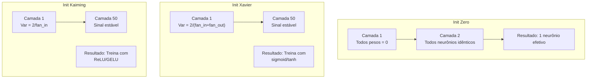
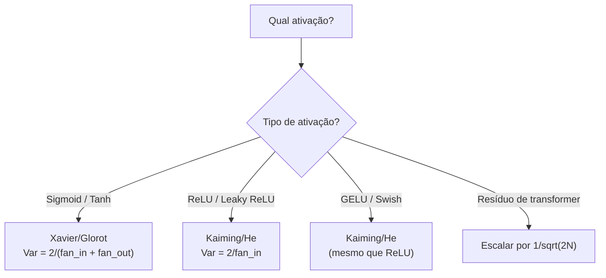

# Inicialização de Pesos e Estabilidade de Treino

> Inicialize errado e o treino nunca começa. Inicialize certo e 50 camadas treinam suavemente como 3.

**Tipo:** Construção
**Linguagens:** Python
**Pré-requisitos:** Aula 03.04 (Funções de Ativação), Aula 03.07 (Regularização)
**Tempo:** ~90 minutos

## Objetivos de Aprendizado

- Implementar estratégias de inicialização zero, aleatória, Xavier/Glorot e Kaiming/He e medir seu efeito nas magnitudes de ativação por 50 camadas
- Derivar por que Xavier usa Var(w) = 2/(fan_in + fan_out) e Kaiming usa Var(w) = 2/fan_in
- Demonstrar o problema da simetria com inicialização zero e explicar por que só escala aleatória não é suficiente
- Associar a estratégia de inicialização correta à função de ativação: Xavier pra sigmoid/tanh, Kaiming pra ReLU/GELU

## O Problema

Inicialize todos os pesos em zero. Nada aprende. Cada neurônio computa a mesma função, recebe o mesmo gradiente e atualiza da mesma forma. Depois de 10.000 épocas, sua camada oculta de 512 neurônios ainda é 512 cópias do mesmo neurônio.

Inicialize demais grandes. Ativações explodem pela rede. Na camada 10, valores batem em 1e15. Na camada 20, estouram pra infinito.

Inicialize aleatoriamente de uma distribuição normal padrão. Funciona pra 3 camadas. A 50 camadas, o sinal colapsa pra zero ou explode pra infinito dependendo se a escala aleatória foi ligeiramente menor ou maior.

Inicialização de pesos é a decisão mais subestimada do deep learning. Arquitetura ganha artigos. Otimizadores ganham posts. Inicialização ganha uma nota de rodapé. Mas erre e nada mais importa — sua rede morre antes do treino começar.

## O Conceito

### O Problema da Simetria

Cada neurônio numa camada tem a mesma estrutura: multiplicar entradas por pesos, somar viés, aplicar ativação. Se todos os pesos começam no mesmo valor (zero é o caso extremo), cada neurônio computa a mesma saída. Durante retropropagação, cada neurônio recebe o mesmo gradiente. Durante atualização, cada neurônio muda pela mesma quantidade.

Você está preso. A rede tem centenas de parâmetros, mas todos se movem em sincronia. Isso se chama simetria, e inicialização aleatória é o jeito bruto de quebrá-lo.

Mas "aleatório" não é suficiente. A *escala* da aleatoriedade determina se a rede treina.

### Propagação de Variância

Considere uma camada com fan_in entradas:

```
z = w1*x1 + w2*x2 + ... + w_n*x_n
```

A variância da saída é:

```
Var(z) = fan_in * Var(w) * Var(x)
```

Se Var(w) = 1 e fan_in = 512, a variância da saída é 512x a variância da entrada. Após 10 camadas: 512^10 = 1.2e27. Seu sinal explodiu.

O objetivo: escolha Var(w) tal que Var(z) = Var(x).

### Inicialização Xavier/Glorot

Glorot e Bengio (2010) derivaram a solução pra ativações sigmoid e tanh:

```
Var(w) = 2 / (fan_in + fan_out)
```

### Inicialização Kaiming/He

ReLU mata metade das saídas (tudo negativo vira zero). Fan_in efetivo é reduzido pela metade.

He et al. (2015) ajustou a fórmula:

```
Var(w) = 2 / fan_in
```

O fator 2 compensa a ReLU zerando metade das ativações. Sem ele, o sinal encolhe ~0.5x por camada. Com 50 camadas: 0.5^50 = 8.8e-16.

### Inicialização de Transformer

GPT-2 introduziu um padrão diferente. Conexões residuais adicionam a saída de cada sub-camada à sua entrada. Cada adição aumenta a variância. GPT-2 escala os pesos das camadas residuais por 1/sqrt(2N).



### Escolhendo a Init Certa



## Construa

### Passo 1: Estratégias de Inicialização

```python
import math
import random


def zero_init(fan_in, fan_out):
    return [[0.0 for _ in range(fan_in)] for _ in range(fan_out)]


def random_init(fan_in, fan_out, scale=1.0):
    return [[random.gauss(0, scale) for _ in range(fan_in)] for _ in range(fan_out)]


def xavier_init(fan_in, fan_out):
    std = math.sqrt(2.0 / (fan_in + fan_out))
    return [[random.gauss(0, std) for _ in range(fan_in)] for _ in range(fan_out)]


def kaiming_init(fan_in, fan_out):
    std = math.sqrt(2.0 / fan_in)
    return [[random.gauss(0, std) for _ in range(fan_in)] for _ in range(fan_out)]
```

### Passo 2: Funções de Ativação

```python
def sigmoid(x):
    x = max(-500, min(500, x))
    return 1.0 / (1.0 + math.exp(-x))


def tanh_act(x):
    return math.tanh(x)


def relu(x):
    return max(0.0, x)
```

### Passo 3: Passo Direto por 50 Camadas

```python
def forward_deep(init_fn, activation_fn, n_layers=50, width=64, n_samples=100):
    random.seed(42)
    layer_magnitudes = []

    inputs = [[random.gauss(0, 1) for _ in range(width)] for _ in range(n_samples)]

    for layer_idx in range(n_layers):
        weights = init_fn(width, width)
        biases = [0.0] * width

        new_inputs = []
        for sample in inputs:
            output = []
            for neuron_idx in range(width):
                z = sum(weights[neuron_idx][j] * sample[j] for j in range(width)) + biases[neuron_idx]
                output.append(activation_fn(z))
            new_inputs.append(output)
        inputs = new_inputs

        magnitudes = []
        for sample in inputs:
            magnitudes.append(sum(abs(v) for v in sample) / width)
        mean_mag = sum(magnitudes) / len(magnitudes)
        layer_magnitudes.append(mean_mag)

    return layer_magnitudes
```

### Passo 4: O Experimento

```python
def run_experiment():
    configs = [
        ("Zero init + Sigmoid", lambda fi, fo: zero_init(fi, fo), sigmoid),
        ("Random N(0,1) + ReLU", lambda fi, fo: random_init(fi, fo, 1.0), relu),
        ("Random N(0,0.01) + ReLU", lambda fi, fo: random_init(fi, fo, 0.01), relu),
        ("Xavier + Sigmoid", xavier_init, sigmoid),
        ("Xavier + Tanh", xavier_init, tanh_act),
        ("Kaiming + ReLU", kaiming_init, relu),
    ]

    print(f"{'Strategy':<30} {'L1':>10} {'L5':>10} {'L10':>10} {'L25':>10} {'L50':>10}")
    print("-" * 80)

    for name, init_fn, act_fn in configs:
        mags = forward_deep(init_fn, act_fn)
        row = f"{name:<30}"
        for idx in [0, 4, 9, 24, 49]:
            val = mags[idx]
            if val > 1e6:
                row += f" {'EXPLODED':>10}"
            elif val < 1e-6:
                row += f" {'VANISHED':>10}"
            else:
                row += f" {val:>10.4f}"
        print(row)
```

### Passo 5: Demo de Simetria

```python
def symmetry_demo():
    random.seed(42)
    weights = zero_init(2, 4)
    biases = [0.0] * 4

    inputs = [0.5, -0.3]
    outputs = []
    for neuron_idx in range(4):
        z = sum(weights[neuron_idx][j] * inputs[j] for j in range(2)) + biases[neuron_idx]
        outputs.append(sigmoid(z))

    print("\nSymmetry Demo (4 neurons, zero init):")
    for i, out in enumerate(outputs):
        print(f"  Neuron {i}: output = {out:.6f}")
    all_same = all(abs(outputs[i] - outputs[0]) < 1e-10 for i in range(len(outputs)))
    print(f"  All identical: {all_same}")
    print(f"  Effective parameters: 1 (not {len(weights) * len(weights[0])})")
```

## Use

PyTorch fornece essas como funções embutidas:

```python
import torch
import torch.nn as nn

layer = nn.Linear(512, 256)

nn.init.xavier_uniform_(layer.weight)
nn.init.xavier_normal_(layer.weight)

nn.init.kaiming_uniform_(layer.weight, nonlinearity='relu')
nn.init.kaiming_normal_(layer.weight, nonlinearity='relu')

nn.init.zeros_(layer.bias)
```

Quando você chama `nn.Linear(512, 256)`, PyTorch usa por padrão inicialização Kaiming uniform. É por isso que a maioria das redes simples "simplesmente funciona" — PyTorch já tomou a decisão certa.

## Entregue

Esta aula produz:
- `outputs/prompt-init-strategy.md` — um prompt que diagnostica problemas de inicialização de pesos e recomenda a estratégia certa

## Exercícios

1. Adicione inicialização LeCun (Var = 1/fan_in, projetada pra ativação SELU). Rode o experimento de 50 camadas com LeCun + tanh e compare com Xavier + tanh.

2. Implemente o escalonamento residual do GPT-2: multiplique a saída de cada camada por 1/sqrt(2*N) antes de adicionar ao fluxo residual. Rode 50 camadas com e sem escalonamento.

3. Crie uma função "checagem de saúde da init" que pegue as dimensões das camadas e o tipo de ativação e recomende a inicialização correta.

4. Rode o experimento com fan_in = 16 vs fan_in = 1024. Xavier e Kaiming se adaptam ao fan_in, mas init aleatória não.

5. Implemente inicialização ortogonal (gere uma matriz aleatória, compute sua SVD, use a matriz ortogonal U). Compare com Kaiming pra redes ReLU com 50 camadas.

## Termos-Chave

| Termo | O que o pessoal diz | O que realmente significa |
|-------|---------------------|--------------------------|
| Inicialização de pesos | "Setar pesos iniciais aleatoriamente" | A estratégia pra escolher valores iniciais que determina se uma rede consegue treinar |
| Quebra de simetria | "Fazer neurônios diferentes" | Usar inicialização aleatória pra garantir que neurônios aprendam features distintas |
| Fan-in | "Número de entradas de um neurônio" | Número de conexões de entrada, que determina como a variância da entrada se acumula na soma ponderada |
| Fan-out | "Número de saídas de um neurônio" | Número de conexões de saída, relevante pra manter variância do gradiente durante retropropagação |
| Init Xavier/Glorot | "A inicialização pra sigmoid" | Var(w) = 2/(fan_in + fan_out), projetada pra preservar variância com sigmoid e tanh |
| Init Kaiming/He | "A inicialização pra ReLU" | Var(w) = 2/fan_in, compensa ReLU zerando metade das ativações |
| Propagação de variância | "Como sinais crescem ou encolhem" | Análise matemática de como a variância de ativação muda camada por camada baseado na escala dos pesos |
| Escalonamento residual | "O truque de init do GPT-2" | Escalar pesos de conexões residuais por 1/sqrt(2N) pra prevenir crescimento de variância |
