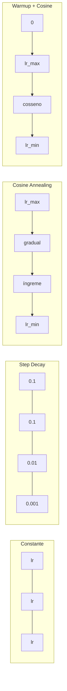
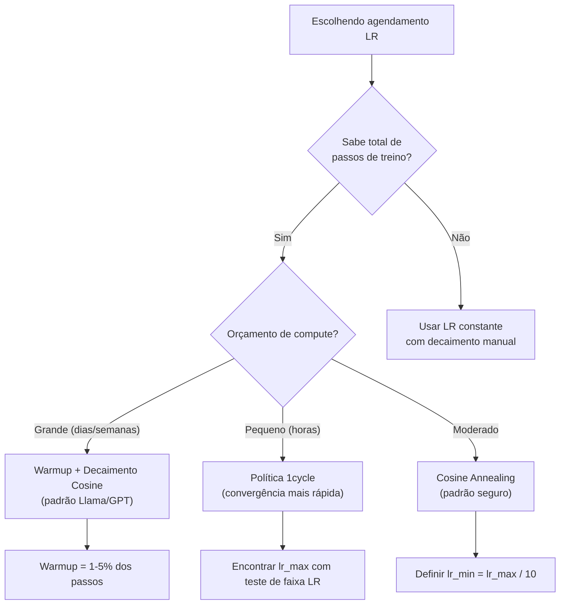
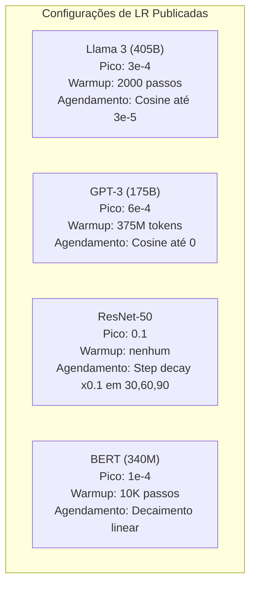

# Agendamento de Taxa de Aprendizado e Warmup

> A taxa de aprendizado é o hiperparâmetro mais importante. Não a arquitetura. Não o tamanho do dataset. Não a função de ativação. A taxa de aprendizado. Se você não ajustar mais nada, ajuste ela.

**Tipo:** Construção
**Linguagens:** Python
**Pré-requisitos:** Aula 03.06 (Otimizadores), Aula 03.08 (Inicialização de Pesos)
**Tempo:** ~90 minutos

## Objetivos de Aprendizado

- Implementar agendamentos de taxa de aprendizado constante, decaimento em etapas, cosine annealing, warmup + cosine e 1cycle do zero
- Demonstrar os três modos de falha na seleção da taxa: divergência (muita alta), travamento (muita baixa) e oscilação (sem decaimento)
- Explicar por que warmup é necessário pra otimizadores baseados em Adam e como ele estabiliza o treino inicial
- Comparar velocidade de convergência entre os cinco agendamentos na mesma tarefa e selecionar o apropriado pra um orçamento de treino dado

## O Problema

Coloque a taxa em 0.1. Treino diverge — perda pula pro infinito em 3 passos. Coloque em 0.0001. Treino engatinha — depois de 100 épocas, o modelo mal saiu do aleatório. Coloque em 0.01. Treino funciona por 50 épocas, depois a perda oscila ao redor de um mínimo que nunca atinge porque os passos são grandes demais.

A taxa de aprendizado ideal não é constante. Ela muda durante o treino. No início, você quer passos grandes pra cobrir terreno rápido. No final, passos pequenos pra se estabelecer num mínimo afiado. A diferença entre um modelo de 90% e 95% de acurácia é frequentemente só o agendamento.

Todo modelo publicado nos últimos três anos usa agendamento de taxa de aprendizado. Llama 3 usou lr máximo=3e-4 com 2000 passos de warmup e decaimento cosine até 3e-5. GPT-3 usou lr=6e-4 com warmup sobre 375 milhões de tokens. Estas não são escolhas arbitrárias. São resultado de varreduras extensivas de hiperparâmetros que custaram milhões de dólares.

Você precisa entender agendamentos porque os padrões não funcionarão pro seu problema. Quando você faz fine-tuning de um modelo pré-treinado, o agendamento certo é diferente de treinar do zero. Quando você aumenta o tamanho do lote, o período de warmup precisa mudar. Quando o treino quebra no passo 10.000, você precisa saber se é problema de agendamento ou outra coisa.

## O Conceito

### Taxa Constante

A abordagem mais simples. Escolha um número, use pra cada passo.

```
lr(t) = lr_0
```

Raramente é ideal. É ou muito alta pro final (oscilação ao redor do mínimo) ou muito baixa pro início (desperdício de compute em passos minúsculos). Funciona bem pra modelos pequenos e debugging. Uma escolha terrível pra qualquer coisa que treina por mais de uma hora.

### Decaimento em Etapas

A abordagem old-school da era ResNet. Corte a taxa por um fator (geralmente 10x) em épocas fixas.

```
lr(t) = lr_0 * gamma^(floor(epoch / step_size))
```

Onde gamma = 0.1 e step_size = 30 significa: lr cai 10x a cada 30 épocas. ResNet-50 usou isso — lr=0.1, cair 10x nas épocas 30, 60 e 90.

O problema: os pontos ótimos de decaimento dependem do dataset e da arquitetura. Mude pra um problema diferente e você precisa re-ajustar quando cair. As transições são abruptas — a perda pode espicar quando a taxa muda repentinamente.

### Cosine Annealing

Decaimento suave do lr máximo pro mínimo, seguindo uma curva cosseno:

```
lr(t) = lr_min + 0.5 * (lr_max - lr_min) * (1 + cos(pi * t / T))
```

Onde t é o passo atual e T é o número total de passos.

Em t=0, o termo cosseno é 1, então lr = lr_max. Em t=T, o termo cosseno é -1, então lr = lr_min. O decaimento é suave no início, acelera no meio e fica suave de novo perto do fim.

Este é o padrão pra maioria dos treinos modernos. Sem hiperparâmetros pra ajustar além de lr_max e lr_min. A forma cosseno corresponde à observação empírica de que a maioria do aprendizado acontece no meio do treino — você quer tamanhos de passo razoáveis durante esse período crítico.

### Warmup: Por que Começa Pequeno

Adam e outros otimizadores adaptativos mantêm estimativas de média e variância dos gradientes. No passo 0, essas estimativas são zero. Os primeiros updates de gradiente são baseados em estatísticas sem sentido. Se sua taxa de aprendizado é grande durante esse período, o modelo dá passos enormes e mal direcionados.

Warmup corrige isso. Comece com um lr minúsculo (frequentemente lr_max / warmup_steps ou até zero) e aumente linearmente até lr_max nos primeiros N passos. Quando você atinge a taxa completa, as estatísticas do Adam já se estabilizaram.

```
lr(t) = lr_max * (t / warmup_steps)     pra t < warmup_steps
```

Warmup típico: 1-5% do total de passos de treino. Llama 3 treinou por ~1.8 trilhão de tokens e fez warmup por 2000 passos. GPT-3 fez warmup sobre 375 milhões de tokens.

### Warmup Linear + Decaimento Cosine

O padrão moderno. Aumente linearmente, depois decaia com cosseno:

```
if t < warmup_steps:
    lr(t) = lr_max * (t / warmup_steps)
else:
    progress = (t - warmup_steps) / (total_steps - warmup_steps)
    lr(t) = lr_min + 0.5 * (lr_max - lr_min) * (1 + cos(pi * progress))
```

É o que Llama, GPT, PaLM e a maioria dos transformers modernos usam. O warmup previne instabilidade inicial. O decaimento cosseno estabelece o modelo num bom mínimo.

### Política 1cycle

A descoberta de Leslie Smith (2018): aumente o lr de um valor baixo pra um valor alto na primeira metade do treino, depois diminua na segunda metade. Contra-intuitivo — por que você *aumentaria* a taxa no meio do treino?

A teoria: uma taxa alta age como regularização adicionando ruído à trajetória de otimização. O modelo explora mais da paisagem de perda durante a fase de aumento, encontrando melhores bacias. A fase de diminuição então refina dentro da melhor bacia encontrada.

```
Fase 1 (0 a T/2):    lr aumenta de lr_max/25 até lr_max
Fase 2 (T/2 a T):    lr diminui de lr_max até lr_max/10000
```

1cycle frequentemente treina mais rápido que cosine annealing pra um orçamento de compute fixo. O tradeoff: você precisa saber o número total de passos de antemão.

### Formas dos Agendamentos



### Fluxograma de Decisão



### Números Reais de Modelos Publicados



## Construa

### Passo 1: Funções de Agendamento

Cada função recebe o passo atual e retorna a taxa de aprendizado naquele passo.

```python
import math


def constant_schedule(step, lr=0.01, **kwargs):
    return lr


def step_decay_schedule(step, lr=0.1, step_size=100, gamma=0.1, **kwargs):
    return lr * (gamma ** (step // step_size))


def cosine_schedule(step, lr=0.01, total_steps=1000, lr_min=1e-5, **kwargs):
    if step >= total_steps:
        return lr_min
    return lr_min + 0.5 * (lr - lr_min) * (1 + math.cos(math.pi * step / total_steps))


def warmup_cosine_schedule(step, lr=0.01, total_steps=1000, warmup_steps=100, lr_min=1e-5, **kwargs):
    if total_steps <= warmup_steps:
        return lr * (step / max(warmup_steps, 1))
    if step < warmup_steps:
        return lr * step / warmup_steps
    progress = (step - warmup_steps) / (total_steps - warmup_steps)
    return lr_min + 0.5 * (lr - lr_min) * (1 + math.cos(math.pi * progress))


def one_cycle_schedule(step, lr=0.01, total_steps=1000, **kwargs):
    mid = max(total_steps // 2, 1)
    if step < mid:
        return (lr / 25) + (lr - lr / 25) * step / mid
    else:
        progress = (step - mid) / max(total_steps - mid, 1)
        return lr * (1 - progress) + (lr / 10000) * progress
```

### Passo 2: Visualizar Todos os Agendamentos

Imprima um gráfico baseado em texto mostrando como cada agendamento evolui durante o treino.

```python
def visualize_schedule(name, schedule_fn, total_steps=500, **kwargs):
    steps = list(range(0, total_steps, total_steps // 20))
    if total_steps - 1 not in steps:
        steps.append(total_steps - 1)

    lrs = [schedule_fn(s, total_steps=total_steps, **kwargs) for s in steps]
    max_lr = max(lrs) if max(lrs) > 0 else 1.0

    print(f"\n{name}:")
    for s, lr_val in zip(steps, lrs):
        bar_len = int(lr_val / max_lr * 40)
        bar = "#" * bar_len
        print(f"  Step {s:4d}: lr={lr_val:.6f} {bar}")
```

### Passo 3: Rede de Treino

Uma rede simples de duas camadas no dataset círculo, mesma das aulas anteriores, mas agora variamos o agendamento.

```python
import random


def sigmoid(x):
    x = max(-500, min(500, x))
    return 1.0 / (1.0 + math.exp(-x))


def relu(x):
    return max(0.0, x)


def relu_deriv(x):
    return 1.0 if x > 0 else 0.0


def make_circle_data(n=200, seed=42):
    random.seed(seed)
    data = []
    for _ in range(n):
        x = random.uniform(-2, 2)
        y = random.uniform(-2, 2)
        label = 1.0 if x * x + y * y < 1.5 else 0.0
        data.append(([x, y], label))
    return data


def train_with_schedule(schedule_fn, schedule_name, data, epochs=300, base_lr=0.05, **kwargs):
    random.seed(0)
    hidden_size = 8
    total_steps = epochs * len(data)

    std = math.sqrt(2.0 / 2)
    w1 = [[random.gauss(0, std) for _ in range(2)] for _ in range(hidden_size)]
    b1 = [0.0] * hidden_size
    w2 = [random.gauss(0, std) for _ in range(hidden_size)]
    b2 = 0.0

    step = 0
    epoch_losses = []

    for epoch in range(epochs):
        total_loss = 0
        correct = 0

        for x, target in data:
            lr = schedule_fn(step, lr=base_lr, total_steps=total_steps, **kwargs)

            z1 = []
            h = []
            for i in range(hidden_size):
                z = w1[i][0] * x[0] + w1[i][1] * x[1] + b1[i]
                z1.append(z)
                h.append(relu(z))

            z2 = sum(w2[i] * h[i] for i in range(hidden_size)) + b2
            out = sigmoid(z2)

            error = out - target
            d_out = error * out * (1 - out)

            for i in range(hidden_size):
                d_h = d_out * w2[i] * relu_deriv(z1[i])
                w2[i] -= lr * d_out * h[i]
                for j in range(2):
                    w1[i][j] -= lr * d_h * x[j]
                b1[i] -= lr * d_h
            b2 -= lr * d_out

            total_loss += (out - target) ** 2
            if (out >= 0.5) == (target >= 0.5):
                correct += 1
            step += 1

        avg_loss = total_loss / len(data)
        epoch_losses.append(avg_loss)

    return epoch_losses
```

### Passo 4: Compare Todos os Agendamentos

Treine a mesma rede com cada agendamento e compare a perda final e comportamento de convergência.

```python
def compare_schedules(data):
    configs = [
        ("Constante", constant_schedule, {}),
        ("Step Decay", step_decay_schedule, {"step_size": 15000, "gamma": 0.1}),
        ("Cosine", cosine_schedule, {"lr_min": 1e-5}),
        ("Warmup+Cosine", warmup_cosine_schedule, {"warmup_steps": 3000, "lr_min": 1e-5}),
        ("1cycle", one_cycle_schedule, {}),
    ]

    print(f"\n{'Agendamento':<20} {'Loss Início':>12} {'Loss Meio':>12} {'Loss Final':>12} {'Melhor Loss':>12}")
    print("-" * 70)

    for name, schedule_fn, extra_kwargs in configs:
        losses = train_with_schedule(schedule_fn, name, data, epochs=300, base_lr=0.05, **extra_kwargs)
        mid_idx = len(losses) // 2
        best = min(losses)
        print(f"{name:<20} {losses[0]:>12.6f} {losses[mid_idx]:>12.6f} {losses[-1]:>12.6f} {best:>12.6f}")
```

### Passo 5: LR Muito Alta vs Muito Baixa

Demonstre os três modos de falha: muito alta (divergência), muito baixa (engatinhando) e no ponto certo.

```python
def lr_sensitivity(data):
    learning_rates = [1.0, 0.1, 0.01, 0.001, 0.0001]

    print("\nSensibilidade LR (agendamento constante, 100 épocas):")
    print(f"  {'LR':>10} {'Loss Início':>12} {'Loss Final':>12} {'Status':>15}")
    print("  " + "-" * 52)

    for lr in learning_rates:
        losses = train_with_schedule(constant_schedule, f"lr={lr}", data, epochs=100, base_lr=lr)
        start = losses[0]
        end = losses[-1]

        if end > start or math.isnan(end) or end > 1.0:
            status = "DIVERGIU"
        elif end > start * 0.9:
            status = "MAL MEXEU"
        elif end < 0.15:
            status = "CONVERGIU"
        else:
            status = "APRENDENDO"

        end_str = f"{end:.6f}" if not math.isnan(end) else "NaN"
        print(f"  {lr:>10.4f} {start:>12.6f} {end_str:>12} {status:>15}")
```

## Use

PyTorch fornece agendadores em `torch.optim.lr_scheduler`:

```python
import torch
import torch.optim as optim
from torch.optim.lr_scheduler import CosineAnnealingLR, OneCycleLR, StepLR

model = nn.Sequential(nn.Linear(10, 64), nn.ReLU(), nn.Linear(64, 1))
optimizer = optim.Adam(model.parameters(), lr=3e-4)

scheduler = CosineAnnealingLR(optimizer, T_max=1000, eta_min=1e-5)

for step in range(1000):
    loss = train_step(model, optimizer)
    scheduler.step()
```

Pra warmup + cosine, use um scheduler lambda ou `get_cosine_schedule_with_warmup` do HuggingFace:

```python
from transformers import get_cosine_schedule_with_warmup

scheduler = get_cosine_schedule_with_warmup(
    optimizer,
    num_warmup_steps=2000,
    num_training_steps=100000,
)
```

A função do HuggingFace é o que a maioria dos scripts de fine-tuning de Llama e GPT usam. Quando em dúvida, use warmup + cosine com warmup = 3-5% do total de passos. Funciona pra quase tudo.

## Entregue

Esta aula produz:
- `outputs/prompt-lr-schedule-advisor.md` — um prompt que recomenda o agendamento de taxa e hiperparâmetros certos pra sua configuração de treino

## Exercícios

1. Implemente decaimento exponencial: lr(t) = lr_0 * gamma^t onde gamma = 0.999. Compare com cosine annealing no dataset do círculo.

2. Implemente o teste de faixa de taxa de aprendizado (Leslie Smith): treine por algumas centenas de passos aumentando exponencialmente o LR de 1e-7 a 1. Plote perda vs LR. O LR máximo ótimo está logo antes da perda começar a aumentar.

3. Treine com warmup + cosine mas varie o comprimento do warmup: 0%, 1%, 5%, 10%, 20% do total de passos. Encontre o ponto ideal onde o treino é mais estável.

4. Implemente cosine annealing com warm restarts (SGDR): redefina o LR pra lr_max a cada T passos e decaia de novo. Compare com cosine padrão num treino mais longo.

5. Construa um "cirurgião de agendamento" que monitore a perda de treino e troque automaticamente de warmup pra cosine quando a perda estabilizar, e reduza lr se a perda estagnar por muito tempo.

## Termos-chave

| Termo | O que o pessoal diz | O que realmente significa |
|-------|---------------------|--------------------------|
| Taxa de aprendizado | "Como rápido o modelo aprende" | O escalar que multiplica o gradiente pra determinar o tamanho da atualização do parâmetro |
| Agendamento | "Mudar o LR com o tempo" | Uma função que mapeia passo de treino pra taxa de aprendizado, projetada pra otimizar convergência |
| Warmup | "Começar com LR pequeno" | Aumentar linearmente o LR de perto de zero até o valor alvo nos primeiros N passos pra estabilizar estatísticas do otimizador |
| Cosine annealing | "Decaimento suave de LR" | Diminuir o LR seguindo uma curva cosseno de lr_max a lr_min durante o treino |
| Decaimento em etapas | "Cair LR nos marcos" | Multiplicar o LR por um fator (tipicamente 0.1) em intervalos fixos de época |
| Política 1cycle | "Sobe e desce" | Método de Leslie Smith de aumentar e diminuir o LR num único ciclo pra convergência mais rápida |
| Teste de faixa LR | "Encontrar a melhor taxa" | Treinar brevemente enquanto aumenta o LR pra encontrar o valor onde a perda começa a divergir |
| Cosine com warm restarts | "Resetar e repetir" | Redefinir periodicamente o LR pra lr_max e decair de novo (SGDR) |
| Eta mínima | "O piso do LR" | A taxa de aprendizado mínima pra qual o agendamento decai |
| Taxa de pico | "O LR máximo" | O maior LR atingido durante o treino, tipicamente após warmup |

## Leituras Complementares

- Loshchilov & Hutter, "SGDR: Stochastic Gradient Descent with Warm Restarts" (2017) — introduziu cosine annealing e warm restarts
- Smith, "Super-Convergence: Very Fast Training of Neural Networks Using Large Learning Rates" (2018) — o paper da política 1cycle
- Touvron et al., "Llama 2: Open Foundation and Fine-Tuned Chat Models" (2023) — documenta o agendamento warmup + cosine usado em escala
- Goyal et al., "Accurate, Large Minibatch SGD: Training ImageNet in 1 Hour" (2017) — regra de escalonamento linear e warmup pra treino com lotes grandes
