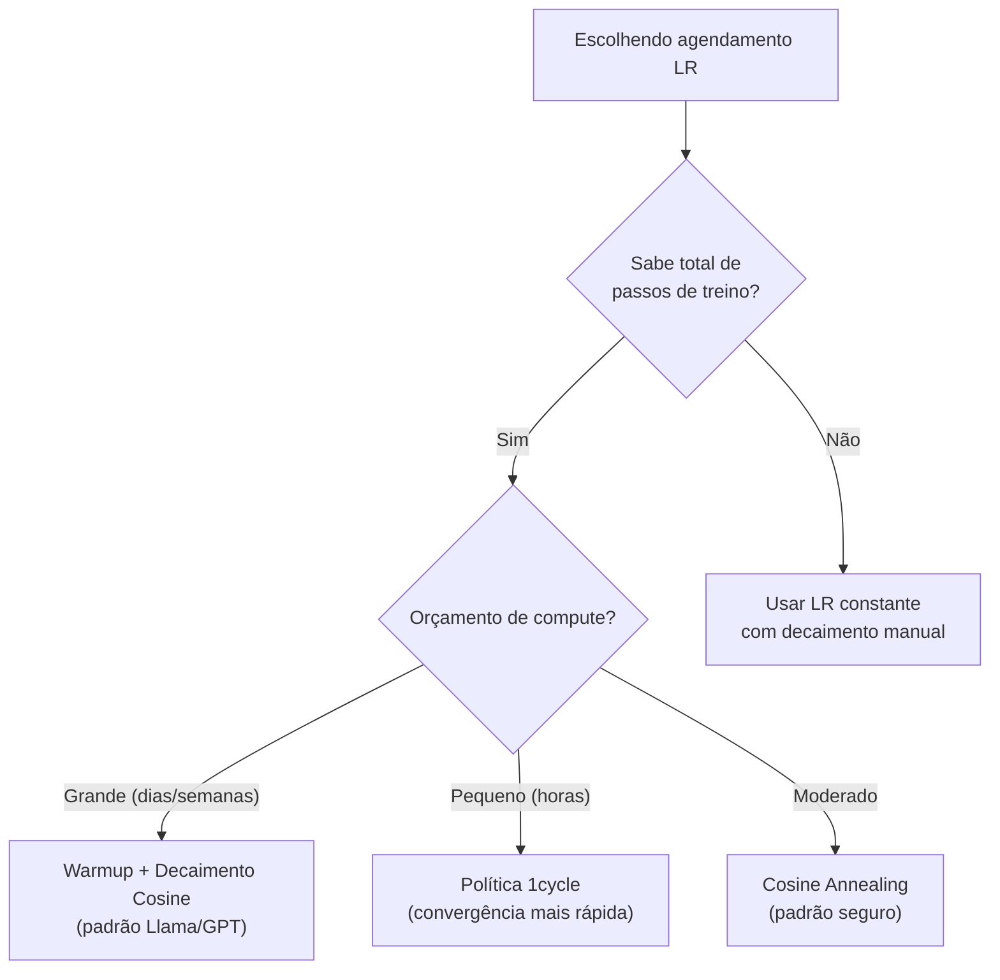
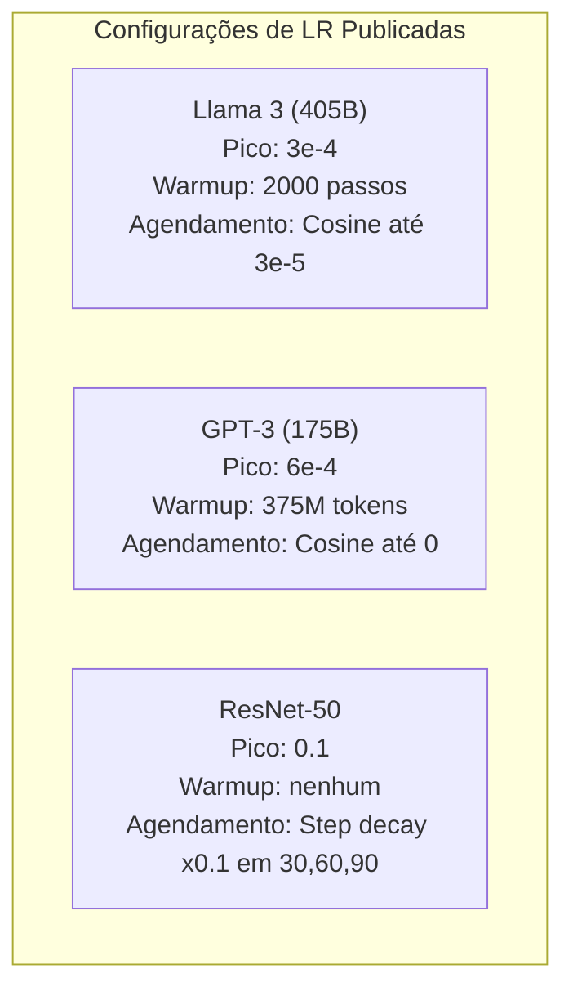

# Agendamento de Taxa de Aprendizado e Warmup

> A taxa de aprendizado é o hiperparâmetro mais importante. Não a arquitetura. Não o tamanho do dataset. Não a função de ativação. A taxa de aprendizado. Se você não ajustar mais nada, ajuste ela.

**Tipo:** Construção
**Linguagens:** Python
**Pré-requisitos:** Aula 03.06 (Otimizadores), Aula 03.08 (Inicialização de Pesos)
**Tempo:** ~90 minutos

## Objetivos de Aprendizado

- Implementar agendamentos de taxa de aprendizado constante, decaimento em etapas, cosine annealing, warmup + cosine e 1cycle do zero
- Demonstrar os três modos de falha na seleção da taxa: divergência (muita alta), travamento (muita baixa) e oscilação (sem decaimento)
- Explicar por que warmup é necessário pra otimizadores baseados em Adam e como ele estabiliza o treino inicial
- Comparar velocidade de convergência entre os cinco agendamentos na mesma tarefa

## O Problema

Coloque a taxa em 0.1. Treino diverge — perda pula pro infinito em 3 passos. Coloque em 0.0001. Treino engatinha — depois de 100 épocas, o modelo mal saiu do aleatório. Coloque em 0.01. Treino funciona por 50 épocas, depois a perda oscila ao redor de um mínimo que nunca atinge porque os passos são grandes demais.

A taxa de aprendizado ideal não é constante. Ela muda durante o treino. No início, você quer passos grandes pra cobrir terreno rápido. No final, passos pequenos pra se estabelecer num mínimo afiado. A diferença entre um modelo de 90% e 95% de acurácia é frequentemente só o agendamento.

Todo modelo publicado nos últimos três anos usa agendamento de taxa de aprendizado. Llama 3 usou lr máximo=3e-4 com 2000 passos de warmup e decaimento cosine até 3e-5. GPT-3 usou lr=6e-4 com warmup sobre 375 milhões de tokens.

## O Conceito

### Taxa Constante

```python
lr(t) = lr_0
```

Raramente é ideal. É ou muito alta pro final (oscilação) ou muito baixa pro início (desperdício de compute).

### Decaimento em Etapas

```python
lr(t) = lr_0 * gamma^(floor(epoch / step_size))
```

Onde gamma = 0.1 e step_size = 30 significa: lr cai 10x a cada 30 épocas.

### Cosine Annealing

```python
lr(t) = lr_min + 0.5 * (lr_max - lr_min) * (1 + cos(pi * t / T))
```

Decaimento suave do lr máximo pro mínimo, seguindo uma curva cosseno.

### Warmup: Por que Começa Pequeno

Adam e outros otimizadores adaptativos mantêm estimativas de média e variância dos gradientes. No passo 0, essas estimativas são zero. Os primeiros updates são baseados em estatísticas sem sentido.

Warmup corrige isso. Comece com um lr minúsculo e aumente linearmente até lr_max nos primeiros N passos.

```python
lr(t) = lr_max * (t / warmup_steps)     pra t < warmup_steps
```

### Warmup Linear + Decaimento Cosine

```python
if t < warmup_steps:
    lr(t) = lr_max * (t / warmup_steps)
else:
    progress = (t - warmup_steps) / (total_steps - warmup_steps)
    lr(t) = lr_min + 0.5 * (lr_max - lr_min) * (1 + cos(pi * progress))
```

### Política 1cycle

Leslie Smith (2018): aumente o lr do baixo pro alto na primeira metade, depois diminua na segunda.

### Decisão de Agendamento



### Números Reais de Modelos Publicados



## Construa

### Passo 1: Funções de Agendamento

```python
import math


def constant_schedule(step, lr=0.01, **kwargs):
    return lr


def step_decay_schedule(step, lr=0.1, step_size=100, gamma=0.1, **kwargs):
    return lr * (gamma ** (step // step_size))


def cosine_schedule(step, lr=0.01, total_steps=1000, lr_min=1e-5, **kwargs):
    if step >= total_steps:
        return lr_min
    return lr_min + 0.5 * (lr - lr_min) * (1 + math.cos(math.pi * step / total_steps))


def warmup_cosine_schedule(step, lr=0.01, total_steps=1000, warmup_steps=100, lr_min=1e-5, **kwargs):
    if total_steps <= warmup_steps:
        return lr * (step / max(warmup_steps, 1))
    if step < warmup_steps:
        return lr * step / warmup_steps
    progress = (step - warmup_steps) / (total_steps - warmup_steps)
    return lr_min + 0.5 * (lr - lr_min) * (1 + math.cos(math.pi * progress))


def one_cycle_schedule(step, lr=0.01, total_steps=1000, **kwargs):
    mid = max(total_steps // 2, 1)
    if step < mid:
        return (lr / 25) + (lr - lr / 25) * step / mid
    else:
        progress = (step - mid) / max(total_steps - mid, 1)
        return lr * (1 - progress) + (lr / 10000) * progress
```

### Passo 2: Visualizar Todos os Agendamentos

```python
def visualize_schedule(name, schedule_fn, total_steps=500, **kwargs):
    steps = list(range(0, total_steps, total_steps // 20))
    if total_steps - 1 not in steps:
        steps.append(total_steps - 1)

    lrs = [schedule_fn(s, total_steps=total_steps, **kwargs) for s in steps]
    max_lr = max(lrs) if max(lrs) > 0 else 1.0

    print(f"\n{name}:")
    for s, lr_val in zip(steps, lrs):
        bar_len = int(lr_val / max_lr * 40)
        bar = "#" * bar_len
        print(f"  Step {s:4d}: lr={lr_val:.6f} {bar}")
```

## Use

PyTorch fornece agendadores em `torch.optim.lr_scheduler`:

```python
import torch
import torch.optim as optim
from torch.optim.lr_scheduler import CosineAnnealingLR, OneCycleLR, StepLR

model = nn.Sequential(nn.Linear(10, 64), nn.ReLU(), nn.Linear(64, 1))
optimizer = optim.Adam(model.parameters(), lr=3e-4)

scheduler = CosineAnnealingLR(optimizer, T_max=1000, eta_min=1e-5)

for step in range(1000):
    loss = train_step(model, optimizer)
    scheduler.step()
```

Pra warmup + cosine, use `get_cosine_schedule_with_warmup` do HuggingFace:

```python
from transformers import get_cosine_schedule_with_warmup

scheduler = get_cosine_schedule_with_warmup(
    optimizer,
    num_warmup_steps=2000,
    num_training_steps=100000,
)
```

## Entregue

Esta aula produz:
- `outputs/prompt-lr-schedule-advisor.md` — um prompt que recomenda o agendamento de taxa e hiperparâmetros certos pra sua configuração de treino

## Exercícios

1. Implemente decaimento exponencial: lr(t) = lr_0 * gamma^t onde gamma = 0.999. Compare com cosine annealing no dataset do círculo.

2. Implemente o teste de faixa de taxa de aprendizado (Leslie Smith): treine por alguns centenas de passos aumentando exponencialmente o LR de 1e-7 a 1. Plote perda vs LR.

3. Treine com warmup + cosine mas varie o comprimento do warmup: 0%, 1%, 5%, 10%, 20% do total de passos.

4. Implemente cosine annealing com warm restarts (SGDR): redefina o LR pra lr_max a cada T passos e decaia de novo.

5. Construa um "cirurgião de agendamento" que monitore a perda de treino e troque automaticamente de warmup pra cosine quando a perda estabilizar.

## Termos-Chave

| Termo | O que o pessoal diz | O que realmente significa |
|-------|---------------------|--------------------------|
| Taxa de aprendizado | "Como rápido o modelo aprende" | O escalar que multiplica o gradiente pra determinar o tamanho da atualização |
| Agendamento | "Mudar o LR com o tempo" | Uma função que mapeia passo de treino pra taxa de aprendizado |
| Warmup | "Começar com LR pequeno" | Aumentar linearmente o LR de perto de zero até o alvo nos primeiros N passos |
| Cosine annealing | "Decaimento suave de LR" | Diminuir o LR seguindo uma curva cosseno de lr_max a lr_min |
| Decaimento em etapas | "Cair LR nos marcos" | Multiplicar o LR por um fator (tipicamente 0.1) em intervalos fixos de época |
| Política 1cycle | "Sobe e desce" | Método de Leslie Smith de aumentar e diminuir o LR num único ciclo |
