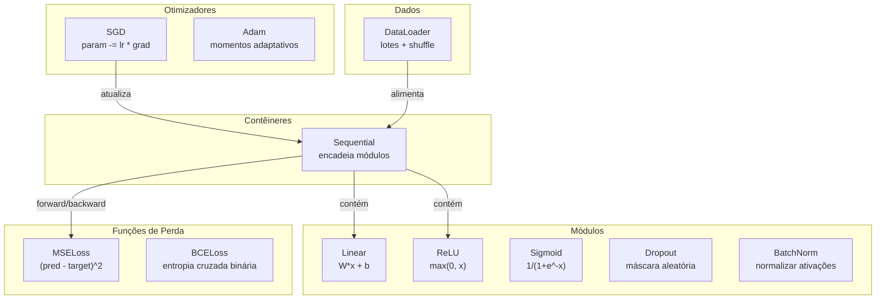
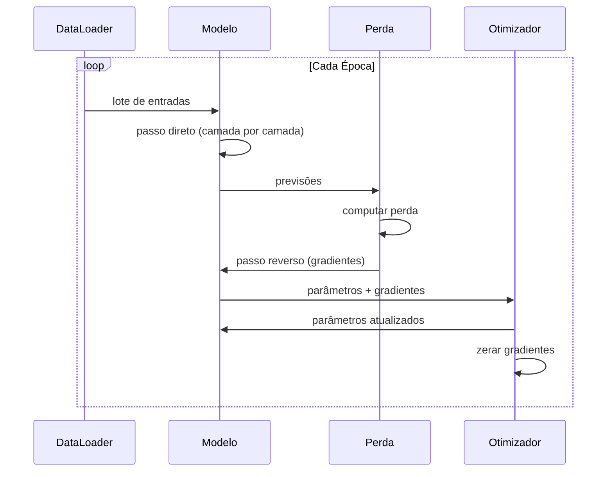
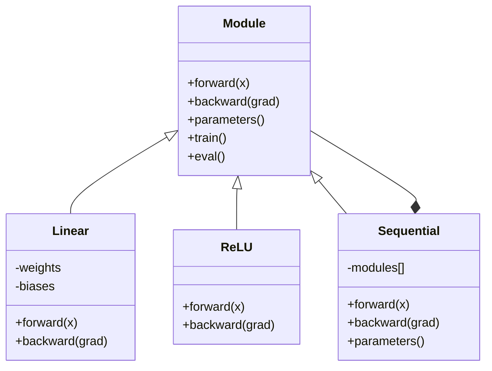

# Construa Seu Próprio Mini Framework

> Você construiu neurônios, camadas, redes, retropropagação, ativações, funções de perda, otimizadores, regularização, inicialização e agendamentos de LR. Tudo como peças separadas. Agora conecte tudo num framework. Não PyTorch. Não TensorFlow. O seu.

**Tipo:** Construção
**Linguagens:** Python
**Pré-requisitos:** Toda a Fase 03 (Aulas 01-09)
**Tempo:** ~120 minutos

## Objetivos de Aprendizado

- Construir um framework completo de deep learning (~500 linhas) com Module, Linear, ReLU, Sigmoid, Dropout, BatchNorm, Sequential, funções de perda, otimizadores e DataLoader
- Explicar a abstração Module (forward, backward, parameters) e por que alternar modo treino/eval é necessário
- Conectar todos os componentes num loop de treino funcional que treina uma rede de 4 camadas na classificação de círculo
- Mapear cada componente do seu framework pro equivalente no PyTorch (nn.Module, nn.Sequential, optim.Adam, DataLoader)

## O Problema

Você tem dez aulas de blocos espalhados em arquivos separados. Uma classe `Value` aqui, um loop de treino lá, inicialização de pesos em outro arquivo, agendamentos de taxa em mais outro. Pra treinar uma rede, você copia e cola de cinco aulas diferentes e conecta na mão.

Isso é o que frameworks resolvem. PyTorch dá `nn.Module`, `nn.Sequential`, `optim.Adam`, `DataLoader` e um padrão de loop de treino que amarra tudo. TensorFlow dá `keras.Layer`, `keras.Sequential`, `keras.optimizers.Adam`. Não é magia. São padrões organizacionais que tornam possível definir, treinar e avaliar redes sem reinventar a infraestrutura toda vez.

Você vai construir a mesma coisa em ~500 linhas de Python. Sem numpy. Sem dependências externas. Um framework que pode definir qualquer rede feedforward, treinar com SGD ou Adam, dividir dados em lotes, aplicar dropout e batch normalization, usar qualquer ativação e agendar a taxa de aprendizado.

Quando terminar, você vai entender exatamente o que acontece quando escreve `model = nn.Sequential(...)` no PyTorch. Você vai entender por que `model.train()` e `model.eval()` existem. Você vai entender por que `optimizer.zero_grad()` é uma chamada separada. Você vai entender tudo, porque construiu tudo.

## O Conceito

### A Abstração Module

Cada camada no PyTorch herda de `nn.Module`. Um Module tem três responsabilidades:

1. **forward()** — computar a saída dado as entradas
2. **parameters()** — retornar todos os pesos treináveis
3. **backward()** — computar gradientes (tratado por autograd no PyTorch, explícito no nosso)

Uma camada Linear é um Module. Uma ativação ReLU é um Module. Uma camada dropout é um Module. Uma camada de batch normalization é um Module. Todos têm a mesma interface.

### Contêiner Sequential

`nn.Sequential` encadeia Modules. Passo direto: alimenta dados pelo Module 1, depois 2, depois 3. Passo reverso: inverte a cadeia. O contêiner em si é um Module — tem forward(), parameters() e backward(). Este é o padrão composto: uma sequência de Modules é ela própria um Module.

### Modo Treino vs Avaliação

Dropout aleatoriamente zera neurônios durante treino mas passa tudo durante avaliação. Batch normalization usa estatísticas do lote durante treino mas médias móveis durante avaliação. Os métodos `train()` e `eval()` alternam esse comportamento. Todo Module tem uma flag `training`.

### Otimizador

O otimizador atualiza parâmetros usando seus gradientes. SGD: `param -= lr * grad`. Adam: mantém estimativas de momentum e variância, depois atualiza. O otimizador não sabe sobre a arquitetura da rede — só vê uma lista plana de parâmetros e seus gradientes.

### DataLoader

Dividir em lotes importa por duas razões. Primeiro, você não consegue colocar o dataset inteiro na memória pra problemas grandes. Segundo, a descida de gradiente por mini-lotes fornece ruído que ajuda a escapar de mínimos locais. O DataLoader divide dados em lotes e opcionalmente embaralha entre épocas.

### Arquitetura do Framework



### Loop de Treino



### Hierarquia de Module



## Construa

### Passo 1: Classe Base Module

A interface abstrata que toda camada implementa.

```python
class Module:
    def __init__(self):
        self.training = True

    def forward(self, x):
        raise NotImplementedError

    def backward(self, grad):
        raise NotImplementedError

    def parameters(self):
        return []

    def train(self):
        self.training = True

    def eval(self):
        self.training = False
```

### Passo 2: Camada Linear

O bloco fundamental. Armazena pesos e biases, computa Wx + b no forward, e gradientes de peso/entrada no backward.

```python
import math
import random


class Linear(Module):
    def __init__(self, fan_in, fan_out):
        super().__init__()
        std = math.sqrt(2.0 / fan_in)
        self.weights = [[random.gauss(0, std) for _ in range(fan_in)] for _ in range(fan_out)]
        self.biases = [0.0] * fan_out
        self.weight_grads = [[0.0] * fan_in for _ in range(fan_out)]
        self.bias_grads = [0.0] * fan_out
        self.fan_in = fan_in
        self.fan_out = fan_out
        self.input = None

    def forward(self, x):
        self.input = x
        output = []
        for i in range(self.fan_out):
            val = self.biases[i]
            for j in range(self.fan_in):
                val += self.weights[i][j] * x[j]
            output.append(val)
        return output

    def backward(self, grad):
        input_grad = [0.0] * self.fan_in
        for i in range(self.fan_out):
            self.bias_grads[i] += grad[i]
            for j in range(self.fan_in):
                self.weight_grads[i][j] += grad[i] * self.input[j]
                input_grad[j] += grad[i] * self.weights[i][j]
        return input_grad

    def parameters(self):
        params = []
        for i in range(self.fan_out):
            for j in range(self.fan_in):
                params.append((self.weights, i, j, self.weight_grads))
            params.append((self.biases, i, None, self.bias_grads))
        return params
```

### Passo 3: Módulos de Ativação

ReLU, Sigmoid e Tanh como Modules. Cada um armazena em cache o que precisa pro backward.

```python
class ReLU(Module):
    def __init__(self):
        super().__init__()
        self.mask = None

    def forward(self, x):
        self.mask = [1.0 if v > 0 else 0.0 for v in x]
        return [max(0.0, v) for v in x]

    def backward(self, grad):
        return [g * m for g, m in zip(grad, self.mask)]


class Sigmoid(Module):
    def __init__(self):
        super().__init__()
        self.output = None

    def forward(self, x):
        self.output = []
        for v in x:
            v = max(-500, min(500, v))
            self.output.append(1.0 / (1.0 + math.exp(-v)))
        return self.output

    def backward(self, grad):
        return [g * o * (1 - o) for g, o in zip(grad, self.output)]


class Tanh(Module):
    def __init__(self):
        super().__init__()
        self.output = None

    def forward(self, x):
        self.output = [math.tanh(v) for v in x]
        return self.output

    def backward(self, grad):
        return [g * (1 - o * o) for g, o in zip(grad, self.output)]
```

### Passo 4: Módulo Dropout

Aleatoriamente zera elementos durante treino. Escala os elementos restantes por 1/(1-p) pra que os valores esperados permaneçam os mesmos. Não faz nada durante eval.

```python
class Dropout(Module):
    def __init__(self, p=0.5):
        super().__init__()
        self.p = p
        self.mask = None

    def forward(self, x):
        if not self.training:
            return x
        self.mask = [0.0 if random.random() < self.p else 1.0 / (1 - self.p) for _ in x]
        return [v * m for v, m in zip(x, self.mask)]

    def backward(self, grad):
        if self.mask is None:
            return grad
        return [g * m for g, m in zip(grad, self.mask)]
```

### Passo 5: Módulo BatchNorm

Normaliza ativações pra média zero e variância unitária por feature através do lote. Mantém estatísticas móveis pro modo eval.

```python
class BatchNorm(Module):
    def __init__(self, size, momentum=0.1, eps=1e-5):
        super().__init__()
        self.size = size
        self.gamma = [1.0] * size
        self.beta = [0.0] * size
        self.gamma_grads = [0.0] * size
        self.beta_grads = [0.0] * size
        self.running_mean = [0.0] * size
        self.running_var = [1.0] * size
        self.momentum = momentum
        self.eps = eps
        self.x_norm = None
        self.std_inv = None
        self.batch_input = None

    def forward_batch(self, batch):
        batch_size = len(batch)
        output_batch = []

        if self.training:
            mean = [0.0] * self.size
            for sample in batch:
                for j in range(self.size):
                    mean[j] += sample[j]
            mean = [m / batch_size for m in mean]

            var = [0.0] * self.size
            for sample in batch:
                for j in range(self.size):
                    var[j] += (sample[j] - mean[j]) ** 2
            var = [v / batch_size for v in var]

            self.std_inv = [1.0 / math.sqrt(v + self.eps) for v in var]

            self.x_norm = []
            self.batch_input = batch
            for sample in batch:
                normed = [(sample[j] - mean[j]) * self.std_inv[j] for j in range(self.size)]
                self.x_norm.append(normed)
                output = [self.gamma[j] * normed[j] + self.beta[j] for j in range(self.size)]
                output_batch.append(output)

            for j in range(self.size):
                self.running_mean[j] = (1 - self.momentum) * self.running_mean[j] + self.momentum * mean[j]
                self.running_var[j] = (1 - self.momentum) * self.running_var[j] + self.momentum * var[j]
        else:
            std_inv = [1.0 / math.sqrt(v + self.eps) for v in self.running_var]
            for sample in batch:
                normed = [(sample[j] - self.running_mean[j]) * std_inv[j] for j in range(self.size)]
                output = [self.gamma[j] * normed[j] + self.beta[j] for j in range(self.size)]
                output_batch.append(output)

        return output_batch

    def forward(self, x):
        result = self.forward_batch([x])
        return result[0]

    def backward(self, grad):
        if self.x_norm is None:
            return grad
        for j in range(self.size):
            self.gamma_grads[j] += self.x_norm[0][j] * grad[j]
            self.beta_grads[j] += grad[j]
        return [grad[j] * self.gamma[j] * self.std_inv[j] for j in range(self.size)]

    def parameters(self):
        params = []
        for j in range(self.size):
            params.append((self.gamma, j, None, self.gamma_grads))
            params.append((self.beta, j, None, self.beta_grads))
        return params
```

### Passo 6: Contêiner Sequential

Encadeia módulos. Forward vai da esquerda pra direita, backward vai da direita pra esquerda.

```python
class Sequential(Module):
    def __init__(self, *modules):
        super().__init__()
        self.modules = list(modules)

    def forward(self, x):
        for module in self.modules:
            x = module.forward(x)
        return x

    def backward(self, grad):
        for module in reversed(self.modules):
            grad = module.backward(grad)
        return grad

    def parameters(self):
        params = []
        for module in self.modules:
            params.extend(module.parameters())
        return params

    def train(self):
        self.training = True
        for module in self.modules:
            module.train()

    def eval(self):
        self.training = False
        for module in self.modules:
            module.eval()
```

### Passo 7: Funções de Perda

MSE e Entropia Cruzada Binária. Cada uma retorna o valor da perda e fornece um backward() que retorna o gradiente.

```python
class MSELoss:
    def __call__(self, predicted, target):
        self.predicted = predicted
        self.target = target
        n = len(predicted)
        self.loss = sum((p - t) ** 2 for p, t in zip(predicted, target)) / n
        return self.loss

    def backward(self):
        n = len(self.predicted)
        return [2 * (p - t) / n for p, t in zip(self.predicted, self.target)]


class BCELoss:
    def __call__(self, predicted, target):
        self.predicted = predicted
        self.target = target
        eps = 1e-7
        n = len(predicted)
        self.loss = 0
        for p, t in zip(predicted, target):
            p = max(eps, min(1 - eps, p))
            self.loss += -(t * math.log(p) + (1 - t) * math.log(1 - p))
        self.loss /= n
        return self.loss

    def backward(self):
        eps = 1e-7
        n = len(self.predicted)
        grads = []
        for p, t in zip(self.predicted, self.target):
            p = max(eps, min(1 - eps, p))
            grads.append((-t / p + (1 - t) / (1 - p)) / n)
        return grads
```

### Passo 8: Otimizadores SGD e Adam

Ambos recebem uma lista de parâmetros e atualizam pesos usando gradientes.

```python
class SGD:
    def __init__(self, parameters, lr=0.01):
        self.params = parameters
        self.lr = lr

    def step(self):
        for container, i, j, grad_container in self.params:
            if j is not None:
                container[i][j] -= self.lr * grad_container[i][j]
            else:
                container[i] -= self.lr * grad_container[i]

    def zero_grad(self):
        for container, i, j, grad_container in self.params:
            if j is not None:
                grad_container[i][j] = 0.0
            else:
                grad_container[i] = 0.0


class Adam:
    def __init__(self, parameters, lr=0.001, beta1=0.9, beta2=0.999, eps=1e-8):
        self.params = parameters
        self.lr = lr
        self.beta1 = beta1
        self.beta2 = beta2
        self.eps = eps
        self.t = 0
        self.m = [0.0] * len(parameters)
        self.v = [0.0] * len(parameters)

    def step(self):
        self.t += 1
        for idx, (container, i, j, grad_container) in enumerate(self.params):
            if j is not None:
                g = grad_container[i][j]
            else:
                g = grad_container[i]

            self.m[idx] = self.beta1 * self.m[idx] + (1 - self.beta1) * g
            self.v[idx] = self.beta2 * self.v[idx] + (1 - self.beta2) * g * g

            m_hat = self.m[idx] / (1 - self.beta1 ** self.t)
            v_hat = self.v[idx] / (1 - self.beta2 ** self.t)

            update = self.lr * m_hat / (math.sqrt(v_hat) + self.eps)

            if j is not None:
                container[i][j] -= update
            else:
                container[i] -= update

    def zero_grad(self):
        for container, i, j, grad_container in self.params:
            if j is not None:
                grad_container[i][j] = 0.0
            else:
                grad_container[i] = 0.0
```

### Passo 9: DataLoader

Divide dados em lotes, opcionalmente embaralha a cada época.

```python
class DataLoader:
    def __init__(self, data, batch_size=32, shuffle=True):
        self.data = data
        self.batch_size = batch_size
        self.shuffle = shuffle

    def __iter__(self):
        indices = list(range(len(self.data)))
        if self.shuffle:
            random.shuffle(indices)
        for start in range(0, len(indices), self.batch_size):
            batch_indices = indices[start:start + self.batch_size]
            batch = [self.data[i] for i in batch_indices]
            inputs = [item[0] for item in batch]
            targets = [item[1] for item in batch]
            yield inputs, targets

    def __len__(self):
        return (len(self.data) + self.batch_size - 1) // self.batch_size
```

### Passo 10: Treine uma Rede de 4 Camadas na Classificação de Círculo

Conecte tudo. Defina um modelo, escolha uma perda, escolha um otimizador, execute o loop de treino.

```python
def make_circle_data(n=500, seed=42):
    random.seed(seed)
    data = []
    for _ in range(n):
        x = random.uniform(-2, 2)
        y = random.uniform(-2, 2)
        label = 1.0 if x * x + y * y < 1.5 else 0.0
        data.append(([x, y], [label]))
    return data


def train():
    random.seed(42)

    model = Sequential(
        Linear(2, 16),
        ReLU(),
        Linear(16, 16),
        ReLU(),
        Linear(16, 8),
        ReLU(),
        Linear(8, 1),
        Sigmoid(),
    )

    criterion = BCELoss()
    optimizer = Adam(model.parameters(), lr=0.01)

    data = make_circle_data(500)
    split = int(len(data) * 0.8)
    train_data = data[:split]
    test_data = data[split:]

    loader = DataLoader(train_data, batch_size=16, shuffle=True)

    model.train()

    for epoch in range(100):
        total_loss = 0
        total_correct = 0
        total_samples = 0

        for batch_inputs, batch_targets in loader:
            batch_loss = 0
            for x, t in zip(batch_inputs, batch_targets):
                pred = model.forward(x)
                loss = criterion(pred, t)
                batch_loss += loss

                optimizer.zero_grad()
                grad = criterion.backward()
                model.backward(grad)
                optimizer.step()

                predicted_class = 1.0 if pred[0] >= 0.5 else 0.0
                if predicted_class == t[0]:
                    total_correct += 1
                total_samples += 1

            total_loss += batch_loss

        avg_loss = total_loss / total_samples
        accuracy = total_correct / total_samples * 100

        if epoch % 10 == 0 or epoch == 99:
            print(f"Epoch {epoch:3d} | Loss: {avg_loss:.6f} | Train Accuracy: {accuracy:.1f}%")

    model.eval()
    correct = 0
    for x, t in test_data:
        pred = model.forward(x)
        predicted_class = 1.0 if pred[0] >= 0.5 else 0.0
        if predicted_class == t[0]:
            correct += 1
    test_accuracy = correct / len(test_data) * 100
    print(f"\nTest Accuracy: {test_accuracy:.1f}% ({correct}/{len(test_data)})")

    return model, test_accuracy
```

## Use

Aqui está o equivalente PyTorch do que você acabou de construir:

```python
import torch
import torch.nn as nn
from torch.utils.data import DataLoader, TensorDataset

model = nn.Sequential(
    nn.Linear(2, 16),
    nn.ReLU(),
    nn.Linear(16, 16),
    nn.ReLU(),
    nn.Linear(16, 8),
    nn.ReLU(),
    nn.Linear(8, 1),
    nn.Sigmoid(),
)

criterion = nn.BCELoss()
optimizer = torch.optim.Adam(model.parameters(), lr=0.01)

for epoch in range(100):
    model.train()
    for inputs, targets in dataloader:
        optimizer.zero_grad()
        predictions = model(inputs)
        loss = criterion(predictions, targets)
        loss.backward()
        optimizer.step()

    model.eval()
    with torch.no_grad():
        test_predictions = model(test_inputs)
```

A estrutura é idêntica. `Sequential`, `Linear`, `ReLU`, `Sigmoid`, `BCELoss`, `Adam`, `zero_grad`, `backward`, `step`, `train`, `eval`. Todo conceito mapeia um-para-um. A diferença é que PyTorch lida com autograd automaticamente (não precisa implementar backward() em cada módulo), roda em GPU e foi otimizado por anos. Mas os ossos são os mesmos.

Agora quando você vir código PyTorch, sabe exatamente o que está acontecendo em cada linha. Esse entendimento é o ponto principal.

## Entregue

Esta aula produz:
- `outputs/prompt-framework-architect.md` — um prompt pra projetar arquiteturas de redes neurais usando abstrações de framework

## Exercícios

1. Adicione uma classe `SoftmaxCrossEntropyLoss` para classificação multiclasse. Faça softmax das previsões, compute entropia cruzada e lide com o backward combinado. Teste num dataset espiral de 3 classes.

2. Implemente agendamento de taxa de aprendizado no otimizador: adicione um método `set_lr()` e conecte o agendamento cosine da Aula 09. Treine o classificador de círculo com warmup + cosine e compare com LR constante.

3. Adicione métodos `save()` e `load()` ao Sequential que serializam todos os pesos pra um arquivo JSON e carregam de volta. Verifique que um modelo carregado produz as mesmas previsões que o original.

4. Implemente weight decay (regularização L2) no otimizador Adam. Adicione um parâmetro `weight_decay` que encolhe pesos em direção a zero a cada passo. Compare treino com decay=0 vs decay=0.01.

5. Substitua o loop de treino por amostra por acumulação adequada de gradiente em mini-lote: acumule gradientes através de todas as amostras num lote, depois divida pelo tamanho do lote e dê um passo do otimizador. Meça se isso muda a velocidade de convergência.

## Termos-chave

| Termo | O que o pessoal diz | O que realmente significa |
|-------|---------------------|--------------------------|
| Module | "Uma camada" | A abstração base num framework — qualquer coisa com forward(), backward() e parameters() |
| Sequential | "Empilhar camadas em ordem" | Um contêiner que encadeia módulos, aplicando-os em sequência no forward e reverso no backward |
| Passo direto | "Executar a rede" | Computar a saída passando entrada por cada módulo em ordem |
| Passo reverso | "Computar gradientes" | Propagar o gradiente da perda através de cada módulo ao contrário pra computar gradientes dos parâmetros |
| Parâmetros | "Os pesos treináveis" | Todos valores na rede que o otimizador pode atualizar — pesos e biases |
| Otimizador | "A coisa que atualiza pesos" | Um algoritmo que usa gradientes pra atualizar parâmetros, implementando SGD, Adam ou outras regras |
| DataLoader | "A coisa que alimenta dados" | Um iterador que divide um dataset em lotes, opcionalmente embaralhando entre épocas |
| Modo treino | "model.train()" | Uma flag que ativa comportamento estocástico como dropout e batch normalization com estatísticas do lote |
| Modo avaliação | "model.eval()" | Uma flag que desativa dropout e usa estatísticas móveis pra batch normalization |
| Zero grad | "Limpar gradientes" | Resetar todos gradientes de parâmetros pra zero antes de computar os gradientes do próximo lote |

## Leitura Adicional

- Paszke et al., "PyTorch: An Imperative Style, High-Performance Deep Learning Library" (2019) — o paper descrevendo as decisões de design do PyTorch
- Chollet, "Deep Learning with Python, Second Edition" (2021) — Capítulo 3 cobre internos do Keras com a mesma abstração módulo/camada
- Johnson, "Tiny-DNN" (https://github.com/tiny-dnn/tiny-dnn) — um framework de deep learning C++ header-only pra entender internos de framework
