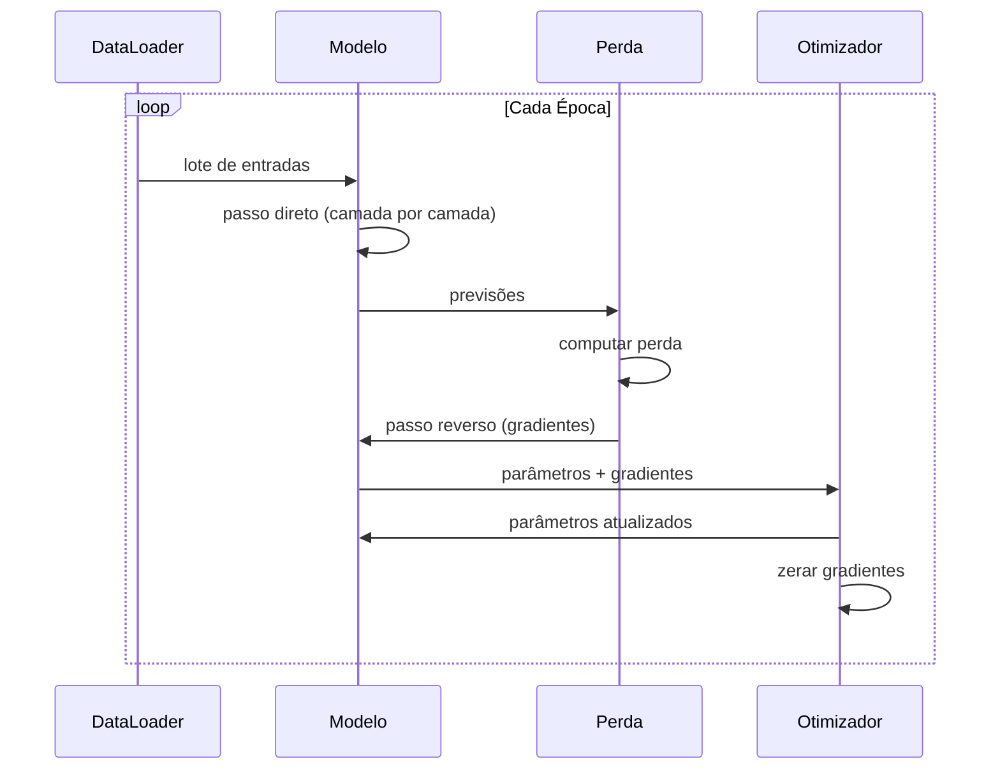

# Construa Seu Próprio Mini Framework

> Você construiu neurônios, camadas, redes, retropropagação, ativações, funções de perda, otimizadores, regularização, inicialização e agendamentos de LR. Tudo como peças separadas. Agora conecte tudo num framework. Não PyTorch. Não TensorFlow. O seu.

**Tipo:** Construção
**Linguagens:** Python
**Pré-requisitos:** Toda a Fase 03 (Aulas 01-09)
**Tempo:** ~120 minutos

## Objetivos de Aprendizado

- Construir um framework completo de deep learning (~500 linhas) com Module, Linear, ReLU, Sigmoid, Dropout, BatchNorm, Sequential, funções de perda, otimizadores e DataLoader
- Explicar a abstração Module (forward, backward, parameters) e por que alternar modo treino/eval é necessário
- Conectar todos os componentes num loop de treino funcional que treina uma rede de 4 camadas na classificação de círculo
- Mapear cada componente do seu framework pro equivalente no PyTorch (nn.Module, nn.Sequential, optim.Adam, DataLoader)

## O Problema

Você tem dez aulas de blocos espalhados em arquivos separados. Uma classe `Value` aqui, um loop de treino lá, inicialização de pesos em outro arquivo, agendamentos de taxa em mais outro. Pra treinar uma rede, você copia e cola de cinco aulas diferentes e conecta na mão.

Frameworks resolvem isso. PyTorch dá `nn.Module`, `nn.Sequential`, `optim.Adam`, `DataLoader` e um padrão de loop de treino que amarra tudo. TensorFlow dá `keras.Layer`, `keras.Sequential`, `keras.optimizers.Adam`. Não é magia. São padrões organizacionais que tornam possível definir, treinar e avaliar redes sem reinventar a infraestrutura toda vez.

Você vai construir a mesma coisa em ~500 linhas de Python. Sem numpy. Sem dependências externas.

## O Conceito

### A Abstração Module

Cada camada no PyTorch herda de `nn.Module`. Um Module tem três responsabilidades:

1. **forward()** — computar a saída dado as entradas
2. **parameters()** — retornar todos os pesos treináveis
3. **backward()** — computar gradientes (tratado por autograd no PyTorch, explícito no nosso)

### Contêiner Sequential

`nn.Sequential` encadeia Modules. Passo direto: alimenta dados pelo Module 1, depois 2, depois 3. Passo reverso: inverte a cadeia.

### Modo Treino vs Avaliação

Dropout aleatoriamente zera neurônios durante treino mas passa tudo durante avaliação. Batch normalization usa estatísticas do lote durante treino mas médias móveis durante avaliação. `train()` e `eval()` alternam esse comportamento.

### Loop de Treino



## Construa

### Passo 1: Classe Base Module

```python
class Module:
    def __init__(self):
        self.training = True

    def forward(self, x):
        raise NotImplementedError

    def backward(self, grad):
        raise NotImplementedError

    def parameters(self):
        return []

    def train(self):
        self.training = True

    def eval(self):
        self.training = False
```

### Passo 2: Camada Linear

```python
import math
import random


class Linear(Module):
    def __init__(self, fan_in, fan_out):
        super().__init__()
        std = math.sqrt(2.0 / fan_in)
        self.weights = [[random.gauss(0, std) for _ in range(fan_in)] for _ in range(fan_out)]
        self.biases = [0.0] * fan_out
        self.weight_grads = [[0.0] * fan_in for _ in range(fan_out)]
        self.bias_grads = [0.0] * fan_out
        self.fan_in = fan_in
        self.fan_out = fan_out
        self.input = None

    def forward(self, x):
        self.input = x
        output = []
        for i in range(self.fan_out):
            val = self.biases[i]
            for j in range(self.fan_in):
                val += self.weights[i][j] * x[j]
            output.append(val)
        return output

    def backward(self, grad):
        input_grad = [0.0] * self.fan_in
        for i in range(self.fan_out):
            self.bias_grads[i] += grad[i]
            for j in range(self.fan_in):
                self.weight_grads[i][j] += grad[i] * self.input[j]
                input_grad[j] += grad[i] * self.weights[i][j]
        return input_grad

    def parameters(self):
        params = []
        for i in range(self.fan_out):
            for j in range(self.fan_in):
                params.append((self.weights, i, j, self.weight_grads))
            params.append((self.biases, i, None, self.bias_grads))
        return params
```

### Passo 3: Módulos de Ativação

```python
class ReLU(Module):
    def __init__(self):
        super().__init__()
        self.mask = None

    def forward(self, x):
        self.mask = [1.0 if v > 0 else 0.0 for v in x]
        return [max(0.0, v) for v in x]

    def backward(self, grad):
        return [g * m for g, m in zip(grad, self.mask)]


class Sigmoid(Module):
    def __init__(self):
        super().__init__()
        self.output = None

    def forward(self, x):
        self.output = []
        for v in x:
            v = max(-500, min(500, v))
            self.output.append(1.0 / (1.0 + math.exp(-v)))
        return self.output

    def backward(self, grad):
        return [g * o * (1 - o) for g, o in zip(grad, self.output)]


class Tanh(Module):
    def __init__(self):
        super().__init__()
        self.output = None

    def forward(self, x):
        self.output = [math.tanh(v) for v in x]
        return self.output

    def backward(self, grad):
        return [g * (1 - o * o) for g, o in zip(grad, self.output)]
```

### Passo 4: Módulo Dropout

```python
class Dropout(Module):
    def __init__(self, p=0.5):
        super().__init__()
        self.p = p
        self.mask = None

    def forward(self, x):
        if not self.training:
            return x
        self.mask = [0.0 if random.random() < self.p else 1.0 / (1 - self.p) for _ in x]
        return [v * m for v, m in zip(x, self.mask)]

    def backward(self, grad):
        if self.mask is None:
            return grad
        return [g * m for g, m in zip(grad, self.mask)]
```

### Passo 5: Módulo BatchNorm

```python
class BatchNorm(Module):
    def __init__(self, size, momentum=0.1, eps=1e-5):
        super().__init__()
        self.size = size
        self.gamma = [1.0] * size
        self.beta = [0.0] * size
        self.gamma_grads = [0.0] * size
        self.beta_grads = [0.0] * size
        self.running_mean = [0.0] * size
        self.running_var = [1.0] * size
        self.momentum = momentum
        self.eps = eps
        self.x_norm = None
        self.std_inv = None
        self.batch_input = None

    def forward_batch(self, batch):
        batch_size = len(batch)
        output_batch = []

        if self.training:
            mean = [0.0] * self.size
            for sample in batch:
                for j in range(self.size):
                    mean[j] += sample[j]
            mean = [m / batch_size for m in mean]

            var = [0.0] * self.size
            for sample in batch:
                for j in range(self.size):
                    var[j] += (sample[j] - mean[j]) ** 2
            var = [v / batch_size for v in var]

            self.std_inv = [1.0 / math.sqrt(v + self.eps) for v in var]

            self.x_norm = []
            self.batch_input = batch
            for sample in batch:
                normed = [(sample[j] - mean[j]) * self.std_inv[j] for j in range(self.size)]
                self.x_norm.append(normed)
                output = [self.gamma[j] * normed[j] + self.beta[j] for j in range(self.size)]
                output_batch.append(output)

            for j in range(self.size):
                self.running_mean[j] = (1 - self.momentum) * self.running_mean[j] + self.momentum * mean[j]
                self.running_var[j] = (1 - self.momentum) * self.running_var[j] + self.momentum * var[j]
        else:
            std_inv = [1.0 / math.sqrt(v + self.eps) for v in self.running_var]
            for sample in batch:
                normed = [(sample[j] - self.running_mean[j]) * std_inv[j] for j in range(self.size)]
                output = [self.gamma[j] * normed[j] + self.beta[j] for j in range(self.size)]
                output_batch.append(output)

        return output_batch

    def forward(self, x):
        result = self.forward_batch([x])
        return result[0]

    def backward(self, grad):
        if self.x_norm is None:
            return grad
        for j in range(self.size):
            self.gamma_grads[j] += self.x_norm[0][j] * grad[j]
            self.beta_grads[j] += grad[j]
        return [grad[j] * self.gamma[j] * self.std_inv[j] for j in range(self.size)]

    def parameters(self):
        params = []
        for j in range(self.size):
            params.append((self.gamma, j, None, self.gamma_grads))
            params.append((self.beta, j, None, self.beta_grads))
        return params
```

### Passo 6: Contêiner Sequential

```python
class Sequential(Module):
    def __init__(self, *modules):
        super().__init__()
        self.modules = list(modules)

    def forward(self, x):
        for module in self.modules:
            x = module.forward(x)
        return x

    def backward(self, grad):
        for module in reversed(self.modules):
            grad = module.backward(grad)
        return grad

    def parameters(self):
        params = []
        for module in self.modules:
            params.extend(module.parameters())
        return params

    def train(self):
        self.training = True
        for module in self.modules:
            module.train()

    def eval(self):
        self.training = False
        for module in self.modules:
            module.eval()
```

### Passo 7: Funções de Perda

```python
class MSELoss:
    def __call__(self, predicted, target):
        self.predicted = predicted
        self.target = target
        n = len(predicted)
        self.loss = sum((p - t) ** 2 for p, t in zip(predicted, target)) / n
        return self.loss

    def backward(self):
        n = len(self.predicted)
        return [2 * (p - t) / n for p, t in zip(self.predicted, self.target)]


class BCELoss:
    def __call__(self, predicted, target):
        self.predicted = predicted
        self.target = target
        eps = 1e-7
        n = len(predicted)
        self.loss = 0
        for p, t in zip(predicted, target):
            p = max(eps, min(1 - eps, p))
            self.loss += -(t * math.log(p) + (1 - t) * math.log(1 - p))
        self.loss /= n
        return self.loss

    def backward(self):
        eps = 1e-7
        n = len(self.predicted)
        grads = []
        for p, t in zip(self.predicted, self.target):
            p = max(eps, min(1 - eps, p))
            grads.append((-t / p + (1 - t) / (1 - p)) / n)
        return grads
```

### Passo 8: Otimizadores SGD e Adam

```python
class SGD:
    def __init__(self, parameters, lr=0.01):
        self.params = parameters
        self.lr = lr

    def step(self):
        for container, i, j, grad_container in self.params:
            if j is not None:
                container[i][j] -= self.lr * grad_container[i][j]
            else:
                container[i] -= self.lr * grad_container[i]

    def zero_grad(self):
        for container, i, j, grad_container in self.params:
            if j is not None:
                grad_container[i][j] = 0.0
            else:
                grad_container[i] = 0.0


class Adam:
    def __init__(self, parameters, lr=0.001, beta1=0.9, beta2=0.999, eps=1e-8):
        self.params = parameters
        self.lr = lr
        self.beta1 = beta1
        self.beta2 = beta2
        self.eps = eps
        self.t = 0
        self.m = [0.0] * len(parameters)
        self.v = [0.0] * len(parameters)

    def step(self):
        self.t += 1
        for idx, (container, i, j, grad_container) in enumerate(self.params):
            if j is not None:
                g = grad_container[i][j]
            else:
                g = grad_container[i]

            self.m[idx] = self.beta1 * self.m[idx] + (1 - self.beta1) * g
            self.v[idx] = self.beta2 * self.v[idx] + (1 - self.beta2) * g * g

            m_hat = self.m[idx] / (1 - self.beta1 ** self.t)
            v_hat = self.v[idx] / (1 - self.beta2 ** self.t)

            update = self.lr * m_hat / (math.sqrt(v_hat) + self.eps)
            if j is not None:
                container[i][j] -= update
            else:
                container[i] -= update

    def zero_grad(self):
        for container, i, j, grad_container in self.params:
            if j is not None:
                grad_container[i][j] = 0.0
            else:
                grad_container[i] = 0.0
```

### Passo 9: DataLoader

```python
class DataLoader:
    def __init__(self, data, batch_size=32, shuffle=True):
        self.data = data
        self.batch_size = batch_size
        self.shuffle = shuffle

    def __iter__(self):
        indices = list(range(len(self.data)))
        if self.shuffle:
            random.shuffle(indices)
        for i in range(0, len(indices), self.batch_size):
            batch_indices = indices[i:i + self.batch_size]
            batch = [self.data[j] for j in batch_indices]
            inputs = [item[0] for item in batch]
            targets = [item[1] for item in batch]
            yield inputs, targets

    def __len__(self):
        return (len(self.data) + self.batch_size - 1) // self.batch_size
```

### Passo 10: Loop de Treino Completo

```python
import random
import math

random.seed(42)

def make_circle_data(n=200):
    data = []
    for _ in range(n):
        x = random.uniform(-2, 2)
        y = random.uniform(-2, 2)
        label = [1.0] if x * x + y * y < 1.5 else [0.0]
        data.append(([x, y], label))
    return data

train_data = make_circle_data(200)
test_data = make_circle_data(100)

model = Sequential(
    Linear(2, 16),
    ReLU(),
    Dropout(0.1),
    Linear(16, 8),
    ReLU(),
    Linear(8, 1),
    Sigmoid(),
)

criterion = BCELoss()
optimizer = Adam(model.parameters(), lr=0.01)
loader = DataLoader(train_data, batch_size=32, shuffle=True)

for epoch in range(200):
    total_loss = 0.0
    correct = 0
    model.train()
    for inputs_batch, targets_batch in loader:
        optimizer.zero_grad()
        batch_loss = 0.0
        for x, y in zip(inputs_batch, targets_batch):
            pred = model.forward(x)
            loss = criterion(pred, y)
            batch_loss += loss
        batch_loss.backward()
        optimizer.step()
        total_loss += batch_loss.loss

    model.eval()
    test_correct = 0
    for x, y in test_data:
        pred = model.forward(x)
        predicted = 1 if pred[0] >= 0.5 else 0
        if predicted == y[0]:
            test_correct += 1

    if epoch % 25 == 0 or epoch == 199:
        train_acc = correct / len(train_data) * 100 if correct > 0 else 0
        test_acc = test_correct / len(test_data) * 100
        print(f"Epoch {epoch:3d}: loss={total_loss:.4f}, test_acc={test_acc:.1f}%")
```

## Entregue

Quando terminar, você vai entender exatamente o que acontece quando escreve `model = nn.Sequential(...)` no PyTorch. Por que `model.train()` e `model.eval()` existem. Por que `optimizer.zero_grad()` é uma chamada separada.

## Exercícios

1. Adicione um módulo `BatchNorm1d` que funcione com o DataLoader. Treine no círculo e compare com e sem batch norm.
2. Implemente gradient clipping no otimizador: antes de aplicar atualizações, corte a norma do gradiente pra no máximo 1.0.
3. Adicione suavização de rótulos à BCELoss: em vez de alvos [0, 1], use [0.05, 0.95].
4. Implemente aprendizado por lotes completos (sem DataLoader) e compare com mini-lotes de 32.
5. Construa uma rede de 3 camadas (784-256-128-10) pra MNIST usando seu framework e compare acurácia com a implementação PyTorch equivalente.
