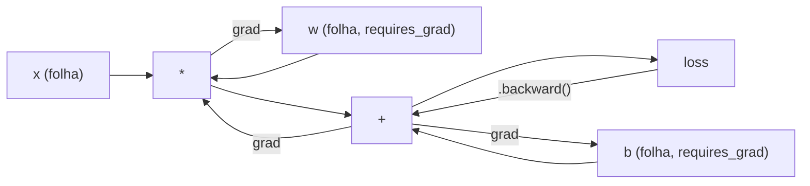
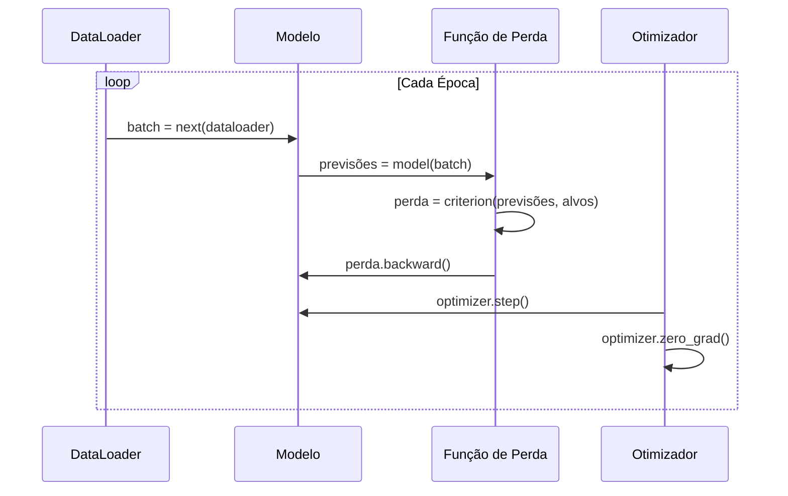

# Introdução ao PyTorch

> Você construiu o motor a partir de pistões e virabrequim. Agora aprenda o que todo mundo realmente dirige.

**Tipo:** Construção
**Linguagens:** Python
**Pré-requisitos:** Aula 03.10 (Construa Seu Próprio Mini Framework)
**Tempo:** ~75 minutos

## Objetivos de Aprendizado

- Construir e treinar redes neurais usando nn.Module, nn.Sequential e autograd do PyTorch
- Usar tensores do PyTorch, aceleração de GPU e o loop de treino padrão (zero_grad, forward, loss, backward, step)
- Converter componentes do seu mini framework do zero pros equivalentes do PyTorch
- Medir e comparar velocidade de treino entre seu framework puro-Python e PyTorch na mesma tarefa

## O Problema

Você tem um mini framework funcional. Camadas Lineares, ReLU, dropout, batch norm, Adam, um DataLoader, um loop de treino. Ele treina uma rede de 4 camadas num problema de classificação de círculo em Python puro.

Também é 500x mais lento que PyTorch no mesmo problema.

Seu mini framework processa uma amostra por vez com loops Python aninhados. PyTorch despacha as mesmas operações pra kernels C++/CUDA otimizados que rodam em GPU. Num único NVIDIA A100, PyTorch treina um ResNet-50 (25,6M de parâmetros) em ImageNet (1,28M imagens) em cerca de 6 horas. Seu framework levaria cerca de 3.000 horas na mesma tarefa — se não ficasse sem memória primeiro.

Velocidade não é a única lacuna. Seu framework não tem suporte a GPU. Sem diferenciação automática — você escreveu backward() manualmente pra cada módulo. Sem serialização. Sem treino distribuído. Sem precisão mista. Sem jeito de depurar fluxo de gradiente sem prints.

PyTorch preenche cada uma dessas lacunas. E faz isso mantendo o mesmo modelo mental que você já construiu: Module, forward(), parameters(), backward(), optimizer.step(). Os conceitos transferem um-para-um. A sintaxe é quase idêntica. A diferença é que PyTorch envolve uma década de engenharia de sistemas por trás da mesma interface que você projetou do zero.

## O Conceito

### Por que o PyTorch Venceu

Em 2015, TensorFlow exigia definir um grafo computacional estático antes de rodar qualquer coisa. Você construía o grafo, compilava, depois alimentava dados através dele. Debug significava encarar visualizações de grafo. Mudar a arquitetura significava reconstruir o grafo do zero.

PyTorch lançou em 2017 com uma filosofia diferente: execução ansiosa (eager execution). Você escreve Python. Roda imediatamente. `y = model(x)` realmente computa y agora, não "adiciona um nó a um grafo que vai computar y depois". Isso significava que ferramentas padrão de debug Python funcionavam. print() funcionava. pdb funcionava. if/else no seu forward pass funcionava.

Em 2020, o mercado falou. A fatia do PyTorch em papers de ML foi de 7% (2017) pra mais de 75% (2022). Meta, Google DeepMind, OpenAI, Anthropic e Hugging Face usam PyTorch como framework principal. TensorFlow 2.x adotou execução ansiosa em resposta — admissão tácita de que o design do PyTorch estava correto.

A lição: experiência do desenvolvedor se acumula. Um framework 10% mais lento mas 50% mais rápido de debugar vence toda vez.

### Tensores

Um tensor é um array multidimensional com três propriedades críticas: forma (shape), dtype e dispositivo (device).

```python
import torch

x = torch.zeros(3, 4)           # shape: (3, 4), dtype: float32, device: cpu
x = torch.randn(2, 3, 224, 224) # lote de 2 imagens RGB, 224x224
x = torch.tensor([1, 2, 3])     # de uma lista Python
```

**Shape** é a dimensionalidade. Um escalar é shape (), um vetor é (n,), uma matriz é (m, n), um lote de imagens é (batch, channels, height, width).

**Dtype** controla precisão e memória.

| dtype | Bits | Faixa | Uso |
|-------|------|-------|-----|
| float32 | 32 | ~7 dígitos decimais | Treino padrão |
| float16 | 16 | ~3.3 dígitos decimais | Precisão mista |
| bfloat16 | 16 | Mesma faixa que float32, menos precisão | Treino de LLM |
| int8 | 8 | -128 a 127 | Inferência quantizada |

**Device** determina onde a computação acontece.

```python
device = torch.device("cuda" if torch.cuda.is_available() else "cpu")
x = torch.randn(3, 4, device=device)
x = x.to("cuda")
x = x.cpu()
```

Toda operação requer todos tensores no mesmo device. Este é o erro #1 do PyTorch que iniciantes enfrentam: `RuntimeError: Expected all tensors to be on the same device`. Conserte movendo tudo pro mesmo device antes da computação.

**Reshape** é tempo constante — muda os metadados, não os dados.

```python
x = torch.randn(2, 3, 4)
x.view(2, 12)      # redimensionar pra (2, 12) — precisa ser contíguo
x.reshape(6, 4)    # redimensionar pra (6, 4) — funciona sempre
x.permute(2, 0, 1) # reordenar dimensões
x.unsqueeze(0)     # adicionar dimensão: (1, 2, 3, 4)
x.squeeze()        # remover dimensões de tamanho 1
```

### Autograd

Seu mini framework exigia implementar backward() pra cada módulo. PyTorch não. Ele registra cada operação em tensores num grafo acíclico direcionado (o grafo computacional) e depois percorre esse grafo ao contrário pra computar gradientes automaticamente.



A diferença chave do seu framework: PyTorch usa autodiff baseado em fita (tape). Toda operação é anexada a uma "fita" durante o passo direto. Chamar `.backward()` reproduz a fita ao contrário.

```python
x = torch.randn(3, requires_grad=True)
y = x ** 2 + 3 * x
z = y.sum()
z.backward()
print(x.grad)  # dz/dx = 2x + 3
```

Três regras do autograd:

1. Apenas tensores folha com `requires_grad=True` acumulam gradientes
2. Gradientes acumulam por padrão — chame `optimizer.zero_grad()` antes de cada backward
3. `torch.no_grad()` desabilita rastreamento de gradiente (use durante avaliação)

### nn.Module

`nn.Module` é a classe base pra todo componente de rede neural no PyTorch. Você já construiu essa abstração na Aula 10. A versão do PyTorch adiciona registro automático de parâmetros, descoberta recursiva de módulos, gerenciamento de dispositivo e serialização state dict.

```python
import torch.nn as nn

class MLP(nn.Module):
    def __init__(self, input_dim, hidden_dim, output_dim):
        super().__init__()
        self.layer1 = nn.Linear(input_dim, hidden_dim)
        self.relu = nn.ReLU()
        self.layer2 = nn.Linear(hidden_dim, output_dim)

    def forward(self, x):
        x = self.layer1(x)
        x = self.relu(x)
        x = self.layer2(x)
        return x
```

Quando você atribui um `nn.Module` ou `nn.Parameter` como atributo no `__init__`, PyTorch automaticamente o registra. `model.parameters()` coleta recursivamente todo parâmetro registrado. É por isso que você nunca precisa juntar pesos manualmente como fez no mini framework.

Blocos fundamentais:

| Módulo | O que faz | Parâmetros |
|--------|-----------|------------|
| nn.Linear(in, out) | Wx + b | in*out + out |
| nn.Conv2d(in_ch, out_ch, k) | Convolução 2D | in_ch*out_ch*k*k + out_ch |
| nn.BatchNorm1d(features) | Normalizar ativações | 2 * features |
| nn.Dropout(p) | Zeramento aleatório | 0 |
| nn.ReLU() | max(0, x) | 0 |
| nn.GELU() | Erro linear gaussiano | 0 |
| nn.Embedding(vocab, dim) | Tabela de lookup | vocab * dim |
| nn.LayerNorm(dim) | Normalização por amostra | 2 * dim |

### Funções de Perda e Otimizadores

PyTorch fornece versões prontas pra produção de tudo que você construiu.

**Funções de perda** (de `torch.nn`):

| Perda | Tarefa | Entrada |
|-------|--------|---------|
| nn.MSELoss() | Regressão | Qualquer forma |
| nn.CrossEntropyLoss() | Classificação multiclasse | Logits (não softmax) |
| nn.BCEWithLogitsLoss() | Classificação binária | Logits (não sigmoid) |
| nn.L1Loss() | Regressão (robusta) | Qualquer forma |
| nn.CTCLoss() | Alinhamento de sequência | Log probabilidades |

Nota: `CrossEntropyLoss` combina `LogSoftmax` + `NLLLoss` internamente. Passe logits crus, não saídas softmax. Este é um erro comum que produz gradientes errados silenciosamente.

**Otimizadores** (de `torch.optim`):

| Otimizador | Quando usar | LR típico |
|-----------|-------------|-----------|
| SGD(params, lr, momentum) | CNNs, pipelines bem ajustados | 0.01--0.1 |
| Adam(params, lr) | Ponto de partida padrão | 1e-3 |
| AdamW(params, lr, weight_decay) | Transformers, fine-tuning | 1e-4--1e-3 |
| LBFGS(params) | Pequena escala, segunda ordem | 1.0 |

### O Loop de Treino

Todo loop de treino do PyTorch segue o mesmo padrão de 5 passos. Você já conhece da Aula 10.



O padrão canônico:

```python
for epoch in range(num_epochs):
    model.train()
    for inputs, targets in train_loader:
        inputs, targets = inputs.to(device), targets.to(device)
        optimizer.zero_grad()
        outputs = model(inputs)
        loss = criterion(outputs, targets)
        loss.backward()
        optimizer.step()
```

Cinco linhas dentro do loop de batch. Cinco linhas que treinaram GPT-4, Stable Diffusion e LLaMA. A arquitetura muda. Os dados mudam. Essas cinco linhas não mudam.

### Dataset e DataLoader

O `Dataset` do PyTorch é uma classe abstrata com dois métodos: `__len__` e `__getitem__`. `DataLoader` a envolve com dividir em lotes, embaralhar e carregamento multi-processo.

```python
from torch.utils.data import Dataset, DataLoader

class MNISTDataset(Dataset):
    def __init__(self, images, labels):
        self.images = images
        self.labels = labels

    def __len__(self):
        return len(self.labels)

    def __getitem__(self, idx):
        return self.images[idx], self.labels[idx]

loader = DataLoader(dataset, batch_size=64, shuffle=True, num_workers=4)
```

`num_workers=4` spawns 4 processos pra carregar dados em paralelo enquanto a GPU treina no lote atual. Em workloads limitados por disco (imagens grandes, áudio), isso sozinho pode dobrar a velocidade de treino.

### Treino em GPU

Movendo um modelo pra GPU:

```python
device = torch.device("cuda" if torch.cuda.is_available() else "cpu")
model = model.to(device)
```

Isso move recursivamente todo parâmetro e buffer pra GPU. Depois mova cada lote durante treino:

```python
inputs, targets = inputs.to(device), targets.to(device)
```

**Precisão mista** reduz o uso de memória pela metade e dobra a vazão em GPUs modernas (A100, H100, RTX 4090) rodando forward/backward em float16 enquanto mantém os pesos mestre em float32:

```python
from torch.amp import autocast, GradScaler

scaler = GradScaler()
for inputs, targets in loader:
    with autocast(device_type="cuda"):
        outputs = model(inputs)
        loss = criterion(outputs, targets)
    scaler.scale(loss).backward()
    scaler.step(optimizer)
    scaler.update()
    optimizer.zero_grad()
```

### Comparação: Mini Framework vs PyTorch vs JAX

| Feature | Mini Framework (A10) | PyTorch | JAX |
|---------|---------------------|---------|-----|
| Autodiff | backward() manual | Autograd baseado em fita | Transformações funcionais |
| Execução | Ansiosa (loops Python) | Ansiosa (kernels C++) | Traçada + JIT compilada |
| Suporte GPU | Não | Sim (CUDA, ROCm, MPS) | Sim (CUDA, TPU) |
| Velocidade (MNIST MLP) | ~300s/época | ~0.5s/época | ~0.3s/época |
| Sistema de módulos | Classe Module customizada | nn.Module | Funções sem estado (Flax/Equinox) |
| Debug | print() | print(), pdb, breakpoint() | Mais difícil (JIT quebra print) |
| Ecossistema | Nenhum | Hugging Face, Lightning, timm | Flax, Optax, Orbax |
| Curva de aprendizado | Você construiu | Moderada | Ingreme (paradigma funcional) |
| Uso em produção | Brinquedos | Meta, OpenAI, Anthropic, HF | Google DeepMind, Midjourney |

## Construa

Um MLP de 3 camadas treinado no MNIST usando apenas primitivas do PyTorch. Sem wrappers de alto nível. Sem `torchvision.datasets`. Baixamos e processamos os dados crus nós mesmos.

### Passo 1: Carregar MNIST de Arquivos Brutos

MNIST vem como 4 arquivos gzip: imagens de treino (60.000 x 28 x 28), rótulos de treino, imagens de teste (10.000 x 28 x 28), rótulos de teste. Baixamos e processamos o formato binário.

```python
import torch
import torch.nn as nn
import struct
import gzip
import urllib.request
import os

def download_mnist(path="./mnist_data"):
    base_url = "https://storage.googleapis.com/cvdf-datasets/mnist/"
    files = [
        "train-images-idx3-ubyte.gz",
        "train-labels-idx1-ubyte.gz",
        "t10k-images-idx3-ubyte.gz",
        "t10k-labels-idx1-ubyte.gz",
    ]
    os.makedirs(path, exist_ok=True)
    for f in files:
        filepath = os.path.join(path, f)
        if not os.path.exists(filepath):
            urllib.request.urlretrieve(base_url + f, filepath)

def load_images(filepath):
    with gzip.open(filepath, "rb") as f:
        magic, num, rows, cols = struct.unpack(">IIII", f.read(16))
        data = f.read()
        images = torch.frombuffer(bytearray(data), dtype=torch.uint8)
        images = images.reshape(num, rows * cols).float() / 255.0
    return images

def load_labels(filepath):
    with gzip.open(filepath, "rb") as f:
        magic, num = struct.unpack(">II", f.read(8))
        data = f.read()
        labels = torch.frombuffer(bytearray(data), dtype=torch.uint8).long()
    return labels
```

### Passo 2: Definir o Modelo

Um MLP de 3 camadas: 784 -> 256 -> 128 -> 10. Ativações ReLU. Dropout pra regularização. Sem batch norm pra manter simples.

```python
class MNISTModel(nn.Module):
    def __init__(self):
        super().__init__()
        self.net = nn.Sequential(
            nn.Linear(784, 256),
            nn.ReLU(),
            nn.Dropout(0.2),
            nn.Linear(256, 128),
            nn.ReLU(),
            nn.Dropout(0.2),
            nn.Linear(128, 10),
        )

    def forward(self, x):
        return self.net(x)
```

A camada de saída produz 10 logits crus (um por dígito). Sem softmax — `CrossEntropyLoss` lida com isso internamente.

Contagem de parâmetros: 784*256 + 256 + 256*128 + 128 + 128*10 + 10 = 235.146. Minúsculo por padrões modernos. GPT-2 small tem 124M. Isso treina em segundos.

### Passo 3: Loop de Treino

O padrão canônico forward-loss-backward-step.

```python
def train_one_epoch(model, loader, criterion, optimizer, device):
    model.train()
    total_loss = 0
    correct = 0
    total = 0
    for images, labels in loader:
        images, labels = images.to(device), labels.to(device)
        optimizer.zero_grad()
        outputs = model(images)
        loss = criterion(outputs, labels)
        loss.backward()
        optimizer.step()
        total_loss += loss.item() * images.size(0)
        _, predicted = outputs.max(1)
        correct += predicted.eq(labels).sum().item()
        total += labels.size(0)
    return total_loss / total, correct / total


def evaluate(model, loader, criterion, device):
    model.eval()
    total_loss = 0
    correct = 0
    total = 0
    with torch.no_grad():
        for images, labels in loader:
            images, labels = images.to(device), labels.to(device)
            outputs = model(images)
            loss = criterion(outputs, labels)
            total_loss += loss.item() * images.size(0)
            _, predicted = outputs.max(1)
            correct += predicted.eq(labels).sum().item()
            total += labels.size(0)
    return total_loss / total, correct / total
```

Note `torch.no_grad()` durante avaliação. Isso desabilita autograd, reduzindo uso de memória e acelerando inferência. Sem ele, PyTorch constrói um grafo computacional que você nunca usa.

### Passo 4: Conectar Tudo

```python
def main():
    device = torch.device("cuda" if torch.cuda.is_available() else "cpu")

    download_mnist()
    train_images = load_images("./mnist_data/train-images-idx3-ubyte.gz")
    train_labels = load_labels("./mnist_data/train-labels-idx1-ubyte.gz")
    test_images = load_images("./mnist_data/t10k-images-idx3-ubyte.gz")
    test_labels = load_labels("./mnist_data/t10k-labels-idx1-ubyte.gz")

    train_dataset = torch.utils.data.TensorDataset(train_images, train_labels)
    test_dataset = torch.utils.data.TensorDataset(test_images, test_labels)
    train_loader = torch.utils.data.DataLoader(
        train_dataset, batch_size=64, shuffle=True
    )
    test_loader = torch.utils.data.DataLoader(
        test_dataset, batch_size=256, shuffle=False
    )

    model = MNISTModel().to(device)
    criterion = nn.CrossEntropyLoss()
    optimizer = torch.optim.Adam(model.parameters(), lr=1e-3)

    num_params = sum(p.numel() for p in model.parameters())
    print(f"Device: {device}")
    print(f"Parameters: {num_params:,}")
    print(f"Train samples: {len(train_dataset):,}")
    print(f"Test samples: {len(test_dataset):,}")
    print()

    for epoch in range(10):
        train_loss, train_acc = train_one_epoch(
            model, train_loader, criterion, optimizer, device
        )
        test_loss, test_acc = evaluate(
            model, test_loader, criterion, device
        )
        print(
            f"Epoch {epoch+1:2d} | "
            f"Train Loss: {train_loss:.4f} | Train Acc: {train_acc:.4f} | "
            f"Test Loss: {test_loss:.4f} | Test Acc: {test_acc:.4f}"
        )

    torch.save(model.state_dict(), "mnist_mlp.pt")
    print(f"\nModel saved to mnist_mlp.pt")
    print(f"Final test accuracy: {test_acc:.4f}")
```

Resultado esperado após 10 épocas: ~97.8% de acurácia de teste. Tempo de treino em CPU: ~30 segundos. Em GPU: ~5 segundos. No seu mini framework com a mesma arquitetura: ~45 minutos.

## Use

### Comparação Rápida: Mini Framework vs PyTorch

| Mini Framework (Aula 10) | PyTorch |
|--------------------------|---------|
| `model = Sequential(Linear(784, 256), ReLU(), ...)` | `model = nn.Sequential(nn.Linear(784, 256), nn.ReLU(), ...)` |
| `pred = model.forward(x)` | `pred = model(x)` |
| `optimizer.zero_grad()` | `optimizer.zero_grad()` |
| `grad = criterion.backward()` depois `model.backward(grad)` | `loss.backward()` |
| `optimizer.step()` | `optimizer.step()` |
| Sem GPU | `model.to("cuda")` |
| Backward manual pra cada módulo | Autograd cuida de tudo |

A interface é quase idêntica. A diferença é tudo por baixo dos panos.

### Salvando e Carregando Modelos

```python
torch.save(model.state_dict(), "model.pt")

model = MNISTModel()
model.load_state_dict(torch.load("model.pt", weights_only=True))
model.eval()
```

Sempre salve `state_dict()` (o dicionário de parâmetros), não o objeto do modelo. Salvar o objeto do modelo usa pickle, que quebra quando você refatora o código. State dicts são portáteis.

### Agendamento de Taxa de Aprendizado

```python
scheduler = torch.optim.lr_scheduler.CosineAnnealingLR(
    optimizer, T_max=10
)
for epoch in range(10):
    train_one_epoch(model, train_loader, criterion, optimizer, device)
    scheduler.step()
```

PyTorch fornece 15+ agendadores: StepLR, ExponentialLR, CosineAnnealingLR, OneCycleLR, ReduceLROnPlateau. Todos se conectam na mesma interface do otimizador.

## Entregue

Esta aula produz dois artefatos:

- `outputs/prompt-pytorch-debugger.md` — um prompt pra diagnosticar falhas comuns de treino no PyTorch
- `outputs/skill-pytorch-patterns.md` — uma referência de habilidades pra padrões de treino do PyTorch

## Exercícios

1. **Adicione batch normalization.** Insira `nn.BatchNorm1d` após cada camada linear (antes da ativação). Compare acurácia de teste e velocidade de treino vs a versão só com dropout. Batch norm deve alcançar 98%+ em menos épocas.

2. **Implemente um localizador de taxa de aprendizado.** Treine por uma época com taxa aumentando exponencialmente (de 1e-7 a 1.0). Plote perda vs LR. O LR ótimo está logo antes da perda começar a subir. Use isso pra escolher um LR melhor pro modelo MNIST.

3. **Porte pra GPU com precisão mista.** Adicione `torch.amp.autocast` e `GradScaler` ao loop de treino. Meça vazão (amostras/segundo) com e sem precisão mista na GPU. Numa A100, espere ~2x de aceleração.

4. **Construa um Dataset personalizado.** Baixe Fashion-MNIST (mesmo formato do MNIST mas com itens de roupa). Implemente uma classe `FashionMNISTDataset(Dataset)` com `__getitem__` e `__len__`. Treine o mesmo MLP e compare acurácia. Fashion-MNIST é mais difícil — espere ~88% vs ~98%.

5. **Substitua Adam por SGD + momentum.** Treine com `SGD(params, lr=0.01, momentum=0.9)`. Compare curvas de convergência. Depois adicione um agendador `CosineAnnealingLR` e veja se SGD alcança Adam na época 10.

## Termos-chave

| Termo | O que o pessoal diz | O que realmente significa |
|-------|---------------------|--------------------------|
| Tensor | "Um array multidimensional" | Um array tipado, ciente de dispositivo, com suporte a diferenciação automática embutido em toda operação |
| Autograd | "Retropropagação automática" | Um sistema baseado em fita que registra operações durante o passo direto, depois reproduz ao contrário pra computar gradientes exatos |
| nn.Module | "Uma camada" | A classe base pra qualquer bloco de computação diferenciável — registra parâmetros, suporta aninhamento, lida com modos treino/eval |
| state_dict | "Os pesos do modelo" | Um OrderedDict mapeando nomes de parâmetros pra tensores — a representação portátil e serializável de um modelo treinado |
| .backward() | "Computar gradientes" | Percorrer o grafo computacional ao contrário, computando e acumulando gradientes pra todo tensor folha com requires_grad=True |
| .to(device) | "Mover pra GPU" | Transferir recursivamente todos parâmetros e buffers pro dispositivo especificado (CPU, CUDA, MPS) |
| DataLoader | "O pipeline de dados" | Um iterador que divide em lotes, embaralha e opcionalmente paraleliza o carregamento de dados de um Dataset |
| Precisão mista | "Usar float16" | Treinar com forward/backward em float16 pra velocidade enquanto mantém pesos mestre em float32 pra estabilidade numérica |
| Execução ansiosa | "Rodar agora" | Operações executam imediatamente quando chamadas, não adiadas pra uma compilação posterior — a decisão de design central que diferencia PyTorch do TF 1.x |
| zero_grad | "Resetar gradientes" | Definir todos gradientes de parâmetros pra zero antes do próximo backward, já que PyTorch acumula gradientes por padrão |

## Leitura Adicional

- Paszke et al., "PyTorch: An Imperative Style, High-Performance Deep Learning Library" (2019) — o paper original explicando as decisões de design do PyTorch
- PyTorch Tutorials: "Learning PyTorch with Examples" (https://pytorch.org/tutorials/beginner/pytorch_with_examples.html) — o caminho oficial de tensores a nn.Module
- PyTorch Performance Tuning Guide (https://pytorch.org/tutorials/recipes/recipes/tuning_guide.html) — precisão mista, workers do DataLoader, memória fixada e outras otimizações de produção
- Horace He, "Making Deep Learning Go Brrrr" (https://horace.io/brrr_intro.html) — por que treino em GPU é rápido, com estratégias de otimização específicas do PyTorch
