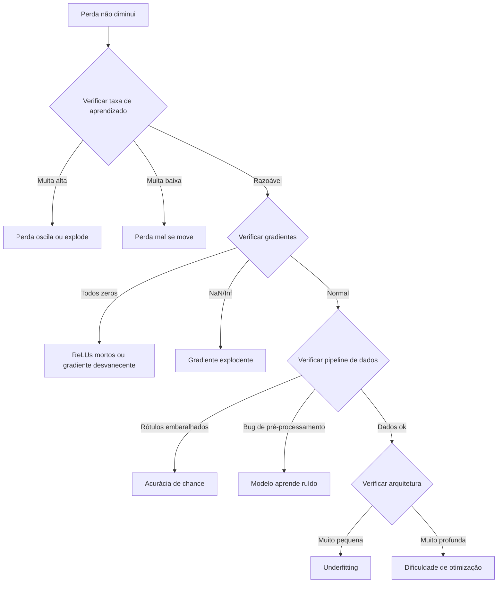
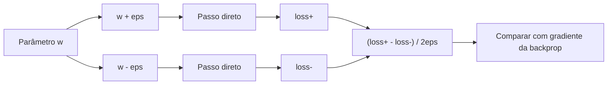
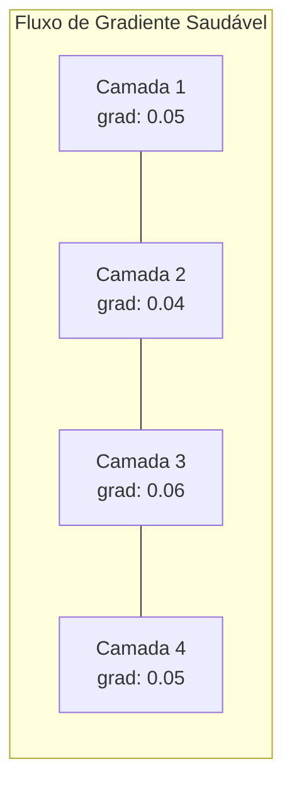
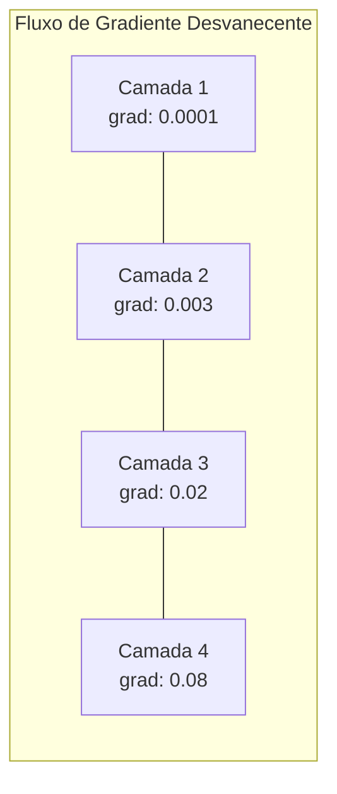
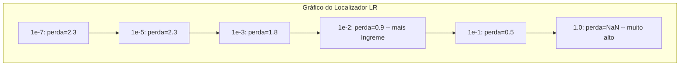

# Debugging de Redes Neurais

> Sua rede compilou. Rodou. Produziu um número. O número está errado e nada crashou. Bem-vindo ao tipo mais difícil de debug — onde não tem mensagem de erro.

**Tipo:** Prática
**Linguagens:** Python, PyTorch
**Pré-requisitos:** Aulas 01-10 da Fase 03 (especialmente retropropagação, funções de perda, otimizadores)
**Tempo:** ~90 minutos

## Objetivos de Aprendizado

- Diagnosticar falhas comuns em redes neurais (perda NaN, curva de perda plana, overfitting, oscilação) usando estratégias de debug sistemáticas
- Aplicar a técnica "sobreajustar um lote" pra verificar que sua arquitetura e loop de treino estão corretos
- Inspecionar magnitudes de gradiente, distribuições de ativação e normas de peso pra identificar problemas de gradiente desvanecente/explodente
- Construir um checklist de debug que cubra pipeline de dados, arquitetura, função de perda, otimizador e taxa de aprendizado

## O Problema

Software tradicional quebra quando está quebrado. Um ponteiro nulo lança exceção. Um mismatch de tipo falha na compilação. Um erro de off-by-one produz uma saída claramente errada.

Redes neurais não te dão esse luxo.

Uma rede neural quebrada roda até o final, imprime um valor de perda e gera previsões. A perda pode diminuir. As previsões podem parecer plausíveis. Mas o modelo está silenciosamente errado — aprendendo atalhos, memorizando ruído ou convergindo pra um mínimo inútil. Pesquisadores do Google estimaram que 60-70% do tempo de debug em ML é gasto em bugs "silenciosos" que não produzem erros mas degradam a qualidade do modelo.

A diferença entre um modelo funcional e um quebrado é frequentemente uma única linha fora do lugar: um `zero_grad()` faltando, uma dimensão transposta, uma taxa de aprendizado errada por 10x. O artigo "Recipe for Training Neural Networks" (2019) abre com: "Os erros mais comuns de redes neurais são bugs que não crasham."

Esta aula te ensina a encontrar esses bugs.

## O Conceito

### O Mindset de Debug

Esqueça debug print-e-reze. Debug de rede neural requer abordagem sistemática porque o ciclo de feedback é lento (minutos a horas por execução de treino) e os sintomas são ambíguos (perda ruim pode significar 20 coisas diferentes).

Regra dourada: **comece simples, adicione complexidade uma peça por vez e verifique cada peça independentemente.**



### Sintoma 1: Perda Não Diminui

Essa é a queixa mais comum. O loop roda, as épocas avançam e a perda fica plana ou oscila violentamente.

**Taxa de aprendizado errada.** Muita alta: perda oscila ou pula pra NaN. Muita baixa: perda diminui tão devagar que parece plana. Pra Adam, comece em 1e-3. Pra SGD, comece em 1e-1 ou 1e-2. Sempre teste 3 taxas cobrindo 10x cada (ex.: 1e-2, 1e-3, 1e-4) antes de concluir que outra coisa está errada.

**ReLUs mortos.** Se um neurônio ReLU recebe uma entrada negativa grande, sua saída é 0 e seu gradiente é 0. Nunca se ativa de novo. Se morrerem neurônios suficientes, a rede não consegue aprender. Verifique: imprima a fração de ativações que são exatamente 0 após cada camada ReLU. Se >50% estão mortos, mude pra LeakyReLU ou reduza a taxa de aprendizado.

**Gradientes desvanecentes.** Em redes profundas com sigmoid ou tanh, gradientes diminuem exponencialmente ao propagar pra trás. Quando chegam na primeira camada, são ~0. As primeiras camadas param de aprender. Correção: use ReLU/GELU, adicione conexões residuais ou use batch normalization.

**Gradientes explodentes.** O problema oposto — gradientes crescem exponencialmente. Comum em RNNs e redes muito profundas. Perda pula pra NaN. Correção: gradient clipping (`torch.nn.utils.clip_grad_norm_`), taxa de aprendizado menor ou adicione normalização.

### Sintoma 2: Perda Diminui Mas Modelo é Ruim

A perda cai. Acurácia de treino chega a 99%. Mas acurácia de teste é 55%. Ou o modelo produz saídas sem sentido em dados reais.

**Overfitting.** O modelo memoriza dados de treino em vez de aprender padrões. A lacuna entre perda de treino e validação cresce com o tempo. Correção: mais dados, dropout, weight decay, parada antecipada, aumento de dados.

**Vazamento de dados.** Dados de teste vazaram pro treino. Acurácia é suspeitosamente alta. Causas comuns: embaralhar antes de dividir, pré-processar com estatísticas do dataset completo, amostras duplicadas entre divisões. Correção: divida primeiro, pré-processe depois, verifique duplicatas.

**Erros de rótulo.** 5-10% dos rótulos na maioria dos datasets reais estão errados (Northcutt et al., 2021 — "Pervasive Label Errors in Test Sets"). O modelo aprende o ruído. Correção: use confident learning pra encontrar e corrigir exemplos mal rotulados, ou use truncamento de perda pra ignorar amostras de alta perda.

### Sintoma 3: NaN ou Inf na Perda

O valor da perda vira `nan` ou `inf`. Treino morto.

**Taxa muito alta.** Updates de gradiente ultrapassam tanto que pesos explodem. Correção: reduza 10x.

**log(0) ou log(negativo).** Entropia cruzada computa `log(p)`. Se seu modelo produz exatamente 0 ou uma probabilidade negativa, o log explode. Correção: restrinja previsões pra `[eps, 1-eps]` onde `eps=1e-7`.

**Divisão por zero.** Batch normalization divide por desvio padrão. Um lote com valores constantes tem std=0. Correção: adicione epsilon ao denominador (PyTorch faz isso por padrão, mas implementações customizadas podem não fazer).

**Estouro numérico.** Ativações grandes alimentando `exp()` produzem Inf. Softmax é especialmente propenso. Correção: subtraia o máximo antes de elevar a exponencial (o truque log-sum-exp).

### Técnica 1: Verificação de Gradiente

Compare seus gradientes analíticos (da retropropagação) com gradientes numéricos (diferenças finitas). Se discordam, seu backward pass tem um bug.

Gradiente numérico pro parâmetro `w`:

```
grad_numerical = (loss(w + eps) - loss(w - eps)) / (2 * eps)
```

Métrica de concordância (diferença relativa):

```
rel_diff = |grad_analytical - grad_numerical| / max(|grad_analytical|, |grad_numerical|, 1e-8)
```

Se `rel_diff < 1e-5`: correto. Se `rel_diff > 1e-3`: quase certamente um bug.



### Técnica 2: Estatísticas de Ativação

Monitore a média e desvio padrão das ativações após cada camada durante o treino. Redes saudáveis mantêm ativações com média perto de 0 e std perto de 1 (após normalização) ou pelo menos limitadas.

| Indicador | Média | Std | Diagnóstico |
|-----------|-------|-----|-------------|
| Saudável | ~0 | ~1 | Rede aprendendo normalmente |
| Saturado | >>0 ou <<0 | ~0 | Ativações presas em valores extremos |
| Morto | 0 | 0 | Neurônios mortos (todos zeros) |
| Explodindo | >>10 | >>10 | Ativações crescendo sem limite |

### Técnica 3: Visualização do Fluxo de Gradiente

Plote a magnitude média do gradiente pra cada camada. Numa rede saudável, as magnitudes de gradiente devem ser aproximadamente similares entre camadas. Se camadas iniciais têm gradientes 1000x menores que camadas finais, você tem gradientes desvanecentes.





### Técnica 4: Teste de Sobreajustar um Lote

A técnica de debug mais importante do deep learning.

Pegue um lote pequeno (8-32 amostras). Treine nele por 100+ iterações. A perda deve ir pra quase zero e acurácia de treino deve atingir 100%. Se não, seu modelo ou loop de treino tem um bug fundamental — não prossiga pro treino completo.

Esse teste pega:
- Funções de perda quebradas
- Passos reversos quebrados
- Arquitetura pequena demais pra representar os dados
- Otimizador não conectado aos parâmetros do modelo
- Dados e rótulos desalinhados

Isso leva 30 segundos pra rodar e economiza horas de debug de treinos completos.

### Técnica 5: Localizador de Taxa de Aprendizado

Leslie Smith (2017) propôs varrer o lr de muito pequeno (1e-7) pra muito grande (10) numa época, registrando a perda. Plote perda vs lr. O lr ideal é aproximadamente 10x menor que o ponto onde a perda começa a diminuir mais rápido.



Melhor LR neste exemplo: ~1e-3 (uma ordem de magnitude antes do ponto mais íngreme).

### Erros Comuns no PyTorch

Estes são os bugs que mais desperdiçam horas na comunidade PyTorch:

| Bug | Sintoma | Correção |
|-----|---------|----------|
| Esquecer `optimizer.zero_grad()` | Gradientes acumulam entre lotes, perda oscila | Adicionar `optimizer.zero_grad()` antes de `loss.backward()` |
| Esquecer `model.eval()` no teste | Dropout e batch norm se comportam diferente, acurácia varia entre execuções | Adicionar `model.eval()` e `torch.no_grad()` |
| Formas de tensor erradas | Broadcasting silencioso produz resultados errados, sem erro | Imprimir formas após cada operação durante debug |
| Mismatch CPU/GPU | `RuntimeError: expected CUDA tensor` | Usar `.to(device)` no modelo E nos dados |
| Não desserializar tensores | Grafo computacional cresce pra sempre, OOM | Usar `.detach()` ou `with torch.no_grad()` |
| Operações in-place quebram autograd | `RuntimeError: modified by in-place operation` | Substituir `x += 1` por `x = x + 1` |
| Dados não normalizados | Perda presa no nível de chance | Normalizar entradas pra mean=0, std=1 |
| Rótulos com dtype errado | Cross-entropy espera `Long`, recebeu `Float` | Converter rótulos: `labels.long()` |

### Tabela Mestra de Debug

| Sintoma | Causa provável | Primeira coisa pra tentar |
|---------|---------------|---------------------------|
| Perda presa em -log(1/num_classes) | Modelo prevendo distribuição uniforme | Verificar pipeline de dados, verificar se rótulos correspondem a entradas |
| Perda NaN após alguns passos | Taxa de aprendizado muito alta | Reduzir LR 10x |
| Perda NaN imediatamente | log(0) ou divisão por zero | Adicionar epsilon a operações log/divisão |
| Perda oscilando violentamente | LR alto ou tamanho de lote pequeno | Reduzir LR, aumentar batch size |
| Perda diminuindo depois estabiliza | LR alto demais pra fase de fine-tuning | Adicionar agendamento LR (cosine ou step decay) |
| Acurácia treino alta, teste baixa | Overfitting | Adicionar dropout, weight decay, mais dados |
| Acurácia treino = teste = chance | Modelo não aprendendo nada | Rodar teste sobreajustar-um-lote |
| Acurácia treino = teste mas ambas baixas | Underfitting | Modelo maior, mais camadas, mais features |
| Gradientes todos zero | ReLUs mortos ou grafo computacional desconectado | Trocar pra LeakyReLU, verificar `.requires_grad` |
| Sem memória durante treino | Lote grande ou grafo não liberado | Reduzir batch size, usar `torch.no_grad()` pra eval |

## Construa

Um kit de diagnóstico que monitora ativações, gradientes e curvas de perda. Você vai propositalmente quebrar uma rede e usar o kit pra diagnosticar cada problema.

### Passo 1: Classe NetworkDebugger

Hooks num modelo PyTorch pra registrar estatísticas de ativação e gradiente por camada.

```python
import torch
import torch.nn as nn
import math


class NetworkDebugger:
    def __init__(self, model):
        self.model = model
        self.activation_stats = {}
        self.gradient_stats = {}
        self.loss_history = []
        self.lr_losses = []
        self.hooks = []
        self._register_hooks()

    def _register_hooks(self):
        for name, module in self.model.named_modules():
            if isinstance(module, (nn.Linear, nn.Conv2d, nn.ReLU, nn.LeakyReLU)):
                hook = module.register_forward_hook(self._make_activation_hook(name))
                self.hooks.append(hook)
                hook = module.register_full_backward_hook(self._make_gradient_hook(name))
                self.hooks.append(hook)

    def _make_activation_hook(self, name):
        def hook(module, input, output):
            with torch.no_grad():
                out = output.detach().float()
                self.activation_stats[name] = {
                    "mean": out.mean().item(),
                    "std": out.std().item(),
                    "fraction_zero": (out == 0).float().mean().item(),
                    "min": out.min().item(),
                    "max": out.max().item(),
                }
        return hook

    def _make_gradient_hook(self, name):
        def hook(module, grad_input, grad_output):
            if grad_output[0] is not None:
                with torch.no_grad():
                    grad = grad_output[0].detach().float()
                    self.gradient_stats[name] = {
                        "mean": grad.mean().item(),
                        "std": grad.std().item(),
                        "abs_mean": grad.abs().mean().item(),
                        "max": grad.abs().max().item(),
                    }
        return hook

    def record_loss(self, loss_value):
        self.loss_history.append(loss_value)

    def check_loss_health(self):
        if len(self.loss_history) < 2:
            return "NOT_ENOUGH_DATA"
        recent = self.loss_history[-10:]
        if any(math.isnan(v) or math.isinf(v) for v in recent):
            return "NAN_OR_INF"
        if len(self.loss_history) >= 20:
            first_half = sum(self.loss_history[:10]) / 10
            second_half = sum(self.loss_history[-10:]) / 10
            if second_half >= first_half * 0.99:
                return "NOT_DECREASING"
        if len(recent) >= 5:
            diffs = [recent[i+1] - recent[i] for i in range(len(recent)-1)]
            if max(diffs) - min(diffs) > 2 * abs(sum(diffs) / len(diffs)):
                return "OSCILLATING"
        return "HEALTHY"

    def check_activations(self):
        issues = []
        for name, stats in self.activation_stats.items():
            if stats["fraction_zero"] > 0.5:
                issues.append(f"DEAD_NEURONS: {name} has {stats['fraction_zero']:.0%} zero activations")
            if abs(stats["mean"]) > 10:
                issues.append(f"EXPLODING_ACTIVATIONS: {name} mean={stats['mean']:.2f}")
            if stats["std"] < 1e-6:
                issues.append(f"COLLAPSED_ACTIVATIONS: {name} std={stats['std']:.2e}")
        return issues if issues else ["HEALTHY"]

    def check_gradients(self):
        issues = []
        grad_magnitudes = []
        for name, stats in self.gradient_stats.items():
            grad_magnitudes.append((name, stats["abs_mean"]))
            if stats["abs_mean"] < 1e-7:
                issues.append(f"VANISHING_GRADIENT: {name} abs_mean={stats['abs_mean']:.2e}")
            if stats["abs_mean"] > 100:
                issues.append(f"EXPLODING_GRADIENT: {name} abs_mean={stats['abs_mean']:.2e}")
        if len(grad_magnitudes) >= 2:
            first_mag = grad_magnitudes[0][1]
            last_mag = grad_magnitudes[-1][1]
            if last_mag > 0 and first_mag / last_mag > 100:
                issues.append(f"GRADIENT_RATIO: first/last = {first_mag/last_mag:.0f}x (vanishing)")
        return issues if issues else ["HEALTHY"]

    def print_report(self):
        print("\n=== NETWORK DEBUGGER REPORT ===")
        print(f"\nLoss health: {self.check_loss_health()}")
        if self.loss_history:
            print(f"  Last 5 losses: {[f'{v:.4f}' for v in self.loss_history[-5:]]}")
        print("\nActivation diagnostics:")
        for item in self.check_activations():
            print(f"  {item}")
        print("\nGradient diagnostics:")
        for item in self.check_gradients():
            print(f"  {item}")
        print("\nPer-layer activation stats:")
        for name, stats in self.activation_stats.items():
            print(f"  {name}: mean={stats['mean']:.4f} std={stats['std']:.4f} zero={stats['fraction_zero']:.1%}")
        print("\nPer-layer gradient stats:")
        for name, stats in self.gradient_stats.items():
            print(f"  {name}: abs_mean={stats['abs_mean']:.2e} max={stats['max']:.2e}")

    def remove_hooks(self):
        for hook in self.hooks:
            hook.remove()
        self.hooks.clear()
```

### Passo 2: Teste de Sobreajustar um Lote

```python
def overfit_one_batch(model, x_batch, y_batch, criterion, lr=0.01, steps=200):
    optimizer = torch.optim.Adam(model.parameters(), lr=lr)
    model.train()
    print("\n=== OVERFIT ONE BATCH TEST ===")
    print(f"Batch size: {x_batch.shape[0]}, Steps: {steps}")

    for step in range(steps):
        optimizer.zero_grad()
        output = model(x_batch)
        loss = criterion(output, y_batch)
        loss.backward()
        optimizer.step()

        if step % 50 == 0 or step == steps - 1:
            with torch.no_grad():
                preds = (output > 0).float() if output.shape[-1] == 1 else output.argmax(dim=1)
                targets = y_batch if y_batch.dim() == 1 else y_batch.squeeze()
                acc = (preds.squeeze() == targets).float().mean().item()
            print(f"  Step {step:3d} | Loss: {loss.item():.6f} | Accuracy: {acc:.1%}")

    final_loss = loss.item()
    if final_loss > 0.1:
        print(f"\n  FAIL: Loss did not converge ({final_loss:.4f}). Model or training loop is broken.")
        return False
    print(f"\n  PASS: Loss converged to {final_loss:.6f}")
    return True
```

### Passo 3: Localizador de Taxa de Aprendizado

```python
def find_learning_rate(model, x_data, y_data, criterion, start_lr=1e-7, end_lr=10, steps=100):
    import copy
    original_state = copy.deepcopy(model.state_dict())
    optimizer = torch.optim.SGD(model.parameters(), lr=start_lr)
    lr_mult = (end_lr / start_lr) ** (1 / steps)

    model.train()
    results = []
    best_loss = float("inf")
    current_lr = start_lr

    print("\n=== LEARNING RATE FINDER ===")

    for step in range(steps):
        optimizer.zero_grad()
        output = model(x_data)
        loss = criterion(output, y_data)

        if math.isnan(loss.item()) or loss.item() > best_loss * 10:
            break

        best_loss = min(best_loss, loss.item())
        results.append((current_lr, loss.item()))

        loss.backward()
        optimizer.step()

        current_lr *= lr_mult
        for param_group in optimizer.param_groups:
            param_group["lr"] = current_lr

    model.load_state_dict(original_state)

    if len(results) < 10:
        print("  Could not complete LR sweep -- loss diverged too quickly")
        return results

    min_loss_idx = min(range(len(results)), key=lambda i: results[i][1])
    suggested_lr = results[max(0, min_loss_idx - 10)][0]

    print(f"  Swept {len(results)} steps from {start_lr:.0e} to {results[-1][0]:.0e}")
    print(f"  Minimum loss {results[min_loss_idx][1]:.4f} at lr={results[min_loss_idx][0]:.2e}")
    print(f"  Suggested learning rate: {suggested_lr:.2e}")

    return results
```

### Passo 4: Verificador de Gradiente

```python
def _flat_to_multi_index(flat_idx, shape):
    multi_idx = []
    remaining = flat_idx
    for dim in reversed(shape):
        multi_idx.insert(0, remaining % dim)
        remaining //= dim
    return tuple(multi_idx)


def gradient_check(model, x, y, criterion, eps=1e-4):
    model.train()
    x_double = x.double()
    y_double = y.double()
    model_double = model.double()

    print("\n=== GRADIENT CHECK ===")
    overall_max_diff = 0
    checked = 0

    for name, param in model_double.named_parameters():
        if not param.requires_grad:
            continue

        layer_max_diff = 0

        model_double.zero_grad()
        output = model_double(x_double)
        loss = criterion(output, y_double)
        loss.backward()
        analytical_grad = param.grad.clone()

        num_checks = min(5, param.numel())
        for i in range(num_checks):
            idx = _flat_to_multi_index(i, param.shape)
            original = param.data[idx].item()

            param.data[idx] = original + eps
            with torch.no_grad():
                loss_plus = criterion(model_double(x_double), y_double).item()

            param.data[idx] = original - eps
            with torch.no_grad():
                loss_minus = criterion(model_double(x_double), y_double).item()

            param.data[idx] = original

            numerical = (loss_plus - loss_minus) / (2 * eps)
            analytical = analytical_grad[idx].item()

            denom = max(abs(numerical), abs(analytical), 1e-8)
            rel_diff = abs(numerical - analytical) / denom

            layer_max_diff = max(layer_max_diff, rel_diff)
            checked += 1

        overall_max_diff = max(overall_max_diff, layer_max_diff)
        status = "OK" if layer_max_diff < 1e-5 else "MISMATCH"
        print(f"  {name}: max_rel_diff={layer_max_diff:.2e} [{status}]")

    model.float()

    print(f"\n  Checked {checked} parameters")
    if overall_max_diff < 1e-5:
        print("  PASS: Gradients match (rel_diff < 1e-5)")
    elif overall_max_diff < 1e-3:
        print("  WARN: Small differences (1e-5 < rel_diff < 1e-3)")
    else:
        print("  FAIL: Gradient mismatch detected (rel_diff > 1e-3)")
    return overall_max_diff
```

### Passo 5: Redes Propositalmente Quebradas

Agora aplique o kit em redes quebradas e diagnostique cada uma.

```python
def demo_broken_networks():
    torch.manual_seed(42)
    x = torch.randn(64, 10)
    y = (x[:, 0] > 0).long()

    print("\n" + "=" * 60)
    print("BUG 1: Learning rate too high (lr=10)")
    print("=" * 60)
    model1 = nn.Sequential(nn.Linear(10, 32), nn.ReLU(), nn.Linear(32, 2))
    debugger1 = NetworkDebugger(model1)
    optimizer1 = torch.optim.SGD(model1.parameters(), lr=10.0)
    criterion = nn.CrossEntropyLoss()
    for step in range(20):
        optimizer1.zero_grad()
        out = model1(x)
        loss = criterion(out, y)
        debugger1.record_loss(loss.item())
        loss.backward()
        optimizer1.step()
    debugger1.print_report()
    debugger1.remove_hooks()

    print("\n" + "=" * 60)
    print("BUG 2: Dead ReLUs from bad initialization")
    print("=" * 60)
    model2 = nn.Sequential(nn.Linear(10, 32), nn.ReLU(), nn.Linear(32, 32), nn.ReLU(), nn.Linear(32, 2))
    with torch.no_grad():
        for m in model2.modules():
            if isinstance(m, nn.Linear):
                m.weight.fill_(-1.0)
                m.bias.fill_(-5.0)
    debugger2 = NetworkDebugger(model2)
    optimizer2 = torch.optim.Adam(model2.parameters(), lr=1e-3)
    for step in range(50):
        optimizer2.zero_grad()
        out = model2(x)
        loss = criterion(out, y)
        debugger2.record_loss(loss.item())
        loss.backward()
        optimizer2.step()
    debugger2.print_report()
    debugger2.remove_hooks()

    print("\n" + "=" * 60)
    print("BUG 3: Missing zero_grad (gradients accumulate)")
    print("=" * 60)
    model3 = nn.Sequential(nn.Linear(10, 32), nn.ReLU(), nn.Linear(32, 2))
    debugger3 = NetworkDebugger(model3)
    optimizer3 = torch.optim.SGD(model3.parameters(), lr=0.01)
    for step in range(50):
        out = model3(x)
        loss = criterion(out, y)
        debugger3.record_loss(loss.item())
        loss.backward()
        optimizer3.step()
    debugger3.print_report()
    debugger3.remove_hooks()

    print("\n" + "=" * 60)
    print("HEALTHY NETWORK: Correct setup for comparison")
    print("=" * 60)
    model_good = nn.Sequential(nn.Linear(10, 32), nn.ReLU(), nn.Linear(32, 2))
    debugger_good = NetworkDebugger(model_good)
    optimizer_good = torch.optim.Adam(model_good.parameters(), lr=1e-3)
    for step in range(50):
        optimizer_good.zero_grad()
        out = model_good(x)
        loss = criterion(out, y)
        debugger_good.record_loss(loss.item())
        loss.backward()
        optimizer_good.step()
    debugger_good.print_report()
    debugger_good.remove_hooks()

    print("\n" + "=" * 60)
    print("OVERFIT-ONE-BATCH TEST (healthy model)")
    print("=" * 60)
    model_test = nn.Sequential(nn.Linear(10, 32), nn.ReLU(), nn.Linear(32, 2))
    overfit_one_batch(model_test, x[:8], y[:8], criterion)

    print("\n" + "=" * 60)
    print("LEARNING RATE FINDER")
    print("=" * 60)
    model_lr = nn.Sequential(nn.Linear(10, 32), nn.ReLU(), nn.Linear(32, 2))
    find_learning_rate(model_lr, x, y, criterion)

    print("\n" + "=" * 60)
    print("GRADIENT CHECK")
    print("=" * 60)
    model_grad = nn.Sequential(nn.Linear(10, 8), nn.ReLU(), nn.Linear(8, 2))
    gradient_check(model_grad, x[:4], y[:4], criterion)
```

## Use

### Ferramentas Embutidas do PyTorch

```python
import torch
import torch.nn as nn

model = nn.Sequential(
    nn.Linear(768, 256),
    nn.ReLU(),
    nn.Linear(256, 10),
)

with torch.autograd.detect_anomaly():
    output = model(input_tensor)
    loss = criterion(output, target)
    loss.backward()

for name, param in model.named_parameters():
    if param.grad is not None:
        print(f"{name}: grad_mean={param.grad.abs().mean():.2e}")
```

### Integração com Weights & Biases

```python
import wandb

wandb.init(project="debug-training")

for epoch in range(100):
    loss = train_one_epoch()
    wandb.log({
        "loss": loss,
        "lr": optimizer.param_groups[0]["lr"],
        "grad_norm": torch.nn.utils.clip_grad_norm_(model.parameters(), float("inf")),
    })

    for name, param in model.named_parameters():
        if param.grad is not None:
            wandb.log({f"grad/{name}": wandb.Histogram(param.grad.cpu().numpy())})
```

### TensorBoard

```python
from torch.utils.tensorboard import SummaryWriter

writer = SummaryWriter("runs/debug_experiment")

for epoch in range(100):
    loss = train_one_epoch()
    writer.add_scalar("Loss/train", loss, epoch)

    for name, param in model.named_parameters():
        writer.add_histogram(f"weights/{name}", param, epoch)
        if param.grad is not None:
            writer.add_histogram(f"gradients/{name}", param.grad, epoch)
```

### Checklist de Debug (Antes do Treino Completo)

1. Rode o teste sobreajustar-um-lote. Se falhar, pare.
2. Imprima o sumário do modelo — verifique que a contagem de parâmetros é razoável.
3. Rode um passo direto com dados aleatórios — verifique o formato da saída.
4. Treine por 5 épocas — verifique que a perda diminui.
5. Verifique estatísticas de ativação — sem camadas mortas, sem explosões.
6. Verifique fluxo de gradiente — sem desvanecimento, sem explosão.
7. Verifique pipeline de dados — imprima 5 amostras aleatórias com rótulos.

## Entregue

Esta aula produz:
- `outputs/prompt-nn-debugger.md` — um prompt pra diagnosticar falhas de treino de redes neurais
- `outputs/skill-debug-checklist.md` — um checklist em árvore de decisão pra debugar problemas de treino

Padrões chave de implantação pra debug:
- Adicione hooks de monitoramento a scripts de treino em produção
- Registre estatísticas de ativação e gradiente no W&B ou TensorBoard a cada N passos
- Implemente alertas automáticos pra perda NaN, neurônios mortos (>80% zero) ou explosão de gradiente
- Sempre rode o teste sobreajustar-um-lote ao mudar arquiteturas ou pipelines de dados

## Exercícios

1. **Adicione um detector de gradiente explodente.** Modifique o `NetworkDebugger` pra detectar quando gradientes excedem um limiar e sugerir automaticamente um valor de gradient clipping. Teste numa rede de 20 camadas sem normalização.

2. **Construa um ressuscitador de neurônios mortos.** Escreva uma função que identifica neurônios ReLU mortos (sempre output 0) e reinicializa seus pesos de entrada com inicialização Kaiming. Mostre que isso recupera uma rede onde >70% dos neurônios estão mortos.

3. **Implemente o localizador de taxa com plotagem.** Estenda `find_learning_rate` pra salvar resultados como CSV e escreva um script separado que lê o CSV e exibe a curva LR vs perda usando matplotlib. Identifique o LR ótimo pro ResNet-18 no CIFAR-10.

4. **Crie um validador de pipeline de dados.** Escreva uma função que verifica: amostras duplicadas entre divisões treino/teste, desbalanceamento de distribuição de rótulos (>10:1), normalização de entrada (média perto de 0, std perto de 1) e valores NaN/Inf nos dados. Execute num dataset propositalmente corrompido.

5. **Depure uma falha real.** Pegue o mini-framework da Aula 10, introduza um bug sutil (ex.: transpose a matriz de pesos no backward) e use verificação de gradiente pra localizar exatamente qual parâmetro tem gradientes incorretos. Documente o processo de debug.

## Termos-chave

| Termo | O que o pessoal diz | O que realmente significa |
|-------|---------------------|--------------------------|
| Bug silencioso | "Roda mas dá resultados ruins" | Um bug que não produz erro mas degrada a qualidade do modelo — o modo de falha dominante em ML |
| ReLU morto | "Os neurônios morreram" | Um neurônio ReLU cuja entrada é sempre negativa, então sua saída é 0 e recebe gradiente 0 permanentemente |
| Gradientes desvanecentes | "Camadas iniciais param de aprender" | Gradientes diminuem exponencialmente através das camadas, fazendo pesos nas camadas iniciais ficarem efetivamente congelados |
| Gradientes explodentes | "Perda foi pra NaN" | Gradientes crescem exponencialmente através das camadas, causando atualizações de peso tão grandes que estouram |
| Verificação de gradiente | "Verificar se a backprop está correta" | Comparar gradientes analíticos da backprop com gradientes numéricos de diferenças finitas |
| Sobreajustar um lote | "O teste de debug mais importante" | Treinar num único lote pequeno pra verificar se o modelo CONSEGUE aprender — se não, algo está fundamentalmente quebrado |
| Localizador de LR | "Varredura pra achar a taxa certa" | Aumentar exponencialmente a taxa de aprendizado por uma época e escolher a taxa logo antes da perda divergir |
| Vazamento de dados | "Dados de teste vazaram pro treino" | Quando informação do conjunto de teste contamina o treino, produzindo acurácia artificialmente alta |
| Estatísticas de ativação | "Monitorar saúde da camada" | Rastrear média, std e fração-zero da saída de cada camada pra detectar neurônios mortos, saturados ou explodindo |
| Gradient clipping | "Limitar a magnitude do gradiente" | Escalar gradientes pra baixo quando sua norma excede um limiar, prevenindo atualizações explosivas de gradiente |

## Leitura Adicional

- Smith, "Cyclical Learning Rates for Training Neural Networks" (2017) — o paper introduzindo o teste de faixa de taxa de aprendizado (LR finder)
- Northcutt et al., "Pervasive Label Errors in Test Sets Destabilize Machine Learning Benchmarks" (2021) — demonstra que 3-6% dos rótulos em ImageNet, CIFAR-10 e outros benchmarks principais estão errados
- Zhang et al., "Understanding Deep Learning Requires Rethinking Generalization" (2017) — o paper mostrando que redes neurais podem memorizar rótulos aleatórios, que é por que o teste sobreajustar-um-lote funciona
- Documentação do PyTorch sobre `torch.autograd.detect_anomaly` e `torch.autograd.set_detect_anomaly` pra detecção embutida de NaN/Inf
