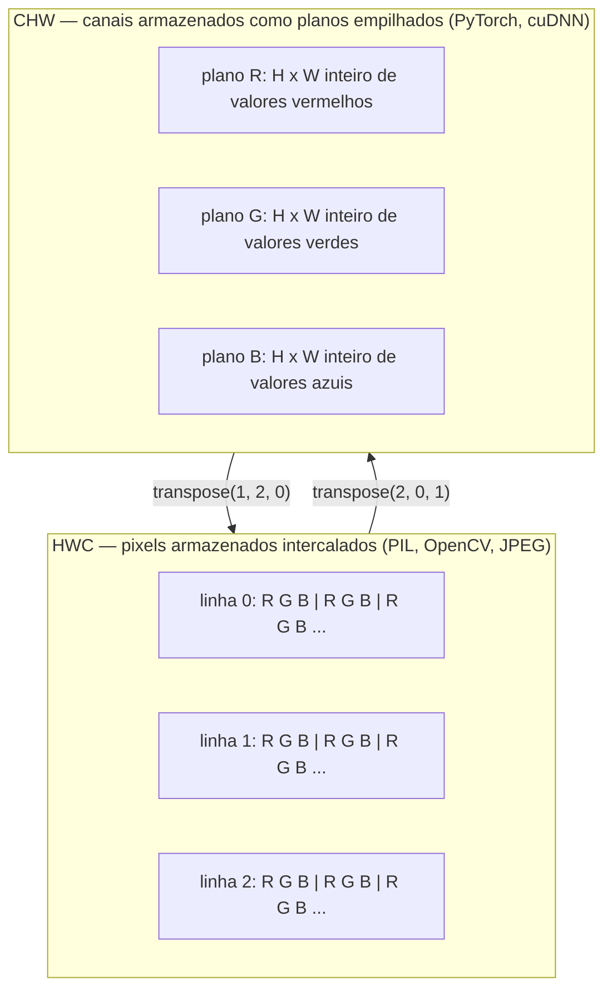

# Fundamentos de Imagem — Pixels, Canais, Espaços de Cor

> Uma imagem é um tensor de amostras de luz. Todo modelo de visão que você vai usar parte desse único fato.

**Tipo:** Construção
**Linguagens:** Python
**Pré-requisitos:** Phase 1 Lesson 12 (Operações com Tensores), Phase 3 Lesson 11 (Introdução ao PyTorch)
**Tempo:** ~45 minutos

## Objetivos de Aprendizado

- Explicar como uma cena contínua é discretizada em pixels e por que as decisões de amostragem/quantização definem o teto de qualquer modelo downstream
- Ler, fatiar e inspecionar imagens como arrays NumPy e alternar fluentemente entre layouts HWC e CHW
- Converter entre RGB, escala de cinza, HSV e YCbCr e justificar por que cada espaço de cor existe
- Aplicar pré-processamento em nível de pixel (normalizar, padronizar, redimensionar, canais-primeiro) exatamente como o torchvision espera

## O Problema

Todo paper que você vai ler, todo peso pré-treinado que você vai baixar, toda API de visão que você vai chamar assume uma codificação específica da entrada. Passe uma imagem `uint8` onde o modelo quer `float32` e ele ainda vai rodar — e silenciosamente produzir lixo. Alimente BGR para uma rede treinada em RGB e a acurácia cai dez pontos. Entregue uma entrada canais-último para um modelo que espera canais-primeiro e a primeira camada convolucional trata a altura como um canal de características. Nada disso lança erro. Só estraga suas métricas e você passa uma semana caçando um bug que mora em como você carregou o arquivo.

Uma convolução não é complicada depois que você sabe sobre o que ela está deslizando. A parte difícil é que "uma imagem" significa coisas diferentes para uma câmera, um decodificador JPEG, PIL, OpenCV, torchvision e um kernel CUDA. Cada stack tem sua própria ordem de eixos, faixa de bytes e convenção de canais. Um engenheiro de visão que não consegue manter isso claro entrega pipelines quebrados.

Esta lição conserta a base para que o resto da fase possa construir sobre ela. Ao final, você saberá o que é um pixel, por que existem três números por pixel em vez de um, o que "normalizar com estatísticas da ImageNet" realmente faz, e como navegar entre os dois ou três layouts que todas as outras lições desta fase vão assumir.

## O Conceito

### O pipeline completo de pré-processamento de relance

Todo sistema de visão em produção é a mesma sequência de transformações reversíveis. Erre um passo e o modelo vê uma entrada diferente daquela com que foi treinado.

```mermaid
flowchart LR
    A["Arquivo de imagem<br/>(JPEG/PNG)"] --> B["Decodificar<br/>uint8 HWC"]
    B --> C["Converter<br/>espaço de cor<br/>(RGB/BGR/YCbCr)"]
    C --> D["Redimensionar<br/>lado menor"]
    D --> E["Cortar centro<br/>tamanho do modelo"]
    E --> F["Dividir por 255<br/>float32 [0,1]"]
    F --> G["Subtrair média<br/>Dividir por std"]
    G --> H["Transpor<br/>HWC → CHW"]
    H --> I["Agrupar em lote<br/>CHW → NCHW"]
    I --> J["Modelo"]

    style A fill:#fef3c7,stroke:#d97706
    style J fill:#ddd6fe,stroke:#7c3aed
    style G fill:#fecaca,stroke:#dc2626
    style H fill:#bfdbfe,stroke:#2563eb
```



As duas caixas vermelha e azul são onde 80% das falhas silenciosas moram: padronização ausente e layout errado.

### Um pixel é uma amostra, não um quadrado

Um sensor de câmera conta fótons que pousam em uma grade de minúsculos detectores. Cada detector integra a luz por uma fração de segundo e emite uma voltagem proporcional a quantos fótons o atingiram. O sensor então discretiza essa voltagem em um inteiro. Um detector se torna um pixel.

```
Cena contínua                    Grade do sensor                 Imagem digital
(detalhes infinitos)              (detectores H x W)             (inteiros H x W)

    ~~~~~                        +--+--+--+--+--+                 210 198 180 155 120
   ~   ~   ~                     |  |  |  |  |  |                 205 195 178 152 118
  ~ luz ~       ---->            +--+--+--+--+--+     ---->       200 190 175 150 115
   ~~~~~                         |  |  |  |  |  |                 195 185 170 148 112
                                 +--+--+--+--+--+                 188 180 165 145 108
```

Duas escolhas acontecem neste passo e elas fixam o teto para tudo downstream:

- **Amostragem espacial** decide quantos detectores por grau da cena. Poucos demais, e bordas ficam serrilhadas (aliasing). Muitos, e armazenamento e computação explodem.
- **Quantização de intensidade** decide quão finamente a voltagem é dividida. 8 bits dá 256 níveis e é padrão para exibição. 10, 12, 16 bits dão gradientes mais suaves e são importantes para imagens médicas, HDR e pipelines de sensor raw.

Um pixel não é um quadrado colorido com área. É uma única medição. Quando você redimensiona ou rotaciona, você está reamostrando aquela grade de medições.

### Por que três canais

Um detector conta fótons em todo o espectro visível — isso é escala de cinza. Para obter cor, o sensor cobre a grade com um mosaico de filtros vermelho, verde e azul. Após a demosaicação, cada posição espacial tem três inteiros: a resposta do detector com filtro vermelho, verde e azul próximos. Esses três inteiros são o trio RGB de um pixel.

```
Um pixel na memória:

    (R, G, B) = (210, 140, 30)   <- laranja-avermelhado

Uma imagem RGB H x W:

    shape (H, W, 3)     armazenado como   H linhas de W pixels de 3 valores
                                            cada em [0, 255] para uint8
```

Três não é mágico. Câmeras de profundidade adicionam um canal Z. Satélites adicionam bandas infravermelhas e ultravioleta. Exames médicos geralmente têm um canal (raio-X, TC) ou muitos (hiperespectral). O número de canais é o último eixo; camadas convolucionais aprendem a misturar através dele.

### Duas convenções de layout: HWC e CHW

Mesmo tensor, duas ordenações. Cada biblioteca escolhe uma.

```
HWC (altura, largura, canais)           CHW (canais, altura, largura)

   W ->                                    H ->
  +-----+-----+-----+                     +-----+-----+
H |R G B|R G B|R G B|                   C |R R R R R R|
| +-----+-----+-----+                   | +-----+-----+
v |R G B|R G B|R G B|                   v |G G G G G G|
  +-----+-----+-----+                     +-----+-----+
                                          |B B B B B B|
                                          +-----+-----+

   PIL, OpenCV, matplotlib,              PyTorch, a maioria dos frameworks
   quase toda imagem em disco            de deep learning, kernels cuDNN
```

CHW existe porque os kernels de convolução deslizam sobre H e W. Manter o eixo do canal primeiro significa que cada kernel vê um plano 2D contíguo por canal, o que vetoriza de forma limpa. Formatos de disco mantêm HWC porque isso corresponde a como as linhas de varredura saem de um sensor.

A conversão de uma linha que você vai digitar mil vezes:

```
img_chw = img_hwc.transpose(2, 0, 1)      # NumPy
img_chw = img_hwc.permute(2, 0, 1)        # Tensor PyTorch
```

Layout de memória, visualizado:



### Faixas de bytes e dtype

Três convenções dominam:

| Convenção | dtype | Faixa | Onde você vê |
|-----------|-------|-------|--------------|
| Raw | `uint8` | [0, 255] | Arquivos em disco, PIL, saída do OpenCV |
| Normalizado | `float32` | [0.0, 1.0] | Após `img.astype('float32') / 255` |
| Padronizado | `float32` | aproximadamente [-2, +2] | Após subtrair média e dividir por std |

Redes convolucionais foram treinadas em entradas padronizadas. As estatísticas da ImageNet `mean=[0.485, 0.456, 0.406]`, `std=[0.229, 0.224, 0.225]` são a média aritmética e o desvio padrão dos três canais em todo o conjunto de treinamento da ImageNet, calculados em pixels normalizados em [0, 1]. Alimentar `uint8` cru em um modelo que espera float padronizado é a falha silenciosa mais comum em visão aplicada.

### Espaços de cor e por que eles existem

RGB é o formato de captura, mas nem sempre é a representação mais útil para um modelo.

```
 RGB               HSV                       YCbCr / YUV

 R vermelho        H matiz (ângulo 0-360)    Y luminância (brilho)
 G verde           S saturação (0-1)         Cb croma azul-amarelo
 B azul            V valor/brilho (0-1)      Cr croma vermelho-verde

 Linear para       Separa cor do brilho.     Separa brilho da cor.
 saída do sensor   Útil para limiarização    JPEG e a maioria dos codecs
                   de cor, controles de UI,  de vídeo comprimem os canais
                   filtros simples            de croma mais forte porque o
                                              olho humano é menos sensível
                                              a detalhes de croma do que a Y.
```

Para a maioria das CNNs modernas, você alimenta RGB. Você encontra outros espaços quando:

- **HSV** — código CV clássico, segmentação baseada em cor, balanceamento de branco.
- **YCbCr** — lendo internals de JPEG, pipelines de vídeo, modelos de super-resolução que operam apenas em Y.
- **Escala de cinza** — OCR, modelos de documentos, qualquer caso onde cor é variável de nuisance em vez de sinal.

Escala de cinza a partir de RGB é uma soma ponderada, não uma média, porque o olho humano é mais sensível ao verde do que ao vermelho ou azul:

```
Y = 0.299 R + 0.587 G + 0.114 B       (ITU-R BT.601, os pesos clássicos)
```

### Proporção de aspecto, redimensionamento e interpolação

Todo modelo tem um tamanho de entrada fixo (224x224 para a maioria dos classificadores ImageNet, 384x384 ou 512x512 para detectores modernos). Suas imagens raramente correspondem. As três escolhas de redimensionamento que importam:

- **Redimensionar lado menor, depois cortar centro** — a receita padrão da ImageNet. Preserva a proporção, descarta uma faixa de pixels da borda.
- **Redimensionar e preencher** — preserva a proporção e cada pixel, adiciona bordas pretas. Padrão para detecção e OCR.
- **Redimensionar diretamente para o alvo** — estica a imagem. Barato, distorce a geometria, bom para muitas tarefas de classificação.

O método de interpolação decide como os pixels intermediários são computados quando a nova grade não se alinha com a antiga:

```
Vizinho mais próximo  mais rápido, blocoso, única opção para máscaras/rótulos
Bilinear              rápido, suave, padrão para a maioria dos redimensionamentos
Bicúbica              mais lento, mais nítido em ampliação
Lanczos               mais lento, melhor qualidade, usado para exibição final
```

Regra prática: bilinear para treinamento, bicúbica ou lanczos para assets que você vai olhar, vizinho mais próximo para qualquer coisa que contenha IDs de classe inteiros.

## Construa

### Passo 1: Carregar uma imagem e inspecionar sua forma

Use Pillow para carregar qualquer JPEG ou PNG, converter para NumPy e imprimir o que você obteve. Para um exemplo determinístico que roda offline, sintetize um.

```python
import numpy as np
from PIL import Image

def rgb_sintetico(h=128, w=192, seed=0):
    rng = np.random.default_rng(seed)
    yy, xx = np.meshgrid(np.linspace(0, 1, h), np.linspace(0, 1, w), indexing="ij")
    r = (np.sin(xx * 6) * 0.5 + 0.5) * 255
    g = yy * 255
    b = (1 - yy) * xx * 255
    rgb = np.stack([r, g, b], axis=-1) + rng.normal(0, 6, (h, w, 3))
    return np.clip(rgb, 0, 255).astype(np.uint8)

arr = rgb_sintetico()
# Ou carregar do disco:
# arr = np.asarray(Image.open("sua_imagem.jpg").convert("RGB"))

print(f"tipo:   {type(arr).__name__}")
print(f"dtype:  {arr.dtype}")
print(f"shape:  {arr.shape}     # (H, W, C)")
print(f"min:    {arr.min()}")
print(f"max:    {arr.max()}")
print(f"pixel em (0, 0): {arr[0, 0]}")
```

Saída esperada: `shape: (H, W, 3)`, `dtype: uint8`, faixa `[0, 255]`. Essa é a representação canônica em disco, quer os bytes venham de uma câmera, de um decodificador JPEG ou de um gerador sintético.

### Passo 2: Separar canais e reordenar layout

Extraia R, G, B separadamente, depois converta de HWC para CHW para o PyTorch.

```python
R = arr[:, :, 0]
G = arr[:, :, 1]
B = arr[:, :, 2]
print(f"Shape R: {R.shape}, média: {R.mean():.1f}")
print(f"Shape G: {G.shape}, média: {G.mean():.1f}")
print(f"Shape B: {B.shape}, média: {B.mean():.1f}")

arr_chw = arr.transpose(2, 0, 1)
print(f"\nShape HWC: {arr.shape}")
print(f"Shape CHW: {arr_chw.shape}")
```

Três planos de escala de cinza, um por canal. CHW apenas reordena os eixos; nenhuma cópia de dados é estritamente necessária quando o layout de memória permite.

### Passo 3: Conversões para escala de cinza e HSV

Escala de cinza por soma ponderada, depois um RGB-para-HSV manual.

```python
def rgb_para_cinza(rgb):
    pesos = np.array([0.299, 0.587, 0.114], dtype=np.float32)
    return (rgb.astype(np.float32) @ pesos).astype(np.uint8)

def rgb_para_hsv(rgb):
    rgb_f = rgb.astype(np.float32) / 255.0
    r, g, b = rgb_f[..., 0], rgb_f[..., 1], rgb_f[..., 2]
    cmax = np.max(rgb_f, axis=-1)
    cmin = np.min(rgb_f, axis=-1)
    delta = cmax - cmin

    h = np.zeros_like(cmax)
    mask = delta > 0
    rmax = mask & (cmax == r)
    gmax = mask & (cmax == g)
    bmax = mask & (cmax == b)
    h[rmax] = ((g[rmax] - b[rmax]) / delta[rmax]) % 6
    h[gmax] = ((b[gmax] - r[gmax]) / delta[gmax]) + 2
    h[bmax] = ((r[bmax] - g[bmax]) / delta[bmax]) + 4
    h = h * 60.0

    s = np.where(cmax > 0, delta / cmax, 0)
    v = cmax
    return np.stack([h, s, v], axis=-1)

cinza = rgb_para_cinza(arr)
hsv = rgb_para_hsv(arr)
print(f"shape cinza: {cinza.shape}, faixa: [{cinza.min()}, {cinza.max()}]")
print(f"shape hsv:   {hsv.shape}")
print(f"faixa matiz: [{hsv[..., 0].min():.1f}, {hsv[..., 0].max():.1f}] graus")
print(f"faixa sat:   [{hsv[..., 1].min():.2f}, {hsv[..., 1].max():.2f}]")
print(f"faixa val:   [{hsv[..., 2].min():.2f}, {hsv[..., 2].max():.2f}]")
```

O matiz sai em graus, saturação e valor em [0, 1]. Isso corresponde à convenção `hsv_full` do OpenCV.

### Passo 4: Normalizar, padronizar e reverter

Vá de bytes crus para o tensor exato que um modelo ImageNet pré-treinado espera, e depois de volta.

```python
mean = np.array([0.485, 0.456, 0.406], dtype=np.float32)
std = np.array([0.229, 0.224, 0.225], dtype=np.float32)

def preprocess_imagenet(rgb_uint8):
    x = rgb_uint8.astype(np.float32) / 255.0
    x = (x - mean) / std
    x = x.transpose(2, 0, 1)
    return x

def deprocess_imagenet(chw_float32):
    x = chw_float32.transpose(1, 2, 0)
    x = x * std + mean
    x = np.clip(x * 255.0, 0, 255).astype(np.uint8)
    return x

x = preprocess_imagenet(arr)
print(f"shape pré-processado: {x.shape}     # (C, H, W)")
print(f"dtype pré-processado: {x.dtype}")
print(f"média por canal pré-processado:  {x.mean(axis=(1, 2)).round(3)}")
print(f"std por canal pré-processado:   {x.std(axis=(1, 2)).round(3)}")

ida_e_volta = deprocess_imagenet(x)
max_diff = np.abs(ida_e_volta.astype(int) - arr.astype(int)).max()
print(f"diferença máxima de pixel ida-e-volta: {max_diff}    # deve ser 0 ou 1")
```

A média por canal deve estar próxima de zero, o std próximo de um. O par preprocess/deprocess é exatamente o que toda chamada `transforms.Normalize` do torchvision faz internamente.

### Passo 5: Redimensionar com três métodos de interpolação

Compare vizinho mais próximo, bilinear e bicúbica em uma ampliação para que a diferença seja visível.

```python
alvo = (arr.shape[0] * 3, arr.shape[1] * 3)

vizinho_prox = np.asarray(Image.fromarray(arr).resize(alvo[::-1], Image.NEAREST))
bilinear = np.asarray(Image.fromarray(arr).resize(alvo[::-1], Image.BILINEAR))
bicubico = np.asarray(Image.fromarray(arr).resize(alvo[::-1], Image.BICUBIC))

def rugosidade_local(x):
    gy = np.diff(x.astype(float), axis=0)
    gx = np.diff(x.astype(float), axis=1)
    return float(np.abs(gy).mean() + np.abs(gx).mean())

for nome, saida in [("vizinho_prox", vizinho_prox), ("bilinear", bilinear), ("bicubico", bicubico)]:
    print(f"{nome:>13}  shape={saida.shape}  rugosidade={rugosidade_local(saida):6.2f}")
```

Vizinho mais próximo pontua mais alto em rugosidade porque mantém bordas duras. Bilinear é o mais suave. Bicúbica fica no meio, preservando a nitidez percebida sem os artefatos de escada.

## Use

`torchvision.transforms` agrupa tudo acima em um único pipeline componível. O código abaixo reproduz exatamente o que `preprocess_imagenet` faz, mais redimensionamento e corte.

```python
import torch
from torchvision import transforms
from PIL import Image

img = Image.fromarray(rgb_sintetico(256, 256))

pipeline = transforms.Compose([
    transforms.Resize(256),
    transforms.CenterCrop(224),
    transforms.ToTensor(),
    transforms.Normalize(mean=[0.485, 0.456, 0.406], std=[0.229, 0.224, 0.225]),
])

x = pipeline(img)
print(f"tipo tensor:  {type(x).__name__}")
print(f"dtype tensor: {x.dtype}")
print(f"shape tensor: {tuple(x.shape)}      # (C, H, W)")
print(f"média por canal: {x.mean(dim=(1, 2)).tolist()}")
print(f"std por canal:  {x.std(dim=(1, 2)).tolist()}")

lote = x.unsqueeze(0)
print(f"\nshape em lote: {tuple(lote.shape)}   # (N, C, H, W) — pronto para um modelo")
```

Quatro passos, nesta ordem exata: `Resize(256)` escala o lado menor para 256; `CenterCrop(224)` pega um patch 224x224 do meio; `ToTensor()` divide por 255 e troca HWC para CHW; `Normalize` subtrai a média da ImageNet e divide pelo std. Reverter essa ordem muda silenciosamente o que chega ao modelo.

## Entregue

Esta lição produz:

- `outputs/prompt-vision-preprocessing-audit.md` — um prompt que transforma qualquer model card ou dataset card em uma checklist das invariantes de pré-processamento exatas que uma equipe deve honrar.
- `outputs/skill-image-tensor-inspector.md` — uma skill que, dado qualquer tensor ou array em forma de imagem, reporta dtype, layout, faixa e se parece cru, normalizado ou padronizado.

## Exercícios

1. **(Fácil)** Carregue um JPEG com OpenCV (`cv2.imread`) e com Pillow. Imprima ambas as formas e o pixel em `(0, 0)`. Explique a diferença na ordem dos canais, depois escreva uma conversão de uma linha que torne o array do OpenCV idêntico ao do Pillow.
2. **(Médio)** Escreva `padronizar(img, mean, std)` e sua inversa que juntas passem em um teste de `max_diff_ida_e_volta <= 1` em qualquer imagem uint8. Suas funções devem funcionar em uma única imagem em HWC e em um lote em NCHW com a mesma chamada.
3. **(Difícil)** Pegue um tensor padronizado da ImageNet de 3 canais e passe-o por uma convolução 1x1 que aprende uma mistura ponderada de RGB em um único canal de escala de cinza. Inicialize os pesos para `[0.299, 0.587, 0.114]`, congele-os e verifique se a saída corresponde ao seu `rgb_para_cinza` manual dentro do erro de ponto flutuante. Que outras transformações clássicas de espaço de cor podem ser escritas como convoluções 1x1?

## Termos-Chave

| Termo | O que as pessoas dizem | O que realmente significa |
|-------|------------------------|---------------------------|
| Pixel | "Um quadrado colorido" | Uma amostra de intensidade de luz em uma localização da grade — três números para cor, um para escala de cinza |
| Canal | "A cor" | Uma das grades espaciais paralelas empilhadas em um tensor de imagem; último eixo em HWC, primeiro em CHW |
| HWC / CHW | "O shape" | Ordenações de eixos para um tensor de imagem; disco e PIL usam HWC, PyTorch e cuDNN usam CHW |
| Normalizar | "Escalar a imagem" | Dividir por 255 para que os pixels vivam em [0, 1] — necessário mas não suficiente |
| Padronizar | "Centralizar em zero" | Subtrair média e dividir por std por canal para que a distribuição de entrada corresponda ao que o modelo foi treinado |
| Conversão para escala de cinza | "Tirar a média dos canais" | Uma soma ponderada com coeficientes 0.299/0.587/0.114 que corresponde à percepção humana de luminância |
| Interpolação | "Como o redimensionamento escolhe pixels" | A regra que decide valores de saída quando a nova grade não se alinha com a antiga — vizinho mais próximo para rótulos, bilinear para treino, bicúbica para exibição |
| Proporção de aspecto | "Largura sobre altura" | A razão que distingue "redimensionar e preencher" de "redimensionar e esticar" |

## Leitura Complementar

- [Charles Poynton — A Guided Tour of Color Space](https://poynton.ca/PDFs/Guided_tour.pdf) — o tratamento técnico mais claro de por que existem tantos espaços de cor e quando cada um importa
- [PyTorch Vision Transforms Docs](https://pytorch.org/vision/stable/transforms.html) — o pipeline completo de transforms que você vai compor em produção
- [How JPEG Works (Colt McAnlis)](https://www.youtube.com/watch?v=F1kYBnY6mwg) — um tour visual afiado sobre subamostragem de croma, DCT e por que JPEG codifica YCbCr em vez de RGB
- [ImageNet Preprocessing Conventions (torchvision models)](https://pytorch.org/vision/stable/models.html) — a fonte da verdade para `mean=[0.485, 0.456, 0.406]` e por que todo modelo no zoo espera isso
