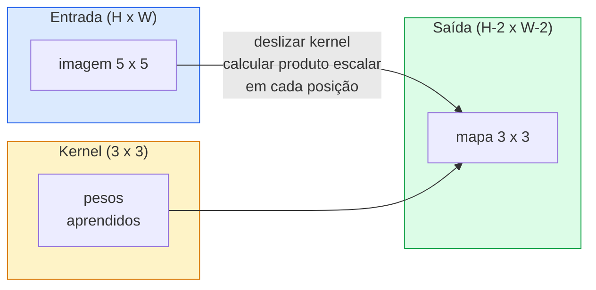
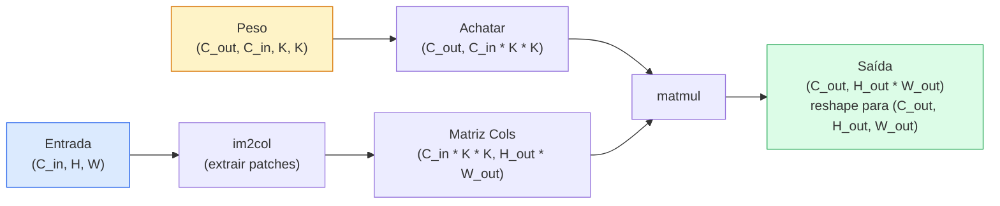

# Convoluções do Zero

> Uma convolução é uma pequena camada densa que você desliza sobre uma imagem, compartilhando os mesmos pesos em cada local.

**Tipo:** Construção
**Linguagens:** Python
**Pré-requisitos:** Phase 3 (Núcleo de Deep Learning), Phase 4 Lesson 01 (Fundamentos de Imagem)
**Tempo:** ~75 minutos

## Objetivos de Aprendizado

- Implementar convolução 2D do zero usando apenas NumPy, incluindo a versão com loops aninhados e uma versão vetorizada via `im2col`
- Calcular o tamanho espacial da saída para qualquer combinação de tamanho de entrada, tamanho de kernel, padding e stride, e justificar a fórmula `(H - K + 2P) / S + 1`
- Projetar kernels manualmente (borda, borrão, nitidez, Sobel) e explicar por que cada um produz o padrão de ativações que produz
- Empilhar convoluções em um extrator de características e conectar a profundidade da pilha ao tamanho do campo receptivo

## O Problema

Uma camada totalmente conectada em uma imagem RGB 224x224 precisaria de 224 * 224 * 3 = 150.528 pesos de entrada por neurônio. Uma única camada oculta com 1.000 unidades já é 150 milhões de parâmetros — antes de você aprender algo útil. Pior, essa camada não tem noção de que um cachorro no canto superior esquerdo e um cachorro no canto inferior direito são o mesmo padrão. Ela trata cada posição de pixel como independente, o que é exatamente errado para imagens: transladar um gato em três pixels não deveria forçar a rede a reaprender o conceito.

As duas propriedades que um modelo de imagem precisa são **equivariância à translação** (a saída se desloca quando a entrada se desloca) e **compartilhamento de parâmetros** (o mesmo detector de características roda em todos os lugares). Camadas densas não te dão nenhuma das duas. Convolução te dá ambas de graça.

Convolução não foi inventada para deep learning. É a mesma operação que alimenta compressão JPEG, desfoque Gaussiano no Photoshop, detecção de bordas em visão industrial e todo filtro de áudio já lançado. A razão pela qual CNNs dominaram a ImageNet de 2012 a 2020 é que a convolução é o prior correto para dados onde valores próximos estão relacionados e o mesmo padrão pode aparecer em qualquer lugar.

## O Conceito

### Um kernel, deslizando

Uma convolução 2D pega uma pequena matriz de pesos chamada kernel (ou filtro), desliza sobre a entrada e, em cada local, calcula a soma dos produtos elemento a elemento. Essa soma se torna um pixel de saída.



Um exemplo concreto 3x3 em uma entrada 5x5 (sem padding, stride 1):

```
Entrada X (5 x 5):                Kernel W (3 x 3):

  1  2  0  1  2                   1  0 -1
  0  1  3  1  0                   2  0 -2
  2  1  0  2  1                   1  0 -1
  1  0  2  1  3
  2  1  1  0  1

O kernel desliza sobre cada janela 3 x 3 válida. A saída Y é 3 x 3:

 Y[0,0] = sum( W * X[0:3, 0:3] )
 Y[0,1] = sum( W * X[0:3, 1:4] )
 Y[0,2] = sum( W * X[0:3, 2:5] )
 Y[1,0] = sum( W * X[1:4, 0:3] )
 ... e assim por diante
```

Essa única fórmula — **pesos compartilhados, localidade, janela deslizante** — é a ideia inteira. Todo o resto é contabilidade.

### Fórmula do tamanho da saída

Dado o tamanho espacial de entrada `H`, tamanho do kernel `K`, padding `P`, stride `S`:

```
H_out = floor( (H - K + 2P) / S ) + 1
```

Memorize isto. Você vai calcular dezenas de vezes por arquitetura.

| Cenário | H | K | P | S | H_out |
|---------|---|---|---|---|-------|
| Conv válida, sem padding | 32 | 3 | 0 | 1 | 30 |
| Mesma conv (preserva tamanho) | 32 | 3 | 1 | 1 | 32 |
| Subamostrar por 2 | 32 | 3 | 1 | 2 | 16 |
| Pool 2x2 | 32 | 2 | 0 | 2 | 16 |
| Campo receptivo grande | 32 | 7 | 3 | 2 | 16 |

"Same padding" significa escolher P para que H_out == H quando S == 1. Para K ímpar, isso é P = (K - 1) / 2. É por isso que kernels 3x3 dominam — são o menor kernel ímpar que ainda tem um centro.

### Padding

Sem padding, toda convolução encolhe o mapa de características. Empilhe 20 delas e sua imagem 224x224 vira 184x184, o que desperdiça computação na borda e complica conexões residuais que precisam de formas correspondentes.

```
Zero padding (P = 1) em uma entrada 5 x 5:

  0  0  0  0  0  0  0
  0  1  2  0  1  2  0
  0  0  1  3  1  0  0
  0  2  1  0  2  1  0       Agora o kernel pode centralizar no pixel
  0  1  0  2  1  3  0       (0, 0) e ainda ter três linhas e
  0  2  1  1  0  1  0       três colunas de valores para multiplicar.
  0  0  0  0  0  0  0
```

Modos que você encontra na prática: `zero` (mais comum), `reflect` (espelha a borda, evita bordas duras em modelos generativos), `replicate` (copia a borda), `circular` (envolve, usado em problemas toroidais).

### Stride

Stride é o tamanho do passo do deslize. `stride=1` é o padrão. `stride=2` reduz pela metade as dimensões espaciais e é a forma clássica de subamostrar dentro de uma CNN sem uma camada de pooling separada — toda arquitetura moderna (ResNet, ConvNeXt, MobileNet) usa convs com stride em vez de max-pool em algum lugar.

```
Stride 1 em uma entrada 5 x 5, kernel 3 x 3:

  começa: (0,0) (0,1) (0,2)        -> linha de saída 0
          (1,0) (1,1) (1,2)        -> linha de saída 1
          (2,0) (2,1) (2,2)        -> linha de saída 2

  Saída: 3 x 3

Stride 2 na mesma entrada:

  começa: (0,0) (0,2)              -> linha de saída 0
          (2,0) (2,2)              -> linha de saída 1

  Saída: 2 x 2
```

### Múltiplos canais de entrada

Imagens reais têm três canais. Uma convolução 3x3 em uma entrada RGB é na verdade um volume 3x3x3: uma fatia 3x3 por canal de entrada. Em cada posição espacial, você multiplica e soma em todas as três fatias e adiciona um viés.

```
Entrada:   (C_in,  H,  W)        3 x 5 x 5
Kernel:    (C_in,  K,  K)        3 x 3 x 3 (um kernel)
Saída:     (1,     H', W')       mapa 2D

Para uma camada que produz C_out canais de saída, você empilha C_out kernels:

Peso:      (C_out, C_in, K, K)   e.g. 64 x 3 x 3 x 3
Saída:     (C_out, H', W')       64 x 3 x 3

Contagem de parâmetros: C_out * C_in * K * K + C_out   (o + C_out são os biases)
```

Essa última linha é a que você vai calcular ao planejar um modelo. Uma convolução 3x3 de 64 canais em uma entrada de 3 canais tem `64 * 3 * 3 * 3 + 64 = 1.792` parâmetros. Barato.

### O truque im2col

Loops aninhados são fáceis de ler mas lentos. GPUs querem multiplicações de matrizes grandes. O truque: achatar cada janela de campo receptivo da entrada em uma coluna de uma matriz grande, achatar o kernel em uma linha, e a convolução inteira se torna um único matmul.



Toda implementação de convolução em produção é alguma variante disso mais truques de cache-tiling (conv direta, Winograd, FFT conv para kernels grandes). Entenda im2col e você entende o núcleo.

### Campo receptivo

Uma única conv 3x3 olha para 9 pixels de entrada. Empilhe duas convs 3x3 e um neurônio na segunda camada olha para 5x5 pixels de entrada. Três convs 3x3 dão 7x7. Em geral:

```
RF após L convs K x K empilhadas (stride 1) = 1 + L * (K - 1)

Com strides:   RF cresce multiplicativamente com stride em cada camada.
```

A razão inteira pela qual "3x3 até o fim" funciona (VGG, ResNet, ConvNeXt) é que duas convs 3x3 veem a mesma área de entrada que uma conv 5x5, mas com menos parâmetros e uma não-linearidade extra no meio.

## Construa

### Passo 1: Preencher um array (padding)

Comece com o menor primitivo: uma função que preenche com zeros ao redor de um array H x W.

```python
import numpy as np

def pad2d(x, p):
    if p == 0:
        return x
    h, w = x.shape[-2:]
    out = np.zeros(x.shape[:-2] + (h + 2 * p, w + 2 * p), dtype=x.dtype)
    out[..., p:p + h, p:p + w] = x
    return out

x = np.arange(9).reshape(3, 3)
print(x)
print()
print(pad2d(x, 1))
```

O truque dos eixos finais `x.shape[:-2]` significa que a mesma função funciona em `(H, W)`, `(C, H, W)` ou `(N, C, H, W)` sem modificação.

### Passo 2: Convolução 2D com loops aninhados

A implementação de referência — lenta, mas inequívoca. Isto é o que `torch.nn.functional.conv2d` faz em princípio.

```python
def conv2d_ingenuo(x, w, b=None, stride=1, padding=0):
    c_in, h, w_in = x.shape
    c_out, c_in_w, kh, kw = w.shape
    assert c_in == c_in_w

    x_pad = pad2d(x, padding)
    h_out = (h + 2 * padding - kh) // stride + 1
    w_out = (w_in + 2 * padding - kw) // stride + 1

    out = np.zeros((c_out, h_out, w_out), dtype=np.float32)
    for oc in range(c_out):
        for i in range(h_out):
            for j in range(w_out):
                hs = i * stride
                ws = j * stride
                patch = x_pad[:, hs:hs + kh, ws:ws + kw]
                out[oc, i, j] = np.sum(patch * w[oc])
        if b is not None:
            out[oc] += b[oc]
    return out
```

Quatro loops aninhados (canal de saída, linha, coluna, mais a soma implícita sobre C_in, kh, kw). Esta é a verdade básica contra a qual você vai verificar toda implementação mais rápida.

### Passo 3: Verificar com um kernel projetado manualmente

Construa um kernel Sobel vertical, aplique-o a uma imagem sintética de degrau e veja a borda vertical acender.

```python
def imagem_degrau_sintetica():
    img = np.zeros((1, 16, 16), dtype=np.float32)
    img[:, :, 8:] = 1.0
    return img

sobel_x = np.array([
    [[-1, 0, 1],
     [-2, 0, 2],
     [-1, 0, 1]]
], dtype=np.float32)[None]

x = imagem_degrau_sintetica()
y = conv2d_ingenuo(x, sobel_x, padding=1)
print(y[0].round(1))
```

Espere grandes valores positivos na coluna 7 (aumento de brilho da esquerda para a direita) e zeros em todos os outros lugares. Esse único print é sua verificação de sanidade de que a matemática está correta.

### Passo 4: im2col

Converta cada janela do tamanho do kernel na entrada em uma coluna de uma matriz. Para `C_in=3, K=3`, cada coluna tem 27 números.

```python
def im2col(x, kh, kw, stride=1, padding=0):
    c_in, h, w = x.shape
    x_pad = pad2d(x, padding)
    h_out = (h + 2 * padding - kh) // stride + 1
    w_out = (w + 2 * padding - kw) // stride + 1

    cols = np.zeros((c_in * kh * kw, h_out * w_out), dtype=x.dtype)
    col = 0
    for i in range(h_out):
        for j in range(w_out):
            hs = i * stride
            ws = j * stride
            patch = x_pad[:, hs:hs + kh, ws:ws + kw]
            cols[:, col] = patch.reshape(-1)
            col += 1
    return cols, h_out, w_out
```

Ainda é um loop Python, mas agora o trabalho pesado será um único matmul vetorizado.

### Passo 5: Conv rápida via im2col + matmul

Substitua o quádruplo loop por uma única multiplicação de matrizes.

```python
def conv2d_im2col(x, w, b=None, stride=1, padding=0):
    c_out, c_in, kh, kw = w.shape
    cols, h_out, w_out = im2col(x, kh, kw, stride, padding)
    w_flat = w.reshape(c_out, -1)
    out = w_flat @ cols
    if b is not None:
        out += b[:, None]
    return out.reshape(c_out, h_out, w_out)
```

Verificação de correção: execute ambas as implementações e compare.

```python
rng = np.random.default_rng(0)
x = rng.normal(0, 1, (3, 16, 16)).astype(np.float32)
w = rng.normal(0, 1, (8, 3, 3, 3)).astype(np.float32)
b = rng.normal(0, 1, (8,)).astype(np.float32)

y_ingenuo = conv2d_ingenuo(x, w, b, padding=1)
y_im2col = conv2d_im2col(x, w, b, padding=1)

print(f"diferença absoluta máxima: {np.max(np.abs(y_ingenuo - y_im2col)):.2e}")
```

`max abs diff` deve ser cerca de `1e-5` — a diferença é da ordem de acumulação de ponto flutuante, não um bug.

### Passo 6: Um banco de kernels projetados manualmente

Cinco filtros que mostram o que uma única camada convolucional pode expressar antes de qualquer treinamento.

```python
KERNELS = {
    "identidade": np.array([[0, 0, 0], [0, 1, 0], [0, 0, 0]], dtype=np.float32),
    "borrao_3x3": np.ones((3, 3), dtype=np.float32) / 9.0,
    "nitidez": np.array([[0, -1, 0], [-1, 5, -1], [0, -1, 0]], dtype=np.float32),
    "sobel_x": np.array([[-1, 0, 1], [-2, 0, 2], [-1, 0, 1]], dtype=np.float32),
    "sobel_y": np.array([[-1, -2, -1], [0, 0, 0], [1, 2, 1]], dtype=np.float32),
}

def aplicar_kernel(img2d, kernel):
    x = img2d[None].astype(np.float32)
    w = kernel[None, None]
    return conv2d_im2col(x, w, padding=1)[0]
```

Aplicado a qualquer imagem em escala de cinza, borrão suaviza, nitidez acentua bordas, Sobel-x acende bordas verticais, Sobel-y acende bordas horizontais. Esses são exatamente os padrões que a *primeira* camada convolucional treinada no AlexNet e VGG acabou aprendendo — porque um bom modelo de imagem precisa de detectores de borda e blob, não importa qual tarefa vier depois.

## Use

O `nn.Conv2d` do PyTorch envolve a mesma operação com autograd, kernels CUDA e otimização cuDNN. A semântica das formas é idêntica.

```python
import torch
import torch.nn as nn

conv = nn.Conv2d(in_channels=3, out_channels=64, kernel_size=3, stride=1, padding=1)
print(conv)
print(f"shape do peso: {tuple(conv.weight.shape)}   # (C_out, C_in, K, K)")
print(f"shape do bias:   {tuple(conv.bias.shape)}")
print(f"contagem de params:  {sum(p.numel() for p in conv.parameters())}")

x = torch.randn(8, 3, 224, 224)
y = conv(x)
print(f"\nshape entrada: {tuple(x.shape)}")
print(f"shape saída: {tuple(y.shape)}")
```

Troque `padding=1` por `padding=0` e a saída cai para 222x222. Troque `stride=1` por `stride=2` e cai para 112x112. Mesma fórmula que você memorizou acima.

## Entregue

Esta lição produz:

- `outputs/prompt-cnn-architect.md` — um prompt que, dado tamanho de entrada, orçamento de parâmetros e campo receptivo alvo, projeta uma pilha de camadas `Conv2d` com o K/S/P correto em cada passo.
- `outputs/skill-conv-shape-calculator.md` — uma skill que percorre uma especificação de rede camada por camada e retorna a forma de saída, campo receptivo e contagem de parâmetros para cada bloco.

## Exercícios

1. **(Fácil)** Dada uma entrada em escala de cinza 128x128 e uma pilha de `[Conv3x3(s=1,p=1), Conv3x3(s=2,p=1), Conv3x3(s=1,p=1), Conv3x3(s=2,p=1)]`, calcule o tamanho espacial da saída e o campo receptivo em cada camada manualmente. Verifique com um `nn.Sequential` do PyTorch de convs dummy.
2. **(Médio)** Estenda `conv2d_ingenuo` e `conv2d_im2col` para aceitar um argumento `groups`. Mostre que `groups=C_in=C_out` reproduz uma convolução depthwise e que sua contagem de parâmetros é `C * K * K` em vez de `C * C * K * K`.
3. **(Difícil)** Implemente o passe reverso de `conv2d_im2col` manualmente: dado o gradiente da saída, calcule o gradiente de `x` e `w`. Verifique contra `torch.autograd.grad` nas mesmas entradas e pesos. O truque: o gradiente de im2col é `col2im`, e ele tem que acumular janelas sobrepostas.

## Termos-Chave

| Termo | O que as pessoas dizem | O que realmente significa |
|-------|------------------------|---------------------------|
| Convolução | "Deslizar um filtro" | Um produto escalar aprendível aplicado em cada local espacial com pesos compartilhados; matematicamente uma correlação cruzada, mas todo mundo chama de convolução |
| Kernel / filtro | "O detector de características" | Um pequeno tensor de pesos de forma (C_in, K, K) cujo produto escalar com uma janela da entrada produz um pixel de saída |
| Stride | "O quanto você pula" | O tamanho do passo entre posições consecutivas do kernel; stride 2 reduz cada dimensão espacial pela metade |
| Padding | "Zeros nas bordas" | Valores extras adicionados ao redor da entrada para que o kernel possa centralizar em pixels de borda; padding `same` mantém o tamanho da saída igual ao da entrada |
| Campo receptivo | "Quanto o neurônio vê" | O patch da entrada original do qual uma determinada ativação de saída depende, crescendo com profundidade e stride |
| im2col | "O truque GEMM" | Reorganizar cada janela receptiva em colunas para que a convolução se torne uma grande multiplicação de matrizes — o núcleo de todo kernel rápido de conv |
| Conv depthwise | "Um kernel por canal" | Uma conv com `groups == C_in`, calculando cada canal de saída apenas a partir de seu canal de entrada correspondente; a espinha dorsal do MobileNet e ConvNeXt |
| Equivariância à translação | "Desloca entrada, desloca saída" | Propriedade de que deslocar a entrada em k pixels desloca a saída em k pixels; vem de graça com pesos compartilhados |

## Leitura Complementar

- [A guide to convolution arithmetic for deep learning (Dumoulin & Visin, 2016)](https://arxiv.org/abs/1603.07285) — os diagramas definitivos de padding/stride/dilation que todo curso copia silenciosamente
- [CS231n: Convolutional Neural Networks for Visual Recognition](https://cs231n.github.io/convolutional-networks/) — as notas de aula canônicas, incluindo a explicação original de im2col
- [The Annotated ConvNet (fast.ai)](https://nbviewer.org/github/fastai/fastbook/blob/master/13_convolutions.ipynb) — um notebook que vai da convolução manual a um classificador de dígitos treinado
- [Receptive Field Arithmetic for CNNs (Dang Ha The Hien)](https://distill.pub/2019/computing-receptive-fields/) — o explicador interativo de qualidade de paper sobre cálculos de campo receptivo
