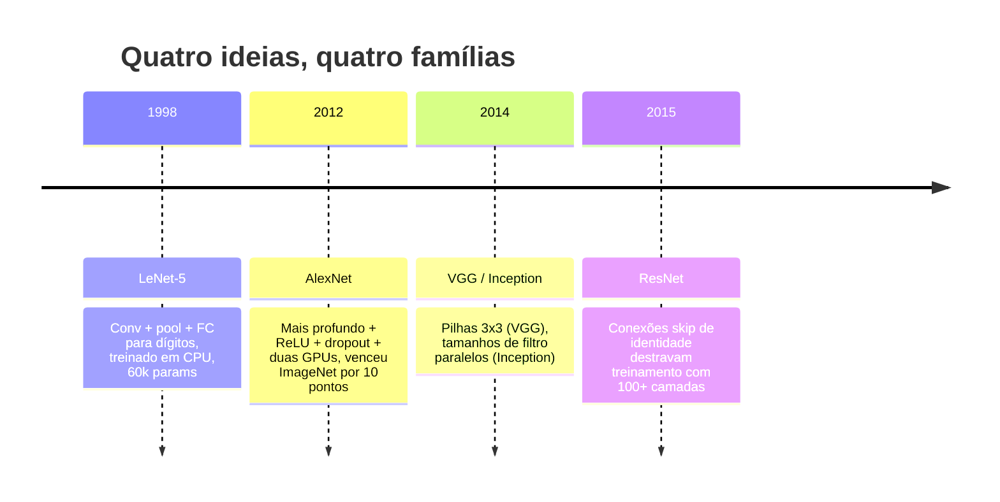
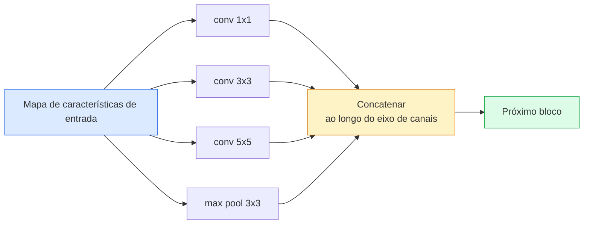
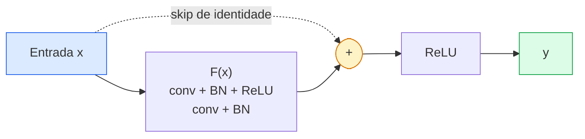

# CNNs — LeNet a ResNet

> Toda CNN importante dos últimos trinta anos é a mesma receita de conv–não-linearidade–subamostragem com uma nova ideia parafusada. Aprenda as ideias em ordem.

**Tipo:** Aprender + Construir
**Linguagens:** Python
**Pré-requisitos:** Phase 3 Lesson 11 (PyTorch), Phase 4 Lesson 01 (Fundamentos de Imagem), Phase 4 Lesson 02 (Convoluções do Zero)
**Tempo:** ~75 minutos

## Objetivos de Aprendizado

- Traçar a linhagem arquitetural LeNet-5 -> AlexNet -> VGG -> Inception -> ResNet e declarar a única nova ideia que cada família contribuiu
- Implementar LeNet-5, um bloco estilo VGG e um BasicBlock do ResNet em PyTorch, cada um com menos de 40 linhas
- Explicar por que conexões residuais transformam uma rede de 1.000 camadas de intreinável em estado-da-arte
- Ler um backbone moderno (ResNet-18, ResNet-50) e prever sua forma de saída, campo receptivo e contagem de parâmetros antes de olhar o código-fonte

## O Problema

Em 2011, o melhor classificador da ImageNet pontuava cerca de 74% de top-5 accuracy. Em 2012, o AlexNet pontuou 85%. Em 2015, o ResNet pontuou 96%. Sem novos dados. Sem nova geração de GPU. Os ganhos vieram de ideias arquiteturais. Um engenheiro de visão que trabalha precisa saber qual ideia veio de qual paper porque todo backbone de produção que você vai entregar em 2026 é uma recombinação dessas mesmas peças — e porque as ideias continuam se transferindo: convs agrupadas foram de CNNs para transformers, conexões residuais foram do ResNet para todo LLM existente, batch normalization vive em modelos de difusão.

Estudar essas redes em ordem também te imuniza contra um erro comum: buscar o maior modelo disponível quando uma rede do tamanho do LeNet resolveria o problema. MNIST não precisa de um ResNet. Saber a curva de escala de cada família te diz onde se sentar nela.

## O Conceito

### As quatro ideias que mudaram a visão



Nada mais na visão clássica importou tanto quanto esses quatro saltos.

### LeNet-5 (1998)

O reconhecedor de dígitos de Yann LeCun. 60.000 parâmetros. Dois blocos conv-pool, duas camadas totalmente conectadas, ativações tanh. Definiu o template que toda CNN herda:

```
entrada (1, 32, 32)
  conv 5x5 -> (6, 28, 28)
  avg pool 2x2 -> (6, 14, 14)
  conv 5x5 -> (16, 10, 10)
  avg pool 2x2 -> (16, 5, 5)
  achatar -> 400
  densa -> 120
  densa -> 84
  densa -> 10
```

Tudo o que o mundo moderno chama de CNN — convoluções e subamostragem alternadas alimentando uma pequena cabeça classificadora — é LeNet com mais camadas, canais maiores e melhores ativações.

### AlexNet (2012)

Três mudanças que juntas quebraram a ImageNet:

1. **ReLU** em vez de tanh. Gradientes param de desaparecer. Treinamento acelera por um fator de seis.
2. **Dropout** na cabeça totalmente conectada. Regularização se torna uma camada, não um truque.
3. **Profundidade e largura**. Cinco camadas convolucionais, três camadas densas, 60M de parâmetros, treinado em duas GPUs com o modelo dividido entre elas.

A Figura 2 do paper ainda mostra a divisão da GPU como dois fluxos paralelos. Esse paralelismo foi uma gambiarra de hardware, não um insight arquitetural — mas as três ideias acima ainda estão em todo modelo que você usa.

### VGG (2014)

VGG perguntou: o que acontece se você usar apenas convoluções 3x3 e for fundo?

```
pilha:   conv 3x3 -> conv 3x3 -> pool 2x2
repita:  16 ou 19 camadas conv
```

Duas convs 3x3 veem a mesma área de entrada 5x5 que uma conv 5x5, mas com menos parâmetros (2*9*C^2 = 18C^2 vs 25*C^2) e um ReLU extra no meio. VGG transformou essa observação em uma arquitetura inteira. A simplicidade — um tipo de bloco, repetido — a tornou o ponto de referência para tudo que veio depois.

Custo: 138M de parâmetros, lento para treinar, caro na inferência.

### Inception (2014, mesmo ano)

A resposta do Google para "qual tamanho de kernel devo usar?" foi: todos, em paralelo.



Cada ramo se especializa — 1x1 para mistura de canais, 3x3 para textura local, 5x5 para padrões maiores, pooling para características invariantes a deslocamento — e a concatenação permite que a próxima camada escolha qualquer ramo que seja útil. Inception v1 usou convoluções 1x1 dentro de cada ramo como um gargalo para manter as contagens de parâmetros sãs.

### O problema da degradação

Em 2015, VGG-19 funcionava e VGG-32 não. Profundidade deveria ajudar, mas depois de ~20 camadas, tanto a perda de treino quanto a de teste pioravam. Isso não é overfitting. É o otimizador falhando em encontrar pesos úteis porque os gradientes encolhem multiplicativamente através de cada camada.

```
Rede plana profunda:
  y = f_L( f_{L-1}( ... f_1(x) ... ) )

Gradiente em relação à camada inicial:
  dL/dW_1 = dL/dy * df_L/df_{L-1} * ... * df_2/df_1 * df_1/dW_1

Cada termo multiplicativo tem magnitude aproximadamente (magnitude do peso) * (ganho de ativação).
Empilhe 100 deles com ganhos < 1 e o gradiente é efetivamente zero.
```

VGG funcionou em 19 camadas porque batch normalization (publicado simultaneamente) manteve as ativações bem escaladas. Mas mesmo batch normalization não conseguiu resgatar profundidade além de ~30 camadas.

### ResNet (2015)

He, Zhang, Ren, Sun propuseram uma mudança que consertou tudo:

```
bloco padrão:   y = F(x)
bloco residual:   y = F(x) + x
```

O `+ x` significa que a camada pode sempre escolher não fazer nada, levando `F(x)` a zero. Uma ResNet de 1.000 camadas é agora no máximo tão ruim quanto uma rede de 1 camada, porque cada bloco extra tem uma escotilha de escape trivial. Com essa garantia, o otimizador está disposto a tornar cada bloco *ligeiramente* útil — e ligeiramente útil, empilhado 100 vezes, é estado-da-arte.



Duas variantes do bloco aparecem em todos os lugares:

- **BasicBlock** (ResNet-18, ResNet-34): duas convs 3x3, skip ao redor de ambas.
- **Bottleneck** (ResNet-50, -101, -152): 1x1 reduz, 3x3 meio, 1x1 expande, skip ao redor do trio. Mais barato quando as contagens de canais são altas.

Quando o skip precisa cruzar uma subamostragem (stride=2), o caminho de identidade é substituído por uma conv 1x1 stride=2 para igualar as formas.

### Por que residuais importam além da visão

A ideia não era realmente sobre classificação de imagem. Era sobre transformar redes profundas de "cruzar os dedos e esperar que os gradientes sobrevivam" em uma ferramenta de engenharia confiável e escalável. Todo transformer que você vai ler na próxima fase tem a mesma conexão skip em cada bloco. Sem ResNet, não existe GPT.

## Construa

### Passo 1: LeNet-5

Um LeNet minimalista e fiel. Ativações tanh, average pooling. A única concessão à modernidade é que usamos `nn.CrossEntropyLoss` downstream em vez das conexões Gaussianas originais.

```python
import torch
import torch.nn as nn
import torch.nn.functional as F

class LeNet5(nn.Module):
    def __init__(self, num_classes=10):
        super().__init__()
        self.conv1 = nn.Conv2d(1, 6, kernel_size=5)
        self.conv2 = nn.Conv2d(6, 16, kernel_size=5)
        self.pool = nn.AvgPool2d(2)
        self.fc1 = nn.Linear(16 * 5 * 5, 120)
        self.fc2 = nn.Linear(120, 84)
        self.fc3 = nn.Linear(84, num_classes)

    def forward(self, x):
        x = self.pool(torch.tanh(self.conv1(x)))
        x = self.pool(torch.tanh(self.conv2(x)))
        x = torch.flatten(x, 1)
        x = torch.tanh(self.fc1(x))
        x = torch.tanh(self.fc2(x))
        return self.fc3(x)

net = LeNet5()
x = torch.randn(1, 1, 32, 32)
print(f"saída: {net(x).shape}")
print(f"params: {sum(p.numel() for p in net.parameters()):,}")
```

Saída esperada: `saída: torch.Size([1, 10])`, `params: 61,706`. Esse é o classificador de dígitos inteiro que iniciou a visão moderna.

### Passo 2: Um bloco VGG

Um bloco reutilizável: duas convs 3x3, ReLU, batch norm, max pool.

```python
class VGGBlock(nn.Module):
    def __init__(self, in_c, out_c):
        super().__init__()
        self.conv1 = nn.Conv2d(in_c, out_c, kernel_size=3, padding=1)
        self.bn1 = nn.BatchNorm2d(out_c)
        self.conv2 = nn.Conv2d(out_c, out_c, kernel_size=3, padding=1)
        self.bn2 = nn.BatchNorm2d(out_c)
        self.pool = nn.MaxPool2d(2)

    def forward(self, x):
        x = F.relu(self.bn1(self.conv1(x)))
        x = F.relu(self.bn2(self.conv2(x)))
        return self.pool(x)

class MiniVGG(nn.Module):
    def __init__(self, num_classes=10):
        super().__init__()
        self.stack = nn.Sequential(
            VGGBlock(3, 32),
            VGGBlock(32, 64),
            VGGBlock(64, 128),
        )
        self.head = nn.Sequential(
            nn.AdaptiveAvgPool2d(1),
            nn.Flatten(),
            nn.Linear(128, num_classes),
        )

    def forward(self, x):
        return self.head(self.stack(x))

net = MiniVGG()
x = torch.randn(1, 3, 32, 32)
print(f"saída: {net(x).shape}")
print(f"params: {sum(p.numel() for p in net.parameters()):,}")
```

Três blocos VGG em entrada do tamanho CIFAR, um pool adaptativo, uma camada linear. ~290k parâmetros. Suficiente para CIFAR-10.

### Passo 3: Um BasicBlock do ResNet

O bloco de construção central do ResNet-18 e ResNet-34.

```python
class BasicBlock(nn.Module):
    def __init__(self, in_c, out_c, stride=1):
        super().__init__()
        self.conv1 = nn.Conv2d(in_c, out_c, kernel_size=3, stride=stride, padding=1, bias=False)
        self.bn1 = nn.BatchNorm2d(out_c)
        self.conv2 = nn.Conv2d(out_c, out_c, kernel_size=3, stride=1, padding=1, bias=False)
        self.bn2 = nn.BatchNorm2d(out_c)
        if stride != 1 or in_c != out_c:
            self.shortcut = nn.Sequential(
                nn.Conv2d(in_c, out_c, kernel_size=1, stride=stride, bias=False),
                nn.BatchNorm2d(out_c),
            )
        else:
            self.shortcut = nn.Identity()

    def forward(self, x):
        out = F.relu(self.bn1(self.conv1(x)))
        out = self.bn2(self.conv2(out))
        out = out + self.shortcut(x)
        return F.relu(out)
```

`bias=False` nas camadas convolucionais é uma convenção de batch norm — o parâmetro beta da BN já lida com o viés, então carregar bias da conv também é um desperdício. O `shortcut` só precisa de uma conv real quando stride ou contagem de canais muda; caso contrário, é uma identidade sem operação.

### Passo 4: Um TinyResNet

Empilhe quatro grupos de BasicBlocks para obter um ResNet funcional para entradas do tamanho CIFAR.

```python
class TinyResNet(nn.Module):
    def __init__(self, num_classes=10):
        super().__init__()
        self.stem = nn.Sequential(
            nn.Conv2d(3, 32, kernel_size=3, stride=1, padding=1, bias=False),
            nn.BatchNorm2d(32),
            nn.ReLU(inplace=True),
        )
        self.layer1 = self._make_group(32, 32, num_blocks=2, stride=1)
        self.layer2 = self._make_group(32, 64, num_blocks=2, stride=2)
        self.layer3 = self._make_group(64, 128, num_blocks=2, stride=2)
        self.layer4 = self._make_group(128, 256, num_blocks=2, stride=2)
        self.head = nn.Sequential(
            nn.AdaptiveAvgPool2d(1),
            nn.Flatten(),
            nn.Linear(256, num_classes),
        )

    def _make_group(self, in_c, out_c, num_blocks, stride):
        blocks = [BasicBlock(in_c, out_c, stride=stride)]
        for _ in range(num_blocks - 1):
            blocks.append(BasicBlock(out_c, out_c, stride=1))
        return nn.Sequential(*blocks)

    def forward(self, x):
        x = self.stem(x)
        x = self.layer1(x)
        x = self.layer2(x)
        x = self.layer3(x)
        x = self.layer4(x)
        return self.head(x)

net = TinyResNet()
x = torch.randn(1, 3, 32, 32)
print(f"saída: {net(x).shape}")
print(f"params: {sum(p.numel() for p in net.parameters()):,}")
```

Quatro grupos de dois blocos cada. Stride 2 no início dos grupos 2, 3, 4. Contagem de canais dobra a cada subamostragem. Aproximadamente 2.8M de parâmetros. Essa é a receita padrão que escala limpa até ResNet-152.

### Passo 5: Comparar eficiência parâmetro-para-característica

Execute a mesma entrada nas três redes e compare as contagens de parâmetros.

```python
def sumario(nome, net, x):
    y = net(x)
    params = sum(p.numel() for p in net.parameters())
    print(f"{nome:12s}  entrada {tuple(x.shape)} -> saída {tuple(y.shape)}  params {params:>10,}")

x = torch.randn(1, 3, 32, 32)
sumario("LeNet5",     LeNet5(),       torch.randn(1, 1, 32, 32))
sumario("MiniVGG",    MiniVGG(),      x)
sumario("TinyResNet", TinyResNet(),   x)
```

Três modelos, três eras, três ordens de magnitude na contagem de parâmetros. Para acurácia no CIFAR-10, você precisa aproximadamente de: LeNet 60%, MiniVGG 89%, TinyResNet 93% após algumas épocas de treinamento.

## Use

`torchvision.models` te dá versões pré-treinadas de todos os acima. A assinatura de chamada é idêntica entre famílias, que é exatamente o ponto da abstração de backbone.

```python
from torchvision.models import resnet18, ResNet18_Weights, vgg16, VGG16_Weights

r18 = resnet18(weights=ResNet18_Weights.IMAGENET1K_V1)
r18.eval()

print(f"ResNet-18 params: {sum(p.numel() for p in r18.parameters()):,}")
print(r18.layer1[0])
print()

v16 = vgg16(weights=VGG16_Weights.IMAGENET1K_V1)
v16.eval()
print(f"VGG-16   params: {sum(p.numel() for p in v16.parameters()):,}")
```

ResNet-18 tem 11.7M de parâmetros. VGG-16 tem 138M. Acurácia top-1 similar na ImageNet (69.8% vs 71.6%). Conexões residuais compram uma vitória de eficiência de parâmetros de 12x. É por isso que as variantes ResNet dominaram de 2016 até a chegada do ViT em 2021 — e ainda dominam implantações do mundo real onde computação é a restrição.

Para transfer learning, a receita é sempre a mesma: carregar pré-treinado, congelar o backbone, substituir a cabeça classificadora.

```python
for p in r18.parameters():
    p.requires_grad = False
r18.fc = nn.Linear(r18.fc.in_features, 10)
```

Três linhas. Você agora tem um classificador CIFAR de 10 classes que herda as representações que a ImageNet pagou.

## Entregue

Esta lição produz:

- `outputs/prompt-backbone-selector.md` — um prompt que escolhe a família CNN certa (LeNet/VGG/ResNet/MobileNet/ConvNeXt) dada a tarefa, tamanho do dataset e orçamento de computação.
- `outputs/skill-residual-block-reviewer.md` — uma skill que lê um módulo PyTorch e sinaliza erros de skip-connection (shortcut ausente em mudança de stride, ordem de ativação no shortcut, posição da BN relativa à adição).

## Exercícios

1. **(Fácil)** Conte parâmetros manualmente para o `TinyResNet` camada por camada. Compare contra `sum(p.numel() for p in net.parameters())`. Para onde vai a maioria do orçamento de parâmetros — convs, BN ou a cabeça classificadora?
2. **(Médio)** Implemente o bloco Bottleneck (1x1 -> 3x3 -> 1x1 com skip) e use-o para construir uma rede estilo ResNet-50 para CIFAR. Compare params contra `TinyResNet`.
3. **(Difícil)** Remova a conexão skip do `BasicBlock`, treine uma rede "plana" de 34 blocos e uma ResNet de 34 blocos no CIFAR-10 por 10 épocas cada. Plote a perda de treino vs época para ambos. Reproduza o resultado da Figura 1 de He et al. onde a rede plana profunda converge para perda maior do que sua gêmea mais rasa.

## Termos-Chave

| Termo | O que as pessoas dizem | O que realmente significa |
|-------|------------------------|---------------------------|
| Backbone | "O modelo" | A pilha de blocos convolucionais que produz o mapa de características alimentado para a cabeça da tarefa |
| Conexão residual | "Skip connection" | `y = F(x) + x`; permite que o otimizador aprenda a identidade definindo F como zero, o que torna profundidade arbitrária treinável |
| BasicBlock | "Duas convs 3x3 com um skip" | O bloco de construção do ResNet-18/34: conv-BN-ReLU-conv-BN-soma-ReLU |
| Bottleneck | "1x1 reduz, 3x3, 1x1 expande" | O bloco do ResNet-50/101/152; barato em contagens altas de canais porque a 3x3 roda em largura reduzida |
| Problema de degradação | "Mais profundo é pior" | Depois de ~20 camadas convolucionais planas, tanto o erro de treino quanto o de teste aumentam; resolvido por conexões residuais, não por mais dados |
| Stem | "A primeira camada" | A conv inicial que converte a entrada de 3 canais na largura base de características; geralmente 7x7 stride 2 para ImageNet, 3x3 stride 1 para CIFAR |
| Head (cabeça) | "O classificador" | As camadas após o bloco backbone final: pool adaptativo, achatamento, linear(es) |
| Transfer learning | "Pesos pré-treinados" | Carregar um backbone treinado na ImageNet e ajustar fino apenas da cabeça na sua tarefa |

## Leitura Complementar

- [Deep Residual Learning for Image Recognition (He et al., 2015)](https://arxiv.org/abs/1512.03385) — o paper do ResNet; toda figura vale estudar
- [Very Deep Convolutional Networks (Simonyan & Zisserman, 2014)](https://arxiv.org/abs/1409.1556) — o paper do VGG; ainda a melhor referência para "por que 3x3"
- [ImageNet Classification with Deep CNNs (Krizhevsky et al., 2012)](https://papers.nips.cc/paper_files/paper/2012/hash/c399862d3b9d6b76c8436e924a68c45b-Abstract.html) — AlexNet; o paper que encerrou a era de características feitas à mão
- [Going Deeper with Convolutions (Szegedy et al., 2014)](https://arxiv.org/abs/1409.4842) — Inception v1; a ideia de filtro paralelo que ainda aparece em vision transformers
