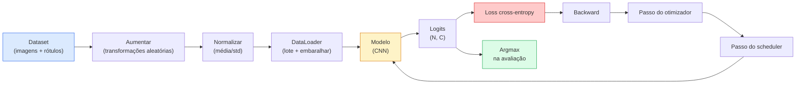

# Classificação de Imagens

> Um classificador é uma função que mapeia pixels para uma distribuição de probabilidade sobre classes. Todo o resto é encanamento.

**Tipo:** Construção
**Linguagens:** Python
**Pré-requisitos:** Phase 2 Lesson 09 (Avaliação de Modelo), Phase 3 Lesson 10 (Mini Framework), Phase 4 Lesson 03 (CNNs)
**Tempo:** ~75 minutos

## Objetivos de Aprendizado

- Construir um pipeline completo de classificação de imagens no CIFAR-10: dataset, aumento de dados, modelo, loop de treinamento, avaliação
- Explicar o papel de cada componente (dataloader, loss, otimizador, scheduler, aumento de dados) e prever como quebrar qualquer um deles se manifesta na curva de loss
- Implementar mixup, cutout e label smoothing do zero e justificar quando cada um vale a pena ser adicionado
- Ler uma matriz de confusão e uma tabela de precisão/revocação por classe para diagnosticar falhas de dataset e modelo além da acurácia agregada

## O Problema

Toda tarefa de visão que é entregue se reduz a classificação de imagens em algum nível. Detecção classifica regiões. Segmentação classifica pixels. Recuperação ranqueia por similaridade a centróides de classe. Acertar a classificação — o loop do dataset, a política de aumento, a loss, a avaliação — é a habilidade que se transfere para todas as outras tarefas da fase.

A maioria dos bugs de classificação não está no modelo. Eles vivem no pipeline: uma normalização quebrada, um conjunto de treino não embaralhado, aumento que distorce rótulos, uma divisão de validação contaminada por dados de treino, uma taxa de aprendizado que diverge silenciosamente depois da época 30. Uma CNN que acertaria 93% no CIFAR-10 com uma configuração correta geralmente pontua 70-75% com uma quebrada, e a curva de loss parece plausível o tempo todo.

Esta lição monta o pipeline inteiro à mão para que cada parte seja inspecionável. Você não usará nada do `torchvision.datasets` que possa esconder um bug.

## O Conceito

### O pipeline de classificação



Cada linha neste loop é onde um bug pode viver. Cross-entropy recebe logits crus, não saídas softmax, então qualquer `model(x).softmax()` antes da loss calcula silenciosamente o gradiente errado. Aumentos se aplicam apenas a entradas, não a rótulos — exceto para mixup, que mistura ambos. `optimizer.zero_grad()` deve acontecer uma vez por passo; pular isso acumula gradientes e parece uma taxa de aprendizado loucamente instável. Cada um desses bugs achata a curva de aprendizado sem lançar um erro.

### Cross-entropy, logits e softmax

Um classificador produz `C` números por imagem chamados logits. Aplicar softmax os converte em uma distribuição de probabilidade:

```
softmax(z)_i = exp(z_i) / soma_j exp(z_j)
```

Cross-entropy mede a log-probabilidade negativa da classe correta:

```
CE(z, y) = -log( softmax(z)_y )
        = -z_y + log( soma_j exp(z_j) )
```

A forma à direita é a numericamente estável (log-sum-exp). O `nn.CrossEntropyLoss` do PyTorch funde softmax + NLL em uma operação e recebe logits crus diretamente. Aplicar softmax você mesmo primeiro é quase sempre um bug — você calcula log(softmax(softmax(z))), uma quantidade sem sentido.

### Por que aumento de dados funciona

Uma CNN tem viés indutivo para translação (do compartilhamento de pesos), mas nenhuma invariância embutida para recortes, inversões, variação de cor ou oclusão. O único jeito de ensinar essas invariâncias é mostrar a ela pixels que as exercitem. Cada transformação aleatória durante o treinamento é uma forma de dizer: "essas duas imagens têm o mesmo rótulo; aprenda as características que ignoram a diferença."

```
Corte original:  "cachorro virado à esquerda"
Inversão:        "cachorro virado à direita"     <- mesmo rótulo, pixels diferentes
Rotacionar(+15): "cachorro, ligeiramente inclinado"
Variação de cor: "cachorro em luz mais quente"
RandomErasing:   "cachorro com pedaço faltando"
```

A regra: o aumento deve preservar o rótulo. Cutout e rotação em um dígito podem transformar "6" em "9"; para esse dataset, você usa faixas de rotação menores e escolhe aumentos que respeitem invariâncias específicas de dígitos.

### Mixup e cutmix

O aumento comum transforma pixels mas mantém rótulos one-hot. **Mixup** e **cutmix** quebram isso interpolando ambos.

```
Mixup:
  lambda ~ Beta(a, a)
  x = lambda * x_i + (1 - lambda) * x_j
  y = lambda * y_i + (1 - lambda) * y_j

Cutmix:
  colar um retângulo aleatório de x_j em x_i
  y = mistura ponderada por área de y_i e y_j
```

Por que ajuda: o modelo para de memorizar alvos one-hot espinhosos e aprende a interpolar entre classes. A loss de treino sobe, a acurácia de teste sobe. É a atualização de robustez mais barata para qualquer classificador.

### Label smoothing

Um primo do mixup. Em vez de treinar contra `[0, 0, 1, 0, 0]`, treine contra `[eps/C, eps/C, 1-eps, eps/C, eps/C]` para um `eps` pequeno como 0.1. Impede o modelo de produzir logits arbitrariamente nítidos e melhora a calibração com quase nenhum custo. Embutido no `nn.CrossEntropyLoss(label_smoothing=0.1)` desde PyTorch 1.10.

### Avaliação além da acurácia

Acurácia agregada esconde desbalanceamento. Um classificador binário 90-10 que sempre prevê a classe majoritária pontua 90%. As ferramentas que realmente te dizem o que está acontecendo:

- **Acurácia por classe** — um número por classe; imediatamente revela categorias com baixo desempenho.
- **Matriz de confusão** — grade C x C com linha i col j = contagem da classe verdadeira i prevista como j; a diagonal é correta, as fora da diagonal são onde seu modelo vive.
- **Top-1 / Top-5** — se a classe correta está no topo 1 ou topo 5 previsões; Top-5 importa para ImageNet porque classes como "Norwich terrier" vs "Norfolk terrier" são genuinamente ambíguas.
- **Calibração (ECE)** — uma previsão com confiança 0.8 acerta 80% das vezes? Redes modernas são sistematicamente superconfiantes; corrija com temperature scaling ou label smoothing.

## Construa

### Passo 1: Um dataset sintético determinístico

CIFAR-10 vive em disco. Para tornar esta lição reproduzível e rápida, construímos um dataset sintético que se parece com CIFAR — imagens RGB 32x32 com estrutura específica de classe que o modelo deve aprender. O exato mesmo pipeline funciona sem alterações em CIFAR-10 real.

```python
import numpy as np
import torch
from torch.utils.data import Dataset


def cifar_sintetico(num_por_classe=1000, num_classes=10, seed=0):
    rng = np.random.default_rng(seed)
    X = []
    Y = []
    for c in range(num_classes):
        centro = rng.uniform(0, 1, (3,))
        freq = 2 + c
        for _ in range(num_por_classe):
            yy, xx = np.meshgrid(np.linspace(0, 1, 32), np.linspace(0, 1, 32), indexing="ij")
            r = np.sin(xx * freq) * 0.5 + centro[0]
            g = np.cos(yy * freq) * 0.5 + centro[1]
            b = (xx + yy) * 0.5 * centro[2]
            img = np.stack([r, g, b], axis=-1)
            img += rng.normal(0, 0.08, img.shape)
            img = np.clip(img, 0, 1)
            X.append(img.astype(np.float32))
            Y.append(c)
    X = np.stack(X)
    Y = np.array(Y)
    idx = rng.permutation(len(X))
    return X[idx], Y[idx]


class ArrayDataset(Dataset):
    def __init__(self, X, Y, transform=None):
        self.X = X
        self.Y = Y
        self.transform = transform

    def __len__(self):
        return len(self.X)

    def __getitem__(self, i):
        img = self.X[i]
        if self.transform is not None:
            img = self.transform(img)
        img = torch.from_numpy(img).permute(2, 0, 1)
        return img, int(self.Y[i])
```

Cada classe tem sua própria paleta de cores e padrão de frequência, mais ruído Gaussiano para forçar o modelo a aprender o sinal em vez de memorizar pixels. Dez classes, mil imagens cada, permutadas.

### Passo 2: Normalização e aumento de dados

As duas transformações que todo pipeline de visão tem.

```python
def padronizar(mean, std):
    mean = np.array(mean, dtype=np.float32)
    std = np.array(std, dtype=np.float32)
    def _fn(img):
        return (img - mean) / std
    return _fn


def inversao_horizontal_aleatoria(p=0.5):
    def _fn(img):
        if np.random.random() < p:
            return img[:, ::-1, :].copy()
        return img
    return _fn


def corte_aleatorio(pad=4):
    def _fn(img):
        h, w = img.shape[:2]
        padded = np.pad(img, ((pad, pad), (pad, pad), (0, 0)), mode="reflect")
        y = np.random.randint(0, 2 * pad)
        x = np.random.randint(0, 2 * pad)
        return padded[y:y + h, x:x + w, :]
    return _fn


def compor(*fns):
    def _fn(img):
        for fn in fns:
            img = fn(img)
        return img
    return _fn
```

Reflect-pad antes do corte, não zero-pad, porque bordas pretas são um sinal que o modelo aprenderia a ignorar de uma forma não útil.

### Passo 3: Mixup

Mistura duas imagens e dois rótulos dentro do passo de treinamento. Implementado como uma transformação em lote para que viva próximo ao passe forward em vez de dentro do dataset.

```python
def misturar_lote(x, y, num_classes, alpha=0.2):
    if alpha <= 0:
        return x, torch.nn.functional.one_hot(y, num_classes).float()
    lam = float(np.random.beta(alpha, alpha))
    idx = torch.randperm(x.size(0), device=x.device)
    x_misturado = lam * x + (1 - lam) * x[idx]
    y_onehot = torch.nn.functional.one_hot(y, num_classes).float()
    y_misturado = lam * y_onehot + (1 - lam) * y_onehot[idx]
    return x_misturado, y_misturado


def cross_entropy_suave(logits, alvos_suaves):
    log_probs = torch.log_softmax(logits, dim=-1)
    return -(alvos_suaves * log_probs).sum(dim=-1).mean()
```

`cross_entropy_suave` é cross-entropy contra uma distribuição de rótulo suave. Ela se reduz ao caso usual one-hot quando o alvo é exatamente one-hot.

### Passo 4: O loop de treinamento

A receita completa: uma passada sobre os dados, gradientes uma vez por lote, scheduler atualizado uma vez por época.

```python
import torch
import torch.nn as nn
from torch.utils.data import DataLoader
from torch.optim import SGD
from torch.optim.lr_scheduler import CosineAnnealingLR

def treinar_uma_epoca(model, loader, optimizer, device, num_classes, usar_mixup=True):
    model.train()
    total, correct, sum_loss = 0, 0, 0.0
    for x, y in loader:
        x, y = x.to(device), y.to(device)
        if usar_mixup:
            x_m, y_suave = misturar_lote(x, y, num_classes)
            logits = model(x_m)
            loss = cross_entropy_suave(logits, y_suave)
        else:
            logits = model(x)
            loss = nn.functional.cross_entropy(logits, y, label_smoothing=0.1)
        optimizer.zero_grad()
        loss.backward()
        optimizer.step()
        sum_loss += loss.item() * x.size(0)
        total += x.size(0)
        # Acurácia de treino vs os rótulos não misturados `y` é apenas uma aproximação
        # quando mixup está ligado (o modelo viu alvos suaves, não y). Trate como um
        # sinal aproximado de progresso; confie na acurácia de val para desempenho real.
        with torch.no_grad():
            pred = logits.argmax(dim=-1)
            correct += (pred == y).sum().item()
    return sum_loss / total, correct / total


@torch.no_grad()
def avaliar(model, loader, device, num_classes):
    model.eval()
    total, correct = 0, 0
    sum_loss = 0.0
    cm = torch.zeros(num_classes, num_classes, dtype=torch.long)
    for x, y in loader:
        x, y = x.to(device), y.to(device)
        logits = model(x)
        loss = nn.functional.cross_entropy(logits, y)
        pred = logits.argmax(dim=-1)
        for t, p in zip(y.cpu(), pred.cpu()):
            cm[t, p] += 1
        sum_loss += loss.item() * x.size(0)
        total += x.size(0)
        correct += (pred == y).sum().item()
    return sum_loss / total, correct / total, cm
```

Cinco invariantes que você verifica toda vez que escreve um loop de treinamento:

1. `model.train()` antes de treinar, `model.eval()` antes de avaliar — altera o comportamento de dropout e batchnorm.
2. `.zero_grad()` antes de `.backward()`.
3. `.item()` ao acumular métricas para que nada mantenha o grafo de computação vivo.
4. `@torch.no_grad()` durante a avaliação — economiza memória e tempo, previne acidentes sutis.
5. Argmax contra logits crus, não softmax — mesmo resultado, uma operação a menos.

### Passo 5: Juntar tudo

Use o `TinyResNet` da lição anterior, treine por algumas épocas, avalie.

```python
from main import cifar_sintetico, ArrayDataset
from main import padronizar, inversao_horizontal_aleatoria, corte_aleatorio, compor
from main import misturar_lote, cross_entropy_suave
from main import treinar_uma_epoca, avaliar
# TinyResNet vem da lição anterior (03-cnns-lenet-to-resnet).
# Ajuste o caminho de import para onde você armazenou o código da lição anterior.
from cnns_lenet_to_resnet import TinyResNet  # placeholder de exemplo

X, Y = cifar_sintetico(num_por_classe=500)
split = int(0.9 * len(X))
X_treino, Y_treino = X[:split], Y[:split]
X_val, Y_val = X[split:], Y[split:]

mean = [0.5, 0.5, 0.5]
std = [0.25, 0.25, 0.25]
tf_treino = compor(inversao_horizontal_aleatoria(), corte_aleatorio(pad=4), padronizar(mean, std))
tf_avaliacao = padronizar(mean, std)

ds_treino = ArrayDataset(X_treino, Y_treino, transform=tf_treino)
ds_val = ArrayDataset(X_val, Y_val, transform=tf_avaliacao)

loader_treino = DataLoader(ds_treino, batch_size=128, shuffle=True, num_workers=0)
loader_val = DataLoader(ds_val, batch_size=256, shuffle=False, num_workers=0)

device = "cuda" if torch.cuda.is_available() else "cpu"
model = TinyResNet(num_classes=10).to(device)
optimizer = SGD(model.parameters(), lr=0.1, momentum=0.9, weight_decay=5e-4, nesterov=True)
scheduler = CosineAnnealingLR(optimizer, T_max=10)

for epoch in range(10):
    tr_loss, tr_acc = treinar_uma_epoca(model, loader_treino, optimizer, device, 10, usar_mixup=True)
    va_loss, va_acc, _ = avaliar(model, loader_val, device, 10)
    scheduler.step()
    print(f"época {epoch:2d}  lr {scheduler.get_last_lr()[0]:.4f}  "
          f"treino {tr_loss:.3f}/{tr_acc:.3f}  val {va_loss:.3f}/{va_acc:.3f}")
```

No dataset sintético, isso chega a acurácia de validação quase perfeita dentro de cinco épocas, que é o ponto: o pipeline está correto, o modelo pode aprender o que é aprendível. Troque o dataset por CIFAR-10 real e o mesmo loop treina até ~90% sem alterações.

### Passo 6: Ler a matriz de confusão

Acurácia sozinha nunca te diz onde o modelo está falhando. A matriz de confusão sim.

```python
def imprimir_matriz(cm, rotulos=None):
    c = cm.shape[0]
    rotulos = rotulos or [str(i) for i in range(c)]
    print(f"{'':>6}" + "".join(f"{r:>5}" for r in rotulos))
    for i in range(c):
        linha = cm[i].tolist()
        print(f"{rotulos[i]:>6}" + "".join(f"{v:>5}" for v in linha))
    print()
    tp = cm.diag().float()
    fp = cm.sum(dim=0).float() - tp
    fn = cm.sum(dim=1).float() - tp
    prec = tp / (tp + fp).clamp_min(1)
    rec = tp / (tp + fn).clamp_min(1)
    f1 = 2 * prec * rec / (prec + rec).clamp_min(1e-9)
    for i in range(c):
        print(f"{rotulos[i]:>6}  prec {prec[i]:.3f}  rec {rec[i]:.3f}  f1 {f1[i]:.3f}")

_, _, cm = avaliar(model, loader_val, device, 10)
imprimir_matriz(cm)
```

Linhas são classes verdadeiras, colunas são previsões. Um aglomerado de contagens fora da diagonal entre as classes 3 e 5 significa que o modelo confunde essas duas e te dá um ponto de partida para coleta de dados direcionada ou um aumento específico de classe.

## Use

`torchvision` encapsula tudo acima em componentes idiomáticos. Para CIFAR-10 real, o pipeline completo é quatro linhas mais um loop de treinamento.

```python
from torchvision.datasets import CIFAR10
from torchvision.transforms import Compose, RandomCrop, RandomHorizontalFlip, ToTensor, Normalize

mean = (0.4914, 0.4822, 0.4465)
std = (0.2470, 0.2435, 0.2616)
tf_treino = Compose([
    RandomCrop(32, padding=4, padding_mode="reflect"),
    RandomHorizontalFlip(),
    ToTensor(),
    Normalize(mean, std),
])
tf_avaliacao = Compose([ToTensor(), Normalize(mean, std)])

ds_treino = CIFAR10(root="./data", train=True,  download=True, transform=tf_treino)
ds_val   = CIFAR10(root="./data", train=False, download=True, transform=tf_avaliacao)
```

Duas coisas para notar: a média/std são **específicas do dataset** — calculadas no conjunto de treino do CIFAR-10, não da ImageNet — e o reflect pad é a política de corte padrão da comunidade. Copiar e colar as estatísticas da ImageNet aqui é um vazamento de ~1% de acurácia que ninguém pega até que alguém perfile o modelo.

## Entregue

Esta lição produz:

- `outputs/prompt-classifier-pipeline-auditor.md` — um prompt que audita um script de treinamento para os cinco invariantes acima e revela a primeira violação.
- `outputs/skill-classification-diagnostics.md` — uma skill que, dada uma matriz de confusão e uma lista de nomes de classe, resume falhas por classe e propõe a correção mais impactante.

## Exercícios

1. **(Fácil)** Treine o mesmo modelo com e sem mixup por cinco épocas no dataset sintético. Plote a loss de treino e val para ambos. Explique por que a loss de treino com mixup é maior mas a acurácia de val é similar ou melhor.
2. **(Médio)** Implemente Cutout — zere um quadrado 8x8 aleatório em cada imagem de treino — e execute uma ablação vs sem aumento, hflip+crop, hflip+crop+cutout, hflip+crop+mixup. Reporte a acurácia de val para cada um.
3. **(Difícil)** Construa um pipeline CIFAR-100 (100 classes, mesmo tamanho de entrada) e reproduza uma execução de treinamento ResNet-34 dentro de 1% da acurácia publicada. Extras: varra três taxas de aprendizado e dois weight decays, registre em um CSV local, produza a tabela final de principais confusões da matriz de confusão.

## Termos-Chave

| Termo | O que as pessoas dizem | O que realmente significa |
|-------|------------------------|---------------------------|
| Logits | "Saídas brutas" | O vetor pré-softmax de C números por imagem; cross-entropy espera estes, não valores softmax |
| Cross-entropy | "A loss" | Log-probabilidade negativa da classe correta; combina log-softmax e NLL em uma operação estável |
| DataLoader | "O agrupador" | Encapsula um dataset com embaralhamento, lotes e (opcional) carregamento multi-worker; leva a culpa por metade dos bugs de treinamento |
| Aumento de dados | "Transformações aleatórias" | Qualquer transformação em nível de pixel no treinamento que preserve o rótulo; ensina invariâncias que a CNN não tem nativamente |
| Mixup / Cutmix | "Misturar duas imagens" | Misturar entradas e rótulos para que o classificador aprenda interpolações suaves em vez de limites rígidos |
| Label smoothing | "Alvos mais suaves" | Substituir one-hot por (1-eps, eps/(C-1), ...); melhora a calibração e aumenta ligeiramente a acurácia |
| Acurácia top-k | "Top-5" | A classe correta está entre as k previsões de maior probabilidade; usado em datasets com classes genuinamente ambíguas |
| Matriz de confusão | "Onde os erros vivem" | Tabela C x C onde a entrada (i, j) conta imagens da classe verdadeira i previstas como j; diagonal está certo, fora da diagonal te diz o que consertar |

## Leitura Complementar

- [CS231n: Training Neural Networks](https://cs231n.github.io/neural-networks-3/) — ainda o tour mais claro do pipeline de treinamento em uma única página
- [Bag of Tricks for Image Classification (He et al., 2019)](https://arxiv.org/abs/1812.01187) — cada pequeno truque que juntos adicionam 3-4% à acurácia do ResNet na ImageNet
- [mixup: Beyond Empirical Risk Minimization (Zhang et al., 2017)](https://arxiv.org/abs/1710.09412) — o paper original do mixup; três páginas de teoria mais experimentos convincentes
- [Why temperature scaling matters (Guo et al., 2017)](https://arxiv.org/abs/1706.04599) — o paper que provou que redes modernas são mal calibradas e consertou com um parâmetro escalar
