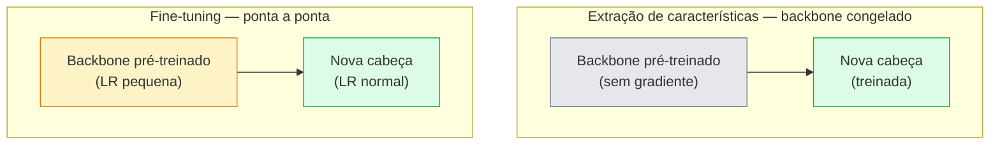

# Transfer Learning & Fine-Tuning

> Alguém gastou um milhão de horas de GPU ensinando uma rede como são bordas, texturas e partes de objetos. Você deveria pegar essas características emprestadas antes de treinar as suas.

**Tipo:** Construção
**Linguagens:** Python
**Pré-requisitos:** Phase 4 Lesson 03 (CNNs), Phase 4 Lesson 04 (Classificação de Imagens)
**Tempo:** ~75 minutos

## Objetivos de Aprendizado

- Distinguir extração de características de fine-tuning e escolher o correto com base no tamanho do dataset, distância do domínio e orçamento de computação
- Carregar um backbone pré-treinado, substituir sua cabeça classificadora e treinar apenas a cabeça para uma linha de base funcional em menos de 20 linhas
- Descongelar camadas progressivamente com taxas de aprendizado discriminativas para que características genéricas iniciais recebam atualizações menores do que as tardias específicas da tarefa
- Diagnosticar as três falhas comuns: deriva de características por LR muito alta em blocos descongelados, colapso das estatísticas de BN em datasets pequenos e esquecimento catastrófico

## O Problema

Treinar um ResNet-50 na ImageNet custa cerca de 2.000 horas de GPU. Muito poucas equipes têm esse orçamento para cada tarefa que entregam. O que quase toda equipe realmente entrega é um backbone pré-treinado com uma nova cabeça treinada em algumas centenas ou milhares de imagens específicas da tarefa.

Isso não é um atalho. O primeiro bloco convolucional de qualquer CNN treinada na ImageNet aprende bordas e filtros tipo Gabor. Os próximos blocos aprendem texturas e motivos simples. Os blocos do meio aprendem partes de objetos. Os blocos finais aprendem combinações que começam a se parecer com as 1.000 categorias da ImageNet. Os primeiros 90% dessa hierarquia transferem-se quase inalterados para imagens médicas, inspeção industrial, dados de satélite e toda outra tarefa de visão — porque a natureza tem um vocabulário limitado de bordas e texturas. Os últimos 10% são o que você realmente treina.

Acertar o transfer learning tem três bugs esperando por você: destruir características pré-treinadas com uma taxa de aprendizado muito alta, privar o modelo de informação congelando demais e deixar as estatísticas correntes do BatchNorm derivarem para um dataset minúsculo que o resto da rede nunca aprendeu. Esta lição caminha por cada um deles propositalmente.

## O Conceito

### Extração de características vs fine-tuning

Dois regimes, escolhidos por quanto você confia nas características pré-treinadas e quantos dados você tem.



Regras práticas:

| Tamanho do dataset | Distância do domínio | Receita |
|-------------------|---------------------|---------|
| < 1k imagens | próximo da ImageNet | Congelar backbone, treinar só a cabeça |
| 1k-10k | próximo | Congelar primeiros 2-3 estágios, ajustar fino do resto |
| 10k-100k | qualquer | Fine-tuning ponta a ponta com LR discriminativa |
| 100k+ | distante | Fine-tuning de tudo; considerar treinar do zero se o domínio for distante o suficiente |

"Próximo da ImageNet" significa aproximadamente fotos RGB naturais com conteúdo de objeto. Tomografias médicas, imagens de satélite e microscopia são domínios distantes — as características ainda ajudam, mas você precisará deixar mais camadas se adaptarem.

### Por que congelar funciona

As características da ImageNet que uma CNN aprende não são especializadas para as 1.000 categorias. Elas são especializadas para as estatísticas de imagens naturais: bordas em orientações específicas, texturas, padrões de contraste, primitivas de forma. Essas estatísticas são estáveis em quase todos os domínios visuais que um humano pode nomear. É por isso que um modelo treinado na ImageNet e avaliado zero-shot no CIFAR-10 com apenas uma nova cabeça linear (sem fine-tuning do backbone) atinge 80%+ de acurácia. A cabeça está aprendendo quais das características já aprendidas ponderar para esta tarefa.

### Taxas de aprendizado discriminativas

Quando você descongela, as camadas iniciais devem treinar mais devagar que as tardias. Camadas iniciais codificam características genéricas que você quer preservar; camadas tardias codificam estrutura específica da tarefa que você precisa mover muito.

```
Receita típica:

  estágio 0 (stem + primeiro grupo): lr = base_lr / 100    (principalmente fixo)
  estágio 1:                           lr = base_lr / 10
  estágio 2:                           lr = base_lr / 3
  estágio 3 (último grupo backbone): lr = base_lr
  cabeça:                            lr = base_lr  (ou ligeiramente maior)
```

No PyTorch, isso é apenas uma lista de grupos de parâmetros passada ao otimizador. Um modelo, cinco taxas de aprendizado, zero código extra.

### O problema do BatchNorm

Camadas BN mantêm buffers `running_mean` e `running_var` que foram calculados na ImageNet. Se sua tarefa tem uma distribuição de pixels diferente — iluminação diferente, sensor diferente, espaço de cor diferente — esses buffers estão errados. Três opções em ordem de preferência:

1. **Fine-tune com BN em modo train.** Deixe a BN atualizar suas estatísticas correntes junto com todo o resto. Escolha padrão quando o dataset da tarefa é de tamanho médio (>= 5k exemplos).
2. **Congelar BN em modo eval.** Mantenha as estatísticas da ImageNet e treine apenas os pesos. Correto quando seu dataset é pequeno o suficiente para que a média móvel da BN seja ruidosa.
3. **Substituir BN por GroupNorm.** Remove o problema de média móvel completamente. Usado em backbones de detecção e segmentação onde o tamanho do lote por GPU é minúsculo.

Errar isso silenciosamente derruba a acurácia em 5-15%.

### Design da cabeça

A cabeça classificadora é 1-3 camadas lineares mais um dropout opcional. Todo backbone do torchvision vem com uma cabeça padrão que você substitui:

```
backbone.fc = nn.Linear(backbone.fc.in_features, num_classes)          # ResNet
backbone.classifier[1] = nn.Linear(..., num_classes)                    # EfficientNet, MobileNet
backbone.heads.head = nn.Linear(..., num_classes)                       # torchvision ViT
```

Para datasets pequenos, uma única camada linear geralmente é suficiente. Adicionar uma camada oculta (Linear -> ReLU -> Dropout -> Linear) ajuda quando a distribuição da tarefa está mais distante da distribuição de treinamento do backbone.

### Decaimento de LR por camada

Uma versão mais suave da LR discriminativa usada em fine-tuning moderno (BEiT, DINOv2, ViT-B). Em vez de agrupar camadas em estágios, dê a cada camada uma LR ligeiramente menor que a acima dela:

```
lr_camada_k = base_lr * decay^(L - k)
```

Com decay = 0.75 e L = 12 blocos transformer, o primeiro bloco treina a `0.75^11 ≈ 0.04x` a LR da cabeça. Importa mais para fine-tunes de transformer do que para CNNs, onde LRs agrupadas por estágio geralmente são suficientes.

### O que avaliar

Execuções de transfer learning precisam de dois números que você não acompanharia em uma execução do zero:

- **Acurácia só pré-treinada** — a acurácia da cabeça com o backbone congelado. Este é seu piso.
- **Acurácia com fine-tuning** — o mesmo modelo após treinamento ponta a ponta. Este é seu teto.

Se a acurácia com fine-tuning for menor que a só pré-treinada, você tem um bug de taxa de aprendizado ou BN. Sempre imprima ambos.

## Construa

### Passo 1: Carregar um backbone pré-treinado e inspecioná-lo

```python
import torch
import torch.nn as nn
from torchvision.models import resnet18, ResNet18_Weights

backbone = resnet18(weights=ResNet18_Weights.IMAGENET1K_V1)
print(backbone)
print()
print("cabeça classificadora:", backbone.fc)
print("dimensão de características:", backbone.fc.in_features)
```

`ResNet18` tem quatro estágios (`layer1..layer4`) mais um stem e uma cabeça `fc`. Todo backbone de classificação do torchvision tem uma estrutura análoga.

### Passo 2: Extração de características — congelar tudo, substituir a cabeça

```python
def fazer_extrator_caracteristicas(num_classes=10):
    model = resnet18(weights=ResNet18_Weights.IMAGENET1K_V1)
    for p in model.parameters():
        p.requires_grad = False
    model.fc = nn.Linear(model.fc.in_features, num_classes)
    return model

model = fazer_extrator_caracteristicas(num_classes=10)
treinavel = sum(p.numel() for p in model.parameters() if p.requires_grad)
congelado = sum(p.numel() for p in model.parameters() if not p.requires_grad)
print(f"treinável: {treinavel:>10,}")
print(f"congelado: {congelado:>10,}")
```

Apenas `model.fc` é treinável. O backbone é um extrator de características congelado.

### Passo 3: Fine-tuning discriminativo

Uma utilidade que constrói grupos de parâmetros com taxas de aprendizado específicas de estágio.

```python
def grupos_param_discriminativos(model, base_lr=1e-3, decay=0.3):
    stages = [
        ["conv1", "bn1"],
        ["layer1"],
        ["layer2"],
        ["layer3"],
        ["layer4"],
        ["fc"],
    ]
    groups = []
    for i, nomes in enumerate(stages):
        lr = base_lr * (decay ** (len(stages) - 1 - i))
        params = [p for n, p in model.named_parameters()
                  if any(n.startswith(k) for k in nomes)]
        if params:
            groups.append({"params": params, "lr": lr, "name": "_".join(nomes)})
    return groups

model = resnet18(weights=ResNet18_Weights.IMAGENET1K_V1)
model.fc = nn.Linear(model.fc.in_features, 10)
for p in model.parameters():
    p.requires_grad = True

groups = grupos_param_discriminativos(model)
for g in groups:
    print(f"{g['name']:>10s}  lr={g['lr']:.2e}  params={sum(p.numel() for p in g['params']):>8,}")
```

`decay=0.3` significa que cada estágio treina a 30% da taxa do próximo. `fc` recebe `base_lr`, `layer4` recebe `0.3 * base_lr`, `conv1` recebe `0.3^5 * base_lr ≈ 0.00243 * base_lr`. Parece extremo; empiricamente funciona.

### Passo 4: Gerenciamento do BatchNorm

Auxiliar para congelar as estatísticas correntes da BN sem congelar seus pesos.

```python
def congelar_estatisticas_bn(model):
    for m in model.modules():
        if isinstance(m, (nn.BatchNorm1d, nn.BatchNorm2d, nn.BatchNorm3d)):
            m.eval()
            for p in m.parameters():
                p.requires_grad = False
    return model
```

Chame-o depois de definir `model.train()` no início de cada época. `model.train()` coloca tudo em modo de treinamento; isso reverte apenas para camadas BN.

### Passo 5: Um loop minimalista de fine-tuning ponta a ponta

```python
from torch.optim import SGD
from torch.utils.data import DataLoader
from torch.optim.lr_scheduler import CosineAnnealingLR
import torch.nn.functional as F

def fine_tune(model, loader_treino, loader_val, device, epochs=5, base_lr=1e-3, congelar_bn=False):
    model = model.to(device)
    groups = grupos_param_discriminativos(model, base_lr=base_lr)
    optimizer = SGD(groups, momentum=0.9, weight_decay=1e-4, nesterov=True)
    scheduler = CosineAnnealingLR(optimizer, T_max=epochs)

    for epoch in range(epochs):
        model.train()
        if congelar_bn:
            congelar_estatisticas_bn(model)
        tr_loss, tr_correct, tr_total = 0.0, 0, 0
        for x, y in loader_treino:
            x, y = x.to(device), y.to(device)
            logits = model(x)
            loss = F.cross_entropy(logits, y, label_smoothing=0.1)
            optimizer.zero_grad()
            loss.backward()
            optimizer.step()
            tr_loss += loss.item() * x.size(0)
            tr_total += x.size(0)
            tr_correct += (logits.argmax(-1) == y).sum().item()
        scheduler.step()

        model.eval()
        va_total, va_correct = 0, 0
        with torch.no_grad():
            for x, y in loader_val:
                x, y = x.to(device), y.to(device)
                pred = model(x).argmax(-1)
                va_total += x.size(0)
                va_correct += (pred == y).sum().item()
        print(f"época {epoch}  treino {tr_loss/tr_total:.3f}/{tr_correct/tr_total:.3f}  "
              f"val {va_correct/va_total:.3f}")
    return model
```

Cinco épocas com a receita acima no CIFAR-10 leva `ResNet18-IMAGENET1K_V1` de ~70% de acurácia zero-shot (linear probe) para ~93% de acurácia com fine-tuning. A cabeça sozinha estacionaria em torno de 86% sem nunca tocar no backbone.

### Passo 6: Descongelamento progressivo

Um agendamento que descongela um estágio por época do final para o início. Mitiga a deriva de características ao custo de algumas épocas extras.

```python
def agendamento_descongelamento_progressivo(model):
    stages = ["layer4", "layer3", "layer2", "layer1"]
    liberados = set()

    def iniciar():
        for p in model.parameters():
            p.requires_grad = False
        for p in model.fc.parameters():
            p.requires_grad = True

    def descongelar(epoch):
        if epoch < len(stages):
            nome = stages[epoch]
            liberados.add(nome)
            for n, p in model.named_parameters():
                if n.startswith(nome):
                    p.requires_grad = True
            return nome
        return None

    return iniciar, descongelar
```

Chame `iniciar()` uma vez antes da primeira época. Chame `descongelar(epoch)` no início de cada época. Reconstrua o otimizador sempre que o conjunto de parâmetros treináveis mudar, caso contrário os parâmetros congelados ainda mantêm momentos em cache que o confundem.

## Use

Para a maioria das tarefas reais, `torchvision.models` + três linhas é suficiente. A maquinaria mais pesada acima importa quando você encontra os problemas que os padrões da biblioteca não conseguem corrigir.

```python
from torchvision.models import resnet50, ResNet50_Weights

model = resnet50(weights=ResNet50_Weights.IMAGENET1K_V2)
model.fc = nn.Linear(model.fc.in_features, num_classes)
optimizer = torch.optim.AdamW(model.parameters(), lr=1e-4, weight_decay=1e-4)
```

Dois outros padrões de nível de produção:

- `timm` oferece ~800 backbones de visão pré-treinados com uma API consistente (`timm.create_model("resnet50", pretrained=True, num_classes=10)`). Para qualquer fine-tune além do zoológico do torchvision, é o padrão.
- Para transformers, `transformers.AutoModelForImageClassification.from_pretrained(name, num_labels=N)` te dá ViT / BEiT / DeiT com a mesma semântica de carregamento que modelos de texto.

## Entregue

Esta lição produz:

- `outputs/prompt-fine-tune-planner.md` — um prompt que escolhe extração de características vs progressivo vs ponta a ponta com base no tamanho do dataset, distância do domínio e orçamento de computação.
- `outputs/skill-freeze-inspector.md` — uma skill que, dado um modelo PyTorch, reporta quais parâmetros são treináveis, quais camadas BatchNorm estão em modo eval e se o otimizador está realmente recebendo os parâmetros treináveis.

## Exercícios

1. **(Fácil)** Treine um `ResNet18` como sonda linear (backbone congelado) e como fine-tuning completo no mesmo dataset CIFAR sintético. Reporte ambas as acurácias lado a lado. Explique qual lacuna te diz que as características transferem bem e qual te diz que não transferem.
2. **(Médio)** Introduza um bug propositalmente: defina `base_lr = 1e-1` no estágio do backbone em vez da cabeça. Mostre a loss de treino explodir, depois recupere aplicando o auxiliar `grupos_param_discriminativos`. Registre a LR na qual cada estágio começa a divergir.
3. **(Difícil)** Pegue um dataset de imagens médicas (e.g. CheXpert-small, PatchCamelyon ou HAM10000) e compare três regimes: (a) backbone pré-treinado congelado + cabeça linear; (b) fine-tuning ponta a ponta pré-treinado; (c) treino do zero. Reporte acurácia e custo computacional para cada um. Em qual tamanho de dataset o treino do zero se torna competitivo?

## Termos-Chave

| Termo | O que as pessoas dizem | O que realmente significa |
|-------|------------------------|---------------------------|
| Extração de características | "Congelar e treinar cabeça" | Parâmetros do backbone congelados, apenas a nova cabeça classificadora recebe gradiente |
| Fine-tuning | "Retreinar ponta a ponta" | Todos os parâmetros treináveis, geralmente com LR muito menor que treino do zero |
| LR discriminativa | "LR menor para camadas iniciais" | Grupos de parâmetros do otimizador onde a LR do estágio inicial é uma fração da LR do estágio final |
| Decaimento de LR por camada | "Gradiente de LR suave" | LR por camada multiplicada por decay^(L - k); comum em fine-tunes de transformer |
| Esquecimento catastrófico | "O modelo perdeu a ImageNet" | Uma LR muito alta sobrescreve características pré-treinadas antes que o sinal da nova tarefa seja aprendido |
| Deriva de estatísticas BN | "Média corrente está errada" | running_mean/var da BN calculados em uma distribuição diferente da tarefa atual, prejudicando silenciosamente a acurácia |
| Sonda linear | "Backbone congelado + cabeça linear" | Avaliação de características pré-treinadas — acurácia do melhor classificador linear no topo da representação congelada |
| Colapso catastrófico | "Tudo prevê uma classe" | Acontece quando o fine-tuning tem LR alta o suficiente para destruir características antes que os gradientes da cabeça possam estabilizar |

## Leitura Complementar

- [How transferable are features in deep neural networks? (Yosinski et al., 2014)](https://arxiv.org/abs/1411.1792) — o paper que quantificou a transferibilidade de características entre camadas
- [Universal Language Model Fine-tuning (ULMFiT, Howard & Ruder, 2018)](https://arxiv.org/abs/1801.06146) — a receita original de LR discriminativa / descongelamento progressivo; as ideias transferem diretamente para visão
- [timm documentation](https://huggingface.co/docs/timm) — a referência para backbones de visão modernos e os padrões exatos de fine-tuning com que foram treinados
- [A Simple Framework for Linear-Probe Evaluation (Kornblith et al., 2019)](https://arxiv.org/abs/1805.08974) — por que a acurácia de sonda linear importa e como reportá-la corretamente
